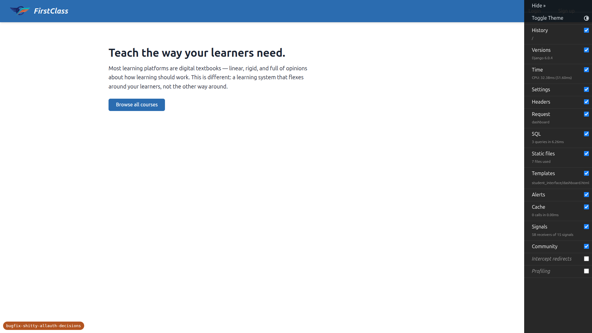
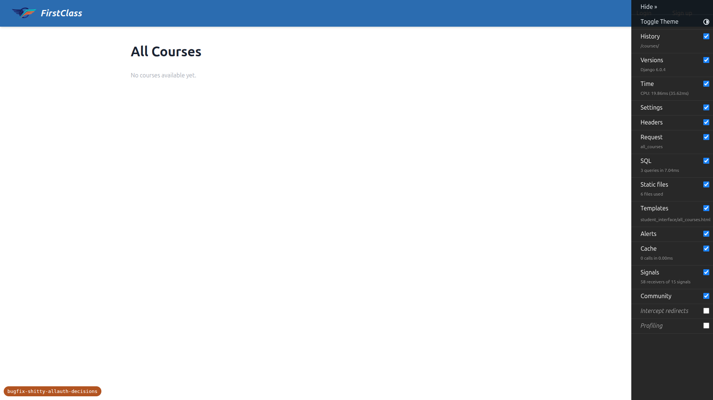
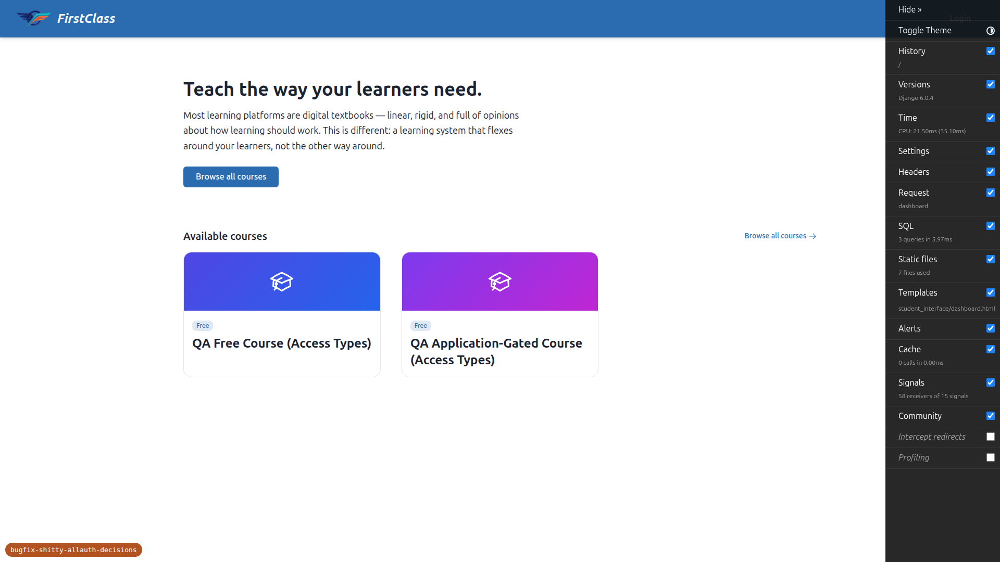
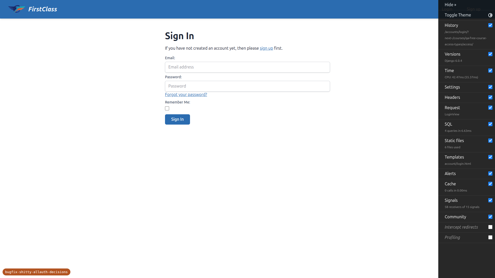
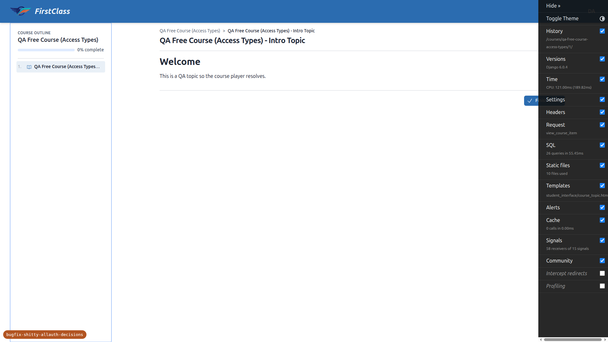
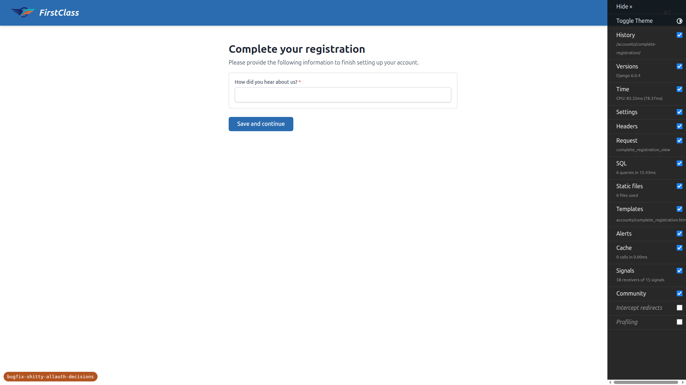
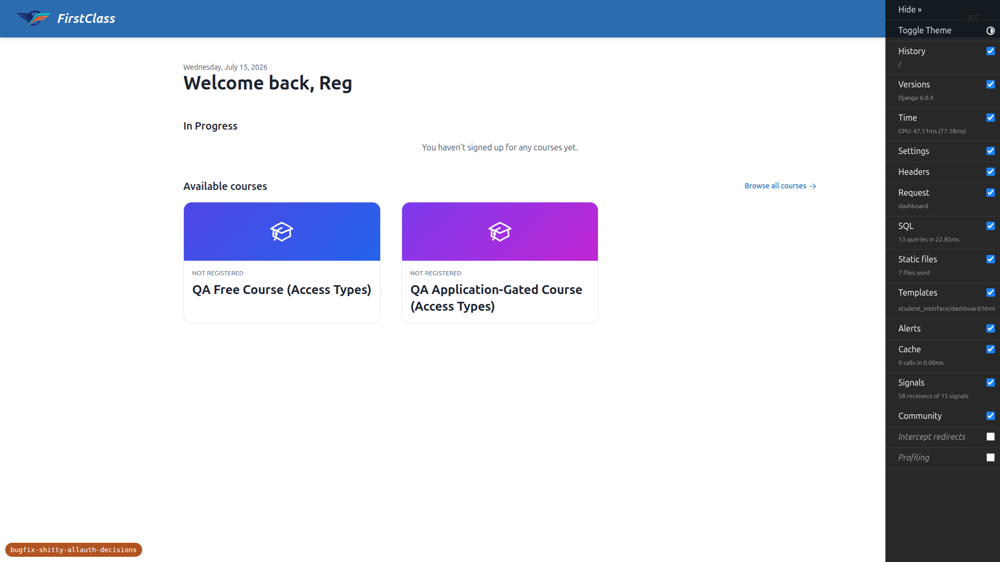
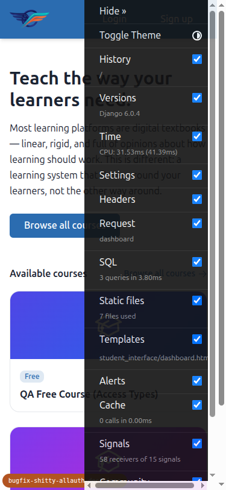
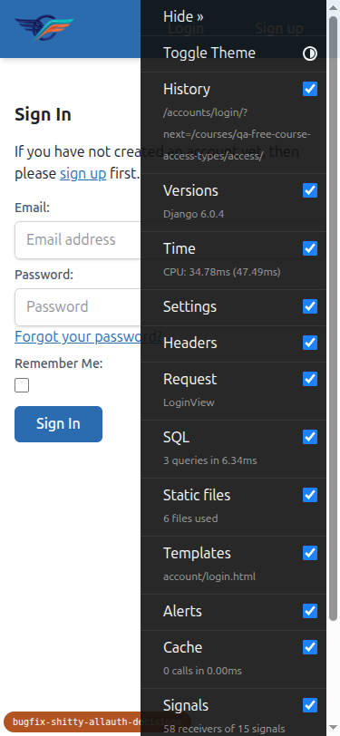
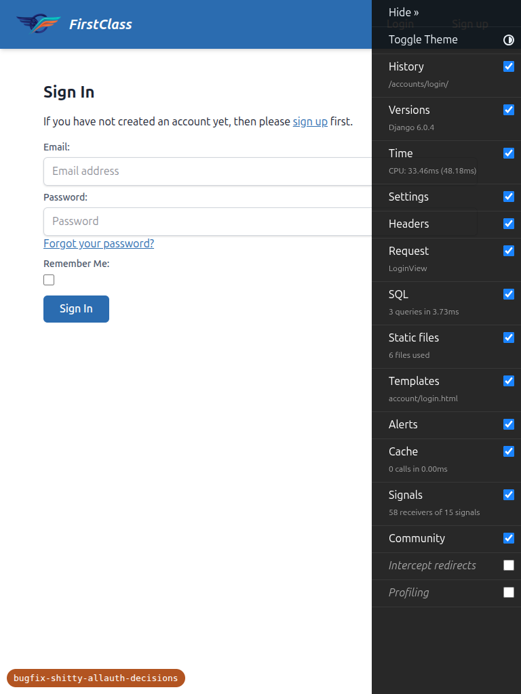

# QA Report: vanilla allauth login after removing `next`-threading

**Branch:** `bugfix-shitty-allauth-decisions`
**Site:** DemoDev (dev forces `FORCE_SITE_NAME="DemoDev"`, so every request resolves to DemoDev regardless of port)
**Server:** `http://127.0.0.1:8999`
**Date:** 2026-07-15
**Result:** ✅ **All tests passed. No bugs found.**

Every test in `3. frontend_qa.md` was executed with Playwright MCP across desktop (1920×1080),
mobile (375×812) and tablet (768×1024). Test data (free/gated courses, a complete student, and the
DemoDev signup policy with an additional registration form) was provisioned via the
`fls:qa-data-helper` agent — see *Notes* below.

---

## Test results

| Test | Description | Result |
|---|---|---|
| 1 | Anonymous header Login/Sign-up links have **no** `?next=` (home page) | ✅ PASS |
| 1b | Same, on a deeper page (`/courses/`) — no `?next=/courses/` appended | ✅ PASS |
| 1c | Signups disabled hides the Sign-up link, Login stays | ✅ PASS |
| 2 | Vanilla `@login_required` carries an existing user back to the free-course CTA | ✅ PASS |
| 2b | Application-gated `apply` CTA — no auto-POST, lands on GET confirmation page | ✅ PASS |
| 3 | Forced registration-completion drops the destination → lands on site home | ✅ PASS |

---

## Test 1 — Anonymous header links have no `?next=` ✅

On the anonymous home page the header **Login** link `href` is exactly `/accounts/login/` and the
**Sign up** link is exactly `/accounts/signup/` — neither carries a `?next=` query string. The
`login_prompt.html` revert is in place.

### 1b — Deeper page, still no `?next=` ✅

On `/courses/` (a non-home page) the header **Login** link is still bare `/accounts/login/` with **no**
`?next=/courses/`. The old path-appending behaviour is gone.

### 1c — Signups disabled hides the Sign-up link ✅

With DemoDev `SiteSignupPolicy.allow_signups=False` (toggled by `fls:qa-data-helper`, then restored to
`True`), the anonymous header shows the **Login** link (`/accounts/login/`) but the **Sign up** link is
**absent**.

---

## Test 2 — Vanilla `@login_required` carries an existing user back to the CTA ✅

1. Anonymous visit to `/courses/qa-free-course-access-types/access/` redirected to
   `/accounts/login/?next=/courses/qa-free-course-access-types/access/` — the `?next=` is
   **Django-generated by `@login_required`**, exactly as intended.

   

2. After logging in as the existing complete student (`demodev_access_learner@email.com`), the user was
   enrolled and dropped straight into the course at `/courses/qa-free-course-access-types/1/` — i.e.
   back to the original destination, **not** the home page.

   

### 2b — Application-gated `apply` CTA, no auto-POST ✅

1. Anonymous visit to the gated apply CTA redirected to
   `/accounts/login/?next=/applications/apply/qa-application-gated-course-access-types/`.
2. After login, the user landed on the **apply confirmation page** (HTTP 200 GET) showing a
   "Submit application" button and a Cancel link. The application was **not** auto-submitted — it waits
   for the user to click Submit.

   

> Path note (not a bug): the test plan refers to the apply CTA as `/apply/<slug>/`, but the route is
> actually mounted at `/applications/apply/<slug>/` (`course_applications:apply`). The **behaviour**
> under test — vanilla `@login_required` → `?next=` → GET confirmation with no auto-POST — is correct.

---

## Test 3 — Registration-completion trade-off (destination deliberately dropped) ✅

1. Anonymous visit to `/courses/qa-free-course-access-types/access/` redirected to
   `/accounts/login/?next=/courses/qa-free-course-access-types/access/`.
2. Followed the in-page **Sign up** link and registered a brand-new account
   (`qa_reg_completion_test@email.com`), then confirmed the email via the link captured in Mailpit.
3. After email confirmation + auto-login, `RegistrationCompletionMiddleware` intercepted the user and
   sent them to **`/accounts/complete-registration/`**. The URL carries **no** `?next=` for the course —
   the original destination is gone at this point, as expected.

   

4. Submitting the completion form ("How did you hear about us?") landed the user on the **site home**
   (`/`, i.e. `LOGIN_REDIRECT_URL`) — **not** back on the course access CTA.

   

This confirms the *accepted* consequence of the revert: a user forced through registration completion
loses their original destination and lands on the home page.

---

## Responsive checks (mobile 375×812 & tablet 768×1024)

The change touches the header nav (`login_prompt.html`) and server-side redirect behaviour. Both were
re-verified on mobile and tablet:

- Header **Login** / **Sign up** links render inline without overflow and remain bare (`/accounts/login/`,
  `/accounts/signup/`, no `?next=`).
- The `@login_required` redirect (`?next=`) behaves identically — viewport does not affect it.
- The login form renders at a usable width on both sizes.

| Mobile home header | Mobile login form |
|---|---|
|  |  |

| Tablet home header | Tablet login form |
|---|---|
|  |  |

---

## Notes / observations (nothing tested was skipped)

- **Test data provisioning (`fls:qa-data-helper`).** The DemoDev catalogue was initially empty, so the
  helper created the free course (`qa-free-course-access-types`), the application-gated course
  (`qa-application-gated-course-access-types`), a complete student
  (`demodev_access_learner@email.com`), and configured the DemoDev `SiteSignupPolicy`
  (`allow_signups=True`, one `additional_registration_forms` entry). To satisfy "new signups are gated
  but the seeded student stays complete", the helper added a **dev-only `qa_helpers` app**
  (`freedom_ls/qa_helpers/` — a `QARegistrationCompletion` model, a `QAProfileCompletionForm`, a
  factory, one applied migration, and a re-runnable management command). This is QA scaffolding created
  by the data helper, not code under test — flagging it so it is not mistaken for part of the feature
  branch.
- **Policy toggle for Test 1c** was applied and then restored, so DemoDev ends this run with
  `allow_signups=True` and the full scenario intact.
- **Spec path discrepancy** for the apply CTA (`/apply/…` in the plan vs. `/applications/apply/…` in the
  code) is documented under Test 2b. It did not affect any pass/fail outcome.
