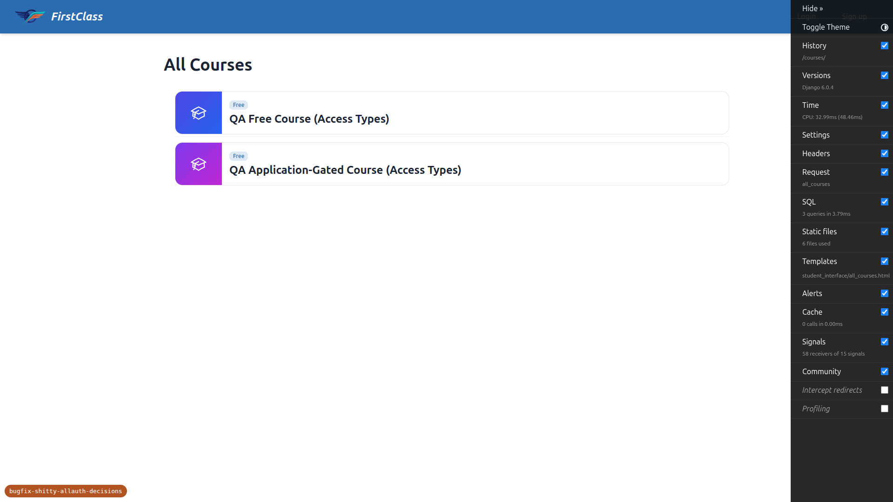
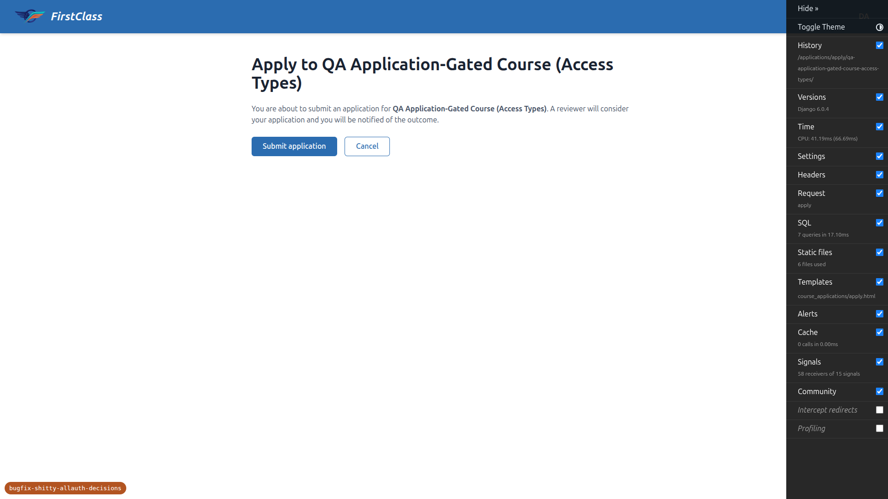
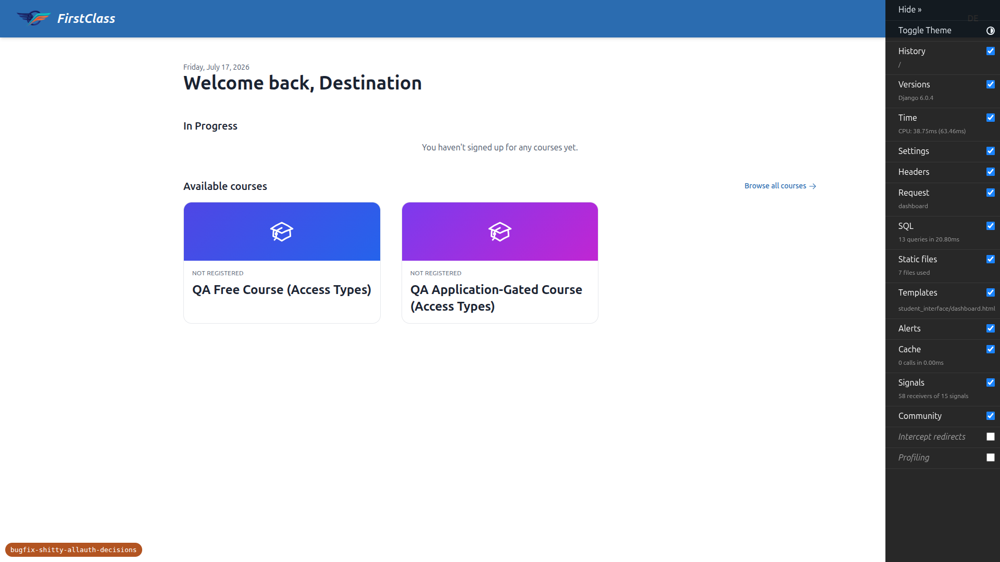
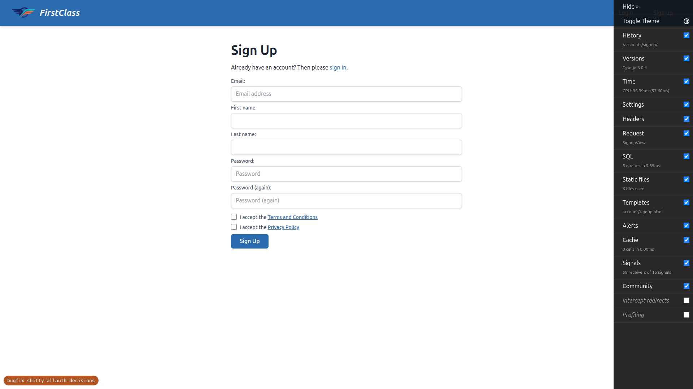
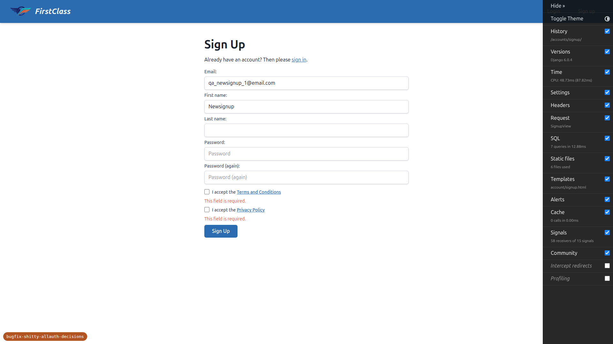
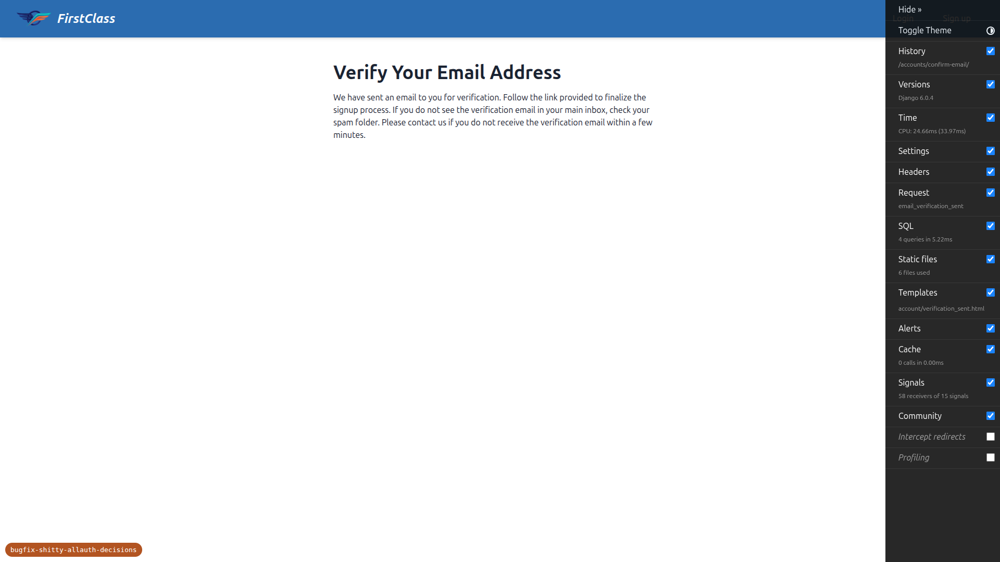
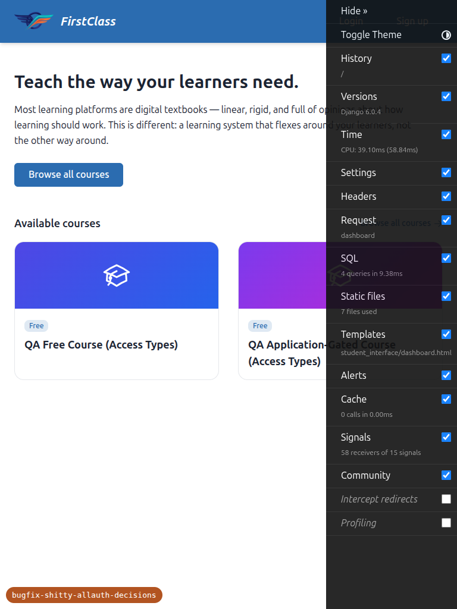
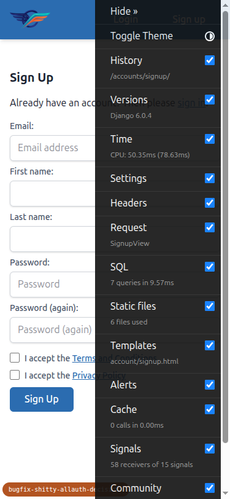
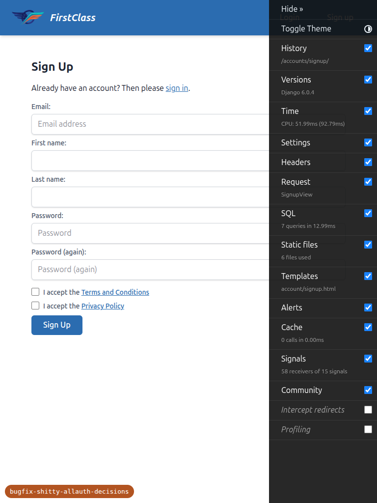
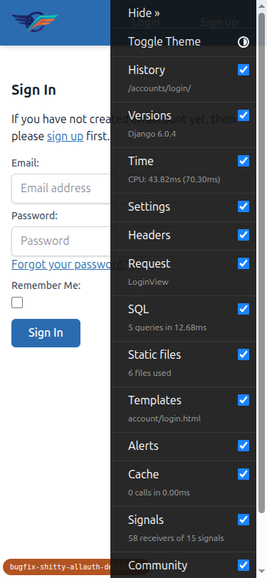

# QA Report: vanilla allauth login after removing `next`-threading

**Feature under test:** the revert of the home-feature `next`-threading allauth customisations.
**Site:** DemoDev (dev server forces `FORCE_SITE_NAME="DemoDev"`, so every request resolves to
DemoDev; its brand renders as "FirstClass").
**Tooling:** Playwright MCP at desktop 1920×1080, mobile 375×812, tablet 768×1024. Test data was
created/verified by the `fls:qa-data-helper` agent; the confirmation emails were read from the
local Mailpit catcher (SMTP :1025 / UI :8025).

## Result: PASS — no failing tests, no skipped tests

Every test in the plan (1, 1b, 1c, 2, 2b, 3, 4a, 4b, 4c, 4d) was executed and passed. Two
environment/doc observations are recorded below; neither is a product defect.

---

## Test results

### Test 1 — Anonymous header Login/Sign-up links have NO `?next=` — PASS
Home page (`/`), anonymous. Header **Login** → `/accounts/login/` and **Sign up** →
`/accounts/signup/`, both bare (no `?next=`).

### Test 1b — Deeper page, still no `?next=` — PASS
On `/courses/`, the header **Login** link is still `/accounts/login/` (no `?next=/courses/`) and
**Sign up** is still `/accounts/signup/`.

### Test 1c — Signups disabled hides the Sign-up link — PASS
With DemoDev `SiteSignupPolicy.allow_signups=False` (set via `fls:qa-data-helper`), the anonymous
header shows only **Login** (`/accounts/login/`) — the **Sign up** link is absent. `allow_signups`
was restored to `True` afterwards.

### Test 2 — Vanilla `@login_required` carries an existing user back to the CTA — PASS
Anonymous visit to `/courses/qa-free-course-access-types/access/` redirected to
`/accounts/login/?next=/courses/qa-free-course-access-types/access/` (Django-generated `next`).
After logging in as the complete student `demodev_access_learner@email.com`, the user landed on the
course content (`/courses/qa-free-course-access-types/1/` — the Intro Topic), i.e. back at the
original destination.

### Test 2b — Application-gated apply page, no auto-POST — PASS
Anonymous visit to the apply CTA redirected to
`/accounts/login/?next=/applications/apply/qa-application-gated-course-access-types/`. After login,
the user landed on the **apply confirmation page** (GET, HTTP 200) showing "Submit application" /
"Cancel" — it did **not** auto-submit an application.

> Note (doc slip, not a defect): the test plan lists the apply CTA as `/apply/<gated-slug>/`, which
> 404s. The application URLs are mounted under `/applications/`, so the real path is
> `/applications/apply/<slug>/` (`config/urls.py:71`). The test was executed against the correct
> path. Consider fixing the URL in the test plan.

### Test 3 — Registration-completion trade-off (destination deliberately dropped) — PASS
Exercised rigorously by threading a course destination through the whole signup flow:
1. Anonymous → `/courses/qa-free-course-access-types/access/` → redirect to
   `/accounts/login/?next=/courses/qa-free-course-access-types/access/`.
2. Followed the **Sign up** link (which carried `?next=/courses/qa-free-course-access-types/access/`),
   registered a brand-new account, and completed email verification.
3. After verification, the middleware sent the user to `/accounts/complete-registration/` — a bare
   URL that does **not** carry the course `?next=`.

   

4. After submitting the completion form, the user landed on the **site home** (`/`,
   `LOGIN_REDIRECT_URL`) — **not** back on the course CTA. The original destination was
   deliberately dropped, exactly the accepted trade-off of the revert.

(A first pass via a direct signup — no threaded destination — likewise landed on home after
completion.)

### Test 4a — Signup form renders the better-registration fields — PASS
Signup form fields: **email** (required), **first name** (required), **last name** (optional),
**password**, **password confirmation**. No email-confirmation (`email2`) field is present (the
only extra input is a hidden `_hp` honeypot).

### Test 4b — T&C + Privacy clickwrap consent is captured — PASS
Two separate, initially-unchecked checkboxes — **Accept Terms** (→ `/accounts/legal/terms/`) and
**Accept Privacy Policy** (→ `/accounts/legal/privacy/`). Submitting with the boxes unchecked (with
the HTML `required` attributes stripped, to prove server-side enforcement) was **blocked** — the
form re-rendered with "This field is required." on both fields and no account was created.

Consent audit (verified in-DB via `fls:qa-data-helper`): each new signup
(`qa_newsignup_1@email.com`, `qa_newsignup_2@email.com`) has **exactly two** `LegalConsent` rows —
one `document_type="terms"`, one `document_type="privacy"` — each with a non-empty `git_hash`,
`document_version="1.0"`, a `timestamp`, and `consent_method="signup_checkbox"`, on the DemoDev
site.

### Test 4c — Additional registration form gates and persists — PASS
The completion page rendered the configured additional form field
**"How did you hear about us? *"** (`QAProfileCompletionForm.how_did_you_hear`, required). After a
valid submit the user was "complete": re-visiting an internal page (`/courses/`) no longer bounced
back to `/accounts/complete-registration/`.

### Test 4d — `require_name=False` makes first name optional — PASS
With DemoDev `SiteSignupPolicy.require_name=False`, the signup form labelled the field
**"First name (optional):"** (not required), and a signup submitted with an empty first name
**succeeded** (advanced to email verification). `require_name` was restored to `True` afterwards.

---

## Responsive checks (mobile 375×812, tablet 768×1024)

The custom frontend surfaces touched by the revert render cleanly at all three viewports with **no
horizontal overflow**. The anonymous header uses the same inline Login/Sign-up links at every width
(a simple two-link nav — no hamburger/drawer involved), and the signup and login forms reflow to a
single readable column.

| Surface | Mobile | Tablet |
|---|---|---|
| Anonymous home header |  |  |
| Signup form |  |  |
| Login form |  | — |

---

## Tangential observations (investigated — not defects, no action needed)

1. **Application-gated course shows an "Enrol for free" CTA on its detail page (dev only).**
   `/courses/qa-application-gated-course-access-types/detail/` renders a primary CTA "Enrol for
   free" → `/access/` rather than "Apply now". An `fls:sdd-worker` probe traced this to
   `OVERRIDE_COURSE_ACCESS_TO_FREE = True` in `config/settings_dev.py` — a **documented dev/staging
   preview override** that short-circuits `VisibilityEnforcingBackend.get_access()`
   (`freedom_ls/course_access/backends.py:367-371`) to the canonical free decision for every course.
   With the override off (production default), `ApplicationCourseAccessBackend.get_access()`
   (`freedom_ls/course_applications/backends.py:117-129`) correctly yields "Apply now" →
   `/applications/apply/<slug>/`. This is expected behaviour, unrelated to the allauth revert, and
   did not affect Test 2b (which was exercised via the apply URL directly). No code change
   warranted.

2. **Test-plan apply URL is stale** — see the note under Test 2b. Suggest updating the plan from
   `/apply/<gated-slug>/` to `/applications/apply/<gated-slug>/`.

## Data / environment notes

- All test data was created/verified by the `fls:qa-data-helper` agent on the DemoDev site; no data
  was hand-created by the QA run. The DemoDev `SiteSignupPolicy` was left in its default state
  (`allow_signups=True`, `require_name=True`, `require_terms_acceptance=True`, additional form
  `QAProfileCompletionForm`) after the adversarial toggles for 1c and 4d.
- Legal docs (`legal_docs/_default/terms.md`, `privacy.md`) were confirmed committed to the branch,
  so the signup consent checkboxes rendered correctly.
