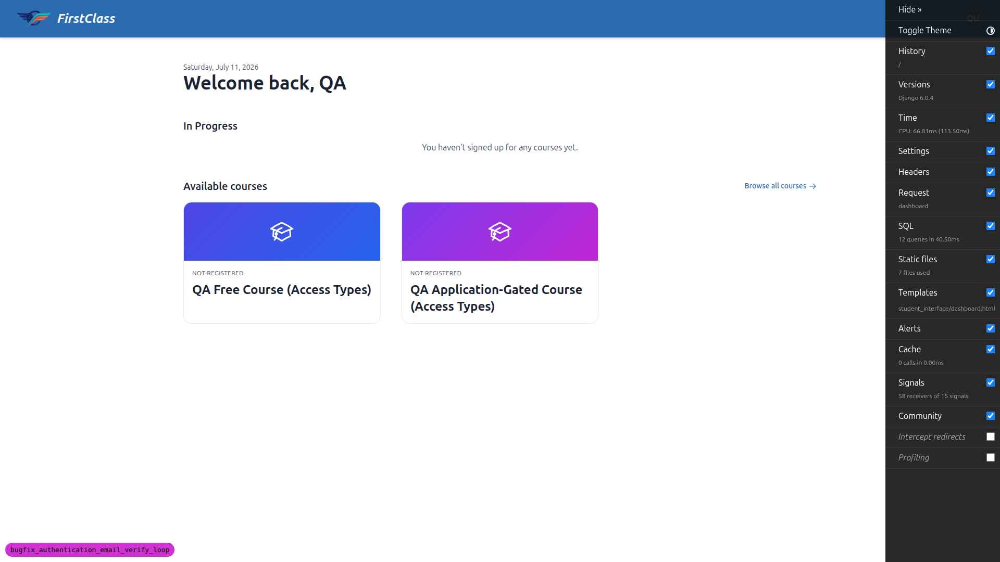
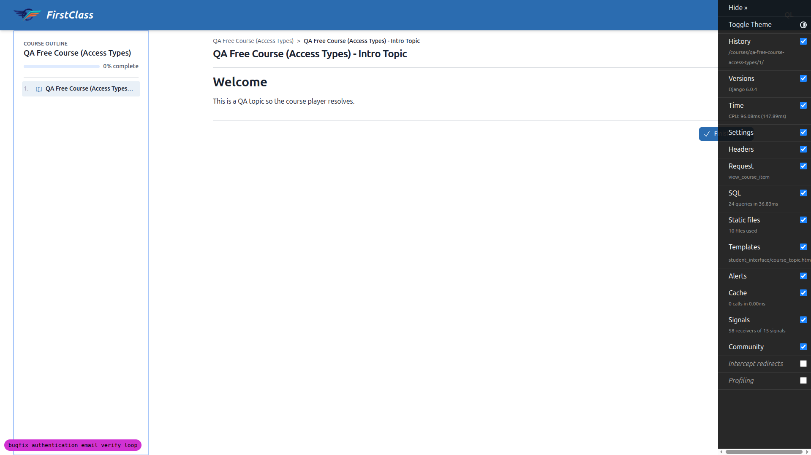
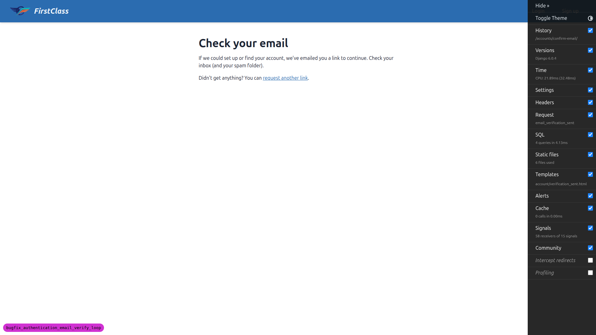
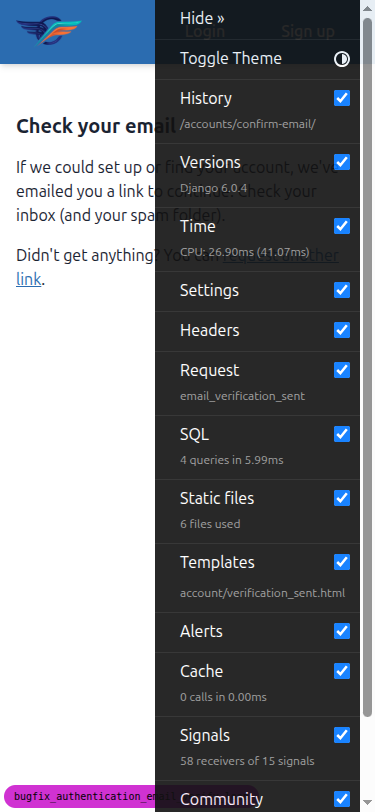
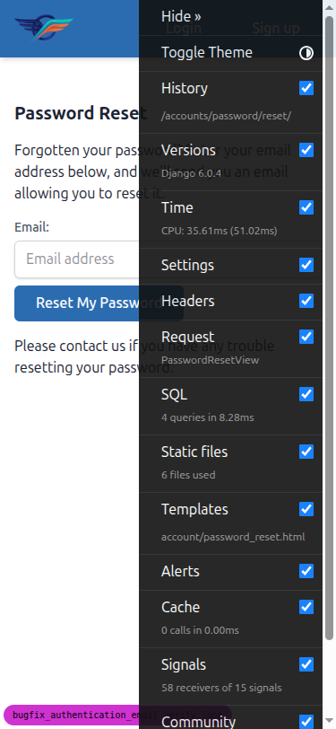
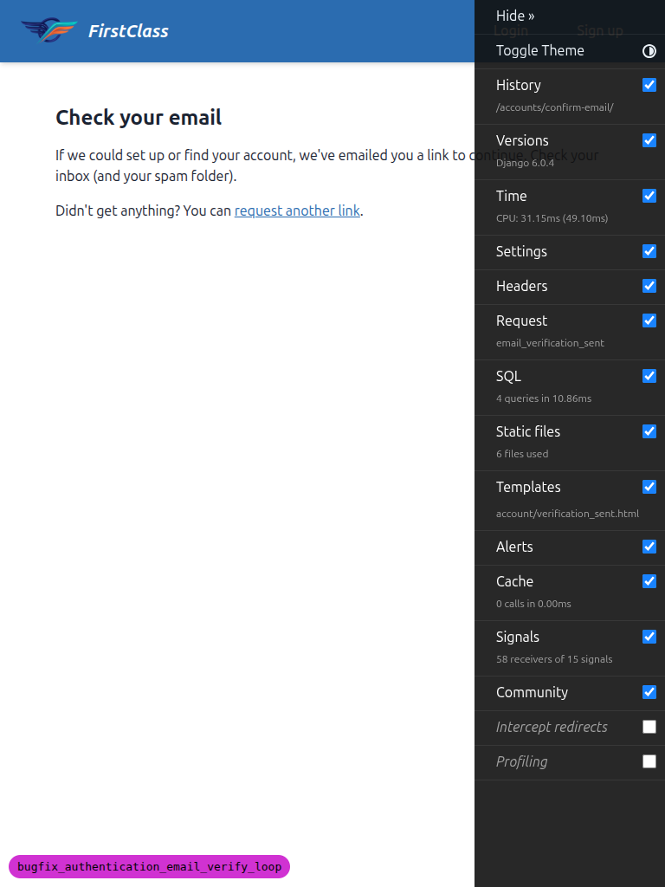
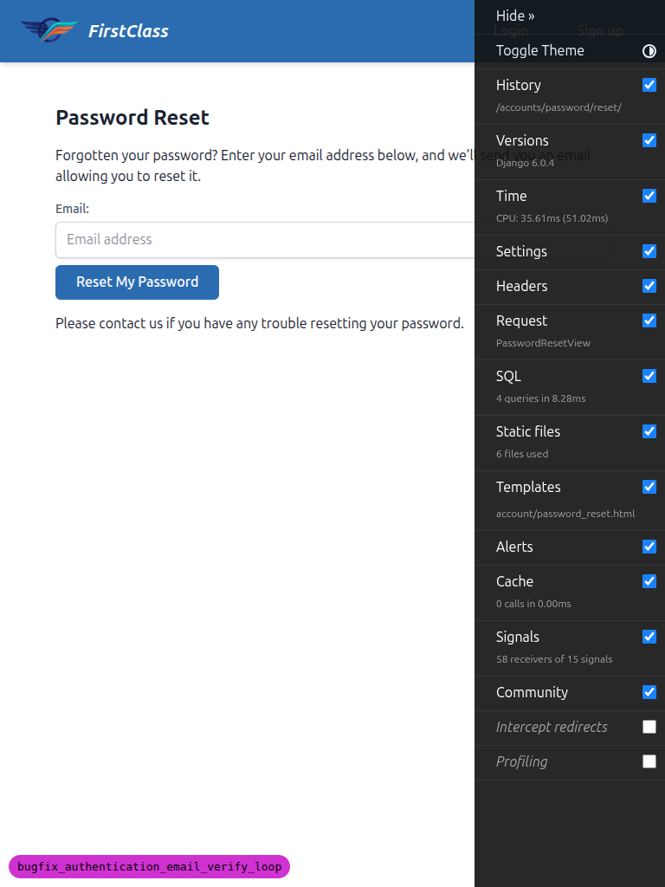

# QA Report — authentication email-verification loop bugfix

**Date:** 2026-07-11
**Site:** DemoDev (`FORCE_SITE_NAME="DemoDev"`)
**Server:** `runserver` on a random port (8864), branch `bugfix_authentication_email_verify_loop`
(confirmed via `debug-branch-badge`).
**Tooling:** Playwright MCP (browser-driven, as a human tester) + Mailpit (`http://localhost:8025`)
to confirm *which* email actually landed in the inbox — central to this bug.

**Outcome: all workflows PASS. No bugs found.** Two non-defect observations and one documented
residual limit are recorded below.

## Test data

Created on DemoDev via the `fls:qa-data-helper` agent (not by hand):
- **Free course** `qa-free-course-access-types` — detail at `/courses/qa-free-course-access-types/detail/`,
  CTA **"Enrol for free"** (true free/open access).
- **Verified control account** `qa-verified@email.com` (allauth `EmailAddress.verified=True`) — the
  enumeration regression control.
- A gated course (`qa-application-gated-course-access-types`) and an unenrolled learner came along
  with the helper command; harmless catalogue extras, unrelated to this bugfix.

Unverified accounts (`qa-unverified@`, `qa-loop2@`, `qa-block@`) were created **through the signup
UI** during the workflows — that is the flow under test.

---

## Results by workflow

### Workflow 1 — Unverified pre-existing account + honest verification-sent copy (Defect 3) — PASS
Signed up `qa-unverified@email.com`; landed on **"Check your email"** (`/accounts/confirm-email/`).
The copy is the corrected, honest, enumeration-safe wording:

> "If we could set up or find your account, we've emailed you a link to continue. Check your inbox
> (and your spam folder). Didn't get anything? You can **request another link**."

No "finalize the signup process" / no "verification link" phrasing (Defect 3 fixed). "request another
link" links to `/accounts/password/reset/`. Mailpit received a genuine **"Confirm your email address"**
message; the link was **not** clicked, so the account stays unverified (the bug's victim state).

### Workflow 2 — Unverified account resets password → logged in + verified (SC1, headline fix) — PASS
Requested a password reset for `qa-unverified@email.com`, opened the **reset** email in Mailpit,
clicked its keyed link, set a new password. Result: **logged in immediately**, landing on the
authenticated dashboard ("Welcome back, QA", logout present, no login link) — **not** bounced back to
the verify-email screen. Read-only DB check confirmed the `EmailAddress` is now
**`verified=True`**: the reset both verified the email and logged the user in. This is the loop-closing
fix.

### Workflow 3 — Enrolment intent survives the existing-email branch (SC2) — PASS
Created a fresh unverified `qa-loop2@email.com`, logged out, clicked **"Enrol for free"** on the free
course (routed to login with `?next=…/access/`), followed the in-page **Sign up** link (which
preserved `next=…/qa-free-course-access-types/access/`) and signed up **again with the same existing
email** — same generic "Check your email" screen, no "email taken" error. Then, **in the same browser
session**, recovered via password reset (requested, opened the reset email, clicked the key, set a new
password). Result: landed **inside the course player** (`/courses/qa-free-course-access-types/1/`,
"Intro Topic"), logged in and enrolled — **not** the generic dashboard. The original enrolment intent
survived the existing-email → reset → destination chain.

### Workflow 4 — Enumeration safety: new vs existing email look identical (SC5, C1) — PASS
Ran the identical "Enrol for free → Sign up" path twice — once with a brand-new email
(`qa-enum-new@email.com`), once with the existing verified email (`qa-verified@email.com`). Both runs
ended on the **same URL** (`/accounts/confirm-email/`) with **byte-identical** on-screen copy. The
only difference is inbox-only: the existing email received an **"Account already exists"** notice,
while the new email received a verification link — never visible in the browser.

New email | Existing email
:---:|:---:
 | 

### Workflow 5 — Resend/recovery entry point reachable + enumeration-safe (SC3) — PASS
"Request another link" (from the verification-sent screen) lands on `/accounts/password/reset/` while
logged out. Submitting a **registered** email and an **unregistered** email
(`qa-nobody@email.com`) produced **identical** on-screen confirmations (same URL
`/accounts/password/reset/done/`, same copy) — the page never reveals whether the account exists.
See **Observation 1** below on the inbox behaviour.

### Workflow 6 — Mandatory verification still blocks ordinary login (SC6, regression) — PASS
Created a fresh unverified `qa-block@email.com` and attempted an ordinary login (no reset, no
verification link clicked). Result: **not logged in** — bounced to the verification-sent screen
(`/accounts/confirm-email/`, page reports unauthenticated). The fix does not open a back door for
unverified accounts; only a completed reset or a clicked verification link verifies an account.

### Workflow 7 — Site-scoped reset link (Defect 4) — Investigation only, covered by automated test
This defect is masked in dev by `FORCE_SITE_NAME="DemoDev"` and cannot be reproduced through the
DemoDev browser flow (as the plan states). It is covered by the multi-site investigation/regression
test `freedom_ls/accounts/tests/test_site_scoped_reset.py`, which I ran during QA: **3 passed**.

Recorded outcome (plan §4, batch 4 finding): the site-scoped dead-end was **confirmed reachable**;
the narrow `SiteUnscopedUserTokenForm` fix (scoped only to reset-key resolution) was applied so a
keyed reset link now resolves the correct user regardless of the request's Site (SC4, re-scoped and
fixed). The **residual limit** — a genuinely mismatched-Site session does not survive the *next*
request (per-request re-resolution via the site-scoped `UserManager`) — was deliberately left
unwidened (user decision) and is documented by the regression test
`test_reset_key_resolves_but_session_does_not_survive_a_site_mismatch`. This is a known, documented
scope decision, not a QA regression.

---

## Mobile & tablet (verification-sent screen + reset-request page)

The only visual surface this bugfix changes is the verification-sent copy and its "Request another
link" control. Checked at 375×812 (mobile) and 768×1024 (tablet):

- **No horizontal overflow** on any of the four captures (scrollWidth == viewport width).
- Verification-sent copy and the "request another link" control render readably; on mobile the
  control is a comfortably tappable ~323×43px target.
- Reset-request form (email field + button) renders at a sensible width; button ~189×40px.

Mobile — verification sent | Mobile — reset request
:---:|:---:
 | 

Tablet — verification sent | Tablet — reset request
:---:|:---:
 | 

---

## Observations (not defects)

**1. Reset-request inbox behaviour is *more* enumeration-safe than the plan's literal wording.**
Workflow 5 step 3 expected "a message arrives only for the registered one". In practice a message
arrives for **both** the registered and the unregistered address, but they differ only in the inbox:
the registered address gets a real **"Reset your password"** email with a keyed link, while the
unregistered address gets a **"Password reset request"** *notice* that says "no account with this
email address exists… you can create an account instead" and contains **no reset key link** (verified
by reading the email body). This is allauth's `ACCOUNT_PREVENT_ENUMERATION` design — it removes the
"did an email arrive?" side channel entirely. SC3's on-screen requirement ("never confirms
existence") is fully met; the actual behaviour is stronger than the plan's literal description. No
change needed; noting so the plan wording can be reconciled if desired.

**2. Demo-site branding.** The DemoDev site renders its brand/header and email "From" name as
**"FirstClass"** while the document `<title>` uses the "— DemoDev" suffix. This is the demo site's
own display-name configuration and is unrelated to this bugfix (present on stock pages too). Not a
defect; flagged only for awareness.

## Notes on test execution

- All required data was provisioned by `fls:qa-data-helper`; **no test was skipped** for missing
  data.
- Screenshots were not compressed (all already well under the 1 MB threshold).
- Read-only Django shell queries were used only to *verify* state (`EmailAddress.verified`, account
  existence) — no data was created outside the signup UI or the helper agent.
