# Frontend QA Report: corporate-job-course-recommendations-1-hr-attributes

## Methodology

- Walked the plan (`3. frontend_qa.md`) by hand with Playwright MCP against a dev server on port 8042, logged in as demodev@email.com.
- Screenshots were collected into `screenshots/` beside this report. Every PNG referenced here exists there. The directory also holds Playwright `.yml` accessibility snapshot files that are not referenced; only PNGs are evidence.
- Seed data was created by the qa-data-helper agent. It ran `create_demo_data --yes` because the per-branch DB was empty, then ran a new idempotent command, `freedom_ls/qa_helpers/management/commands/qa_create_hr_attributes_scenario.py`.
- DB-side confirmations (no attributes row after an untouched save; HR settings rows) were done with read-only `manage.py shell` queries rather than a helper spawn.

## Diff scoping

Class: **FULL**. FULL fired by rule 4: non-.py files changed (`.md`, `.toml`, `.secrets.baseline`). Changed files include the `hr_attributes` app (admin, apps, factories, forms, models, migrations, tests), `config/settings_base.py`, `docs/app_structure.md`, the domain-glossary skill, `learner_management/tests/test_learner_admin.py`, `test_organisation/import_contracts.toml` and 6 spec files. Nothing was skipped. The feature is admin-only. Desktop, mobile and tablet all ran, with mobile and tablet focused on the admin layout of the three new surfaces.

## Smoke gate

Status: **pass**. Pages checked:
- http://127.0.0.1:8042/
- http://127.0.0.1:8042/admin/freedom_ls_hr_attributes/jobtitle/

Before seeding, the home page returned a 500 with "FORCE_SITE_NAME='DemoDev' does not match any Site". The rebuilt per-branch DB was empty. This was a data gap fixed by seeding, not a code defect.

## Results

| Test | Viewport | Status | Notes | Screenshot |
|---|---|---|---|---|
| 1.1 | desktop | pass | Index shows HR attributes with Departments, Job titles, Locations only. Job titles changelist: Name/Organisation/Is active, 4 rows in name order. Filters by organisation and is active work; search "disp" returns only Dispatcher; Departments and Locations match seed. No console errors. | 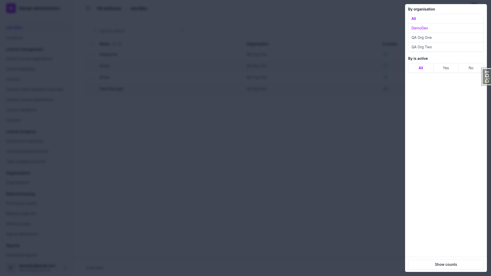 |
| 1.2 | desktop | pass | Add form: Organisation (autocomplete), Name, Is active (ticked); no Site. " driver " refused in QA Org One and QA Org Two with the message on Name. " Mechanic " saved as "Mechanic". Unchanged save and rename to MECHANIC both saved. | 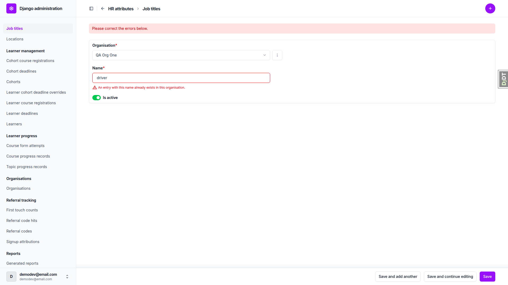 |
| 1.3 | desktop | pass | "2 entries deactivated.", "2 entries activated.", "1 entry deactivated.", "1 entry activated." all shown; rows flip as expected. | 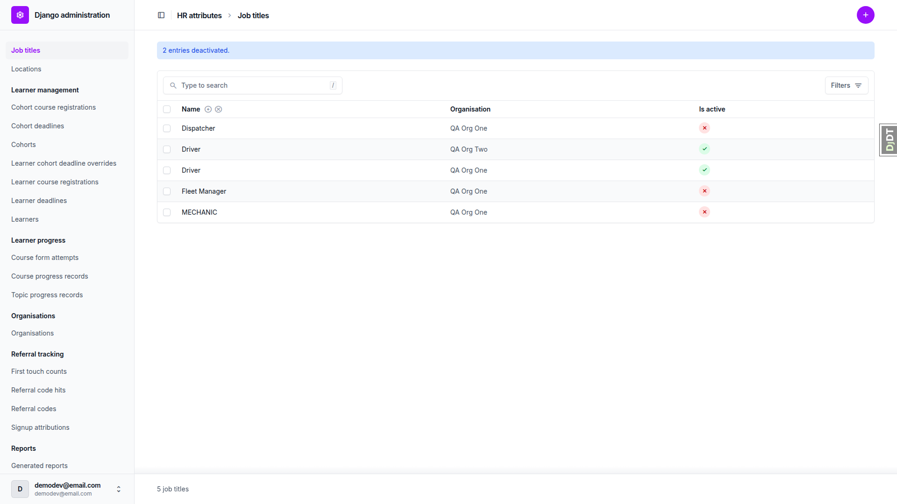 |
| 1.4 | desktop | pass | Delete of QA Org One Driver: "Cannot delete job title", lists "HR attributes for qa_hr_mover@email.com - QA Org One", no confirm button. MECHANIC deleted. Inactive Fleet Manager refused, listing the held learner's row. | 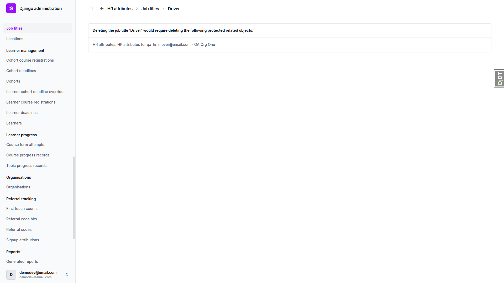 |
| 2.1 | desktop | pass | Held learner: HR attributes panel with Job title, Department, Location and four dates in order; no Site/Learner field, no delete checkbox. "Fleet Manager (inactive)" selected; choices Dispatcher, Driver (one), Fleet Manager (inactive); Department Finance/Operations (QA Org One only); Location Cape Town/Durban; date 2019-03-01. Unchanged save OK; future job-title date and pre-hire department date saved; clearing job title kept its date and dropped Fleet Manager (inactive) from the choices. | 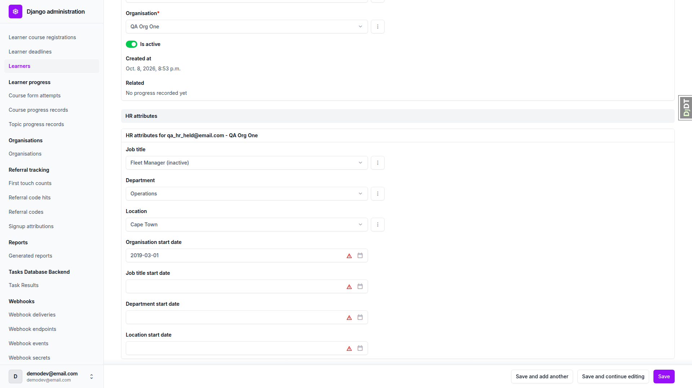 |
| 2.2 | desktop | pass | Blank learner: empty panel; untouched save succeeded and a shell query confirmed 0 LearnerHRAttributes rows. Finance + 2024-01-15 saved and reloaded with the rest empty. | none |
| 2.3 | desktop | pass | Learner add page has no inline groups and no HR attributes panel. | none |
| 2.4 | desktop | pass | Moving mover to QA Org Two with Driver held: "Choose a job title from this learner's organisation." under Job title; changelist still shows QA Org One. Move with job title cleared saved; reopened choices are QA Org Two's Driver, Finance, and empty Location. | 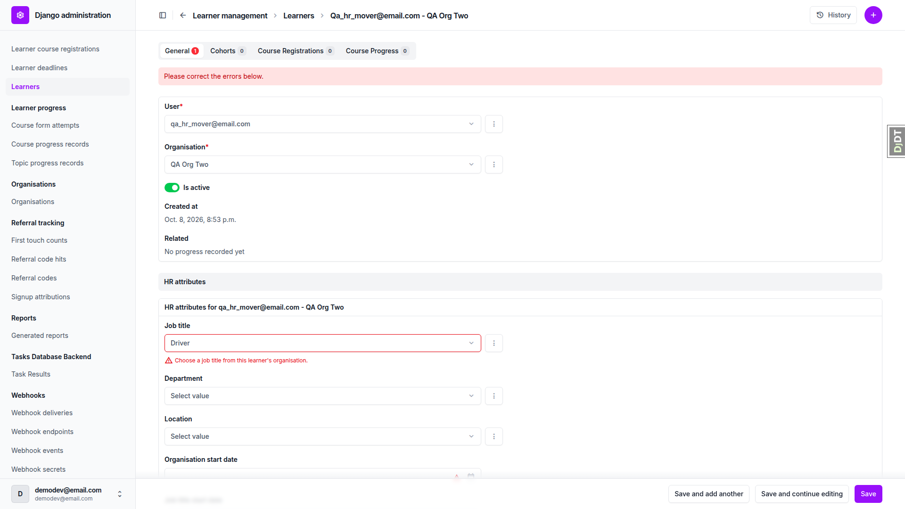 |
| 2.5 | desktop | pass | User delete confirmation lists Learner and "HR attributes for qa_hr_mover@email.com - QA Org Two"; delete went through. QA Org Two Driver delete page then offers "Yes, I'm sure" (not confirmed). | 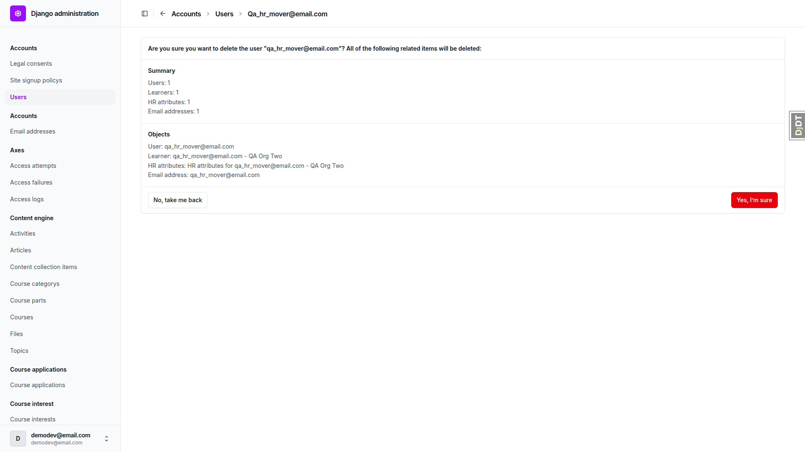 |
| 3 | desktop | pass | HR settings panel after Cohorts and Learners with one unticked "Registration rules enabled" checkbox, no Site. Untouched save created no row (shell query). Tick persisted; untick persisted with the row kept (shell query: QA Org One False). QA Org Two unticked with no row. Organisation add page has no inline. The "Add another HR settings" link is in the DOM but display:none. | 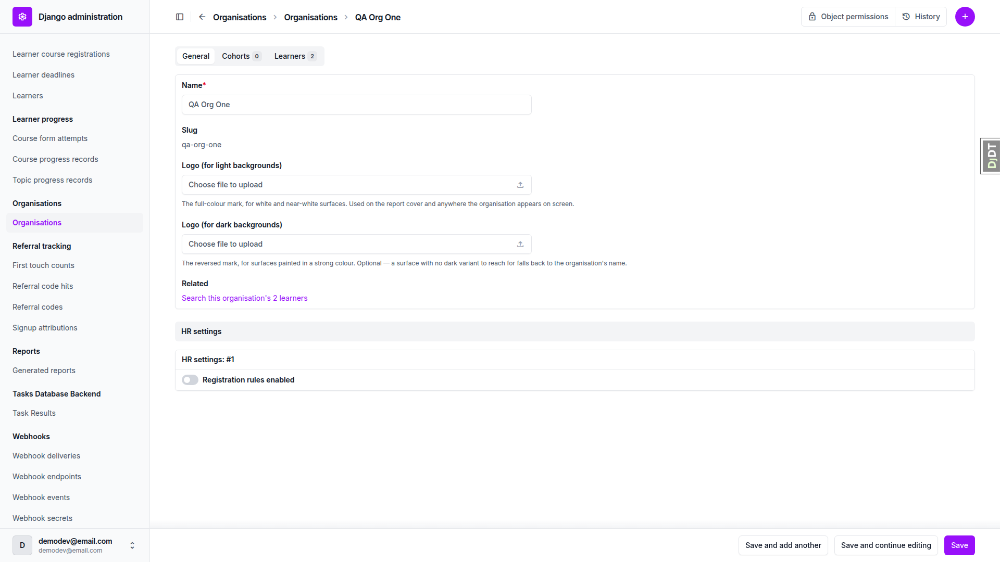 |
| 4 | desktop | pass | Cohort page: Cohort memberships and Course Registrations only, no HR panel. Learner page: Cohorts, Course Registrations and Course Progress render as Unfold tabs at the top, with HR attributes as a panel on the General tab below the learner fields, so all three are visually above it. In DOM order the HR attributes group comes before course_progress_records (see general notes). QA Org One: Cohorts and Learners (2 learners, too few to show pagination) ahead of HR settings. | 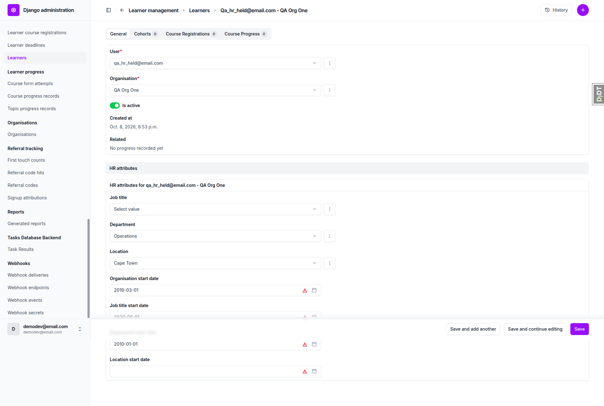 |
| 2.1-layout | mobile | pass | Learner HR attributes panel stacks to one column at 375px; no horizontal overflow (scrollWidth 375). | 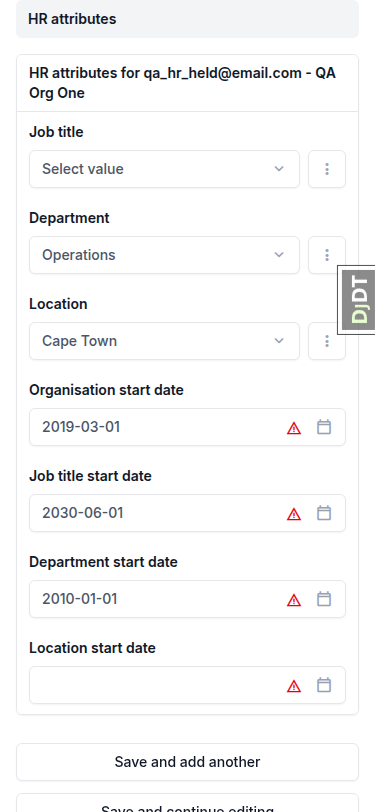 |
| 1.1-layout | mobile | pass | Job titles changelist renders as cards (Name, Organisation, Is Active) with search and Filters; no overflow. | 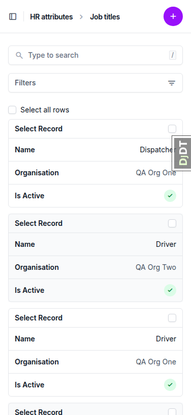 |
| 3-layout | mobile | pass | HR settings panel with "Registration rules enabled" toggle (32x20 control plus clickable label); no overflow. | 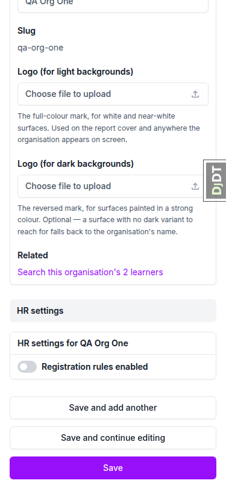 |
| 2.1-layout | tablet | pass | Learner HR attributes panel full width at 768px; no overflow. | 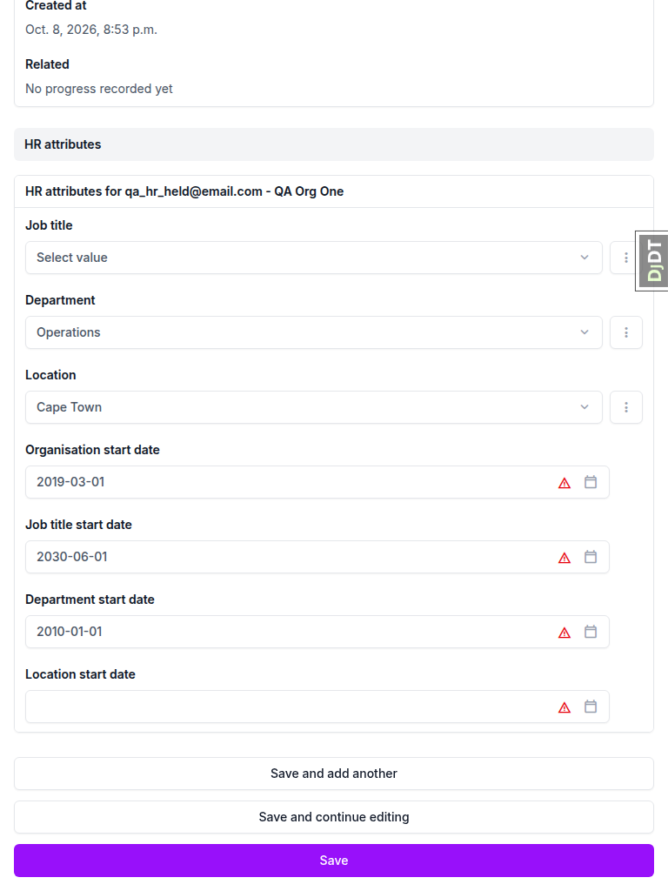 |
| 1.1-layout | tablet | pass | Job titles changelist, 4 rows, no overflow. | 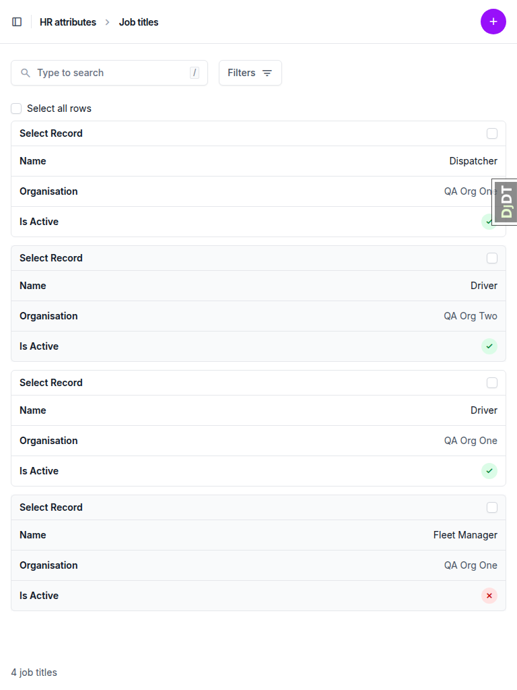 |

## Design check

no design states tested

## Bugs

None. There are no `bug` records, so there are no per-bug sections.

## Bug status

No bugs found.

## General notes

- Every date field shows a red warning-triangle icon. It is Django's standard timezone note ("Note: You are 2 hours ahead of server time.") rendered by Unfold, triggered because the browser clock is UTC+2 and the server is UTC. It is not caused by this branch, but it reads like an error at a glance.
- On the Learner change page, the HR attributes inline comes before the Course Progress inline in DOM order (hr_attributes is listed before learner_progress in INSTALLED_APPS). Unfold renders the tabular inlines as tabs at the top, so visually all three existing panels are above the HR panel and §4.2 passes. The DOM order only matters if those inlines stop being tabs.
- The changelist shows a deactivated entry's name without " (inactive)" (list_display uses the name field, with the Is active column beside it); the delete page and pickers use the suffixed str(). This is consistent with the plan.
- The "Add another HR settings" link exists in the DOM but is hidden (display:none) by the inline's max_num=1.
- §4.3 "still paginated": QA Org One has only 2 learners, too few to show the learner inline's pagination. Presence and order were checked.
- The data run deleted the user qa_hr_mover@email.com (§2.5) and the job title Mechanic (§1.4). Rerun the `qa_create_hr_attributes_scenario` command to restore the seed.

status: ok · reason: report rendered, 0 bugs documented
