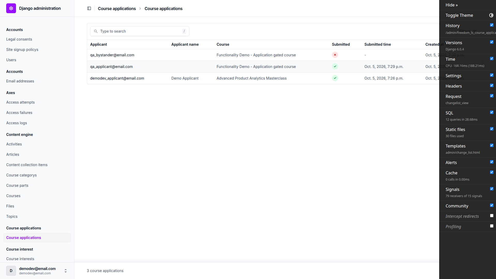
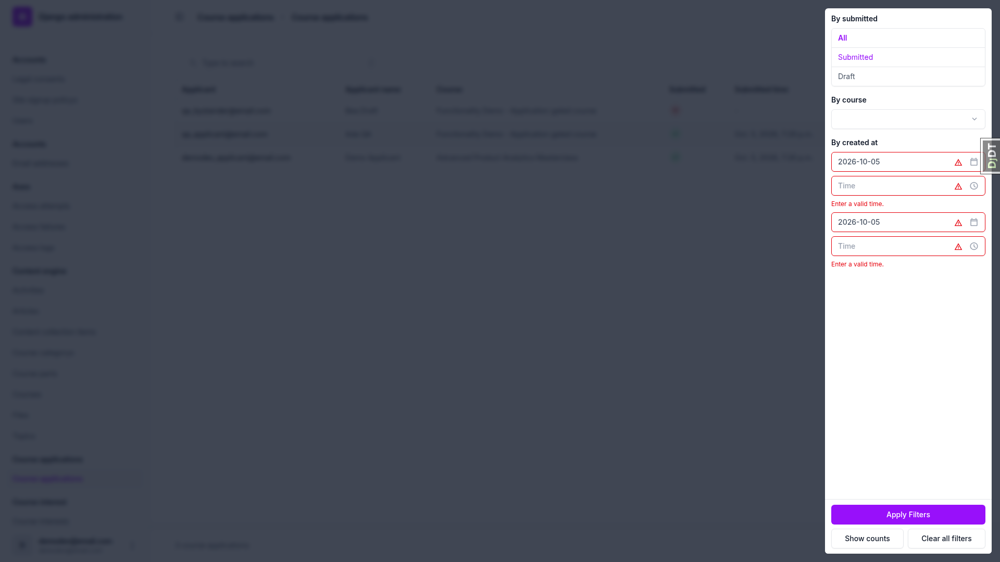
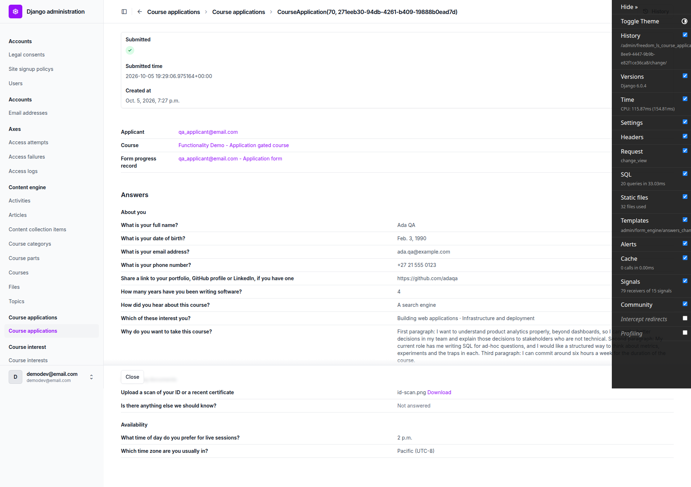
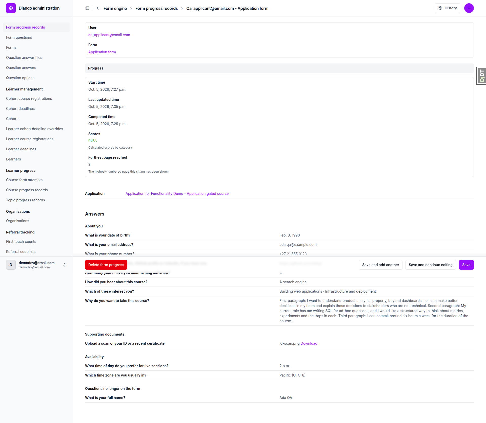
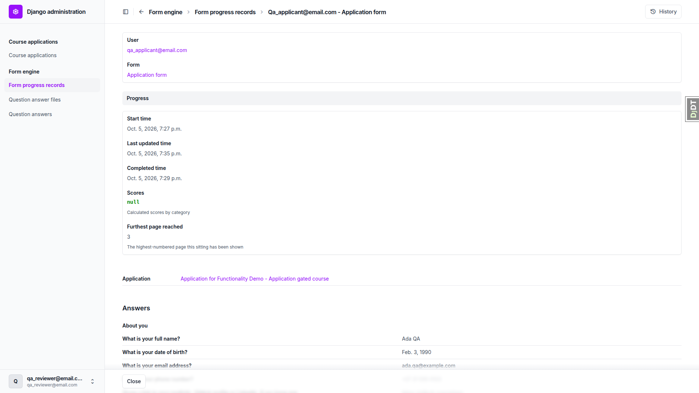
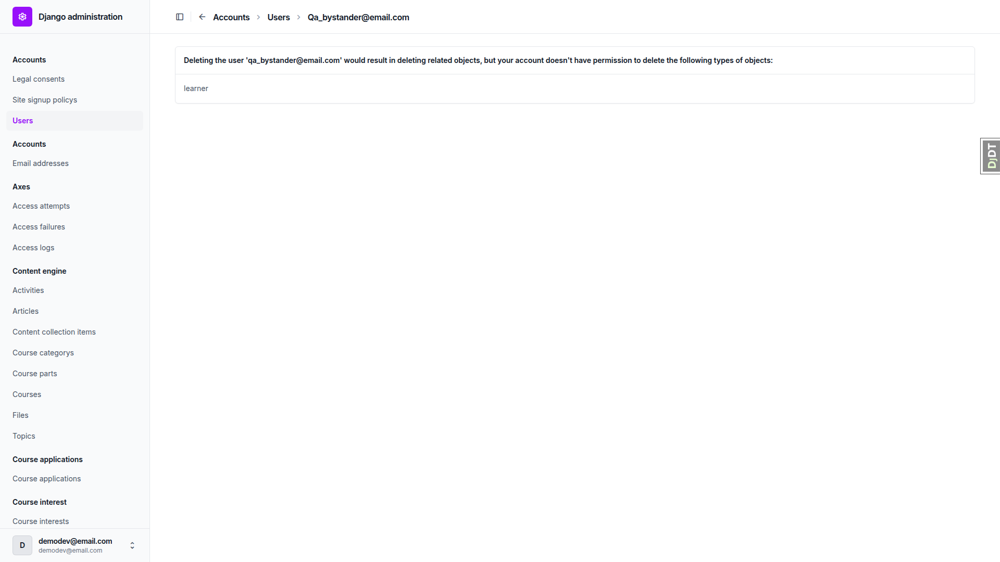
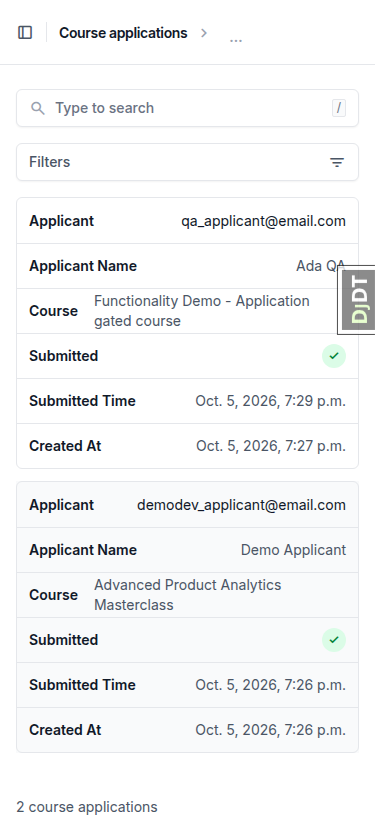
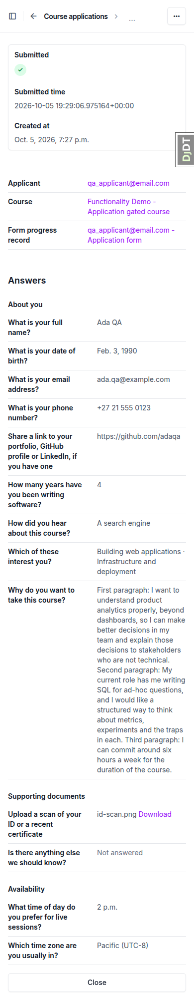
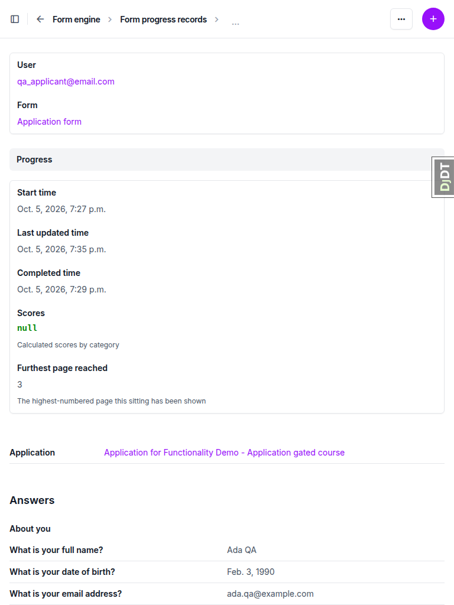

# QA Report: course-applications-admin

## Summary

| Viewport | Pass | Fail | Total |
|---|---|---|---|
| Desktop (1920x1080) | 14 | 4 | 18 |
| Mobile (375x812, plus plan §6 at 390px) | 1 | 1 | 2 |
| Tablet (768x1024) | 1 | 0 | 1 |

4 bugs documented (B1 to B4). All are UNRESOLVED; the fix loop has not run yet.

## Methodology

The test plan (`3. frontend_qa.md`) was walked by hand with the Playwright MCP at three viewports: desktop 1920x1080, mobile 375x812 (plus the plan's own §6 check at 390px) and tablet 768x1024. Screenshots are collected in `screenshots/` beside this report, and every image referenced below exists there.

Seed steps (from the notes):
- The rebuild after the rebase recreated the dev DB empty. `create_demo_data --yes`, `content_save`, `qa_create_application_review_accounts` and `qa_create_application_docs_scenario` were run.
- The seed command leaves `qa_applicant` and `qa_bystander` with blank first and last names. The plan expects "Ada QA" and "Bea Draft" in the Applicant name column (it reads `User.first_name`/`last_name`), so qa-data-helper set them.
- The draft application's partial page-1 answer was saved by submitting page 1 with `novalidate`, because browser `required` validation otherwise blocks Next. The server returned 422 and kept "Bea Draft".

## Diff scoping

Class: **FULL** (fired via `templates/`).

Changed files:
- `freedom_ls/course_applications/admin.py`
- `freedom_ls/form_engine/admin.py`
- `freedom_ls/form_engine/permissions.py`
- `freedom_ls/form_engine/queries.py`
- `freedom_ls/form_engine/templates/admin/form_engine/_answers.html`
- `freedom_ls/form_engine/templates/admin/form_engine/_summary.html`
- `freedom_ls/form_engine/templates/admin/form_engine/answers_change_form.html`
- `freedom_ls/form_engine/views.py`
- `freedom_ls/qa_helpers/management/commands/qa_create_application_review_accounts.py`
- `freedom_ls/site_aware_models/admin.py`
- tests and spec_dd files

Nothing was skipped. The plan's own §6 phone-width check ran, along with the mobile and tablet passes.

## Smoke gate

Outcome: **pass**. Pages loaded:
- http://127.0.0.1:8505/
- http://127.0.0.1:8505/admin/freedom_ls_course_applications/courseapplication/

## Results

| Test | Viewport | Status | Screenshot | Notes |
|---|---|---|---|---|
| 1.1 | desktop | pass |  | Columns and three rows as expected; no add button, checkboxes or actions. Change page is view-only; `/add/` returns 403. Raw Submitted time and unreadable page title noted (see B2 and general notes). |
| 1.2 | desktop | fail |  | Submitted/Draft, course autocomplete and search filters return the right rows; date range works (0 rows from tomorrow). After a date-only range the empty time boxes show "Enter a valid time." (B3). Search "QA" also matches the bystander by email: plan slip, not a defect. |
| 1.3 | desktop | pass | — | Applicant sorts asc/desc by email; Course sorts; Submitted and Submitted time not sortable. |
| 2.1 | desktop | pass |  | Applicant, Course and Form progress record summary rows are links that open the right pages. |
| 2.2 | desktop | fail |  | Groups, formatting, file download (200, attachment) and no inputs all correct. The long "Why" answer runs its three paragraphs together (B1). |
| 2.3 | desktop | pass | — | Draft shows three summary links and "Not answered" elsewhere; no-form application shows its message and no Answers heading. |
| 3.1 | desktop | fail | — | Form progress page correct and Save works. Fails only on collapsed paragraph breaks (B1). |
| 3.2 | desktop | pass | — | Quiz sitting groups answers by page with question and option text; no summary block. |
| 3.3 | desktop | pass | — | Add page has editable user and form selects; no answers document. |
| 3.4 | desktop | pass |  | Moving questions between forms adds or removes the "Questions no longer on the form" group correctly; restored afterwards. |
| 4.1 | desktop | pass |  | qa_reviewer sees the expected index entries, no add links; answers document and download work; only Form progress record is a link. |
| 4.2 | desktop | pass | — | formprogress add, questionanswer delete and courseapplication delete all return 403. |
| 4.3 | desktop | pass | — | Without view_questionanswerfile the file name is plain text, direct download 403, entry gone from index. Permission restored. Dev debug toolbar covered the Save button in a fresh context. |
| 4.4 | desktop | pass | — | With all four permissions removed nothing is listed and both changelists 403. Permissions restored by hand. |
| 5.1 | desktop | fail |  | Superuser delete of qa_bystander blocked by "learner" objects (B4). Application and form progress were not in the blocked list. After the Learner row was removed the delete listed them and succeeded. |
| 5.2 | desktop | pass | — | Applicant dashboard shows "Pending review"; status page and Check your answers render correctly. |
| 5.3 | desktop | pass | — | Question answers (19 rows) and answer files (1 row) render; download works; question answer page still editable. |
| 5.4 | desktop | pass |  | An application on site Bloom does not appear in the DemoDev changelist. |
| 6.1 | mobile | fail |  | 390px: no horizontal scroll, answers wrap, Download tappable. Fails on collapsed paragraph breaks (B1) and raw Submitted time (B2). Download link is 66x17px, below a 24px touch height (observation). |
| 1.1 | mobile | pass |  | 375px: changelist shows cards with all six fields; no horizontal overflow on changelist, application page or form progress page. |
| 3.1 | tablet | pass |  | 768px: no horizontal overflow on the three pages; two-column question/answer layout; nav collapses to a sidebar toggle. |

## Design check

no design states tested

## B1: Long answers lose their paragraph breaks in the admin answers document

Manifestations:
- 2.2 (desktop)
- 3.1 (desktop)
- 6.1 (mobile)

Expected: The "Why do you want to take this course?" answer shows its three paragraphs separated by blank lines.

Actual: All three paragraphs run together in one block. The answer span carries class `whitespace-pre-line`, but computed `white-space` is `normal`. That utility is not in the admin's compiled CSS, so the newlines collapse.

## B2: Submitted time on the course application change page shows a raw timestamp

Manifestations:
- 1.1 (desktop)
- 6.1 (mobile)

Expected: Submitted time is formatted like Created at beside it (e.g. "Oct. 5, 2026, 7:29 p.m."), as it is in the changelist column.

Actual: The change page renders "2026-10-05 19:29:06.975164+00:00" (UTC, with microseconds) for Submitted time, while Created at reads "Oct. 5, 2026, 7:27 p.m.".

## B3: Date-only created-at range filter shows "Enter a valid time." on the empty time boxes

Manifestations:
- 1.2 (desktop)

Expected: Filling only the two date boxes applies the range with no error, since `InclusiveRangeDateTimeFilter` treats a blank time as start/end of day.

Actual: The range applies correctly (3 rows for today, 0 from tomorrow). On reopening the filter panel, both empty time boxes are outlined red with "Enter a valid time." under each. The filter lives in `freedom_ls/site_aware_models/admin_filters.py` and predates this branch.

## B4: A superuser cannot erase a learner from the User admin: Learner rows block the delete

Manifestations:
- 5.1 (desktop)

Expected: Deleting qa_bystander from the User change page lists the course application and form progress record and has no "you don't have permission" notice.

Actual: "Cannot delete user ... your account doesn't have permission to delete the following types of objects: learner". `LearnerAdmin.has_delete_permission` returns False and Learner is not in `USER_ERASURE_CASCADE_MODELS`. Course application and form progress were correctly not listed as blocked; once the Learner row was removed the delete worked. Pre-existing on main.

## Bug status

- **FIXED** (commit: 7499d57c) — Long answers lose their paragraph breaks in the admin answers document
- **FIXED** (commit: 7676fa61) — Submitted time on the course application change page shows a raw timestamp
- **FIXED** (commit: 6910011d) — Date-only created-at range filter shows "Enter a valid time." on the empty time boxes
- **UNRESOLVED** — A superuser cannot erase a learner from the User admin: Learner rows block the delete (reason: red lane — permission-adjacent and a product decision on whether Learner rows should join `USER_ERASURE_CASCADE_MODELS`; predates this branch)

Each fix was re-verified against the live dev server: B1 computed `white-space: pre-line` on both change pages, B2 Submitted time formatted like Created at on the submitted and no-form applications, B3 no "Enter a valid time." after a date-only range, with the learner-progress admins that share the filter also clean.

## General notes

No rows were PARTIAL or skipped.

Observations (no action filed):
1. The course application change page title and breadcrumb read "CourseApplication(70, 271eeb30-...)". The model's `__str__` is not human-readable, unlike the form progress page's "qa_applicant@email.com - Application form".
2. On the learner application form page a notifications widget showed "Couldn't load your notifications. Try again" once.
3. Form progress "Scores" renders a JSON "null" for an application sitting.
4. Test plan §1.2.5 expects search "QA" to match only the submitted application. It also matches qa_bystander@email.com by email, so the plan needs rewording, not the code.
5. `qa_create_application_review_accounts` leaves the QA users' first and last names blank, so the plan's "Ada QA"/"Bea Draft" Applicant name column needs data-helper help on each run.
6. In a fresh browser context the Django debug toolbar opens expanded and covers the admin Save bar (dev only).
7. Pre-step rebase: the frontend_check helper was not run separately because this QA run covers the same pages at all three viewports. The upstream-change scan exited 2 for an unrelated blog test fix and was judged "unchanged" inline.

status: ok · reason: 4 bugs — 3 fixed, 1 unresolved; report rendered, screenshots verified
