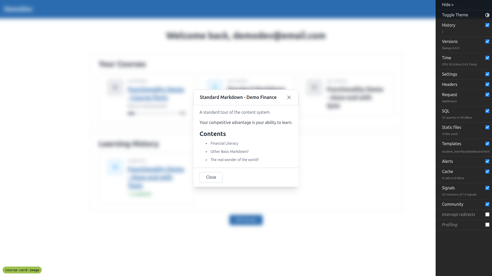
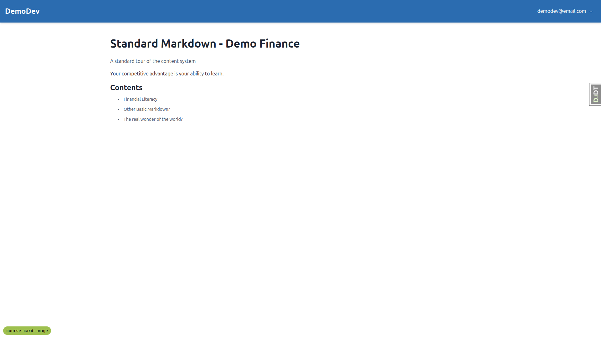
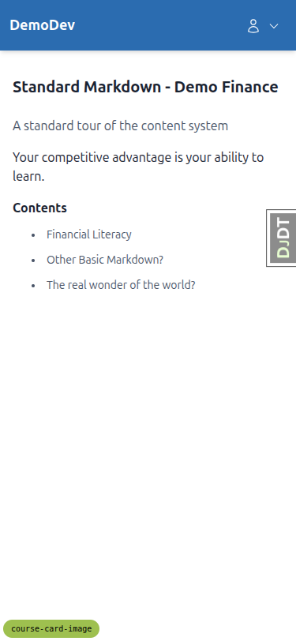
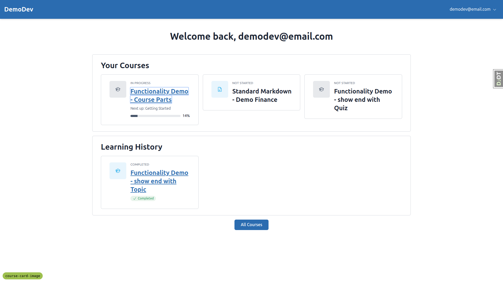
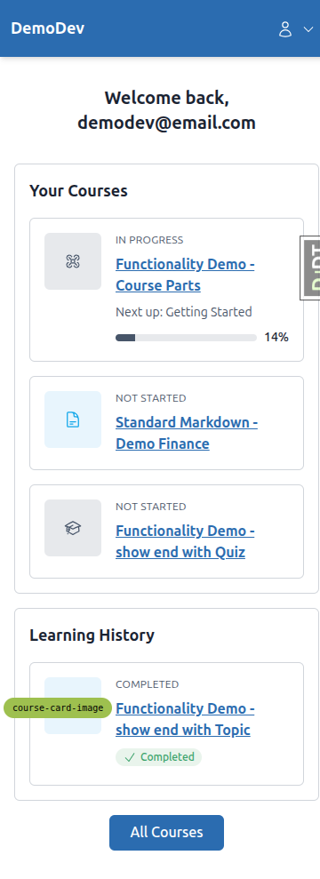
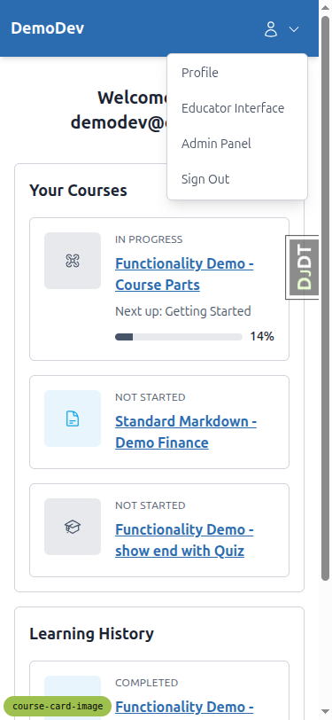
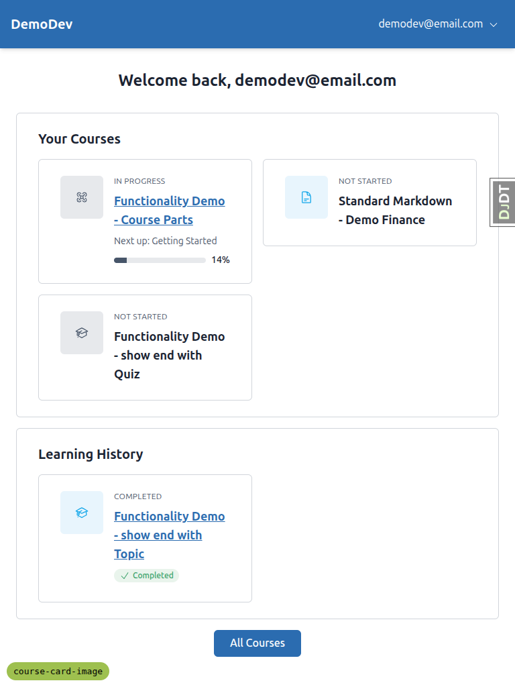
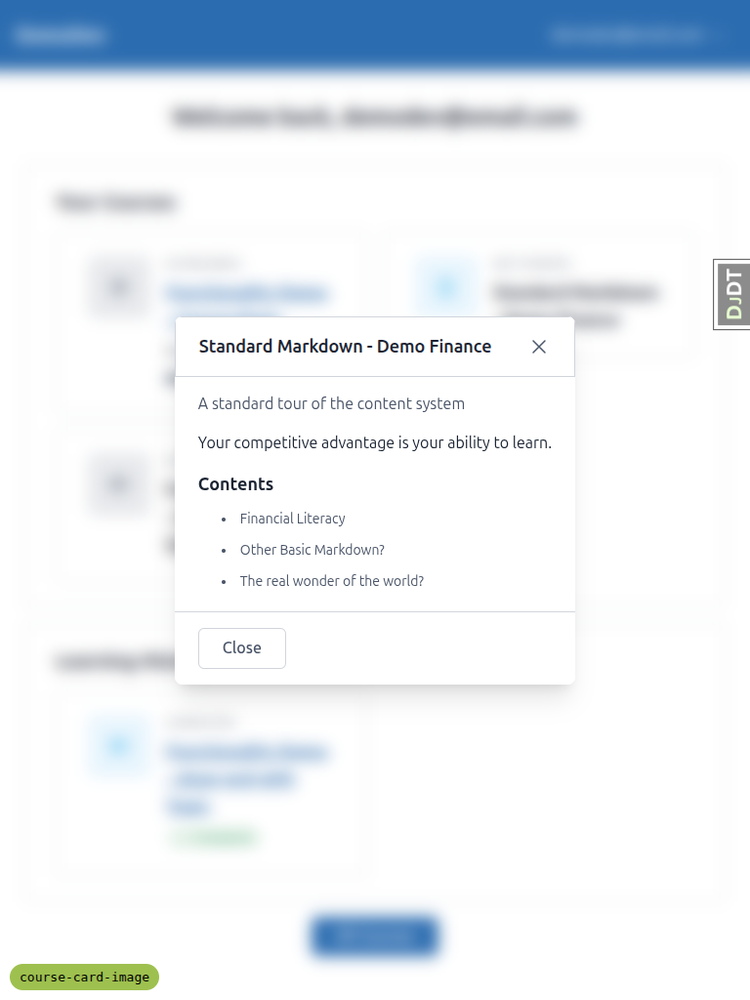

# Frontend QA Report — Course-card upgrades & dashboard cleanup

**Branch:** `course-card-image`
**Date:** 2026-05-08
**Tester:** Claude Code (Playwright MCP, desktop 1920×1080 / mobile 375×812 / tablet 768×1024)

## Summary

Most workflows pass. Two issues were found:

1. **The not-started preview (modal on desktop, page on mobile) is missing the `Start` button required by the spec** — affects Workflows D and H.
2. **The card focus ring does not visibly wrap the whole card** — only the default 1 px browser outline appears around the title link — affects Workflow F.

All other workflows (A, B, C, E, E2, G, I, J) pass.

---

## Bug 1 — Not-started card has no `Start` button

**Tests affected:** Workflow D (Three card states — Not started variant) and Workflow H (Modal-vs-page parity).

**Expected (from spec):**

> On a desktop viewport (≥ 768 px wide): clicking the card opens a modal with the course title, subtitle, description, table of contents, **and a `Start` button**.
> On a mobile viewport (< 768 px wide): clicking the card navigates to `/courses/<slug>/preview/`. The page renders the same content as the modal (title, subtitle, description, ToC, **`Start` button**).

**Actual:** Neither the desktop modal nor the mobile preview page contains a `Start` button.

- Desktop modal `Standard Markdown - Demo Finance` only has two `Close` buttons (a header X-close and a footer Close) — no primary CTA.
- The `/courses/<slug>/preview/` page has zero buttons or links inside its main content (verified via `document.querySelectorAll('main button, main a[href]')` → `[]`).

The user therefore cannot start the course from the preview/modal, and parity (Workflow H) only holds in the trivial sense that *both* surfaces are missing the Start button.

**Evidence:**

---

## Bug 2 — Focus ring does not wrap the whole card

**Test affected:** Workflow F (Stretched link, focus ring, text selection).

**Expected:**

> Tab into the card with the keyboard. The focus ring wraps the **whole card**, not just the title link.

**Actual:** When the title link receives focus, only the browser default outline (`outline: rgb(168, 199, 250) auto 1px`) is drawn around the title text. The `<article>` element has no `:focus-within` outline/ring, and the title link's `::before` overlay (which makes the click target stretch over the whole card) has `outline-style: none`. So the visible focus indicator is a tiny outline around the heading, not the whole card.

`tailwind.components.css` line 173-176 defines `.surface` as `border border-border rounded-md py-4 px-4 sm:py-6 sm:px-8` with no focus styling, and the in-progress card template (`partials/course_card_in_progress.html`) does not add any `focus-within:` or `focus-visible:` utility on either the `<article>` or the link's `::before`.

The stretched-click target itself works (clicking the icon tile, eyebrow, etc. activates the link), but keyboard users get a misleading focus indicator that does not show the entire interactive area.

**Evidence:**

---

## Workflow-by-workflow results

| Workflow | Result | Notes |
|---|---|---|
| A — Anonymous redirect | PASS | `/` redirects to `/accounts/login/?next=/`, and login redirects back to `/` (Dashboard). |
| B — Dashboard rename, no spinner | PASS | `<title>Dashboard</title>`, `<h1>Welcome back, demodev@email.com</h1>`. No HTMX request to `/partials/courses/`. |
| C — Dead URL returns 404 | PASS | `curl -o /dev/null -w '%{http_code}' /partials/courses/` → `404`. |
| D — Three card states | **FAIL** — modal/preview missing Start button (Bug 1). All other aspects PASS: in-progress card has `progress` element with correct ARIA, eyebrow text, percentage, and clicks navigate to next ready item; not-started card shows title only on desktop and navigates to `/preview/` on mobile; complete card has check badge + “Completed” text and navigates to `/finish/`. |
| E — Per-course icon + accent stability | PASS | Standard Markdown card uses the `notes` glyph (heroicons document-text path), other cards use the default `course` glyph (academic-cap path). Across 3 reloads each card kept the same accent role (Course Parts → `secondary`, Show end with Quiz → `secondary`, Show end with Topic → `info`, Standard Markdown → `info`). `/courses/` matches the dashboard accents. |
| E2 — Tailwind safelist coverage | PASS | `npm run tailwind_build` runs cleanly; `grep -E "(bg|text)-(primary\|secondary\|accent\|info\|success)(-soft)?" tailwind.output.css \| wc -l` = 49; `grep -E "::-(webkit\|moz)-progress" tailwind.output.css \| wc -l` = 15. Computed background of an in-progress card icon tile is a real soft tint colour (`oklab(0.933458 -0.000946871 -0.00436451)`, matching `bg-secondary-soft`), and the `<progress>` element’s background uses the same role. |
| F — Stretched link / focus / text selection | **PARTIAL** — stretched click works (any-card-area click activates the primary action), text selection inside the card works without triggering navigation, but focus ring does not wrap the whole card (Bug 2). |
| G — Empty state | PASS | A fresh learner (`qa_empty@example.com`, created via `qa-data-helper`) sees `Your Courses` → "You haven't signed up for any courses yet." plus a `Browse courses` link to `/courses/`. Clicking it navigates correctly. |
| H — Modal-vs-page parity | PARTIAL — content matches item-for-item (title, subtitle, description, identical 3-item ToC), but neither surface has a Start button (same as Bug 1). |
| I — Course-icon authoring sanity | PASS | Adding `icon: drone` + `icon_fallback: phosphor:drone` and re-running `content_save` causes the Course Parts card to render the phosphor `drone` glyph (verified by SVG path `M189.66 66.34a8 8 0 0 0-11.32 0…`, which is from the 256-viewbox phosphor set, replacing the previous heroicons `M4.26 10.147…` academic-cap path). With the typo `icon: dron` and no fallback, `content_save` exits non-zero with a `ValidationError` whose message lists the valid `SEMANTIC_ICON_NAMES` and reminds the author about `icon_fallback: <set>:<glyph>`. The demo content was restored after testing. |
| J — Breadcrumbs Home → Dashboard | PASS | Topic page (`/courses/.../1/`) contains zero occurrences of either "Home" or "Dashboard" — there is no breadcrumb to mis-label. The finish page contains a `Return to Dashboard` link to `/`. |

---

## Mobile (375×812) observations

- Dashboard cards stack to a single column with no horizontal overflow (`document.documentElement.scrollWidth === window.innerWidth`).
- The header collapses the user dropdown trigger from `<email> ▾` to a user-icon-only button, which is a sensible touch-target adaptation.
- Dropdown menu opens correctly and shows Profile / Educator Interface / Admin Panel / Sign Out.
- Not-started card on mobile correctly navigates to `/preview/` instead of opening the modal; the back button returns to the dashboard.

## Tablet (768×1024) observations

- 768 px is exactly the spec's modal/preview cut-over (`< 768px → page`, `≥ 768px → modal`). At 768 px, clicking a not-started card opens the modal — the implementation includes 768 in the desktop branch, matching the spec wording.
- No horizontal overflow; cards still render in a sensible single column at this width.

---

## Tangential notes (not in scope, but worth flagging)

- **Finish page has empty `<title>`.** Visiting `/courses/.../finish/` shows `document.title === ""` — unrelated to this spec but might be worth a follow-up. Visible at the top of the tab in `desktop_D3_completed_finish_page.png`.
- **Course Parts in-progress card "Next up" wording.** Currently shows `Next up: Getting Started` for course parts that begin with a part container. The spec only says it should show "the next ready/in-progress item title", which it does, so this is just an FYI.

---

## Test data created during this run

`qa-data-helper` agent created one new learner on the DemoDev site:

- email: `qa_empty@example.com`
- password: `qa_empty@example.com`  <!-- pragma: allowlist secret -->
- 0 `UserCourseRegistration` rows

This account is left in place to simplify re-runs of Workflow G.
