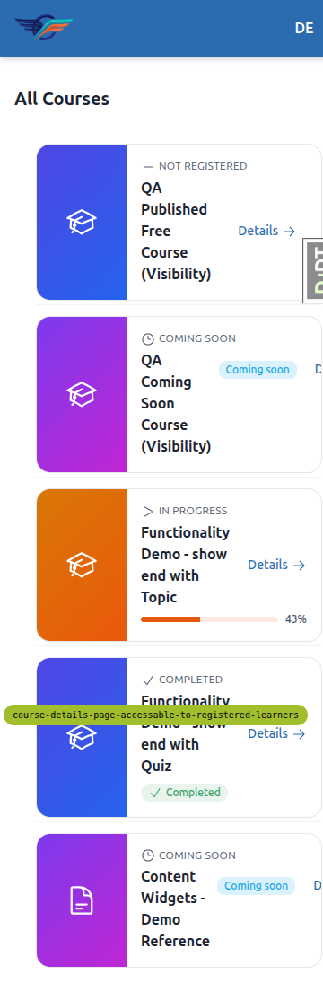
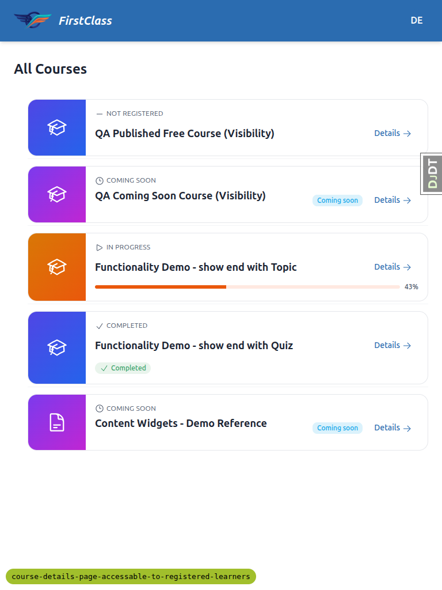
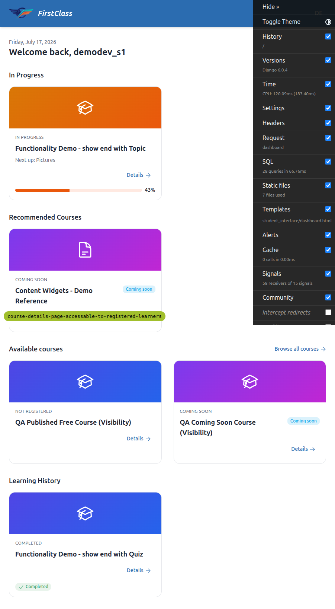
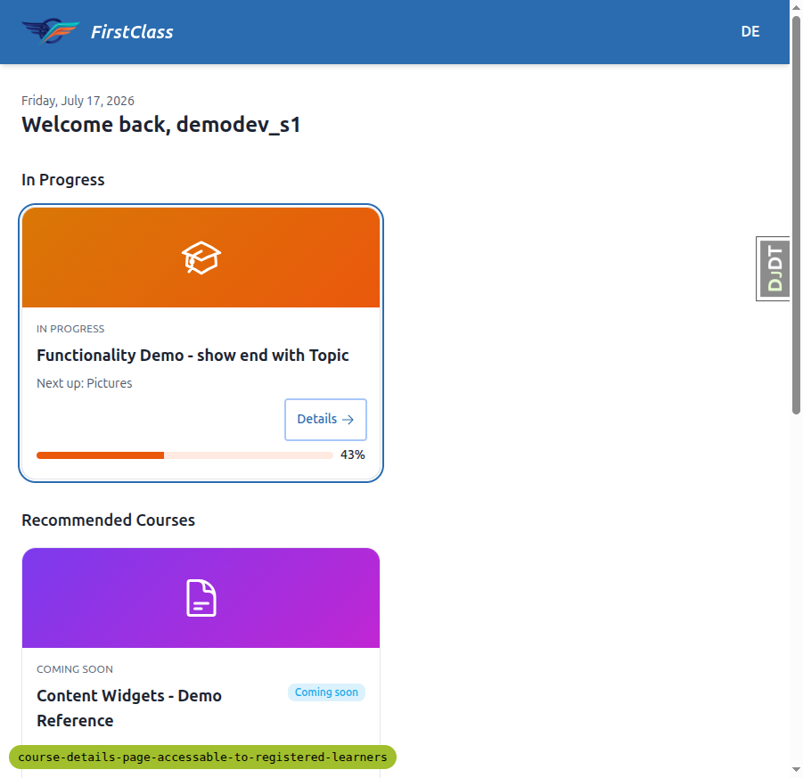
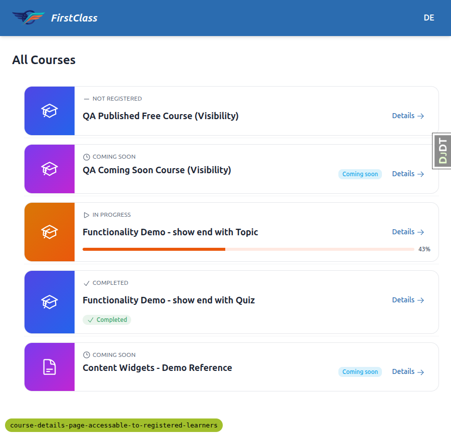
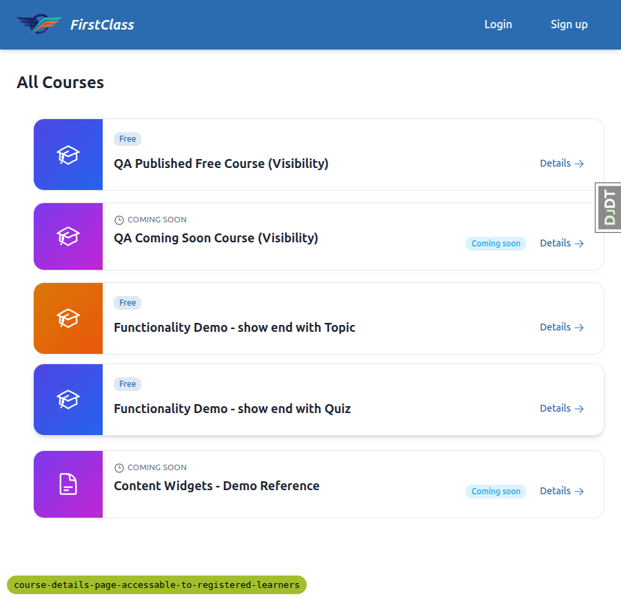
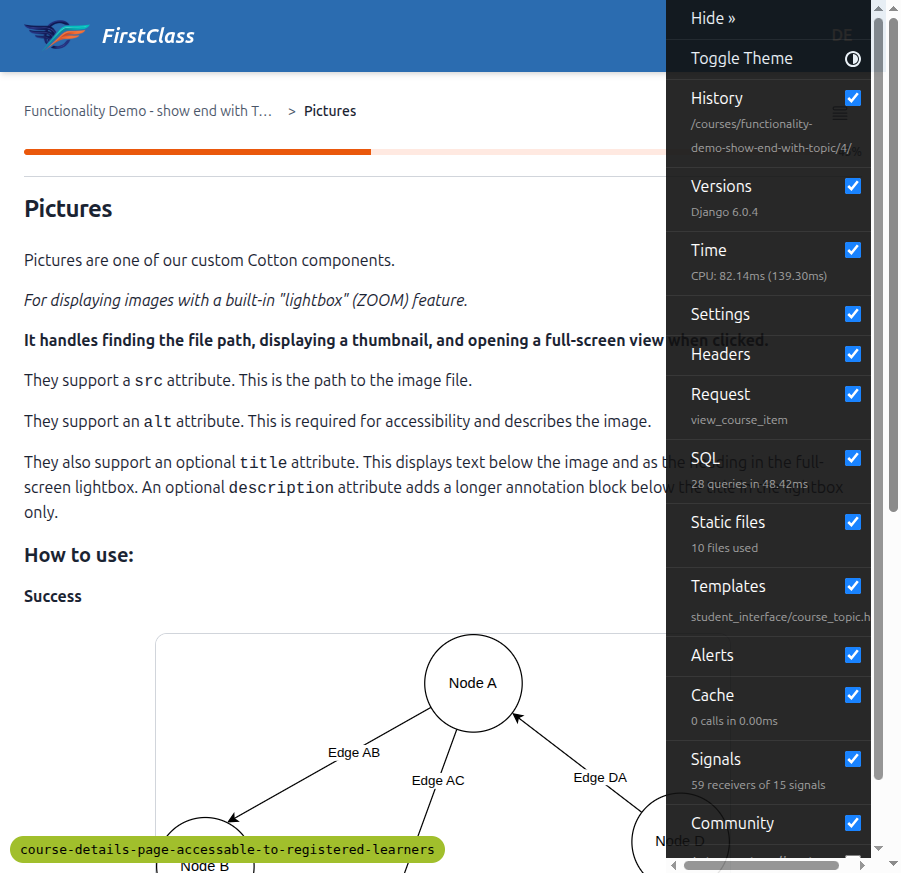
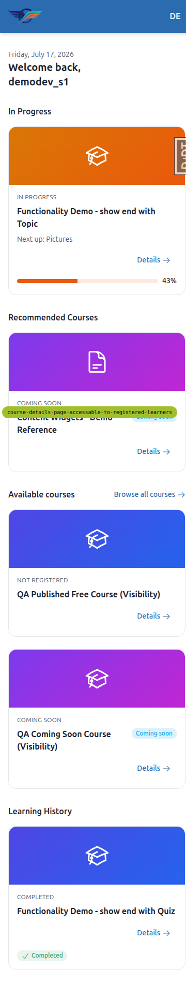
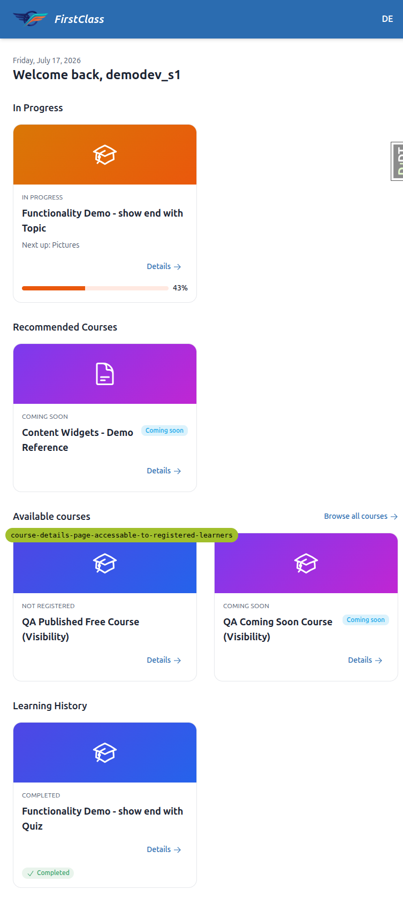

# QA Report — "Details" entry points to the course details page

**Feature under test:** the "Details" link on dashboard cards, all-courses rows, and the
repointed player breadcrumb (`spec_dd/2. in progress/course-details-page-accessable-to-registered-learners/3. frontend_qa.md`).

**Environment:** dev server on port 8496, DemoDev site, student `demodev_s1@email.com`.
Test data seeded via the `fls:qa-data-helper` agent (`qa_create_rich_dashboard_student`
+ `qa_create_course_visibility`).

**Viewports tested:** Desktop 1920×1080, Mobile 375×812, Tablet 768×1024.

## Summary

| Test | Desktop | Tablet | Mobile |
|------|---------|--------|--------|
| 1 — Dashboard course cards | ✅ Pass | ✅ Pass | ✅ Pass |
| 2 — All-courses rows | ✅ Pass | ✅ Pass | ❌ **Fail** (Details clipped on "Coming soon" rows) |
| 3 — Player first breadcrumb repoint | ✅ Pass | — | — |

One bug found: on a mobile-width viewport, the "Details" link on **"Coming soon"**
all-courses rows is pushed off the right edge of the viewport and is invisible / un-tappable.

---

## Bug 1 — All-courses "Coming soon" rows clip the "Details" link on mobile

**Test failed:** Test 2 (All-courses rows), mobile viewport (375×812).

**Expected:** Every all-courses row — including "Coming soon" rows — shows a "Details"
link that coexists cleanly with the "Coming soon" chip and remains visible and tappable
(the plan explicitly calls out that the chip and Details "don't overlap or wrap
awkwardly").

**Actual:** On a 375px-wide viewport the row keeps its horizontal (thumbnail + inline
title/chip/Details) layout. On the two "Coming soon" rows the "Coming soon" chip plus the
"Details" link no longer fit, and the "Details" link is pushed **~52px past the right edge
of the viewport**, where it is clipped by the row's `overflow-hidden` and cannot be seen
or tapped. Measured bounding rects at 375px width:

| Row | Details link right edge | Off-screen | Clipped |
|-----|------------------------|-----------|---------|
| QA Published Free (not registered) | 342px | −33px | No |
| **QA Coming Soon (Visibility)** | **428px** | **+53px** | **Yes** |
| Functionality Demo — Topic (in progress) | 353px | −22px | No |
| Functionality Demo — Quiz (completed) | 353px | −22px | No |
| **Content Widgets — Demo Reference (coming soon)** | **426px** | **+51px** | **Yes** |

Only the two "Coming soon" rows are affected — the extra width of the "Coming soon" chip
is what pushes Details out of view. Non-coming-soon rows keep Details on screen.

There is no page-level horizontal scroll (document `scrollWidth` stays 375px), so the
clipped Details link is genuinely unreachable on mobile rather than merely requiring a
horizontal scroll.

**Not reproducible on desktop (1920) or tablet (768)** — at those widths every Details
link, including the coming-soon rows, sits within the viewport (right edge ≈727px at
768px).

**Suggested direction:** on narrow viewports the row should allow the chip/Details group
to wrap onto its own line (as the dashboard cards already do — cards put Details on its
own bottom-right line and are unaffected).

Mobile (Details clipped at the right edge — note the partial "D" beside the "Coming soon" chips):

Tablet (same rows, Details fully visible):

---

## Passing tests (evidence)

### Test 1 — Dashboard course cards (Desktop) ✅

Every card (In progress, Recommended/coming-soon, Not registered, Completed) shows exactly
one low-emphasis "Details →" link, bottom-right on its own line with a trailing chevron,
clear of the progress bar / "Completed" badge / "Coming soon" chip. Clicking "Details" on
the In-progress card navigated to `/courses/functionality-demo-show-end-with-topic/detail/`
(description, "About this course", "This course includes", and the "Course content" ToC all
present). Clicking the card **title** instead navigated to the player resume point
(`/courses/…/4/`, "Pictures") — the two click targets are independent.

**Keyboard check:** Tabbing reached the "Details" link as a focus stop immediately after
the card's main title link (independent). It received a visible focus ring
(`outline-style: auto`) and **Enter** activated it, navigating to the detail page.

### Test 2 — All-courses rows (Desktop + anonymous) ✅

All five rows show a "Details →" link inline and right-aligned beside the title. On the two
"Coming soon" rows the "Coming soon" chip and "Details" link coexist without overlap.
Clicking "Details" on the coming-soon row navigated to
`/courses/qa-coming-soon-visibility/detail/`.

**Anonymous check:** After logging out, `/courses/` still rendered a "Details" link on
every row, each pointing to `/courses/<slug>/detail/`, and clicking one navigated to the
detail page while anonymous.

### Test 3 — Player first breadcrumb repoint (Desktop) ✅

Entering the player for a registered course, the breadcrumb read
`Functionality Demo - show end with Topic  >  Pictures`. The first breadcrumb pointed to
`/courses/functionality-demo-show-end-with-topic/detail/` and clicking it landed on the
course **details** page (not lesson 1 / "start over"). The address bar showed the
shareable details URL.

### Mobile & Tablet — dashboard cards ✅

Dashboard cards stack vertically at both mobile and tablet widths; each keeps its
"Details →" link on its own bottom-right line, clear of the progress bar / badges / chips,
with no overflow. (The dashboard-card layout is not affected by Bug 1 because it already
wraps Details onto its own line.)

---

## Notes / observations (not bugs)

- The green `course-details-page-accessable-to-registered-learners` pill visible in several
  screenshots is the dev **debug branch badge**, and the "DJDT" tab is the Django Debug
  Toolbar. Both are dev-only artifacts, not product UI. The debug badge (bottom-left)
  visually overlaps the Recommended dashboard card in the full-page captures; this is a
  local-dev overlay only and does not affect production rendering.
- Nothing on the course details page itself appeared changed, consistent with the spec.
