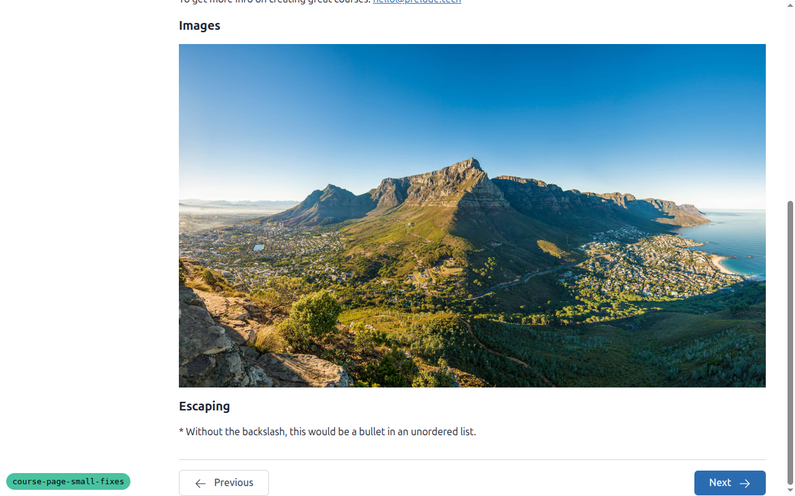
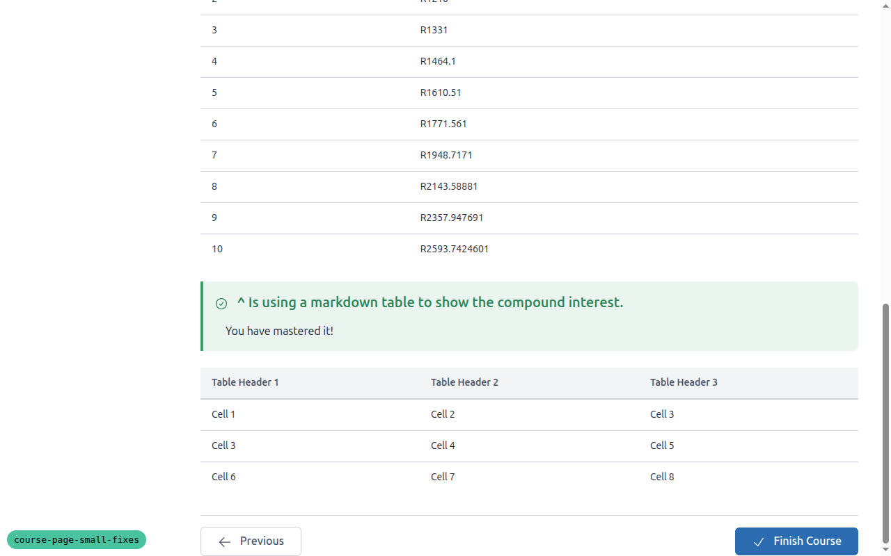
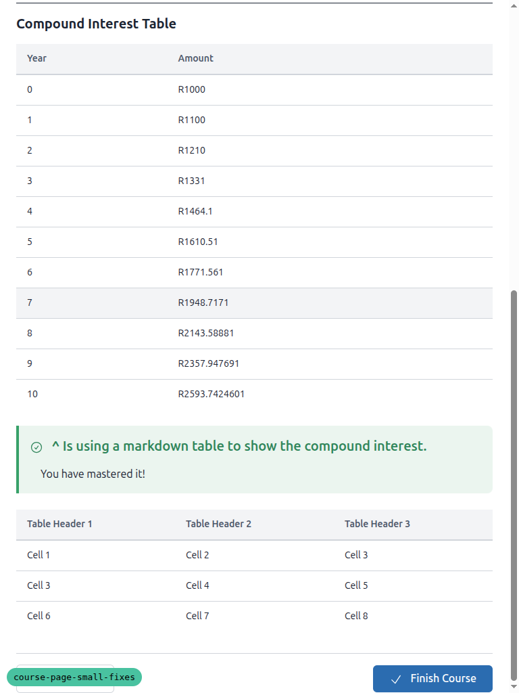
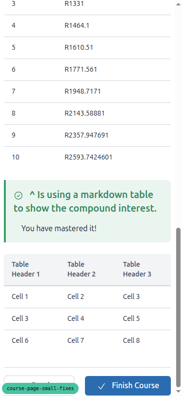
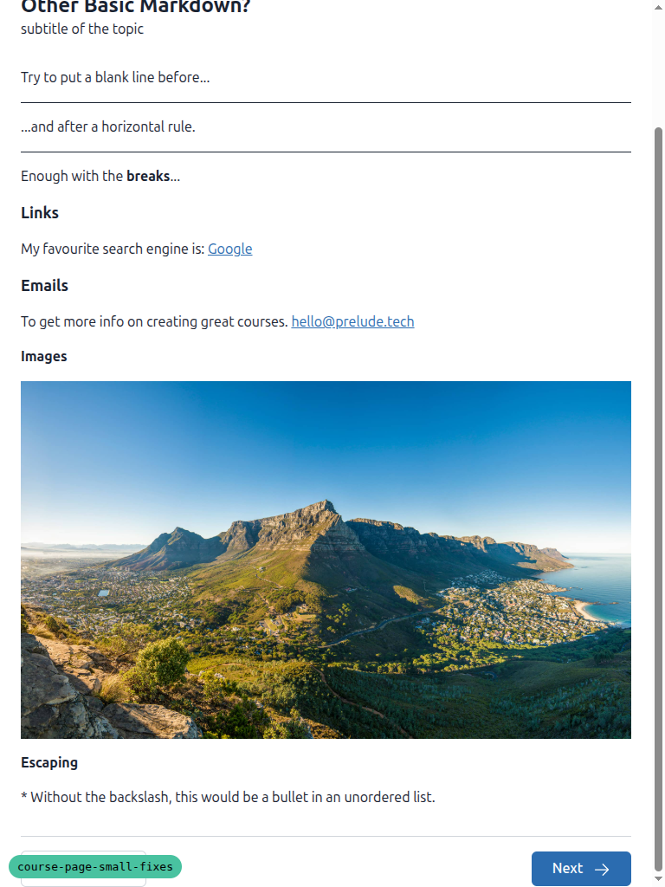
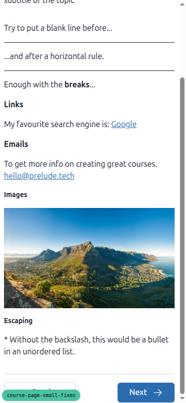
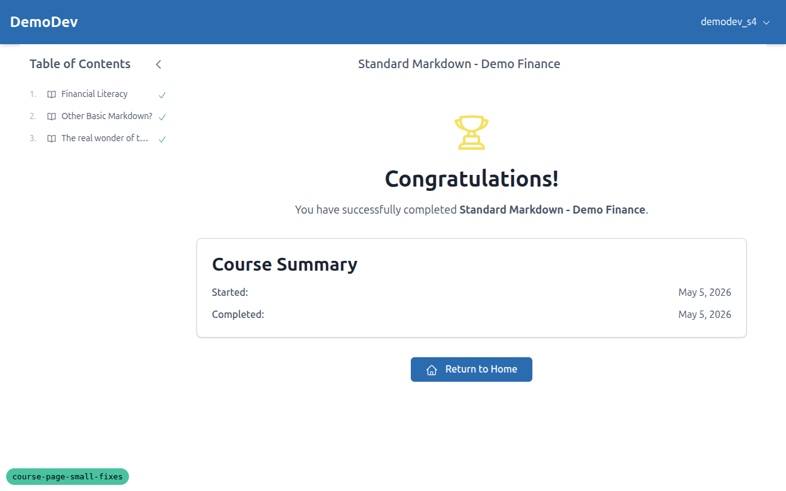
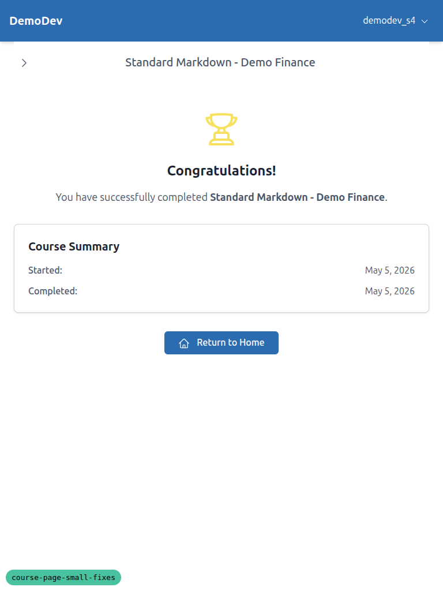
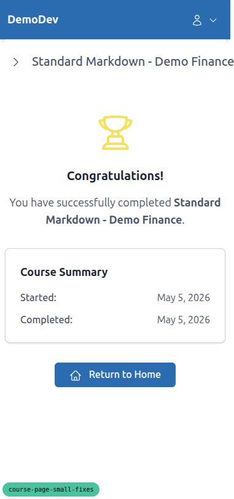

# QA Report: course-page-small-fixes

Manual Playwright-MCP run against branch `course-page-small-fixes` on `http://127.0.0.1:8791/` (DemoDev site).

## Summary

All four tests in `3. frontend_qa.md` pass at desktop (1280x800), tablet (768x1024) and mobile (375x812) viewport sizes. No console errors, no 4xx/5xx requests in normal flows, no layout breakage. The presentational fixes render exactly as specified.

## Test data setup

The dev DB had no learners registered for `standard-markdown-demo-finance`. Four existing demo learners were configured (passwords `testpass123`, allauth `EmailAddress` rows verified) using the project's factory_boy factories:

| Learner | State | Used for |
|---|---|---|
| `demodev_s1@email.com` | registered, no progress | Test 1 |
| `demodev_s2@email.com` | registered, topics 1 & 2 complete, last topic incomplete | Test 2 |
| `demodev_s3@email.com` | registered, topics 1 & 2 complete, topic 3 incomplete | Test 3 |
| `demodev_s4@email.com` | registered, all topics + course complete | Test 4 |

(Note: the `do_qa.md` command instructs delegating to the `qa-data-helper` sub-agent for this. The sub-agent was unavailable in this run's tool palette; the data was created in-process using the same factory_boy factories the agent would have used: `UserCourseRegistrationFactory`, `TopicProgressFactory`, plus `CourseProgress.objects.get_or_create` for the completed-course state. No new factories were created.)

## Test 1 - Topic page, "not yet complete" state

**Status:** PASS

URL: `/courses/standard-markdown-demo-finance/2/` as `demodev_s1`.

DOM inspection of the nav row:

- Previous: `<a class="btn btn-outline">` containing an `arrow-left` SVG with `mr-2` (icon LEFT of label "Previous").
- Next: `<button name="mark_complete" type="submit" class="btn btn-primary">` with label "Next" followed by an `arrow-right` SVG with `ml-2` (icon RIGHT of label).

Spacing reads cleanly at all three widths. At 375px both buttons sit on a single row with no overlap.

- 
- 
- 

## Test 2 - Topic page, "Finish Course" state

**Status:** PASS

URL: `/courses/standard-markdown-demo-finance/3/` as `demodev_s2` (last topic, all prior items complete).

DOM inspection:

- Single submit button: `<button name="mark_complete" type="submit" class="btn btn-primary">` with `check` SVG (`mr-2`) before the label "Finish Course".
- No right-side arrow.
- Previous link still shows arrow-left on the left.

- 
- 
- 

## Test 3 - Topic page, "Next is a plain link" state

**Status:** PASS

URL: `/courses/standard-markdown-demo-finance/2/` as `demodev_s3` (topic 2 already complete).

DOM inspection: Next is now an `<a href="/courses/standard-markdown-demo-finance/3/" class="btn btn-primary">` (no surrounding form), with the `next` SVG (`ml-2`) AFTER the label. Previous still shows the arrow on the left.

- 
- 
- 

## Test 4 - Finish page

**Status:** PASS

URL: `/courses/standard-markdown-demo-finance/finish/` as `demodev_s4` (course complete).

DOM inspection of the nav row:

- Exactly one button: `<a href="/" class="btn btn-primary">` containing a `home` SVG (`mr-2`) before the label "Return to Home".
- No "View Course" button anywhere on the page.
- The single button is horizontally centred under the Course Summary card (the `flex justify-center` wrapper with one child still works correctly).

- 
- 
- 

## Console / network checks

- No browser console errors related to the pages under test.
- One stale `404` console entry was logged before `CourseProgress` for `demodev_s4` was created; it does not recur on the successful navigation. Not a regression.
- No 4xx / 5xx requests on the final passes. The Course-page TOC partial loads via `GET /partials/courses/.../toc => 200`.

## Notes / tangential observations

- The Django Debug Toolbar overlays the bottom-right of every page and visually obscured the nav row in early screenshots. To capture clean screenshots an inline `` was injected per page; this is a screenshot-capture concern only and not a regression.
- On mobile the Table-of-Contents drawer opens by default and overlays the main column; closing it (built-in close button) returns the page to a normal full-width column. This is pre-existing behaviour, unrelated to the small-fixes spec.
- The `compress_screenshots.py` helper expects screenshots under a `spec_dd/` directory next to the script and printed `spec_dd/ directory not found`. All produced PNGs are well under the 1024KB pre-commit limit (largest is ~805KB), so no compression was needed and the warning is benign.
