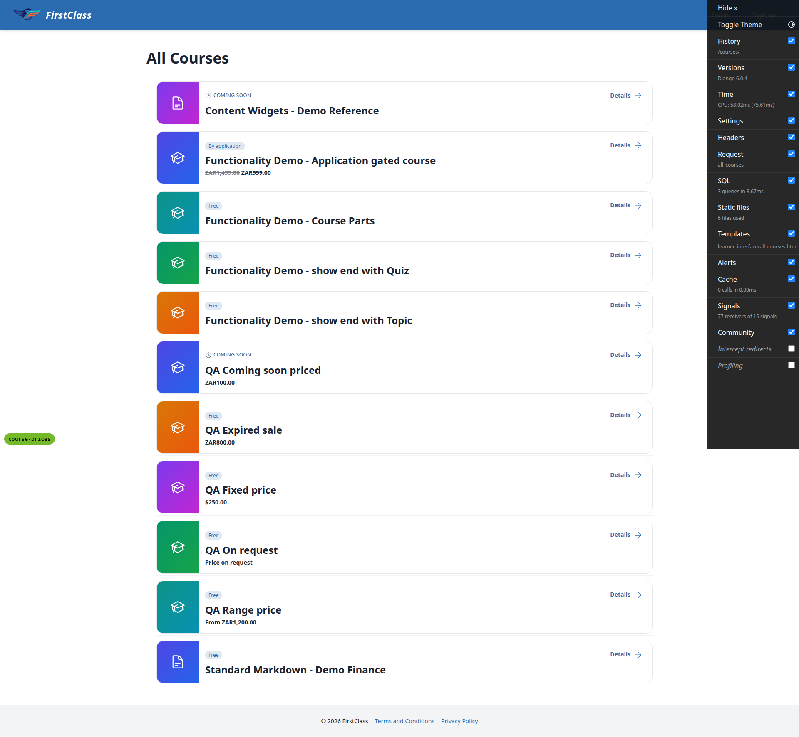
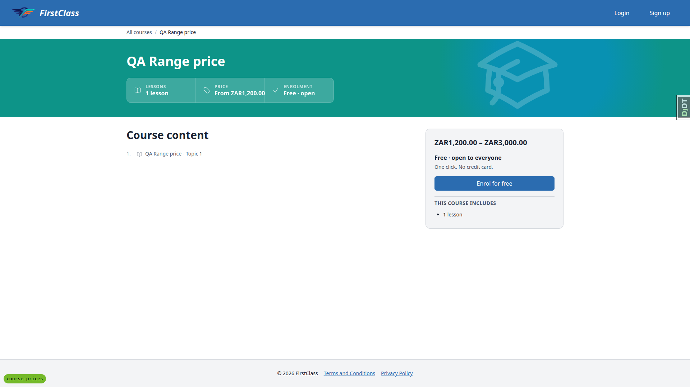
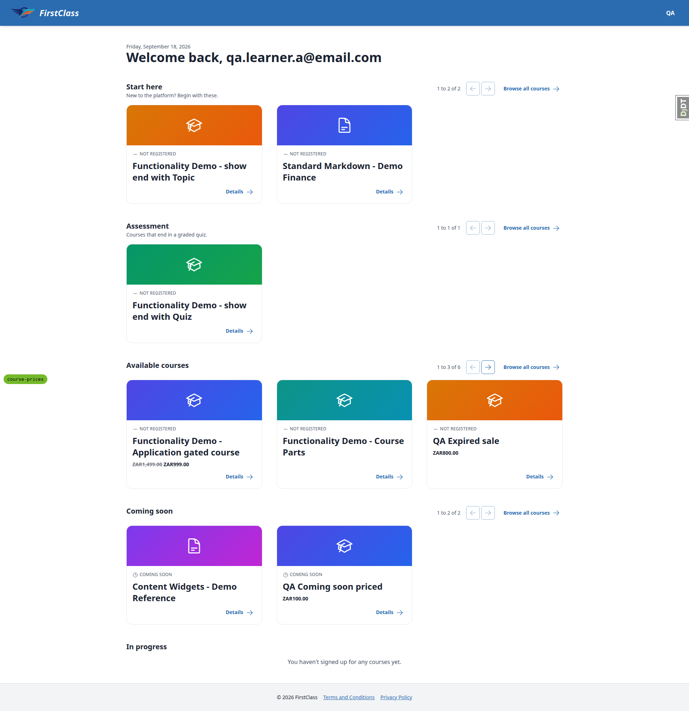
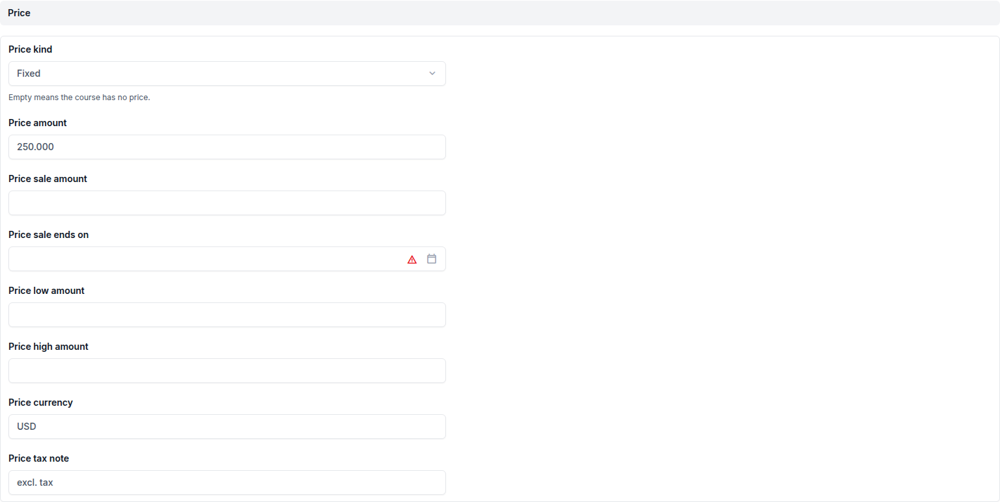
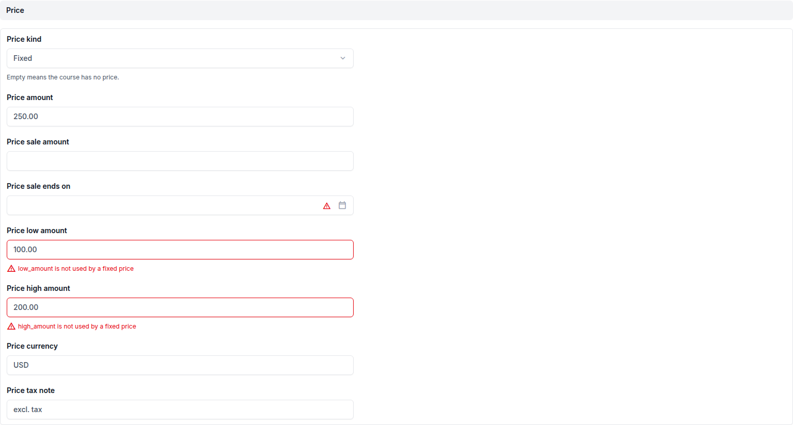
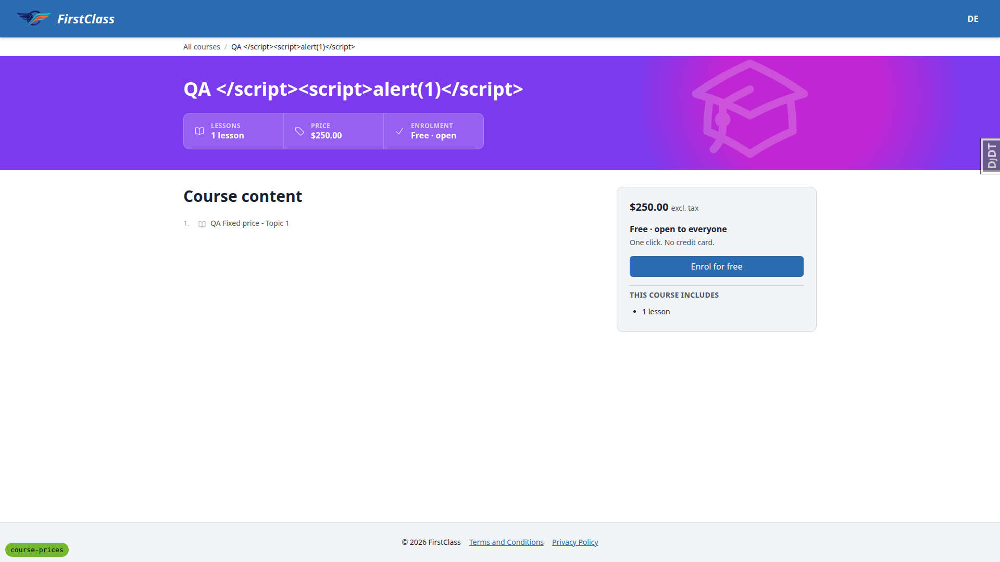
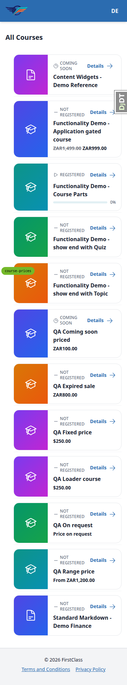
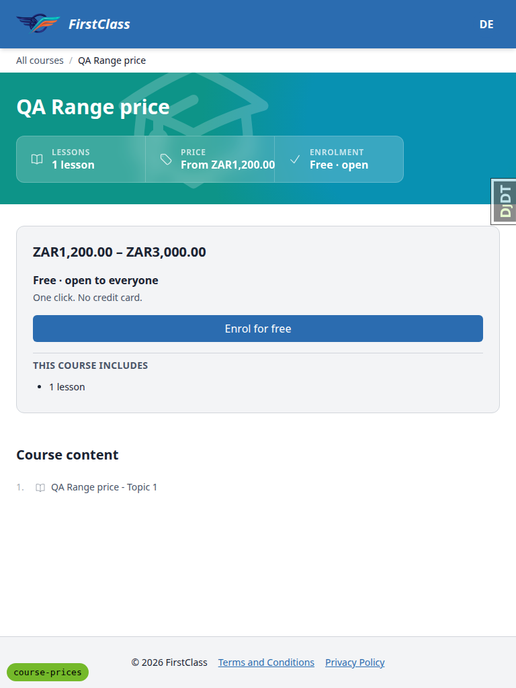

# Frontend QA report: course prices

## 1. Methodology

Manual Playwright MCP run against a fresh dev server (port 8062) on branch `course-prices`.
Viewports exercised: desktop 1920x1080, mobile 375x812, tablet 768x1024. Screenshots were
collected into `screenshots/` beside this report; every image referenced below was verified to
exist at that path via a `Glob` check before writing this report.

The dev database for the branch was empty at the start of the run. The §0 setup in the test plan
was carried out by the `fls-dev:qa-data-helper` agent, which created the `DemoDev` site, the
superuser, Learner A and Learner B, the five QA priced courses (QA Fixed price, QA Range price,
QA On request, QA Expired sale, QA Coming soon priced), and loaded demo content
(`content_save demo_content DemoDev`) to give "Functionality Demo - Application gated course" its
discounted price.

## 2. Diff scoping

Scoping class: **FULL**, triggered by the diff touching learner-facing templates:

- `freedom_ls/learner_interface/templates/cotton/course-price.html`
- `freedom_ls/learner_interface/templates/learner_interface/all_courses.html`
- `freedom_ls/learner_interface/templates/learner_interface/course_detail.html`
- `freedom_ls/learner_interface/templates/learner_interface/partials/course_card.html`
- `freedom_ls/learner_interface/templates/learner_interface/partials/course_listing_price.html`
- `freedom_ls/learner_interface/templates/learner_interface/partials/course_row.html`

Nothing was skipped.

## 3. Smoke gate

**Pass.** Pages checked: `/`, `/courses/`,
`/courses/functionality-demo-application-gated-course/detail/`. No failure recorded.

## 4. Results table

| Test | Viewport | Status | Note | Screenshot |
| --- | --- | --- | --- | --- |
| 1.1 | desktop | pass | Row shows struck-through ZAR1,499.00 then ZAR999.00 on its own line under title; no tax note, no % off, no date; By application badge intact. sr-only Original price:/Now: present in order, hidden. |  |
| 1.2 | desktop | pass | $250.00, no tax note. |  |
| 1.3 | desktop | pass | From ZAR1,200.00; high amount absent. |  |
| 1.4 | desktop | pass | Price on request. |  |
| 1.5 | desktop | pass | ZAR800.00 only; no `<s>`, 500.00 absent. |  |
| 1.6 | desktop | pass | ZAR100.00 with COMING SOON eyebrow intact. |  |
| 1.7 | desktop | pass | Unpriced rows have no price line and are all 103px high; priced rows are all 127px (extra line). Badges unchanged. |  |
| 2.1.1 | desktop | fail | Price cell before Enrolment, white text, correct struck 1,499.00 + 999.00, no tax note. Overflows its fixed w-48 stat-card value column by 61px, running over the divider and covering the Enrolment cell's check icon. See bug B1. | , close-up  |
| 2.1.2 | desktop | pass | Sign-up panel shows struck ZAR1,499.00 ZAR999.00 incl. VAT above "Application required". | — |
| 2.1.3 | desktop | pass | Heading, subtext and "Apply now" unchanged vs main. Anonymous click -> `/accounts/login/?next=/applications/apply/functionality-demo-application-gated-course/`. | — |
| 2.1.4 | desktop | pass | `script#course-jsonld` parses; `offers={@type:Offer, price:'999.00', priceCurrency:ZAR}`, no `priceValidUntil`; `isAccessibleForFree=false` present. | — |
| 2.2.1 | desktop | pass | Stats $250.00; panel $250.00 excl. tax; Offer price '250.00' USD. | — |
| 2.2.2 | desktop | fail | Content correct (stats "From ZAR1,200.00"; panel "ZAR1,200.00 – ZAR3,000.00"; AggregateOffer lowPrice '1200.00' highPrice '3000.00', no offerCount) but the stats price overflows the stat-card by 21px into Enrolment (B1). |  |
| 2.2.3 | desktop | fail | Content correct (Price on request in both; no offers key) but "Price on request" overflows the stat-card by 11px (B1). | — |
| 2.2.4 | desktop | pass | ZAR800.00 in both places; Offer price '800.00' ZAR, no priceValidUntil. Fits its cell. | — |
| 2.2.5 | desktop | pass | Functionality Demo - Course Parts: no Price cell, no panel price, no offers key. | — |
| 2.3 | desktop | pass | `catalogue-jsonld` type=application/ld+json, parses as JSON. All JSON-LD prices are strings at currency precision. | — |
| 3.1 | desktop | pass | Learner A `/courses/`: all six prices from §1 show; eyebrows show Not registered / Coming soon instead of access badge. | — |
| 3.2 | desktop | pass | Dashboard: gated course, QA Expired sale, QA Coming soon priced show compact price under title; unpriced cards unchanged; cards in a grid row stay equal height. |  |
| 3.3 | desktop | pass | Detail page: stats price and panel price (incl. VAT) both render; CTA Apply now. | — |
| 4.1 | desktop | pass | Learner B: gated course shows no price on `/courses/` row or dashboard card; Registered status and progress bar (0%) present. | — |
| 4.2 | desktop | pass | Detail: Price stats cell still shows (and still overflows, see B1); sign-up panel has no price; CTA "Start course". Pre-existing, not from this diff: panel copy for a registered learner reads "Free · open to everyone / One click. No credit card." on this application-gated course. |  |
| 4.3 | desktop | pass | QA Expired sale, QA Fixed price, QA Coming soon priced cards and all other priced rows still show prices for Learner B. | — |
| 5.1 | desktop | pass | Price fieldset with 8 editable fields (kind select + amount, sale amount, sale ends on, low, high, currency, tax note). Amount displays as 250.000 (3 dp storage). |  |
| 5.2 | desktop | pass | Kind range, low 100, high 200 saved; `/courses/` row reads "From $100.00". | — |
| 5.3 | desktop | pass | Fixed + stray low/high: form re-renders with "low_amount is not used by a fixed price" / "high_amount ..." on those two fields. No 500, no generic constraint message. Cleared and saved. |  |
| 5.4 | desktop | pass | Discounted, blank sale -> "sale_amount is required for a discounted price" on sale amount. | — |
| 5.5 | desktop | pass | Sale 250 and 300 rejected on sale amount ("must be less than amount"); 200 saved and renders struck $250.00 then $200.00; JSON-LD Offer 200.00. | — |
| 5.6 | desktop | pass | Range low 300 high 100 rejected on high amount. | — |
| 5.7 | desktop | pass | Amount 0 and -5 both rejected: "amount must be greater than zero." | — |
| 5.8 | desktop | pass | ZZZ rejected on currency: "ZZZ is not a currency code Babel recognises." | — |
| 5.9 | desktop | pass | JPY 1500.50 rejected on amount; JPY 1500 saved, renders ¥1,500 (no decimals), JSON-LD price '1500'; KWD 1.234 saved, renders KWD1.234, JSON-LD '1.234'. | — |
| 5.10 | desktop | pass | on_request + currency rejected on currency; + tax note rejected on tax note; clean on_request saved, shows Price on request, no offers. | — |
| 5.11 | desktop | pass | Blank kind + amount rejected on kind ("Choose a price kind, or clear the price fields."); all empty saved -> no price on row, no Price cell, no panel price, no offers; admin fields all empty. | — |
| 5.12 | desktop | pass | Blank currency -> "Set a currency, or set DEFAULT_CURRENCY." on currency. | — |
| 5.13 | desktop | pass | Tax note `<b>incl</b> ` renders as escaped literal text; no `<b>`, no script element, no dialog. Restored. |  |
| 5.14 | desktop | pass | Title `QA </script>`: no alert, page renders whole, course-jsonld parses with name intact (source escapes `</script>`); catalogue-jsonld parses too. Restored title. |  |
| 6.1 | desktop | pass | Scratchpad copy "QA Loader course" (fresh uuids). Admin range 500-900 ZAR incl. VAT survived a re-load with no `price:` key. | — |
| 6.2 | desktop | pass | `price: null` cleared all 8 stored fields; no price on `/courses/` row, none on course page, no offers; admin fieldset all empty. | — |
| 6.3 | desktop | pass | Range 1200-3000 ZAR then fixed 250 USD: low/high None after the switch. | — |
| 6.4 | desktop | pass | Bare amount 1499.00: exit 1, "Validation failed in .../course.md", Field price -> fixed -> amount, "write amounts as quoted strings, e.g. \"1499.00\"". Stored price unchanged. | — |
| 6.5 | desktop | pass | `kind: subscription`: exit 1, message names 'subscription' and lists expected kinds. Stored price unchanged. | — |
| 6.6 | desktop | pass | Fixed with no currency: exit 1, "<path>/course.md: the price has no currency and DEFAULT_CURRENCY is not set." Stored price unchanged. | — |
| 7.1 | desktop | pass | Card/row diff vs main adds only an include that renders nothing when there is no price; detail page adds Price cell / panel price only when priced; JSON-LD tags switch to `json_ld_script` (same id and type). Unpriced course: no price markup, no offers. | — |
| 7.2 | desktop | pass | Functionality Demo - Course Parts: "Free · open" stat, "Free · open to everyone / One click. No credit card.", "Enrol for free" -> enrolled and landed on first topic. | — |
| 7.3 | desktop | pass | 0 errors, 0 warnings on `/`, `/courses/`, gated course detail page. | — |
| 7.4 | desktop | pass | Dashboard grid: priced and unpriced cards in the same row stretch to equal height (304px row with the gated course / Course Parts / Expired sale). `/courses/` rows: consistent 103px unpriced, 127px priced. |  |
| 1.8 | mobile | pass | 375px `/courses/`: all 7 priced rows show the price on one line inside the row; none overlaps the Details link; scrollWidth 375 (no horizontal scroll). |  |
| 2.1.1 | mobile | pass | Stats cells stack vertically so the price collides with nothing; still extends 61px past the w-48 cell, visible only as the divider line stopping short of the text (minor symptom of B1). Sign-up panel price + incl. VAT readable above Application required; no horizontal scroll. |  |
| 3.2 | mobile | pass | 375px dashboard: single-column cards, compact prices on one line inside each card, no horizontal scroll. | — |
| 2.2.2 | tablet | fail | 768px: stats strip stays horizontal (3 x w-48). "From ZAR1,200.00" crosses the divider into Enrolment by 21px; gated course discounted price overflows 61px, On request 11px (B1). Sign-up panel full-width, range readable. |  |
| 3.2 | tablet | pass | 768px dashboard: two-column cards, prices on one line inside cards, row heights equal within a grid row, no horizontal scroll. |  |
| 1.8 | tablet | pass | 768px `/courses/`: all priced rows show price on one line inside the row, no horizontal scroll. | — |

## 5. Per-bug sections

### B1: Course page stats-strip Price value overflows its fixed-width cell into the Enrolment cell

**Manifestations:**

- 2.1.1 — desktop
- 2.2.2 — desktop
- 2.2.3 — desktop
- 2.2.2 — tablet
- 2.1.1 — mobile

**Screenshots:**

**Expected:** The Price stat cell holds its value like the other cells: the compact price stays
inside the cell, readable, without crossing the divider or covering the Enrolment cell's
icon/text.

**Actual:** The stat-card partial in `course_detail.html` is a fixed `w-48` (192px) box, and
`c-course-price` renders with `whitespace-nowrap`. The discounted compact price (ZAR1,499.00
ZAR999.00, 180px) overflows the 119px value column by 61px, running over the divider and covering
the Enrolment check icon. "From ZAR1,200.00" (range) overflows by 21px and "Price on request" by
11px. Fixed/expired single amounts fit. On desktop and tablet (horizontal strip) the text collides
with the next cell; on mobile the cells stack, so it only shows as the divider stopping short of
the text. Fixing it means choosing a layout (let the Price cell grow, e.g. `min-w-48`/`w-auto`, or
allow wrapping) — a UX choice, and not pytest-testable.

## Bug status

- **UNRESOLVED**: B1, Course page stats-strip Price value overflows its fixed-width cell into the Enrolment cell (reason: red lane, because the fix needs a layout/UX decision on how the Price cell sizes or wraps, and a CSS change can't be tested with pytest)

## 6. General notes

- Mid-run, at 19:47:47 local, someone else rebased the `course-prices` branch onto `main`
  (reflog: rebase finished, HEAD `b90227af`; the runserver auto-reloaded). The rebase pulled in
  only main's header login/next-target fix and other specs' docs. No price code or course
  templates changed, so results from before the rebase still hold.
- The seed created the QA courses with `access_type` free, so they show a "Free" badge / "Enrol
  for free" alongside a price. Spec §Out of scope says FLS neither handles nor forbids a
  free-to-access course with a price. Not a bug.
- Prices render as `ZAR1,499.00` (no space between code and amount) under `en-us`. The plan says
  to check digits and currency, not separators.
- Admin price amounts display with three decimals (e.g. `250.000`) because storage allows KWD
  precision. Admin validation messages use raw field names ("low_amount is not used by a fixed
  price", "a on_request price"), which is cosmetic.
- Pre-existing, not from this diff: on the application-gated course, a registered learner's
  sign-up panel reads "Free · open to everyone / One click. No credit card." and the Enrolment
  stat reads "Free · open". `views.py` on this branch only adds JSON-LD offers.
- Admin changelist showed 4 `ERR_CONNECTION_REFUSED` font loads, which lined up with the
  dev-server reload caused by the rebase. Not reproduced.
- The §6 loader tests ran on a scratchpad copy with fresh UUIDs, and the copied course was deleted
  afterwards. The qa-data-helper also added a reusable seed command,
  `freedom_ls/qa_helpers/management/commands/qa_create_course_price_scenarios.py` (the user's
  later "spec dd progress" commit included it).
- The §5 admin edits used "QA Fixed price", which was restored to fixed 250.00 USD "excl. tax"
  with its original title.

---

status: ok
reason: 1 bug (0 fixed, 1 unresolved); report rendered, screenshots verified
