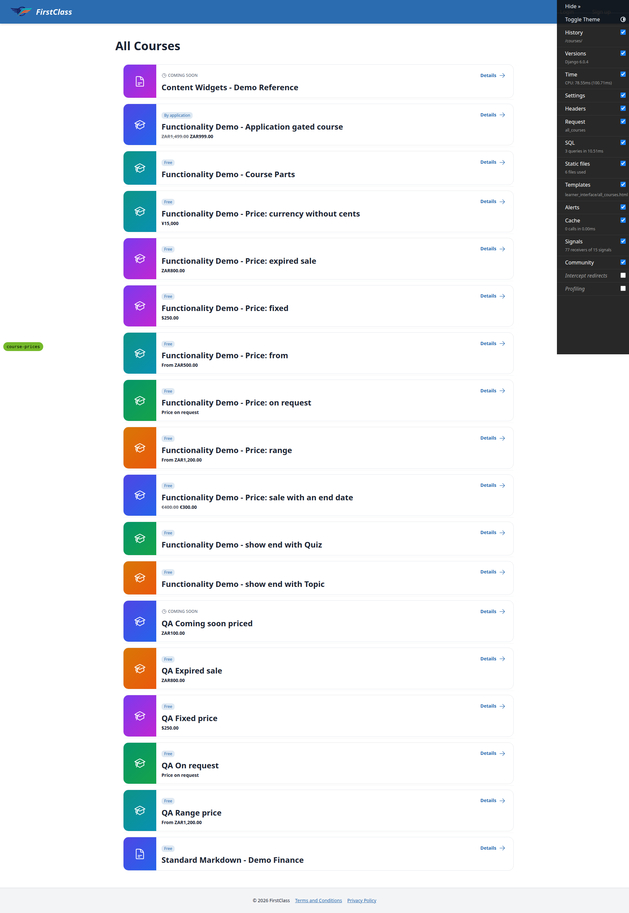
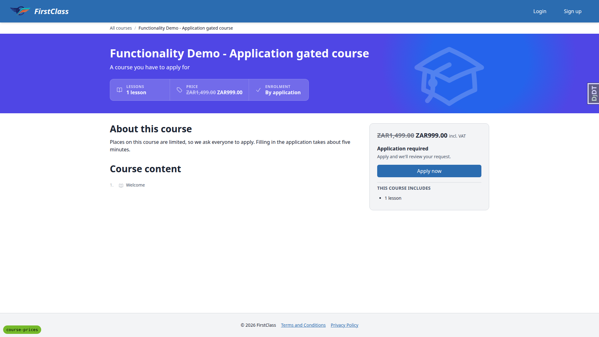
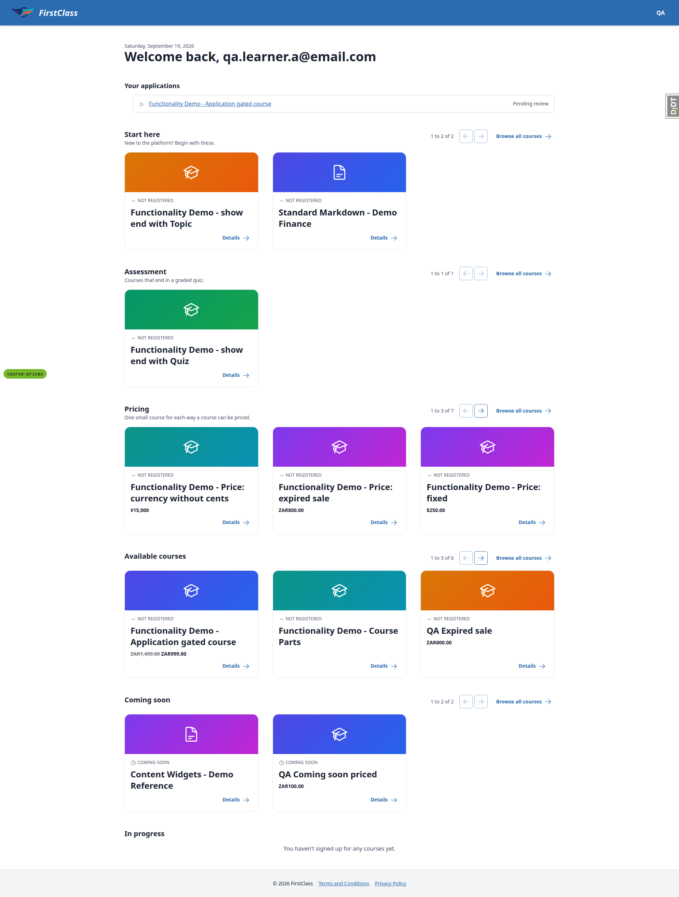
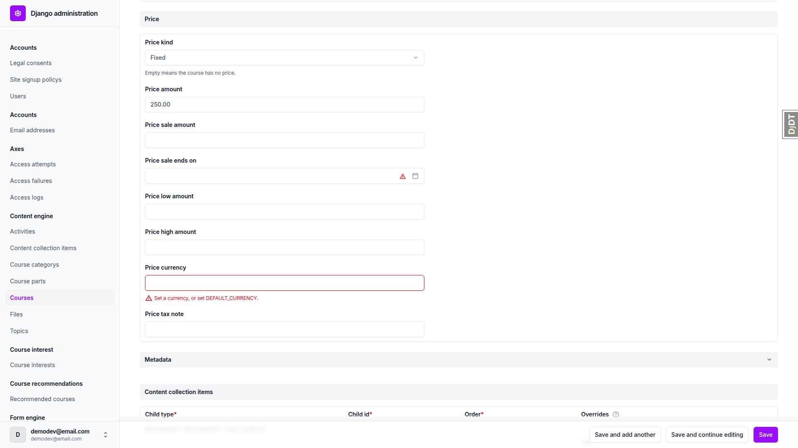
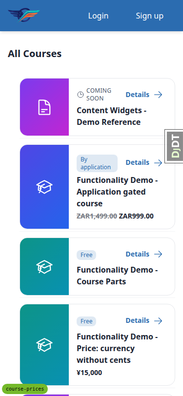
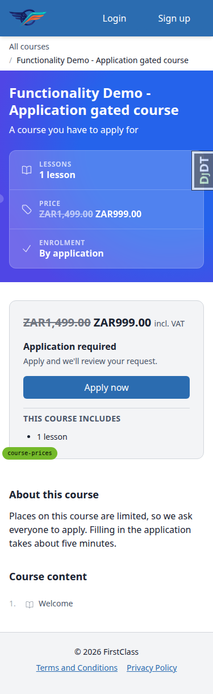
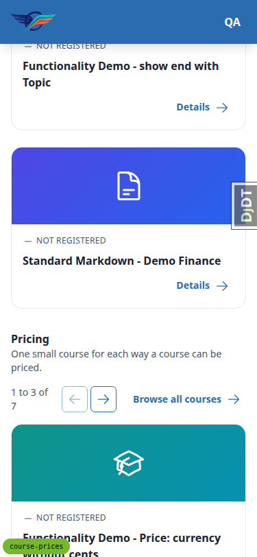
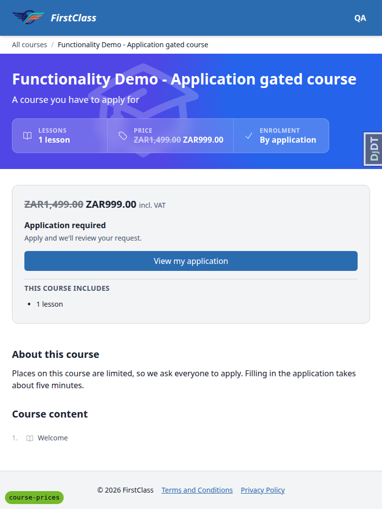
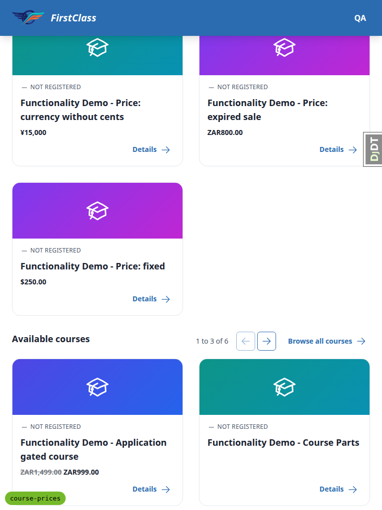

# Frontend QA report: course prices

## Methodology

Ran the plan in `3. frontend_qa.md` against a fresh `uv run python manage.py runserver` on port 8463,
started for this run only. `#debug-branch-badge` on `/` named `course-prices` before any test began,
confirming no other server held the port (screenshot `page-2026-09-19T07-57-33-663Z.png`).

Seed: `migrate`, `content_save demo_content DemoDev`, then `qa_create_course_price_scenarios` to build
the six QA-only priced courses (Fixed, Range, On request, Expired sale, Coming soon priced) and the
two learner accounts.

Checked with Playwright MCP at three viewports: desktop 1920x1080, mobile 375x812, tablet 768x1024.
Screenshots were written to `screenshots/` beside this report; every image referenced below exists in
that directory. Accessibility-snapshot `.yml` files and console `.log` files captured during the run
were dropped before writing the report. A compression pass over `screenshots/` found nothing over 1MB.

## Diff scoping

Changed files touch `course-price.html`, `all_courses.html`, `course_detail.html`, `course_card.html`,
`course_listing_price.html`, `course_row.html`, plus Python content and spec files. This is a template
change, so the diff class is **FULL**: desktop, mobile and tablet all ran. Nothing was skipped.

## Smoke gate

Pass. Checked `/`, `/courses/`, and
`/courses/functionality-demo-application-gated-course/detail/`. No failure URL, no failure reason.

## Results

### §1 All courses page, anonymous (desktop)

| # | Viewport | Status | Notes |
| --- | --- | --- | --- |
| 1.1 | desktop | pass | Gated course row: struck ZAR1,499.00 then ZAR999.00, no tax note, no % off/date; "By application" badge in eyebrow. sr-only "Original price:"/"Now:" spans precede the amounts and are visually hidden. |
| 1.2 | desktop | pass | QA Fixed price row: $250.00, no tax note. |
| 1.3 | desktop | pass | QA Range price row: "From ZAR1,200.00", high amount absent. |
| 1.4 | desktop | pass | QA On request row: "Price on request". |
| 1.5 | desktop | pass | QA Expired sale row: ZAR800.00 only, no struck-through amount, 500.00 absent. |
| 1.6 | desktop | pass | QA Coming soon priced row: ZAR100.00 with COMING SOON eyebrow. |
| 1.7 | desktop | pass | Unpriced rows have no price line and keep the 112px height; priced rows are uniformly 136px. |

*1.1-1.7: all six price kinds on /courses/, desktop.*

### §2 Course page, anonymous (desktop)

| # | Viewport | Status | Notes |
| --- | --- | --- | --- |
| 2.1 | desktop | pass | Gated course page: Price cell (white text) sits directly before Enrolment, struck ZAR1,499.00 + ZAR999.00, no tax note. Sign-up panel shows the same price + "incl. VAT" above "Application required". Acquisition copy unchanged vs main. Apply now -> `/applications/apply/<slug>/` -> login redirect with `next`. JSON-LD offers `{Offer, price "999.00", ZAR}`, no `priceValidUntil`; `isAccessibleForFree=false` present. |
| 2.2.1 | desktop | pass | QA Fixed price: cell $250.00; panel "$250.00 excl. tax"; offers `Offer` price "250.00" USD. |
| 2.2.2 | desktop | pass | QA Range price: cell "From ZAR1,200.00"; panel "ZAR1,200.00 – ZAR3,000.00"; `AggregateOffer` lowPrice "1200.00" highPrice "3000.00", no offerCount. |
| 2.2.3 | desktop | pass | QA On request: cell and panel "Price on request"; no `offers` key. |
| 2.2.4 | desktop | pass | QA Expired sale: cell and panel ZAR800.00 only; `Offer` price "800.00", no `priceValidUntil`. |
| 2.2.5 | desktop | pass | Unpriced course (Course Parts): no Price cell, no price in panel, no `offers` key. |
| 2.3 | desktop | pass | `catalogue-jsonld` script has `type="application/ld+json"` and parses. |

*2.1: gated course detail page, desktop.*

### §3 Signed-in, not registered — Learner A (desktop)

| # | Viewport | Status | Notes |
| --- | --- | --- | --- |
| 3.1 | desktop | pass | `/courses/`: every §1 price still shows; eyebrows show NOT REGISTERED / COMING SOON instead of access badges. |
| 3.2 | desktop | pass | Dashboard: priced not-registered cards (Pricing, Available courses) and QA Coming soon priced show the compact price under the title; unpriced cards unchanged. Cards in a row share heights. |
| 3.3 | desktop | pass | Gated course detail as Learner A: Price cell and panel price (with "incl. VAT") both show. Learner A has a pending application left from an earlier run, so the CTA reads "View my application"; this does not affect price display. |

*3.2: Learner A dashboard, desktop.*

### §4 Registered — Learner B (desktop)

| # | Viewport | Status | Notes |
| --- | --- | --- | --- |
| 4.1 | desktop | pass | Learner B: gated course row reads REGISTERED + 0% progress bar, no price; dashboard "In progress" card shows no price. QA Fixed price row still shows $250.00. |
| 4.2 | desktop | pass | Learner B detail: Price stat still shows; sign-up panel has no price, CTA "Start course". Enrolment cell and panel say "Free · open" beside the price. |
| 4.3 | desktop | pass | Other priced courses still show prices for Learner B. |

No screenshot captured for §4; the checks were made against page text and DOM state.

### §5 Admin (desktop)

| # | Viewport | Status | Notes |
| --- | --- | --- | --- |
| 5.1 | desktop | pass | Price fieldset with 8 editable fields (kind select with ''/fixed/range/discounted/on_request). Amount displays as "250.000" (3-dp storage) in admin. |
| 5.2 | desktop | pass | Kind range low 100 high 200 saved; /courses/ row reads "From $100.00". |
| 5.3 | desktop | pass | Fixed with stray low/high: "Not used by a fixed price." under price_low_amount and price_high_amount; top note only "Please correct the errors below."; no 500. Clearing saved. |
| 5.4 | desktop | pass | Discounted no sale: "Required for a discounted price." on price_sale_amount. |
| 5.5 | desktop | pass | Sale 250 and 300 rejected on price_sale_amount ("Must be less than the full amount."); 200 saved. |
| 5.6 | desktop | pass | Range low 300 high 100 rejected on price_high_amount ("Must be greater than the low amount."). |
| 5.7 | desktop | pass | Amount 0 and -5 rejected on price_amount ("Must be greater than zero."). |
| 5.8 | desktop | pass | ZZZ rejected on price_currency ("'ZZZ' is not a recognised currency code."). |
| 5.9 | desktop | pass | JPY 1500.50 rejected on price_amount; JPY 1500 saved and course page shows ¥1,500 (no decimals); KWD 1.234 saved. |
| 5.10 | desktop | pass | on_request with currency / tax note rejected on those fields ("Not used by an on-request price."); with all else empty it saved. |
| 5.11 | desktop | pass | Blank kind + amount rejected on price_kind; all empty saved and course page showed no price cell, no panel price, no offers. |
| 5.12 | desktop | pass | Blank currency: "Set a currency, or set DEFAULT_CURRENCY." on price_currency. Red triangle beside the sale-ends-on date input is Django's standard timezone-offset hint, not an error. |
| 5.13 | desktop | pass | Tax note `<b>incl</b> ` renders as escaped literal text, no bold, no script element, no dialog. Restored to "excl. tax". |
| 5.14 | desktop | pass | Title `QA </script>`: no dialog, page renders fully, course-jsonld escapes "<" as `<` and parses with the title intact. Title restored; QA Fixed price back to fixed 250 USD excl. tax. |

*5.1/5.12: admin Price fieldset, desktop.*

*5.13: escaped tax note markup, desktop.*

### §6 Content loader (desktop)

| # | Viewport | Status | Notes |
| --- | --- | --- | --- |
| 6.1 | desktop | pass | Copied demo course (scratchpad, "QA Loader course"); price set in admin (fixed 777 USD "admin note") survived a re-load with no `price:` key. |
| 6.2 | desktop | pass | `price: null` cleared every price column; /courses/ row, course page (no cell, no panel price, no offers) and all 8 admin fields empty. |
| 6.3 | desktop | pass | Range (100-200 ZAR) then fixed 300 ZAR: low/high amounts cleared to None. |
| 6.4 | desktop | pass | Bare amount `1499.00`: validation fails at price -> fixed -> amount with "write amounts as quoted strings, e.g. \"1499.00\""; stored price unchanged. |
| 6.5 | desktop | pass | `kind: subscription` fails and names "subscription" against the expected tags. |
| 6.6 | desktop | pass | Fixed with no currency fails naming the course.md path and "DEFAULT_CURRENCY is not set". Unlike 6.4/6.5 it surfaces as a raw ValueError traceback rather than the formatted validation report. |

No screenshot captured for §6; the checks were made against loader output and admin field state.

### §7 Regression sweep (desktop)

| # | Viewport | Status | Notes |
| --- | --- | --- | --- |
| 7.1 | desktop | pass | Unpriced course: row/card templates only gain a price include that renders nothing without a price; listing templates change only `json_script` -> `json_ld_script`. Unpriced detail page has no Price cell and no offers. Rows keep the 112px unpriced height. |
| 7.2 | desktop | pass | Free open course (show end with Quiz) as Learner A: "Free · open to everyone / One click. No credit card. / Enrol for free", no Price cell; enrolling lands on topic 1 with the course outline at 0%. |
| 7.3 | desktop | pass | No console errors on `/`, `/courses/`, a course detail page or the enrol flow. Only warnings come from the YouTube embed on a topic page (unrelated). |
| 7.4 | desktop | pass | Mixed priced/unpriced rows and cards line up; cards in a dashboard row share heights. |

Screenshot for 7.4 (desktop) is the same dashboard capture as 3.2, `page-2026-09-19T07-58-57-827Z.png` (above).

### Mobile (375x812)

| # | Viewport | Status | Notes |
| --- | --- | --- | --- |
| 1.8 | mobile | pass | 375px /courses/: no horizontal scroll (scrollWidth 375); every price is one line (19px), none overlaps Details or exceeds the viewport. |
| 2.1 | mobile | pass | Gated course page at 375px: stats cells stack full width with even dividers; Price cell and panel price ("incl. VAT") fit; Apply now intact. |
| 2.2 | mobile | pass | All 13 priced course pages at 375px: no horizontal scroll, every stat-cell and panel price stays inside its box (widest: range panel "ZAR1,200.00 – ZAR3,000.00" ends at 299px of a 359px panel). |
| 3.2 | mobile | pass | Dashboard as Learner A at 375px: cards stack, compact prices one line, no overflow; header nav shows the avatar. |

*1.8: /courses/ at 375px.*

*2.1: gated course detail page, mobile.*

*3.2: Learner A dashboard, mobile.*

### Tablet (768x1024)

| # | Viewport | Status | Notes |
| --- | --- | --- | --- |
| 2.1 | tablet | pass | 768px gated course page: three stat cells in one row (Lessons / Price / Enrolment), Price cell widens to fit the discounted price; panel full width with price + incl. VAT. |
| 2.2 | tablet | pass | Range and sale-with-end-date pages at 768px: stats cells stay on one row, no price overflows its cell or panel, no horizontal scroll. |
| 7.4 | tablet | pass | Dashboard two-column grid: priced and unpriced cards in the same row share height and Details links align; /courses/ rows one-line prices, no scroll. |

*2.1: gated course detail page, tablet.*

*7.4: dashboard grid, tablet.*

## Bugs

No `bug` records were produced this run. No bugs found.

## Bug status

No bugs found this run.

## General notes

a. Plan §0.2.9's example course "Functionality Demo - Standard markdown" does not exist; "Functionality
   Demo - Course Parts" and "Standard Markdown - Demo Finance" served as the unpriced courses.

b. Learner A still has a pending application to the gated course from an earlier run, so its CTA reads
   "View my application". Price display is unaffected. The seed command does not clear applications.

c. Admin shows stored amounts with 3 decimal places (e.g. "250.000" for USD), as in the previous run.

d. Loader case 6.6 (no currency, no `DEFAULT_CURRENCY`) fails with a raw ValueError traceback naming
   the file, where 6.4/6.5 give the formatted validation report. Meets the plan; noted for consistency.

e. The registered learner sees "Free · open" copy beside the Price cell (B1 from the previous run,
   closed by decision).

f. The red triangle beside the admin "Price sale ends on" field is Django's standard timezone-offset
   hint.

g. Only console warnings seen came from a YouTube embed on a topic page.

h. §6 used a copied course in the session scratchpad ("QA Loader course"); it was deleted from the dev
   DB afterwards.

---
status: ok
reason: report rendered, 0 bugs documented
