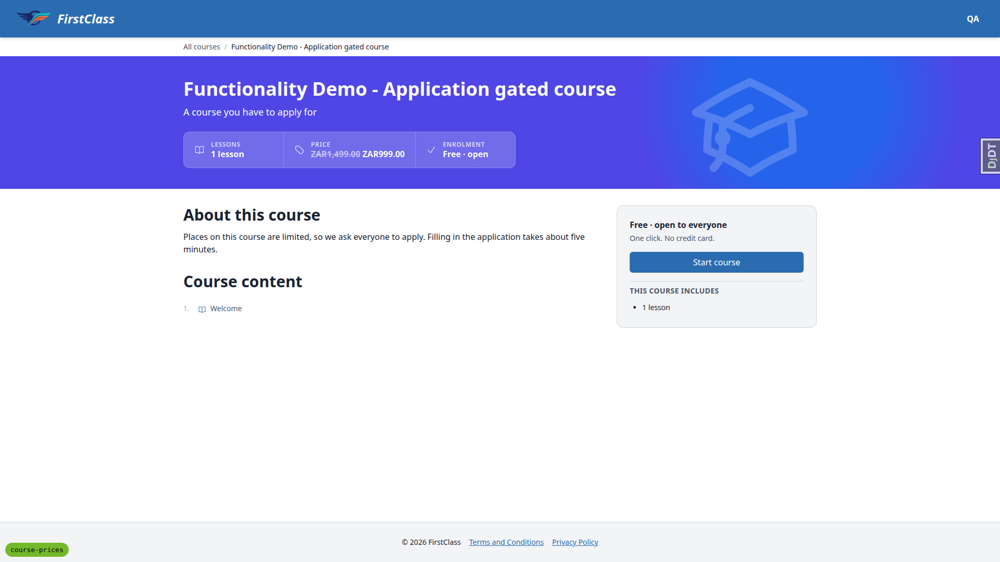
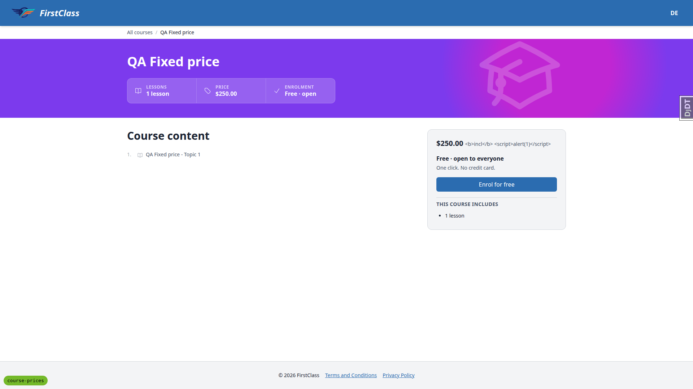
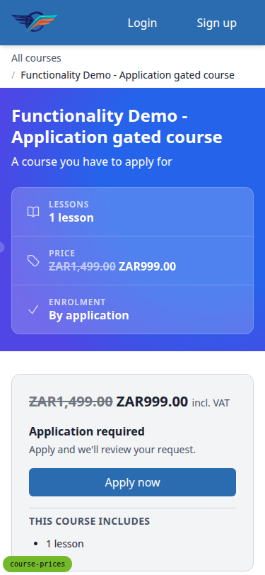
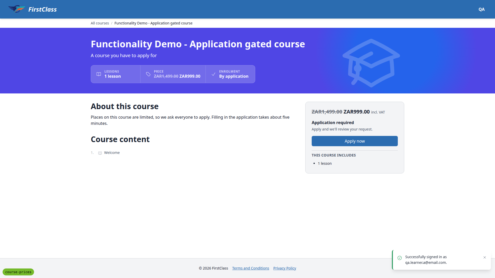
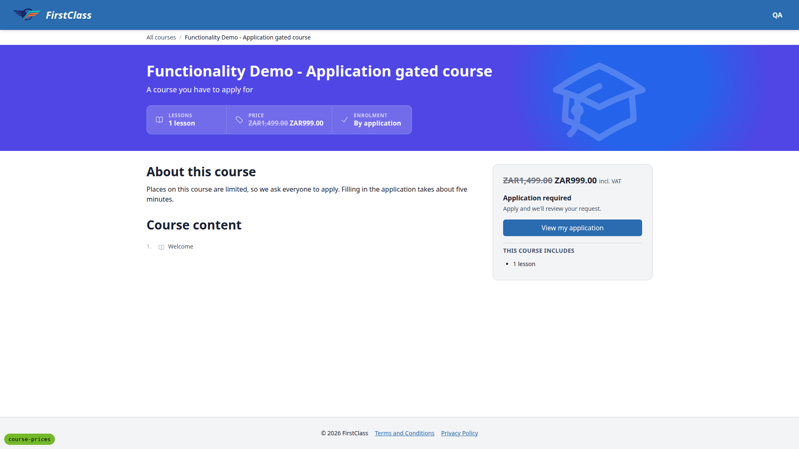
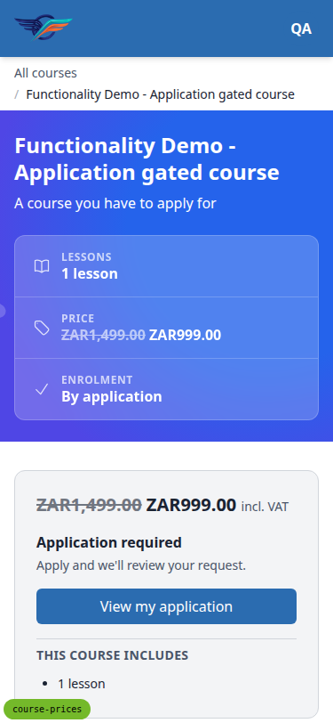
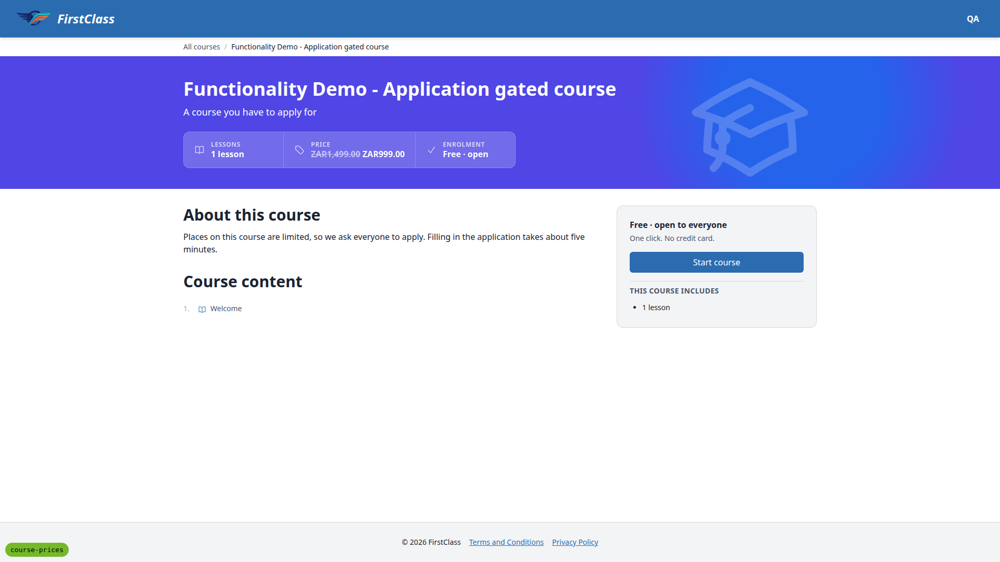
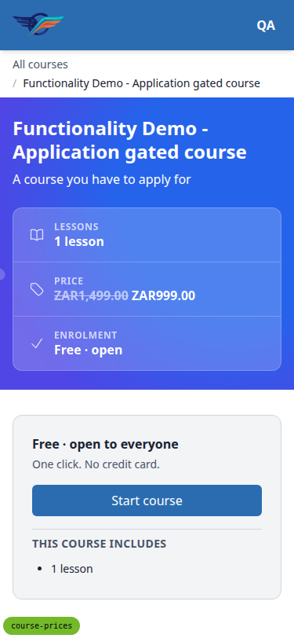
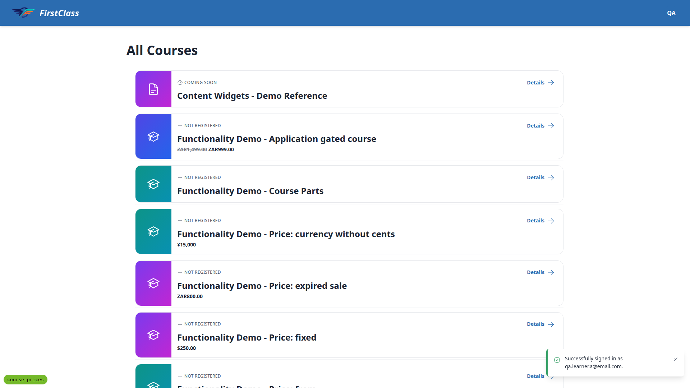

# Frontend QA Report — course-prices

## Methodology

Walked the test plan `3. frontend_qa.md` with the Playwright MCP browser at three viewports: desktop (1920x1080), mobile (375x812) and tablet (768x1024).

Seed data was built fresh with:

```
uv run manage.py migrate
uv run manage.py content_save demo_content DemoDev
uv run manage.py qa_create_course_price_scenarios
```

Screenshots were collected into `screenshots/` beside this report. Every image referenced below exists in that folder.

## Diff scoping

Scoping class: **FULL**.

Changed files that triggered the full run:

- `freedom_ls/learner_interface/templates/cotton/course-price.html`
- `freedom_ls/learner_interface/templates/learner_interface/all_courses.html`
- `freedom_ls/learner_interface/templates/learner_interface/course_detail.html`
- `freedom_ls/learner_interface/templates/learner_interface/partials/course_card.html`
- `freedom_ls/learner_interface/templates/learner_interface/partials/course_row.html`
- `freedom_ls/learner_interface/templates/learner_interface/partials/course_listing_price.html`
- `freedom_ls/content_engine/admin.py`
- `freedom_ls/content_engine/models/courses.py`
- `freedom_ls/content_engine/prices.py`
- `freedom_ls/learner_interface/views.py`
- `demo_content/*`

Nothing was skipped: desktop, mobile and tablet all ran.

## Smoke gate

Status: **pass**.

Pages loaded:

- `http://127.0.0.1:8130/`
- `http://127.0.0.1:8130/courses/`

## Results

| Test ID | Viewport | Status | Note |
|---|---|---|---|
| 1.1 | desktop | pass | Struck ZAR1,499.00 + ZAR999.00 under title; By application badge kept; sr-only Original price:/Now: present. |
| 1.2 | desktop | pass | $250.00, no tax note. |
| 1.3 | desktop | pass | From ZAR1,200.00; high amount absent. |
| 1.4 | desktop | pass | Price on request. |
| 1.5 | desktop | pass | ZAR800.00 only; 500 absent, no strike. |
| 1.6 | desktop | pass | ZAR100.00 with COMING SOON eyebrow. |
| 1.7 | desktop | pass | Unpriced rows have no price line; 103px vs 127px for priced rows. |
| 1.8 | mobile | pass | No horizontal scroll at 375px; price on one 19px line, no overlap with Details link. |
| 1.sr | desktop | pass | sr-only 'Original price:'/'Now:' present before amounts, neither visible on screen. |
| 2.1.1 | desktop | pass | Price stat cell before Enrolment; struck ZAR1,499.00 + ZAR999.00, no tax note. |
| 2.1.2 | desktop | pass | Sign-up panel shows price above 'Application required', 'incl. VAT'. |
| 2.1.3 | desktop | pass | Heading/subtext/CTA match main backend strings; CTA redirects anon to login. |
| 2.1.4 | desktop | pass | course-jsonld Offer price '999.00' ZAR, no priceValidUntil; isAccessibleForFree false. |
| 2.2.1 | desktop | pass | QA Fixed price: stat/panel $250.00; JSON-LD Offer '250.00' USD. |
| 2.2.2 | desktop | pass | QA Range price: 'From ZAR1,200.00'; panel range; AggregateOffer low/high 1200/3000, no offerCount. |
| 2.2.3 | desktop | pass | QA On request: 'Price on request' in stat and panel; no offers key. |
| 2.2.4 | desktop | pass | QA Expired sale: ZAR800.00 only; '500.00' not in page source; no priceValidUntil. |
| 2.2.5 | desktop | pass | Unpriced course: no Price cell, no panel price, no offers key. |
| 2.3 | desktop | pass | catalogue-jsonld type application/ld+json, parses as ItemList. |
| 3.1 | desktop | pass | Learner A /courses/: prices still show; eyebrow shows NOT REGISTERED / COMING SOON. |
| 3.2 | desktop | pass | Dashboard: priced cards show compact price under title; cards in a row share height. |
| 3.3 | desktop | pass | Gated detail as Learner A: struck price, panel price + incl. VAT, Apply now CTA. |
| 4.1 | desktop | pass | Learner B: gated row shows REGISTERED + 0% progress, no price. |
| 4.2 | desktop | pass | Learner B detail: Price stat still shows; panel has no price; CTA 'Start course'. |
| 4.3 | desktop | pass | QA Fixed price and QA Range price still shown to Learner B. |
| 4.2-copy | desktop | fail | Registered learner sees PRICE beside 'Free · open' wording — see bug B1. |
| 5.1 | desktop | pass | Price fieldset with 8 editable fields; amount shows '250.000' (3-dp storage). |
| 5.2 | desktop | pass | Kind range saved; /courses/ row reads 'From $100.00'. |
| 5.3 | desktop | pass | Fixed with stray low/high: field errors, no 500; clearing them saved. |
| 5.4 | desktop | pass | Discounted, no sale amount: error on price_sale_amount. |
| 5.5 | desktop | pass | Sale 250/300 rejected on price_sale_amount; 200 saved. |
| 5.6 | desktop | pass | Range low 300 high 100 rejected on price_high_amount. |
| 5.7 | desktop | pass | Amount 0 and -5 rejected on price_amount. |
| 5.8 | desktop | pass | ZZZ rejected on price_currency. |
| 5.9 | desktop | pass | JPY 1500.50 rejected; JPY 1500 and KWD 1.234 saved and render correctly. |
| 5.10 | desktop | pass | on_request with currency/tax note rejected; bare on_request saved. |
| 5.11 | desktop | pass | Blank kind + amount rejected; all-empty saved with no price anywhere. |
| 5.12 | desktop | pass | Blank currency: 'Set a currency, or set DEFAULT_CURRENCY.' |
| 5.13 | desktop | pass | Tax note with `<b>`/`<script>` renders as literal text; no markup, no dialog. |
| 5.14 | desktop | pass | Title with script tag: no dialog, page renders whole, both JSON-LD blocks parse. |
| 5.msg | desktop | fail | Validation messages expose internal field names/raw kind values — see bug B2. |
| 6.1 | desktop | pass | Admin-set fixed ZAR 99.00 survives a re-load with no price: key. |
| 6.2 | desktop | pass | price: null clears all eight price columns. |
| 6.3 | desktop | pass | Range then fixed: low/high become None. |
| 6.4 | desktop | pass | Bare 1499.00 fails with quoting guidance; stored price unchanged. |
| 6.5 | desktop | pass | kind: subscription fails naming the allowed tags; price unchanged. |
| 6.6 | desktop | pass | Fixed with no currency fails correctly, but as an uncaught ValueError traceback, not the formatted block (see general note c). |
| 7.1 | desktop | pass | Unpriced course: no price markup; template diff vs main noted (json_ld_script rename, stats strip max-width). |
| 7.2 | desktop | pass | Learner A on free open course: enrols and lands on course page. |
| 7.3 | desktop | pass | No console/page errors; only pre-existing CSP report-only info messages. |
| 7.4 | desktop | pass | Priced/unpriced cards in the same row share height; list rows 127px vs 103px. |
| 2.1 | mobile | pass | Gated detail at 375px: stats stack, price on one line, panel full width, no horizontal scroll. |
| 2.1-dividers | mobile | fail | Ragged divider lines when stats stack — see bug B3. |
| 3.2 | mobile | pass | Dashboard at 375px: cards full width, no overflow. |
| 5.1 | mobile | pass | Admin Price fieldset at 375px: inputs 317px wide, no horizontal scroll. |
| 2.1 | tablet | pass | 768px: Lessons/Price/Enrolment on one row, panel full width, no horizontal scroll. |
| 1.8 | tablet | pass | /courses/ rows 696px wide, no overflow. |
| 3.2 | tablet | pass | Dashboard two-column grid; priced/unpriced cards in a row share height. |

## Bugs

### B1: Registered learner sees a price next to 'Free · open' wording on a gated course

**Manifestations:** test 4.2-copy (desktop)

**Screenshots:**



**Expected:** A registered learner on a priced, application-gated course sees no copy that contradicts the price shown in the stats strip.

**Actual:** Stats strip shows 'PRICE ZAR1,499.00 ZAR999.00' beside 'ENROLMENT Free · open', and the sign-up panel reads 'Free · open to everyone / One click. No credit card. / Start course'. The Free wording is pre-existing on main (registered learners fall through to the free backend's decision in `course_applications/backends.py`); the spec keeps the Price cell for registered learners, which puts the two side by side. Needs a product decision.

### B2: Admin price validation messages use internal field names and raw kind values

**Manifestations:** test 5.msg (desktop)

**Screenshots:** none captured.

**Expected:** Errors in the admin's words, e.g. 'Low amount is not used by a fixed price', 'Currency is not used by an on-request price'.

**Actual:** 'low_amount is not used by a fixed price', 'currency is not used by a on_request price', 'sale_amount must be less than amount.' The errors sit on the right fields; only the wording is off.

### B3: Ragged divider lines in the stacked stats strip on mobile

**Manifestations:** test 2.1-dividers (mobile)

**Screenshots:**


**Expected:** When the stats cells stack at 375px, the dividers between them span the same width, as on main where every cell was `w-48`.

**Actual:** The Price cell grows to its content (253px discounted, 213px range) while the others stay 192px, so each cell's top border ends at a different x inside the 343px box.

## Bug status

- **WON'T FIX (decision)**: B1. Registered learners keep seeing the price, since they may want to tell friends what it costs. Price is display-only, so the inherited access copy and CTAs stay as they are.
- **FIXED**: B2. Price rule messages no longer name their own field and read kinds in plain words ("Not used by an on-request price.", "Must be less than the full amount."). The bundled fls-content validator copy is re-synced.
- **FIXED**: B3. Below `md` every stat cell spans the strip. From `md` the cells sit side by side. `sm` was not enough: at 640px a discounted price fits two cells but not three, which wrapped two-then-one. A Playwright test covers 375px and 640px.

## General notes

a. Amounts render with no space between the currency code and the digits (`ZAR1,499.00`). The plan checks only digits and currency, so this is not a failure.

b. The admin amount input shows 3-decimal storage (`250.000`).

c. Test 6.6 fails correctly but surfaces as an uncaught `ValueError` traceback from `content_save`, not the formatted validation block that 6.4 and 6.5 get.

d. The debug toolbar was hidden during capture.

e. Section 6 ran on a scratchpad copy of a demo course, which was deleted afterwards through qa-data-helper.

f. Test 7.1 compared against main at template level, not with a live main server.

g. CSP report-only info messages for CDN scripts are pre-existing.

## Tax note rendering (test 5.13)



---
status: ok
reason: 3 bugs — 0 fixed, 3 unresolved (all red lane); report rendered, screenshots verified

## Application-gated QA (follow-up)

Priced courses are expected to be application-gated, with payment taken outside FLS: the learner sees the price, then applies. This pass walked that flow on "Functionality Demo - Application gated course" (discounted ZAR1,499.00 → ZAR999.00, incl. VAT) after the B2/B3 fixes, on a fresh `runserver` with the `course-prices` branch badge confirmed.

| # | State | Viewport | Status | Note |
|---|---|---|---|---|
| G1 | Anonymous | desktop, mobile | pass | Price in the stats strip and the panel, "Application required", "Apply now" → apply page. Mobile: three stacked cells all span 16–358px, no horizontal scroll. |
| G2 | Learner A, not registered | desktop | pass | Same price and "Apply now". Completed all three form pages (upload included) and submitted. The dashboard shows "Your applications: Pending review". |
| G3 | Learner A, application pending | desktop, mobile | pass | Price still shown in the strip and the panel. CTA is "View my application". |
| G4 | Learner B, registered | desktop, mobile | pass (B1 decision) | The Price stat shows beside "Enrolment: Free · open". The panel reads "Free · open to everyone / One click. No credit card. / Start course", with no price. |
| G5 | `/courses/` | desktop | pass | Learner A (pending): gated row shows the struck price + sale price. Learner B: REGISTERED + 0%, no price. |
| B3 | Stats strip at 640px and 768px | — | pass | 640px: three full-width stacked cells. 768px: one row (Lessons / Price / Enrolment). |

No console errors.

Observations, left alone because they are not price-related:

- G3: while an application is pending, the panel still reads "Application required / Apply and we'll review your request." above "View my application". The same copy shows on courses without a price.
- G4: "Free · open" / "One click. No credit card." sits beside a paid price for a registered learner (B1, kept by decision). The copy comes from the free backend, which registered learners fall through to.
- G5: while an application is pending, the `/courses/` eyebrow says NOT REGISTERED.

Screenshots:








