# QA Report — Coming Soon & Hidden Courses

**Feature:** Course visibility (`published` / `coming_soon` / `hidden`) with student express-interest and educator demand/visibility management.
**Date:** 2026-06-30
**Branch:** `courses_coming_soon`
**Site:** DemoDev (dev server forces `FORCE_SITE_NAME = "DemoDev"`, so the random port still resolves to DemoDev data)
**Test plan:** `3. frontend_qa.md`
**Tooling:** Playwright MCP. Test data provisioned via the `fls:qa-data-helper` agent (idempotent `qa_create_course_visibility` management command).

## Test data used

| Shape | Slug | Visibility |
|---|---|---|
| published-free | `qa-published-free-visibility` | `published` (free) |
| coming-soon | `qa-coming-soon-visibility` | `coming_soon` |
| hidden, unregistered | `qa-hidden-visibility` | `hidden` |
| hidden, registered | `qa-hidden-registered-visibility` | `hidden` |

- Student: `demodev_visibility_student@email.com` (registered in `qa-hidden-registered-visibility` + `qa-published-free-visibility`; **not** registered in `qa-hidden-visibility`).
- Educator: `demodev_visibility_educator@email.com`.

## Result summary

| Test | Surface | Result |
|---|---|---|
| 1 | Coming-soon discoverable + badged (list + card) | ✅ Pass |
| 2 | Express interest HTMX swap + idempotency + remove | ✅ Pass |
| 3 | Coming-soon detail page (accessible, funnel copy, no content access) | ✅ Pass |
| 4 | Hidden course invisible + 404 | ✅ Pass |
| 5 | Hidden-registered stays available + content accessible | ✅ Pass |
| 6 | Published course unchanged | ✅ Pass |
| 7 | Educator demand view + visibility management | ✅ Pass — see Finding 1 (resolved) |
| 8 | No scarcity / no notification promises | ✅ Pass |

Mobile (375×812) and tablet (768×1024) layouts were spot-checked for the new student surfaces — all clean (see below). Django-admin screens were not viewport-tested per the QA command.

---

## Findings

### Finding 1 — Educator cannot edit course visibility from the educator Details panel (Test 7) — RESOLVED: working as intended

**Resolution:** This is **not** a bug. The spec has been clarified: course `visibility` is configured **only** in the course content front-matter (loaded into the DB at import), and is **not** editable in the educator interface or the Django admin. So the educator Details panel correctly renders `visibility` **read-only** with no Edit affordance — that is the intended behaviour.

**Original observation:** Logged in as the educator, the course Details panel showed `visibility` as plain read-only text (`coming_soon`) with no Edit button/form.

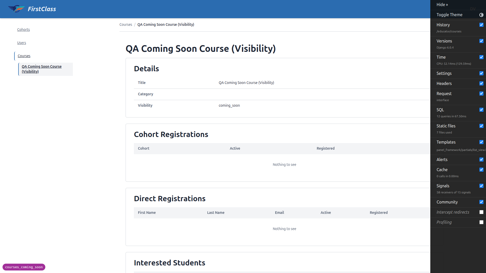

**What changed:** the now-unwanted editing code added by batch ccs-5 was removed — the educator `CourseForm` and the `editable`/`form_class` on `CourseDetailsPanel` are gone (panel back to read-only `["title", "category"]`), and the Course admin now lists `visibility` in `readonly_fields` (still shown for support, not editable). The spec (§9, §14), plan (Task 5.3) and QA plan (Test 7) were updated to match. Tests now assert the lock instead of editability.

**How visibility is flipped:** edit the course `course.md` front-matter `visibility:` value (or use the `qa_create_course_visibility` management command) and re-import. Validated end-to-end: setting `coming_soon` → `published` this way is immediately reflected on the student side — the formerly-coming-soon course becomes a normal enrollable course (normal "Start" CTA, no "Coming soon" badge, no express-interest control, no launch notification anywhere). See Test 7 evidence below.

The QA data helper correctly **refused** to grant the educator `change_course` (flagging it as a privilege escalation) — consistent with the now-confirmed design that educators do not change visibility.

---

## Passing tests — evidence

### Test 1 — Coming-soon discoverable + badged
All-courses list and dashboard card both show the coming-soon course with a **"Coming soon"** badge/eyebrow and an **"I'm interested"** control, and **no** Enrol/Start/Apply button. The hidden (unregistered) course does not appear; the published and hidden-registered courses appear normally.

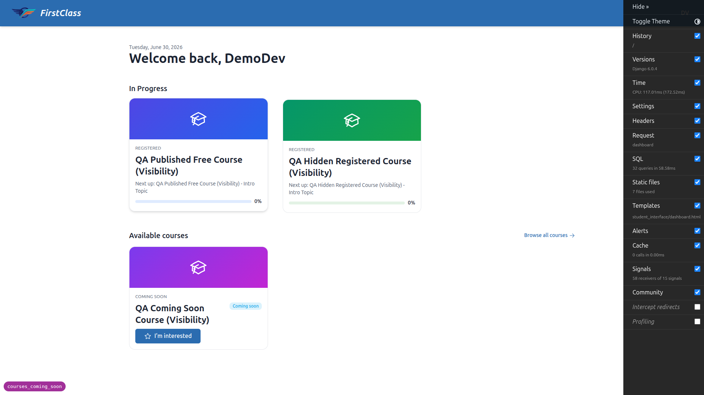

### Test 2 — Express interest (HTMX) + idempotency + remove
Clicking **"I'm interested"** swaps the CTA in place (no reload) to an **"Interested"** state with a quiet **"Remove interest"** link and the message *"This course will show up here when it opens."* — no email/notification promise. State persisted across reload (exactly one interest record, confirmed by the educator interest count = 1). **"Remove interest"** swaps back to **"I'm interested"** immediately; also persists.

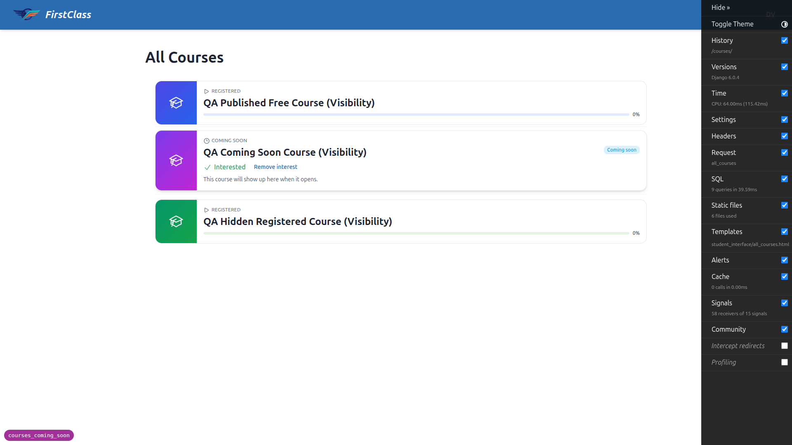

### Test 3 — Coming-soon detail page
Detail page is accessible (200). Reads as coming-soon (*"Register your interest and it'll show up here when it opens."*) — not the free "One click. No credit card." nor gated "Application required" copy. Primary affordance is the express-interest control reflecting the current state. The lesson is **Locked**, and navigating directly to the player URL (`/courses/<slug>/1/`) **redirects back to the detail page** — no content access.

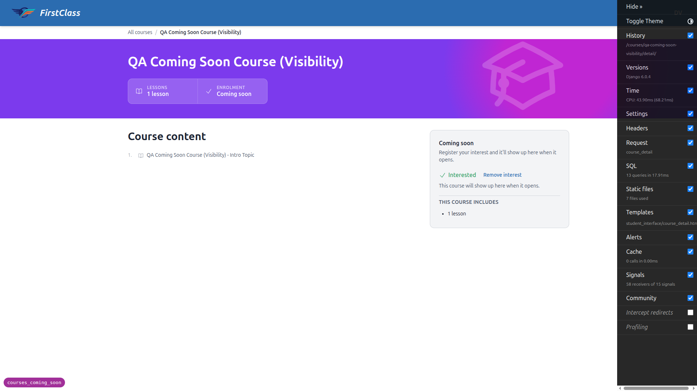

### Test 4 — Hidden course invisible + 404
The hidden (unregistered) course appears nowhere in discovery. Direct navigation to its detail URL returns **HTTP 404** (confirmed via fetch — `404`, not a redirect or login prompt).

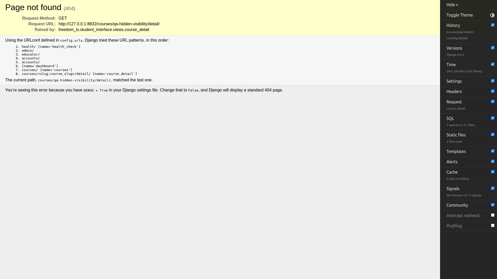

### Test 5 — Hidden-registered stays available
For the registered student, `qa-hidden-registered-visibility` appears in the dashboard "In Progress" list, the detail page loads (200), and the content/player is accessible despite the hidden state — mid-course access preserved.

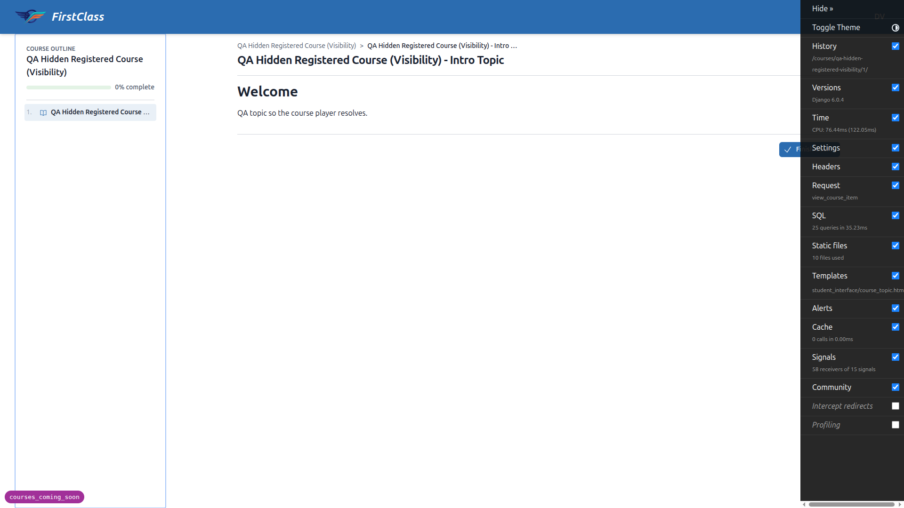

### Test 6 — Published course unchanged
`published-free` shows normal "Free · open" / "One click. No credit card." / "Start" CTA, no coming-soon badge, no express-interest control, content accessible per access type.

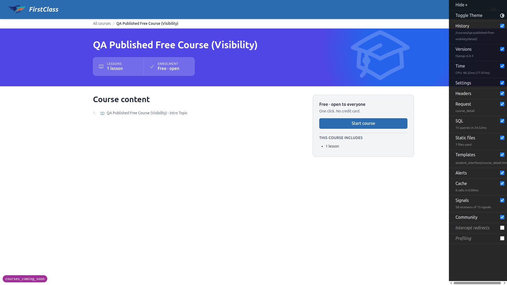

### Test 7 — Educator demand view (list + interest count + interested-students panel)
The educator course-management list shows a **Visibility** column and an **Interest** column. The coming-soon course shows interest count **1** (matching the single student who expressed interest); other courses show their states (Published / Hidden / Coming soon).

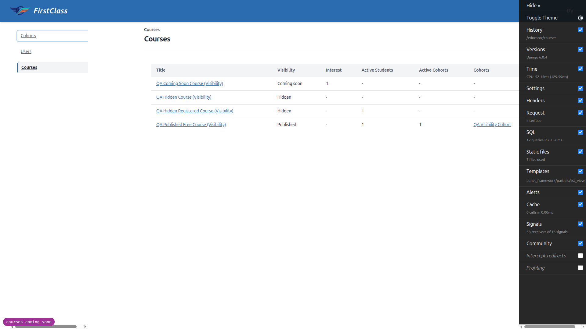

The coming-soon course's detail view includes an **Interested Students** panel listing the student name, email, and the timestamp they expressed interest.

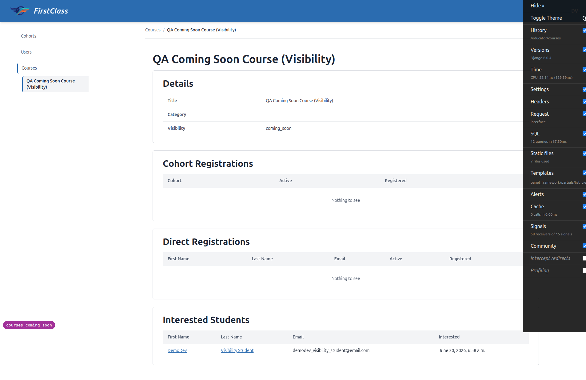

**Step 7 (visibility flip → enrollable), validated via the Django admin path** (see Finding 1): after setting visibility to `published`, the student sees the course as a normal enrollable course — "Start" CTA, no "Coming soon" badge, no express-interest control, no launch notification.

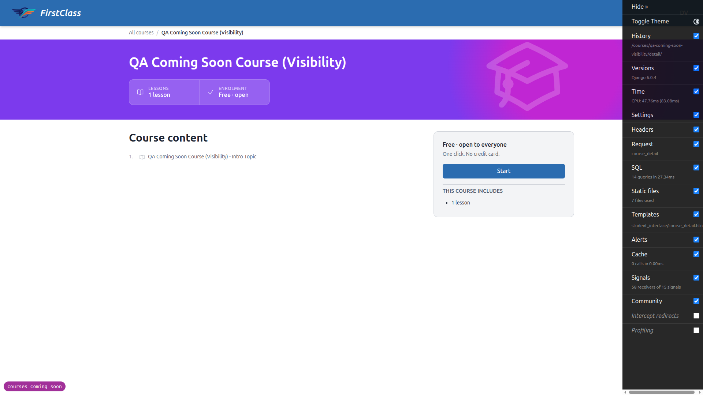

### Test 8 — No scarcity / no notification promises
Across every coming-soon student surface (dashboard card, all-courses row, detail page, and the post-click confirmation swap) there is **no** queue position, **no** "X people ahead", **no** countdown, **no** interest count shown to the student, and **no** copy promising an email/in-app notification on launch. The interest **count** is shown only in the educator interface.

---

## Mobile & tablet

**Mobile (375×812)** — Dashboard cards stack vertically; the coming-soon card renders the badge, "Interested"/"Remove interest" controls, and helper text without overflow. The detail page stacks the hero stats and express-interest panel into a single column. The express-interest HTMX toggle works in both directions at mobile width. Touch targets for the interest controls are adequate.

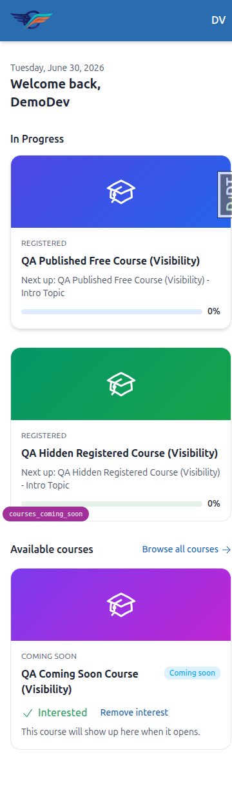
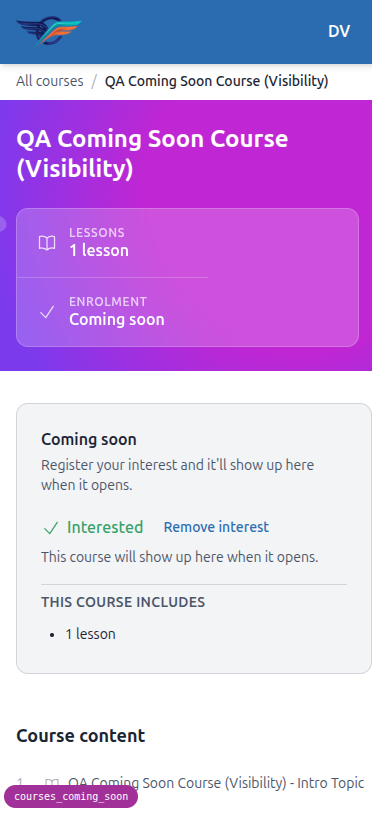
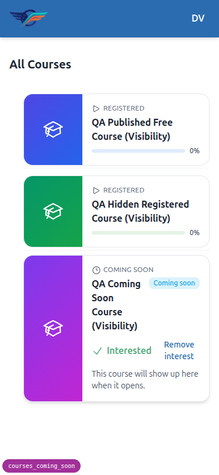

**Tablet (768×1024)** — The site uses the desktop nav at this width (no hamburger). All-courses rows lay out horizontally (thumbnail + content + badge) and the detail page's express-interest panel spans the column cleanly. No crowding or overflow.

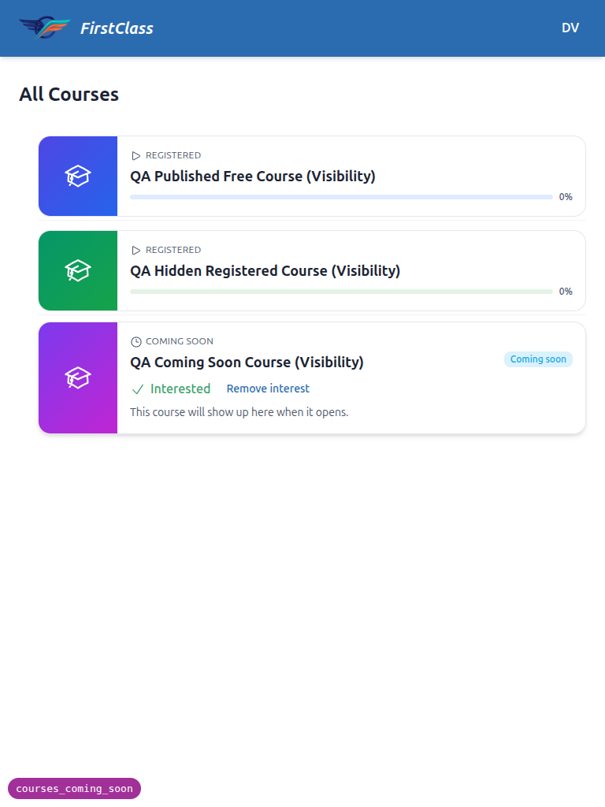
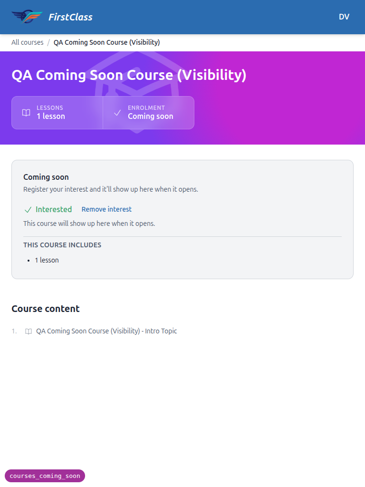

---

## Notes / difficulties

- **Site resolution:** the QA data helper initially warned that DemoDev's Site domain is `127.0.0.1:8000`, implying the app had to be hit on port 8000. This is not the case under dev settings — `config/settings_dev.py` sets `FORCE_SITE_NAME = "DemoDev"`, so the app resolves to DemoDev on any port. Testing on the random port (8832) showed DemoDev data correctly.
- **Privilege escalation refused (working as intended):** to exercise Test 7 step 6 through the educator panel, the educator would need object-level `change_course`. The `fls:qa-data-helper` agent's safety classifier blocked granting it (escalation requiring user authorization) and the staged change was reverted, leaving no permission change in the DB and the data command in its original state. The visibility-flip behaviour was therefore validated via the Django admin superuser path instead. See Finding 1.
- **Django Debug Toolbar** is enabled in dev and overlaps content on narrow viewports; it was hidden before capturing mobile/tablet screenshots. This is a dev-only artifact, not a feature defect.
- **Pre-existing debug branch badge** (`courses_coming_soon`, bottom-left) appears on all pages — expected dev affordance, used in Step 3 to confirm the correct branch/port.
