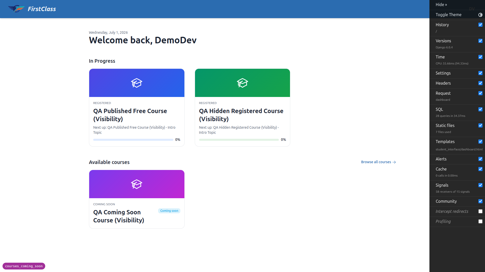
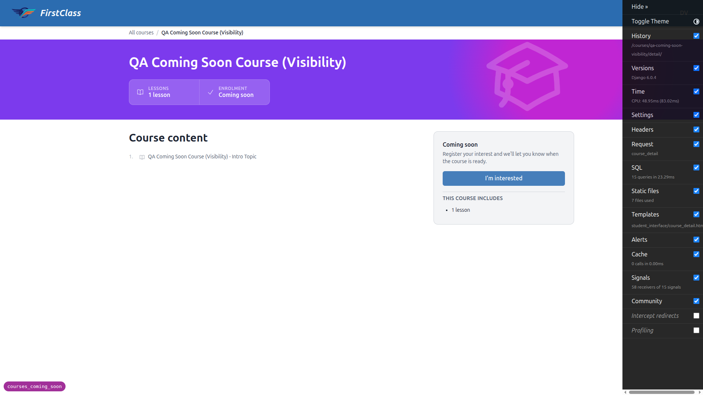
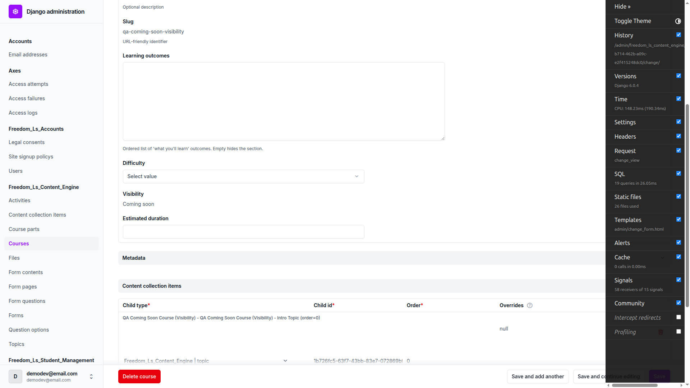
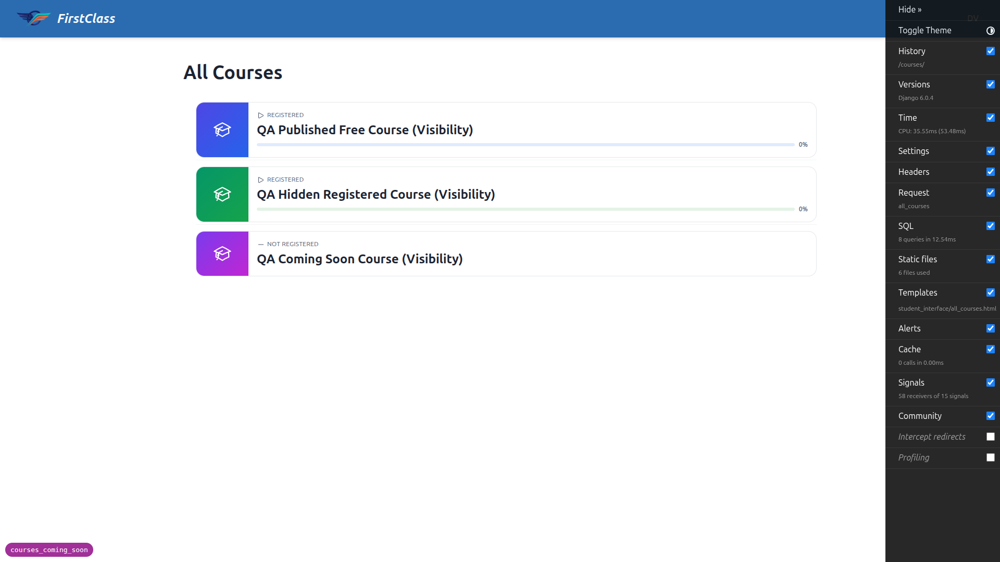
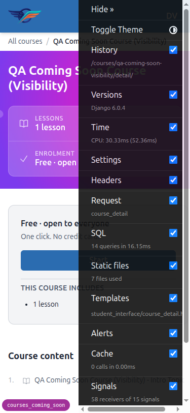
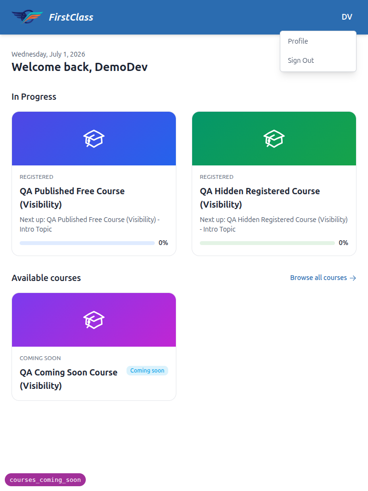

# QA Report — Coming Soon & Hidden Courses

**Feature:** Course visibility (`published` / `coming_soon` / `hidden`), express-interest flow, and educator demand view.
**Date:** 2026-07-01
**Branch:** `courses_coming_soon`
**Site:** DemoDev (dev server forces `FORCE_SITE_NAME = "DemoDev"`, so every request on any port resolves to DemoDev; the "FirstClass" text in the header is just `HEADER_TITLE` branding, not a separate site).
**Tooling:** Playwright MCP, desktop 1920×1080 + mobile 375×812 + tablet 768×1024.

## Result summary

**All 8 tests passed. No bugs found.** Mobile and tablet responsive checks also passed with no layout, navigation, or touch-target issues.

Test data was provisioned by the `fls:qa-data-helper` agent (accounts + four visibility courses on DemoDev). Test 8's `coming_soon → published` flip (and the reset back) were also performed by that agent via targeted `save(update_fields=["visibility"])`, preserving the interest record.

| Test | Description | Result |
|------|-------------|--------|
| 1 | Coming-soon course discoverable + badged, no CTA / no interest control in listings | ✅ Pass |
| 2 | Express interest HTMX swap + idempotency + remove | ✅ Pass |
| 3 | Coming-soon detail page (accessible, funnel copy, interest control, no content access) | ✅ Pass |
| 4 | Hidden course invisible to unregistered student + direct URL 404 | ✅ Pass |
| 5 | Hidden course stays available to a registered student | ✅ Pass |
| 6 | Published course unchanged | ✅ Pass |
| 7 | Educator demand view + read-only visibility (incl. Django admin) | ✅ Pass |
| 8 | `coming_soon → published` transition, enrollable, no notification | ✅ Pass |

---

## Test 1 — Coming-soon course is discoverable and badged ✅

- All-courses page (`/courses/`): the `qa-coming-soon-visibility` course is listed with a **"Coming soon"** badge and is a **plain link to its detail page** (`/courses/qa-coming-soon-visibility/detail/`). No Enrol/Start/Apply button and **no "I'm interested"** control in the listing.
- Dashboard card/grid view: same presentation — "Coming soon" eyebrow, plain detail link, no CTA.
- The unregistered `qa-hidden-visibility` course does **not** appear in either surface.

## Test 2 — Express interest (HTMX swap) and idempotency ✅

On the coming-soon detail page the express-interest control swaps **in place with no page reload**:

- Not-interested → **"I'm interested"** button.
- Click → immediately swaps to an **"Interested"** confirmation with a quiet **"Remove interest"** secondary button.
- Reload → state persists as **"Interested"** (exactly one interest recorded; the educator interest count later reads `1`).
- Click **"Remove interest"** → swaps back to **"I'm interested"**; reload confirms not-interested persists.

The copy sets a soft expectation (*"Register your interest and we'll let you know when the course is ready."*) with **no scarcity** (no queue position, count, or countdown).

## Test 3 — Coming-soon detail page ✅

- Detail page loads (200, not 404).
- Reads as "coming soon": eyebrow "Coming soon", Enrolment "Coming soon", funnel copy — **not** the free "One click. No credit card." nor a gated "Application required" copy.
- Primary affordance is the **express-interest control** reflecting current interest state — not a plain enrol link.
- No content access: the outline topic is marked **Locked**, and navigating directly to the player URL (`/courses/qa-coming-soon-visibility/1/`) **redirects back to the detail page**.

## Test 4 — Hidden course invisible to unregistered student ✅

- `qa-hidden-visibility` (student not registered) does not appear anywhere in discovery (confirmed in Test 1).
- Direct navigation to `/courses/qa-hidden-visibility/detail/` returns **HTTP 404** — no redirect, no login prompt that would confirm existence.

## Test 5 — Hidden course stays available to a registered student ✅

- `qa-hidden-registered-visibility` appears in the student's registered/in-progress lists and is openable.
- Its content player (`/courses/qa-hidden-registered-visibility/1/`) loads (200) and the Intro Topic is accessible — mid-course access is preserved despite the hidden state.

## Test 6 — Published courses unchanged ✅

- `qa-published-free-visibility` detail page shows the normal **"Start course"** CTA with "Free · open to everyone / One click. No credit card." copy.
- No coming-soon badge, no express-interest control; the outline topic is a normal clickable link ("Not started"), and content is accessible per the free access type.

## Test 7 — Educator demand view + visibility management ✅

- Educator course-management list (`/educator/courses`) shows a **Visibility** column (Coming soon / Hidden / Hidden / Published) and an **Interest** column. The coming-soon course shows an interest count of **1**, matching the student who expressed interest.
- The coming-soon course's detail view has an **"Interested Students"** panel listing the student's name, email, and the timestamp of interest (July 1, 2026, 4:49 p.m.).
- **Visibility is read-only** in the educator interface — there is no Edit affordance for it.
- **Django admin**: `CourseAdmin.readonly_fields = ("slug", "visibility")`. The change form renders "Visibility: Coming soon" as static text with **no editable input** (`[name="visibility"]` is absent from the form).

## Test 8 — `coming_soon → published` transition ✅

After flipping `qa-coming-soon-visibility` to `visibility = published` (via the qa-data-helper agent, interest record preserved 1→1):

- In discovery the course loses its "Coming soon" badge and shows a normal enrollable presentation (**"Not registered"** badge, plain detail link).
- On the detail page it now shows a normal **"Start"** CTA with free-access copy and **no express-interest control**.
- **No automated launch notification is sent** — confirmed at the code level: there is no `post_save`/signal/`send_mail` trigger on the transition anywhere in `course_interest` / `content_engine`; the `CourseInterest` model docstring notes notify-on-launch (`notified_at`) is not yet implemented (spec §10). Dev mail is routed to Mailpit (`EMAIL_HOST=localhost:1025`), so any mail would be observable — none is generated.

The course was then reset back to `coming_soon` (interest intact) to leave the scenario re-runnable.

## Test 8 (cont.) — No scarcity mechanics ✅

Across all coming-soon surfaces (dashboard cards, all-courses rows, detail page, and the interested-confirmation swap) there is **no** queue position, "X people ahead", countdown, or interest count shown to students — only a "Coming soon" badge and the soft "we'll let you know when the course is ready" expectation.

---

## Responsive checks

**Mobile (375×812):** dashboard, all-courses, and the coming-soon detail page all render single-column with no overflow or overlap. The coming-soon card keeps its badge; the express-interest control renders as a full-width, comfortably-sized touch target.

**Tablet (768×1024):** the header user-menu (Profile / Sign Out) opens correctly; the dashboard's In-Progress and Available-courses sections and the coming-soon detail layout adapt sensibly at this width.

---

## Notes / tangential observations (not defects)

- **Header shows "FirstClass" while the site is DemoDev.** This is expected: `config/settings_dev.py` sets `HEADER_TITLE = "FirstClass"` and `FORCE_SITE_NAME = "DemoDev"`. Not a bug.
- **Django Debug Toolbar overlapped the top-left user-menu click target** at mobile/tablet widths, requiring the toolbar to be hidden before the menu could be clicked in automation. This is a dev-only artifact (the toolbar is not present in production) and does not reflect a frontend defect.
- The QA fixture course is literally titled "QA Coming Soon Course (Visibility)"; that text in the heading is the course **name**, independent of its visibility state (which is why, when flipped to published, the title still reads "Coming Soon" but the funnel/CTA correctly switch to the published presentation).

## Nothing skipped

No tests were skipped. All required data existed (or was created/adjusted by the `fls:qa-data-helper` agent), and every test in the plan — including the Test 8 launch transition and the Django-admin read-only check — was executed.
