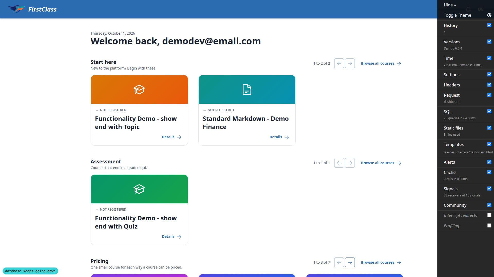
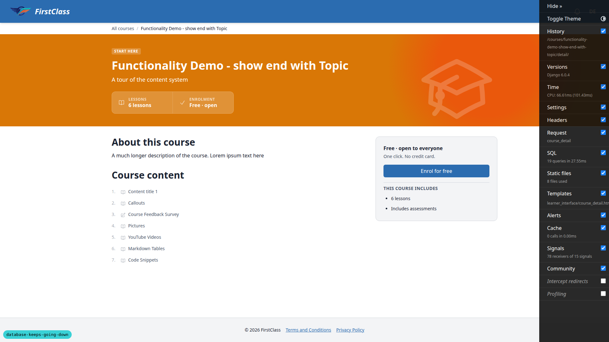
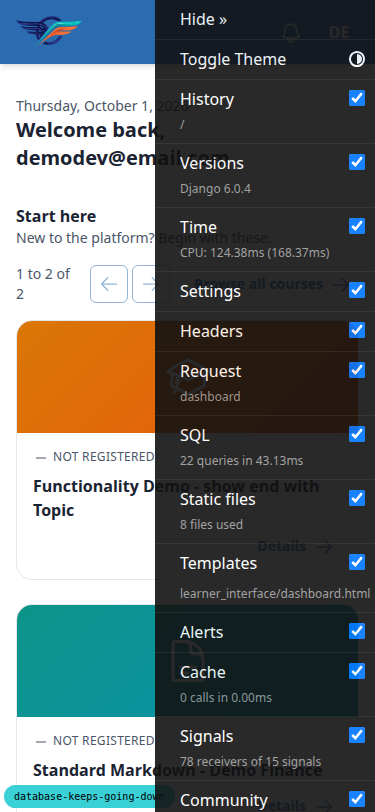
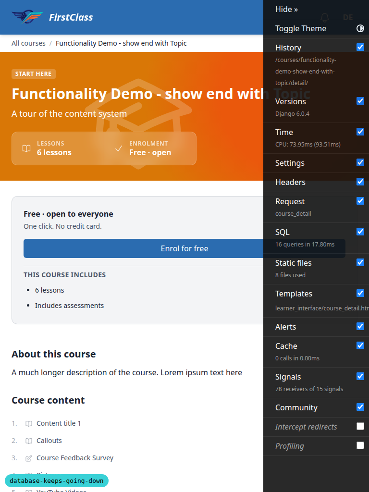

# QA report: the dev database stays up

## Methodology

Terminal scenarios (1, 2, 4-12) were run by hand against the shared `fls_dev_db` compose stack, with
the human's go-ahead obtained for every shared-server step (restart, down/up, full volume wipe).
Scenario 3 was run in the browser through Playwright MCP at desktop 1920x1080, mobile 375x812 and
tablet 768x1024. Screenshots were collected into `screenshots/` beside this report, and every
referenced image exists there. The 16-minute wait (Scenario 7) and the one-hour wait (Scenario 11.5)
were run for real, not simulated or shortened.

## Diff scoping

Class: **FULL**.

The diff touches `claude_plugins/django-stack/templates/wrapper_scripts/reap_playwright_mcp.sh`,
which lives under a `templates/` path, and rule 1 treats any change under `templates/` as triggering a
full run. Other changed paths: `dev_db/*`, `config/settings_dev.py`, `conftest.py`,
`freedom_ls/tests/playwright_fixtures.py`,
`freedom_ls/base/tests/test_dev_tooling_disabled_in_tests.py`, `claude_plugins/fls-dev/scripts/*`,
`claude_plugins/django-stack/.mcp.json`, `tests/*`, `pyproject.toml`, `uv.lock`, and `spec/skill
markdown`.

Nothing in the plan was skipped. FULL fired solely because the shell wrapper lives under
`templates/`; no page template, CSS or JS changed, so the mobile and tablet passes over the Scenario 3
pages are smoke-sized rather than full visual sweeps, but every scenario and step in the plan ran.

## Smoke gate

**Pass.** Pages checked:

- `http://127.0.0.1:8930/` (Dashboard, logged in as `demodev`, branch badge =
  `database-keeps-going-down`)
- `http://127.0.0.1:8930/admin/`

No failure URL or failure reason recorded.

## Results by scenario

### Scenario 1: switch to the new server

| Test | Viewport | Status | Note |
|---|---|---|---|
| 1.1-1.2 | terminal | pass | Old `dev_db` project present only as `Created` leftovers from the previous run's 5.5; `docker compose -p dev_db down` removed them and its network |
| 1.3-1.7 | terminal | pass | `up -d` reports Running for postgres and mailpit, both healthy; `fls_dev_db_pgdata` is the only mount (type volume, no bind); `30 unless-stopped 3221225472 268435456`; no `docker-entrypoint-initdb.d` in `dev_db/` |

### Scenario 2: server settings and the role

| Test | Viewport | Status | Note |
|---|---|---|---|
| 2.1 | terminal | pass | `max_connections` 120, `shared_buffers` 768MB, `fsync` off, `superuser_reserved_connections` 3 |
| 2.2 | terminal | pass | `install_dev.sh` exit 0; `dev_db_init` ran once (one "Databases ready" block); "No migrations to apply"; no permission errors |
| 2.3 | terminal | pass | `create_demo_data --yes` exit 0 (records already existed) |
| 2.4 | terminal | pass | `fls_dev` f\|t\|`{idle_in_transaction_session_timeout=15min}`; `pguser` rolconfig empty; `db_` and `test_db_` owned by `fls_dev`; `db_` stamp repo/worktree match git common dir and worktree root; `test_db_` has no comment |
| 2.5 | terminal | pass | Second `dev_db_init.sh` run exit 0, no error |

### Scenario 3: runserver traffic runs as `fls_dev` (browser)

| Test | Viewport | Status | Note |
|---|---|---|---|
| per-run capture check | desktop | pass | No-filename screenshot written to `qa-screenshots/`, no image bytes in the tool response |
| 3.1-3.2 | desktop | pass | Login works; dashboard and `/admin/` render with nav and main, no traceback; only console error is the pre-existing `favicon.ico` 404 |
| 3.2-course | desktop | pass | Course detail page renders, no traceback, no horizontal overflow |
| 3.3 | terminal | pass | The only `pg_stat_activity` row for `db_database_keeps_going_down` is `fls_dev` / `runserver:-:db_database_keeps_going_down` / idle |
| 3.4 | terminal | pass | `manage.py shell` connection appears as `fls_dev` / `shell:-:db_database_keeps_going_down` alongside the runserver row |
| 3.2-mobile | mobile | pass | Dashboard and course detail at 375px: no horizontal overflow, header and main present, no header/nav target under 24px, no traceback |
| 3.2-tablet | tablet | pass | Course detail at 768px: no overflow, main present, no traceback |

Screenshots:

- per-run capture check (desktop): 
- 3.1-3.2 (desktop): 
- 3.2-course (desktop): 
- 3.2-mobile (mobile): 
- 3.2-tablet (tablet): 

### Scenario 4: a parallel test run

| Test | Viewport | Status | Note |
|---|---|---|---|
| 4.1-4.3 | terminal | pass | Header "created: 4/4 workers" (16-core machine); mid-run `pg_stat_activity` on `test_db_%` shows only `fls_dev` with `pytest:gw0..gw3` names |
| 4.4 | terminal | pass | 5480 passed in 3:40, coverage 92.94%; no `test_db_..._gw%` databases remain |
| 4.5 | terminal | pass | Today's log: all four `_gwN` `CREATE DATABASE name TEMPLATE template0`, all four `DROP DATABASE` succeed, zero "being accessed by other users" errors (previous run's B2 fix holds). Log also shows a separate non-xdist `pytest:-:` process creating/dropping `test_db_database_keeps_going_down` concurrently, which is another process in this worktree, not this run |
| 4.6 | terminal | pass | `log_statement` reset; `fls_dev` rolconfig back to `{idle_in_transaction_session_timeout=15min}` |
| 4.7 | terminal | pass | "created: 6/6 workers", 405 passed; `_gw0`..`_gw5` kept by `--reuse-db` |
| 4.8 | terminal | pass | `dev_db_delete.sh` dropped `db_`, `test_db_` and all six `_gwN` (query returns nothing); worktree restored with `install_dev.sh`, `create_demo_data --yes`, `content_save demo_content DemoDev` |
| 4.8-output | terminal | **fail** | `dev_db_delete.sh` summary prints "Dropped: db_x, test_db_x, test_db_x_gw5" then the other `gwN` names one per line: `WORKER_DBS` is newline-separated psql output interpolated at line 38 — see bug B1 |

### Scenario 5: the container restarts itself, and survives other worktrees

| Test | Viewport | Status | Note |
|---|---|---|---|
| 5.1-5.3 | terminal | pass | `pg_ctl stop -m immediate`: postgres back and healthy within ~6s with no other command, same container ID, RestartCount 0 -> 1 |
| 5.4 | terminal | pass | `compose up` from a detached same-HEAD worktree: both containers "Running", not Recreate; ID and StartedAt unchanged |
| 5.5 | terminal | pass | From `SCRATCH` under `/tmp` the old-main compose fails earlier on Docker Desktop "mounts denied" (`docker-entrypoint-initdb.d` bind mount, `/tmp` not shared); from a worktree under the workspace it fails on "Bind for 0.0.0.0:1025 failed: port is already allocated". New postgres container still running with the same ID both times |

### Scenario 6: logs survive the container

| Test | Viewport | Status | Note |
|---|---|---|---|
| 6.1-6.2 | terminal | pass | `postgresql-Thu.log` present (plus Tue, Wed); prefix reads `<time> UTC [pid] user@db app=<app> client=<host> LOG:` with the separator the previous run's B1 fix added |
| 6.3-6.4 | terminal | pass | Noted `pg_isready` disconnection line still found after `compose down`/`up`; this worktree's databases survived |

### Scenario 7: the idle-in-transaction timeout

| Test | Viewport | Status | Note |
|---|---|---|---|
| 7.1-7.3 | terminal | pass | After ~16 min the `fls_dev` session gets `FATAL terminating connection` due to idle-in-transaction timeout; the `pguser` session still answers `SELECT 1` and `ROLLBACK` succeeds |

### Scenario 8: `diagnose`

| Test | Viewport | Status | Note |
|---|---|---|---|
| 8.1 | terminal | pass | With `dev_db-postgres-1`/`mailpit-1` (Created) present: fail line names them, next step "docker compose -p dev_db down", exit 1 |
| 8.2 | terminal | pass | After the down: exit 0, checks in order engine, engine_kind (Docker Desktop on Linux warning + Docker Engine recommendation), old_project, container (running/healthy/RestartCount/"recreated at ... from <worktree>/dev_db"), postgres_logs (idle-in-transaction timeout x1 from Scenario 7; being accessed by other users x69, all from 2026-09-29, inside the spec's 3-day window), connections vs 120, idle-in-tx, volume and `/dev/shm` use, stale DB count, orphaned Playwright MCP, orphaned pytest |
| 8.3 | terminal | pass | With fake HOME + unreachable `DOCKER_HOST`: engine reported unreachable plus "Docker Desktop file-service failure" quoting the injected line, exit 1; same for the "Service fs failed" line |
| 8.4 | terminal | pass | Empty HOME, unreachable engine: single plain "engine is not reachable" fail line, exit 1, no traceback |

### Scenario 9: `stale_dbs`

| Test | Viewport | Status | Note |
|---|---|---|---|
| 9.1-9.2 | terminal | pass | `dev_db_init.sh` in a new `qa-stale-check` worktree creates and stamps `db_qa_stale_check`; `stale_dbs` lists nothing stale (1 unstamped) |
| 9.3-9.4 | terminal | pass | After worktree removal `db_qa_stale_check` and `test_db_qa_stale_check` are listed (7425 kB each); `db_fcweb_qa`, this worktree's DBs and `db` not listed; unstamped count goes 1 -> 2 with `db_fcweb_qa` |
| 9.5 | terminal | pass | With this worktree on detached HEAD, `db_database_keeps_going_down` is not listed |
| 9.6-9.7 | terminal | pass | `--drop` prints both drops; rerun lists none; `db_fcweb_qa` dropped and `qa-stale-check` branch deleted |

### Scenario 10: an existing worktree recovers on rebase

| Test | Viewport | Status | Note |
|---|---|---|---|
| 10.1-10.4 | terminal | pass | Fresh worktree without `install_dev.sh`: `rebuild_after_rebase.sh` creates `db_`/`test_db_qa_rebase_recovery` owned by `fls_dev`, migrate applies all; `pytest tests -q --no-cov` 143 passed; `dev_db_delete`, worktree remove and branch delete clean up |

### Scenario 11: Playwright MCP

| Test | Viewport | Status | Note |
|---|---|---|---|
| 11.1 | terminal | pass | `.mcp.json` pins `@playwright/mcp@0.0.83` and adds `--idle-timeout 600000`; diff vs main shows no other arg changed |
| 11.2 | terminal | pass | All three reaper copies exist and are executable; template `PLUGINS_ROOT=__PLUGINS_ROOT__`, `.claude` copy `PLUGINS_ROOT=.` |
| 11.3 | terminal | pass | Orphan started 05:06:36 UTC; its `sh` root's parent is `systemd --user` (pid 5066) |
| 11.4 | terminal | pass | Reaper prints "No orphaned Playwright MCP processes" for the under-an-hour orphan |
| 11.5 | terminal | pass | At 3700s the reaper lists the orphan's `sh` root, `sleep`, `npm exec`, `node` and inner `sh` with pid, age, rss, command; no Chromium child existed, so the browser-listing branch was not exercised |
| 11.6 | terminal | pass | About 20 other Playwright MCP servers (up to 2+ days old, including this session's) not listed; sampled ones descend `npm exec` -> live `claude` process |
| 11.7 | terminal | pass | `--kill` reports "Ended pid" for all five, `ps` finds none of them, rerun prints "No orphaned Playwright MCP processes" |
| 11.8 | terminal | pass | `use-playwright` SKILL.md line 66 notes processes can outlive the session and points at the reaper and `--kill` |

### Scenario 12: reset and helper scripts

| Test | Viewport | Status | Note |
|---|---|---|---|
| 12.1 | terminal | pass | `bin_sh.sh` opens psql as `pguser` on `postgres` over the container socket |
| 12.2 | terminal | pass | Answering no prints "Aborted.", exit 1, postgres container ID unchanged |
| 12.3 | terminal | pass | Answering yes runs `down -v` then `up -d`: new container ID, `fls_dev_db_pgdata` recreated 05:34:39Z with only db/postgres/template DBs, prints rerun-setup message; worktree restored with `install_dev.sh`, `create_demo_data --yes`, `content_save` |

### Final cleanup

| Test | Viewport | Status | Note |
|---|---|---|---|
| final-cleanup | terminal | pass | QA worktrees removed and pruned; no `qa-*` worktrees; only `qa-*` branch is pre-existing `qa-boy-scout-throwaway-2` (not from this run, left alone); `stale_dbs` lists nothing. The fake-HOME files live in the session scratchpad, outside the repo |

## Bugs

### B1: dev_db_delete.sh summary line breaks worker database names across lines

**Manifestations:** 4.8-output (terminal)

**Screenshots:** none

**Expected:** One line: `Dropped: db_x, test_db_x, test_db_x_gw0, test_db_x_gw1, ...` with every worker
database comma-separated.

**Actual:** `Dropped: db_x, test_db_x, test_db_x_gw5` followed by the remaining `_gwN` names one per
line, because `WORKER_DBS` holds newline-separated psql output and line 38 interpolates it as-is.

## Bug status

| Bug | Status |
|---|---|
| B1 | **FIXED** (commit: 102aa29b) — dev_db_delete.sh summary line breaks worker database names across lines. Re-verified: after `pytest -n 3 --reuse-db` left `_gw0`–`_gw2`, `dev_db_delete.sh` printed all five dropped databases on one comma-separated line. Regression test: `tests/test_dev_db_scripts.py::test_summary_line_lists_all_dropped_databases_on_one_line`. |

## General notes

- Pre-step rebase: the branch already contained `origin/main`, so there was nothing to rebase. The
  local branch had been rebased onto a newer main by an earlier process and was not yet pushed, so it
  has diverged from `origin/database-keeps-going-down`.
- The previous run's two fixes held. The log prefix has its separator, and the full `-n auto` suite
  logged no "being accessed by other users" errors and left no worker DBs behind.
- Scenario 5.5's `SCRATCH=$(mktemp -d)` under `/tmp` fails with Docker Desktop's "mounts denied" error
  before it reaches the port clash. A worktree under the workspace reaches the clash. The plan works
  as written only on Docker Engine.
- `diagnose` still warns "being accessed by other users x69". All 69 are from 2026-09-29, before the
  fix, and fall inside the spec's 3-day log window, so this is the specified behaviour and the warning
  will age out.
- During the run, another process in this worktree ticked the upgrade-notes item in `todo.md` and ran
  its own non-xdist pytest. Neither came from this run.
- Scenario 3.5 (stop runserver) ran just before 4.8, so runserver held no connection when the
  databases were dropped.
- Compression found no PNG over the size limit.
- The 11.5 browser-listing branch was not exercised, because no leaked server with a Chromium child
  was on the machine.
- The B1 fixer's first full-suite run hit hundreds of `DuplicateDatabase` errors. The cause was a
  `test_db_database_keeps_going_down` that already existed, most likely from the other process's
  concurrent pytest in this worktree. The fixer cleared it by running `dev_db_delete.sh`, which also
  dropped this worktree's dev database. QA restored it afterwards.
- The fixer's clean full run had one error:
  `freedom_ls/learner_interface/tests/playwright/test_form_option_layout.py::test_option_rows_do_not_overflow_the_viewport[chromium-desktop]`,
  `RuntimeError: Browser.new_context: no running event loop`. It passed 3/3 in isolation, and this
  run's own `-n auto` suite (5480 passed) did not hit it. It is worth watching, because this branch's
  `freedom_ls/tests/playwright_fixtures.py` overrides the session `playwright` fixture's teardown,
  and that is code touching the same event loop.

---

status: ok
reason: 1 bug — 1 fixed (102aa29b), 0 unresolved; report rendered, screenshots verified
