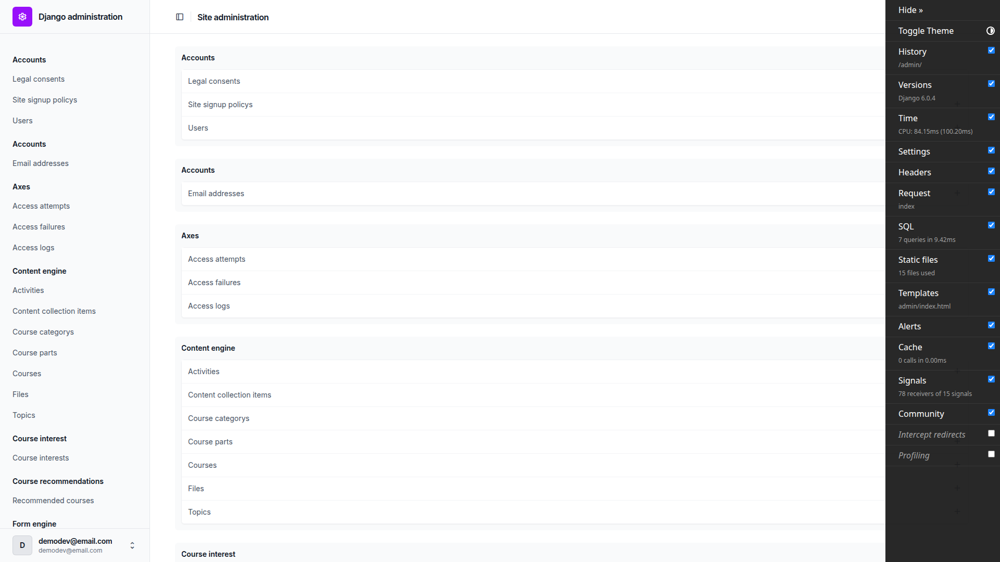
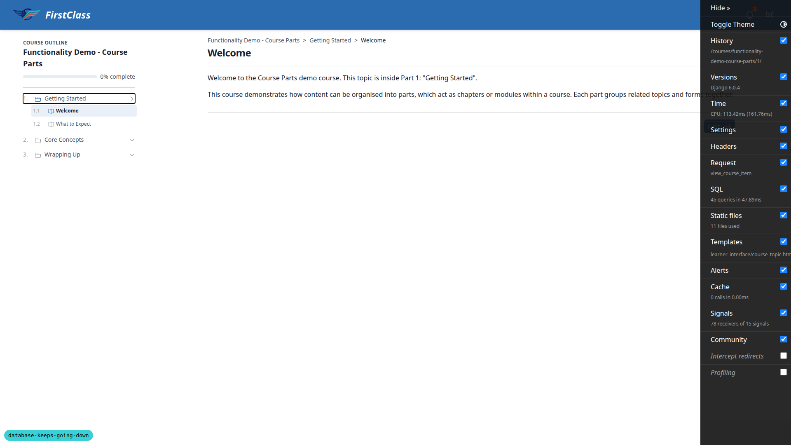
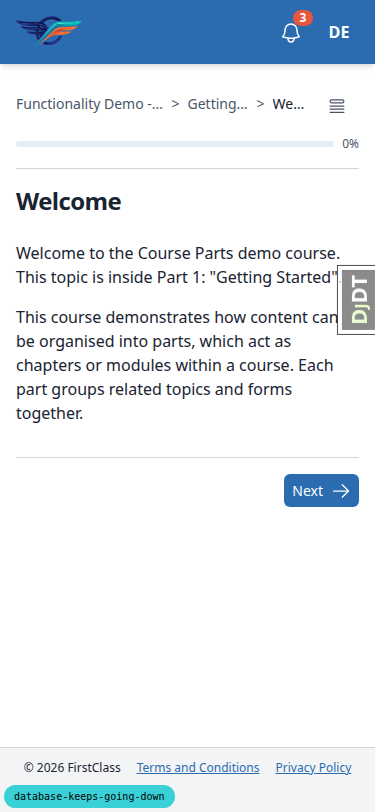
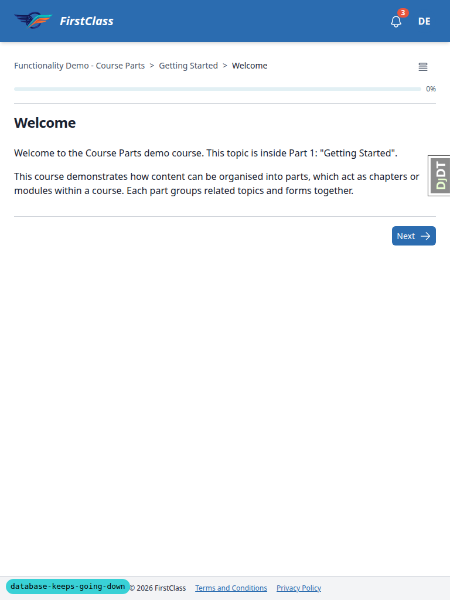

# QA report: the dev database stays up

## 1. Methodology

Terminal scenarios (1, 2, 4-12) were run by hand from `3. frontend_qa.md`, executing each command
against the shared `dev_db` Postgres compose stack and this worktree.

Scenario 3 (runserver traffic as `fls_dev`) was run through the browser via Playwright MCP at three
viewports: desktop 1920x1080, mobile 375x812, tablet 768x1024. Screenshots taken during the browser
scenario were collected into `screenshots/` beside this report; every image referenced below was
confirmed present in that directory with Glob before linking.

## 2. Diff scoping

Scoping class: **FULL**.

Trigger: `claude_plugins/django-stack/templates/wrapper_scripts/reap_playwright_mcp.sh` matched rule 1
via its path containing `templates/`.

Other changed files considered: `dev_db/*`, `config/settings_dev.py`, `conftest.py`,
`claude_plugins/fls-dev/scripts/*`, `tests/*`, `pyproject.toml`, `uv.lock`, and spec/docs skills
markdown.

Skipped: nothing was skipped outright. The FULL class fired only because a shell wrapper lives under
a `templates/` directory — no page template, CSS or JS actually changed. Mobile and tablet coverage
was therefore run as smoke-sized passes over the Scenario 3 pages only, which doubled as the
pre-step rebase front-end check.

## 3. Smoke gate

Outcome: **pass**.

Pages checked:
- `http://127.0.0.1:8506/` (Dashboard, logged in as demodev)
- `http://127.0.0.1:8506/admin/`

## 4. Results by scenario

### Scenario 1: switch to the new server

| Test | Viewport | Status | Note |
|---|---|---|---|
| 1.1-1.2 | terminal | pass | Old dev_db project already stopped by the human before the run; only the new postgres/mailpit containers present. |
| 1.3-1.7 | terminal | pass | postgres + mailpit healthy; single named volume `fls_dev_db_pgdata`, no bind mount; stop timeout/restart policy/memory/shm match spec (`30 unless-stopped 3221225472 268435456`); no `docker-entrypoint-initdb.d`. |

### Scenario 2: server settings and the role

| Test | Viewport | Status | Note |
|---|---|---|---|
| 2.1 | terminal | pass | `max_connections` 120, `shared_buffers` 768MB, `fsync` off, `superuser_reserved_connections` 3. |
| 2.2 | terminal | pass | `install_dev.sh` exit 0, `dev_db_init.sh` ran once, no migrations to apply. |
| 2.3 | terminal | pass | `create_demo_data` blocks on a confirm prompt without `--yes`; ran with `--yes` (plan corrected). |
| 2.4 | terminal | pass | `fls_dev` role flags and idle-in-transaction timeout correct; `pguser` rolconfig empty; `db_`/`test_db_` owned by `fls_dev`; worktree stamp matches git common dir and worktree root. |
| 2.5 | terminal | pass | Second `dev_db_init.sh` run is idempotent (`ALTER DATABASE`, exit 0). |

### Scenario 3: runserver traffic runs as `fls_dev` (browser)

| Test | Viewport | Status | Note |
|---|---|---|---|
| 3.1-3.2 | desktop | pass | Login, dashboard and `/admin/` render with nav/main, no traceback; only console error is a pre-existing, unrelated favicon 404. |
| 3.2-course | desktop | pass | After loading demo content, course topic page renders outline, breadcrumbs and content with no console errors. |
| 3.2-mobile | mobile | pass | At 375px: no horizontal overflow, header/nav and main present, no traceback, no console errors. |
| 3.2-tablet | tablet | pass | At 768px: no overflow, nav/main present, no traceback. |
| 3.3 | terminal | pass | `pg_stat_activity` rows for `db_database_keeps_going_down` show `fls_dev` / `runserver:-:db_database_keeps_going_down`; the only other rows were this run's own Scenario 7 psql sessions, which the plan's "every row" wording doesn't account for. |
| 3.4 | terminal | pass | `manage.py shell` connection appears as `fls_dev` / `shell:-:db_database_keeps_going_down`. |

Screenshots:
-  — 3.1-3.2, desktop
-  — 3.2-course, desktop
-  — 3.2-mobile
-  — 3.2-tablet

### Scenario 4: a parallel test run

| Test | Viewport | Status | Note |
|---|---|---|---|
| 4.1-4.3 | terminal | pass | `-n auto` uses only `fls_dev`, via `pytest:gw0..gw3`; worker count confirmed from the gw names and a non-`-q` run ("created: 4/4 workers"). |
| 4.4 | terminal | fail | Suite passed (5469 passed), but the plan's "gw0 to gw3 remain" is wrong — pytest-django drops them without `--reuse-db` (plan corrected). `gw0` was left behind because its teardown `DROP DATABASE` failed (bug B2). |
| 4.5 | terminal | fail | All `CREATE DATABASE` statements correctly name `TEMPLATE "template0"` with no clashes, but the log shows one "being accessed by other users" error from `gw0`'s teardown `DROP` (bug B2), also seen in the earlier serial `pytest -x` run. |
| 4.6 | terminal | pass | `log_statement` reset; `fls_dev` rolconfig restored to the idle-in-transaction timeout. |
| 4.7 | terminal | pass | `--collect-only` never starts workers so it can't show a count (plan corrected to use real runs); `-n 6` gives "created: 6/6 workers", `-n auto` gives "created: 4/4 workers". |
| 4.8 | terminal | pass | `dev_db_delete.sh` drops `db_`, `test_db_` and every `_gwN` database; worktree restored via `install_dev.sh` + `create_demo_data --yes` + `content_save`. |

### Scenario 5: the container restarts itself, and survives other worktrees

| Test | Viewport | Status | Note |
|---|---|---|---|
| 5.1-5.3 | terminal | pass | `pg_ctl stop -m immediate`; container back healthy within ~6s, same container ID, RestartCount incremented by one. |
| 5.4 | terminal | pass | Compose up from a detached same-HEAD worktree: "Running", not "Recreate"; ID and StartedAt unchanged. |
| 5.5 | terminal | pass | Old-main compose fails on port 1025 already allocated when run from a worktree under the project; from a `/tmp` scratch worktree it instead fails on Docker Desktop's file-sharing "mounts denied" before reaching the port clash. New postgres container unaffected either way. |

### Scenario 6: logs survive the container

| Test | Viewport | Status | Note |
|---|---|---|---|
| 6.1-6.2 | terminal | fail | `postgresql-<Day>.log` present, but the log prefix runs straight into the level with no separator (bug B1). |
| 6.3-6.4 | terminal | pass | Noted disconnection line still present after down/up; both worktree DBs survived. |

### Scenario 7: the idle-in-transaction timeout

| Test | Viewport | Status | Note |
|---|---|---|---|
| 7.1-7.3 | terminal | pass | After 16 minutes, the `fls_dev` session is terminated for the idle-in-transaction timeout; the `pguser` session still works and rolls back cleanly. |

### Scenario 8: `diagnose`

| Test | Viewport | Status | Note |
|---|---|---|---|
| 8.1 | terminal | pass | Fails on the leftover `dev_db` project with the correct next step and exit 1; also surfaces the run-together log prefix (bug B1) in its quoted findings. |
| 8.2 | terminal | pass | Clean run after `docker compose -p dev_db down`: exit 0, all checks reported in order (engine, engine kind, container, postgres logs, connections, idle-in-transaction, volume/shm use, stale DBs, orphaned Playwright MCP, orphaned pytest). |
| 8.3 | terminal | pass | Injected Docker Desktop file-service failure signatures ("injecting event blocked" and "Service fs failed") are detected and quoted, exit 1. |
| 8.4 | terminal | pass | Unreachable engine with no Desktop logs and empty HOME gives a plain "engine is not reachable" failure, exit 1, no traceback. |

### Scenario 9: `stale_dbs`

| Test | Viewport | Status | Note |
|---|---|---|---|
| 9.1-9.2 | terminal | pass | New worktree's `dev_db_init.sh` creates and stamps `db_qa_stale_check`; not listed as stale. Running the script by path from a different worktree instead re-stamps that worktree's own DB — it keys off the CWD's branch. |
| 9.3-9.4 | terminal | pass | After worktree removal, `db_qa_stale_check` and `test_db_qa_stale_check` are listed with sizes; `db_fcweb_qa`, this worktree's DBs and `db` correctly excluded; unstamped count includes `db_fcweb_qa`. |
| 9.5 | terminal | pass | With this worktree on detached HEAD, its `db_…` is not listed as stale. |
| 9.6-9.7 | terminal | pass | `--drop` prints both drops; rerun lists none. |

### Scenario 10: an existing worktree recovers on rebase

| Test | Viewport | Status | Note |
|---|---|---|---|
| 10.1-10.4 | terminal | pass | `rebuild_after_rebase.sh` and `migrate` succeed in a fresh worktree without `install_dev.sh`; `pytest tests -q` needs `--no-cov` since the project-wide coverage gate fails on any subset run (plan corrected). |

### Scenario 11: Playwright MCP

| Test | Viewport | Status | Note |
|---|---|---|---|
| 11.1 | terminal | pass | `.mcp.json` pins `@playwright/mcp@0.0.83` and adds `--idle-timeout 600000`; other args unchanged. |
| 11.2 | terminal | pass | All three reaper script copies exist and are executable; template has `PLUGINS_ROOT=__PLUGINS_ROOT__`, `.claude` copy has `PLUGINS_ROOT=.`. |
| 11.3 | terminal | pass | Orphan process's parent is `systemd --user`. |
| 11.4 | terminal | pass | Reaper correctly does not list an orphan under an hour old. |
| 11.5 | terminal | pass | Reaper lists the aged orphan's `sh`/`sleep`/`npm exec`/`node` process tree with pid, age, rss, command; no Chromium child was present so the browser-listing branch was not exercised. |
| 11.6 | terminal | pass | Seven other, older Playwright MCP servers on the machine are correctly not listed — each has a live `claude` process as parent. |
| 11.7 | terminal | pass | `--kill` ends all orphaned processes; rerun reports "No orphaned Playwright MCP processes"; this session's own MCP server untouched. |
| 11.8 | terminal | pass | `use-playwright` `SKILL.md` documents that server processes can outlive the session, pointing at the reaper. |

### Scenario 12: reset and helper scripts

| Test | Viewport | Status | Note |
|---|---|---|---|
| 12.1 | terminal | pass | `bin_sh.sh` opens a `psql` prompt as `pguser` on `postgres`. |
| 12.2 | terminal | pass | `cleanup_devdb.sh` answered "no": "Aborted", exit 1, container ID unchanged. |
| 12.3 | terminal | pass | With the human's go-ahead, "yes" performs `down -v` then `up -d`, creates a new empty volume, and prints the rerun-setup message; worktree restored afterward. |

## 5. Per-bug sections

### B1: Postgres log_line_prefix runs straight into the log level

Manifestations:
- 6.1-6.2, terminal
- 8.1, terminal

Screenshots: none.

Expected: each log line reads `<time> [pid] user@db app=<app> client=<host> LEVEL:  message`, with a
separator between the prefix and the level (as `tests/test_diagnose.py`'s sample lines assume, e.g.
`client=172.18.0.1 FATAL:`).

Actual: `log_line_prefix` in `dev_db/docker-compose.yaml` is
`%m [%p] %q%u@%d app=%a client=%h` with no trailing space, so real lines read
`client=[local]LOG:` and `client=172.20.0.1ERROR:`. `diagnose` quotes these run-together lines
verbatim in its findings.

### B2: Test database teardown DROP fails with "being accessed by other users"

Manifestations:
- 4.4, terminal
- 4.5, terminal

Screenshots: none.

Expected: at session end each pytest process drops its test database cleanly; no "being accessed by
other users" errors in the Postgres log and no `test_db_<branch>[_gwN]` left behind.

Actual: one other session is still connected when pytest-django issues `DROP DATABASE`, so it fails
after Postgres's 5s wait. Seen for `test_db_database_keeps_going_down_gw0` in the `-n auto` run
(left behind), and for `test_db_database_keeps_going_down` at the end of the serial `pytest -x` run.
Reproduced directly with
`uv run pytest freedom_ls/base freedom_ls/educator_interface --no-cov -q` (not by
`freedom_ls/comms/tests/playwright` alone). pytest exits 0 and prints nothing; `diagnose` then warns
"being accessed by other users xN".

## Bug status

- **FIXED** (commit: 8f3ba76b) — Postgres log_line_prefix runs straight into the log level. Re-verified: after `docker compose up -d` recreated postgres, `SHOW log_line_prefix` ends in a space and lines read `client=[local] LOG:`.
- **UNRESOLVED** — Test database teardown DROP fails with "being accessed by other users" (reason: fix 036ef9eb failed re-verification and was reverted; a second leak remains, see below)

### B2 fix attempt

The fixer found two sources of the lingering connection:

1. **`django_browser_reload`** stays active under tests (`config/settings_dev.py` only excludes `debug_toolbar` when `TESTING`). Its middleware injects a script that makes a Playwright browser open `/__reload__/events/`, an endless `StreamingHttpResponse`. That request never finishes, so `close_old_connections()` never runs for it and its connection (last query: the `axes` `ContentType` lookup from `AxesMiddleware`) outlives the session-end `DROP DATABASE`. Commit 036ef9eb moved the app and middleware under `if not TESTING:` and added `freedom_ls/base/tests/test_dev_tooling_disabled_in_tests.py`. The full suite passed.
2. **Playwright sync API and asgiref.** Playwright calls the private `asyncio._set_running_loop()` on each sync call and never resets it. Django's `ConnectionHandler` (built on `asgiref.local.Local`) then treats the main thread as async and stores `default` in a contextvar slot that `close_old_connections()` / `close_all()` never inspect. The fixer confirmed this with `gc.get_referrers()` and a trace into pytest-django's `live_server` / `TransactionTestCase` machinery, but found no fix it could prove, so it shipped none.

Re-verification: after 036ef9eb, `uv run pytest freedom_ls/base freedom_ls/educator_interface --no-cov -q` still logged one `being accessed by other users` error in each of two runs and left `test_db_database_keeps_going_down` behind. So 036ef9eb was reverted, per the QA procedure. Source 1 is still a real, cheap improvement to reapply when source 2 is tackled.

## 6. General notes

- Pre-step rebase: 17 commits replayed onto `origin/main` at `3e296e97`, no conflicts, lost-change
  check passed, rebuild created the `fls_dev` role and this worktree's DBs on the fresh server,
  `pytest -x` full suite 5469 passed, pre-commit clean, pushed with lease.
  `claude_plugins/sdd/scripts/upstream_change_scan.sh` exited 141 (SIGPIPE): line 230's
  `printf | head -n $TRUNCATE_AT` under `set -o pipefail` kills the script on the first diff longer
  than `TRUNCATE_AT`, so the Diffs section is cut off and the exit-2 signal is lost. Treated as
  exit 2 and ran the review. Unrelated to this spec's code.
- Teardown DROP reproduction detail: `uv run pytest freedom_ls/base freedom_ls/educator_interface --no-cov -q`
  (502 passed) logged "database test_db_database_keeps_going_down is being accessed by other users"
  at 15:37:48 UTC; `uv run pytest freedom_ls/comms/tests/playwright` (19 passed) did not reproduce
  it. pytest itself exits 0 and prints nothing — the only trace is the server log (which `diagnose`
  flags as a warning) and a leftover test database.
- Test plan corrections made this run (`3. frontend_qa.md`): `create_demo_data` now passes `--yes`
  (it blocks on a confirm prompt); Scenario 10.3 pytest adds `--no-cov` (the project-wide coverage
  gate fails any subset run); Scenario 4.2 drops `-q` so xdist's "created: 4/4 workers" header
  shows; 4.4 now expects no `_gwN` left (pytest-django drops them without `--reuse-db`); 4.7 uses a
  real `-n 6 --reuse-db` run over `freedom_ls/accounts` instead of `--collect-only`, which never
  starts workers.
- Docker Desktop on Linux: a `SCRATCH` worktree under `/tmp` is not in Desktop's file-sharing list,
  so the old-main compose (which bind-mounts `docker-entrypoint-initdb.d`) fails on "mounts denied"
  before it reaches the port clash Scenario 5.5 wants. A worktree under the project reached the
  port clash instead. The plan's `SCRATCH=$(mktemp -d)` works as written only on Docker Engine.
- Scenario 1 steps 1-2 (the switch) were done by the human before the run; the old dev_db project's
  containers were created/exited but not running. Scenario 3.3's "every row" expectation also
  needs to allow for this run's own Scenario 7 psql sessions (`application_name` psql), which are
  expected to appear alongside the runserver row.
- Fresh server had no course content: `qa-data-helper` ran `content_save demo_content DemoDev` and
  registered `demodev` on three courses. The isolated Playwright browser showed the Django debug
  toolbar panel open by default on first load (hidden for later shots).
  `qa_collect_screenshots.sh` also moved the MCP server's snapshot `.yml` and console `.log` files
  into `screenshots/` alongside the PNGs. A pre-existing local branch `qa-boy-scout-throwaway-2`
  (not from this run) was left alone. The session scratch directory holding `SCRATCH` files was not
  removed (recursive delete is not allowed from this command); it lives in the session's temp
  scratchpad.

---

status: ok
reason: 2 bugs — 1 fixed (8f3ba76b), 1 unresolved (B2, fix 036ef9eb reverted after failed re-verify); report rendered, screenshots verified
