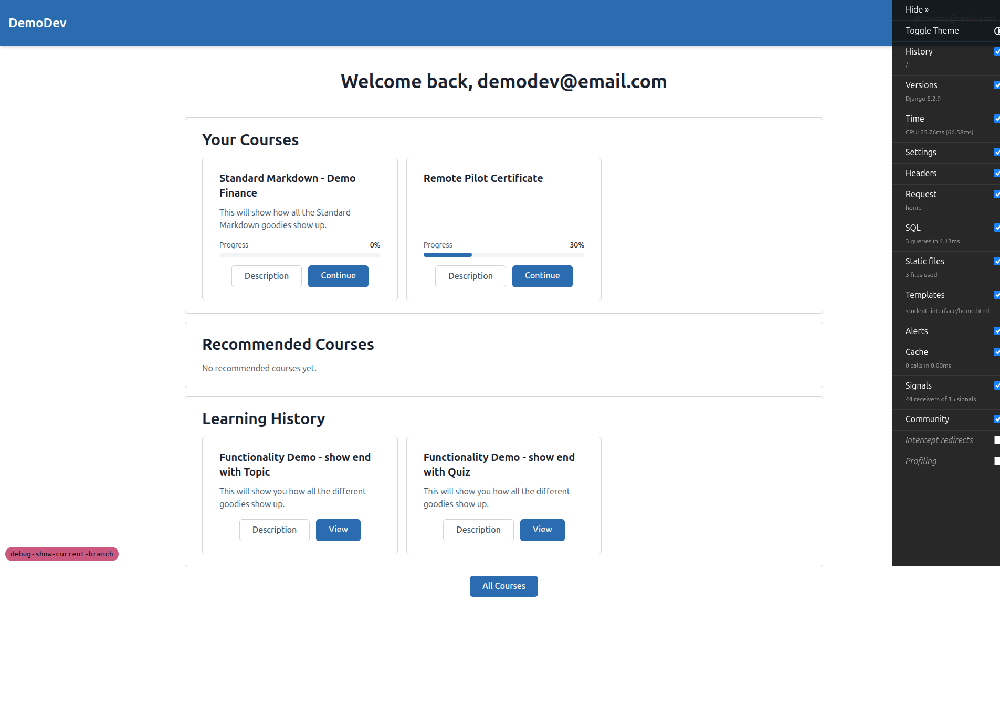
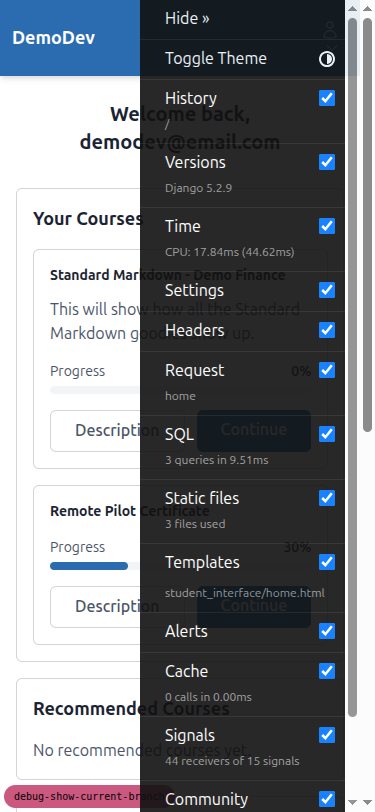
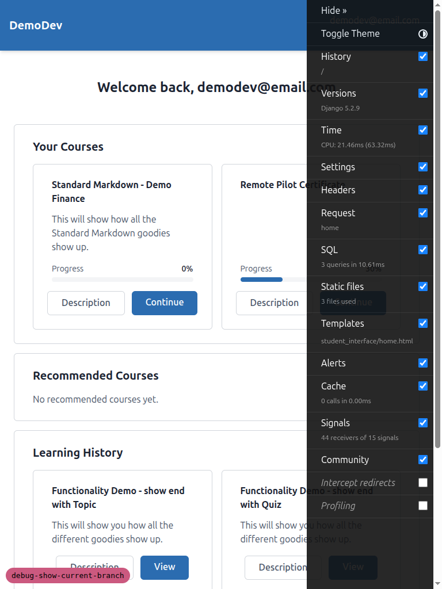

# QA Report: Debug Branch Indicator Panel

**Date:** 2026-03-10
**Branch:** `debug-show-current-branch`
**Tester:** Automated QA via Playwright MCP

---

## Test Results

### Test 1: Badge Visibility on Page Load - PASS

**Expected:** A small colored pill/badge in the bottom-left corner with monospace font, colored background, and readable text in expanded state.

**Actual:** Badge renders correctly with all expected styles:
- `position: fixed`, `bottom: 10px`, `left: 10px`
- `z-index: 50`
- `background-color: rgb(203, 89, 127)` (pink)
- `color: rgb(0, 0, 0)` (black text, good contrast)
- `font-family: ui-monospace, monospace`
- `font-size: 13px`
- `border-radius: 9999px` (pill shape)
- `cursor: pointer`

---

### Test 2: Badge Appears on All Pages - PASS

**Expected:** Badge on every page in the same position.

**Actual:** Badge is present and consistent on all tested pages:
- Home page (`/`): Present
- Courses page (`/courses/`): Present
- Educator dashboard (`/educator/`): Present
- Login page (`/accounts/login/`): Redirects to home when logged in, badge present

**Note:** The test plan references `/student/courses/` which is a 404. The correct URL is `/courses/`.

---

### Test 3: Click to Collapse - PASS

**Expected:** Badge collapses to a small colored dot with smooth animation.

**Actual:** Badge collapses correctly:
- Width and height: `16px`
- `border-radius: 50%` (circle)
- `position: fixed` (stays in corner)
- Background color preserved (`rgb(203, 89, 127)`)
- Text hidden
- `localStorage` updated to `"false"`

---

### Test 4: Click to Expand - PASS

**Expected:** Badge expands back to show the full branch name with smooth transition.

**Actual:** Clicking the collapsed dot expands the badge back to pill shape with text visible, `localStorage` updated to `"true"`.

---

### Test 5: State Persistence Across Page Loads - PASS

**Expected:** Collapsed/expanded state persists across navigation and page reloads.

**Actual:** Collapsed state persisted when navigating from home to `/courses/`. Expanded state also persisted across navigation. `localStorage` key `debug-branch-expanded` correctly stores and reads the state.

---

### Test 6: First Visit Default State - PASS

**Expected:** Badge appears expanded when no localStorage key exists.

**Actual:** After clearing `localStorage.removeItem('debug-branch-expanded')` and reloading, the badge defaults to expanded state showing the full branch name.

---

### Test 7: Badge Does Not Interfere with Page Content - PASS

**Expected:** Badge floats above page content with fixed position and sufficient z-index.

**Actual:** Badge is `position: fixed` with `z-index: 50`, floats above content without pushing or shifting any page elements.

---

### Test 8: Responsive Behavior (Small Screens) - PASS

**Expected:** Badge is smaller or more compact on small screens.

**Actual:**
- **Mobile (375x812):** Media query applied correctly — `font-size: 10px`, `bottom: 4px`, `left: 4px`, `position: fixed`. Badge is compact and doesn't obstruct content.
- **Tablet (768x1024):** Badge uses standard desktop sizing (`font-size: 13px`, `bottom: 10px`, `left: 10px`) as expected (768px is above the 479px breakpoint).

---

### Test 9: Correct Branch Name Displayed - PASS

**Expected:** Badge text matches the actual git branch name.

**Actual:** Badge displays `debug-show-current-branch`, which matches `git branch --show-current` output.

---

### Test 10: Color Determinism - PASS

**Expected:** Same branch always gets the same color; text is readable against background.

**Actual:** Badge color is consistently `rgb(203, 89, 127)` across multiple pages (home and courses). Text color is `rgb(0, 0, 0)` (black), providing good contrast against the pink background.

---

## Summary

| Test | Result |
|---|---|
| 1. Badge Visibility | PASS |
| 2. Badge on All Pages | PASS |
| 3. Click to Collapse | PASS |
| 4. Click to Expand | PASS |
| 5. State Persistence | PASS |
| 6. First Visit Default | PASS |
| 7. No Content Interference | PASS |
| 8. Responsive Behavior | PASS |
| 9. Correct Branch Name | PASS |
| 10. Color Determinism | PASS |

**Overall: 10 PASS, 0 FAIL**

---

## Tangential Observations

- The Django Debug Toolbar significantly overlaps page content on mobile (375px) and tablet (768px) viewports, making the right side of the page unusable. This is unrelated to the branch indicator feature but is worth noting for general mobile QA.
- The test plan references `/student/courses/` which returns 404. The correct URL is `/courses/`.
