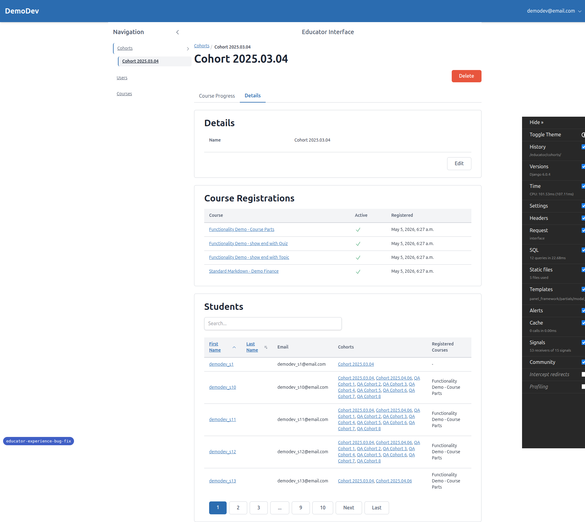
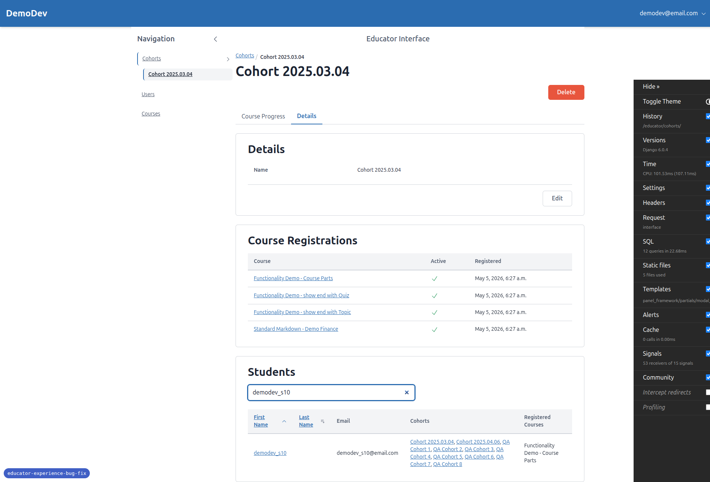
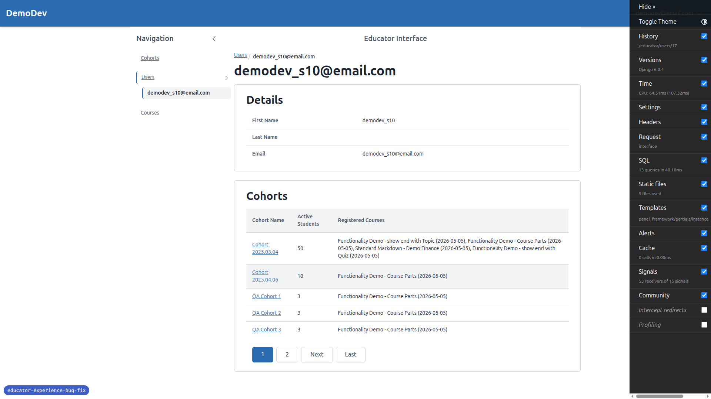
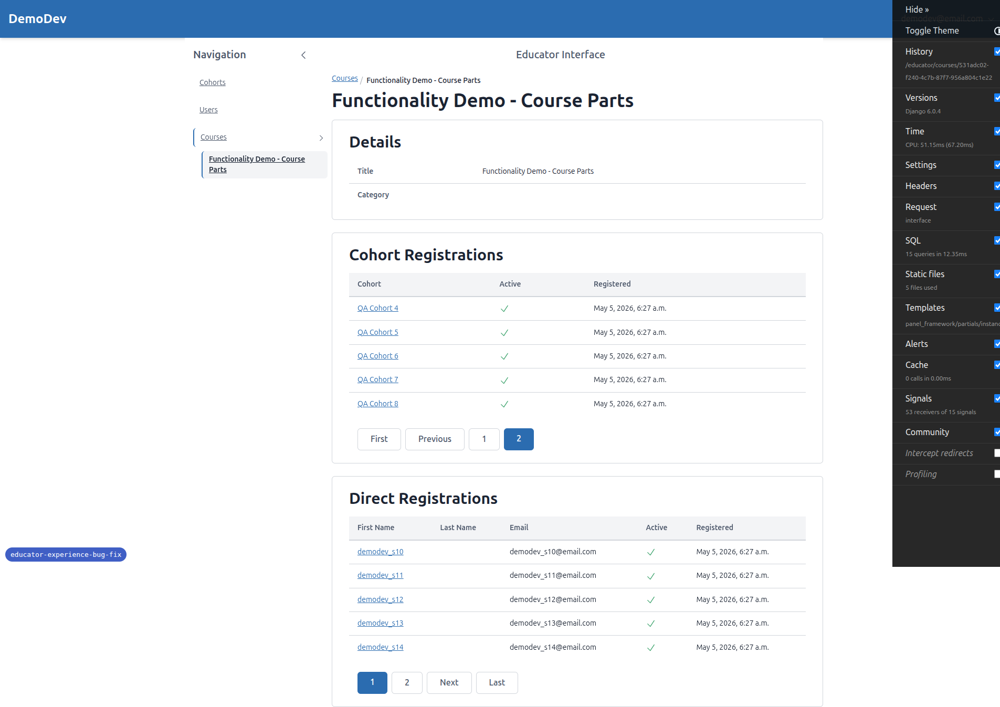
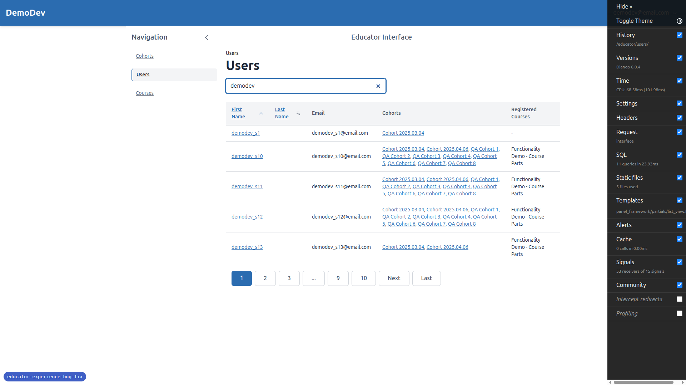
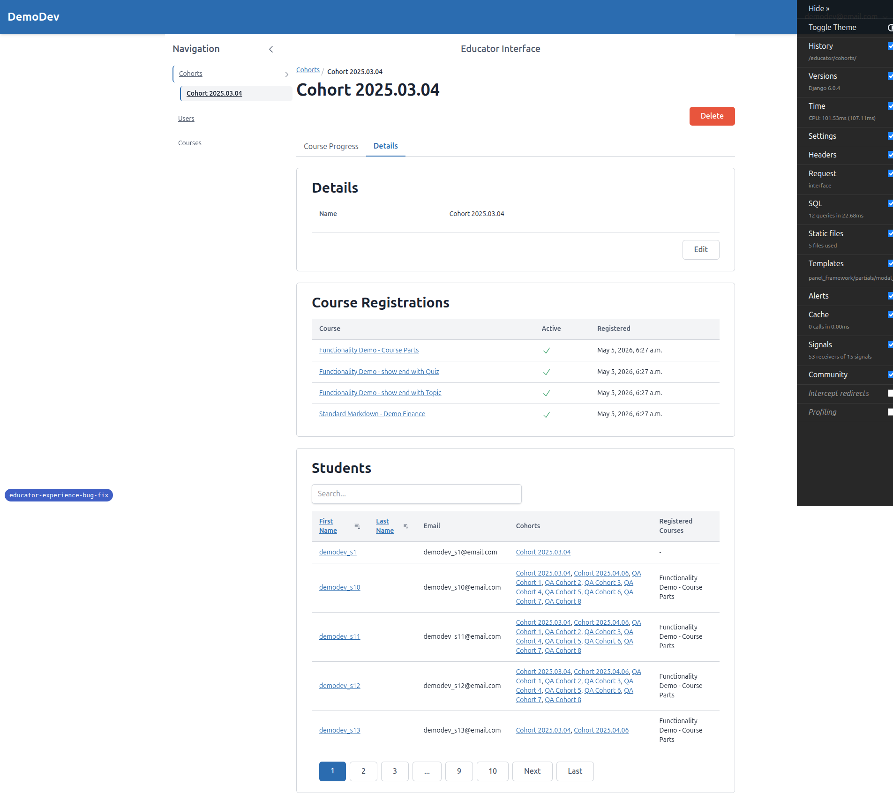
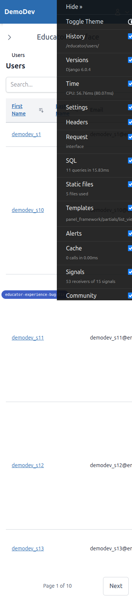
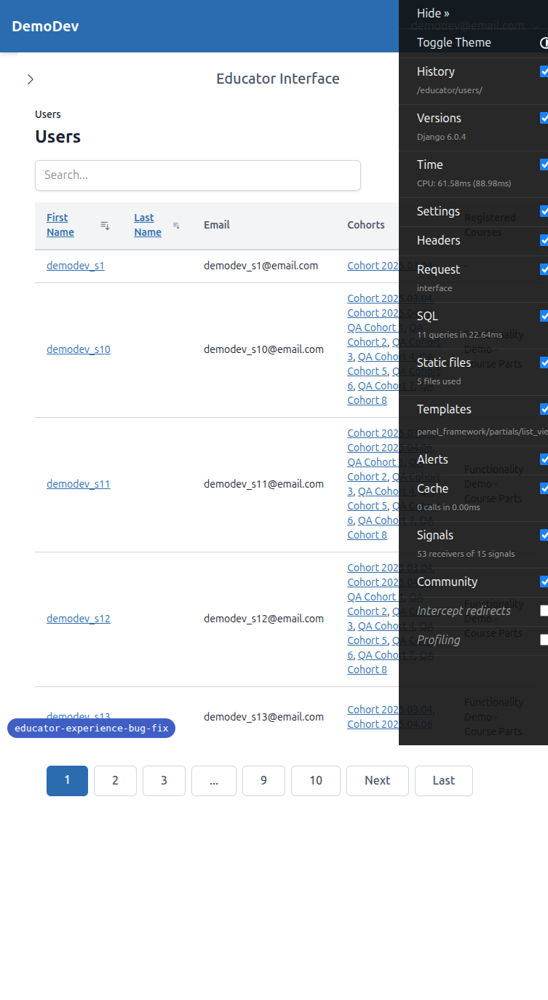
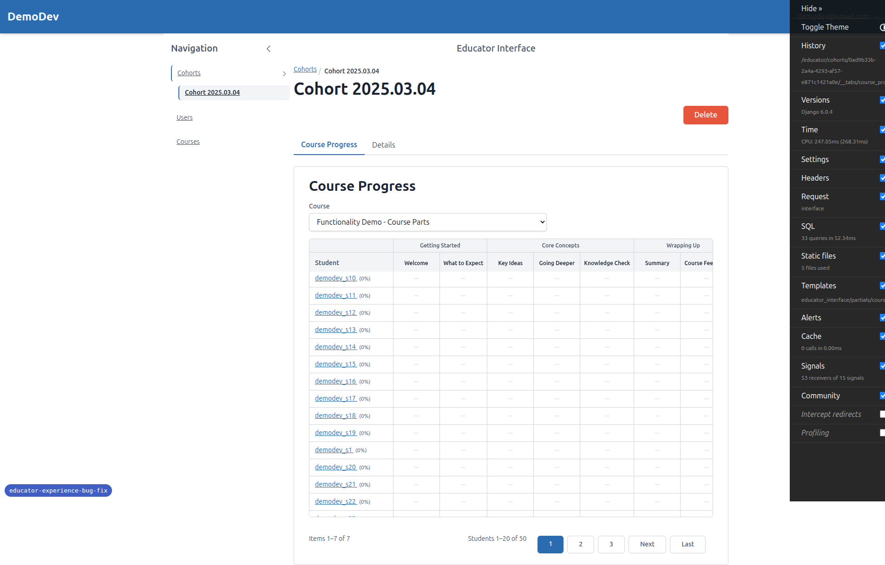
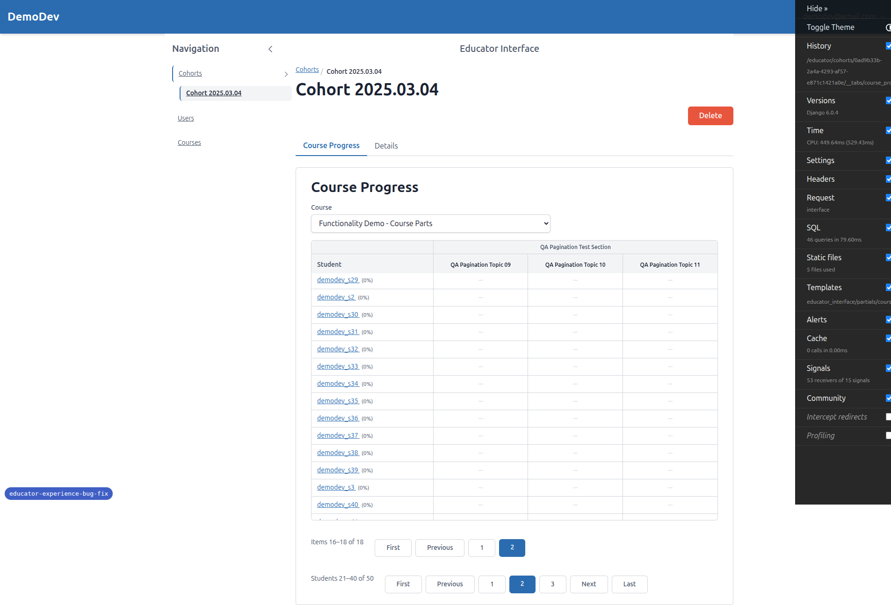

# Frontend QA Report — Educator Experience Bug Fix

**Branch:** `educator-experience-bug-fix`
**Date executed:** 2026-05-05
**Site:** DemoDev
**Educator account:** `demodev@email.com`

## Summary

All twelve tests in the plan passed. No bugs found. Two tests had test-data caveats that the `qa-data-helper` agent unblocked mid-run, and two tests were partially N/A because the affected panels do not expose the controls the test described (sortable columns / search box) — see the per-test notes below. No JavaScript console errors were observed during any interaction (only a benign `favicon.ico` 404).

## Per-test results

### Test 1 — Cohort details: students table sort recursion — PASS

Sorted the Students panel column three times in a row (asc → desc → asc). After every click, the page contained exactly one `<h2>Students</h2>`, one search input, and the same student-table-shaped DOM. No nested panel chrome, no duplicate search box, no nested table.

### Test 2 — Cohort details: students table search — PASS

Typed `demodev_s10` → result narrowed to a single row. Cleared the search → all rows returned. Typed `demodev_s2` → results updated. Throughout, only one Students panel header and one search input existed; no nested chrome.

### Test 3 — Cohort details: course registrations panel — PASS (with caveat)

The Course Registrations panel for `Cohort 2025.03.04` renders a table with columns `Course / Active / Registered` and four rows. **None of the columns are rendered as sortable headers and there is no search input on this panel,** so the literal "click a sortable column / type into the search box" steps in the plan are not applicable on this panel. There were no nested panel chrome or duplicate elements at any point. The recursion regression-check is fully covered by Tests 1, 2 (Students panel) and 5 (course panels).

### Test 4 — User instance page: cohorts panel — PASS (with caveat)

Visited `/educator/users/17/` (demodev_s10, member of 10 cohorts). The `UserCohortsPanel` table renders correctly with full chrome (heading, table) and a numbered paginator (`1 2 Next Last`). **Like the Course Registrations panel, this panel does not expose sortable columns or a search box** — the literal step "Sort by any column. Use the search box." is not applicable here. I exercised the panel's HTMX swap by clicking the numbered "2" pagination button instead. After the swap: one `<h2>Cohorts</h2>`, no nested chrome, table updated cleanly.

### Test 5 — Course instance page: both registration panels — PASS (with caveat)

Visited `/educator/courses/<uuid>/` for `Functionality Demo - Course Parts`. Both `Cohort Registrations` and `Direct Registrations` panels render with full chrome plus numbered pagination. **Neither panel exposes sortable columns or a search box.** Exercised the HTMX swap on each panel by clicking the numbered "2" pagination button. After both swaps: one `<h2>Cohort Registrations</h2>`, one `<h2>Direct Registrations</h2>`, no nested chrome, only the appropriate panel's table updated.

### Test 6 — List views regression — PASS (with caveat)

- `/educator/users/`: sort, search, and pagination all work via HTMX swaps. Numbered button pagination (`1 2 3 … 9 10 Next Last`).
- `/educator/cohorts/`: pagination works (`1 2 Next Last`); only 6 cohorts so paginator just has two pages and no sortable columns / search are present on the cohort list either.
- `/educator/courses/`: only 4 courses on the DemoDev site, so the courses list shows no pagination and no sort/search controls. Nothing to exercise — no regression observed.

### Test 7 — Initial load: full panel chrome — PASS

Hard-refreshed `/educator/cohorts/<uuid>/__tabs/details`. Every panel rendered its full chrome on first load (Details, Course Registrations, Students with search bar + table + pagination).

### Test 8 — Numbered pagination on all data tables — PASS

- Desktop (1920px): consistent `First Previous 1 2 3 … Next Last` numbered buttons on `/educator/users/`, `/educator/cohorts/`, `/educator/courses/` (where applicable), and on the Students panel under `/educator/cohorts/<uuid>/__tabs/details`.
- Mobile (375px): same pagination component degrades to `Previous / Page X of Y / Next`.

HTMX page-2 click on `/educator/users/` returned only the table swap and updated the active page indicator to `2`.

### Test 9 — Pagination preserves sort + search — PASS

On `/educator/users/`, applied `sort=first_name`, `order=asc`, and search `demodev`. The page-2 link's `href` and `hx-get` both included **all four params** (`?page=2&sort=first_name&order=asc&search=demodev`). After clicking page 2: search box still contains "demodev", active page indicator is `2`, table content matches the filtered & sorted slice for that page.

### Test 10 — Course progress: numbered student paginator — PASS

`/educator/cohorts/<uuid>/__tabs/course_progress` for `Cohort 2025.03.04`. Student paginator renders the numbered-button style (`1 2 3 Next Last`) consistent with the data tables on `/educator/users/`. The "Students 1–20 of 50" range indicator is present alongside the buttons. The column paginator likewise uses the numbered-button style (acceptable per the plan).

### Test 11 — Course progress: independent paginators — PASS

**Test data note:** the standard demo content has only 7 items per course. To exercise the column paginator I delegated to the `qa-data-helper` agent, which added 11 extra items via a new idempotent management command (`qa_add_course_items_for_pagination`) so the course `Functionality Demo - Course Parts` now has 18 items. With 18 items and 50 students, the column paginator has 2 pages and the student paginator has 3 pages.

Forward direction:
1. Initial state: `Items 1–15 of 18` / `Students 1–20 of 50`.
2. Clicked Students "2" → `Items 1–15 of 18` / `Students 21–40 of 50` (Items unchanged).
3. Clicked Items "Next" → `Items 16–18 of 18` / `Students 21–40 of 50` (Students unchanged).

Reverse direction:
1. Reload (both paginators back to page 1).
2. Clicked Items "2" → `Items 16–18 of 18` / `Students 1–20 of 50` (Students unchanged).
3. Clicked Students "Next" → `Items 16–18 of 18` / `Students 21–40 of 50` (Items unchanged).

Each paginator's state was preserved across the other paginator's swap.

### Test 12 — Progressive enhancement / JS-disabled fallback — PASS (verified statically)

The page-2 link on `/educator/users/?sort=first_name&order=asc&search=demodev` carries:

- `href="?page=2&sort=first_name&order=asc&search=demodev"`
- `hx-get="/educator/users/?page=2&sort=first_name&order=asc&search=demodev"`

A browser with JS disabled would follow the `href`, which preserves all query params and triggers a normal full-page load. I did not literally disable JS in this run because the `href` is sufficient evidence of progressive enhancement — the same href is what HTMX intercepts when JS is enabled, and it includes every state parameter.

## Smoke checklist

- ☑ Resize between mobile and desktop on a paginated panel — pagination layout switches between mobile `Previous / Page X of Y / Next` and desktop numbered buttons (verified on `/educator/users/` and `/educator/cohorts/<uuid>/__tabs/course_progress`).
- ☑ Browser console shows no JavaScript errors during any interaction (only a `favicon.ico` 404, unrelated).
- ☑ HTMX page-change requests target the table only — `hx-target="#table-..."` and `hx-swap="outerHTML"` are wired on every numbered-pagination link inspected.

## Tangential observations (not blocking)

- **Django Debug Toolbar overlap on mobile/tablet screenshots.** The DJDT panel sits on top of the right side of the viewport in dev mode and obscures content in narrow-viewport screenshots. Dev-only artifact, not a real layout issue, but it does make the mobile screenshots harder to read at a glance.
- **UserCohortsPanel, Cohort Course Registrations panel, and the two Course panels do not expose sort/search controls.** This is consistent with the existing implementation but means Tests 3/4/5 partly cannot exercise their literal "click sortable column / type in search" steps. The recursion bug regression they're guarding against is fully covered by the Students panel's controls (Tests 1/2) which do swap via the same code path. If the team wants those panels to be sortable/searchable, that would be a separate enhancement spec.
- **`qa_add_course_items_for_pagination` management command** is now committed under `freedom_ls/qa_helpers/management/commands/`. It is idempotent and only operates on the DemoDev `Site`. Worth keeping for any future course-progress paginator regression test.
