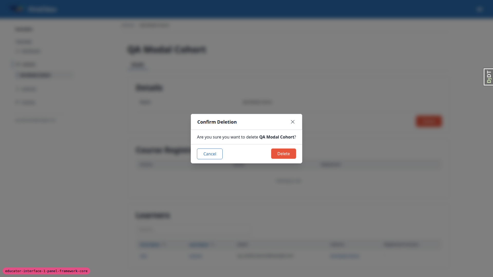
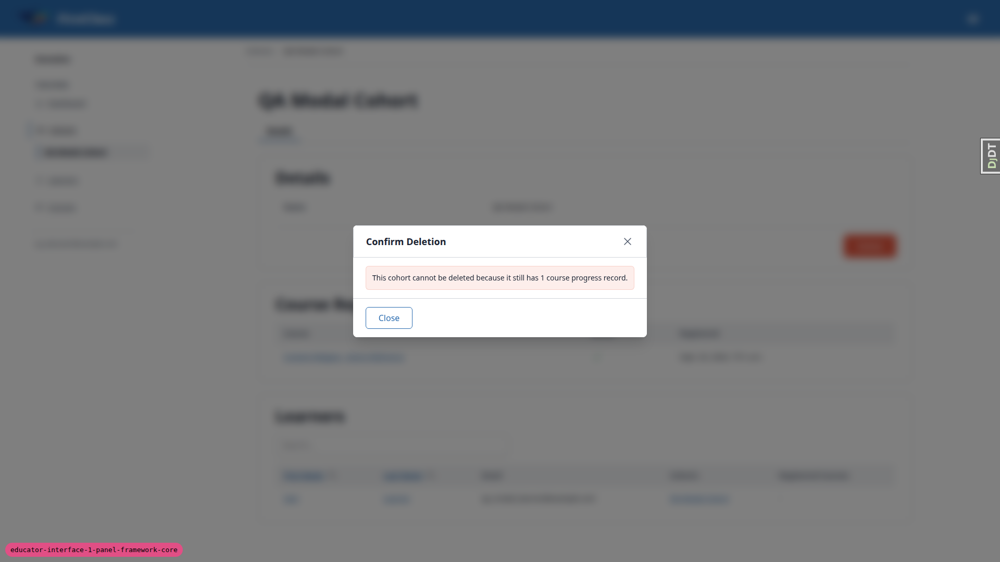

# Frontend QA report: educator-interface-1-panel-framework-core

## 1. Methodology

Testing was driven manually through the Playwright MCP tool against a dev server on port 8304, with the branch badge in the footer verified before starting. Three viewports were exercised: desktop (1920x1080), mobile (375x812) and tablet (768x1024). Screenshots were collected into `screenshots/` beside this report; every screenshot referenced below was confirmed to exist in that folder via a directory listing.

Seed notes:

- The dev DB was empty, so `create_demo_data --yes` and `content_save demo_content DemoDev` were run before the test plan's §0 seeds (`qa_create_organisation_scenarios`, `qa_create_educator_modal_target`).
- `qa_create_educator_modal_target` needs a `DemoDev` argument that the test plan omits.
- The first run of the modal-target seed happened before course content existed, so its target cohort ended up with a cohort membership only — no course registration and no progress record. A later re-seed (after content existed) added a registration and a progress record. This is why test 6.5 below shows two distinct observed branches (one with no cascade summary at all, one with a correct "cannot be deleted" block) rather than one.

## 2. Diff scoping

Scoping class: **FULL**.

Triggering files:
- `freedom_ls/panel_framework/templates/**`
- `freedom_ls/panel_framework/static/panel_framework/js/alpine-components.js`
- `freedom_ls/base/static/base/js/alpine-components.js`
- `freedom_ls/base/templates/_base.html`
- `freedom_ls/base/templates/_base_interface.html`
- `freedom_ls/educator_interface/templates/**`
- `freedom_ls/panel_framework/*.py`
- `freedom_ls/educator_interface/views.py`
- `freedom_ls/icons/*.py`

Nothing was skipped: desktop, mobile and tablet viewports were all run against the full plan.

## 3. Smoke gate

Outcome: **pass**.

Pages checked:
- `http://127.0.0.1:8304/`
- `http://127.0.0.1:8304/educator/organisations/rpas-training/dashboard`

## 4. Results table

| Test ID | Viewport | Status | Note |
| --- | --- | --- | --- |
| 1.1 | desktop | pass | `/educator/` redirected to `/educator/organisations/demodev/dashboard` (first org for admin) |
| 1.2 | desktop | pass | Title "Dashboard — RPAS Training — DemoDev"; heading "Dashboard" |
| 1.3 | desktop | pass | Single "Reporting" card with one sentence; no tiles/lists |
| 1.4 | desktop | pass | Switcher, TEACHING heading, Dashboard/Cohorts/Learners/Courses with 4 icons; Dashboard highlighted; no counts |
| 1.5 | desktop | pass | Footer shows email only (admin has blank first/last name); no role, no settings link |
| 2.1 | desktop | pass | One XHR, no reload; heading/breadcrumb/title/sidebar highlight all moved to Cohorts |
| 2.2 | desktop | pass | Vary: HX-Request, HX-Target, HX-History-Restore-Request, Cookie |
| 2.3 | desktop | pass | Back issued a fresh GET of the dashboard (not a cache restore); highlight on Dashboard |
| 2.4 | desktop | pass | Forward refetched Cohorts |
| 2.5 | desktop | pass | htmx-config meta present with historyCacheSize 0 / historyRestoreAsHxRequest false; one `#scope-announcer`, outside `#main-content` |
| 3.1 | desktop | pass | Year 10 Science (1, -) and Year 9 Maths (3, Functionality Demo - Course Parts); Create Cohort button above table |
| 3.2 | desktop | pass | h1, one "Details" tab underlined (aria-current=page), Details/Course Registrations/Learners cards; Edit+Delete at foot of Details |
| 3.3 | desktop | pass | No buttons above the tab strip; Delete inside Details card |
| 3.4 | desktop | pass | Sidebar shows Year 9 Maths nested under Cohorts, highlighted |
| 3.5 | desktop | pass | Breadcrumb "Cohorts / Year 9 Maths"; clicking Cohorts returned to list without reload |
| 3.6 | desktop | pass | Sort by First Name toggles asc/desc in place; URL unchanged; exactly one `section[data-panel=learners]`; only 3 learners so pagination not exercised |
| 3.7 | desktop | pass | Search "Tom" narrowed to one row in place; focus stayed in input; one heading, no nesting |
| 4.1 | desktop | pass | URL -> `.../__tabs/details`, one XHR, cards rendered once, tab aria-current=page, focus stays on tab; Tab moves to Edit button; Enter also triggers request |
| 4.2 | desktop | pass | Body has `hx-swap-oob="innerHTML:#scope-announcer"` with "Showing Details"; no sidebar-nav, no `<html>` |
| 4.3 | desktop | pass | Back returned to cohort URL with a fresh request; same three cards |
| 4.4 | desktop | pass | Direct load of `__tabs/details` renders full page with sidebar and breadcrumbs, tab current |
| 4.5 | desktop | pass | `__tabs/nope`, `__panels/details`, `__tabs/details/__panels/nope` all 404 |
| 4.6 | desktop | pass | HX-Request + HX-Target: something-else returned navigation bundle containing `id=sidebar-nav`, no `<html>` |
| 1.6 | desktop | pass | no.access@example.com: `/educator/` and `/educator/organisations/rpas-training/dashboard` both 404 |
| 5.1 | desktop | pass | Modal "Edit Year 9 Maths" with Name field |
| 5.2 | desktop | pass | 422; modal stays open with uniqueness error under the field; Name row and h1 unchanged |
| 5.3 | desktop | **fail** | Save worked without reload, but network shows one POST followed by THREE GETs (details/courses/learners), not the single GET the plan expects. See bug B1 |
| 5.4 | desktop | pass | After reload h1 and sidebar disclosure show new name. Without reload sidebar stays stale (plan only requires it after reload) |
| 5.5 | desktop | pass | Renamed back to Year 9 Maths |
| 6.1 | desktop | pass | Create "QA Empty Cohort" redirected to its detail page |
| 6.2 | desktop | pass | "Are you sure you want to delete QA Empty Cohort?" with no cascade list |
| 6.3 | desktop | pass | Redirected to cohorts list without QA Empty Cohort |
| 6.4 | desktop | pass | Save and add another: modal stays open with empty input, list updated in place, no nested section; second cohort landed on its own page; both deleted |
| 6.5 | desktop | **fail** | qa_educator: no Create Cohort, no Edit (pass). But first-seed delete modal showed no cascade summary despite 1 membership being deleted. See bug B2 |
| 6.6 | desktop | pass | DELETE on blocked cohort: 422 with blocked reason, no HX-Redirect, Vary present, cohort still 200; earlier DELETE on the deletable first-seed cohort removed it (then 404) |
| 7.1 | desktop | pass | Search "Priya" narrowed to 1 row without reload; clearing restored 5; Last Name sort ascending correct |
| 7.2 | desktop | pass | Details card rows sentence-case; Cohorts card lists only Year 9 Maths; h1 shows Learner `__str__` per requirement 11 |
| 7.3 | desktop | pass | Nell Unregistered: Cohorts table shows empty message, no error |
| 8.1 | desktop | pass | Columns as specified; 13 courses across 3 pages; paging in place, URL unchanged, no nested section. Cohorts column not org-scoped (known gap, see general notes) |
| 8.2 | desktop | pass | Title + Dashboard category "Reference"; gated course shows "-"; Cohort Registrations lists only RPAS Year 9 Maths; Direct Registrations present |
| 8.3 | desktop | pass | Switching to Northside on course page stayed on same course without reload; Cohort Registrations became empty; announcer fired; switched back |
| 9.1 | desktop | pass | org.educator landed on Northside dashboard; switcher lists Northside and RPAS Training only |
| 9.2 | desktop | pass | Switching on cohorts list: list changed, URL changed, no reload, announcer "Now viewing RPAS Training" |
| 9.3 | desktop | pass | Switching orgs from a Northside cohort landed on RPAS cohorts list with URL pushed; notice rendered as a bottom-right toast rather than inline (plan says inline — see general notes) |
| 9.4 | desktop | pass | legacy.educator: cohorts list only Year 9 Maths; Year 10 Science detail 404; Learners Cohorts column names only Year 9 Maths; Northside dashboard 404 |
| 11.1 | desktop | pass | Course player for Course Parts renders with outline sidebar on desktop |
| 11.3 | desktop | pass | Only whitespace before `</main>`; htmx-config meta present |
| 12.1 | desktop | pass | `manage.py help` grep for the four removed commands prints nothing |
| 12.2 | desktop | pass | Only a Details tab; no Course Progress; `__tabs/course_progress` 404 |
| 12.3 | desktop | pass | No console errors or Alpine Expression Errors after tab click and sidebar links |
| 10.1 | mobile | pass | Sidebar closed at 375px; toggle (44x48) opens bottom sheet with switcher, TEACHING group, user footer. Minor: nav links 36px tall, nav column 256px wide inside a 375px sheet (see general notes) |
| 10.2 | mobile | **fail** | Tapping Cohorts in the sheet reaches the list but not over htmx: XHR fires, then a full document load follows (JS marker lost). See bug B3 |
| 10.3 | mobile | pass | Tab strip and three cards stack in one column; Details row renders label above value; no page horizontal scroll |
| 10.4 | mobile | pass | With sheet open, Back closed the sheet and stayed on the page; a second Back navigated to the previous page |
| 11.2 | mobile | pass | Course player "Open course outline" opens the outline as a dialog sheet; Escape closes it |
| 10.1 | tablet | pass | 768px is below the lg breakpoint so tablet gets the mobile nav; toggle opens a full-width bottom sheet; Courses table fits the card, pagination readable, no overflow |
| 10.2 | tablet | **fail** | Same as mobile: tapping Learners in the sheet fires the htmx XHR then a full document load. See bug B3 |
| 5.1 | tablet | pass | Edit modal centred at a sensible width; no overflow |

## 5. Bugs

### B1: Saving an edit refetches every panel on the page, not just the edited one

Manifestations: 5.3 (desktop).

Expected (test plan 5.3): one POST then one GET, the GET's `HX-Target` equal to the Details card's id.

Actual: One POST then three GETs (details, courses, learners), each targeting its own region. Every leaf panel carries `hx-trigger="panelChanged from:body"` as spec requirement 9 prescribes, so a single `panelChanged` event refreshes every leaf panel on the page. The test plan and the spec disagree on the expected network shape; functionally the edit works and nothing duplicates or corrupts on screen.

No screenshot recorded for this bug (network-panel observation only).

### B2: Delete confirmation omits cascade-deleted rows that Django fast-deletes (e.g. cohort memberships)

Manifestations: 6.5 (desktop).

Expected: Deleting a cohort with 1 membership shows a "This will also delete" summary listing 1 cohort membership.

Actual: Plain "Are you sure you want to delete QA Modal Cohort?" with no summary, even though the delete removes 1 `CohortMembership` row. Cause: `DeleteAction.get_cascade_summary` (`freedom_ls/panel_framework/actions.py`) iterates only `Collector.data` and ignores `Collector.fast_deletes`, where signal-free cascades such as `CohortMembership` land. Identical code exists on `main`, so this is not a regression introduced by this branch.

After a re-seed added a registration and a progress record to the same target cohort, the "blocked" branch of the same dialog rendered correctly:

"This cohort cannot be deleted because it still has 1 course progress record." with a Close button only — this branch of the flow is correct; only the cascade-summary branch for fast-deleted rows is affected.

### B3: Links in the mobile/tablet navigation sheet trigger a full page reload after the htmx request

Manifestations: 10.2 (mobile), 10.2 (tablet).

Expected: Tapping a sheet link closes the sheet and loads the section over htmx, with no full reload.

Actual: The htmx XHR fires, then a full document load follows (the JS marker used to detect reloads was lost both times). Cause: the sidePanel dialog click handler in `freedom_ls/base/static/base/js/alpine-components.js` (around lines 450-473) calls `event.preventDefault(); window.location.replace(link.href)` for every plain link click inside the mobile sheet, including `hx-get` links. This code is unchanged from `main` apart from a comment, so the bug predates this branch. The desktop sidebar nav uses htmx only and is unaffected.

No screenshot recorded for this bug (network-panel observation only).

## Bug status

- B1: **FIXED** (commit: 6224ead5): saving an edit refetches every leaf panel. This is the intended behaviour (spec requirement 9), so test plan 5.3 now expects one GET per leaf panel.
- B2: **FIXED** (commit: c9473282): the delete confirmation now lists cascade rows Django fast-deletes.
- B3: **FIXED** (commit: 20eb7777): links in the mobile/tablet navigation sheet no longer trigger a full page reload.

## 7. General notes

- Instance-page document titles omit the instance name (e.g. no "RPAS Training — DemoDev" suffix on the tab title observed during this run comes from the org/site, not the instance). `_main_for` passes an empty heading for instance views, and `main` did the same before this branch, so this is not a regression.
- The learner detail h1 shows the Learner `__str__` ("email - Organisation"), which matches spec requirement 11 (`{{ instance }}`).
- The Courses list Cohorts column is not organisation-scoped (a DemoDev-org cohort appeared under both RPAS Training and Northside courses). This is a known, declared gap on `CourseConfig` (`@claude` comment / `check_access_exempt_reason`), deferred to `critical_security_fixes`.
- The sidebar cohort name stays stale after an edit until reload; the plan only requires the new name to appear after reload, so this is expected behaviour, not a bug.
- The 9.3 notice ("Switched to RPAS Training — that cohort isn't in this organisation") renders as a bottom-right toast rather than an inline notice in the content area, though the plan's wording says inline.
- On mobile, sheet nav links are 36px tall, under the 44px touch target guideline; the nav column itself is 256px wide inside a 375px sheet.
- Admin `demodev@email.com` has no first/last name set, so the footer shows the email only rather than a full name plus email.
- 3.6 pagination was not exercised on the cohort Learners card because the seeded cohort only has 3 learners (plan says to page only if there is more than one page). Paging behaviour was verified instead on the Courses list (test 8.1, 13 courses across 3 pages).

status: ok
reason: 3 bugs — 3 fixed (after the run), 0 unresolved; report rendered, screenshots verified
