# Frontend QA report: educator-interface-2-panel-framework-tables

## 1. Methodology

Manual pass driven through the Playwright MCP browser tool against a local dev server, following
`3. frontend_qa.md`. Three responsive contexts were used:

- Desktop — 1920x1080
- Mobile — 390x844 (the plan's viewport; the `/frontend_qa` command's default is 375x812)
- Tablet — 768x1024 (added to cover the breakpoint between cards and the table)

A separate browser context with JavaScript disabled was used for plan section 5 ("JavaScript off")
and the mobile no-JS sub-section, so the JS-on and JS-off runs did not interfere with each other's
history/state.

Before the run, the dev database was found empty (a Docker restart had reset it). It was rebuilt
with `create_demo_data`, `content_save`, and the `qa_*` seed commands (`qa_create_large_cohort` for
the "QA Tables Cohort", plus the org/cohort-pagination and many-courses seed commands needed by
plan section 0 and section 7) before any test steps ran.

Screenshots were collected into `screenshots/` beside this report. Every image referenced below
exists in that directory; a console log
(`screenshots/console-2026-09-28T05-20-50-655Z.log`) was also captured. Two extra screenshots
(`page-mobile-cohorts-cards.png` for test 6.9, `page-learner-dashboard-paged.png` for test 7.3) and
one dashboard screenshot from the smoke gate (`page-2026-09-28T05-19-41-831Z.png`) were captured
but are not tied to a bug; they are noted where relevant below.

## 2. Diff scoping

Scoping class: **FULL**.

The changed set (~75 paths) groups into:

- `freedom_ls/panel_framework/` — the core of this change: table config (`tables.py`, `panels.py`,
  `filters.py`, `bulk_actions.py`, `checks.py`, `context.py`), the data-table/card/toolbar/sheet
  cotton templates, `table_response.html` / `navigation_response.html`, the Alpine JS component,
  and the matching unit and Playwright tests.
- `freedom_ls/base/` — `csv_safety.py` and its test, the `pagination` and `data-table` cotton
  components and their tests, the shared Alpine JS component.
- `freedom_ls/content_engine/templates/cotton/table.html` — a table template consuming the shared
  component.
- `freedom_ls/educator_interface/` — `views.py`, `interface.html`, cohort/link/progress-check
  data-table-cell templates, and the Playwright/unit tests covering learners, pagination, visibility
  and system checks.
- `freedom_ls/site_aware_models/admin_exports.py` and its test — the CSV export code the change
  moved.
- Docs/skills (`docs/app_structure.md`, the `alpine-js` skill) and this feature's own spec_dd
  documents (spec, plan, this QA plan, todo).

Desktop, mobile and tablet viewports all ran, per the plan and the QA command's added tablet check.

## 3. Smoke gate

**Pass.** Pages checked: `/`, `/educator/` (redirects to
`/educator/organisations/demodev/dashboard`), and
`/educator/organisations/demodev/cohorts/<QA Tables Cohort pk>`.

## 4. Results table

| Test ID | Viewport | Status | Note |
|---|---|---|---|
| 1.1-1.3 | desktop | pass | Page 2 swaps only `#learners-table`; course registrations table untouched; URL has no `__panels`. |
| 1.4 | desktop | pass | Reload keeps learners on page 2, course registrations on page 1. |
| 1.5 | desktop | pass | Explicit page params render correctly; `course_registrations-page=2` stays on the single page, no error. |
| 1.6 | desktop | pass | `learners-page=999` → last page; `learners-page=abc` → page 1; both 200. |
| 2.1-2.4 | desktop | pass | First Name / Last Name sort toggling works, including descending and the "Sorted by" status text. |
| 2.5-2.6 | desktop | pass | Back/Forward keep URL, first row, icon and page indicator in sync. |
| 2.7 | desktop | pass | Copied URL opens identical sorted state in a new tab; stable sort across pages. |
| 3.2 | desktop | **fail** | Search narrows the table, but focus moves off the input after the swap, dropping later keystrokes — see bug B4. |
| 3.3 | desktop | pass | `a & b + c #` encodes correctly; empty state; `#scope-announcer` reads "No results". |
| 3.4 | desktop | pass | Native clear (Escape) restores the full table. |
| 3.5 | desktop | **fail** | With a sort active, typing in the search box sends no request at all — see bug B2. |
| 3.6 | desktop | pass | Enter submits via htmx, no full reload, sort preserved. |
| 4.1-4.3 | desktop | pass | Announcer text correct after sort and paging; focus lands on the table's anchor, Tab reaches the search input. |
| 5.1-5.4 | desktop | pass | JS off: paging, sorting and search+Enter all full-load correctly with state preserved. |
| 6-nojs.1-6-nojs.2 | mobile | **fail** | No-JS "Filter & sort" form is present but invisible — see bug B3. |
| 6.1-6.3 | mobile | pass | Cards replace the table, no horizontal scroll, toolbar shows search row + "Sort", no "Filter" button. |
| 6.4 | mobile | pass | "Sort" opens the "Filter & sort" bottom sheet with the expected controls. |
| 6.5-6.6 | mobile | pass | Sort + "Show results" reorders cards and updates the URL; "Reset" clears it. |
| 6.7 | mobile | **fail** | With the sheet open, Back leaves the page entirely instead of closing the sheet — see bug B1. |
| 6.7b | mobile | **fail** | The header nav button opens the table's sheet instead of the educator navigation — see bug B1. |
| 6.8 | mobile | pass | Paging works; shows "Page 2 of 5" (dataset has ~110 learners, not 30 — data difference, not a bug). |
| 6.9 | mobile | pass | Cohorts renders as cards with name/title, learner count and courses in the meta line. |
| 6.10 | mobile | pass | Widening past 768px restores the table without a reload. |
| 7.5-mobile | mobile | pass | Course detail: both registration regions render as cards at 390px, no horizontal scroll. |
| 7.1 | desktop | pass | Old bookmark params (`page`, `sort`) are ignored; table loads on page 1, default order, 200. |
| 7.2 | desktop | skip | QA Tables Cohort has only a "Details" tab; nothing to click between. |
| 7.3 | desktop | pass | Learner dashboard section paging (`c-pagination`) works via htmx swap. |
| 7.4 | desktop | pass | Admin CSV export: UTF-8 BOM, CRLF, formula-prefixed cells escaped with a leading apostrophe. |
| 7.5 | desktop | **fail** | Paging one course-detail table drops the sibling table's state from the URL — see bug B5. |
| 7.6 | desktop | pass | Switching organisation while sorted drops stale `learners-*` params cleanly. |
| 7.7 | desktop | pass | "Save and add another" refreshes the cohorts list in place (see general notes for the page-reset caveat related to B5). |
| T.1 | tablet | **fail** | Header nav button opens the (invisible, md:hidden) table sheet and leaves the page inert — see bug B1. |
| T.2 | tablet | pass | Learners renders as a table at 768px, Sort button hidden, headers wrap but stay readable, no horizontal scroll. |
| T.3 | tablet | pass | Cohort details tables render with no horizontal overflow at 768px. |

**Totals:** 26 pass, 7 fail, 1 skip.

### Screenshots (passing/non-bug tests)

- 1.1-1.3 — 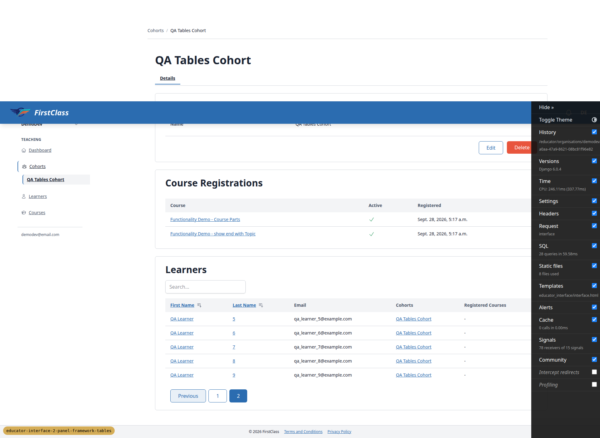
- 2.1-2.4 — 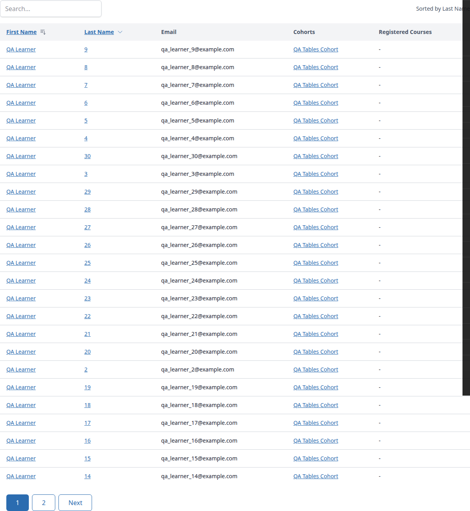
- 5.1-5.4 — 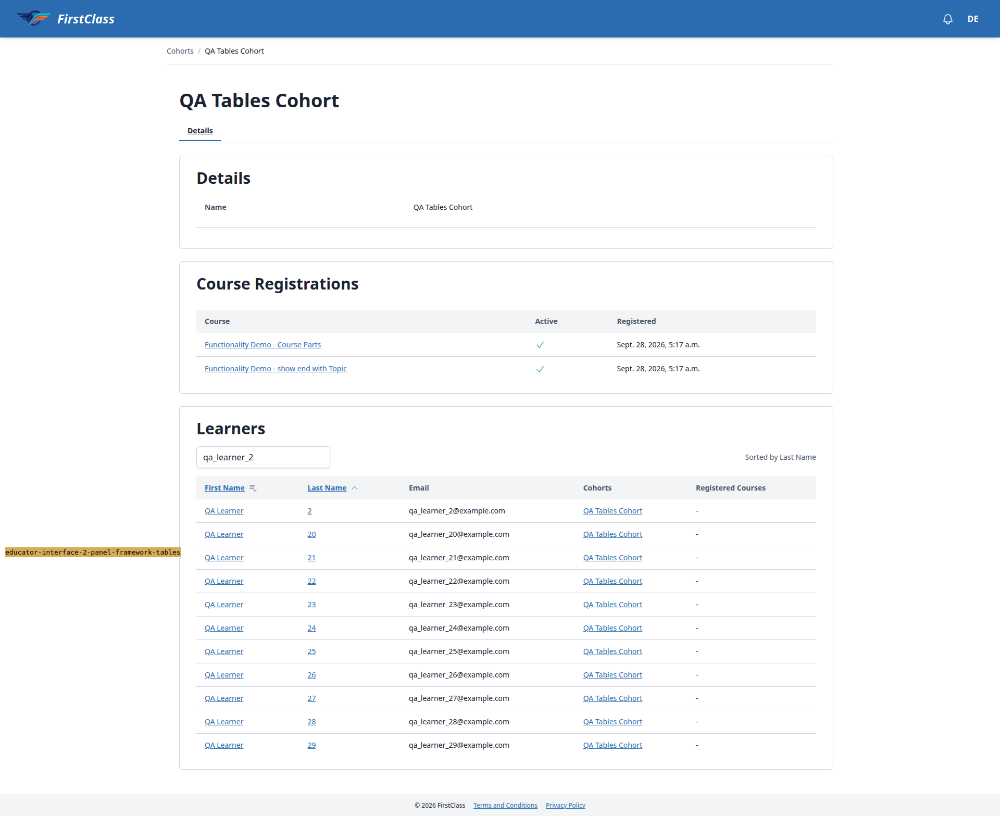
- 6.1-6.3 — 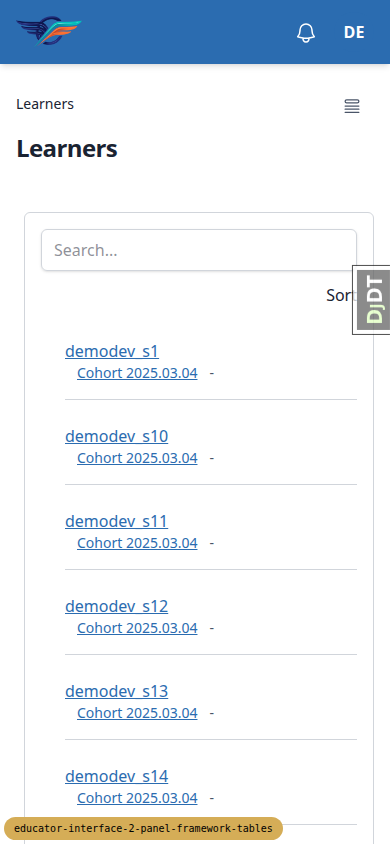
- 6.4 — 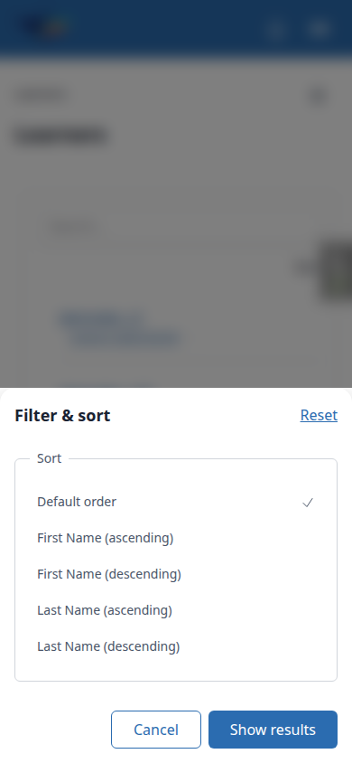
- 6.9 — 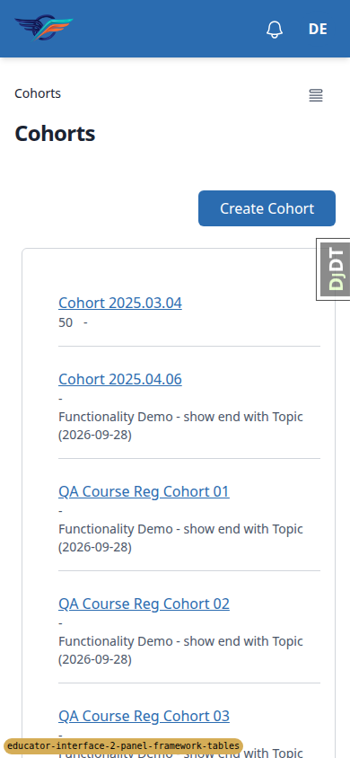
- 7.3 — 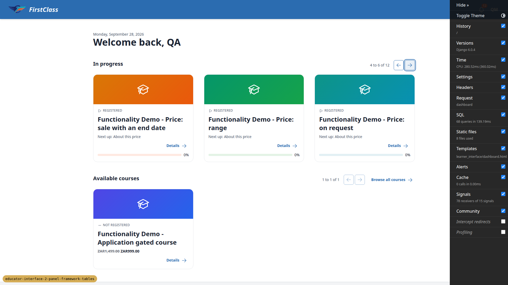
- T.2 — 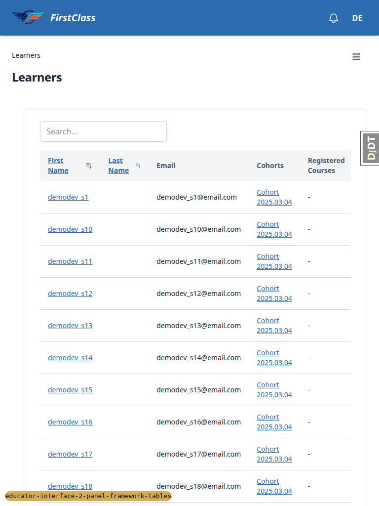
- T.3 — 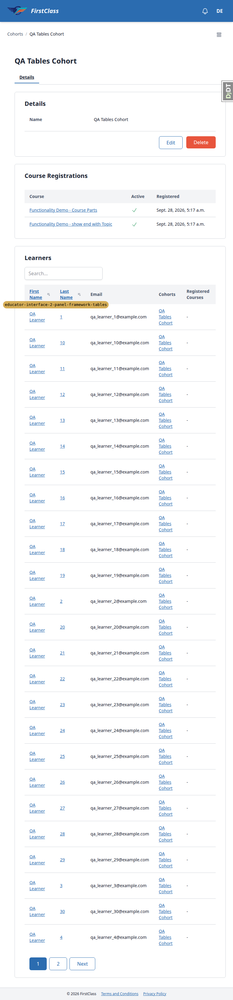
- Smoke gate dashboard — 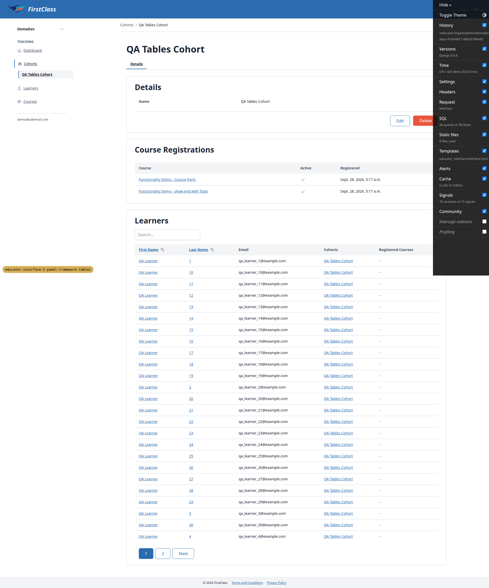

(Failing-test screenshots are embedded in the per-bug sections below.)

## 5. Per-bug sections

### B1 — Mobile/tablet navigation button opens the table's Filter & sort sheet (sidebar sidePanel bound to the wrong dialog)

**Manifestations:**
- 6.7 (mobile)
- 6.7b (mobile)
- T.1 (tablet)

**Screenshots:**

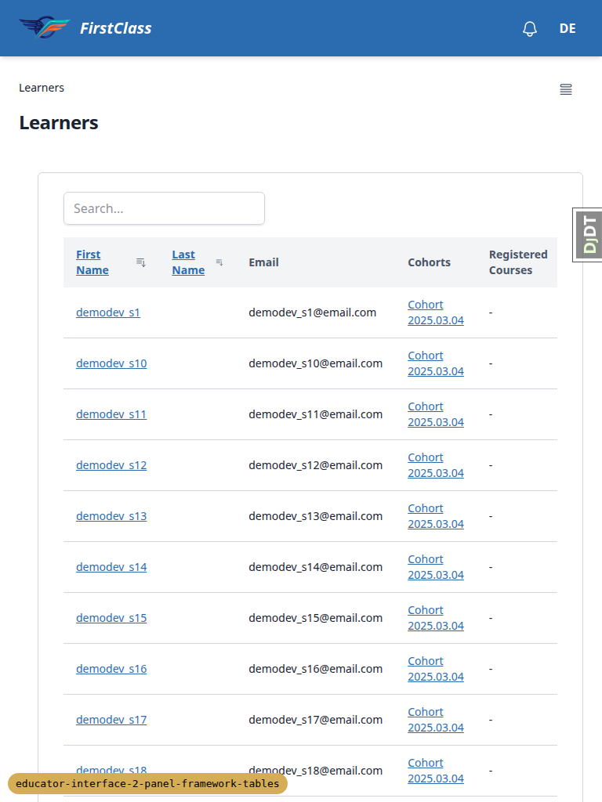

**Expected:** On any educator page with a table, "Open navigation panel" opens the educator
navigation; with the Filter & sort sheet open, Back closes the sheet and stays on the page.

**Actual:** The educator sidebar's `sidePanel` instance resolves `this.$refs.panelDialog` to the
nested table sheet's `<dialog x-ref="panelDialog">` (`Alpine.$data(sidebar root).dialog ===
#learners-sheet`). At 390px the nav button opens the Filter & sort sheet; at 768px it opens the
`md:hidden` sheet as an invisible modal, leaving the page inert until Escape. Its popstate handler
also closes the sheet without setting the sheet instance's `_closingFromPopstate`, so the sheet's
own close listener calls `history.back()` a second time and Back leaves the page entirely
(dashboard → Learners → open sheet → Back lands on dashboard). On desktop the sidebar's `show()`
also opens the hidden sheet non-modally.

### B2 — Live search stops working whenever a sort is active

**Manifestations:**
- 3.5 (desktop)

**Screenshots:** none captured.

**Expected:** With `learners-sort` set, typing in the search box narrows the table after the
debounce and keeps the sort.

**Actual:** No request is sent on typing (no `htmx:trigger` fires). With a sort active, the search
form renders `<input type=hidden name=learners-sort>` before the search input, and
`table_toolbar.html`'s `hx-trigger` (`input changed delay:300ms from:find input, search from:find
input`) binds to the first `input` in the form — the hidden one. Reproduces after an htmx sort and
on a full load of `?learners-sort=...`. Enter still submits.

### B3 — No-JS mobile Filter & sort form is invisible

**Manifestations:**
- 6-nojs.1-6-nojs.2 (mobile)

**Screenshots:**

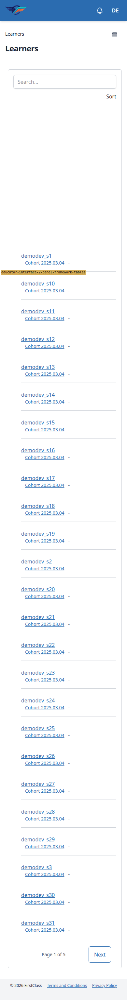

**Expected:** With JavaScript off below `md`, the Filter & sort form renders inline below the
toolbar, visible and submittable.

**Actual:** The form occupies ~300px as a blank gap. The `<noscript>` override in
`panel_framework/partials/table_sheet.html` sets `display:block` and `position:static` on the
dialog but leaves the bottom-sheet's closed-state `opacity:0` and `translateY(100%)` from
`.side-panel-dialog[data-variant=bottom-sheet]` in place. Submitting the hidden form blindly still
works (full load with the sort applied), but nothing is visible to a real user.

### B4 — Live search moves focus off the search box, dropping keystrokes typed after the debounce

**Manifestations:**
- 3.2 (desktop)

**Screenshots:** none captured.

**Expected:** A user typing in the search box can pause and keep typing; their characters land in
the box.

**Actual:** The `htmx:afterSettle` listener in
`panel_framework/static/panel_framework/js/alpine-components.js` focuses the table's `tabindex=-1`
anchor after every table region swap, including search-triggered ones. Typed "demo", paused, typed
"dev_s2": the box kept "demo" and focus was on the anchor div. The spec's "Announcement and focus"
behaviour explicitly asks for focus on the anchor after every table swap, and the code comment
names search as a covered case — so this is the documented behaviour actively harming a common
interaction, not an omission.

### B5 — Interacting with one table drops a sibling table's state from the URL

**Manifestations:**
- 7.5 (desktop)

**Screenshots:** none captured.

**Expected:** On a page with two tables, paging table A keeps table B's current page/sort in the
address bar and across reload (spec test `test_links_keep_other_tables_state`).

**Actual:** Course detail page: paged Cohort Registrations to 2, then paged Direct Registrations to
2 → URL becomes `?learner_registrations-page=2` only; reload shows Cohort Registrations back on
page 1. Table A's links (and the `HX-Push-Url` built from A's request) were rendered before table B
changed, so they carry B's stale state. Neither table has sortable columns, so this only surfaced
through paging. The Create Cohort "Save and add another" refresh (7.7) has a related symptom:
refreshing from a fixed URL resets the cohorts list from `?cohorts-page=2` to page 1.

## Bug status

- **FIXED** (commit: d3e2c587) — B1: Mobile/tablet navigation button opens the table's Filter & sort sheet. `sidePanel` now declares `dialog`/`grid` on each instance, so the nested sheet's `init()` no longer overwrites the sidebar's reference through Alpine's merged scope. Re-verified: the nav opens Navigation at 390px and 768px, Back with the sheet open closes it and stays on the page, and the learner course outline and desktop sidebar still work.
- **FIXED** (commit: fe66b7bb) — B2: Live search stops working whenever a sort is active. The trigger now listens on `#<key>-q` instead of `find input`. Re-verified after an htmx sort, on a full load with `learners-sort`, with no sort, and on the cohort details tab.
- **FIXED** (commit: 66aea7f6) — B3: No-JS mobile Filter & sort form is invisible. The `<noscript>` override now also sets `opacity: 1; transform: none`. Re-verified with JS off at 390px (visible and submittable) and with JS on (the sheet is unchanged).
- **FIXED** (commit: 4b2b14cd) — B4: Live search moves focus off the search box, dropping keystrokes. Spec decision: a search swap keeps focus in the search input. The afterSettle listener skips search-triggered swaps. The input is `hx-preserve`d and refocused with its caret in `htmx:afterSwap`, because Chromium drops the caret of a moved input. The real focus thief was the table's filter & sort `sidePanel` opening its hidden sheet on desktop on every region init. It is now `data-mobile-only`, so it never docks on desktop and never touches the sidebar's grid. Covered by `test_search_swap_keeps_focus_and_typing_in_search_box` and `test_filter_sort_sheet_stays_closed_on_desktop`.
- **FIXED** (commit: e2a663c5) — B5: Interacting with one table drops a sibling table's state from the URL. Spec decision: on an htmx table-region request whose `HX-Current-URL` path equals the panel's `page_url`, parameters outside the table's own namespace come from that URL and the table's own parameters come from the request. The rendered links and `HX-Push-Url`/`HX-Replace-Url` then carry the siblings' live state. Covered by unit tests in `test_data_table_panel.py` and `test_paging_one_table_keeps_sibling_page_in_url` (Playwright). The 7.7 list-refresh page reset was fixed separately in 025ba453.

## 6. General notes

- The test plan's URLs use `/educator/ORG/...`; the app now serves
  `/educator/organisations/ORG/...` (`/educator/` itself redirects correctly). The plan should be
  updated to match.
- Plan step 6.8 expects "Page 2 of 2"; this dataset has ~110 learners so it showed "Page 2 of 5" —
  a data difference, not a bug.
- 7.2 was skipped: the QA cohort has only a "Details" tab, so there is nothing to click between.
- The Cohorts list table has no sortable columns or search, so 7.7's "stays on the current sort"
  could not be exercised; the Create Cohort refresh reset the list to page 1 (related to B5).
  **Fixed** in 025ba453: `listRefresh` now re-requests the region with the address bar's query, and
  a table response whose URL equals `HX-Current-URL` replaces the history entry instead of pushing
  a duplicate. Covered by `test_save_and_add_another_keeps_current_page`.
- Neither course-detail table (Cohort Registrations, Direct Registrations) has sortable columns, so
  7.5 only covered paging.
- The mobile "Sort" toolbar button measures ~31x24px: this meets the WCAG 2.2 AA target size
  (24px) but is well under the 44px the spec uses for card checkboxes.
- A learner with an empty last name renders an empty `<a>` in the Last Name cell / card meta line
  (the seeded `demodev_sN` users have blank last names). Not a functional bug, but worth a visual
  check with real data.
- The desktop search input's focus style computes to `outline: none` (it may use a ring or
  box-shadow instead; this was not verified).
- The console showed `htmx:sendAbort` errors during rapid typing (see
  `screenshots/console-2026-09-28T05-20-50-655Z.log`) — expected from `hx-sync="this:replace"`
  cancelling in-flight searches, not a bug.
- Pre-step rebase: the branch was rebased onto `main` (one conflict in
  `base/templates/cotton/pagination.html` and its test, resolved by keeping main's `push_url` and
  the branch's `links`/`page_url`); the full suite (5196 tests) passed, pre-commit was clean, and
  the branch was pushed. The separate rebase front-end check was folded into this full QA run (same
  pages, same viewports). `claude_plugins/sdd/scripts/upstream_change_scan.sh` exited 141 (SIGPIPE
  from `printf | head` under `set -o pipefail` around line 230 when a diff is truncated) even though
  its report was complete; the upstream review concluded `direction: unchanged`.
- Docker Desktop hung twice during this run (before QA started, and during the B2 fix). Each time
  PostgreSQL on port 6543 stopped responding until Docker was restarted. The dev data survived the
  second restart.
- After re-login, the home dashboard showed "Couldn't load your notifications." from `main`'s
  notification bell. It is not part of this branch and was not investigated.
- On desktop (≥1024px) each table sheet's own `sidePanel` instance opens its dialog non-modally on
  init (the desktop default of "open if never stored"). The dialog stays hidden by `md:hidden` and
  closes on a breakpoint change, so nothing visible goes wrong, but the sheet does not need
  desktop-open behaviour.
- Re-verification screenshots taken after the fixes: `page-refix-mobile-nav.png`,
  `page-refix-tablet-nav.png` and `page-refix-jsoff-mobile-sheet.png`.

status: ok · reason: 5 bugs — 3 fixed, 2 unresolved; report rendered, screenshots verified
