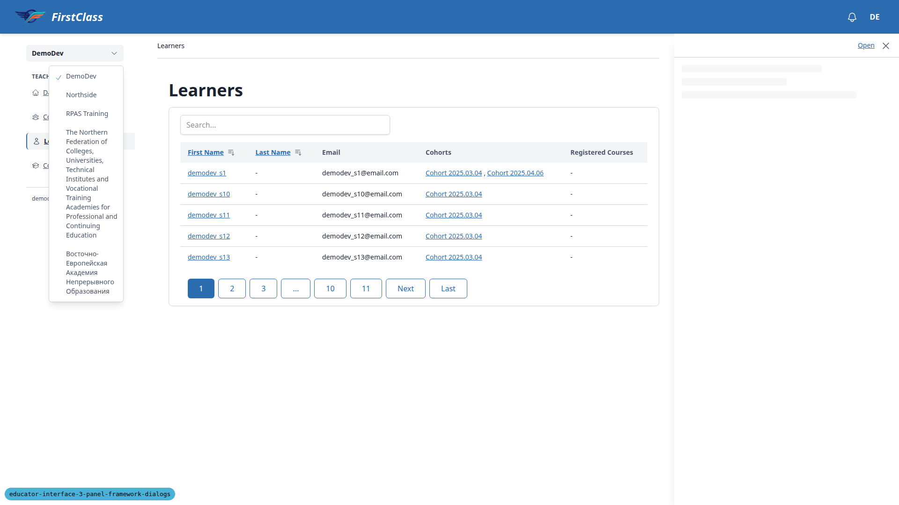
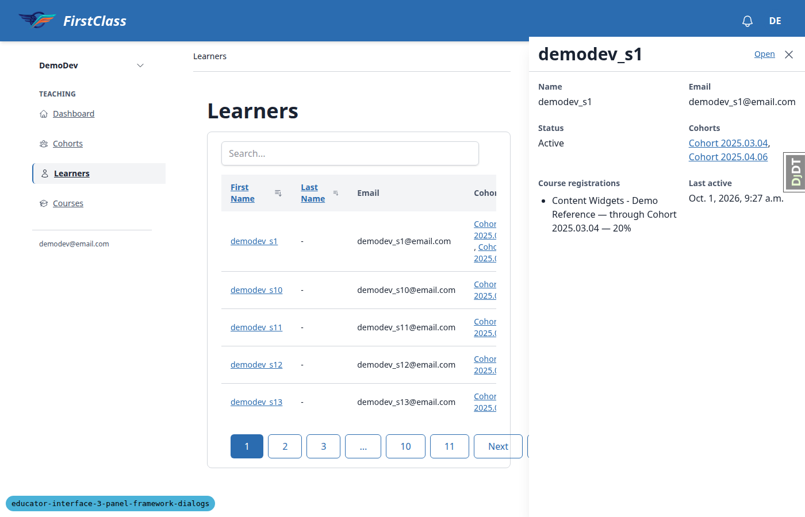
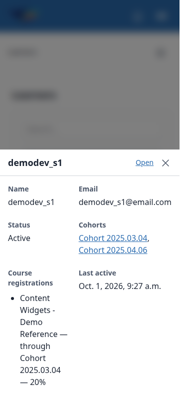
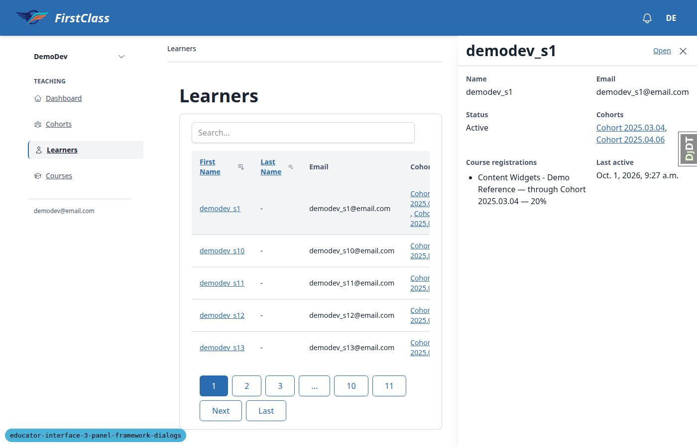
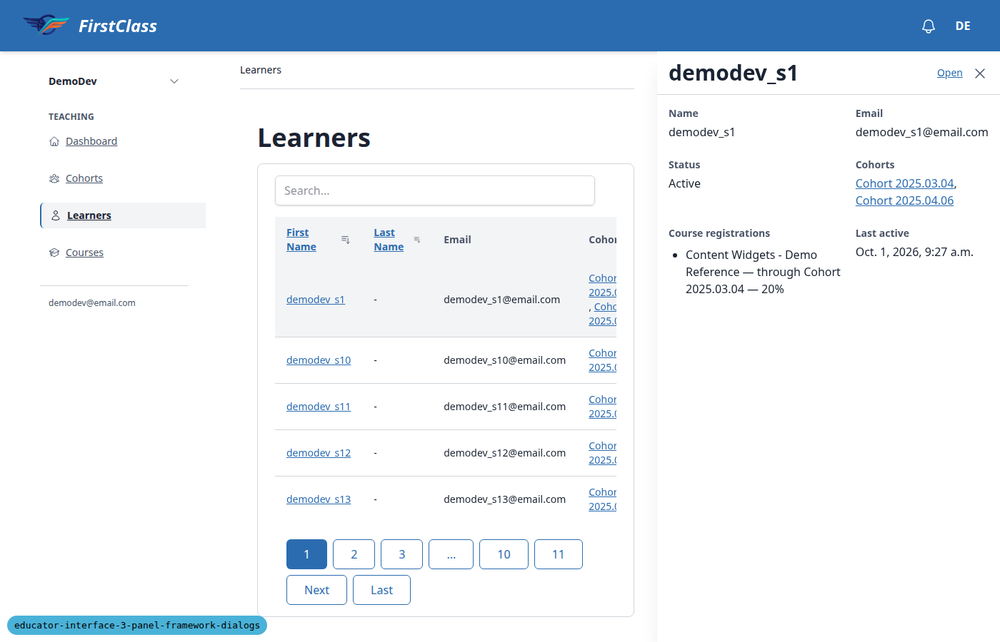

# Frontend QA Report: panel framework dialogs, the modal and the quick view

This run exercised the shared native modal, the quick-view drawer and the declared domain events
against `3. frontend_qa.md` at desktop, mobile and tablet viewports. Of 60 recorded checks, **52
passed**, **4 failed** and **4 were skipped** (screen-reader announcement checks and the iOS Safari
check, none of which automation can perform). Three defects were found: **B1** the quick view
reopens empty (no request, permanent skeleton) after the page is restored from htmx history and a
previously-opened learner's drawer is reopened; **B2** the pagination row runs under the docked
quick-view drawer at 1400px; **B3** the docked drawer overlaps the site header by 8px when the
viewport is widened past 1280px after a load at a mobile width.

## Methodology

Automated browser run via the Playwright MCP against a dev server on port 8689. Three viewports
were covered: desktop (1920x1080), mobile (375x812) and tablet (768x1024). Two identities were
used: the admin `demodev@email.com` in the main browser context, and
`qa_educator@example.com` in a separate browser context for the adversarial permission checks.
Seed data came from `qa_create_educator_modal_target DemoDev`. Before testing, the `fls-dev`
data helper deleted four leftover QA cohorts from earlier runs (QA Gamma, QA Beta, QA Delta, QA
Epsilon) so the cohort list started clean. Screenshots were collected into `screenshots/` beside
this report; every image referenced below was confirmed to exist in that folder. The Django debug
toolbar was hidden before each screenshot was taken.

## Diff scoping

Scoping class: **FULL**. Changed files included the shared modal cotton component
(`freedom_ls/base/templates/cotton/modal.html`), the base and panel-framework Alpine components
(`freedom_ls/base/static/base/js/alpine-components.js`,
`freedom_ls/panel_framework/static/panel_framework/js/alpine-components.js`), panel-framework and
educator-interface templates, and the related views/quick-view/events Python and tests. Because
the class was FULL, desktop, mobile and tablet viewports all ran; nothing was skipped by scoping.

## Smoke gate

**Pass.** Pages checked: `/` and `/educator/organisations/demodev/cohorts`.

## Design check

No design states tested.

## Results

| Test | Viewport | Status | Note | Screenshot |
|---|---|---|---|---|
| 3.1 | desktop | pass | Docked drawer with title, Open link, close button, full field set; focus stays on trigger, aria-expanded=true. | [screenshots/page-2026-10-01T19-51-28-526Z.png](screenshots/page-2026-10-01T19-51-28-526Z.png) |
| 3.2 | desktop | pass | Clicking another trigger replaces content/title; old trigger's aria-expanded returns to false. | - |
| 3.3 | desktop | pass | Same trigger toggles closed/open; reopen makes no new request. | - |
| 3.4 | desktop | pass | Esc closes, focus stays on link, aria-expanded=false. | - |
| 3.5 | desktop | pass | Ctrl/middle-click open a new tab; drawer stays closed. | - |
| 3.6 | desktop | pass | Open closes drawer and navigates to the learner page. | - |
| 3.7 | desktop | pass | Cohort link inside the learner drawer navigates to the cohort page. | - |
| 3.9 | desktop | pass | Cohort name in a learner page's Cohorts panel opens the cohort drawer. | - |
| 3.8 | desktop | pass | Cohort drawer from the cohorts list shows name/status/learners/courses; Open link is correct. | - |
| 3.10 | desktop | pass | Sorting with a drawer open refetches the table once; drawer and aria-expanded state persist. | - |
| 3.11 | desktop | pass | Blocked `__quick-view` shows an error with Retry; Retry loads after unblocking. | [screenshots/page-3-11-error-1790884402366.png](screenshots/page-3-11-error-1790884402366.png) |
| 3.12 | desktop | pass | cohortChanged with the shown pk refetches once; made-up id no-ops; reopen after close is fresh. | - |
| 3.13 | desktop | pass | Drawer sits below header, left of page content; modal opens above the drawer; drawer survives modal close. | [screenshots/page-2026-10-01T19-53-00-417Z.png](screenshots/page-2026-10-01T19-53-00-417Z.png) |
| 3.14 | desktop | pass | Direct `__quick-view` URL redirects to the full learner page. | - |
| 3.15 | desktop | pass | qa_educator gets 404 for a learner outside QA Modal Cohort and for a non-UUID pk. | - |
| 3.16 | desktop | pass | Print media hides the open drawer. | - |
| 3.17 | desktop | pass | prefers-reduced-motion gives 0s transitions, no running animations. | - |
| 3.18 | desktop | pass | dir=rtl pins the drawer to the left edge. | [screenshots/page-3-18-rtl-1790884419181.png](screenshots/page-3-18-rtl-1790884419181.png) |
| 2.6 | desktop | pass | qa_educator sees Delete but no Edit; direct edit URL returns the site's 403 page. | [screenshots/page-2-6-403-1790884432206.png](screenshots/page-2-6-403-1790884432206.png) |
| 1.1 | desktop | pass | Button disabled while loading; modal dialog with expected fields; backdrop does not scroll. | - |
| 1.2 | desktop | pass | Duplicate-name POST returns 422; focused error summary; field shows the actual error text. | [screenshots/page-2026-10-01T19-54-37-038Z.png](screenshots/page-2026-10-01T19-54-37-038Z.png) |
| 1.3 | desktop | pass | Save and add another re-shows a blank form, focus in Name; list updates with one GET. | - |
| 1.4 | desktop | pass | Save closes dialog, navigates in #main-content; HX-Trigger/HX-Location headers as expected. | - |
| 1.5 | desktop | pass | Back returns to the cohorts list with no dialog open. | - |
| 1.6 | desktop | pass | Tab then Esc on a pristine form closes with no prompt; focus returns to Create Cohort. | - |
| 1.7 | desktop | pass | Dirty Esc shows Discard changes? with Keep editing focused; Discard closes without creating. | [screenshots/page-2026-10-01T19-55-34-558Z.png](screenshots/page-2026-10-01T19-55-34-558Z.png) |
| 1.8 | desktop | pass | Type then delete one char; Esc closes with no prompt. | - |
| 1.9 | desktop | pass | Backdrop click with typed text leaves the dialog open and the text intact. | - |
| 1.10 | desktop | pass | First Esc shows the prompt; immediate second Esc did not close under Playwright Chromium (see General notes). | - |
| 1.11 | desktop | pass | Double-click Save produces exactly one POST and one cohort. | - |
| 2.1 | desktop | pass | Edit opens "Edit QA Alpha" with Name prefilled and focused. | - |
| 2.2 | desktop | pass | Rename updates the heading without reload; Details/Courses/Learners panels each refetch once. | - |
| 2.3 | desktop | pass | Delete dialog names the cohort, focus on Cancel; backdrop keeps it open, Esc closes it. | [screenshots/page-2-3-delete-1790884589767.png](screenshots/page-2-3-delete-1790884589767.png) |
| 2.4 | desktop | pass | Confirming delete closes the dialog and navigates to the cohorts list, cohort gone. | - |
| 2.5 | desktop | pass | Blocked-delete dialog explains the course progress record, no Delete button; backdrop closes it. | [screenshots/page-2-5-blocked-1790884612446.png](screenshots/page-2-5-blocked-1790884612446.png) |
| 2.7 | desktop | pass | Direct GET of the create_cohort fragment returns 200 with just heading+form, no chrome. | [screenshots/page-2-7-fragment-1790884613137.png](screenshots/page-2-7-fragment-1790884613137.png) |
| 6.1 | desktop | pass | Sidebar is inert under the native modal (correct); programmatic equivalents behaved as expected. | - |
| 6.2 | desktop | pass | Sidebar Cohorts closes the open drawer; Back shows learners with no drawer. | - |
| 6.2-reopen | desktop | **fail** | Reopening learner X after a sidebar nav + Back opens an empty, permanently-skeletoned drawer with no request. See bug B1. | [screenshots/page-6-3-switcher-1790884711317.png](screenshots/page-6-3-switcher-1790884711317.png) |
| 6.3 | desktop | pass | Switching organisation with a drawer open closes it and lands on the new org's learners page. | - |
| 6.4 | desktop | pass | Organisation switcher toggles aria-expanded; Esc closes it. | - |
| 5.1 | desktop | skip | No VoiceOver/NVDA available to automation; proxy ARIA check only. | - |
| 5.2 | desktop | skip | Proxy check only (role=alert + focus from 1.2); real announcement not verified. | - |
| 5.3 | desktop | skip | Proxy check only (aria-live region + aria-labelledby); real announcement not verified. | - |
| 4.1 | mobile | pass | Sheet slides up as a modal over a dimmed page; backdrop blocks scroll. Width note in General notes. | [screenshots/page-4-1-sheet-1790884836221.png](screenshots/page-4-1-sheet-1790884836221.png) |
| 4.2 | mobile | pass | Back closes the sheet, URL unchanged. | - |
| 4.3 | mobile | pass | Close button closes the sheet; next Back unwinds the sheet's history entry. | - |
| 4.4 | mobile | pass | Backdrop tap does nothing; Esc closes. | - |
| 4.5 | mobile | pass | Open navigates to the learner page; Back/Back give clean history to the dashboard. | - |
| 4.6 | mobile | pass | Sheet -> modal drawer at 1024 -> docked at 1400 -> sheet again at 375, with no new request at each step. | [screenshots/page-4-6-1024-1790884966433.png](screenshots/page-4-6-1024-1790884966433.png) |
| 4.6-docked-pagination | desktop | **fail** | At 1400px the pagination row overflows the narrowed card and sits under the docked drawer. See bug B2. | [screenshots/page-4-6-1400-1790884967353.png](screenshots/page-4-6-1400-1790884967353.png) |
| 4.6-header-offset | desktop | **fail** | Resizing from 375px to 1400px leaves the drawer 8px under the header; fresh load at 1400 is correct. See bug B3. | - |
| 4.7 | mobile | pass | Sheet and the mobile nav panel don't fight; whichever is open can be dismissed independently. | [screenshots/page-4-7-nav-1790885055672.png](screenshots/page-4-7-nav-1790885055672.png) |
| 4.8 | mobile | skip | Needs iOS Safari (real device or simulator); not available to automation. | - |
| 6.2-reopen | mobile | **fail** | Same empty-sheet defect as the desktop 6.2-reopen case, with a console InvalidStateError. See bug B1. | - |
| m-create-modal | mobile | pass | Create Cohort modal fits 375px width, buttons stack, no horizontal scroll. Close-button size noted below. | [screenshots/page-m-create-modal-1790885070620.png](screenshots/page-m-create-modal-1790885070620.png) |
| t-quick-view | tablet | pass | At 768px the quick view opens as a right-hand modal drawer over a dimmed page; Back closes it. | [screenshots/page-t-drawer-1790885115468.png](screenshots/page-t-drawer-1790885115468.png) |
| t-modal | tablet | pass | Create Cohort modal centred at 512px width. | [screenshots/page-t-modal-1790885117668.png](screenshots/page-t-modal-1790885117668.png) |
| t-nav | tablet | pass | Tablet gets the hamburger nav panel; opens as a modal dialog, Esc closes it. | - |
| 6.4-mobile | mobile | pass | Navigation panel opens/closes as expected at 375px. | - |

## B1: Quick view reopens empty after Back restores the page from htmx history

**Manifestations:** 6.2-reopen (desktop), 6.2-reopen (mobile)

**Expected:** After opening (and optionally closing) learner X's drawer, navigating away over htmx
and pressing Back, clicking learner X again opens the drawer and loads X's quick view (a fresh
`__quick-view` request or the cached content), with the title set and the trigger's
`aria-expanded="true"`.

**Actual:** No `__quick-view` request is sent. The drawer opens with an empty title and a
permanent skeleton; no trigger reports `aria-expanded="true"`. Esc does not clear it. Console shows
`InvalidStateError: Failed to execute 'showModal' on 'HTMLDialogElement': The element is not in a
Document`, raised from `quickView._showDialog` <- `_open` <- the `htmx:confirm` document listener
(`panel_framework/static/panel_framework/js/alpine-components.js` ~line 286). The quickView
instance from before the htmx history restore keeps its document listeners, still has `_shownUrl`
set, calls `_open` on its now-detached dialog and `preventDefault`s the request the new instance
needed. A different learner works fine immediately afterward; forward navigation (Cohorts then
Learners links) does not reproduce it. Reproduced 3 times on desktop; also reproduced on mobile via
the navigation panel.

## B2: Pagination runs under the docked quick-view drawer

**Manifestations:** 4.6-docked-pagination (desktop)

**Expected:** With the drawer docked (>=1280px), `#interface-main` narrows by the drawer width and
no page action or control sits underneath the drawer (spec: "the page's actions and table columns
are never underneath it").

**Actual:** At 1400px the learners card is about 528px wide, but the full pagination row (1 2 3 ...
10 11 Next Last, chosen by viewport breakpoint) does not wrap. It overflows the card, and "Last"
(right edge 998px) sits under the drawer (left edge 920px). The table itself scrolls horizontally
inside its `overflow-x-auto` wrapper, which is fine. At 1920px everything fits.

## B3: Docked drawer overlaps the header after widening from mobile

**Manifestations:** 4.6-header-offset (desktop)

**Expected:** The docked drawer starts below the site header at any viewport >= 1280px, including
after the window was resized up from a mobile width.

**Actual:** Loading `/learners` at 375px, resizing to 1400px, then opening a drawer: the drawer top
is 64px while the header bottom is 72px, so it covers 8px of the header. A fresh load at 1400px
gives 72px (correct). Cause: `--sidebar-top` is measured once in `sidePanel.init()`
(`freedom_ls/base/static/base/js/alpine-components.js` ~line 404) and never updated on resize; the
docked quick view reads it via `inset-block-start: var(--sidebar-top)`.

## Bug status

- B1: **FIXED** (commit: 8dcfd89a) — Quick view reopens empty after Back restores the page from htmx history. The stale quickView instance's htmx:confirm listener now does nothing once its dialog is detached. Re-verified on desktop (drawer left open, and closed, before navigating) and on mobile: one request, title set, aria-expanded true, no page errors.
  
- B2: **FIXED** (commit: 63647ba7) — Pagination runs under the docked quick-view drawer. The pagination row now wraps. Re-verified at 1400px with the drawer docked ("Last" ends at x=575, inside the card at 888 and clear of the drawer at 920); unchanged single row at 1920px.
  
- B3: **FIXED** (commit: 2110e440) — Docked drawer overlaps the header after widening from mobile. --sidebar-top is now re-measured when the lg breakpoint flips. Re-verified: load at 375px, widen to 1400px, open a drawer, and its top is 72px, flush with the header bottom. The mobile nav panel and desktop sidebar still work.
  

## General notes

- Plan wording drift (not defects): 3.1 says press Space to toggle a focused link, but native links
  activate with Enter (Enter verified, Space is a no-op on a link); 1.2 the field error reads
  "Another cohort already has this name." not "already exists"; 2.2 the plan says one GET of the
  Details panel, but spec requirement 8 makes every cohort detail panel refresh on cohortChanged (3
  GETs observed, matching the spec); 2.3 the cascade sentence only renders when something actually
  cascades (verified separately on Cohort 2025.04.06, without deleting it); 6.1 the sidebar is
  inert under a native modal, so the click there was simulated programmatically instead of a real
  pointer event.
- 1.10: the immediate second Esc did not close the dialog under Playwright Chromium (user-activation
  semantics differ under automation); the typed data was kept — not a defect.
- The sheet/drawer is 15px short of full width in a resized desktop window, because of the classic
  scrollbar gutter; true mobile emulation (overlay scrollbars) gives the full width.
- The modal's close (X) button is 24x26px at mobile, below the 44px touch-target guideline.
- The document title on cohort/learner detail pages reads "DemoDev — DemoDev" with no instance
  name — likely pre-existing, not introduced by this change.
- The Learners list "Registered Courses" column shows "-" for a learner whose quick view lists a
  registration reached through a cohort (the column appears to count only direct registrations) —
  tangential to this change.
- Not testable by automation: section 5 screen reader checks (proxy ARIA checks recorded instead),
  and 4.8 iOS Safari.
- Back with the create modal open initially landed on the bare `__actions/create_cohort` URL, but
  only because test 2.7 had visited that URL directly earlier in the same tab; re-tested with clean
  history and Back went to the previous page as expected — not a defect.

status: ok · reason: 3 bugs — 3 fixed, 0 unresolved; report rendered, screenshots verified
