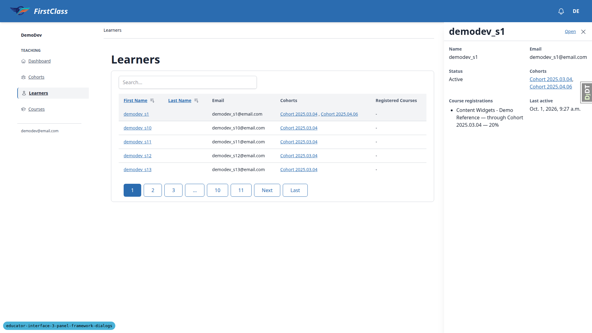
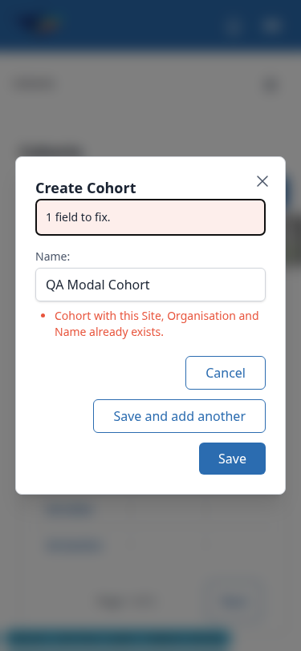

# Frontend QA report: educator-interface-3-panel-framework-dialogs

## 1. Methodology

Manual testing through Playwright MCP (Chromium) at three viewports: desktop 1920x1080, mobile
375x812, and tablet 768x1024, with breakpoint flips to 1024px and 1400px added inside test 4.6 to
watch the sheet/drawer transition. Signed in as the admin `demodev@email.com` for the main pass, and
as the educator `qa_educator@example.com` in a separate browser context for the adversarial checks
in tests 2.6, 3.15 and the mobile switcher.

Seed data: a fresh dev database after the pre-step rebase (below), seeded with
`create_demo_data --yes`, `content_save ./demo_content DemoDev`,
`qa_create_educator_modal_target DemoDev`, `qa_create_educator_progress_targets DemoDev`, and
`qa_create_organisations DemoDev`. The last command was added mid-run so the organisation switcher
had more than one organisation to show for test 6.3. Organisation slug is `demodev`; all URLs below
are under `/educator/organisations/demodev/...`.

Screenshots were collected into `screenshots/` beside this report; every image referenced below
exists in that folder.

A browser-context crash partway through section 1 forced a re-login and briefly reset the viewport
to 1280x720 — visible in the test 1.5 screenshot — after which the viewport was set back to
1920x1080 for the rest of the run.

Pre-step rebase: the branch was rebased onto `origin/main` (one docs-only upstream commit), replaying
29 commits with no conflicts; the lost-change check passed. One stale Playwright test,
`test_instance_title_htmx.py`, still dispatched the removed `panelChanged` event; it was updated to
dispatch `instanceTitleChanged` instead and committed as `bb78c816`. The full test suite then ran
5590 passed and 1 setup error, in `freedom_ls/icons/tests/test_course_semantic_name.py`, which passes
when run alone — treated as flaky and not pursued further. The rebase-time front-end check was folded
into this full QA run rather than run separately, since main's change was docs-only and this run
visits a superset of its pages at all three viewports.

## 2. Diff scoping

Scoping class: **FULL**. 109 files changed in total; 28 of them are front-end paths (templates and
the two Alpine components under `base` and `panel_framework`, covering the modal, modal trigger,
dropdown menu, quick-view trigger/frame/host, panel bases, and the data-table/cohort-link cells used
by the quick view) and those 28 are what triggered FULL scope. Nothing was skipped.

## 3. Smoke gate

Smoke gate: **pass**. Pages checked: `/`, `/educator/organisations/demodev/cohorts`,
`/educator/organisations/demodev/learners`.

## 4. Results table

| Test | Viewport | Status | Note |
|---|---|---|---|
| 1.1 | desktop | pass | Delayed fetch kept the dialog closed/button disabled; modal then opened centred 512x210, heading, caret in Name, dimmed non-scrolling backdrop. |
| 1.2 | desktop | pass | Duplicate name -> one POST 422, dialog stays open, focused error summary, Name `aria-invalid` with the duplicate message. |
| 1.3 | desktop | pass | Save and add another -> POST 200, one GET of the cohorts region, blank form, focus in Name, new cohort listed. |
| 1.4 | desktop | pass | Save -> POST 204 with `cohortChanged`/`closeModal`/`HX-Location`, no `HX-Redirect`; dialog closes, heading/breadcrumb update, no full reload. |
| 1.5 | desktop | pass | Back -> cohorts list, no dialog open. Screenshot at 1280x720 from the context-crash reset (see Methodology). |
| 1.6 | desktop | pass | Tab to Cancel, Esc closes and returns focus to Create Cohort; Space reopens with focus in Name. |
| 1.7 | desktop | pass | One char + Esc -> discard prompt, Keep editing retains text and focus; Esc + Discard closes with nothing created. |
| 1.8 | desktop | pass | Type then delete the char, Esc -> closes with no prompt (form matches original state). |
| 1.9 | desktop | pass | Backdrop click with text typed -> dialog stays open, text kept. |
| 1.10 | desktop | pass | Double Esc closed the dialog and lost the text; Playwright's trusted key presses don't trigger Chrome's CloseWatcher limit (not reproducible under automation, not a bug either way). |
| 1.11 | desktop | pass | Double-click Save -> exactly one POST, one cohort created. |
| 2.1 | desktop | pass | Edit opens "Edit QA Alpha" with Name prefilled and focused. |
| 2.2 | desktop | pass | Rename -> POST 204, heading/breadcrumb update without reload; three panel GETs fire (learners, courses, details), which is spec-correct, not one (see General notes). |
| 2.3 | desktop | pass | Delete dialog headed with the cohort name, focus on Cancel; backdrop click keeps it open, Esc closes it. No cascade sentence for QA Alpha 2 (nothing to cascade); confirmed present on a cohort that does have a membership. |
| 2.4 | desktop | pass | Confirm delete -> DELETE 204, navigates to cohorts list, cohort no longer listed, one GET, no 404s. |
| 2.5 | desktop | pass | Blocked-delete message for a cohort with a progress record, Cancel only; backdrop click closes it (no form). |
| 2.6 | desktop | pass | Educator sees Delete but not Edit, no edit form/cascade text in the HTML; pasted edit URL -> site 403 page. |
| 2.7 | desktop | pass | Direct GET of the create-cohort fragment -> 200 bare fragment, no chrome; only console noise is a favicon 404. |
| 3.1 | desktop | pass | Drawer docks right, non-modal, 480px inline-end padding, page not dimmed/still clickable; skeleton then full content; focus stays on the trigger link. Test-plan's "press Space" doesn't apply to this `<a>` trigger (see General notes). |
| 3.2 | desktop | pass | Second learner replaces content/title; old link `aria-expanded=false`, new one `true`. |
| 3.3 | desktop | pass | Same link closes then reopens the drawer with cached content, zero new requests. |
| 3.4 | desktop | pass | Esc closes the drawer, focus returns to the trigger. |
| 3.5 | desktop | pass | Ctrl-click and middle-click open a new tab; drawer stays closed. |
| 3.6 | desktop | pass | Open closes the drawer and navigates to the learner page. |
| 3.7 | desktop | pass | Cohort link inside the learner drawer navigates to the cohort page. |
| 3.8 | desktop | pass | Cohort drawer shows name/status/learner count/courses; Open navigates to the cohort page. |
| 3.9 | desktop | pass | Cohort link inside a learner page's Cohorts panel opens the cohort drawer. |
| 3.10 | desktop | pass | Sorting with the drawer open triggers one GET, drawer stays open, shown learner's link still `aria-expanded=true`. |
| 3.11 | desktop | pass | Blocked request and a 500 both show an error with Retry inside the open drawer; Retry reloads after unblocking. Drawer title is empty in this error state (see General notes). |
| 3.12 | desktop | pass | `cohortChanged` with the shown pk refetches once; made-up id does nothing; stale-marking causes a fresh request on reopen; unrelated close/reopen is cached. |
| 3.13 | desktop | pass | Drawer sits below the header with the table/Create Cohort to its left; modal opens above the drawer; Esc closes the modal only. |
| 3.14 | desktop | pass | Direct visit to a learner `__quick-view` URL redirects to the learner page, never a bare fragment. |
| 3.15 | desktop | pass | Educator visiting another cohort's learner `__quick-view` URL, or a non-UUID path, gets 404 both ways. |
| 3.16 | desktop | pass | Print emulation hides the open drawer; `#interface-main` padding is retained only because the emulated print viewport stays 1920px wide (see General notes). |
| 3.17 | desktop | pass | `prefers-reduced-motion: reduce` collapses transitions to near-instant open/close. |
| 3.18 | desktop | pass | `dir=rtl` pins the drawer to the left edge; reset to ltr afterwards. |
| 5.1 | desktop | skip | No screen reader available; proxy checks (accessible dialog role/name, DOM order, initial focus) pass — see General notes. |
| 5.2 | desktop | skip | No screen reader available; proxy check (focused `role=alert` error summary) passes. |
| 5.3 | desktop | skip | No screen reader available; proxy checks (polite live region text, dialog name) pass. |
| 6.1 | desktop | pass | Clicking the sidebar while the modal is open isn't possible (page is inert); tested the intent via Back/Forward instead, which behaved correctly (see General notes). |
| 6.2 | desktop | pass | Sidebar nav closes the open learner drawer; Back returns to the learners page with no drawer. |
| 6.3 | desktop | pass | Org switcher opened beside the docked drawer; switching organisation closed the drawer and reset `#interface-main` padding to 0. |
| 6.4 | desktop | pass | Switcher opens/closes via Esc (focus returns) and outside click; switching back to DemoDev works. |
| 4.1 | mobile | pass | Tap opens a bottom sheet (modal, dimmed, non-scrolling backdrop) with the same content as desktop. |
| 4.2 | mobile | pass | Back closes the sheet, stays on the learners page. |
| 4.3 | mobile | pass | Close then one Back leaves the learners page — the sheet's history entry was unwound. |
| 4.4 | mobile | pass | Backdrop tap does nothing; Esc closes the sheet. |
| 4.5 | mobile | pass | Open -> learner page; Back -> learners list with no sheet; further Back -> cohorts, no dead entry. |
| 4.6 | mobile | pass | Breakpoint flips 375 (sheet, modal) -> 1024 (right-hand drawer, still modal) -> 1400 (docked, non-modal) -> 375 (sheet again), zero new requests across flips; Close + one Back leaves the page. |
| 4.7 | mobile | pass | Sheet and mobile nav don't fight: whichever is topmost closes on Esc without disturbing the other. |
| 4.8 | mobile | skip | Needs iOS Safari (device or simulator), not available in this environment. |
| M-modals | mobile | pass | Create modal at 375px is 337px wide, buttons wrap, no overflow; delete modal fits without overflow. Close button is 24x26px (see General notes). |
| 6.4 | mobile | pass | Hamburger opens the nav panel; switcher inside opens; first Esc closes only the switcher, second closes the nav and returns focus to the hamburger. |
| T-nav | tablet | pass | 768px gets the mobile hamburger nav, no horizontal page scroll; learners table scrolls inside its own card. |
| T-3.1 | tablet | pass | Learner quick view is the modal right-hand drawer over a dimmed page; backdrop click doesn't close it; Back does. Same scrollbar-gutter strip as mobile (see General notes). |
| T-3.8 | tablet | pass | Cohort quick view opens with name/status/learner count/courses; Esc closes. |
| T-1.1 | tablet | pass | Create Cohort modal centred at 512px, buttons on one row. |
| X-empty-link | desktop | fail | Blank-last-name learners render an empty, unnamed, focusable quick-view trigger. See bug B1. |
| X-dup-copy | desktop | fail | Duplicate-name error exposes internal Site/Organisation field names. See bug B2. |

## 5. Bugs

### B1: Blank data-table link cells render an empty, unnamed, focusable quick-view link

**Manifestations:** X-empty-link at desktop, mobile and tablet viewports.

**Screenshot:**

**Expected:** A link column whose text is blank renders no link at all — the same `-` placeholder
other empty cells use — so there is no focusable control without an accessible name.

**Actual:** Every demo learner has a blank last name, and the Last Name cell renders an empty
`<a aria-controls="quick-view" aria-expanded="...">` containing only whitespace. It is focusable
(has an `href`), has no accessible name, and is visually invisible, so keyboard and screen-reader
users land on an unnamed control that opens the quick view. This happens at every viewport. The
underlying data-table link cell already rendered an empty `<a>` for blank text before this branch,
but this branch is what turns that empty link into a quick-view trigger.

### B2: Duplicate cohort name error exposes internal Site and Organisation fields

**Manifestations:** X-dup-copy at desktop and mobile viewports.

**Screenshot:**

**Expected:** An error worded in the educator's own terms, e.g. "A cohort with this name already
exists."

**Actual:** The create-cohort form shows "Cohort with this Site, Organisation and Name already
exists." — Django's default `UniqueConstraint` message — which names internal Site and Organisation
fields the educator never chose or sees elsewhere in this form.

## Bug status

- B1 — **FIXED** (commit: 04083f83) — Blank data-table link cells render an empty, unnamed, focusable quick-view link. `link.html` now renders the shared "-" placeholder with no link when the cell text is blank. Re-verified: the Last Name column shows "-", the learners list, cohorts list and learner page have no empty links, and the First Name quick view still opens.

  
- B2 — **UNRESOLVED** — Duplicate cohort name error exposes internal Site and Organisation fields (reason: the error wording is a copy decision for a human, and the same Django default message reaches every UniqueConstraint form that uses ConstraintValidationFormMixin)

## 6. General notes

- Test-plan wording that does not match the spec:
  - 2.2 expects "one GET of the panel region", but spec requirement 8 says every panel on the
    cohort detail page refreshes on `cohortChanged`; three GETs (learners, courses, details) fired,
    and that is spec-correct, not a bug.
  - 3.1 says "press Space to confirm it toggles", but the trigger is an `<a>` per spec requirement
    22, and links activate on Enter, not Space; Enter toggles the drawer correctly.
  - 6.1 asks to click the sidebar while the modal is open, which is impossible: the page behind an
    open modal is inert, so the click never reaches the sidebar. The intent was tested instead via
    browser Back/Forward, which behaved correctly.
  - 1.10's CloseWatcher double-Esc limit could not be reproduced under automation: Playwright's key
    presses carry trusted user activation, so Chrome's anti-abuse limit on the second Esc never
    engaged. No data loss was observed either way; the plan already calls this "not a bug".
  - 2.3's "will also delete" cascade sentence only renders when something will actually cascade;
    it was absent for a cohort with nothing to delete and present on one that had a membership.
- Not run: section 5 was not run with a real screen reader (VoiceOver/NVDA unavailable in this
  environment); proxy DOM/ARIA checks were recorded instead for 5.1–5.3. Test 4.8 (iOS Safari) was
  not run; no real device or simulator was available.
- In browsers with classic (non-overlay) scrollbars, the quick-view drawer/sheet's
  `scrollbar-gutter: stable` leaves a 15px undimmed strip beside the modal drawer/sheet, visible in
  headless Chromium on desktop and tablet; phones with overlay scrollbars don't show it.
- The drawer's title is empty while it is showing the error/Retry state (test 3.11).
- The modal's Close button measures 24x26px — this meets WCAG 2.5.8 AA's 24x24px minimum but is
  below the 44px touch-target guideline.
- On the learners table, the Registered Courses column shows "-" for a learner whose own drawer
  lists a cohort-based course registration; the column appears to count only direct registrations.
  This predates the branch and was not filed as a bug for this run.
- The cohort and learner detail page `<title>` reads "DemoDev — DemoDev", with no instance name in
  it.
- Under print emulation, the drawer's 30rem equivalent padding on `#interface-main` is retained only
  because the emulated print viewport stays 1920px wide; on real paper (~794px) the 1280px media
  query that applies it would not match, so no gutter is expected on an actual print.
- Order-dependent test flakes: two full-suite runs this session each had one setup error in an
  unrelated test that passes on its own (`icons/tests/test_course_semantic_name.py` after the
  rebase, `content_base/tests/test_admin_filters.py::TestTagFilter::test_filtering_by_a_tag_narrows_the_changelist`
  during the B1 fix run).

status: ok
reason: 2 bugs — 1 fixed, 1 unresolved; report rendered, screenshots verified
