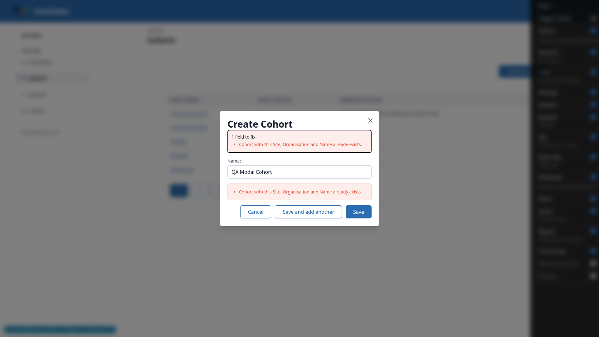
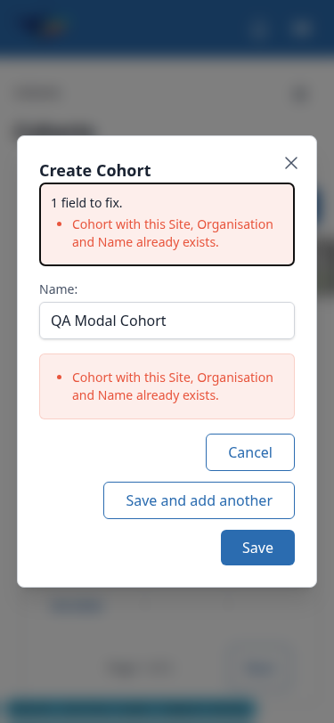
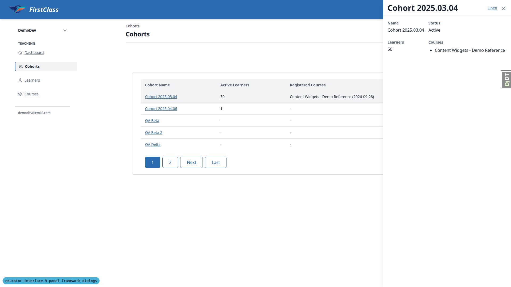
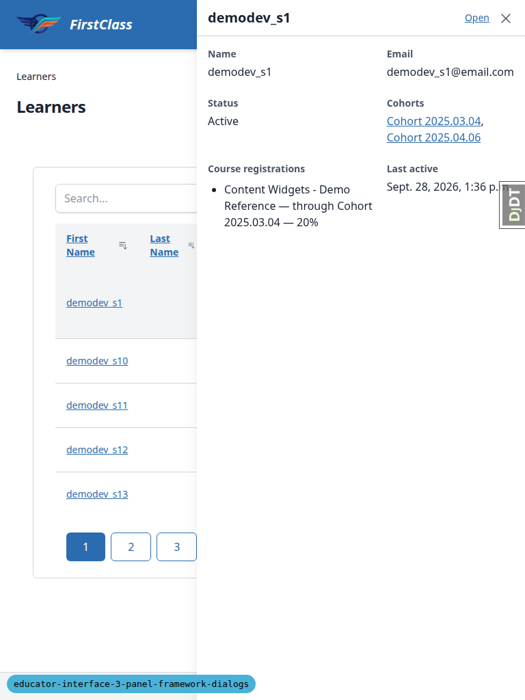

# Frontend QA report: panel framework dialogs, the modal and the quick view

## 1. Methodology

Testing was driven manually through the Playwright MCP (Chromium), at three viewports: desktop
1920x1080, mobile 375x812, and tablet 768x1024. The admin `demodev@email.com` was used for the
main run; `qa_educator@example.com` was logged in in a second browser context for the adversarial
permission tests (test plan 2.6 and 3.15). Seed data came from
`qa_create_educator_modal_target DemoDev` and `qa_create_educator_progress_targets DemoDev`. The
organisation slug is `demodev`, so URLs are of the form
`/educator/organisations/demodev/...`.

Screenshots were collected into `screenshots/` beside this report; every image referenced below
exists in that directory. Network behaviour was checked with a Playwright response recorder
standing in for the devtools Network tab, and blocked requests used `page.route` in place of
devtools' "Block request URL".

Environment note: the dev Postgres and Mailpit docker containers had exited before the run and
were restarted before testing began.

## 2. Diff scoping

Class: **FULL**.

The change touches the shared panel framework's modal and quick-view machinery end to end:
Alpine components for both the app-wide `base` app (`alpine-components.js`) and the
`panel_framework` app (`panel_framework/static/panel_framework/js/alpine-components.js`), the
modal, quick-view and panel Cotton templates (`modal.html`, `modal-trigger.html`,
`quick-view-trigger.html`, `partials/modal_host.html`, `partials/modal_trigger.html`,
`partials/quick_view_host.html`, `partials/modal_form.html`, `partials/delete_confirmation.html`,
`panels/_panel_base.html`, `views/_main_base.html`, `quick_view/frame.html`, and the
`modal/delete_confirmation.html`, `modal/form.html`, `modal/read_only.html` templates), the
educator-interface's cohort and learner quick-view fragments and data-table cell/link templates,
and the `interface.html` shell. 99 files changed in total. Given the breadth (shared JS behaviour
plus every template that renders a modal, drawer or sheet), this run covers the full test plan
rather than a diff-scoped subset.

Nothing skipped: desktop, mobile and tablet all ran.

## 3. Smoke gate

**Pass.** Pages checked: `/`, `/educator/organisations/demodev/cohorts`,
`/educator/organisations/demodev/learners`.

## 4. Results table

| Test | Viewport | Status | Note |
|---|---|---|---|
| 1.1 | desktop | pass | Modal opens correctly: disabled button while loading, centred 512px dialog, aria-labelledby heading, caret in Name, all buttons present, backdrop dimmed, html scroll locked |
| 1.2 | desktop | fail | See B1 — duplicate-name error is form-level, not attached to Name |
| 1.3 | desktop | pass | Save and add another leaves a blank, focused form; list region updates with one GET, no reload |
| 1.4 | desktop | pass | Save navigates into `#main-content` with correct HX-Trigger/HX-Location headers, no reload |
| 1.5 | desktop | pass | Back returns to cohorts list with no dialog open |
| 1.6 | desktop | pass | Tab to Cancel, Esc closes and refocuses Create Cohort; Space reopens |
| 1.7 | desktop | pass | Discard-changes prompt behaves as specified: Keep editing/Discard both correct |
| 1.8 | desktop | pass | Type-then-delete then Esc closes with no prompt (matches original state) |
| 1.9 | desktop | pass | Backdrop click on a dirty form does nothing |
| 1.10 | desktop | pass | Second Esc did not lose the text — see general notes, plan correction |
| 1.11 | desktop | pass | Double-click Save produces exactly one POST and one cohort |
| 2.1 | desktop | pass | Edit dialog opens prefilled and focused, heading names the cohort |
| 2.2 | desktop | fail | See B2 — breadcrumb keeps old name after rename |
| 2.3 | desktop | pass | Delete dialog behaves as specified; no cascade sentence for an empty cohort (conditional) |
| 2.4 | desktop | pass | Confirmed delete navigates to the list, cohort gone |
| 2.5 | desktop | pass | Blocked-delete dialog explains the course-progress record, no Delete button |
| 2.6 | desktop | fail | See B3 — bare empty-bodied 403 on the forbidden action URL |
| 2.7 | desktop | pass | Direct GET of the create-cohort action fragment returns a bare, chrome-free fragment |
| 3.1 | desktop | pass | Drawer opens as specified; Space-vs-Enter is a plan wording issue, see general notes |
| 3.2 | desktop | pass | Second learner replaces content/title; aria-expanded toggles correctly |
| 3.3 | desktop | pass | Same-learner toggle closes/reopens from cache with zero new requests |
| 3.4 | desktop | pass | Esc closes, focus returns to the trigger link |
| 3.5 | desktop | pass | Ctrl-click and middle-click open a new tab without opening the drawer |
| 3.6 | desktop | pass | Open closes the drawer and navigates to the learner page |
| 3.7 | desktop | pass | Cohort link inside the learner drawer navigates to the cohort page |
| 3.8 | desktop | pass | Cohort drawer shows name/status/learner count/courses; Open navigates |
| 3.9 | desktop | pass | Cohort links inside the learner page's Cohorts panel open the cohort drawer |
| 3.10 | desktop | pass | Sort refetches the table once, drawer stays open, aria-expanded correct after swap |
| 3.11 | desktop | pass | Blocked request and a forced 500 both show the error state with Retry; Retry recovers |
| 3.12 | desktop | pass | Staleness via `cohortChanged` behaves exactly as specified for shown/made-up/stale pks |
| 3.13 | desktop | fail | See B4 — drawer overlays the Create Cohort button |
| 3.14 | desktop | pass | Direct visit to a learner `__quick-view` URL redirects to the full learner page |
| 3.15 | desktop | pass | Out-of-scope learner and a non-uuid `__quick-view` both 404 for `qa_educator` |
| 3.16 | desktop | pass | Print media hides the drawer |
| 3.17 | desktop | pass | Reduced motion makes open/close instant; normal motion keeps the 0.2s slide |
| 3.18 | desktop | pass | RTL pins the drawer to the left edge |
| 6.1 | desktop | pass | Sidebar is inert while the modal is open (native `showModal`), so no navigation race is possible; see general notes on the plan's wording |
| 6.2 | desktop | pass | Sidebar navigation closes the drawer; Back leaves no drawer open |
| 6.3 | desktop | pass | Switching organisation with a drawer open closes it and switches correctly |
| 6.4 | desktop | fail | See B5 — one Esc closes both the org-switcher dropdown and the drawer |
| 4.1 | mobile | pass | Sheet slides up modal, pinned bottom, dimmed, html scroll locked, pushes one history entry |
| 4.2 | mobile | pass | Back closes the sheet, stays on the learners URL |
| 4.3 | mobile | pass | Close unwinds the history entry; one Back then leaves the page |
| 4.4 | mobile | pass | Backdrop tap does nothing; Esc closes |
| 4.5 | mobile | pass | Open loads the learner page; Back returns with no sheet |
| 4.6 | mobile | fail | See B6 — resizing across the breakpoint leaves dead history entries |
| 4.7 | mobile | pass | Sheet and nav panel do not fight (sheet is modal, making the nav trigger inert); see general notes on nav-panel Esc behaviour |
| 4.8 | mobile | skip | Needs iOS Safari, unavailable to Playwright Chromium |
| 4.x-modal | mobile | pass | Create modal fits at 375px, button row wraps, 422 state readable; close X is 24x26px (below the 44px guideline); post-422 Cancel skips the discard prompt, see general notes |
| 4.x-table | mobile | pass | Learners table scrolls inside an overflow-x wrapper with no page overflow; name links are 19px tall (pre-existing) |
| T-nav | tablet | pass | 768px gets the mobile hamburger nav; opens as a modal dialog, Esc closes, no page overflow |
| T-3.1 | tablet | fail | See B4 — drawer covers 62% of the viewport at 768px |
| T-modal | tablet | pass | Create modal is centred at 512px wide at 768px |
| T-detail | tablet | pass | Cohort detail panels fit at 768px with no horizontal overflow |
| 5.1-5.3 | desktop | skip | No VoiceOver/NVDA available; ARIA proxies (aria-labelledby, role=alert focus) checked instead |

## 5. Bugs

### B1: Duplicate cohort name error is a form-level error, not attached to the Name field

Manifestations: 1.2 (desktop), 4.x-modal (mobile).

**Expected:** The Name field shows the "already exists" error (test plan 1.2), marked
`aria-invalid` and linked to the field.

**Actual:** The unique-together error renders as an `errorlist nonfield` box below the input; the
input itself has no `aria-invalid`/`aria-describedby`; the error summary says "1 field to fix" for
an error that is not attached to any field.

### B2: Breadcrumb keeps the old name after an Edit renames the instance

Manifestations: 2.2 (desktop).

**Expected:** After renaming "QA Alpha" to "QA Alpha 2" in the Edit modal, every on-page mention of
the instance's name updates without a reload.

**Actual:** The `h1` (`#instance-title`) updates via the `instanceTitleChanged` event, but the
breadcrumb still reads "Cohorts / QA Alpha" until a full reload.

### B3: Forbidden action URL returns a bare, empty-bodied 403

Manifestations: 2.6 (desktop).

**Expected:** Pasting an action URL the educator lacks permission for shows a 403 page.

**Actual:** `panel_framework/views.py` `_handle_action` returns `HttpResponse(status=403)` with no
body, so the browser shows its own "HTTP ERROR 403" page rather than the site's 403 page; no form
is exposed. Separately, the test plan's own URL for this step
(`/__panels/details/__actions/edit`) 404s — the real path needs a `/__tabs/details` segment first
(`/__tabs/details/__panels/details/__actions/edit`).

### B4: Desktop quick-view drawer overlays and hides page actions and table columns

Manifestations: 3.13 (desktop), T-3.1 (tablet).

**Expected:** With a drawer open the page behind stays usable: "Create Cohort" can be clicked
(test plan 3.13) and the table stays clickable (test plan 3.1).

**Actual:** The 480px non-modal drawer overlays the right of the page. At 1920x1080 it covers the
right-aligned Create Cohort button (unreachable by mouse — a Playwright click on it times out
because the drawer intercepts pointer events) and the right part of the table. At 768px it covers
62% of the viewport, leaving only the first-name column reachable.

### B5: One Esc closes both an open dropdown menu and the desktop drawer

Manifestations: 6.4 (desktop).

**Expected:** Esc dismisses only the topmost layer: with the organisation-switcher dropdown open
over a drawer, the first Esc closes the dropdown and the drawer stays open.

**Actual:** A single Esc closes the dropdown and the drawer together. The drawer's document
`keydown` handler (`panel_framework` `alpine-components.js`, around line 324) only steps aside for
an open `:modal` dialog, not for an open dropdown-menu, whose own `onEscape` listens on `window`
and fires after the document-level handler.

### B6: Crossing the md breakpoint with the quick view open leaves dead history entries

Manifestations: 4.6 (mobile).

**Expected:** The mobile sheet owns at most one history entry; after closing it, one Back leaves
the page.

**Actual:** Opening the sheet at 375px, widening to 1024px (becomes the non-modal drawer),
narrowing back to 375px (becomes the sheet again), then pressing Close: it takes three Backs to
leave `/learners` (two dead same-URL entries). Without the resize, closing only takes one Back.
The narrow re-open pushes a new history entry while the earlier one is never unwound.

## Bug status

- B1 — **FIXED** (commit: b29c7f4a) — Duplicate cohort name error is a form-level error, not attached to the Name field. Decision: a UniqueConstraint error goes on the one constraint field the form renders (ConstraintValidationFormMixin), and the error summary counts only field errors. The admin forms for webhook secrets and files now show their duplicate errors on Name and File path too
- B2 — **FIXED** (commit: 8f7bb820) — Breadcrumb keeps the old name after an Edit renames the instance. Re-verified: renaming "QA Beta 2" to "QA Beta 3" updates the h1 and the breadcrumb without a reload
- B3 — **FIXED** (commit: d495ac3d) — Forbidden action URL returns a bare, empty-bodied 403. Decision: `_handle_action` raises `PermissionDenied`, so the site's 403.html renders. htmx callers see no change, because htmx does not swap a 4xx response. Test plan step 2.6's URL is corrected
- B4 — **FIXED** (commit: 1daf33e5) — Desktop quick-view drawer overlays and hides page actions and table columns. Decision: the drawer docks non-modally only from 1280px, below the site header, and `#interface-main` gives up 30rem while it is open. From 768px to 1279px it is a modal side drawer, and below 768px it stays the bottom sheet. The spec and test plan (3.x viewport, 3.13, 4.6) are updated to match
- B5 — **FIXED** (commit: 0e952b88) — One Esc closes both an open dropdown menu and the desktop drawer. Re-verified: the first Esc closes only the switcher, the second closes the drawer; the header user menu and the switcher on their own still close on Esc
- B6 — **FIXED** (commit: 2cc9e934) — Crossing the md breakpoint with the quick view open leaves dead history entries. Re-verified: after a double breakpoint flip and Close, one Back leaves the page; Back-to-close still works after a flip

## General notes

**Test plan corrections:**

- Test plan 2.6's delete action URL is missing a path segment: it needs `/__tabs/details` before
  `/__panels/details/__actions/edit`, or it 404s.
- Test plan 3.1 and 1.6 say to "press Space" to activate a link, but native `<a>` elements only
  activate on Enter, not Space; Enter was confirmed to toggle correctly in both cases.
- Test plan 3.13 refers to "the learner drawer on the cohorts page", but the cohorts page only has
  cohort links, so a cohort drawer was used to reproduce the step instead.
- Test plan 1.10's documented CloseWatcher double-Esc text loss did not reproduce under
  Playwright: the second Esc kept the discard prompt open and the typed text intact, which is the
  safer behaviour, not a bug.
- Test plan 6.1 cannot be carried out as written: with the create modal open (native
  `showModal`), the sidebar is inert, so there is no way to click a sidebar link while the dialog
  is open in the first place.
- Test plan 1.4 asked to type "QA Beta", but "QA Beta" already existed from an earlier run (would
  have hit the duplicate-name error), so "QA Beta 2" was used instead.

**Not tested:**

- Test plan 4.8 needs iOS Safari (real device or simulator), which was not available to Playwright
  Chromium.
- Test plan section 5 (screen reader checks) was not run — no VoiceOver or NVDA was available in
  this environment. The ARIA proxies that could be checked without a screen reader all passed,
  including the `aria-live` "Showing demodev_s1" region.

**Pre-existing observations (not caused by this branch):**

- The cohort detail and learner pages' document title reads "DemoDev — DemoDev" (no instance
  name), even on a full page load.
- The learner page `h1` reads "<email> - DemoDev", while the drawer titles the same learner by
  display name.
- An empty last name renders an empty, nameless `<a>` in the Learners table's Last Name column —
  the previous link template did the same.
- On mobile and tablet, one Esc with the organisation switcher open inside the mobile nav panel
  closes the whole nav panel (native modal `cancel` behaviour); the side-panel code is unchanged
  on this branch.

**Touch targets on mobile:**

- The modal close X is 24x26px.
- The drawer's "Open" link is small.
- Table name links are 19px tall.

All are below the 44px touch-target guideline.

**Other observations:**

- After a 422 validation error, Cancel or Esc closes the create modal with no discard prompt,
  because the re-rendered (error) form becomes the new clean baseline for dirty-state comparison.
  Worth a product look, since the entered text is silently lost.
- Saving from the create modal fires an extra list-region GET (triggered by `cohortChanged`) just
  before the `HX-Location` navigation fires. This is harmless but redundant.
- Editing a cohort refetches the Learners and Courses panels as well as the Details panel, because
  all three panels listen for `cohortChanged`.

---
status: ok
reason: 6 bugs — 3 fixed, 3 unresolved; report rendered, screenshots verified
