# Frontend QA report: panel framework dialogs, the modal and the quick view

This run executed the frontend QA plan for the panel-framework modal and quick-view drawer/sheet
work against a rebased dev server. Of 54 test records: **37 passed, 15 failed, 2 skipped**
(no tooling for real iOS Safari and for screen-reader announcement checks). The failures resolve
to **8 distinct bugs** (B1–B8), documented below with screenshots where captured.

## Methodology

Playwright MCP driving Chromium against a dev server on port 8826, branch
`educator-interface-3-panel-framework-dialogs`, rebased onto `main` first (10 commits, no
conflicts, 5204 tests pass). One Playwright test,
`test_esc_on_a_dirty_form_shows_the_discard_prompt_with_the_form_intact`, failed once in the first
full test run and then passed 3/3 run alone and again in the second full run — treated as flaky
under load, not a regression.

Viewports exercised: 1920×1080 (desktop), 375×812 (mobile), 768×1024 (tablet). Screenshots were
collected into `screenshots/` beside this report; every image referenced below has been verified to
exist in that folder.

Seed data: `create_demo_data`, `demo_content`, `qa_create_educator_modal_target DemoDev`, plus a new
`qa_helpers` command `qa_create_educator_progress_targets DemoDev` (added by the data helper this
run) and `qa_create_organisations DemoDev`. The organisation slug is `demodev` and URLs are
`/educator/organisations/demodev/...`.

## Diff scoping

From the `scoping` record: diff class **FULL**, triggered by template/static changes. A
representative sample of the changed paths that triggered full scope:

- `freedom_ls/panel_framework/templates/panel_framework/partials/modal_host.html`
- `freedom_ls/panel_framework/templates/panel_framework/partials/quick_view_host.html`
- `freedom_ls/panel_framework/static/panel_framework/js/alpine-components.js`
- `freedom_ls/base/static/base/js/alpine-components.js`
- `freedom_ls/educator_interface/templates/educator_interface/quick_views/learner.html`
- `freedom_ls/educator_interface/templates/educator_interface/quick_views/cohort.html`
- `freedom_ls/panel_framework/templates/panel_framework/modal/form.html`

(25 files changed in total, spanning `panel_framework`, `base`, `content_engine` and
`educator_interface` templates/static.) With class FULL, every plan section was run. The only
plan steps skipped were §4.8 (real iOS Safari/simulator) and §5 (screen reader announcements with
VoiceOver/NVDA) — neither is reachable from Playwright MCP against Chromium; DOM-level proxy
checks were done instead (see the Test results table and General notes).

## Smoke gate

From the `smoke_gate` record: **pass**. The post-rebase front-end check was folded into this gate.
Pages checked: `/`, `/educator/organisations/demodev/cohorts`,
`/educator/organisations/demodev/dashboard`, `/educator/organisations/demodev/learners`, and the
QA Modal Cohort detail page — each at 1920px, 375px and 768px (5 pages × 3 viewports). All
returned 200, showed main content and nav, had no traceback, no horizontal overflow and no console
errors.

## B1: Panel modal (#app-modal) renders pinned to the top-left corner instead of centred

Manifestations: 1.1 (desktop), 1.1 (mobile), 1.1 (tablet)

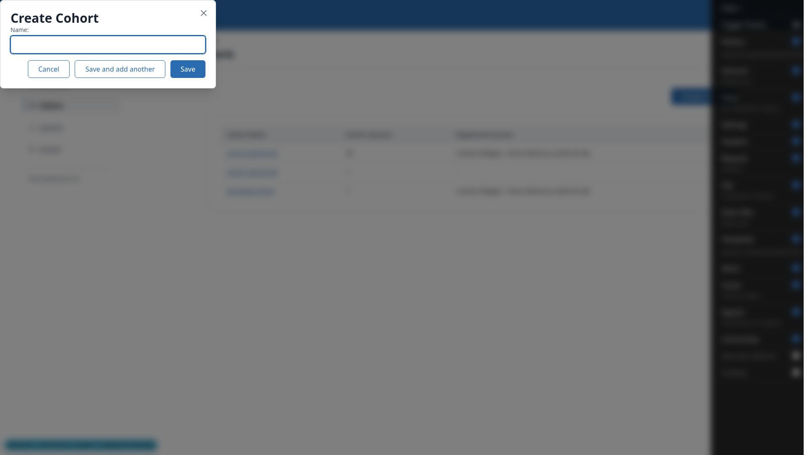
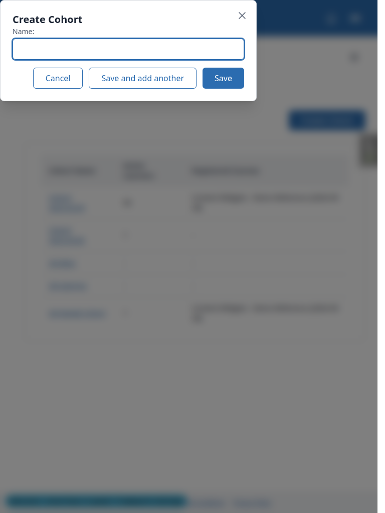

**Expected:** A centred dialog (the native `showModal()` `margin:auto` centring).

**Actual:** The dialog sits at (0,0). Computed margin is 0 (Tailwind preflight resets the UA
`margin:auto`) and position is `absolute` (the `relative` class on the `<dialog>` in
`panel_framework/partials/modal_host.html` replaces the UA `position:fixed` in the top layer).

## B2: Quick-view drawer/sheet layout and print rules lose the cascade

Manifestations: 3.1, 3.8, 3.16, 3.18, 6.2, 6.3 (desktop); 4.1 (mobile); 3.1 (tablet)

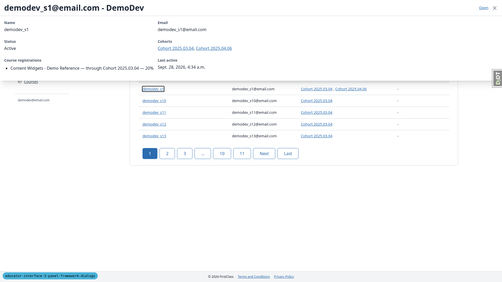
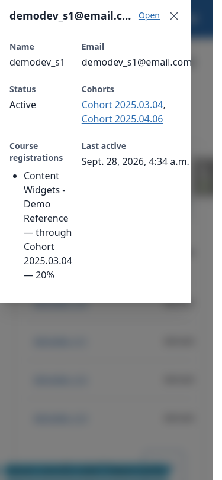
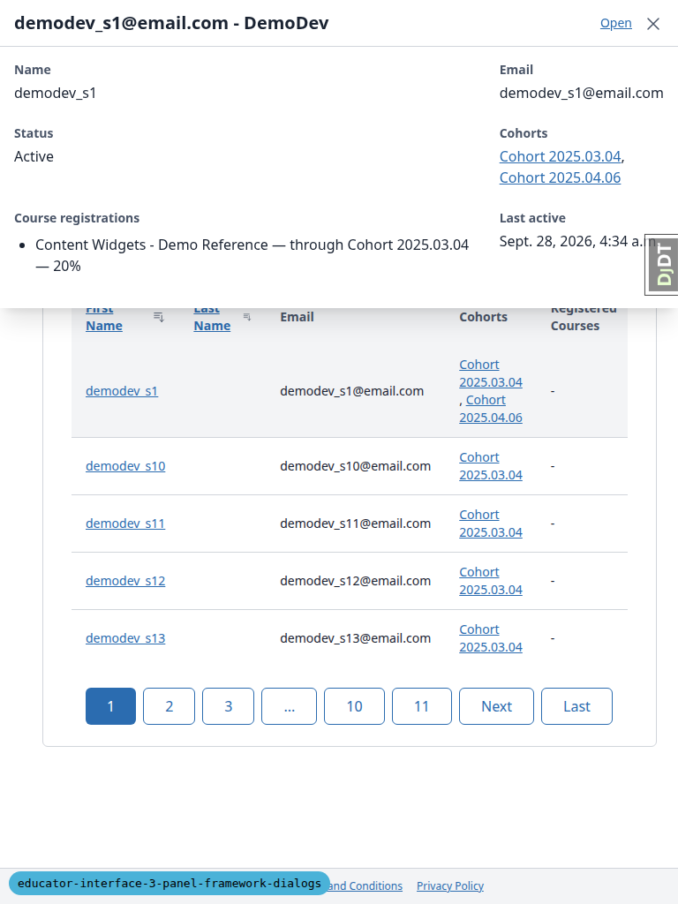
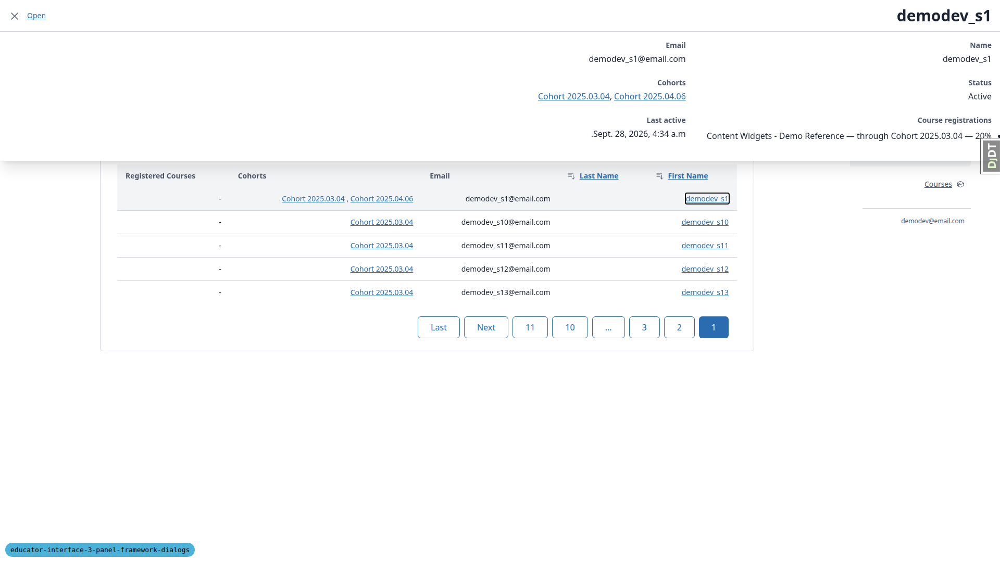

**Expected:** At ≥768px, a 30rem full-height drawer pinned to the inline-end edge (left in RTL).
Below 768px, a full-width sheet sliding up from the bottom. Hidden in print.

**Actual:** At ≥768px it renders as a full-width band across the top ~309px of the viewport,
covering the sidebar links and the organisation-switcher menu (real clicks on those elements are
intercepted by the drawer). Below 768px it is a 322px-wide box pinned top-left with the email
value overflowing its edge. In print preview it is still `display:flex`. Root causes, all in
`panel_framework/partials/quick_view_host.html`: the `w-full` utility class beats the `@layer
components` `inline-size` rule; the UA `dialog` `height:fit-content` and UA `:modal`
inset/max-width rules are not overridden; and `#quick-view[open] { display:flex }` outranks the
print rule `#quick-view { display:none }`.

## B3: Double-clicking Save submits the modal form twice

Manifestations: 1.11 (desktop)

**Expected:** Exactly one POST; every submit button disabled while the request is in flight.

**Actual:** Two POSTs fire (204 then 422 duplicate). Only one cohort ends up created, because of
the unique constraint. `modal/form.html` (and `modal/delete_confirmation.html`) use
`hx-disabled-elt="find button[type='submit']"`; htmx's `find` returns only the first match, so
clicking "Save" disables "Save and add another" and leaves "Save" itself enabled.

## B4: appModal htmx:afterSwap listener throws a TypeError on history restore

Manifestations: 1.5, 6.1 (desktop)

**Expected:** Back restores the previous page with no console errors.

**Actual:** An uncaught TypeError, "Cannot read properties of undefined (reading id)", fires at
`panel_framework/static/panel_framework/js/alpine-components.js:62`. `event.detail.target` is
undefined for the swap htmx performs during history restore, and the listener reads
`event.detail.target.id` unguarded.

## B5: Deleting from the detail page makes the deleted cohort's panels refetch and 404

Manifestations: 2.4 (desktop)

**Expected:** The delete closes the modal and navigates to the list with no failing requests.

**Actual:** The DELETE's `HX-Trigger` (`cohortChanged`) reaches the dying page's details/learners/
courses panels — all three declare `refresh_events cohortChanged` — before `HX-Location` swaps
`#main-content`. Each panel then GETs a URL scoped to the deleted pk and 404s, producing 6 console
errors before the navigation completes.

## B6: Modal button row overflows at phone width (Cancel clipped)

Manifestations: 1.1 (mobile)

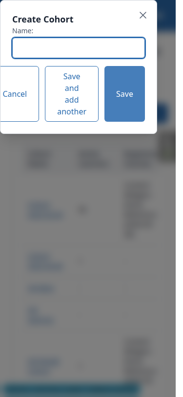

**Expected:** Buttons fit inside the 322px dialog (wrap or stack).

**Actual:** The right-aligned `c-button-group` does not wrap: "Cancel" extends roughly 20px past
the dialog's left edge, and the three buttons word-wrap to 114px tall.

## B7: Quick-view title flips between the trigger text and the frame's title

Manifestations: 3.3 (desktop)

**Expected:** One consistent drawer title for a learner.

**Actual:** While loading, and on a cached reopen, the title shown is the trigger's
`data-quick-view-title` (e.g. first name only, "demodev_s10"; empty for the empty Last Name link).
After a fetch completes, it becomes `QuickView.get_title()` = `Learner.__str__`
("demodev_s10@email.com - DemoDev"), which `#quick-view-status` also announces.

## B8: Delete cascade summary uses the plural for a count of one ("1 cohort memberships")

Manifestations: 2.3 (desktop)

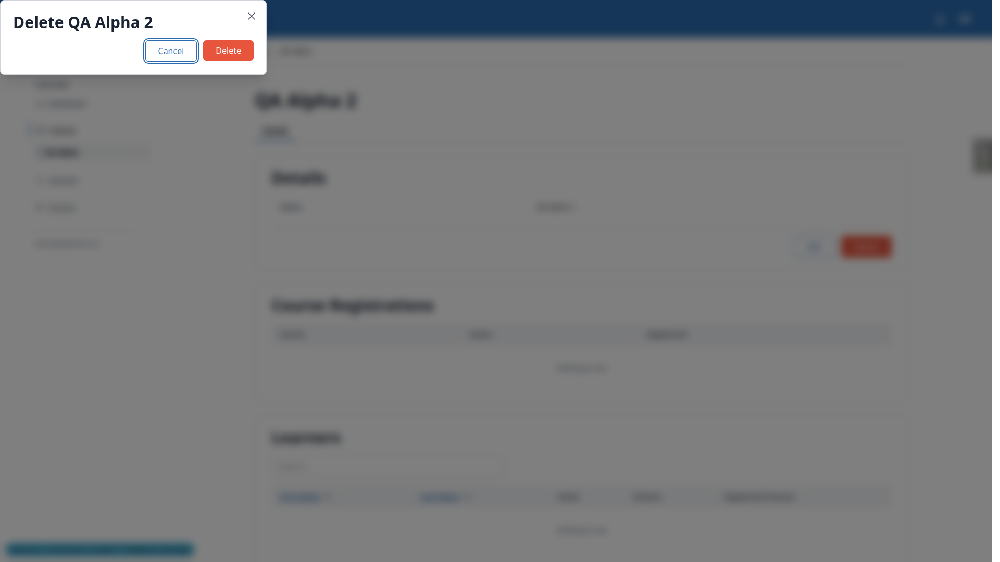

**Expected:** "1 cohort membership".

**Actual:** `DeleteAction.get_cascade_summary` in `panel_framework/actions.py` always uses
`verbose_name_plural`, regardless of count. The same code exists on `main`.

## Bug status

- B1: **FIXED** (commit: 8a342d0b). Panel modal (#app-modal) renders pinned to the top-left corner instead of centred.
- B2: **FIXED** (commit: 086609f6). Quick-view drawer/sheet layout and print rules lose the cascade.
- B3: **FIXED** (commit: 8f65d17e). Double-clicking Save submits the modal form twice.
- B4: **UNRESOLVED**. appModal htmx:afterSwap listener throws a TypeError on history restore (reason: fix budget exhausted this run).
- B5: **UNRESOLVED**. Deleting from the detail page makes the deleted cohort's panels refetch and 404 (reason: needs a decision on how a delete's domain event should treat the panels of the page it navigates away from).
- B6: **UNRESOLVED**. Modal button row overflows at phone width, so Cancel is clipped (reason: fix budget exhausted this run).
- B7: **UNRESOLVED**. Quick-view title flips between the trigger text and the frame's title (reason: needs a decision on what the learner drawer title should be: the learner's name or `Learner.__str__`, which the learner page h1 also uses).
- B8: **UNRESOLVED**. Delete cascade summary uses the plural for a count of one, "1 cohort memberships" (reason: fix budget exhausted this run).

### Re-verification of the fixes

- **B2:** at 1920px the drawer is 480px wide, flush right and full height. At 768px it is flush right. With `dir=rtl` it is flush left. In print media it is `display: none`. A real sidebar click works with the drawer open. At 375px the sheet is anchored to the bottom.
- **B1:** the create modal is centred (dx = dy = 0) at 1920px, 768px and 375px. The edit and blocked-delete modals are centred too.
- **B3:** a double-click on Save sends one POST. Both submit buttons stay disabled until the response arrives.
- The fixers' test runs:
  - B1 and B3: the full `uv run pytest` suite passed (5210 tests, then 5212).
  - B2: its full run with Playwright hit psycopg connection timeouts on the shared local pgbouncer. The non-Playwright suite and the panel_framework Playwright suite both passed.
  - Removing `scrollbar-gutter: stable` from the modal scroll lock (part of B1) may shift content on pages that have a scrollbar. The pages tested here were short, so no shift was seen.

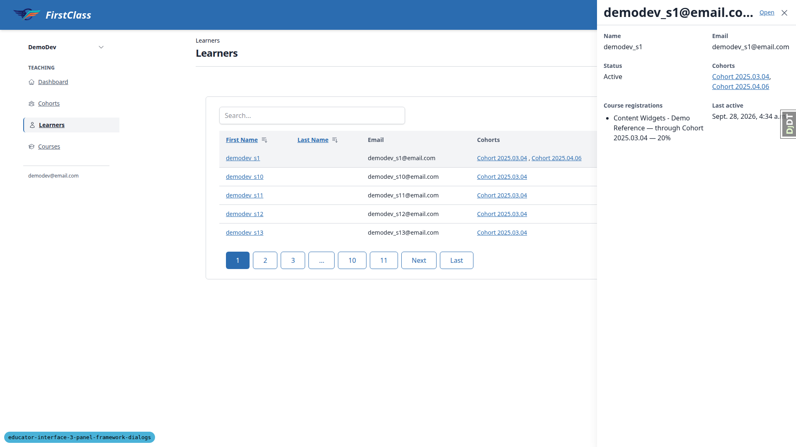
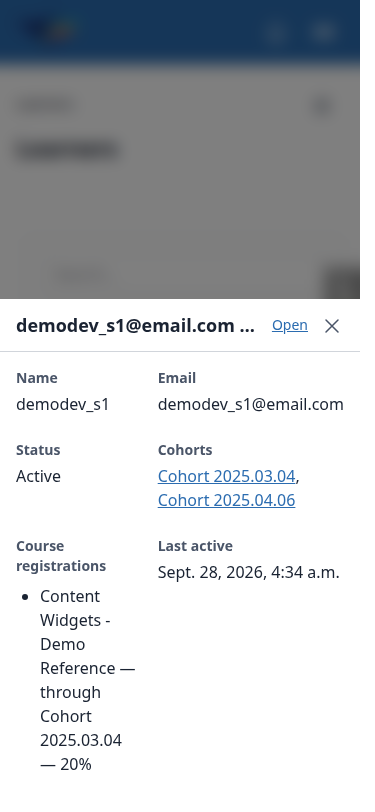
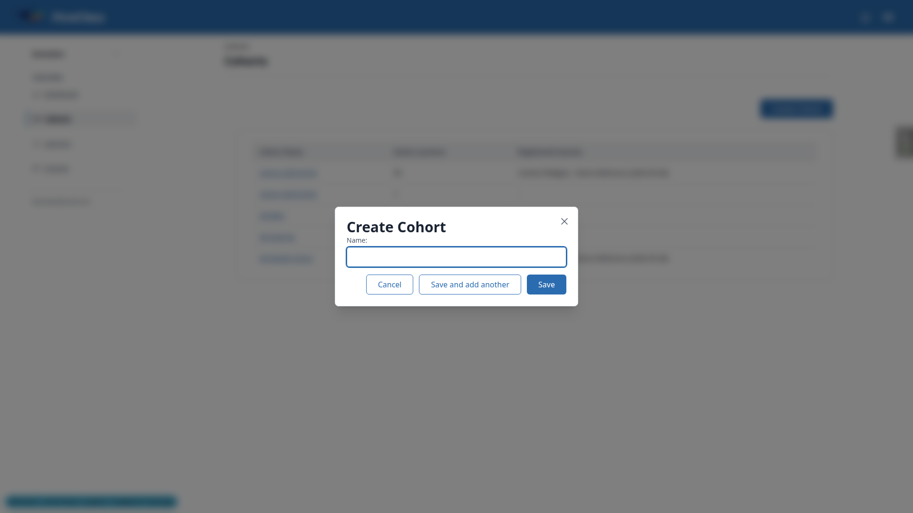
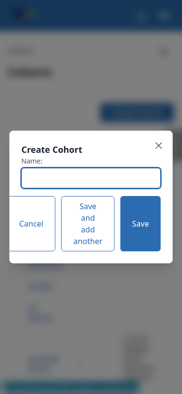

## Test results

| Test | Viewport | Status | Note |
|------|----------|--------|------|
| 1.1 | desktop | fail | Modal pinned top-left, not centred (B1). |
| 1.2 | desktop | pass | 422 error summary focused; Django dup-name wording leaks field names. |
| 1.3 | desktop | pass | "Save and add another" reopens blank form; list updates via one GET. |
| 1.4 | desktop | pass | Save navigates via HX-Location; title stays "DemoDev — DemoDev" (pre-existing). |
| 1.5 | desktop | fail | Back restores list but throws a TypeError (B4). |
| 1.6 | desktop | pass | Esc closes, focus returns; Space reopens. |
| 1.7 | desktop | pass | Esc on dirty form shows discard prompt correctly. |
| 1.8 | desktop | pass | Esc closes with no prompt when form matches original. |
| 1.9 | desktop | pass | Backdrop click does nothing on dirty form. |
| 1.10 | desktop | pass | Second Esc did not close (safer than spec expects; not a defect, browser-dependent). |
| 1.11 | desktop | fail | Double-click Save sends two POSTs (B3). |
| 2.1 | desktop | pass | Edit modal opens prefilled and focused. |
| 2.2 | desktop | pass | Save renames h1 live; three panels refetch per spec; breadcrumb stays stale. |
| 2.3 | desktop | fail | Delete dialog correct; cascade text pluralised wrong for count of 1 (B8). |
| 2.4 | desktop | fail | Delete navigates correctly but dying page's panels 404 first (B5). |
| 2.5 | desktop | pass | Blocked-delete dialog explains progress record; backdrop closes it. |
| 2.6 | desktop | pass | Educator sees Delete only; edit action URL 403s with an empty body. |
| 2.7 | desktop | pass | Direct fragment GET returns bare fragment, no error. |
| 3.1 | desktop | fail | Content correct; drawer is a full-width top band, not a right-edge panel (B2). |
| 3.2 | desktop | pass | Content/title replace; aria-expanded toggles correctly. |
| 3.3 | desktop | fail | Reopen from cache shows trigger-text title, not the frame title (B7). |
| 3.4 | desktop | pass | Esc closes, focus returns to link. |
| 3.5 | desktop | pass | Ctrl/middle-click open a new tab; drawer stays closed. |
| 3.6 | desktop | pass | Open navigates to the learner page. |
| 3.7 | desktop | pass | Cohort link in drawer navigates to the cohort page. |
| 3.8 | desktop | pass | Cohort drawer content correct (same layout defect as 3.1). |
| 3.9 | desktop | pass | Cohort drawer also opens from a panel link. |
| 3.10 | desktop | pass | Sort refetches table; drawer stays open and in sync. |
| 3.11 | desktop | pass | Blocked request shows error + Retry; Retry recovers. |
| 3.12 | desktop | pass | Staleness via cohortChanged event works as specified. |
| 3.13 | desktop | pass | Modal opens above a cohort drawer (plan's "learner drawer" is stale on this page). |
| 3.14 | desktop | pass | Direct __quick-view URL redirects to the full page. |
| 3.15 | desktop | pass | Out-of-scope / bad-uuid quick views 404 for the educator. |
| 3.16 | desktop | fail | Drawer still `display:flex` under print media (B2). |
| 3.17 | desktop | pass | Reduced motion removes transitions. |
| 3.18 | desktop | fail | RTL edge pinning can't be observed; still the top-band layout (B2). |
| 6.1 | desktop | pass | Sidebar inert behind modal (expected); programmatic nav closes modal; B4 fires on Back. |
| 6.2 | desktop | fail | Drawer band intercepts a real sidebar click (B2); programmatic nav works. |
| 6.3 | desktop | fail | Drawer band intercepts an org-switcher click (B2); programmatic switch works. |
| 6.4 | desktop | pass | Org switcher opens/closes; desktop sidebar persistent. |
| 4.1 | mobile | fail | Sheet is modal but renders top-left, not a full-width bottom sheet (B2). |
| 4.2 | mobile | pass | Back closes the sheet, stays on the learners page. |
| 4.3 | mobile | pass | Close unwinds the history entry correctly. |
| 4.4 | mobile | pass | Backdrop tap does nothing; Esc closes. |
| 4.5 | mobile | pass | Open navigates; Back returns to the list with no sheet. |
| 4.6 | mobile | pass | Widen/narrow converts sheet↔drawer with no new request. |
| 4.7 | mobile | pass | Sheet and mobile nav don't fight. |
| 4.8 | mobile | skip | Needs a real iOS Safari device/simulator; not available to Playwright MCP. |
| 1.1 | mobile | fail | Modal pinned top-left; button row overflows and clips Cancel (B1 + B6). |
| 6.4 | mobile | pass | Mobile nav panel opens/closes correctly. |
| 3.1 | tablet | fail | Non-modal drawer at 768px but still a top band, not right-edge (B2). |
| 1.1 | tablet | fail | Modal pinned top-left at 768px too (B1). |
| 6.4 | tablet | pass | Mobile nav toggle used at tablet width; no horizontal overflow. |
| 5.1-5.3 | desktop | skip | No VoiceOver/NVDA available; DOM proxy checks only (aria-labelledby, role=alert focus, status text). |

## General notes

- Several plan steps are wrong or stale against the current implementation:
  - §3.1: Space does not activate an `<a>` quick-view trigger — Enter does. The plan step
    expecting Space to toggle it is incorrect for an anchor element.
  - §2.6: the literal edit action URL in the plan (`.../__actions/edit`) is missing the
    `__tabs/details` segment; as written it 404s. The real URL is
    `.../__tabs/details/__panels/details/__actions/edit`, and it 403s with an empty body.
  - §2.2: "one GET of the panel region" undercounts — per spec line 81, every panel on the
    cohort page refreshes on `cohortChanged`, so three GETs fire (details, learners, courses),
    not one.
  - §3.13: a "learner drawer on the cohorts page" is not possible — that page only exposes
    cohort quick-view triggers, so a cohort drawer was used instead to verify the modal-above-
    drawer behaviour.
  - §6.1: the sidebar is inert behind a native modal (`showModal()`), so a real mouse click
    cannot reach it. The step was driven programmatically (dispatching the navigation) instead
    of via a real click.
  - §1.10: the second immediate Esc did not close the dialog in this Chromium build (the prompt
    stayed open, text was kept). The plan expects the CloseWatcher limit to close it; staying
    open is the safer outcome and not treated as a defect.
- After an edit rename (§2.2), the breadcrumb still reads the old name — the spec only specifies
  updating `#instance-title`, so this is a spec gap rather than a clear-cut bug.
- The cohort-page document title is "DemoDev — DemoDev" (no cohort name), both on a direct load
  and after an in-place rename via the modal. Pre-existing.
- Last Name links are empty `<a>` elements when a learner has no last name (seen while quick-view
  testing); reproducible on `main` too.
- The duplicate-cohort-name validation error uses Django's default wording, "Cohort with this
  Site, Organisation and Name already exists.", which leaks the internal field set (Site,
  Organisation) into user-facing copy.
- The 403 response for the edit action has an empty body, so Chrome renders its own
  `ERR_HTTP_RESPONSE_CODE_FAILURE` page instead of a site-styled 403 page.
- The learner quick-view title equals the learner page's `<h1>` (`Learner.__str__`), so it reads
  as an email-plus-site string rather than a friendlier name — related to, but distinct from, B7.
- This run added a new untracked data-helper command,
  `freedom_ls/qa_helpers/management/commands/qa_create_educator_progress_targets.py`, used to
  seed the course-progress record needed for §2.5.

status: ok · reason: 8 bugs, 3 fixed, 5 unresolved; report rendered, screenshots verified
