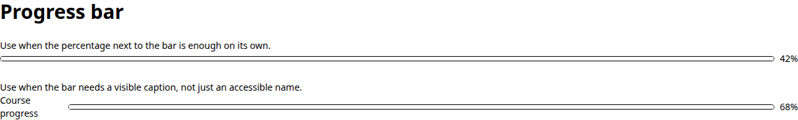
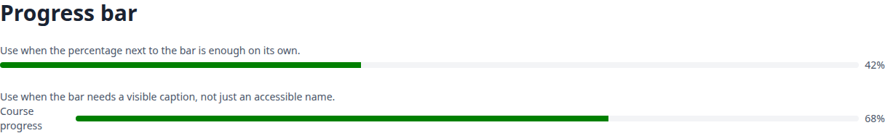
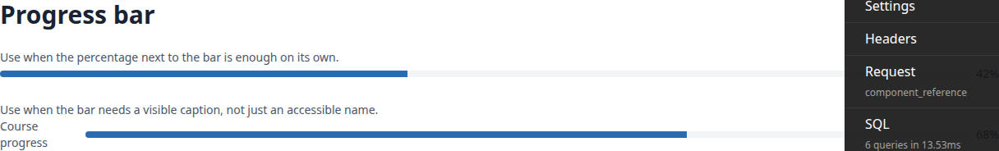
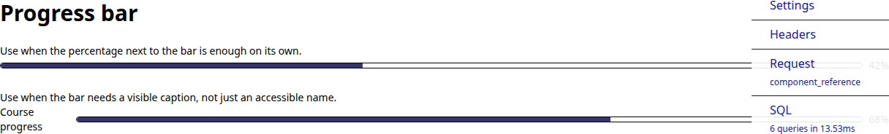

# Frontend QA report: panel framework components

## Methodology

Manual pass with Playwright MCP against the plan in `3. frontend_qa.md`, at three viewports:
desktop 1920x1080, mobile 375x812, tablet 768x1024. Screenshots were collected into
`screenshots/` beside this report; every image referenced below exists in that folder.

Seed data: a non-staff learner (pk 72) and a course registration on Cohort 2025.03.04 were
added by the `fls-dev:qa-data-helper` agent, which also loaded the demo courses into the
DemoDev site. The `<b>Escaped</b> Cohort` and `QA Cohort Saved` cohorts were created through
the UI during Test 3. Cohort 2025.03.04 was renamed to "Cohort 2025.03.04 renamed" in Test 4
and left that way.

## Diff scoping

Class: **FULL**. `changed_files` is empty because the git diff name listing was refused by the
permission classifier; the class was instead set to FULL from the branch commits (new cotton
components, templates and a reference page) as the safe default. Everything in the plan ran.

## Smoke gate

Status: **pass**. Pages checked: `/`, `/panel-framework/components/`. No failure recorded.

## Results by test

| Test | Viewport | Status | Note |
|---|---|---|---|
| 1 | desktop | FAIL | Both toolbar examples render a search field named `q`, giving a duplicate `id=search-q`; the applied-toolbar's search input ends up with no accessible name. Everything else (sections, badge contrast, decorative trend icons, avatar tints, cards, progress, empty state, skeletons) is correct, no console errors. |
| 2 | desktop | pass | Cohorts, Learners, Courses and Dashboard each have one `h1` under the breadcrumbs; Create Cohort sits on the `h1` row; tables sit in white 8px-radius bordered cards with no shadow. |
| 3 | desktop | pass | "Save and add another" refreshes the table in place with no reload; plain Save (design pre-existing) redirects to the new cohort page instead — see General notes. |
| 4 | desktop | pass | Cohort name is the `h1`; tab bar and Details card render as specified; Edit updates the `h1` and details in place with no reload; Delete's confirmation was correctly refused (50 course progress records). Plan mismatches noted, not defects — see General notes. |
| 5 | desktop | pass | `h1` shows the literal `<b>Escaped</b> Cohort` and later the literal ``, no markup rendered, no dialog fired. |
| 6 | desktop | pass | Anonymous and non-staff-learner requests to `/panel-framework/components/` both redirect to `/admin/login/?next=...`; staff session unaffected. |
| 7 | mobile | pass | No page-level horizontal scroll; tab label stays on one line; details dl is a single column; attention-row tap navigates via the stretched link; Message action hidden with a trailing arrow. |
| 8 | tablet | pass | Cohorts, cohort page and reference page all render with header actions beside the title, tabs on one line, details grid in columns, no overflow (scrollWidth 768 throughout). |
| 9 | desktop | pass | No learner page rendered a chip naturally, so chip spans for every variant were injected into the learner home page and measured against the live CSS — see General notes. success/warning/error/info/muted read at 6.8-9.3:1 contrast; primary/secondary are brand colour on light brand tint. |
| 10 | desktop | FAIL | Badges and filter toggles behave correctly under forced colours and on keyboard navigation, but the progress bar shows only its border under forced colours and a browser-default green fill in normal mode. |

## B1: Progress bar fill rule is dropped in Chromium

**Manifestations:** Test 10, desktop.

**Screenshots:**

**Expected:** The fill is `--color-primary` normally and `Highlight` under `forced-colors: active`, so the bar shows a distinguishable fill in both modes.

**Actual:** `panel-progress-bar.html` groups `::-webkit-progress-value` with `::-moz-progress-bar` in one selector list. Chromium rejects the whole rule because it does not know the `-moz` pseudo-element, so neither fill rule exists in the parsed stylesheet: the bar shows the browser-default green fill normally and no fill at all under forced colours (border only).

## B2: Duplicate search-q id leaves the applied-toolbar search field unlabelled on the reference page

**Manifestations:** Test 1, desktop.

**Screenshots:**

**Expected:** Every example search input has a unique id and its own associated label.

**Actual:** The toolbar-default and toolbar-applied examples both call `c-panel-search-field` with `name=q`, so both inputs get `id=search-q`. Both labels point at the first input, which ends up with two labels; the second input has no accessible name.

## Bug status

- **FIXED** (commit: bd2ea356) — Progress bar fill rule is dropped in Chromium. Re-verified in the browser: the fill is primary blue normally and a Highlight fill under forced colours.

  
  

- **UNRESOLVED** — Duplicate search-q id leaves the applied-toolbar search field unlabelled on the reference page (reason: the fixer was blocked because the dev database on 127.0.0.1:6543 dropped when its test run started, so RED could not be confirmed; its test edits were discarded. The intended fix is `name="q-applied"` on the toolbar-applied example in `_examples.html`.)

The dev database became unreachable twice during this run, each time while a full pytest run was going. The dev server hung and had to be restarted on a new port (8438, then 8508).

## General notes

- **Test 3 — Save vs Save and add another:** the plan says Save should refresh the list in
  place; that behaviour actually belongs to "Save and add another" (verified: row appears with
  no reload, URL unchanged). Plain Save closes the modal and HX-redirects to the new cohort's
  page, via `CreateAction.form_valid`, a pre-existing design choice, not something introduced on
  this branch.
- **Tests 4 and 7 — Edit/Delete placement and single-tab TabSet:** Edit and Delete are the
  Details panel's own actions (`CohortDetailsPanel.get_actions`, unchanged on this branch), so
  they sit in the Details card's footer rather than the page-header actions slot, which is
  empty. The only TabSet exercised (cohorts) has a single tab, so step 6 of Test 4 (switching
  tabs, Back button) could not be exercised.
- **Test 9 — chips measured by injection:** no learner-facing page in the current demo content
  rendered a status chip naturally (no enrolments; `/courses/` cards carry no access badge), so
  chip spans for every variant were injected into the learner home page and measured against the
  live CSS rather than observed in situ.
- **Per-instance progress-bar `<style>` duplication:** independent of bug B1, `panel-progress-bar.html`
  emits its `<style>` block once per instance rather than once per page — 6 copies on the
  reference page that were counted during Test 10.
- **chip-neutral unstyled:** the `chip-neutral` variant (used by reports) has no style of its
  own. This is a pre-existing gap outside this branch and is not counted as a bug here.
- **Pre-step rebase hook:** the pre-step rebase's front-end-check scoping command was refused by
  the permission classifier, so that hook was skipped. The full QA pass in this report covered
  the same pages that hook would have checked.

status: ok · reason: 2 bugs — 1 fixed, 1 unresolved; report rendered, screenshots verified
