# Frontend QA report: educator-interface-4-panel-framework-components

Test plan: `3. frontend_qa.md` (same directory).

## Methodology

- Manual walk-through with Playwright MCP at three viewports: desktop 1920x1080, mobile 375x812, tablet 768x1024.
- Screenshots were collected into `screenshots/` beside this report. Every image referenced below exists there.
- Image compression ran OK. Nothing is over 1MB.
- Findings were recorded in a scratch file as the walk-through went, and this report is rendered from it.

## Diff scoping

- Class: **FULL**
- Changed files:
  - `freedom_ls/panel_framework/templates/cotton/*.html`
  - `freedom_ls/panel_framework/templates/panel_framework/**`
  - `freedom_ls/educator_interface/templates/educator_interface/interface.html`
  - `freedom_ls/icons/templates/cotton/icon.html`
  - `tailwind.components.css`
  - `config/urls.py`
  - `freedom_ls/panel_framework/*.py`
- Skipped: nothing. Desktop, mobile and tablet all ran.

## Smoke gate

- Outcome: **pass**
- Pages checked: `/`, `/panel-framework/components/`
- No failure URL or reason.

## Results table

| Test | Viewport | Status | Note |
|---|---|---|---|
| 1 | desktop | fixed | Sections, badges, avatars, cards, toolbar, empty state and skeleton are fine. The progress bar in stat-tile-with-progress was 0px wide (bug B1). Fixed in `10dee49e`; the bar is now 1146px wide. |
| 1-tile-progress | desktop | fixed | Close-up of the Average progress tile before the fix: only a stray "68%" showed and the `<progress>` was 0px wide (B1). Fixed in `10dee49e`. |
| 2 | desktop | pass | Cohorts, Learners, Courses and Dashboard each have a single main h1. Create Cohort sits on the same row as the Cohorts h1. |
| 3 | desktop | pass | "Save and add another" refreshed the table in place via `cohortCreated`. Plain Save does an HX-Redirect by design. |
| 4 | desktop | pass | In-place edit and cancelled delete work. Edit/Delete are in the Details card footer, not the page header. |
| 4.6 | desktop | skip | Tab switching and Back are not testable: `CohortTabSet` has one "Details" tab. |
| 5 | desktop | pass | HTML and `<script>` in the cohort name render as literal text. No script element is created and no alert fires. |
| 6 | desktop | pass | Anonymous and non-staff users are redirected to admin login. Staff get a 200. |
| 10 | desktop | pass | Under forced-colors, badges and progress bars keep borders, and focus rings and Message link names are correct. |
| 10-focus | desktop | pass | Applied-filter toolbar shows a focus ring on the remove-filter x button. |
| 9 | desktop | pass | Chip colours were checked on the classes: pale tints with dark text. No learner page shows a Complete/In progress chip. |
| 7.1-7.3 | mobile | pass | Cohort page at 375px: no horizontal scroll, tabs on one line, details grid stacked. |
| 7.4-7.6 | mobile | pass | Reference page has no overflow. Attention rows are tappable through the stretched link. Header actions and stats stack under the title. |
| 7-tile-progress | mobile | fixed | Same defect (B1): `<progress>` was 0px wide at 375px. Fixed in `10dee49e`; rechecked at 375px: 273px wide with a 68% fill, no page overflow. |
| 8 | tablet | pass | Cohorts h1 and Create Cohort share a row. Cohort page has 3-column details grid and one-line tabs. Reference page has no overflow. |
| 8-tile-progress | tablet | fixed | Same defect (B1): `<progress>` was 0px wide at 768px. Fixed in `10dee49e`; rechecked at 768px: 650px wide with a 68% fill, no page overflow. |

### Test evidence

- Test 1: 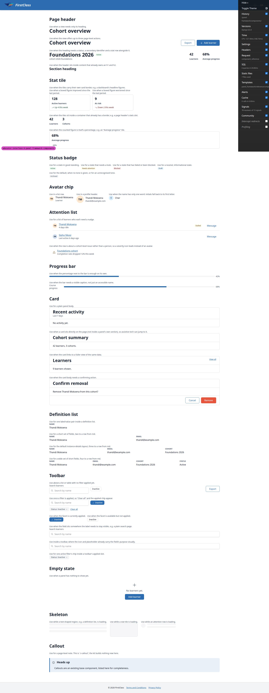
- Test 1-tile-progress: 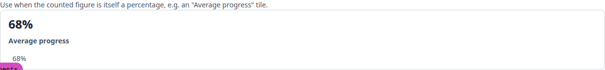
- Test 2: 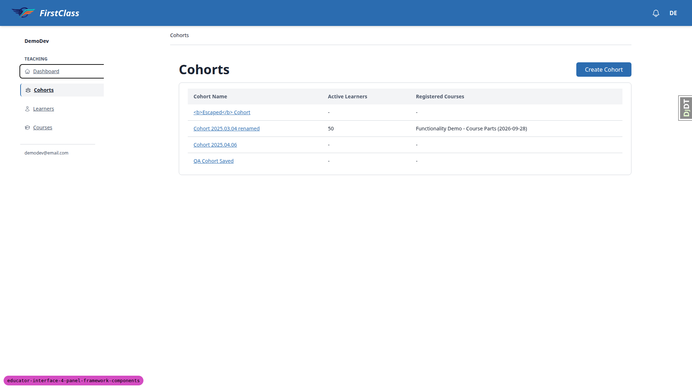
- Test 3: 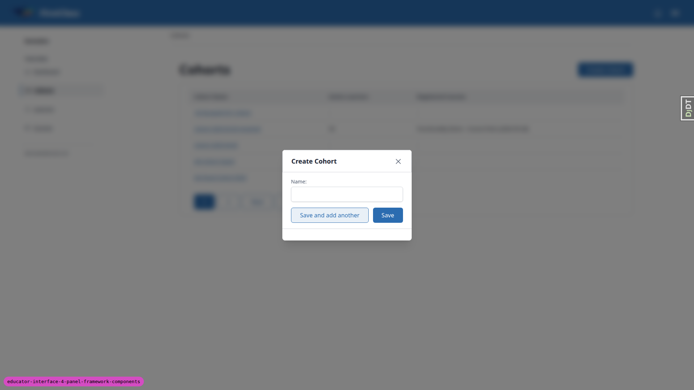
- Test 4: 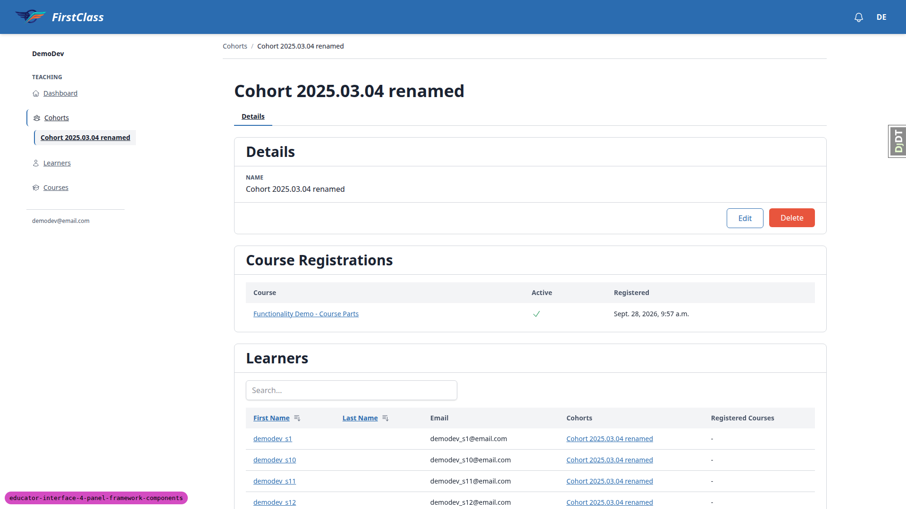
- Test 5: 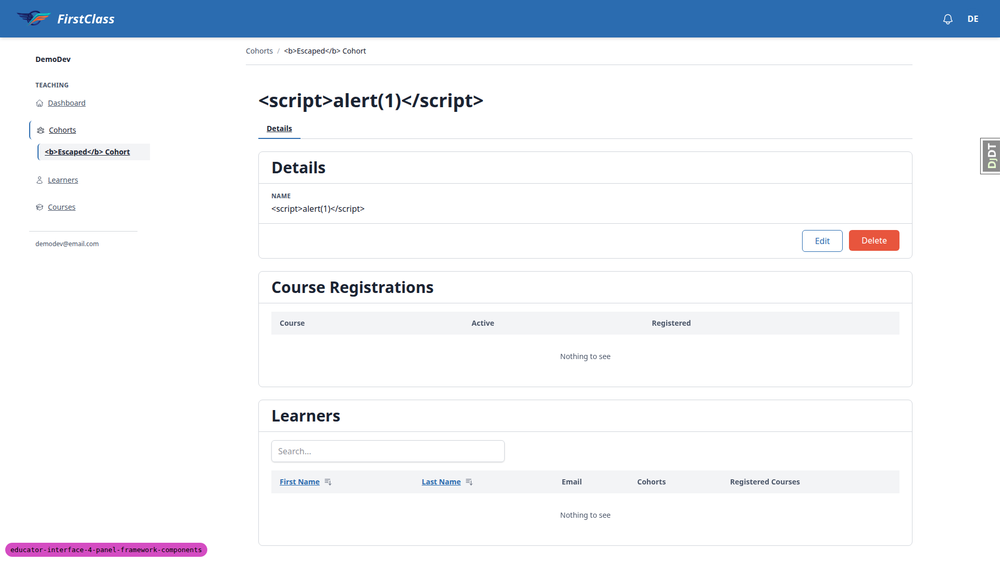
- Test 6: 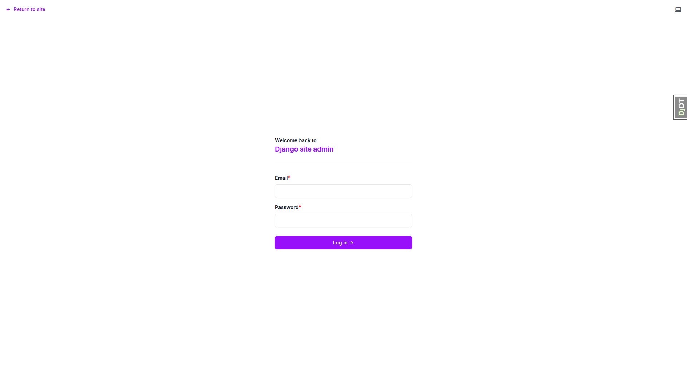
- Test 10: 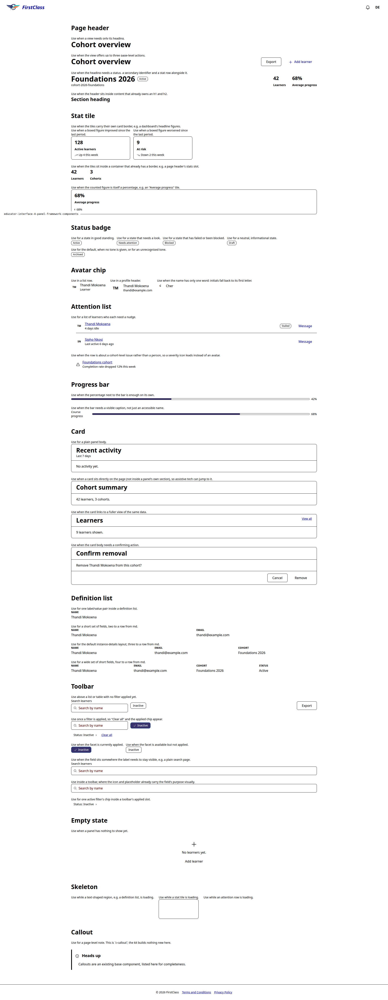
- Test 10-focus: 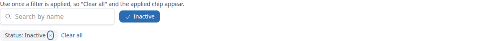
- Tests 7.1-7.3 (mobile): 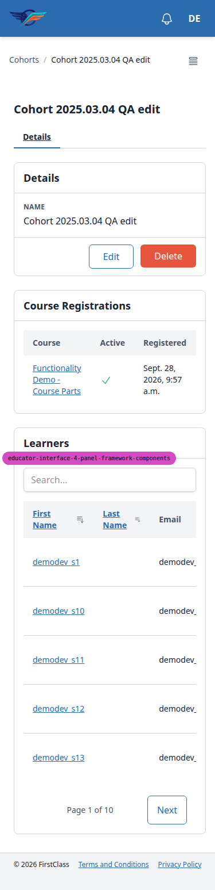
- Tests 7.4-7.6 (mobile): 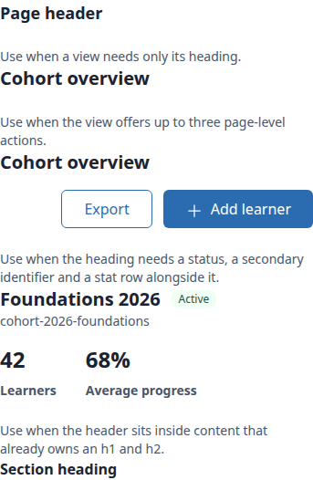
- Test 8 (tablet, Cohorts list): 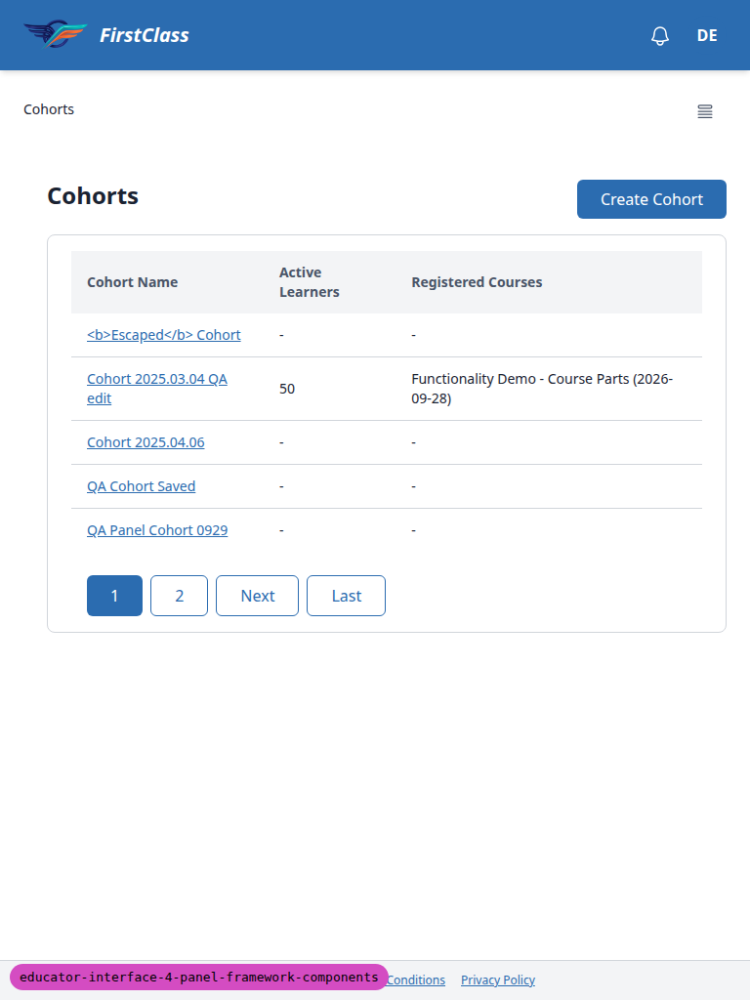
- Test 8 (tablet, cohort page): 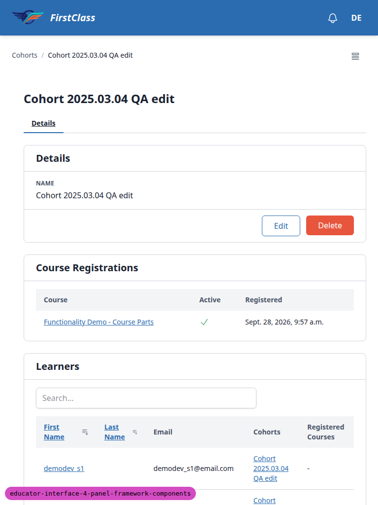
- Test 8 (tablet, reference page): 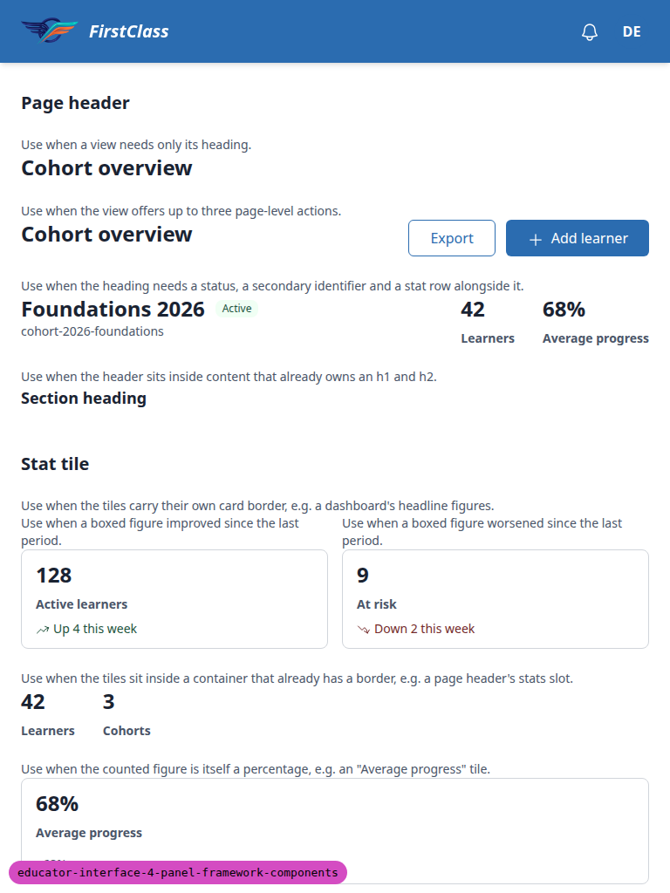

## Bugs

### B1: Progress bar embedded in a stat tile collapses to zero width

Manifestations:
- Test 1, desktop
- Test 7 (7-tile-progress), mobile
- Test 8 (8-tile-progress), tablet

Screenshots:

**Expected:** The "Average progress" stat tile (`#stat-tile-with-progress`) shows a full-width filled progress track under the label with the percentage beside it, as the standalone progress bar examples do.

**Actual:** The `<progress>` element renders 0px wide. Only a stray "68%" shows under the label. The recorded cause is the global base-layer `dl` rule in `tailwind.components.css:69`, which applies `items-baseline`. `panel-stat-tile.html`'s `<dl class="flex flex-col ...">` never resets align-items, so its slot `<dd>` shrinks to content width (35px) and the `w-full` bar collapses.

## Bug status

- **FIXED** (commit: 10dee49e) — Progress bar embedded in a stat tile collapses to zero width

The fix adds `items-stretch` to the stat tile's `<dl>` in `panel-stat-tile.html`, with a new Playwright test (`test_stat_tile_progress_width.py`). Re-verified in the browser at all three widths. The `<progress>` shows a 68% fill at each: 1146px wide at 1920px, 650px at 768px and 273px at 375px. Neither page overflows at 768px or 375px. The page header's stat row is unchanged.

Desktop (1920px):

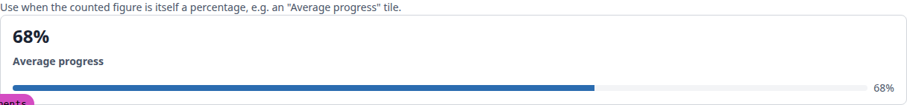
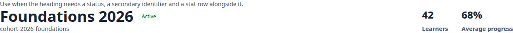

Tablet (768px):

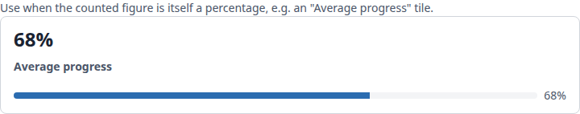

Mobile (375px):

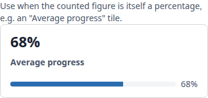

## General notes

Observations only, not bugs.

- The reference page has no untitled panel-card example, so the "no header strip" case was not checked visually. The component omits the header when the title is empty.
- Plain Save on Create Cohort redirects to the new cohort page by design (`actions.py:166`). Only "Save and add another" does the in-place list refresh. The test plan wording ("modal closes, row appears") matches only that path.
- Cohort Edit/Delete are `CohortDetailsPanel` actions (`views.py:231`), so they render in the Details card footer, not the page header. `CohortInstanceView` has no instance-level actions. This is unchanged by this branch.
- Test 4.6 was skipped. No educator instance view has more than one tab, and `CohortTabSet` has a single "Details" tab. This is configuration, not seed data. The branch's playwright test `test_instance_title_htmx.py` covers it only indirectly.
- After an in-place rename, the breadcrumb and sidebar entry keep the old cohort name.
- Instance pages' document title is "DemoDev — DemoDev", with no cohort name.
- Under forced-colors, `.btn-primary` and `.btn-error` buttons (Add learner, Remove) have no border and read as plain text. This is base button styling, outside the plan.
- The admin login page title reads "Log in | None" (admin site_title unset, pre-existing), and `/favicon.ico` returns 404 there.
- No learner page currently renders a Complete/In progress chip, so chip colours were checked on the classes directly. Learner pages render `c-chip` only as access badges for anonymous visitors.
- Test data created this run:
  - Cohorts "QA Panel Cohort 0929" and "QA Panel Cohort Another".
  - "Cohort 2025.03.04 renamed" is now named "Cohort 2025.03.04 QA edit".

status: ok
reason: 1 bug — 1 fixed, 0 unresolved; report rendered, screenshots verified
