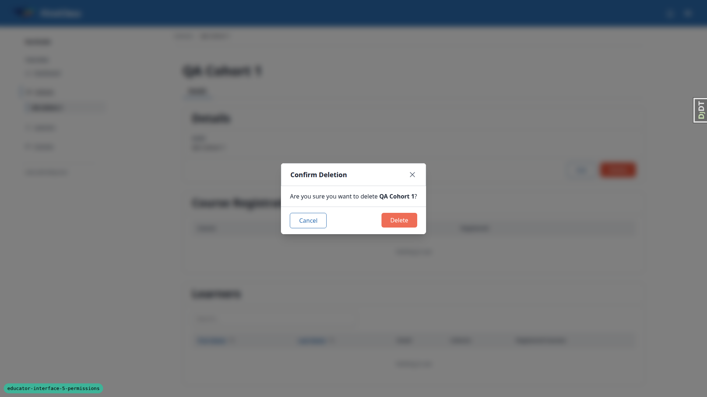
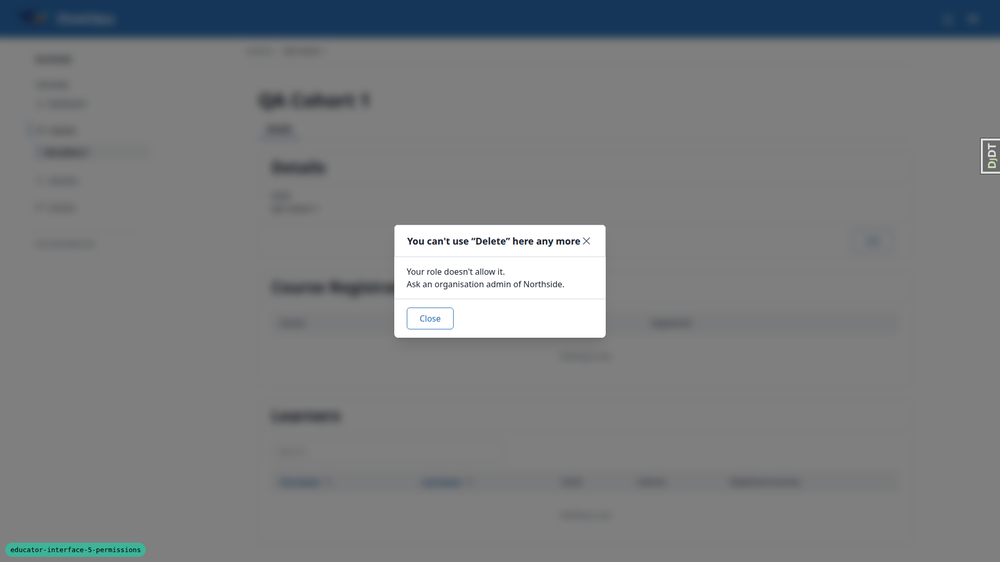

# Frontend QA report: educator-interface-5-permissions

## 1. Methodology

Manual browser QA via the Playwright MCP, against a dev server running this branch, at three
viewports: 1920x1080 (desktop), 375x812 (mobile) and 768x1024 (tablet). The database was seeded
with the §0.2 scenario (Northside, Southside, their cohorts, learners and the eight personas) by a
`qa_helpers` management command. Grants were changed mid-test from the Django shell, using
`remove_object_role` and direct `OrganisationMember.is_active` flips, per §0.2 and §6-§7 of the
test plan.

Screenshots were collected into `screenshots/` beside this report; every image referenced below
exists there. That directory also holds Playwright accessibility-snapshot `.yml` files and
browser console `.log` files from the same run, kept for reference but not embedded here.

## 2. Diff scoping

Scope class: **FULL**, triggered by `freedom_ls/base/static/base/js/alpine-components.js` (the
403/422 swap logic shared across the educator interface) and
`freedom_ls/panel_framework/templates/panel_framework/partials/action_denied.html` (the denial
modal template), alongside `educator_interface/views.py`, `learner_management/capabilities.py`,
`panel_framework/views.py` and `reports/views.py` — 89 changed files in total. A change at this
level touches every page that can trigger a 403 or 422 swap, so the full plan ran: desktop,
mobile and tablet, every section. Nothing was skipped.

## 3. Smoke gate

**Passed.** `/`, `/educator/`, and `/educator/organisations/northside/cohorts` all loaded cleanly
before the scripted run began.

## 4. Results table

### §1 The organisation admin (golden path)

| Test | Viewport | Status | Note |
|---|---|---|---|
| 1.1 | desktop | pass | `/educator/` redirects to Northside dashboard; switcher shows a static label (single org). |
| 1.2 | desktop | pass | Cohort A, B, Empty listed; Create Cohort button present; create modal opens. |
| 1.3 | desktop | pass | QA Cohort 1 created, redirected to detail page, appears on list. |
| 1.4 | desktop | pass | Duplicate name gives a 422, modal stays open with a field error, not the denial modal. |
| 1.5 | desktop | pass | Edit and Delete present on Cohort A; rename updates H1 and persists. |
| 1.6 | desktop | pass | Cohort Empty delete: confirmation names nothing that cascades; redirects to list, Cohort Empty gone. |
| 1.7 | desktop | pass | Cohort A delete blocked, reason given, no live delete button. |
| 1.8 | desktop | pass | `/educator/organisations/southside/dashboard` 404s for this persona. |
| 1.9 | desktop | pass | Course detail shows Cohort A and Cohort B registrations, learner.a1 and learner.b1 direct registrations. |

### §2 The cohort admin

| Test | Viewport | Status | Note |
|---|---|---|---|
| 2.1 | desktop | pass | `/educator/` redirects to Northside; switcher static label. |
| 2.2 | desktop | pass | Cohort A only; no Create Cohort element in the DOM at all. |
| 2.3 | desktop | pass | No Edit/Delete; learners panel lists a1, a2 only. |
| 2.4 | desktop | pass | Learners list a1, a2 only; Cohorts cell names Cohort A only. |
| 2.5 | desktop | pass | Cohort B detail 404s. |
| 2.6 | desktop | pass | learner.b1 and learner.none detail each 404. |
| 2.7 | desktop | pass | Course detail: Cohort A only in registrations, learner.a1 only direct — no leak of Cohort B / learner.b1. |
| 2.8 | desktop | pass | Hand-made POST to `__actions/create_cohort` returns 403 (full HTML page, no HX-Request); no Sneaky cohort after reload. |
| 2.9 | desktop | pass | `/educator/organisations/southside/cohorts` 404s. |

### §3 The cohort viewer

| Test | Viewport | Status | Note |
|---|---|---|---|
| 3.1-3.7 | desktop | pass | Identical to cohort.admin's read-only surface: Cohort A only, no Create/Edit/Delete, B/b1/none all 404, course detail shows Cohort A and learner.a1 only. |

### §4 The site admin

| Test | Viewport | Status | Note |
|---|---|---|---|
| 4.1 | desktop | pass | site.admin (no OrganisationMember row) lands on DemoDev; switcher lists DemoDev, Northside, Southside. |
| 4.2 | desktop | pass | Switch to Southside works; Cohort S, Create Cohort, Edit and Delete all present. |
| 4.3 | desktop | pass | QA Cohort Site created in Southside. |
| 4.4 | desktop | pass | Northside: every cohort; learners a1, a2, b1, none all listed. |

### §5 Superuser regression

| Test | Viewport | Status | Note |
|---|---|---|---|
| 5 | desktop | pass | Switcher lists all 3 orgs; every cohort, Create, Edit/Delete; created QA Cohort Super in Southside. |

### §6 The OrganisationMember gate

| Test | Viewport | Status | Note |
|---|---|---|---|
| 6.1 | desktop | pass | lapsed.admin (inactive member): `/educator/` and Northside dashboard both 404. |
| 6.2 | desktop | pass | After `is_active=True`: Northside dashboard, Create Cohort, every cohort — grant returned without reassignment. |
| 6.3 | desktop | pass | Set inactive again; next request to cohorts list 404s. |
| 6.4 | desktop | pass | cohort.viewer member set inactive: `/educator/` and Cohort A detail both 404; reactivated afterward. |

### §7 The denied experience

| Test | Viewport | Status | Note |
|---|---|---|---|
| 7.1-7.4 | desktop | pass | Stale create shows the denial modal with correct heading, body text and reason, Close only. Heading text touches the X icon (see general notes). |
| 7.5 | desktop | pass | Response is 403, HX-Request true, body is a fragment; no uncaught htmx error, no visible toast. |
| 7.6 | desktop | pass | Close dismisses the modal; the page's Create Cohort button is also gone (denial replaced the action region). |
| 7.7 | desktop | pass | After reload: no Create Cohort, Cohort B only, no "Too Late" cohort. |
| 7.8 | desktop | **fail** | Stale delete on an out-of-scope cohort 404s instead of showing the denial modal; htmx drops the 404 silently. See Bug B1. |
| 7.9 | mobile | pass | Denial modal fits 375px, heading wraps and stays readable, Close reachable. Header X touch target ~24x26px (see general notes). |

### §8 Reports

| Test | Viewport | Status | Note |
|---|---|---|---|
| 8.1 | desktop | pass | cohort.viewer generate page: cohort dropdown lists Northside — Cohort A only. |
| 8.2 | desktop | pass | Report generated for Cohort A; changelist shows only Cohort A's reports. |
| 8.3 | desktop | pass | Cohort A report download: 200, application/pdf, correct attachment name. |
| 8.4 | desktop | pass | Cohort B report download URL: 403, standard full-page "You do not have access to this page". |

### §9 Side effects of the 403 swap

| Test | Viewport | Status | Note |
|---|---|---|---|
| 9.1 | desktop | pass | Plain 403s (§2.8, §8.4) render the full page, not a fragment. |
| 9.2 | desktop | pass | 422 swap unchanged (§1.4). |
| 9.3 | desktop | pass | CSRF failure on htmx Create Cohort is an observation, not a fail — see general notes. |
| 9.4 | desktop | pass | 65s on Northside dashboard: notification polling succeeds, no console errors/warnings. |

### §10 Responsive pass

| Test | Viewport | Status | Note |
|---|---|---|---|
| 10 | mobile | pass | cohort.admin at 375x812: no overflow on cohorts list, Cohort A detail, course detail; no forbidden controls; nav drawer works. |
| 10 | tablet | pass | cohort.admin at 768x1024: gets mobile-style nav drawer; no overflow; no forbidden controls; drawer works. |

### Additional: forms and modals (responsive)

| Test | Viewport | Status | Note |
|---|---|---|---|
| forms-modals | mobile | pass | org.admin at 375px: create modal's 422 error renders inside the modal with no overflow; Edit/Delete present; Edit modal fits. |
| forms-modals | tablet | pass | org.admin at 768px: create modal's 422 error OK; Edit/Delete present; Edit modal has no overflow. |

## 5. Per-bug sections

### B1: Stale delete on a cohort that has dropped out of scope fails silently (404 dropped by htmx)

**Manifestation:** 7.8, desktop.

**Screenshots:**

**Expected:** Per test plan §7.8, after `organisation_admin` is removed mid-flow, confirming
Delete on QA Cohort 1 shows the denial modal headed "You can't use 'Delete' here any more", and
QA Cohort 1 still exists afterward.

**Actual:** Once the organisation-admin grant goes, QA Cohort 1 falls outside stale.admin's
scope entirely, so the DELETE request returns 404 — consistent with the plan's own rule elsewhere
that an out-of-scope cohort returns 404, never 403. `alpine-components.js` swaps 403 and 422
responses into the target but has no handler for 404, so htmx logs "Response Status Error Code
404" to the console and does nothing visible: the Confirm Deletion modal stays open, clicking
Delete appears to do nothing, and there is no feedback of any kind. The cohort is not deleted, so
there is no data-loss risk, but the user gets no explanation.

When stale.admin also holds `cohort_viewer` on QA Cohort 1 (the §7.8 variant, see general notes),
the cohort stays in scope, the stale delete correctly returns 403, and the denial modal appears as
specified (`page-denied-delete-visible-cohort-desktop.png`) — that path passes.

The test plan and the "out of scope returns 404" rule disagree about which response this scenario
should produce, and whether a 404 from an in-page action needs visible feedback is a product
decision, not just a bug fix.

## 6. Bug status

- **UNRESOLVED**: Stale delete on a cohort that has dropped out of scope fails silently (404 dropped by htmx). Reason: needs a product/UX decision. The spec says an out-of-scope object returns 404, but the test plan expects the 403 denial modal. Someone also has to decide whether a 404 from an in-page action should get visible feedback. The bug is permission-adjacent, so it was not auto-fixed.

## 7. General notes

Observations with no action attached, beyond what's captured in the results table and B1:

- **§9.3 CSRF failure, needs a human look.** With the CSRF token broken via the console and a
  Create Cohort submitted over htmx, the 403 response body is the full "The form was not sent"
  page (403 - Verification failed, with "Reload the form" / "Sign in again"). Because
  `alpine-components.js` now swaps every 403 into its target, that whole HTML document gets
  inserted into the modal target: a second FirstClass site header renders inside the cohorts
  header area as a tall blue column, the create modal is replaced by this nested page, and the
  document title becomes "The form was not sent". The message itself is readable and the buttons
  work, nothing is saved, and a reload fully restores the page. The plan scores this as an
  observation rather than a fail, but the nested-page rendering is ugly enough that a human should
  look at it. See `page-csrf-failure-htmx.png`.
- **Duplicate-name error wording leaks model field names.** The 422 error for a duplicate cohort
  name reads "Cohort with this Site, Organisation and Name already exists." — exposing the model's
  field names (Site, Organisation, Name) rather than describing the conflict in cohort terms.
  Pre-existing, cosmetic.
- **Breadcrumb doesn't update after an in-place rename.** Renaming Cohort A updates the H1
  immediately, but the breadcrumb keeps the old name ("Cohort A") until the page is reloaded. The
  in-place htmx swap doesn't refresh the breadcrumb region. Pre-existing, minor.
- **Delete-blocked reason names progress records, not memberships or registrations.** Cohort A's
  blocked-delete message reads "This cohort cannot be deleted because it still has 2 course
  progress records," which names an internal record type rather than the learner-facing concepts
  (memberships, course registrations) the rest of the interface uses.
- **Denial-modal heading crowds the X icon at desktop; the X is a small touch target on mobile.**
  At 1920x1080 the denial modal's heading text ("You can't use 'Create Cohort' here any more")
  butts up against the header's X icon with no gap. At 375x812 that same X icon button measures
  roughly 24x26px, below the usual 44px touch-target guidance. Both are modal-chrome issues,
  pre-existing to this change.
- **Cohort and course detail pages carry a generic document title.** Both show "Northside -
  DemoDev" with no cohort or course name in the browser tab title, unlike pages that do identify
  their object.
- **unfold admin CSP noise.** The Django admin pages (visible during the §8 reports checks) log
  report-only Content-Security-Policy notices about `unsafe-eval` from unfold's Alpine.js bundle.
  Unrelated to this change, pre-existing.
- **stale.admin's §7.8 variant setup.** For the §7.8 variant that correctly produces the 403
  denial modal, stale.admin was also given a `cohort_viewer` grant on QA Cohort 1 (in addition to
  the `organisation_admin` grant on Northside and the `cohort_viewer` grant on Cohort B from
  §0.2), so that QA Cohort 1 stays in scope after `organisation_admin` is removed. This is a
  test-setup detail, not a product bug.

status: ok · reason: 1 bug — 0 fixed, 1 unresolved; report rendered, screenshots verified
