# Frontend QA report: cohort administration

## Methodology

- Manual Playwright MCP walk of the test plan (`3. frontend_qa.md`) at desktop 1920x1080, mobile 375x812 and tablet 768x1024.
- Dev server on port 8671 for branch `educator-interface-6-cohort-administration`.
- Screenshots were collected into `screenshots/` beside this report. Every image referenced here exists there, and the screenshots were checked for compression (none over 1MB).
- Learner-persona and other-role checks (§6 access, §9 roles, §10 admin, §11.1 reports) ran in separate Playwright browser contexts, so the `org.admin` session stayed logged in.
- Data setup: `qa_create_cohort_administration_scenario` plus the qa-data-helper agent. The helper:
  - cleared residue from earlier runs (two inactive Cohort A registrations, QA One/QA Two cohorts);
  - deleted the extra registration created in §4.3;
  - added and removed 11 extra learners for §5.4;
  - added a3 to QA One for §7.3.

## Diff scoping

- Class: **FULL**, triggered by template changes (`educator_interface/templates/**`, `panel_framework` table toolbar and instance view base) plus `.py` changes in educator_interface, learner_management (including migration `0005_cohort_is_active`), learner_progress, panel_framework and qa_helpers.
- Skipped: nothing. Desktop, mobile and tablet all ran.

## Smoke gate

Pass. Pages checked:

- `http://127.0.0.1:8671/`
- `http://127.0.0.1:8671/educator/organisations/northside/cohorts`

## Results

### §1 Cohort list

| Test | Viewport | Status | Notes | Screenshot |
|---|---|---|---|---|
| 1.1 | desktop | pass | Columns Name/Status/Learners/Courses/Created; 5 active cohorts in name order, Cohort Old absent; Cohort A 3 learners, Pub+Hid one per line; Removed 0; Stale dash. | 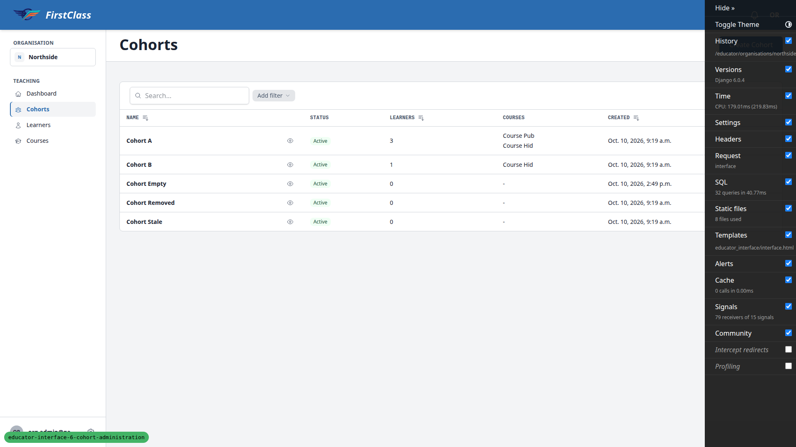 |
| 1.2 | desktop | pass | Learners/Created/Name sort asc then desc; toolbar reads "Sorted by <col>". Sort icons expose accessible names like "sort_neutral". |  |
| 1.3 | desktop | pass | Search "Emp" leaves Cohort Empty only; clearing restores all. | none |
| 1.4 | desktop | pass | Show inactive adds Cohort Old with Inactive badge; chip reads "Show inactive"; removing chip hides Cohort Old. | 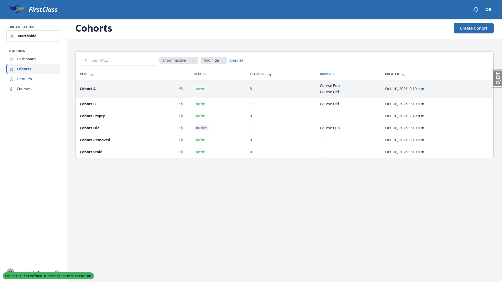 |
| 1.5 | desktop | pass | Course Hid -> A,B; Course Pub alone -> A; + Show inactive -> A, Old. Course filter is multi-select. Course Other/Soon not offered. Clear all works. | 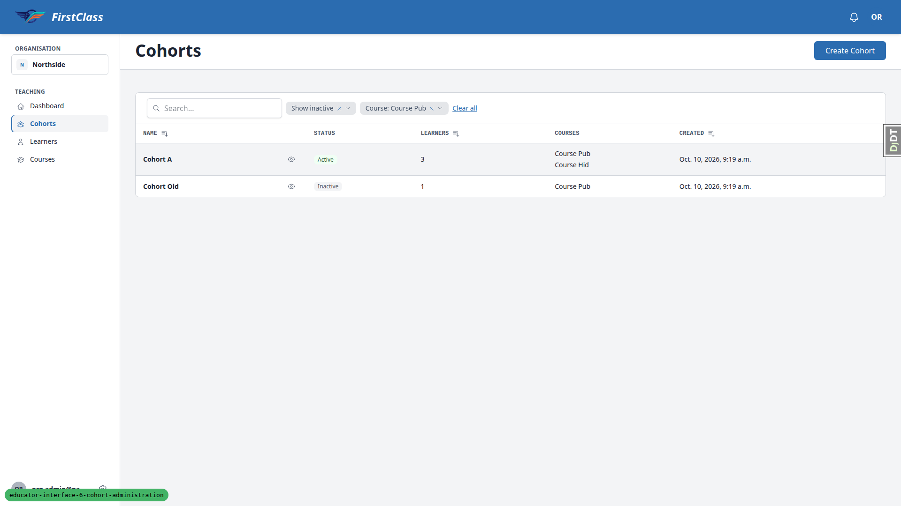 |
| 1.6 | desktop | pass | `?cohorts-course=<Course Other pk>` ignored: full list, no chip, no Clear all. | none |
| 1.7 | mobile | pass | Filter/Sort open the "Filter & sort" sheet listing Show inactive and Course; ticking Show inactive adds Cohort Old; no horizontal scroll. Filter/Sort buttons 35px tall. Course filter also lists Course Other (see general notes). | 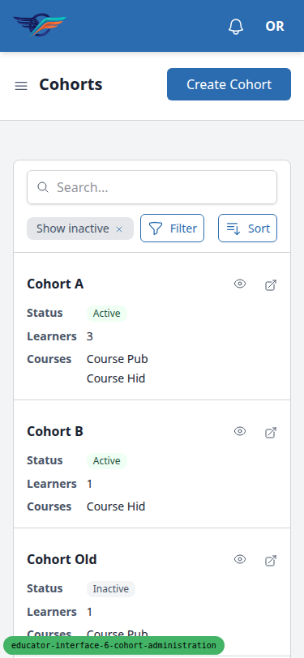 |
| 1.1 | mobile | pass | List renders as cards (Status, Learners, Courses); quick-view and open icons; no horizontal scroll. | 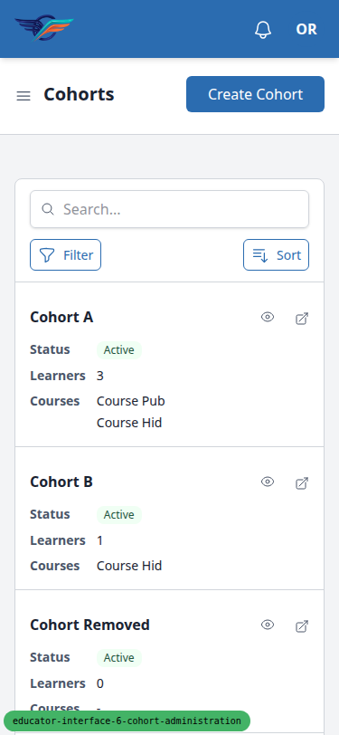 |
| 1.1 | tablet | pass | Full table, all 5 columns fit; desktop Add filter toolbar; navigation collapses to hamburger; no horizontal scroll. | 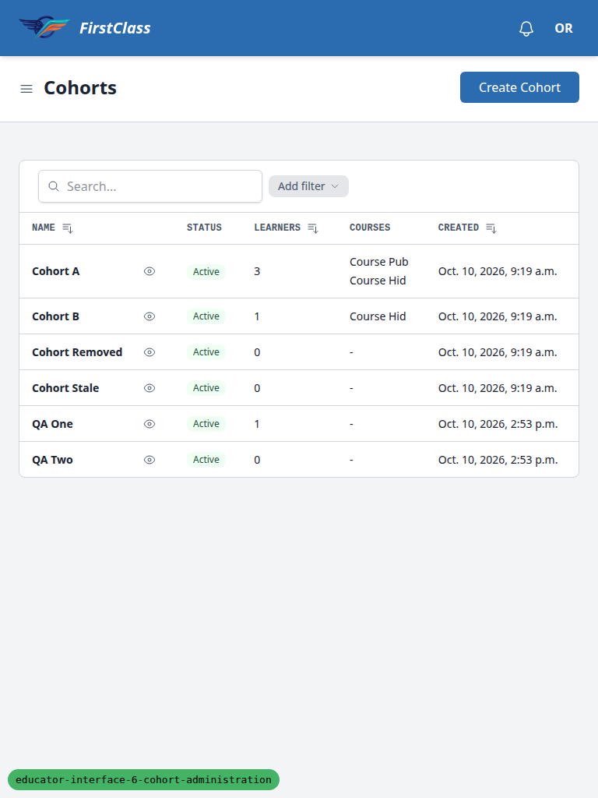 |
| 1.8 | desktop | pass | Cohort Old drawer: Inactive, Learners 1, Courses Pub; Cohort A drawer: Active, 3, Pub+Hid. | 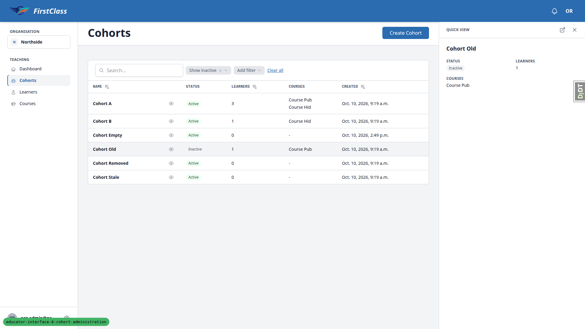 |

### §2 Create

| Test | Viewport | Status | Notes | Screenshot |
|---|---|---|---|---|
| 2.1 | desktop | pass | Footer: Cancel, Save and add another, Save. |  |
| 2.2 | desktop | pass | Dialog stays open, name empty, focus in name; QA One appears in list behind. |  |
| 2.3 | desktop | pass | Save lands on QA Two's page. | none |
| 2.4 | desktop | pass | "Cohort Old": dialog stays open with "1 field to fix." and "Another cohort already has this name." (422). |  |
| 2.5 | desktop | pass | Edit QA Two -> "QA One" shows same clash message in dialog (422). |  |

### §3 Cohort page

| Test | Viewport | Status | Notes | Screenshot |
|---|---|---|---|---|
| 3.1 | desktop | pass | Header: Cohort A, Active badge, 3 Learners / 2 Courses, Edit + Deactivate, no Delete. Tabs Overview, Learners 3, Courses 2, Settings. | 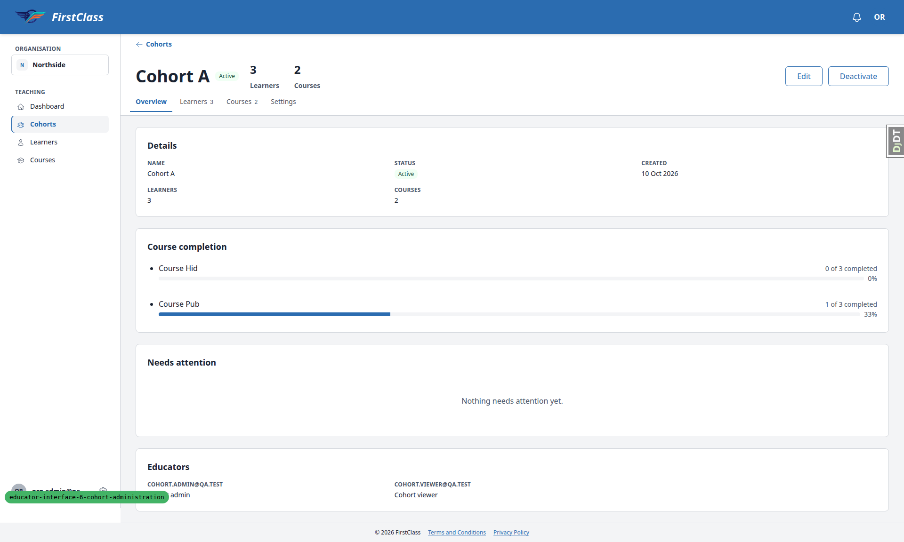 |
| 3.2 | desktop | pass | Cards in order Details/Course completion/Needs attention/Educators; lapsed.viewer absent. Course Pub reads "1 of 3 completed, 33%" (plan said 1 of 2, 50%; see general notes). Educators card uppercases emails. |  |
| 3.3 | desktop | pass | Learners tab lists a1, a2, a3. |  |
| 3.4 | desktop | pass | Rename to Cohort A1 updates heading and title without reload, badge stays; renamed back. |  |
| 3.5 | mobile | pass | Header stacks; tab row fits; scrollWidth 375 on Overview/Courses/Settings. Educators card labels run to card edge. | 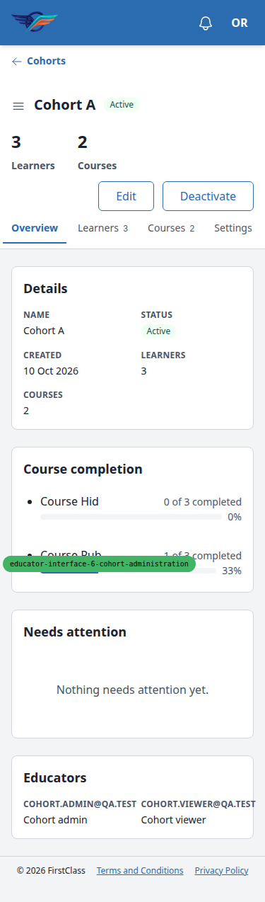 |
| 3.1 | tablet | pass | Header on one row; tabs fit; overview cards use 3-column details grid; no horizontal scroll. | 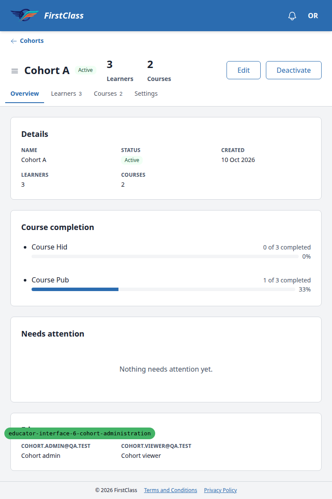 |

### §4 Courses tab: Register

| Test | Viewport | Status | Notes | Screenshot |
|---|---|---|---|---|
| 4.1 | desktop | pass | Rows Course Hid, Course Pub: Active badge, registered date, Unregister; course links go to educator course pages. | 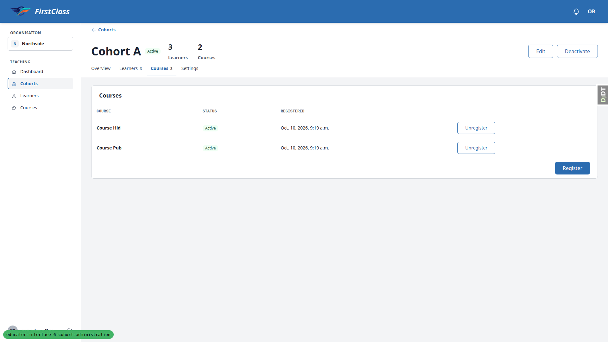 |
| 4.2 | desktop | pass | Dialog "Register Cohort A for a course"; options include Course Other + published demo courses; exclude Pub, Hid, Soon. | 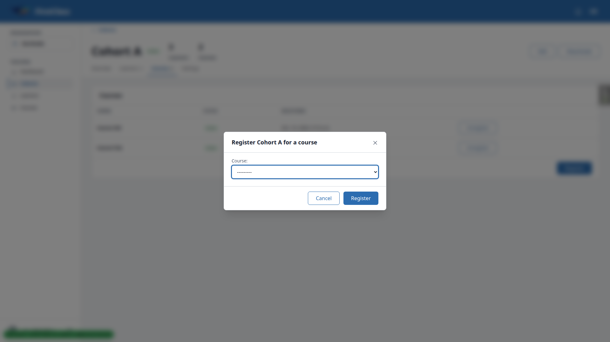 |
| 4.3 | desktop | pass | Registered Standard Markdown - Demo Finance: dialog closes, Active row, tab count 3, header "3 Courses", Overview card 3. | 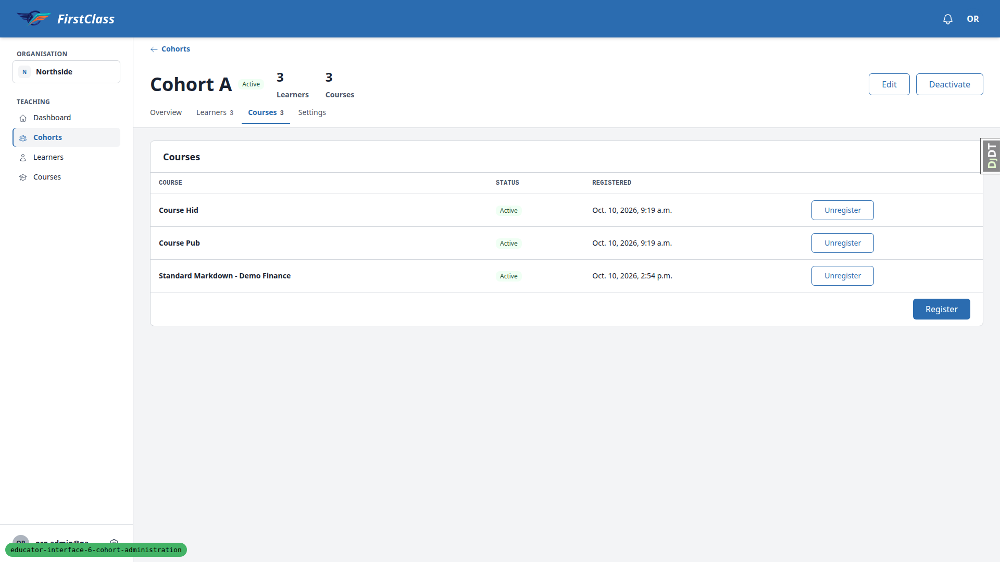 |
| 4.4 | desktop | pass | Cohort Stale: Course Pub Inactive, no Unregister; Register offers Course Pub; registering flips same row to Active (one row). Unregistered afterwards ("0 learners lose access"). |  |
| 4.1 | mobile | pass | Courses tab as cards with status badge, Unregister (38px tall) and Register; registered date not shown in card view. | 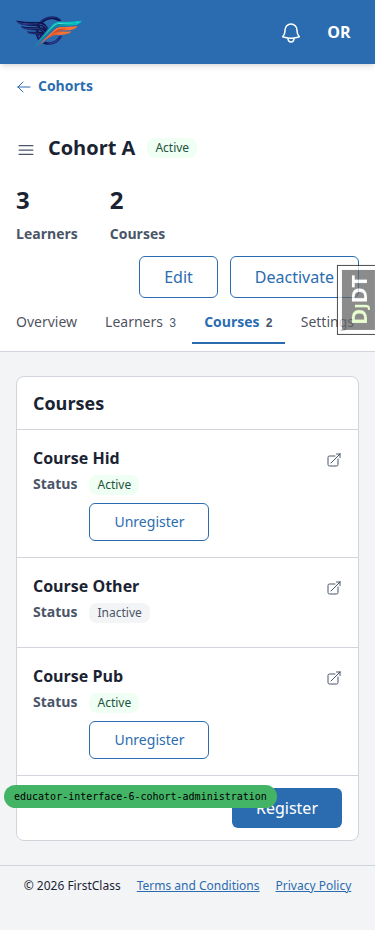 |
| 4.1 | tablet | pass | Courses tab renders at 768px with no horizontal scroll. | 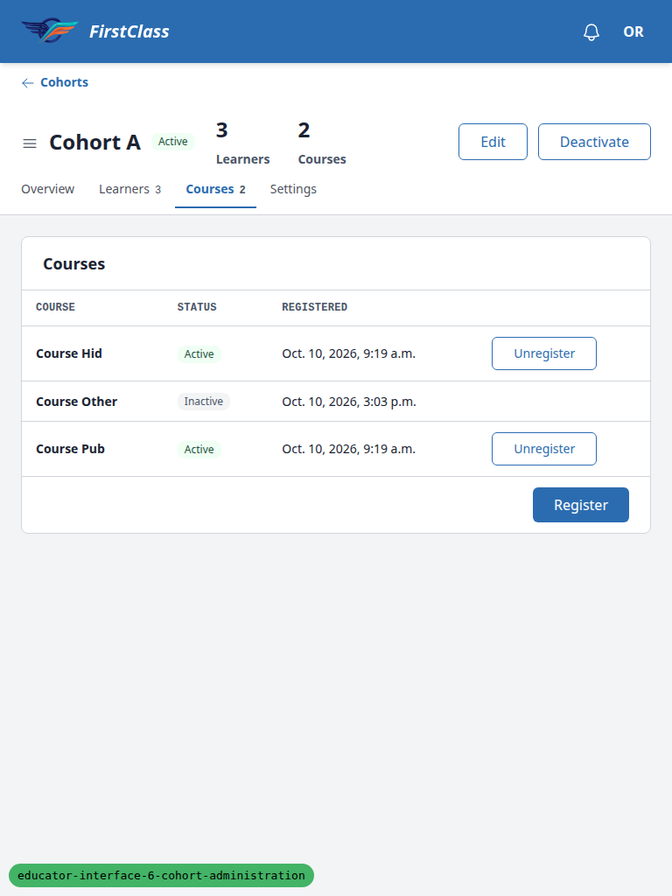 |

### §5 Courses tab: Unregister

| Test | Viewport | Status | Notes | Screenshot |
|---|---|---|---|---|
| 5.1 | desktop | pass | "Unregister Cohort A from Course Hid"; "1 learner loses access"; keepers a3 and a1 named; progress kept; can register again; confirm is btn-secondary (not red). | 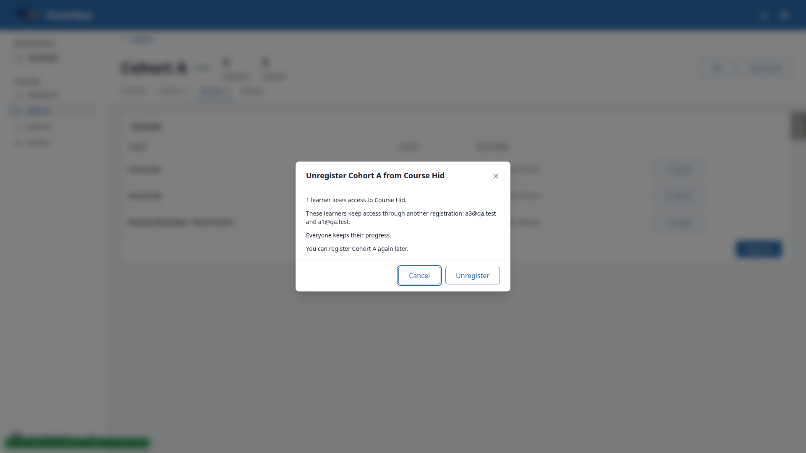 |
| 5.1 | mobile | pass | Dialog renders as a bottom sheet, text wraps, Cancel/Unregister reachable. | 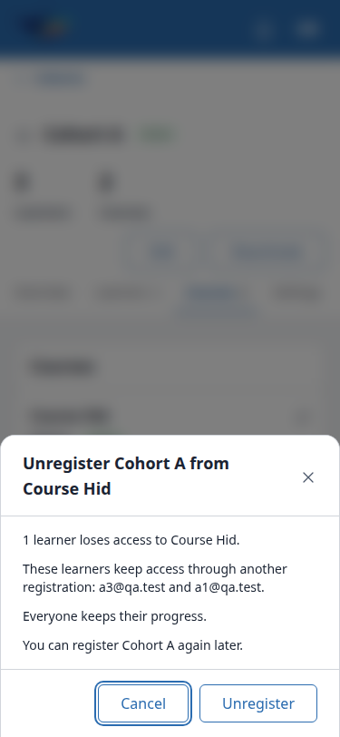 |
| 5.2 | desktop | pass | Cancel changes nothing; confirm -> Course Hid Inactive, no Unregister on row, counts drop by 1; Register offers Course Hid again. | 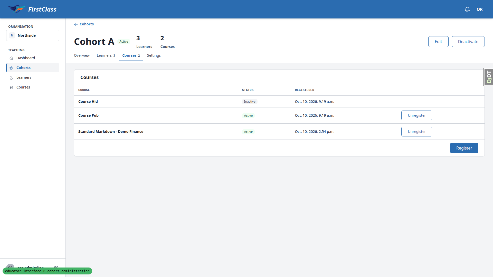 |
| 5.3 | desktop | pass | Re-registering Course Hid returns same row to Active. | none |
| 5.4 | desktop | pass | Plan setup adapted (see general notes). Hid dialog shows 10 names then "and 3 more", losing count 1 correct. Keeper names in no stable order. | 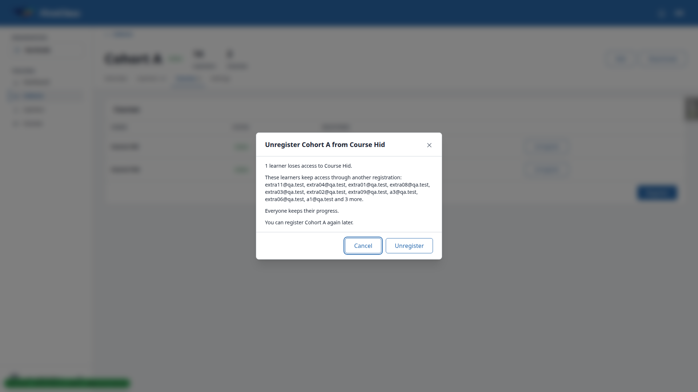 |

### §6 Settings: deactivate and reactivate

| Test | Viewport | Status | Notes | Screenshot |
|---|---|---|---|---|
| 6.0 | desktop | pass | a1 opens Course Hid (200). old@qa.test opens Course Pub (200, public page of a published course); dashboard lists no registration through Cohort Old. | none |
| 6.1 | desktop | pass | Settings offers Deactivate; "can't be deleted while it has 3 learners and 2 course registrations, counting removed learners and inactive registrations"; no Delete. | 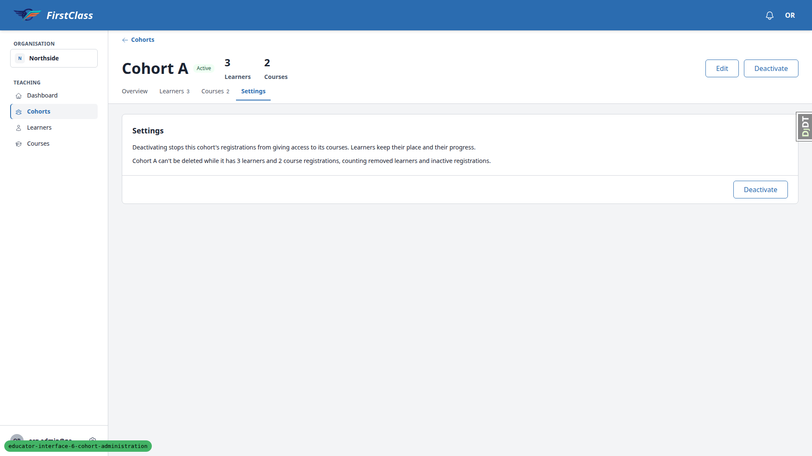 |
| 6.2 | desktop | pass | Header and tab Deactivate open same dialog with all five statements; confirm btn-secondary (not red). | 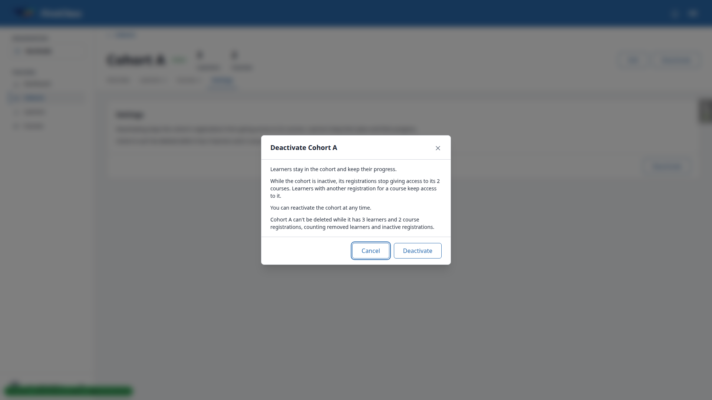 |
| 6.3 | desktop | pass | Same URL re-renders: Inactive badge, header Reactivate only (no Edit), settings Reactivate; Overview keeps completion; Courses tab has no Register/Unregister. | 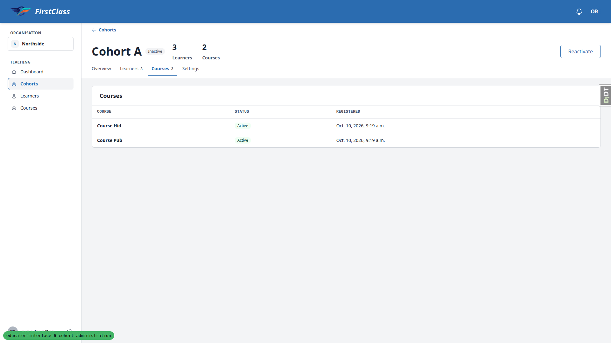 |
| 6.4 | desktop | pass | a1 Course Hid 200 (Cohort B); a2 404 and no In progress courses; a3 200 (individual). | none |
| 6.5 | desktop | pass | Cohorts list without Show inactive omits Cohort A. | none |
| 6.6 | desktop | pass | a2 learner page Cohorts card lists Cohort A with Inactive badge; search box only, no filter chips. Reached by URL (see 6.6-link). | 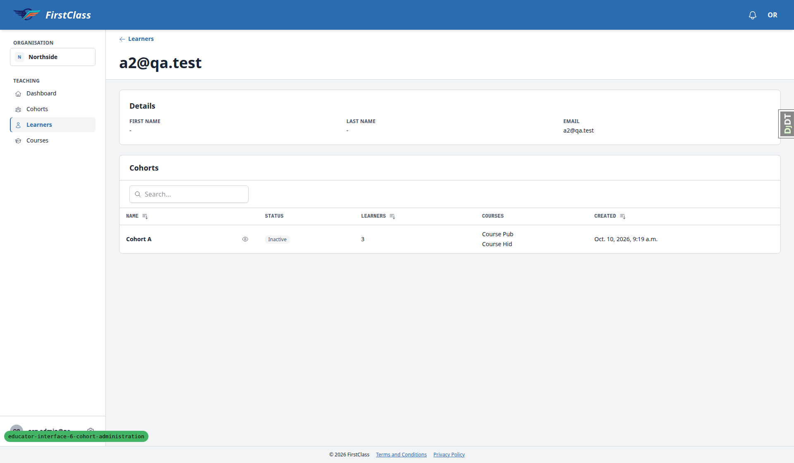 |
| 6.6-link | desktop | **fail** | a2 (no first/last name): both link columns render a bare "-" with no link and no quick-view trigger. See B1. |  |
| 6.6-link | mobile | **fail** | Learner cards for nameless learners: title "-", no email, no link, no quick view. See B1. | 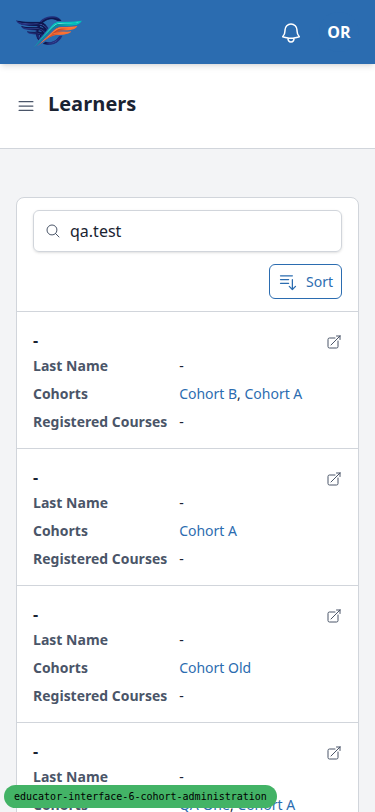 |
| 6.7 | desktop | pass | Reactivate dialog: "registrations give access to its 2 courses again." Confirm: Active, Edit back, Learners 3; a2 opens Course Hid (200). | 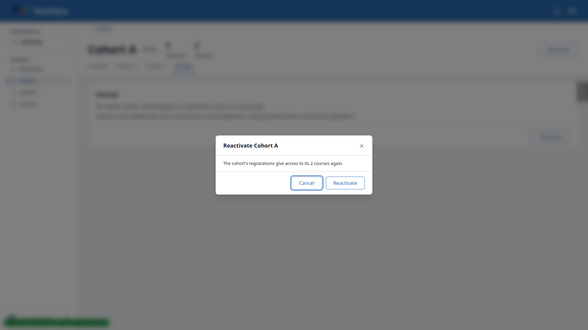 |

### §7 Delete

| Test | Viewport | Status | Notes | Screenshot |
|---|---|---|---|---|
| 7.1 | desktop | pass | Cohort Empty offers Delete; dialog "Delete Cohort Empty" / "cannot be undone", no cascade list; confirm lands on list without Cohort Empty. |  |
| 7.2 | desktop | pass | No Delete on Removed or Stale. Sentences name only the non-zero count (see general notes). | 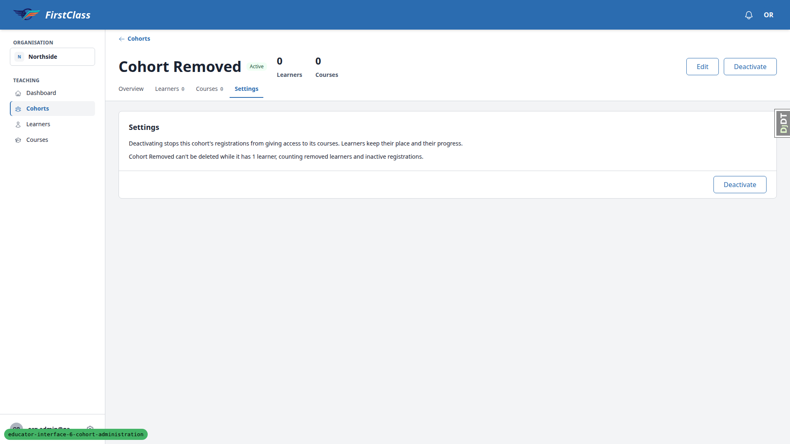 |
| 7.3 | desktop | pass | Dialog re-renders after a3 added: "QA One can't be deleted while it has 1 learner, ..." with only Cancel; QA One still exists. | 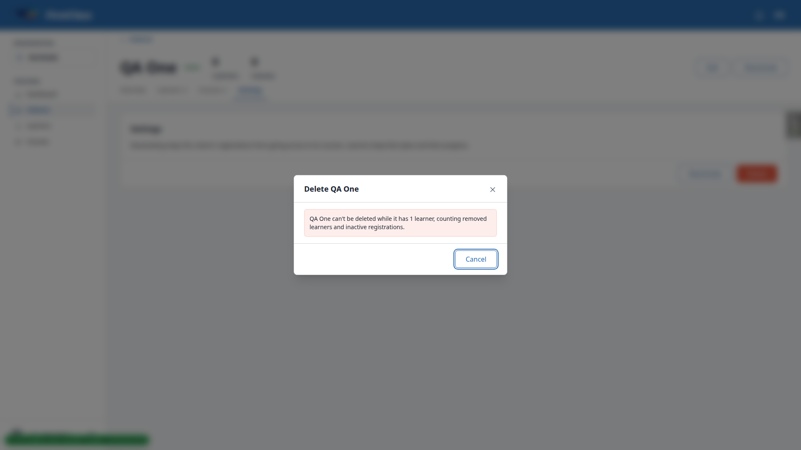 |

### §8 Stale pages on an inactive cohort

| Test | Viewport | Status | Notes | Screenshot |
|---|---|---|---|---|
| 8.1-8.2 | desktop | pass | Save in stale tab answers "Cohort B is inactive / The change was not made. Reactivate the cohort from its Settings tab to edit it."; name unchanged; reload shows no Edit. | 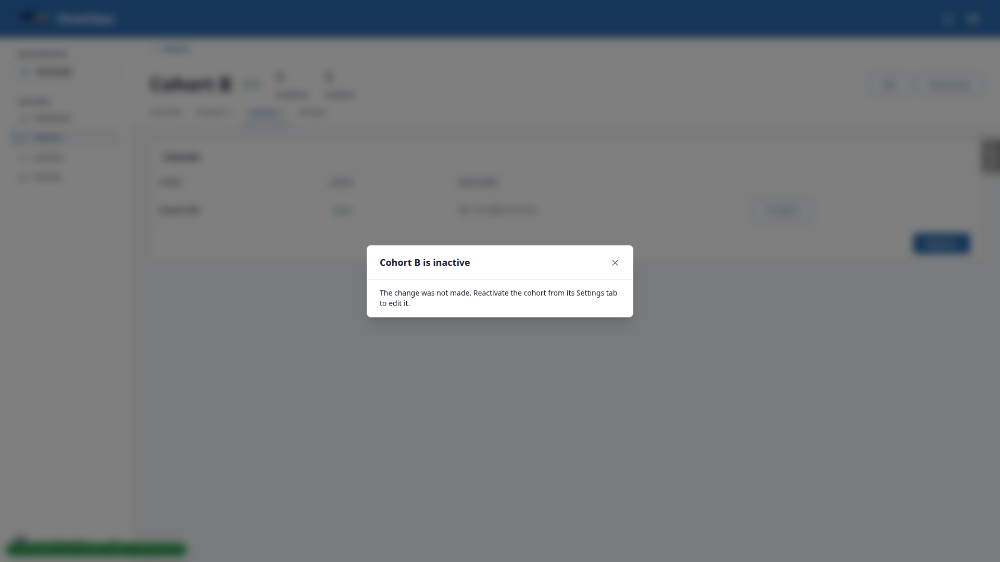 |
| 8.3 | desktop | pass | Register and Unregister both answer with the inactive fragment; Course Hid stays Active, no Course Pub row added. | 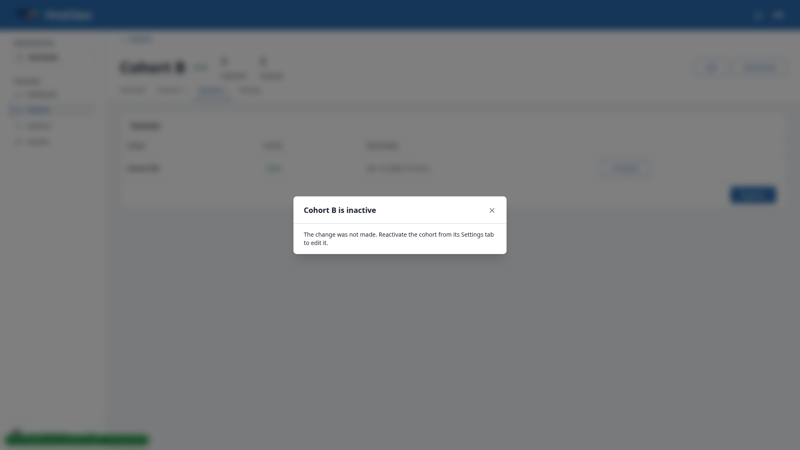 |
| 8.4 | desktop | pass | Cohort B reactivated: Active, Edit + Deactivate back. | none |

### §9 Roles and isolation

| Test | Viewport | Status | Notes | Screenshot |
|---|---|---|---|---|
| 9.1 | desktop | pass | cohort.admin: only Cohort A listed; no Edit/Deactivate; no Settings tab; no Educators card; Register + Unregister work; `__tabs/settings` 404; `__actions/deactivate` 403; Cohort B 404. | 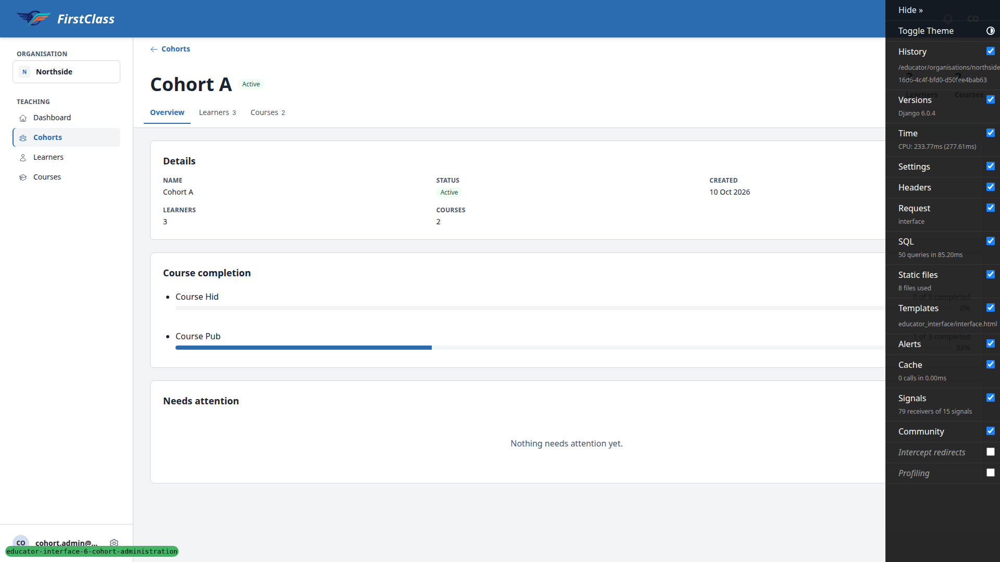 |
| 9.2 | desktop | pass | cohort.viewer: no Edit/Deactivate/Settings; Courses rows without Register/Unregister; courses tab/register action 403. | 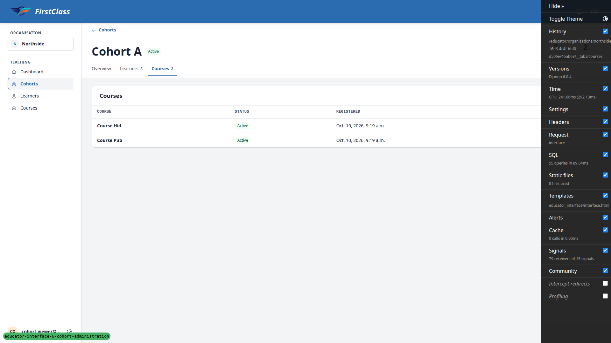 |
| 9.3.1 | desktop | pass | Cohort S page, its courses tab and the Cohort S registration unregister URL all 404. | 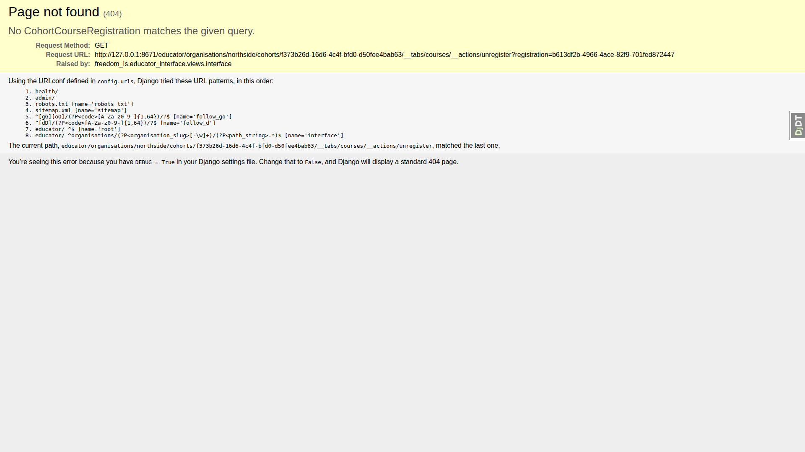 |
| 9.3.2 | desktop | pass | Northside courses: Pub, Hid, published demo courses; Other and Soon absent. Cohorts column names only Northside cohorts; Course Pub Active Cohorts 1. | 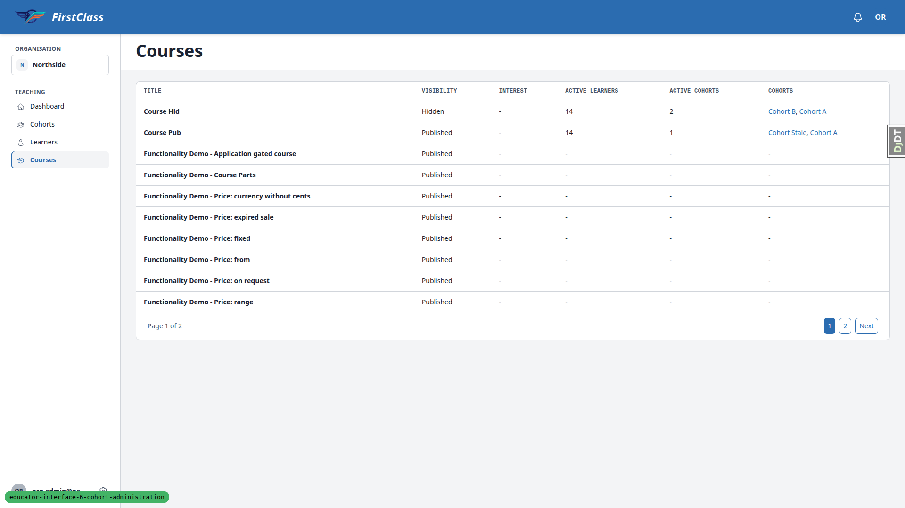 |
| 9.3.3 | desktop | pass | Northside course page for Course Other: 404. | none |
| 9.3.4 | desktop | pass | south.admin: Southside lists Course Other, not Course Hid; Course Other page shows Cohort S with two status badges, no Northside names, no buttons. | 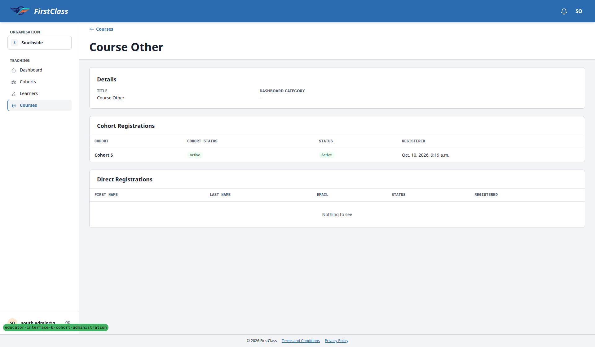 |
| 9.3.5 | desktop | pass | Course Pub page: A Active/Active, Old Inactive/Active, Stale Active/Inactive; Course Hid lists a3 direct registration; no buttons. | 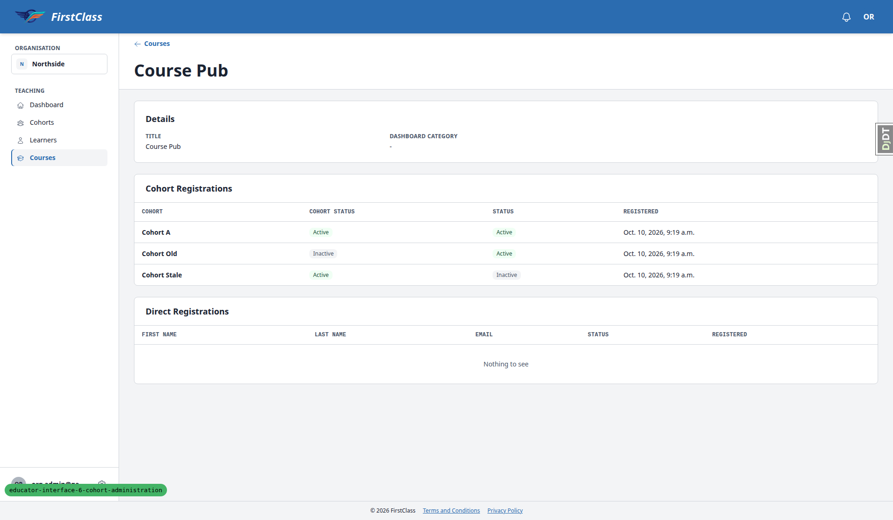 |

### §10 Admin

| Test | Viewport | Status | Notes | Screenshot |
|---|---|---|---|---|
| 10.1 | desktop | pass | Cohort changelist has Active column and "By active" filter; "No" lists Cohort Old only. | 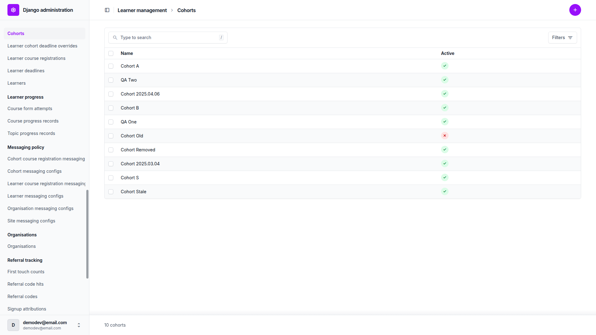 |
| 10.2 | desktop | pass | Active checkbox on change form; ticking shows Cohort Old on educator list without Show inactive; unticked again. | 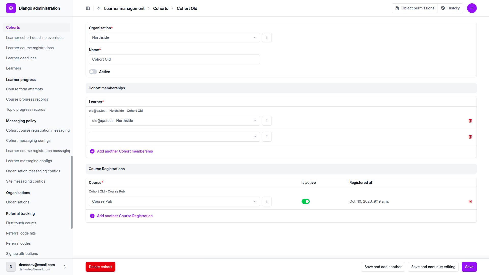 |

### §11 Side-effects

| Test | Viewport | Status | Notes | Screenshot |
|---|---|---|---|---|
| 11.1 | desktop | pass | Admin "Generate cohort report" offers Cohort Old (inactive); report reaches Ready with a Download link. | 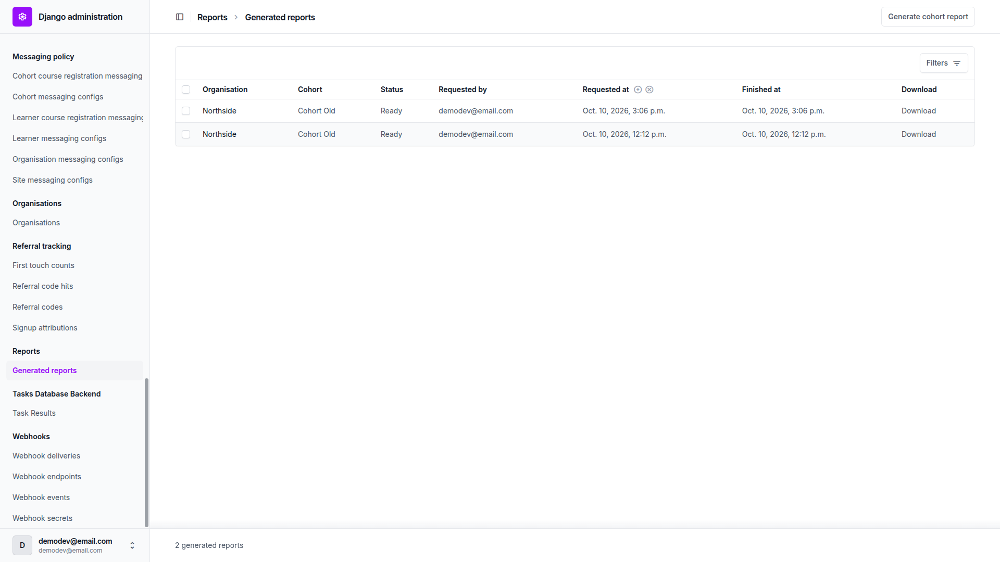 |
| 11.2 | desktop | pass | Quick view while Cohort A inactive: a2 no registrations; a1 Course Hid via Cohort B; a3 individual. After reactivation a2 shows Pub and Hid through Cohort A again. | none |
| 11.3 | desktop | pass | `/educator/` redirects to Northside dashboard; single-organisation user sees static organisation label as before. | 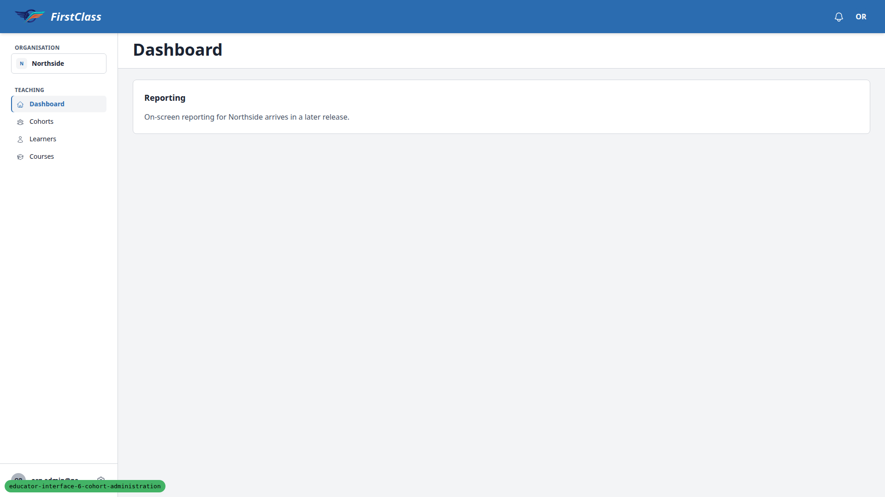 |

### Navigation

| Test | Viewport | Status | Notes | Screenshot |
|---|---|---|---|---|
| nav | mobile | pass | Hamburger opens bottom navigation drawer with organisation, Dashboard/Cohorts/Learners/Courses, account. | 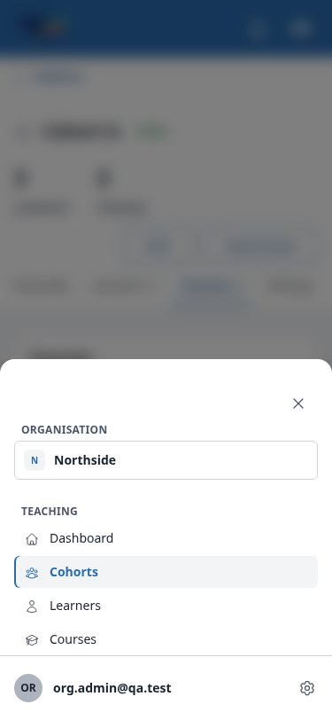 |

## Design check

No design states tested.

## B1: Learners with no first or last name cannot be opened from learner lists

**Manifestations:**

- 6.6-link, desktop
- 6.6-link, mobile

**Screenshots:**

**Expected:** Every row/card in the Learners section list (and the cohort Learners tab, which uses the same columns) links to the learner's page and offers the quick-view trigger, whatever the learner's name. On mobile the card identifies the learner.

**Actual:** `LearnerDataTable` puts the link and quick-view trigger only on the First Name and Last Name columns via `_interface_link`. When both are blank each renders a bare "-" with no `<a>` and no quick-view button.

- Desktop: the learner page and quick view are unreachable from the list (only the email text is shown).
- Mobile: every such card is titled "-", shows no email and has no link, so learners are indistinguishable and unreachable.
- Every QA scenario learner (a1, a2, a3, old, removed, s1) has no name, so this affects real data shapes (users who sign up with email only).

## Bug status

- **UNRESOLVED** — Learners with no first or last name cannot be opened from learner lists (reason: needs a product/UX decision. Commit 2a51c992 deliberately dropped the link from blank link cells as an accessibility fix, because a blank link was focusable with no accessible name. Restoring reachability means choosing what a nameless learner's link and quick-view trigger say, e.g. the email or "Unnamed learner". An auto-fix (28d2b0f8) that made "-" the link text was reverted in 7452168c because it overrode that decision.)

## General notes

Plan figures stale or inconsistent with spec/data:

- 3.2: Course Pub completion reads "1 of 3 completed, 33%", not the plan's "1 of 2, 50%". The spec defines the denominator as members with a CourseProgress record on the registration, and the registration signal gives every member (including a3) a record, so 1 of 3 is correct for this data. The plan figure is stale.
- 5.4: the plan setup is self-contradictory. The 11 extras with no other access lose access (the Pub dialog says "14 learners lose access", no keepers line), so they can never fill the keepers line. Adapted by giving the 11 extras a second route (Cohort B membership): the Hid dialog then shows 10 names then "and 3 more", with losing count 1 (a2) correct. Extras were removed afterwards.
- 7.2: the zero count is omitted from the delete sentence ("Cohort Removed can't be deleted while it has 1 learner, ..." rather than "1 learner and 0 course registrations"). The spec only requires counting every membership and registration, so this reads as acceptable.
- 1.5: the Course filter is multi-select (a second course adds with OR semantics), so "pick Pub instead" needs deselecting Hid first.

Cosmetic and UX observations:

- The Educators card renders emails in uppercase (label styling applied to the email key), and on mobile the labels crowd the card edge.
- Sort icons expose accessible names like "sort_neutral".
- Keeper names in the unregister dialog have no stable order (neither alphabetical nor by email).
- Destructive-ish confirm buttons (Unregister, Deactivate) are btn-secondary, the same weight as Cancel.
- Touch targets under 44px on mobile: Filter/Sort 35px, Unregister 38px.
- The inactive-cohort fragment says "to edit it" even for register and unregister.
- The header Reactivate clicked on the Courses tab lands on Overview rather than staying on the tab.
- Course Pub's Cohorts cell lists Cohort Stale (inactive registration) but not Cohort Old (inactive cohort). The spec says the cohort cell is unchanged, so noted only.
- `courses_visible_to` includes hidden courses with only inactive registrations, so Course Other appears in Northside's course filter after §9.1 (Cohort A holds an inactive Course Other registration).
- 9.3.1: the full-page GET shows the Django debug 404, while the HX request shows the "no longer available" dialog.

Environment and residue:

- The debug toolbar intercepted clicks in fresh browser contexts and had to be removed from the DOM.
- Residue left in dev data by this run: Cohort A holds an inactive Course Other registration from §9.1.3; QA One and QA Two exist, with a3 in QA One; two Cohort Old reports were generated.

---
status: ok
reason: 1 bug — 0 fixed, 1 unresolved; report rendered, screenshots verified
