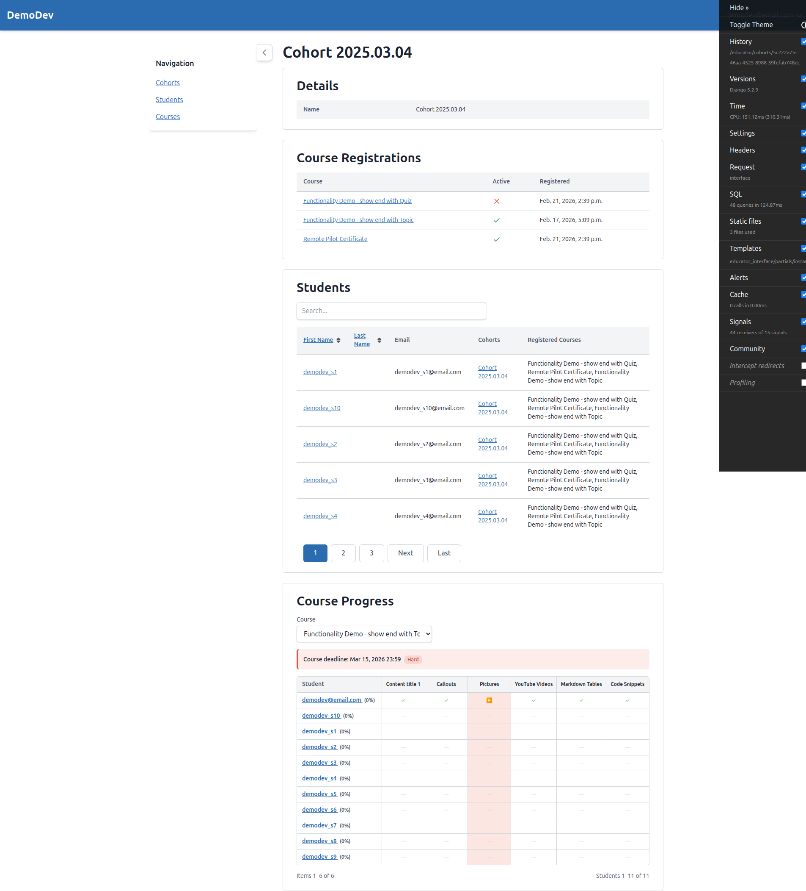
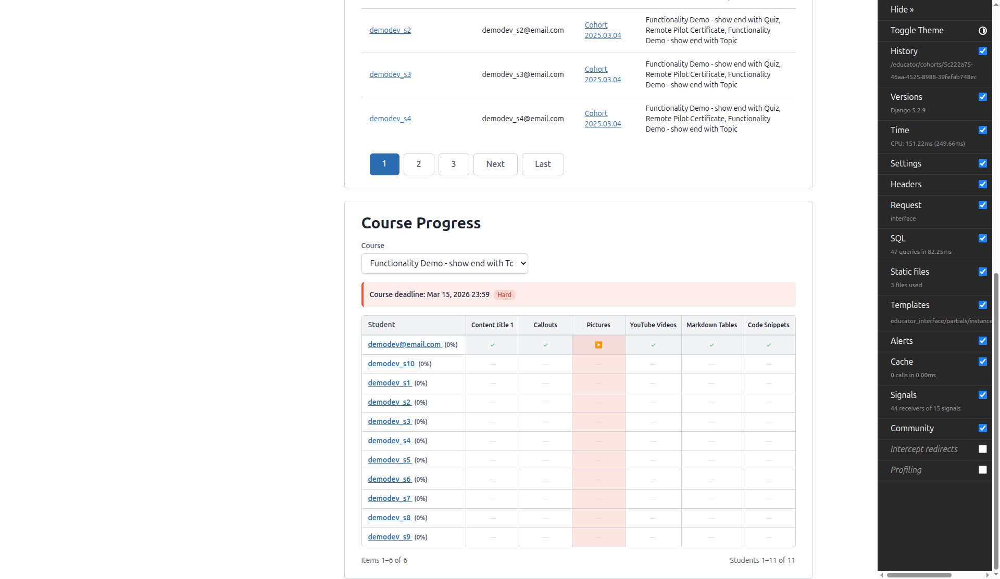
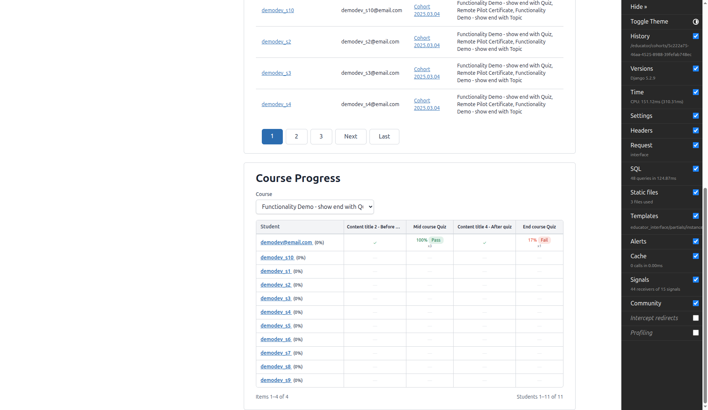
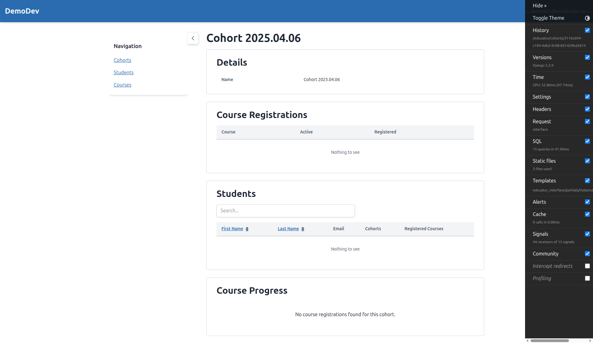
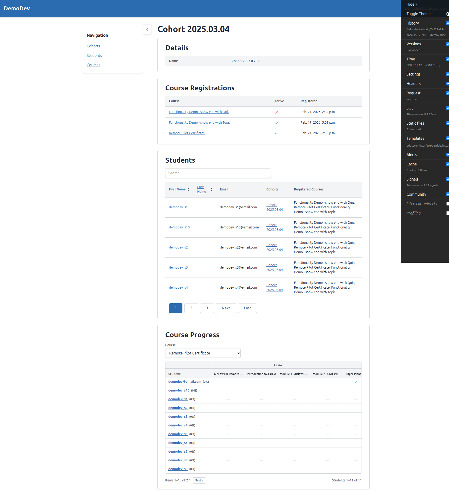
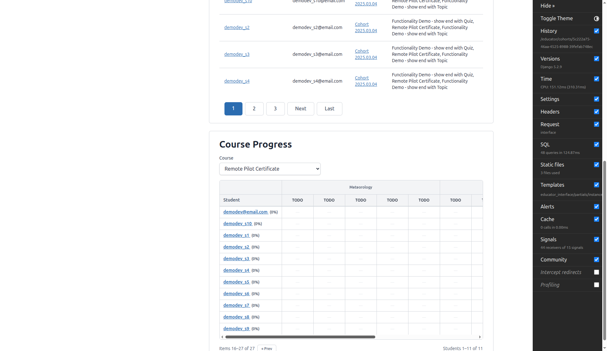
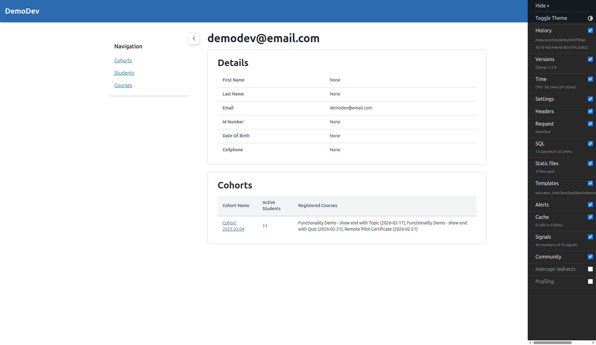

# QA Report: Cohort Course Progress Panel

**Date:** 2026-02-21
**Tester:** Claude (Automated QA via Playwright MCP)
**Feature:** Cohort Course Progress Panel on Educator Interface

---

## Summary

| Test | Result | Notes |
|------|--------|-------|
| Test 1: Panel Appears on Cohort Detail Page | PASS | |
| Test 2: Course Selection Dropdown | PASS | |
| Test 3: Empty States (no registrations) | PASS | |
| Test 3: Empty States (no students) | NOT TESTED | No cohort with registrations but zero students available |
| Test 3: Empty States (no progress) | PASS | |
| Test 4: Progress Grid Layout (sticky) | PASS | |
| Test 5: Course Part Headers | PASS | |
| Test 5: Flat Course (no CourseParts) | PASS | |
| Test 6: Student Sorting | FAIL | See Bug #1 |
| Test 7: Topic Cell Content | PASS | |
| Test 8: Quiz Form Cell Content | PASS | |
| Test 9: Non-Quiz Form Cell Content | NOT TESTED | No non-quiz form with scoring data available |
| Test 10: Column Pagination | PASS | |
| Test 11: Student (Row) Pagination | NOT TESTED | No cohort with 20+ students available |
| Test 12: Cohort Deadlines in Headers | PARTIAL FAIL | See Bug #2 |
| Test 13: Student Deadline Overrides | NOT VERIFIED | Override display is implemented but no override data visible in test data |
| Test 14: Overdue Highlighting | PARTIAL PASS | See Bug #3 |
| Test 15: Student Name Links | PASS | |

---

## Bugs

### Bug #1: Progress Percentage Always Shows 0%

**Test failed:** Test 6 (Student Sorting)

**Expected behavior:** Students should show their actual course progress percentage (e.g., "demodev@email.com (83%)") and be sorted by progress ascending.

**Actual behavior:** ALL students display (0%) regardless of their actual progress. `demodev@email.com` has completed 5 out of 6 items in "Functionality Demo - show end with Topic" but still shows (0%). This also means sorting by progress is ineffective since all values are identical.

**Root cause:** The view uses a `Subquery` to fetch `progress_percentage` from the `CourseProgress` model. However, `CourseProgress` records may not exist for students whose completions occurred before the `progress_percentage` field was added (via migration), or may not be created eagerly enough. The `Coalesce(..., Value(0))` fallback always returns 0 when no `CourseProgress` record exists.

**Impact:** High - educators cannot identify struggling students at a glance, which is the primary purpose of the sorting feature.

---

### Bug #2: Item-Level Deadlines Not Shown in Column Headers

**Test failed:** Test 12 (Cohort Deadlines in Headers)

**Expected behavior:** Deadlines should appear in the header area for the relevant column, with hard deadlines styled distinctly from soft deadlines.

**Actual behavior:** The course-level deadline IS correctly displayed above the grid ("Course deadline: Mar 15, 2026 23:59 Hard"). However, item-level deadlines are NOT rendered in column headers. The "Pictures" column has overdue-highlighted cells (indicating an item-level deadline has passed) but the header only shows the item name with no deadline date.

**Root cause:** The view computes `deadline_map` and passes it to context, but the template only renders item titles in column headers (no deadline info). The implementation appears incomplete for per-column deadline display.

**Impact:** Medium - educators can see overdue highlighting but cannot see when specific items are due without checking elsewhere.

---

### Bug #3: No Visual Differentiation Between Soft and Hard Deadline Overdue Cells (Unable to Verify)

**Test failed:** Test 14 (Overdue Highlighting) - partially

**Expected behavior:** Hard deadline overdue items should have more prominent styling (`bg-danger/15`) than soft deadline overdue items (`bg-warning/15`).

**Actual behavior:** The code correctly implements the differentiation (`bg-danger/15` for hard, `bg-warning/15` for soft). However, in the current test data, ALL visible overdue cells use `bg-danger/15` (hard deadline). No soft deadline overdue cells were visible to verify the softer styling works in practice.

**Impact:** Low - the code appears correct, but needs soft deadline test data to fully verify.

---

## Passing Tests - Details

### Test 1: Panel Appears on Cohort Detail Page - PASS

The "Course Progress" panel appears below Details, Course Registrations, and Students panels with a course selection dropdown.

### Test 2: Course Selection Dropdown - PASS

- Dropdown lists all 3 course registrations
- Active registrations show course title normally ("Functionality Demo - show end with Topic", "Remote Pilot Certificate")
- Inactive registration correctly shows "(inactive)" suffix ("Functionality Demo - show end with Quiz (inactive)")
- First active registration is selected by default
- Selecting a different course reloads the grid via HTMX without full page refresh

### Test 3: Empty States - PASS (partial)

- Cohort with no course registrations: Shows "No course registrations found for this cohort." message

- No progress data: Students with no progress correctly show "—" (dash) in all cells

### Test 4: Progress Grid Layout - PASS

- Student names column uses `position: sticky; left: 0px` with `z-index: 10`
- Header row uses `position: sticky; top: 0px` with `z-index: 20`
- Student header cell (top-left corner) uses `z-index: 30` to stay above both
- Table container has `overflow-auto max-h-[600px]` for scrollable area

### Test 5: Course Part Headers - PASS

- **With CourseParts (Remote Pilot Certificate):** Two header rows visible - Row 1 shows course part names (Airlaw, Flight Planning, Human Factors, Meteorology) spanning their child items, Row 2 shows individual item names
- **Flat course (Functionality Demo - show end with Topic):** Single header row with item names only

### Test 7: Topic Cell Content - PASS

- Completed topics: Show ✓ checkmark with date/time in tooltip (e.g., "Feb 15, 2026 14:28")
- Started but incomplete topics: Show ▶ play icon with start date/time in tooltip
- Not started topics: Show "—" (dash)

### Test 8: Quiz Form Cell Content - PASS

- Completed quiz with pass: Shows "100% Pass x3" (score, pass indicator, attempt count)
- Completed quiz with fail: Shows "17% Fail x1"
- Score displayed as percentage with colored Pass/Fail badge

### Test 10: Column Pagination - PASS

- Remote Pilot Certificate course has 27 items, paginated at 15 per page
- "Items 1-15 of 27" shown with "Next >>" button on page 1
- "Items 16-27 of 27" shown with "<< Prev" button on page 2
- Course part headers correctly span across page boundaries
- Student rows remain consistent across column page changes

### Test 15: Student Name Links - PASS

- Clicking student name navigates to student detail page in educator interface
- Student without first/last name (demodev@email.com) correctly shows email address instead

---

## Tests Not Executed

### Test 3: No Students Empty State
No cohort exists in the test data that has course registrations but zero students. Would need to set up this specific scenario.

### Test 9: Non-Quiz Form Cell Content
The quiz course has "Content title 2 - Before Quiz" and "Content title 4 - After quiz" which are topics (not forms), and they correctly show ✓ for completed. However, no non-quiz form (CATEGORY_VALUE_SUM scoring) with completion data was available to fully test this scenario.

### Test 11: Student (Row) Pagination
The largest cohort has 11 students, which is below the 20-student threshold for row pagination. Would need a cohort with 20+ students to verify row pagination controls.

### Test 13: Student Deadline Overrides
The override display code exists in the template (shows clock icon with override date), but no `StudentCohortDeadlineOverride` records were visible in the test data to verify rendering.

---

## Observations (Not Bugs)

### Course Registration Active/Inactive Display
In the Course Registrations table, "Functionality Demo - show end with Quiz" shows an X icon (inactive), while the other two show checkmarks (active). This correctly matches the "(inactive)" label in the Course Progress dropdown.

### Overdue Highlighting Behavior
The "Pictures" column in "Functionality Demo - show end with Topic" has overdue highlighting (`bg-danger/15`) for ALL students. Even `demodev@email.com` who started (▶) but didn't complete "Pictures" has the overdue highlight. This is correct - started-but-not-completed items past deadline should be flagged.

### Cell Date/Time Tooltips
Date/time information is available via HTML `title` attributes on cells (visible on hover) rather than displayed inline. This keeps the grid compact. All completed cells show "Feb 15, 2026 14:28" as the completion timestamp.
