# Frontend QA report: educator-interface-looks-good

## Methodology

- Run with Playwright MCP against a dev server on this branch (port 8305, branch badge verified).
- Logged in as demodev@email.com (superuser). Learner-interface checks used the seeded long-email learner.
- Viewports: desktop 1442x900 (plan width; also a 1920 and 1024 docking check), phone 392x850 (plan width), tablet 768x1024.
- The debug toolbar was hidden via injected CSS.
- Screenshots were collected into `screenshots/` beside this report. Every referenced image exists there.
- Data was seeded via the qa-data-helper: QA Second Org, QA Looks Cohort (30+1 learners), the long-email learner, QA Progress Cohort and 45 notifications. A reusable seed command was added: `freedom_ls/qa_helpers/management/commands/qa_create_educator_looks_good_seed.py`.
- The pre-step rebase onto main ran first: 18 commits replayed, no conflicts, full suite 6546 passed, pre-commit clean. Its front-end check was folded into this matrix.

## Diff scoping

- Class: **FULL**.
- Changed files (50+), grouped by directory:
  - `claude_plugins/` (fls-dev design_check; sdd make_pr_quickly, plan_from_spec, register_design, design_screenshots scripts)
  - `freedom_ls/base/templates/` (`_base_interface.html`, `cotton/pagination.html`)
  - `freedom_ls/educator_interface/templates/` (`interface.html`, `organisation_switcher.html`)
  - `freedom_ls/educator_interface/tests/` (unit tests for the cohort delete/create actions, the learner section, the switcher, the sidebar and views; Playwright tests for the create-cohort dialog and the switcher on mobile)
  - `freedom_ls/panel_framework/` (`panels.py`; cotton components: data-table, data-table-card, link cell, modal-header, panel-card, panel-definition list/row, panel-page-header; modal, panel and partial templates: delete_confirmation, form, read_only, `_panel_base`, `_tab_set_base`, action_denied/unavailable, bulk_confirmation, modal_host, sidebar_nav, table_selection_bar, table_sheet, table_toolbar; tests including Playwright modal layout)
  - `freedom_ls/qa_helpers/` (`qa_create_educator_interface_seed.py`)
- Skipped: nothing. The front-end check from the pre-step rebase was folded into this QA matrix rather than run separately. Everything ran: desktop, mobile and tablet.

## Smoke gate

Status: **pass**.

- Pages checked: `/`, `/educator/` (redirects to `/educator/organisations/demodev/dashboard`), `/educator/organisations/demodev/learners`.
- Failure URL and reason: none.
- Note: the test plan's URLs use `/educator/ORG/...` but the real prefix is `/educator/organisations/ORG/...`. This is plan drift, not a bug: `/educator/demodev/learners` returns 404.

## Test results

| Test | Viewport | Status | Screenshot | Notes |
|---|---|---|---|---|
| 1.3 | desktop | pass | — | Cohorts nav swaps main via htmx, URL updates, tint moves to Cohorts |
| 1.4 | desktop | pass | [shot](screenshots/page-2026-10-05T07-22-22-653Z.png) | Cohort name opens quick-view panel (existing behaviour); Open goes to cohort page; sub-item tinted/semibold; expand toggle works with aria-expanded |
| 1.5 | desktop | pass | [shot](screenshots/page-2026-10-05T07-23-23-621Z.png) | Org switch changes label and URL, keeps section (learners); menu narrower than trigger so 'Northside Training' wraps |
| 1.6 | desktop | fail | [shot](screenshots/page-2026-10-05T07-20-38-867Z.png) | Keyboard ops and focus rings work, but docked sidebar `<dialog>` steals focus on load (B1) |
| 1.7 | desktop | pass | [shot](screenshots/page-2026-10-05T07-24-35-172Z.png) | 1024 and 1920: sidebar docked 256px, no horizontal scroll |
| 3.3 | desktop | pass | — | Search filters via htmx, clearing restores 25 rows / Page 1 of 5 |
| 3.4 | desktop | pass | — | First Name sort asc/desc, page reset to 1 |
| 3.5 | desktop | pass | [shot](screenshots/page-2026-10-05T07-21-04-568Z.png) | Pager changes rows; URL carries learners-page |
| 3.6 | desktop | pass | — | Row hover tint; cohort link opens quick view, Open reaches cohort page |
| 3.7 | desktop | pass | [shot](screenshots/page-2026-10-05T07-26-29-021Z.png) | Single centred muted 'Nothing to see' row, no pagination |
| 3.8 | desktop | fail | [shot](screenshots/page-courses-desktop.png) | Cards consistent, but Courses table not scoped to selected organisation (B4) |
| 6.3 | desktop | fail | [shot](screenshots/page-cohort-edit-duplicate.png) | Inline edit and duplicate error work; sidebar sub-item keeps old name (B8); address bar moves to `.../__tabs/details` |
| 6.4 | desktop | pass | — | Learners card search/sort/page change only that table |
| 6.5 | desktop | fail | [shot](screenshots/page-delete-confirm-desktop.png) | Restyled dialog works, but body is an empty padded band (B9) |
| 7.3 | desktop | pass | [shot](screenshots/page-create-cohort-desktop.png) | Cancel/Escape/X close; backdrop keeps form open; discard prompt works |
| 7.4 | desktop | pass | [shot](screenshots/page-create-cohort-dup-desktop.png) | Empty name blocked by native required; duplicate shows inline error |
| 7.5 | desktop | pass | — | Create redirects to cohort page; resubmit shows duplicate error |
| 7.9 | desktop | pass | [shot](screenshots/page-delete-dialog-desktop.png) | Cohort with 31 progress records shows refusal with only Cancel; backdrop closes |
| 5.3 | desktop | pass | — | Cohort link in Cohorts card opens quick view |
| 5.4 | desktop | fail | [shot](screenshots/page-learner-detail-desktop.png) | Email wraps in cell, but sidebar Learners sub-item label overflows (B3) |
| 2.3-2.7 | mobile | pass | [shot](screenshots/page-mobile-navsheet.png) | Bottom sheet open/close, focus return, link navigation, Back, switcher in sheet, Escape/backdrop |
| 2.8 | mobile | pass | [shot](screenshots/page-mobile-sheet-longname.png) | 41-char org name truncates, no overflow |
| 2.9 | mobile | pass | [shot](screenshots/page-player-outline-mobile.png) | Outline toggle and sheet work; navigation from outline not exercised (only current topic unlocked) |
| 4.3 | mobile | pass | [shot](screenshots/page-mobile-longname-row.png) | Long-name row wraps, no horizontal scroll |
| 4.5-4.6 | mobile | pass | [shot](screenshots/page-mobile-sort-sheet.png) | Sort sheet apply/reset/cancel/Escape/backdrop all work |
| 4.7 | mobile | pass | — | Compact pager 'Page 1 of 5' + Next; Next/Previous work |
| 4.9 | mobile | pass | — | Sort and nav toggles open only their own sheets |
| 4.10 | mobile | pass | [shot](screenshots/page-mobile-nojs.png) | JS off: sort form inline and submits by full page load; renders above the list, not below |
| 5.4/5.5 | mobile | fail | [shot](screenshots/page-mobile-learner-detail.png) | Page scrolls horizontally (scrollWidth 536 at 392): h1 long email does not break (B3) |
| 5.6 | mobile | pass | — | At 640 Details grid is two columns |
| 6.6-6.7 | mobile | pass | [shot](screenshots/page-mobile-cohort-detail.png) | Card order, chevron rows, no tab strip; Sort opens learners sheet |
| 7.7 | mobile | fail | [shot](screenshots/page-mobile-create-cohort-keyboard.png) | Header/close stay in view; Enter in Name triggers 'Save and add another' (B2); same on desktop |
| 7.8 | mobile | pass | [shot](screenshots/page-create-cohort-resized-desktop.png) | Resize 392 to 1442 turns dialog into centred card, text kept |
| 7.9 | mobile | pass | [shot](screenshots/page-mobile-delete-confirm.png) | Delete confirmation is a bottom sheet; Cancel works (same empty body band, see B9) |
| 8.3 | mobile | pass | — | Targets: nav toggle 44x48, sheet close 44x48, dialog close 44x48, expand control 24x32 |
| 8.5 | mobile | fail | — | Create dialog respects reduced motion; navigation sheet still transitions 0.2s (B10) |
| sheet-resize | mobile | fail | [shot](screenshots/page-educator-resized-with-sheet-open.png) | Widening with sheet open hides sidebar and squeezes content (B11) |
| 3.9 / tablet pass | tablet | pass | [shot](screenshots/page-tablet-learners.png) | Tables, no page horizontal scroll; nav uses bottom sheet ([navsheet](screenshots/page-tablet-navsheet.png)); create dialog is centred card ([create](screenshots/page-tablet-create-cohort.png)) |
| 8.1 | desktop | skip | [shot](screenshots/page-dark-learners.png) | No dark theme exists in FLS |
| 8.2 | desktop | pass | — | Light-mode contrast ratios all adequate (lowest 6.8) |
| 8.4 | mobile | pass | — | Sort sheet Tab order sensible, every control shows a ring |
| 8.6 | mobile | pass | [shot](screenshots/page-learner-course-mobile.png) | Learner player fine at 392 and 1442; docked outline takes focus on load (same cause as B1) |
| 8.7 | desktop | pass | [shot](screenshots/page-panel-framework-components.png) | Component gallery renders, nothing past viewport |
| 8.8 | desktop | pass | — | Console: only expected 422s, favicon 404 and stale plan URL 404; no JS errors or Alpine warnings |

## Design check

| Test | Viewport | This run | Design | Result |
|---|---|---|---|---|
| 1.2-design | desktop | [shot](screenshots/page-2026-10-05T07-21-04-568Z.png) | [design](design_screenshots/sidebar__264.png) | Nav links render underlined; design shows plain labels (B5) |
| 3.2-design | desktop | [shot](screenshots/page-2026-10-05T07-21-04-568Z.png) | [design](design_screenshots/educator-learners__02-learners-table.png) | Name links font-medium (500), design shows bold (B6) |
| 5.2-design | desktop | [shot](screenshots/page-learner-detail-desktop.png) | [design](design_screenshots/educator-learners__03-learner-detail.png) | Title is '<email> - DemoDev', not the learner's name (B7) |
| 6.2-design | desktop | [shot](screenshots/page-cohort-detail-desktop.png) | [design](design_screenshots/educator-cohorts-and-admin__05-cohort-detail.png) | Edit/Delete in Details card footer, header right side empty (B12) |
| 7.2-design | desktop | [shot](screenshots/page-create-cohort-desktop.png) | [design](design_screenshots/educator-cohorts-and-admin__07-create-cohort-modal.png) | Footer has Cancel, 'Save and add another', 'Save' instead of Cancel + Create Cohort (B13) |
| 2.2-design | mobile | [shot](screenshots/page-mobile-learners.png) | [design](design_screenshots/educator-mobile-dashboard__m01-dashboard.png) | pass |
| 2.3-design | mobile | [shot](screenshots/page-mobile-navsheet.png) | [design](design_screenshots/educator-mobile-dashboard__m02-navigation-drawer.png) | pass |
| 4.2-design | mobile | [shot](screenshots/page-mobile-learners.png) | [design](design_screenshots/educator-mobile-learners__m03-learners-list.png) | Row names font-medium (500), not bold (B6) |
| 4.4-design | mobile | [shot](screenshots/page-mobile-sort-sheet.png) | [design](design_screenshots/educator-mobile-learners__m04-filter-and-sort-sheet.png) | pass |
| 5.5-design | mobile | [shot](screenshots/page-mobile-learner-detail.png) | [design](design_screenshots/educator-mobile-learners__m05-learner-detail.png) | pass |
| 6.6-design | mobile | [shot](screenshots/page-mobile-cohort-detail.png) | [design](design_screenshots/educator-mobile-cohorts-and-admin__m08-cohort-detail.png) | pass |
| 7.6-design | mobile | [shot](screenshots/page-mobile-create-cohort.png) | [design](design_screenshots/educator-mobile-cohorts-and-admin__m10-create-cohort.png) | Footer holds Cancel, 'Save and add another', 'Save' (primary wraps onto its own line) (B13) |

## Bugs

### B1: Docked side panel steals focus on every page load

Manifestations: 1.6 (desktop), 8.6 (desktop).

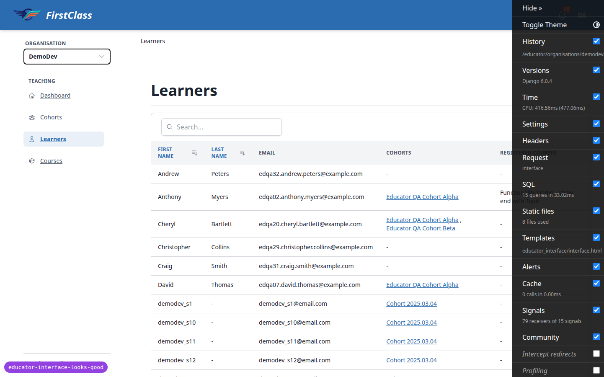
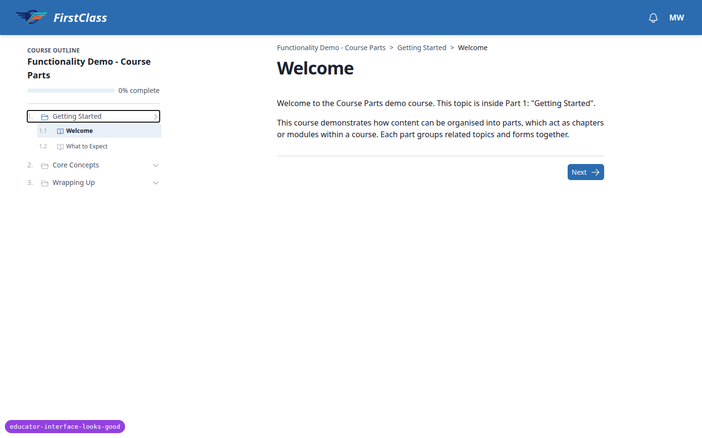

- Expected: page load leaves focus at the document start; the first Tab reaches the header/skip target, and no control shows a focus ring until the user tabs.
- Actual: on desktop the sidebar `<dialog>` is opened with `dialog.show()`, which focuses its first focusable control: the organisation switcher in the educator interface and the first outline row in the course player. The first Tab then skips the header and lands on Dashboard.

### B2: Enter in the create-cohort Name field fires 'Save and add another'

Manifestations: 7.7 (mobile; same form on desktop).

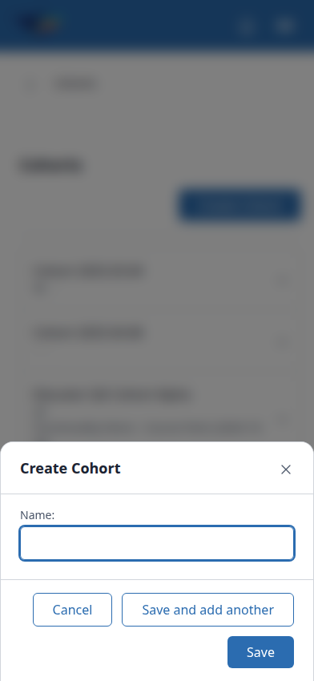

- Expected: Enter in the Name field submits like the primary Save button: creates the cohort and redirects to its page.
- Actual: implicit submission uses the form's first submit button, 'Save and add another' (name=action). The cohort is created, the dialog stays open and clears, no redirect.

### B3: Long unbroken labels overflow the page header and sidebar sub-item

Manifestations: 5.4 (desktop), 5.4/5.5 (mobile).

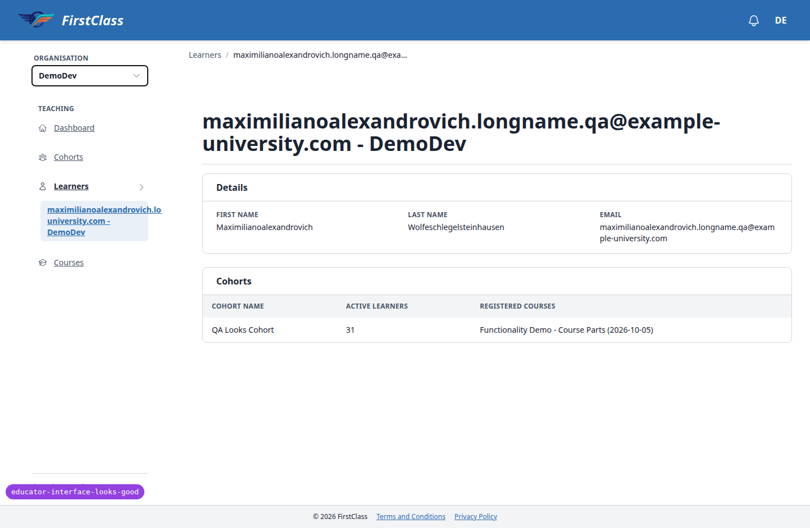

- Expected: long titles/labels wrap or truncate inside their containers; no horizontal page scroll at 392.
- Actual: the panel-page-header h1 with a long email does not break (page scrollWidth 536 at 392). The sidebar's active instance sub-item (`sidebar_nav.html`) has scrollWidth 371 in a 192px box and runs out of the sidebar column.

### B4: Courses table is not scoped to the selected organisation

Manifestations: 3.8 (desktop).

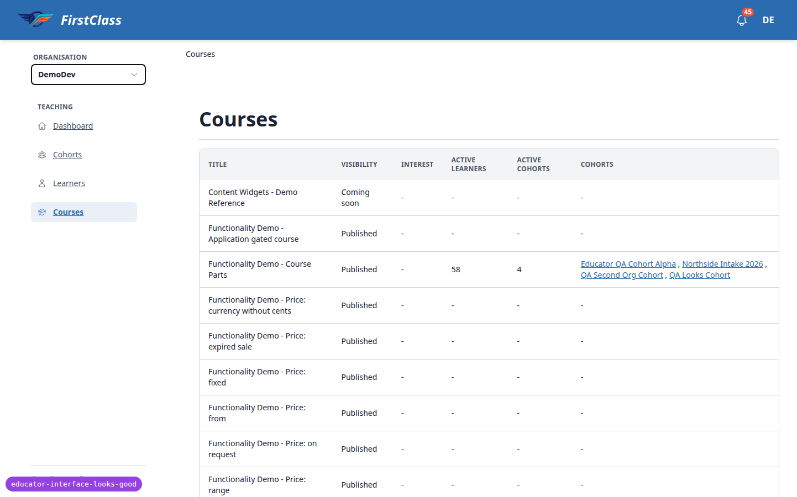

- Expected: `/educator/organisations/<org>/courses` lists only that organisation's cohorts and counts.
- Actual: demodev, qa-second-org and northside-training all show 'Functionality Demo - Course Parts' with cohorts from every organisation (Educator QA Cohort Alpha, Northside Intake 2026, QA Second Org Cohort, QA Looks Cohort) and 58 learners / 4 cohorts. Observed as a superuser.

### B5: Sidebar nav links are underlined

Manifestations: 1.2-design (desktop), 2.3-design (mobile).

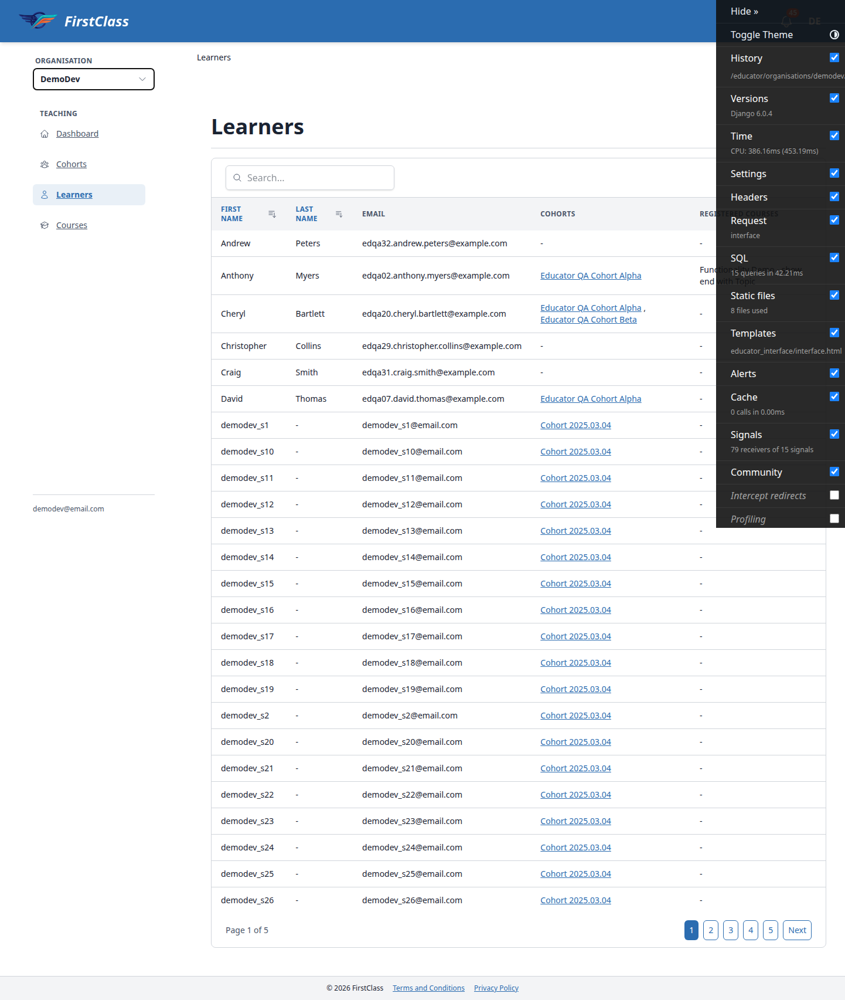

- Expected: nav item labels without underline, as in the design and like the no-underline table links.
- Actual: `sidebar_nav.html` anchors have no no-underline class, so the global link underline applies to every nav item and the sub-item.

### B6: Learner names in tables and mobile rows are medium weight, not bold

Manifestations: 3.2-design (desktop), 4.2-design (mobile).

- Expected: bold name links (checklist 3.2 and 4.2).
- Actual: `data-table-cells/link.html` and the mobile row name use font-medium (500).

### B7: Learner detail page title is '<email> - DemoDev' instead of the learner's name

Manifestations: 5.2-design (desktop).

- Expected: page header title is the learner's name.
- Actual: title (and breadcrumb and sidebar sub-item) use the User str: '<email> - DemoDev'.

### B8: Sidebar cohort sub-item keeps the old name after an inline rename

Manifestations: 6.3 (desktop).

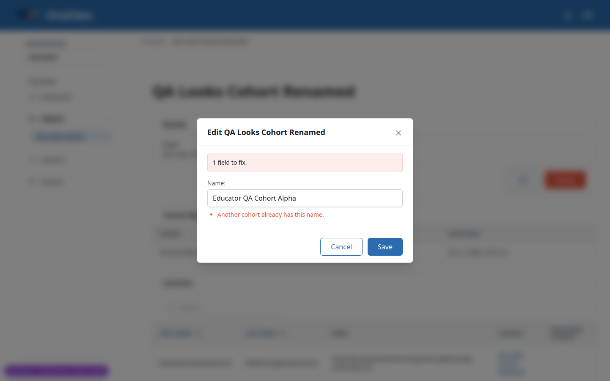

- Expected: saving a new name in the Details card updates the page title, breadcrumb and sidebar sub-item.
- Actual: title and breadcrumb update; the sidebar sub-item keeps the old name until a full reload.

### B9: Delete confirmation dialog renders an empty body band

Manifestations: 6.5 (desktop), 7.9 (mobile).

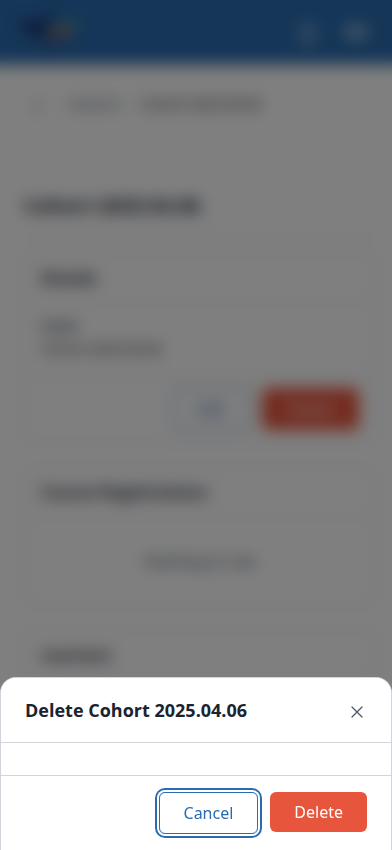

- Expected: title row, body text, footer (plan 6.5).
- Actual: `delete_confirmation.html` always renders the px-6 py-4 body wrapper. With no blocked_reason or cascade_summary it is an empty band between two hairlines.

### B10: Navigation sheet ignores prefers-reduced-motion

Manifestations: 8.5 (mobile).

No screenshot recorded for this bug (the scratch record lists none).

- Expected: with reduce, the nav sheet appears and closes without a slide (as the create dialog does).
- Actual: `.side-panel-dialog` keeps its 0.2s transform transition; there is no reduced-motion override in `_base_interface.html`.

### B11: Widening past lg with the side-panel sheet open hides the sidebar and squeezes the content

Manifestations: sheet-resize (mobile).

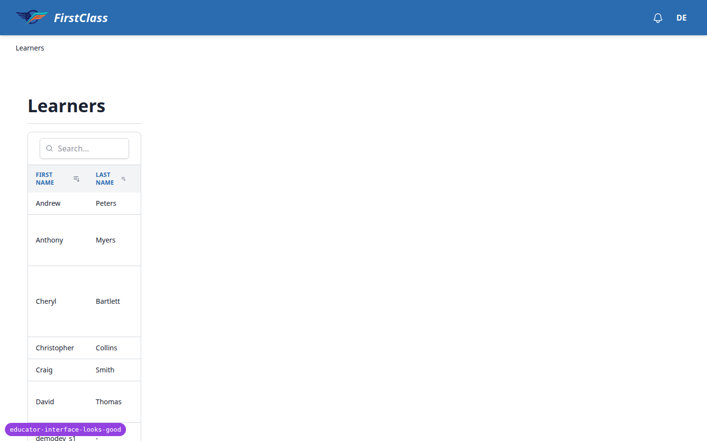
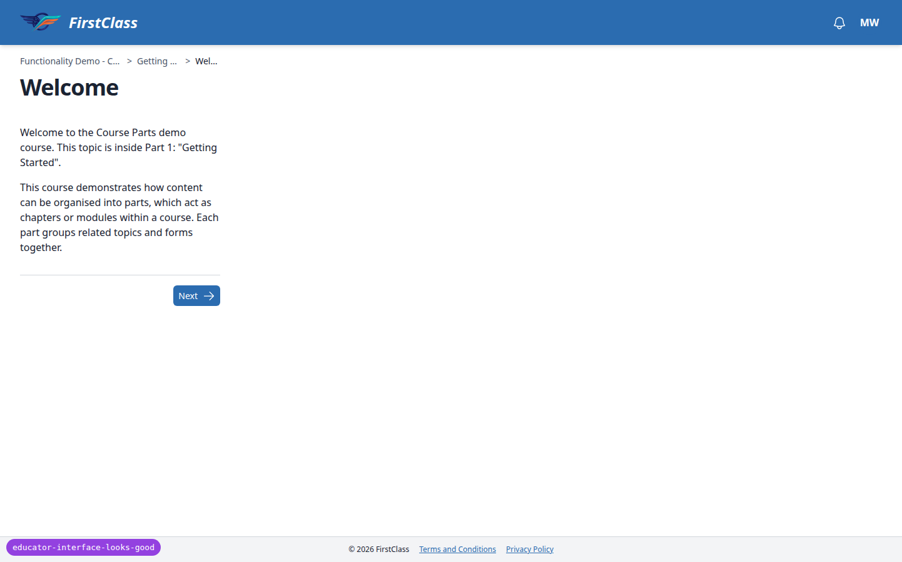

- Expected: on crossing to desktop the panel returns to its docked column.
- Actual: the sidebar dialog ends up closed (0x0) and main content is squeezed into ~230px. Same in the course player outline.

### B12: Cohort page actions sit in the Details card, not at the right of the page header

Manifestations: 6.2-design (desktop).

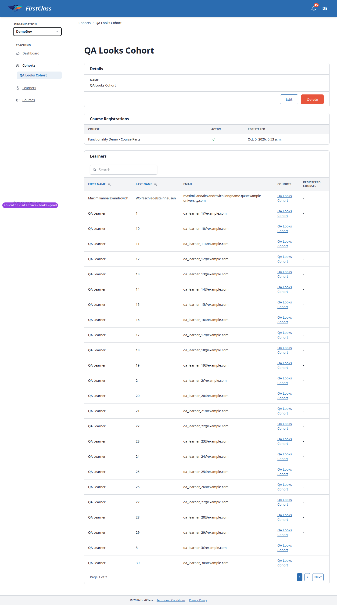

- Expected: checklist 6.2: actions at the right of the page header.
- Actual: Edit/Delete are in the Details card footer; the plan's own step 6.3 says 'click Edit in the Details card'.

### B13: Create cohort footer shows 'Save and add another' + 'Save' instead of Cancel + Create Cohort

Manifestations: 7.2-design (desktop), 7.6-design (mobile).

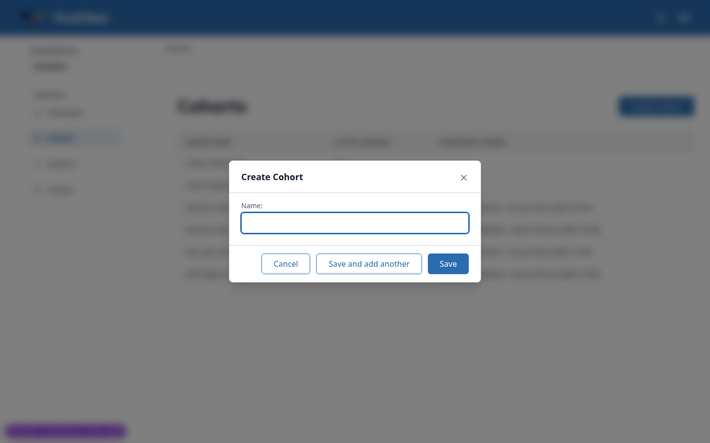

- Expected: footer: Cancel then primary 'Create Cohort'.
- Actual: footer: Cancel, 'Save and add another', primary 'Save'; on the phone the primary wraps onto a second line.

## Bug status

- **UNRESOLVED** — B1 Docked side panel steals focus on every page load (reason: fix attempt 21e9920c blurred focus back to `<body>` but the first Tab still landed on Dashboard because the browser's sequential-focus starting point stays inside the sidebar; reverted in 4bb4871e)
- **FIXED** (commit: cde1d3ba) — B2 Enter in the create-cohort Name field fires 'Save and add another'
- **FIXED** (commit: 2baaea18) — B3 Long unbroken labels overflow the page header and sidebar sub-item
- **UNRESOLVED** — B4 Courses table is not scoped to the selected organisation (reason: security-adjacent, possible cross-organisation data exposure; also needs a decision on what the Courses page should count)
- **UNRESOLVED** — B5 Sidebar nav links are underlined (reason: fix budget exhausted this run)
- **UNRESOLVED** — B6 Learner names in tables and mobile rows are medium weight, not bold (reason: fix budget exhausted this run)
- **UNRESOLVED** — B7 Learner detail page title is '<email> - DemoDev' instead of the learner's name (reason: fix budget exhausted this run)
- **UNRESOLVED** — B8 Sidebar cohort sub-item keeps the old name after an inline rename (reason: fix budget exhausted this run)
- **UNRESOLVED** — B9 Delete confirmation dialog renders an empty body band (reason: fix budget exhausted this run)
- **UNRESOLVED** — B10 Navigation sheet ignores prefers-reduced-motion (reason: fix budget exhausted this run)
- **UNRESOLVED** — B11 Widening past lg with the side-panel sheet open hides the sidebar and squeezes the content (reason: fix budget exhausted this run)
- **UNRESOLVED** — B12 Cohort page actions sit in the Details card, not at the right of the page header (reason: the plan's checklist and its own step 6.3 disagree on where the actions belong — product decision)
- **UNRESOLVED** — B13 Create cohort footer shows 'Save and add another' + 'Save' instead of Cancel + Create Cohort (reason: matching the design would relabel Save and drop 'Save and add another' — product decision)

## General notes

- No dark theme exists in FLS, so 8.1 was skipped.
- Outline navigation in 2.9 could not be exercised because only the current topic is unlocked.
- With JS off, the sort form renders above, not below, the list.
- The switcher menu is narrower than its trigger, so 'Northside Training' wraps.
- Organisation switching keeps the current section (learners) rather than going to cohorts as the plan says.
- Clicking a name/cohort link in educator tables opens the quick-view panel (existing behaviour) rather than navigating.
- Saving an inline edit moves the address bar to `.../__tabs/details` (reloading it renders correctly).
- The notification bell button has no accessible name.
- There is a large empty gap between the breadcrumb row and the page title on every educator page.
- Empty-name create submission is blocked by native `required` validation rather than a server error.
- Learners created by `qa_create_large_cohort` have unverified emails and cannot log in.
- The plan's test URLs need updating to `/educator/organisations/ORG/`.

status: ok · reason: 13 bugs — 2 fixed, 11 unresolved; report rendered, screenshots verified
