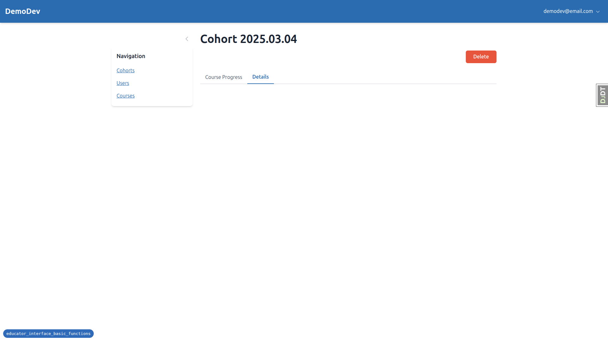
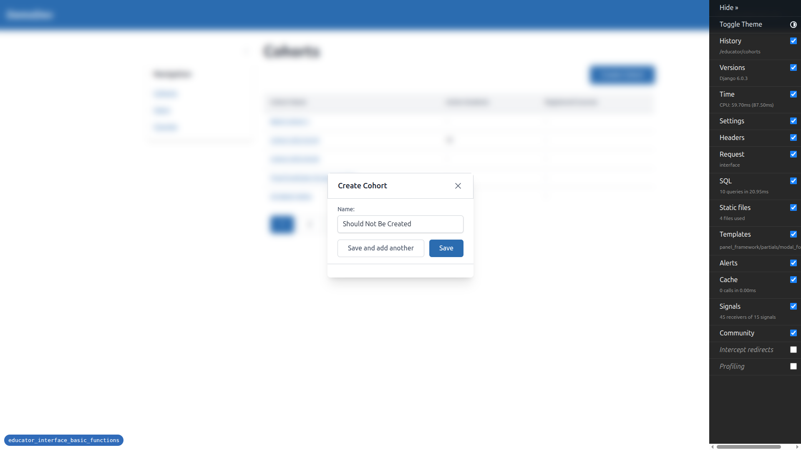
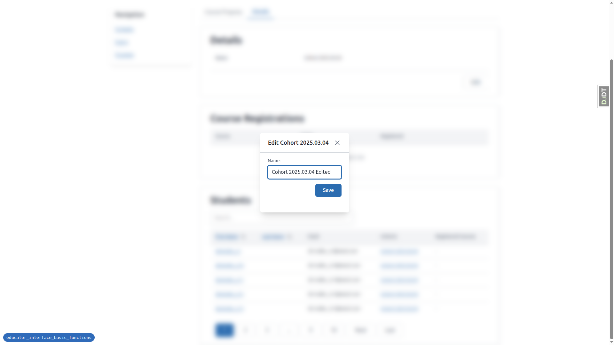
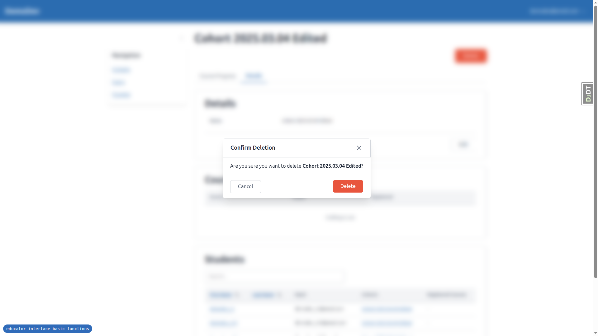
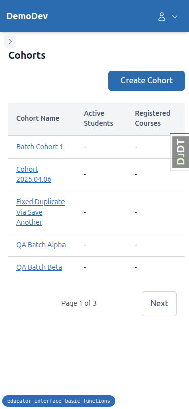
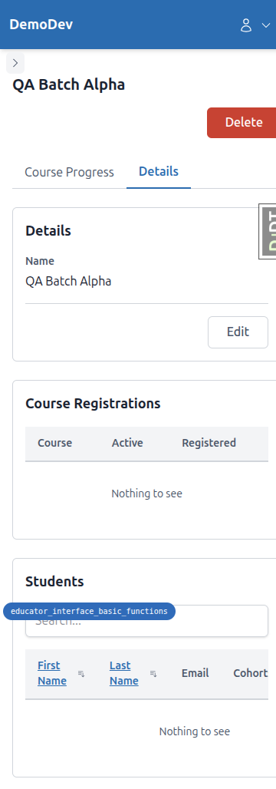

# QA Report: Educator Interface Basic Functions

**Date:** 2026-03-16
**Branch:** educator_interface_basic_functions
**Tester:** Automated QA via Playwright MCP

---

## Critical Issue: Alpine.js CSP Errors Break Tab Switching and HTMX Event Chains

Every page in the educator interface throws Alpine.js CSP parser errors:

```
Alpine Expression Error: CSP Parser Error: Expected PUNCTUATION...
```

**Impact:** This breaks all Alpine.js-powered interactivity, including:
- Tab lazy-loading (the `load-tab` custom event is never dispatched)
- Panel HTMX refresh after edit (the event chain that triggers panel reload doesn't fire)
- Modal form reset on close (form retains previous input)

This single issue is the root cause of most failures below.

---

## Test Results Summary

| Test | Description | Result |
|------|-------------|--------|
| 1 | Existing functionality after refactor | PASS |
| 2 | Create Cohort — Save | PASS |
| 3 | Create Cohort — Save and add another | PASS |
| 4 | Create Cohort — Duplicate name (Save) | PASS |
| 5 | Create Cohort — Duplicate name (Save and add another) | PASS |
| 6 | Create Cohort — Empty name validation | PASS |
| 7 | Create Cohort — Modal dismissal | FAIL |
| 8 | Create Cohort — Permission check | PASS |
| 9 | Cohort Tabs — Initial load | PASS |
| 10 | Cohort Tabs — Lazy load second tab | FAIL |
| 11 | Tabs — Panel HTMX reload within tabs | BLOCKED |
| 12 | Tabs — HTMX reload after tab switch | BLOCKED |
| 13 | Tabs — URL updates on tab switch | PARTIAL PASS |
| 14 | Tabs — Direct URL access | PASS |
| 15 | Tabs — Browser back/forward navigation | BLOCKED |
| 16 | Edit Cohort | FAIL |
| 17 | Edit Cohort — Validation errors | PASS |
| 18 | Edit Cohort — Permission check | PASS |
| 19 | Delete Cohort — With related records | FAIL |
| 20 | Delete Cohort — With no related records | PASS |
| 21 | Delete Cohort — Permission check | PASS |
| 22 | Loading indicators on form submissions | NOT FULLY TESTED |
| 23 | Double-click prevention | NOT FULLY TESTED |
| 24 | Mobile responsiveness | PASS |

---

## Errors

### Error 1: Tab Lazy-Loading Completely Broken (Tests 10, 11, 12, 15)

**Test:** 10 (Cohort Tabs — Lazy load second tab)

**Expected:** Clicking the "Details" tab loads its content via HTMX lazy-load.

**Actual:** Clicking the "Details" tab visually switches the tab indicator (the tab appears selected and URL updates) but the tab panel remains empty. The content never loads because the `hx-trigger="load-tab once"` event is never dispatched — Alpine.js, which handles the tab switching logic and event dispatch, is broken due to CSP errors.

**Workaround:** Loading the tab URL directly (e.g., `/educator/cohorts/<id>/__tabs/details`) works correctly and renders all content.



---

### Error 2: Modal Form Not Reset on Dismiss (Test 7)

**Test:** 7 (Create Cohort — Modal dismissal without saving)

**Expected:** After closing the modal with X or Escape, reopening it should show an empty form.

**Actual:** The form retains the previously entered text ("Should Not Be Created" was still in the name field after closing and reopening). This is because Alpine.js (which handles form reset on modal close) is non-functional due to CSP errors.

**Note:** Closing via X and Escape both work correctly. No cohort is created.



---

### Error 3: Details Panel Does Not Refresh After Edit (Test 16)

**Test:** 16 (Edit Cohort)

**Expected:** After saving an edit, the modal closes and the details panel refreshes to show the updated name without a full page reload.

**Actual:** The modal closes but the details panel still shows the old name. A full page reload confirms the edit was saved successfully. The HTMX event chain that triggers panel refresh after a successful edit does not fire, again due to Alpine.js CSP errors.



---

### Error 4: Delete Confirmation Missing Cascade Summary (Test 19)

**Test:** 19 (Delete Cohort — With related records)

**Expected:** The delete confirmation modal should show a summary of related records that will be deleted (e.g., "50 cohort memberships").

**Actual:** The confirmation modal only shows "Are you sure you want to delete **Cohort Name**?" with no cascade summary of related records.

**Note:** The delete operation itself works correctly — the cohort is deleted and the user is redirected to the cohorts list. The "Deleting..." loading text also appears correctly.



---

## Tests Not Run / Blocked

### Tests 11, 12 (Panel HTMX reload within tabs, HTMX reload after tab switch)
**Reason:** These tests require functional tab switching, which is broken due to the Alpine.js CSP issue. Tab content only loads via direct URL navigation, not via clicking.

### Test 15 (Browser back/forward navigation)
**Reason:** While URL updates work when clicking tabs, the content doesn't load, making back/forward navigation meaningless to test in the current state.

### Tests 22, 23 (Loading indicators, Double-click prevention)
**Partially tested:** The delete button showed "Deleting..." loading text correctly. Create and Edit modals submit and close correctly but the full loading indicator behavior (button disabled during request, spinner) could not be thoroughly verified due to the speed of local requests. The "Save and add another" button returned to normal state after validation errors, which is correct.

---

## Responsive Testing

### Mobile (375x812) — PASS
- Sidebar hidden by default, opens as drawer overlay
- Tables readable with appropriate column wrapping
- Modals centered, don't overflow screen
- Buttons accessible and appropriately sized
- Pagination simplified to "Page X of Y" with Next link






### Tablet (768x1024) — PASS
- Sidebar hidden with toggle (uses mobile nav pattern)
- Tables and panels have good spacing
- Tabs render cleanly
- Forms and modals render at reasonable width


---

## Tangential Observations

1. **Alpine.js CSP errors on every page:** `Alpine Expression Error: CSP Parser Error` appears in the console on every page load. This is the root cause of most failures and suggests the Alpine.js CSP build is incompatible with the current CSP configuration or has a syntax issue in one of the Alpine component definitions.

2. **Multiple "Create Cohort" buttons accumulate in DOM:** After using "Save and add another" multiple times, multiple `Create Cohort` button+dialog blocks accumulate in the DOM (seen as duplicate element refs). This doesn't cause visible issues but may lead to unexpected behavior.

3. **Page heading not updated after edit without reload:** The `<h1>` heading (e.g., "Cohort 2025.03.04") does not update after an edit save — only the details panel should refresh, but even the panel didn't refresh due to the Alpine.js issue. After full page reload, both heading and panel show the correct updated name.
