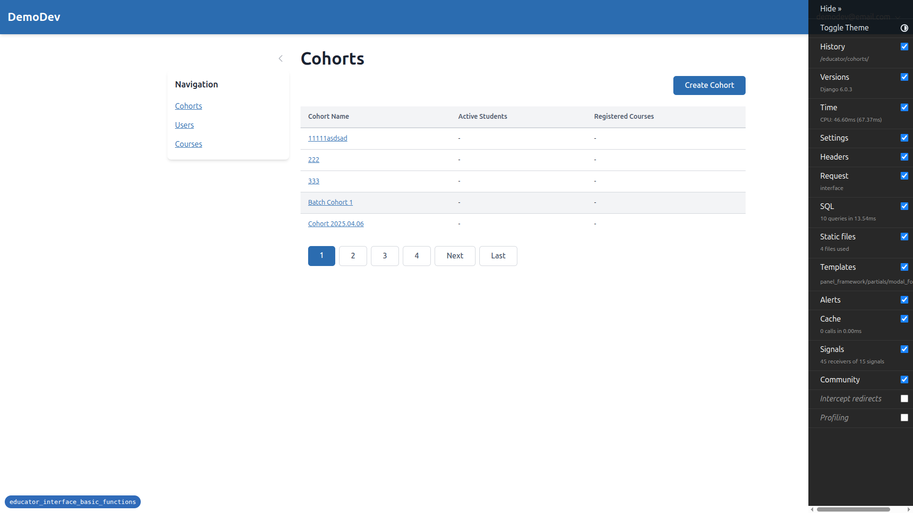
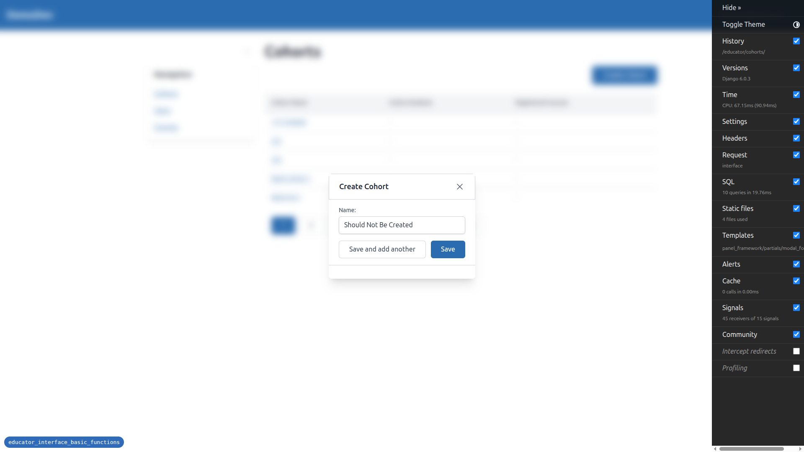
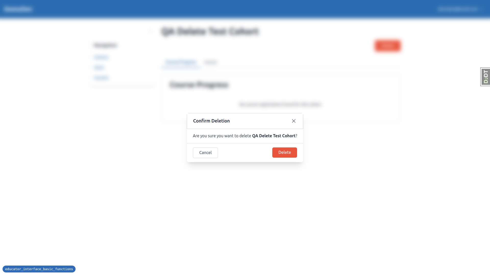
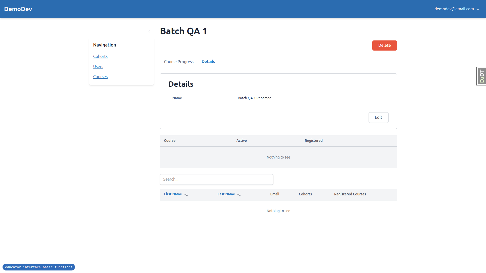
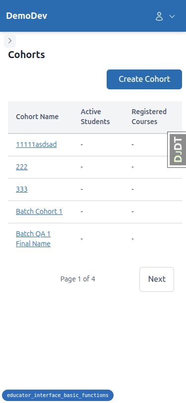
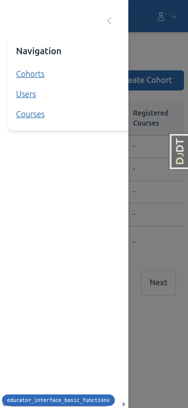
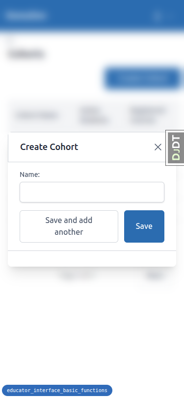
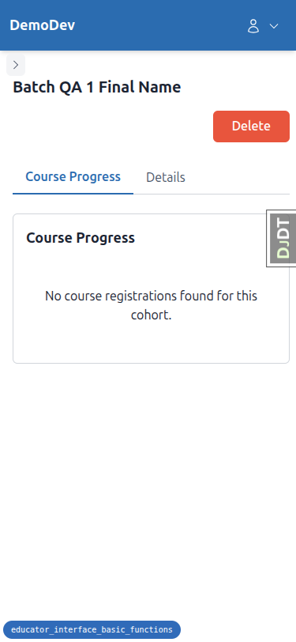
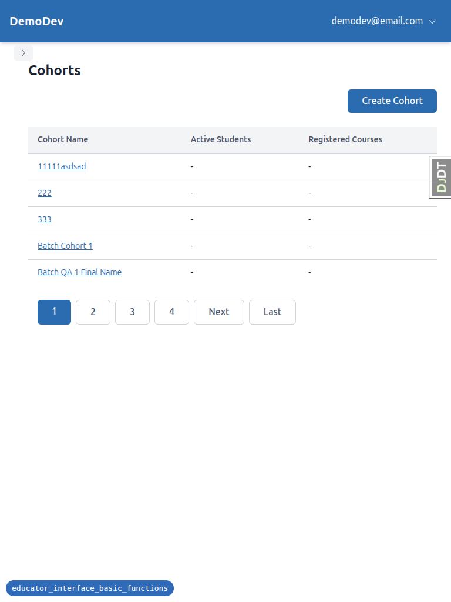
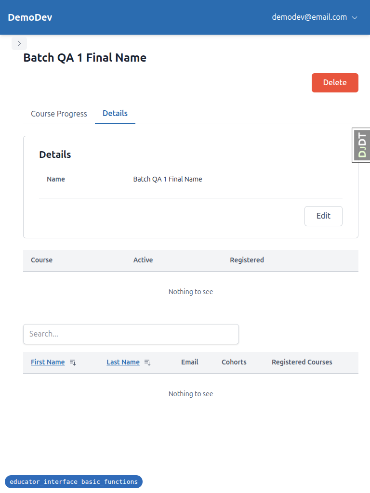

# QA Report: Educator Interface Basic Functions

**Date:** 2026-03-16
**Branch:** educator_interface_basic_functions
**Tester:** Automated QA via Playwright MCP

---

## Summary

| Test | Result | Notes |
|------|--------|-------|
| Test 1: Existing functionality | PASS | Cohorts, Users, Courses all load correctly |
| Test 2: Create Cohort (Save) | PASS | Creates cohort, redirects to detail page |
| Test 3: Create Cohort (Save and add another) | FAIL | Table does not refresh behind modal |
| Test 4: Duplicate name validation (Save) | PASS | Error shown, correction works |
| Test 5: Duplicate name validation (Save and add another) | PASS | Error shown, button resets, correction works |
| Test 6: Empty name validation | PASS | Browser required-field validation works |
| Test 7: Modal dismissal without saving | FAIL | Form retains previous input on reopen |
| Test 8: Permission check (Create) | NOT TESTED | Requires non-admin user |
| Test 9: Tabs — Initial load | PASS | Two tabs, Course Progress active |
| Test 10: Tabs — Lazy load second tab | PASS | Details loads, switching is instant |
| Test 11: Tabs — Panel HTMX reload within tabs | NOT TESTED | No data for pagination/sorting |
| Test 12: Tabs — HTMX reload after tab switch | NOT TESTED | No data for pagination/sorting |
| Test 13: Tabs — URL updates on tab switch | PASS | URLs update correctly |
| Test 14: Tabs — Direct URL access | PASS | Direct URL loads correct tab |
| Test 15: Tabs — Browser back/forward | PASS | History navigation works |
| Test 16: Edit Cohort | PASS (minor issue) | Panel updates, but page heading doesn't |
| Test 17: Edit Cohort — Validation errors | PASS | Duplicate and empty validation work |
| Test 18: Edit Permission check | NOT TESTED | Requires non-admin user |
| Test 19: Delete Cohort — With related records | FAIL | No cascade summary shown |
| Test 20: Delete Cohort — No related records | PASS | Deletes and redirects correctly |
| Test 21: Delete Permission check | NOT TESTED | Requires non-admin user |
| Test 22: Loading indicators | PASS | "Deleting..." text observed on delete button |
| Test 23: Double-click prevention | NOT TESTED | Difficult to verify via automation |
| Test 24: Mobile responsiveness | PASS | Good layout at all breakpoints |

---

## Errors

### 1. "Save and add another" does not refresh data table behind modal

**Test:** Test 3 — Create Cohort (Save and add another)

**Expected:** After clicking "Save and add another", the data table behind the modal should refresh to show the newly created cohort.

**Actual:** The form clears and the modal stays open (correct), but the data table behind the modal does NOT refresh. The new cohorts only appear after a full page reload.



---

### 2. Create Cohort modal does not clear form on dismiss

**Test:** Test 7 — Modal dismissal without saving

**Expected:** When the modal is closed (via X button or Escape) and reopened, the form should have an empty name field.

**Actual:** The previously typed name persists in the form when the modal is reopened. This is because the modal DOM is not reset on close.



---

### 3. Delete confirmation modal missing cascade summary

**Test:** Test 19 — Delete Cohort with related records

**Expected:** The delete confirmation modal should show a summary of related records that will be deleted (e.g., "3 cohort memberships").

**Actual:** The modal only shows "Are you sure you want to delete **QA Delete Test Cohort**?" with no mention of the 3 cohort memberships that will be cascade-deleted.



---

### 4. Page heading not updated after editing cohort name

**Test:** Test 16 — Edit Cohort (minor issue)

**Expected:** After editing the cohort name, the page heading (h1) should update to reflect the new name.

**Actual:** The details panel correctly shows the updated name ("Batch QA 1 Renamed"), but the page heading still displays the old name ("Batch QA 1"). This is because only the panel refreshes via HTMX, not the page heading.



---

## Tangential Issues

### Alpine.js CSP Error on every page

Every page in the educator interface logs a console error:
```
Alpine Expression Error: CSP Parser Error
```
This suggests Alpine.js CSP compatibility is not fully working. The error appears on all pages but does not seem to affect functionality.

---

## Tests Not Run

- **Tests 8, 18, 21 (Permission checks):** These require logging in as a user without specific permissions. No such user was available in the test environment.
- **Tests 11, 12 (Panel HTMX reload within/after tabs):** These require a cohort with enough students/data to trigger pagination and sorting controls. The test data was insufficient.
- **Test 23 (Double-click prevention):** Difficult to reliably test via automated tools — would need manual verification.

---

## Responsive Testing Summary

### Mobile (375x812)
- Sidebar collapses to hamburger menu — works correctly
- Tables fit within viewport
- Modals centered and usable
- Pagination simplified to "Page X of Y" format
- All buttons accessible






### Tablet (768x1024)
- Sidebar collapsed (mobile nav) — works correctly
- Tables render with full column headers
- Full pagination controls shown
- Layout is clean and spacious



