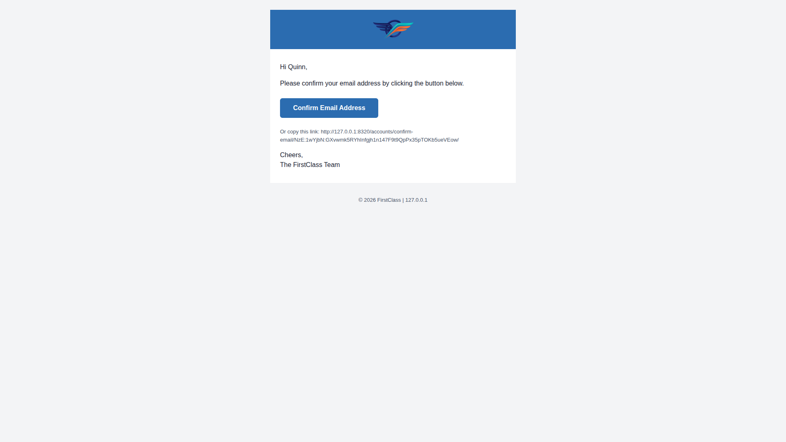

# QA Report — Theme & site branding in emails

**Date:** 2026-06-14
**Branch:** `email-styling`
**Method:** Real emails triggered through the dev server, inspected in Mailpit
(raw HTML source via the Mailpit API + rendered preview via Playwright MCP).
**Active theme:** `default` (`FLS_THEME` defaults to `"default"`; dev settings do
not override it). The plain-text label is `FirstClass` (`HEADER_TITLE`), the logo
resolves to `images/first_class_logo.png`.

## Result summary

| Test | Description | Result |
|------|-------------|--------|
| 1 | Email-verification email (signup) | ✅ PASS |
| 2 | Password-reset email | ✅ PASS |
| 3 | Login-code email | ⏭️ SKIPPED — page not enabled (404), per test-plan instruction |
| 4 | Plain-text part | ✅ PASS |
| 5 | Text-label fallback (no logo) | ✅ PASS |
| 6 | Email-logo override precedence | ✅ PASS |

**No bugs were found.** The core bug fix (absolute logo URL) is confirmed working,
and every branding expectation in the plan held.

---

## Test 1 — Email verification email (signup) ✅

Registered a fresh account (`qa_verify_fresh01@email.com`) at `/accounts/signup/`,
which sent **"[Demo] Confirm your email address"**.

Verified against the raw HTML source:

- **Logo image loads** — the FirstClass winged logo renders at the top (not a
  broken-image icon).
- **Fully-qualified `src`** — the core bug fix:
  `src="http://127.0.0.1:8320/static/images/first_class_logo.png"` (begins with
  `http://`, not a bare `/static/...`).
- **Alt text is `FirstClass`** (`alt="FirstClass"`), the resolved label =
  `HEADER_TITLE`, not `DemoDev`.
- **Theme colours** — header band `#2b6cb0`, button `#2b6cb0`, body text
  `#1a2332`, footer/secondary `#4a5568`, surfaces `#fff`/`#ffffff`, page bg
  `#f3f4f6`.
- **No modern colour syntax** — searching the source for `oklch`, `oklab`,
  `color-mix`, `var(`, `hsl(`, `rgb(` returns **nothing**; every colour is hex.
- **Button radius** — `border-radius: 0.375rem`, the correct value for the active
  `default` theme. (The plan notes `first_class → 0.5rem`; that theme is not
  active here, so `0.375rem` is expected.)
- **Email-safe font** — `font-family: "Helvetica Neue", Arial, sans-serif`.
- **Sign-off / footer** — "The FirstClass Team" and "© 2026 FirstClass | 127.0.0.1".

---

## Test 2 — Password reset email ✅

Triggered a reset for `demodev_s1@email.com` at `/accounts/password/reset/`,
which sent **"[Demo] Reset your password"**.

- Same branding as Test 1: absolute logo URL
  (`http://127.0.0.1:8320/static/images/first_class_logo.png`), `alt="FirstClass"`,
  theme colours, `border-radius: 0.375rem`, email-safe font, **no modern colour
  syntax**.
- **"Reset Password"** button is present and styled with the theme primary colour
  (`background-color: #2b6cb0`, white text).
- Sign-off reads **"The FirstClass Team"**; footer shows the site domain
  (`© 2026 FirstClass | 127.0.0.1`).

---

## Test 3 — Login-code email ⏭️ SKIPPED

`/accounts/login/code/` returns **HTTP 404** — login-by-code is not enabled on
this build. The test plan explicitly says "If it 404s, skip this test", so this
is a legitimate skip, not a data gap.

---

## Test 4 — Plain-text part ✅

Inspected the **Text** part of the password-reset email.

- Site identity / sign-off uses the label **`FirstClass`**
  ("We received a request to reset your password for your account at FirstClass",
  "The FirstClass Team").
- **No image references** and **no `/static/...` URLs** in the text part (the only
  link is the reset action URL, which is expected).
- Footer line shows the site domain: `FirstClass | 127.0.0.1`.

---

## Test 5 — Text-label fallback (no logo configured) ✅

Temporarily set `HEADER_LOGO_STATIC_PATH = None` in `config/settings_dev.py`
(`EMAIL_LOGO_STATIC_PATH` left unset), restarted `runserver`, and triggered a
password-reset email.

- **No `` logo** in the source.
- Instead, a **text heading** showing the label in the header band:
  `<h1 style="margin: 0; color: #ffffff; ...">FirstClass</h1>` (white text on the
  `#2b6cb0` band).
- Everything else (colours, radius `0.375rem`, font, button) still themed.

`config/settings_dev.py` was restored afterwards.

---

## Test 6 — Email logo override precedence ✅

Set `EMAIL_LOGO_STATIC_PATH = "ninja/favicon.png"` (a different existing static
image) while `HEADER_LOGO_STATIC_PATH` remained `images/first_class_logo.png`,
restarted `runserver`, and triggered an email.

- The email's logo `src` was
  `http://127.0.0.1:8320/static/ninja/favicon.png` — i.e. the explicit
  **`EMAIL_LOGO_STATIC_PATH` wins** over `HEADER_LOGO_STATIC_PATH`, as expected.
- Note: for this image the `` omitted an explicit `width` and used
  `width: auto; height: 48px` (the height is pinned and width scales) — graceful
  handling when the configured image's aspect ratio differs; not a defect.

`config/settings_dev.py` was restored afterwards (confirmed clean via
`git diff`).

---

## Supplementary — responsive rendering (mobile / tablet)

The emails are fixed `max-width: 600px; width: 100%` table layouts, so true
rendering depends on the mail client. As a supplementary check, the password-reset
email was rendered in the Mailpit preview at mobile (375×812) and tablet
(768×1024) viewports:

- **Mobile (375px):** content fills the viewport fluidly, no horizontal overflow;
  the long reset URL wraps within the container.
- **Tablet (768px):** the 600px content table centres with the page background
  filling the remainder; button and logo render correctly.

---

## Notes / observations

- During Test 5/6 the dev server auto-reloads on each `settings_dev.py` edit. One
  password-reset submission landed mid-reload and produced a transient browser
  error (no email sent); retrying after the reload completed worked. This is a
  dev-server timing artifact, **not** an application bug.
- An earlier signup attempt with `qa_verify_1@email.com` returned an
  **"[Demo] Account already exists"** email instead of a confirmation (the address
  already existed in the dev DB from a prior run). Using a genuinely fresh address
  produced the expected confirmation email. Worth noting only as a testing
  gotcha — the account-exists email is correct behaviour.
- `config/settings_dev.py` was edited and restored twice during Tests 5 and 6;
  `git diff config/settings_dev.py` is empty at the end of the run.
