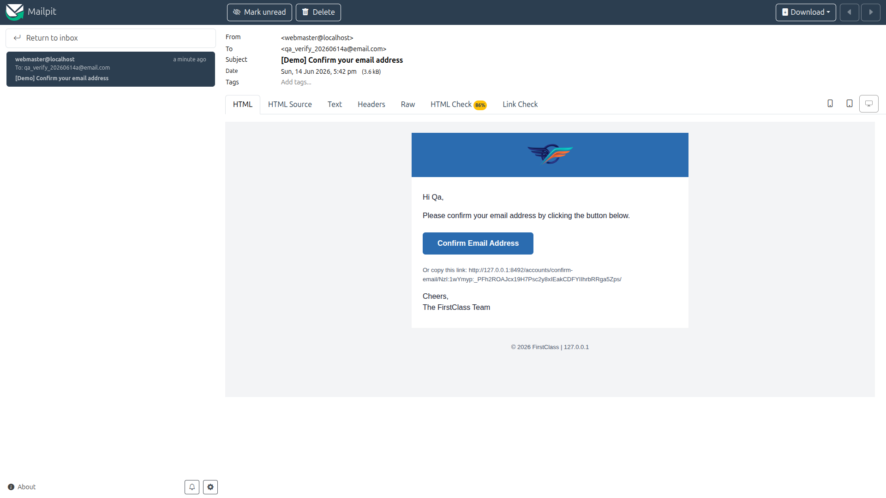
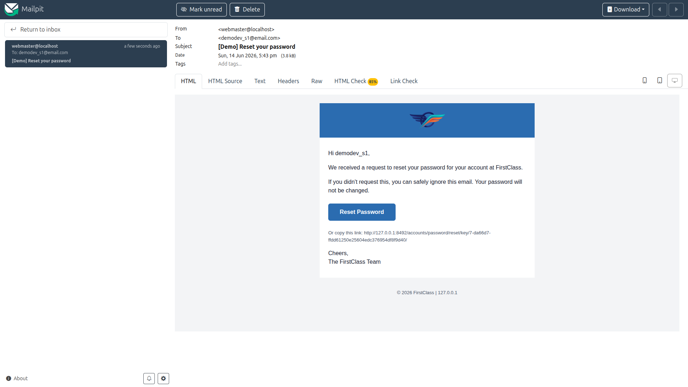
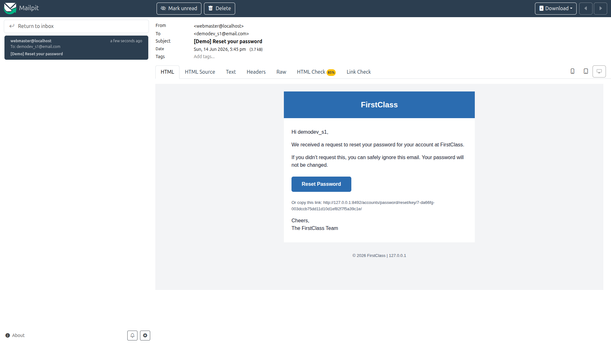
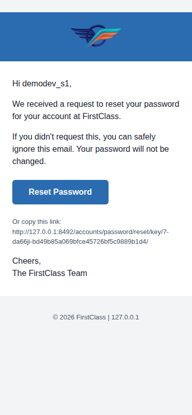
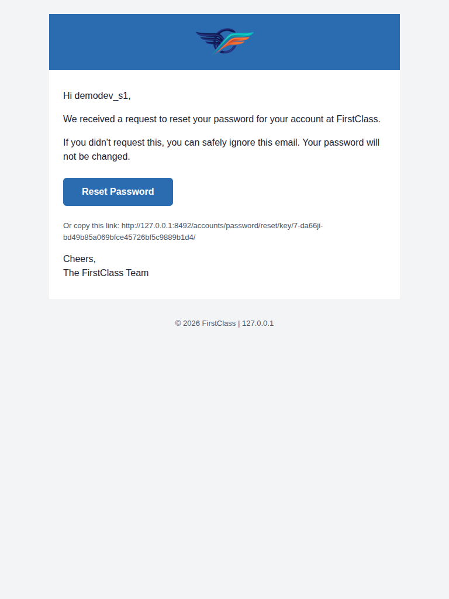

# QA Report — Theme & site branding in emails

**Feature:** email-styling (theme & site branding in transactional emails)
**Date:** 2026-06-14
**Branch:** `email-styling` (confirmed via `debug-branch-badge`)
**Environment:** dev server on port 8492, Mailpit at `http://localhost:8025`, `DemoDev` site
**Tooling:** Playwright MCP (desktop 1920×1080, mobile 375×812, tablet 768×1024); email HTML/text inspected via the Mailpit API.

## Summary

**No bugs found.** All executable tests passed. The core bug fix — logo `src` being a
fully-qualified `http://.../static/...` URL rather than a bare `/static/...` URL — is confirmed
working, along with theme colours, email-safe fonts, button radius, the text-label fallback,
and the email-logo override precedence.

One test (Test 3, login-by-code email) was **skipped** because the feature is not enabled in
this environment — see "Tests not executed" below. This is per the test plan's own instruction
and is **not** a defect or a missing-data gap.

| Test | Description | Result |
|------|-------------|--------|
| 1 | Email verification (signup) | ✅ PASS |
| 2 | Password reset email | ✅ PASS |
| 3 | Login-code email | ⏭️ SKIPPED (feature disabled — `/accounts/login/code/` returns 404, per plan) |
| 4 | Plain-text part | ✅ PASS |
| 5 | Text-label fallback (no logo) | ✅ PASS |
| 6 | Email logo override precedence | ✅ PASS |
| — | Mobile (375px) rendering | ✅ PASS |
| — | Tablet (768px) rendering | ✅ PASS |

---

## Test 1 — Email verification email (signup flow) — PASS

Registered a fresh account (`qa_verify_20260614a@email.com`) via `/accounts/signup/`; the
"Confirm your email address" email landed in Mailpit.

All expectations met:
- **Logo loads from an absolute URL** — `src="http://127.0.0.1:8492/static/images/first_class_logo.png"`. No bare `/static/...` references anywhere. Logo URL returns `200 image/png`.
- **Alt text reads `FirstClass`** (the resolved label = `HEADER_TITLE`), not `DemoDev`. The string `DemoDev` does not appear anywhere in the HTML.
- **Theme colours applied** — header band/button/links use the theme primary `#2b6cb0`; body text uses theme foreground (`#1a2332` / `#4a5568`).
- **No modern colour syntax** — searching the source for `oklch`, `oklab`, `color-mix`, `var(`, `hsl(`, `rgb(` returns zero matches. Every colour is `#rrggbb` hex (`#1a2332`, `#2b6cb0`, `#4a5568`, `#f3f4f6`, `#ffffff`).
- **CTA button radius** — `border-radius: 0.375rem` (default-theme value; the plan lists this as acceptable).
- **Email-safe font** — `font-family: "Helvetica Neue", Arial, sans-serif`.

> Note (not a defect): a first attempt with `qa_verify_1@email.com` produced allauth's
> "Account already exists" email instead of a confirmation, because that address was left over
> from a prior run. Using a genuinely fresh address produced the expected confirmation email.
> This is correct allauth enumeration-protection behaviour.

## Test 2 — Password reset email — PASS

Triggered a reset for `demodev_s1@email.com` via `/accounts/password/reset/`.

- Same branding as Test 1: absolute-URL logo, alt `FirstClass`, theme colours/font, `border-radius: 0.375rem`, no modern colour syntax.
- "**Reset Password**" button present and styled with the theme primary colour (`#2b6cb0`).
- Sign-off reads "**The FirstClass Team**"; footer shows the site domain (`© 2026 FirstClass | 127.0.0.1`).

## Test 3 — Login-code email — SKIPPED (feature disabled)

`http://127.0.0.1:8492/accounts/login/code/` returns **HTTP 404**. The test plan explicitly
states "If it 404s, skip this test." Login-by-code is not enabled in this environment, so the
test is not applicable. No test data could change this (it is a disabled URL/feature, not
missing data), so `fls:qa-data-helper` was not invoked for it.

## Test 4 — Plain-text part — PASS

Inspected the `text/plain` part of the Test 1 verification email:
- Sign-off uses the label "**The FirstClass Team**".
- **No image references** and **no `/static/...` URLs** in the text part.
- Footer line shows the site domain: `FirstClass | 127.0.0.1`.

## Test 5 — Text-label fallback (no logo) — PASS

Temporarily set `HEADER_LOGO_STATIC_PATH = None` (leaving `EMAIL_LOGO_STATIC_PATH` unset) in
`config/settings_dev.py`, let `runserver` autoreload, and re-triggered a reset email.

- **No `` logo** in the HTML (0 img tags); instead a **text heading "FirstClass"** rendered in the themed header band.
- All other branding (header band colour, button, font, footer) still applied.
- `config/settings_dev.py` was restored afterwards (verified: `git diff` clean).

## Test 6 — Email logo override precedence — PASS

Temporarily set `EMAIL_LOGO_STATIC_PATH = "admin/img/icon-yes.svg"` (a different existing
static image) alongside the restored `HEADER_LOGO_STATIC_PATH`, and re-triggered an email.

- The email shows the **`EMAIL_LOGO_STATIC_PATH`** image (`http://127.0.0.1:8492/static/admin/img/icon-yes.svg`, the green check) — the explicit email setting wins over `HEADER_LOGO_STATIC_PATH`. `first_class_logo` does not appear in the HTML.
- `config/settings_dev.py` was restored afterwards (verified: `git diff` clean).

---

## Responsive rendering

The "frontend" under test is the rendered HTML email. The branded reset email was viewed at
mobile and tablet widths via Mailpit's raw HTML body view.

**Mobile (375×812):** No horizontal overflow (`scrollWidth == clientWidth == 375`). Logo,
header band, button, and copy all render readably; the CTA button is a comfortable touch target.

**Tablet (768×1024):** No horizontal overflow. The email stays in its centred max-width
container with branding intact.

---

## Tests not executed / difficulties

- **Test 3 (login-code email)** — skipped because `/accounts/login/code/` returns 404 (feature
  disabled). The test plan instructs skipping in this case. Not a defect; not a missing-data
  gap.
- **QA student creation** — the standard `qa_create_course_player_student DemoDev` command
  failed (`Course 'functionality-demo-course-parts' not found on site 'DemoDev'`) because
  DemoDev has no demo course. The email tests only need a user account, so the
  `fls:qa-data-helper` agent provisioned `demodev_s1@email.com` directly (active + verified) via
  `qa_create_password_reset_student`. This is an environment data note, not a defect in the
  feature under test.

## Observations unrelated to the feature

- The dev server log repeatedly emits `Rejected site domain '127.0.0.1:8003' as a legal-docs
  directory name; falling back to _default only`. This is unrelated to email branding (it
  concerns legal-docs directory naming for a site domain) but is noted here for visibility.
