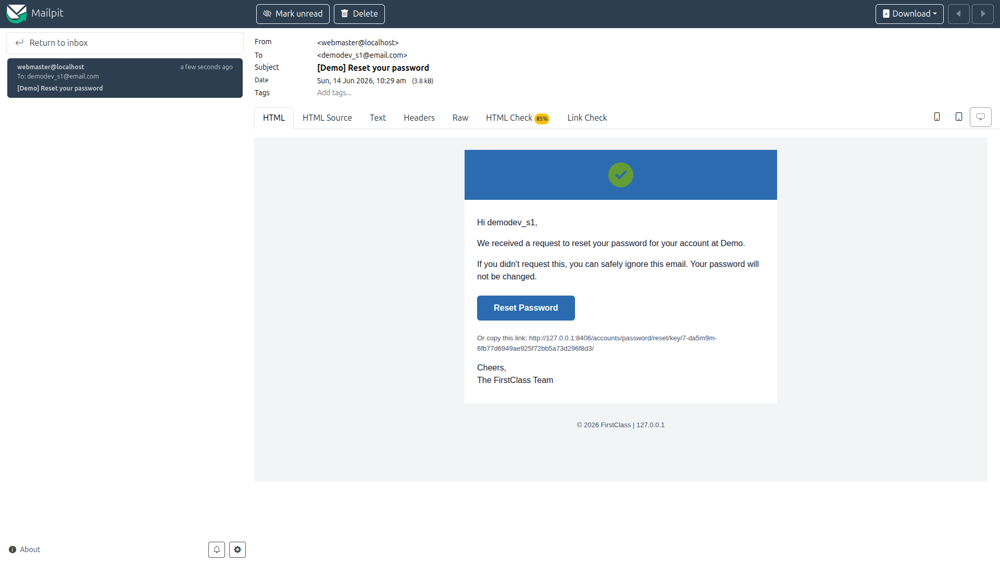
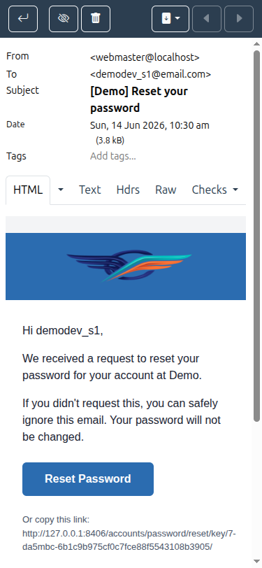
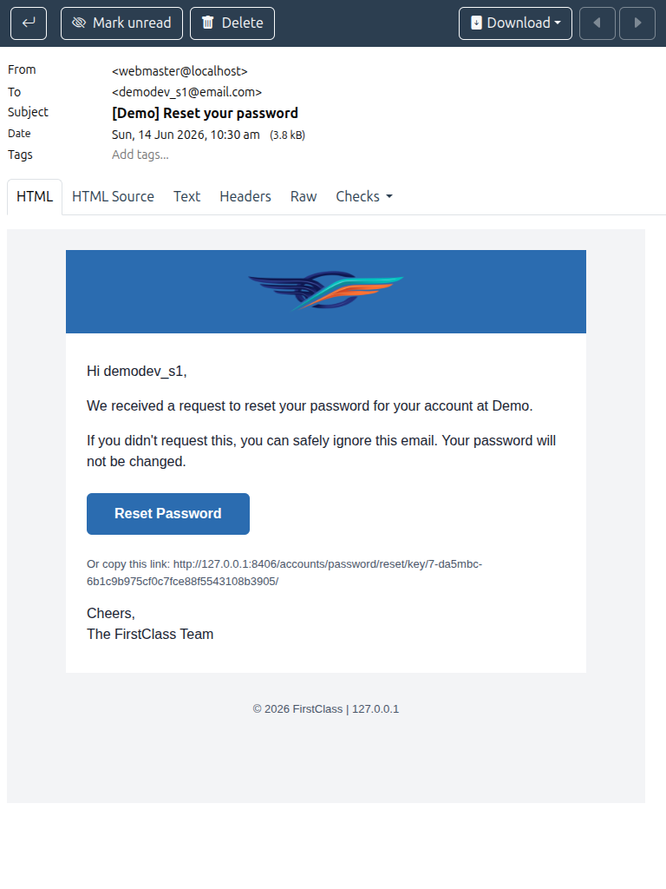

# QA Report — Theme & site branding in emails

**Date:** 2026-06-14
**Branch:** `email-styling`
**Environment:** dev server on a random port, emails inspected in **Mailpit**
(`http://localhost:8025`). Active site `DemoDev` (`FORCE_SITE_NAME`), active
theme `default` (`FLS_THEME` defaults to `"default"` — not overridden in dev),
resolved email label `FirstClass` (`HEADER_TITLE`).

## Summary

**No failing tests.** All executable tests passed. Test 3 (login-by-code) was
legitimately skipped because the feature is not enabled (the page 404s, which the
test plan explicitly allows). One **tangential, pre-existing** observation is
noted at the bottom — it is outside the scope of this feature and is **not** a
bug in the email-branding work.

| Test | Description | Result |
|------|-------------|--------|
| 1 | Email verification email (signup) | ✅ Pass |
| 2 | Password reset email | ✅ Pass |
| 3 | Login-code email | ⏭️ Skipped — page not available (404), allowed by plan |
| 4 | Plain-text part | ✅ Pass |
| 5 | Text-label fallback (no logo) | ✅ Pass |
| 6 | Email-logo override precedence | ✅ Pass |
| — | Mobile (375px) & Tablet (768px) email rendering | ✅ Pass |

---

## Test 1 — Email verification email (signup flow) ✅

Registered a fresh account (`qa_fresh_0614a@email.com`) through
`/accounts/signup/`; the "Confirm your email address" email arrived in Mailpit.

Verified against the rendered HTML source:

- **Logo loads from an absolute URL** — `src="http://127.0.0.1:8406/static/images/first_class_logo.png"`
  (fully-qualified `http://…/static/…`, not a bare `/static/…`). The image
  actually rendered in Mailpit (naturalWidth 512 — not a broken-image icon), and
  the URL serves `HTTP 200 image/png`.
- **Alt text is `FirstClass`** (the resolved label = `HEADER_TITLE`), not `DemoDev`.
- **No modern CSS colour syntax** anywhere in the source — searches for `oklch`,
  `oklab`, `color-mix`, `var(`, `hsl(`, and `rgb(` all return **0**. Every colour
  is `#rrggbb` hex. Notably, the theme CSS uses `color-mix(in oklch, …)` for hover
  colours, and these are correctly flattened to hex in the email (the core feature).
- **Theme colours applied** — header band / button background `#2b6cb0`
  (`--color-primary`), body text `#1a2332` (`--color-on-surface`), button text
  `#fff` (`--color-on-primary`). All match the `default` theme tokens.
- **Button radius `6px`** = `0.375rem` = the `default` theme's `--radius-md`
  (correct for the active theme; `first_class` would be `0.5rem`).
- **Font** is an email-safe sans-serif stack: `"Helvetica Neue", Arial, sans-serif`.

---

## Test 2 — Password reset email ✅

Triggered a reset for `demodev_s1@email.com` via `/accounts/password/reset/`.

- Same branding as Test 1: absolute logo URL, `FirstClass` alt text, all-hex
  colours, no modern colour syntax, `6px` radius, email-safe font.
- **"Reset Password" button** present and styled with the theme primary colour:
  the wrapping `<td>` carries `background-color: #2b6cb0; border-radius: 6px;`
  with white link text (the email-safe button pattern).
- **Sign-off reads "The FirstClass Team"** (resolved label).
- **Footer shows the site domain** — `© 2026 FirstClass | 127.0.0.1`.

---

## Test 3 — Login-code email ⏭️ Skipped

`/accounts/login/code/` returns **HTTP 404** — login-by-code is not enabled on
this build. The test plan states: *"If it 404s, skip this test."* Skipped as
directed; no data gap (this is a feature-availability condition, not missing data).

---

## Test 4 — Plain-text part ✅

Inspected the `text/plain` part of the password-reset email:

- Sign-off uses the label — **"The FirstClass Team"**.
- **No image references** and **no `/static/…` URLs** (verified programmatically:
  `/static/` absent, `.png`/`` logo** in the HTML (0 img tags).
- Instead, a **text heading** renders in the header band:
  `<h1 style="…color:#ffffff…">FirstClass</h1>` — the resolved label, white on the
  primary-coloured header band.
- Everything else still themed (colours, font, button, sign-off, footer).
- **`config/settings_dev.py` was restored afterwards** (verified: `git diff` is empty).

---

## Test 6 — Email-logo override precedence ✅

Temporarily set `EMAIL_LOGO_STATIC_PATH = "admin/img/icon-yes.svg"` (a different
existing static asset) while leaving `HEADER_LOGO_STATIC_PATH` pointed at the
FirstClass logo; reloaded and re-triggered a reset email.

- The email's logo `src` became
  `http://127.0.0.1:8406/static/admin/img/icon-yes.svg` — the explicit
  `EMAIL_LOGO_STATIC_PATH` **wins over** `HEADER_LOGO_STATIC_PATH`, as designed.
- **`config/settings_dev.py` was restored afterwards** (verified: `git diff` is empty).

---

## Mobile (375px) & Tablet (768px) email rendering ✅

Transactional emails are rendered by the recipient's mail client, not by the
app's responsive frontend, so the classic mobile/tablet concerns (hamburger nav,
HTMX drawers, data tables) don't apply. As a sanity check, the branded email body
was measured inside the Mailpit preview at both viewports:

- **Mobile (375px):** the fluid outer table shrank to ~354px (`width:100%` with a
  `max-width:600px` container) with no significant horizontal overflow.
- **Tablet (768px):** content stayed centred within its 600px max-width; no overflow.

| Mobile | Tablet |
|--------|--------|
|  |  |

---

## Tangential observation (pre-existing, out of scope — not a bug in this feature)

The allauth password-reset **body copy** reads *"…your account at **Demo**."* The
identity **"Demo"** is neither the forced site name (`DemoDev`) nor the resolved
branding label (`FirstClass`) used everywhere else in the email. It comes from
`{{ current_site.name }}` in
`freedom_ls/accounts/templates/account/email/password_reset_key_message.{html,txt}`,
which resolves via Django/allauth's request-host matching to the `Site` with
domain `127.0.0.1` (name **"Demo"**, id 2) — distinct from the FLS
`FORCE_SITE_NAME="DemoDev"` site used for site-aware logic.

Why it is **not** a finding against this feature:

- These `account/email/` templates are **pre-existing on `main`** and were **not
  modified by the `email-styling` branch** (its email work lives entirely in
  `freedom_ls/accounts/templates/emails/` — `base_email`, `header`, `sign_off`,
  all of which correctly use the resolved `FirstClass` label).
- It also means the test plan's prerequisite note ("`current_site.name` is
  `DemoDev`") does not hold inside the email-sending context — worth correcting in
  the doc, but again unrelated to the branding code under test.

Flagging it only so the team is aware that body copy in the allauth message
templates can surface a third site identity inconsistent with the email branding.
