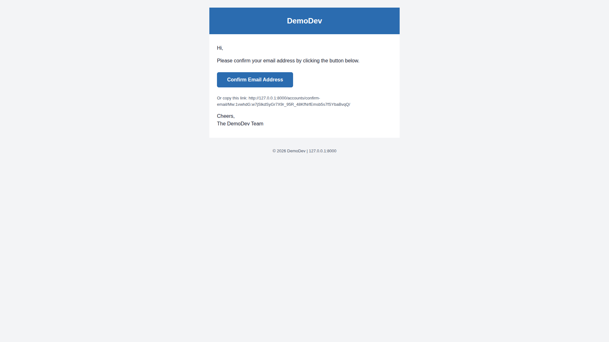
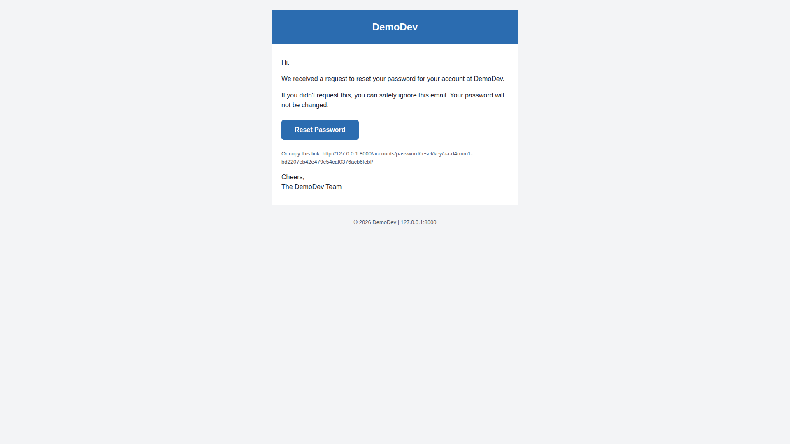
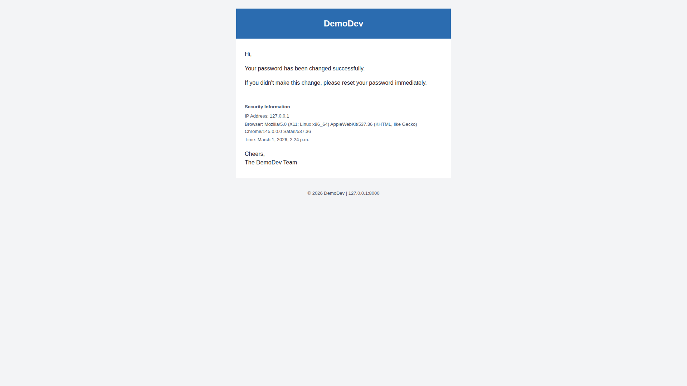
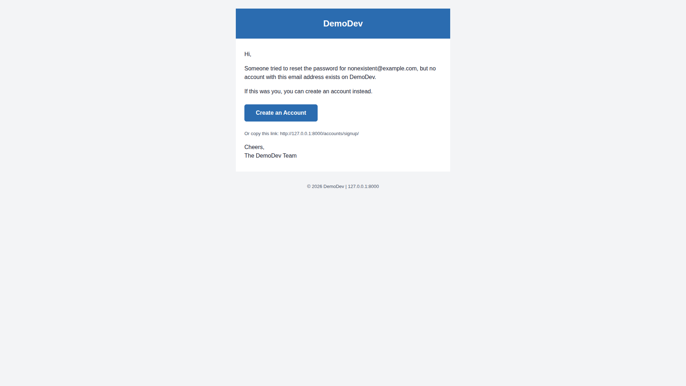
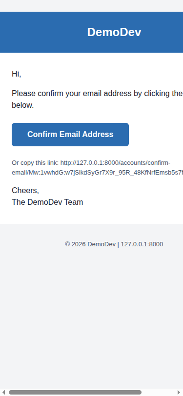
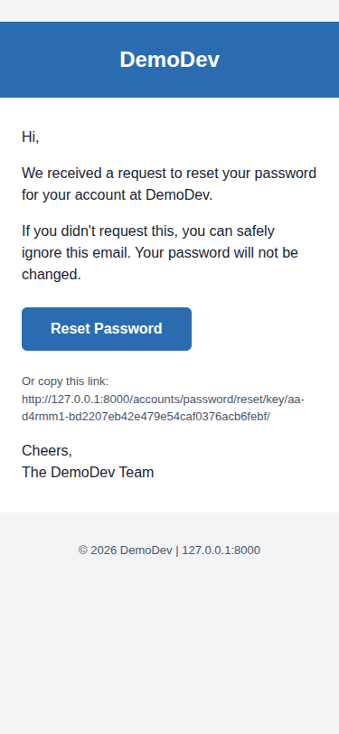
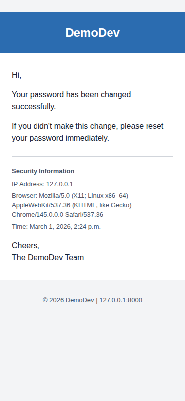
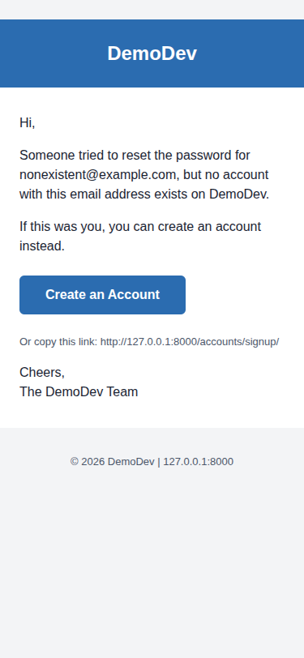
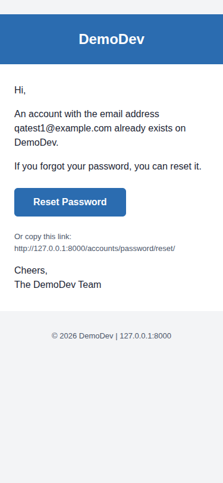
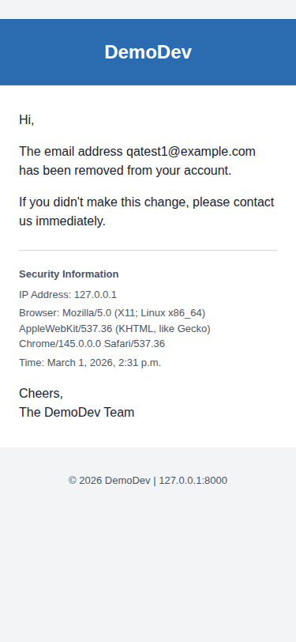

# QA Report: Professional Branded Email Templates

**Date:** 2026-03-01
**Tester:** Claude (Automated QA via Playwright MCP)
**Branch:** email_templates

## Summary

| Test | Result | Notes |
|------|--------|-------|
| Test 1: Signup Confirmation Email | PASS | |
| Test 2: Password Reset Email | PASS | |
| Test 3: Login Code Email | SKIPPED | Login code flow not enabled in settings |
| Test 4: Password Changed Notification | PASS | |
| Test 5: Email Size Check | PASS | All emails well under 100KB (largest: 2,602 bytes) |
| Test 6: Logo Fallback | PASS | |
| Test 7: Logo Display | PASS | |
| Test 8: Mobile Responsiveness | PASS | |
| Test 9: Unknown Account Email | PASS | |
| Test 10: Account Already Exists Email | PASS | |
| Test 11: Email Changed Notification | PASS | Fixed: was failing with 500 error, see fix details below |
| Test 12: Email Deleted Notification | PASS | |
| Test 13: Multipart Format Verification | PASS | All emails are multipart/alternative |
| Test 14: Cross-Client Rendering Check | PASS | (browser rendering only, no actual email client testing) |

**Result: 13 PASS, 0 FAIL, 1 SKIPPED**

---

## Bugs Found and Fixed

### BUG (FIXED): Email Changed Notification Fails with TypeError (Test 11)

**Test:** Test 11 - Email Changed Notification

**Root Cause:** `TypeError: AccountAdapter.send_notification_mail() got an unexpected keyword argument 'email'`

The allauth `emit_email_changed()` function in `allauth/account/internal/flows/manage_email.py` (line 128) passes an `email` keyword argument to `send_notification_mail()`, but the custom `AccountAdapter.send_notification_mail()` did not accept this parameter.

**Fix applied:** Updated `AccountAdapter.send_notification_mail()` in `freedom_ls/accounts/allauth_account_adapter.py` to accept and pass through the `email: str | None = None` keyword argument.

**Verified:** After the fix, changing the primary email successfully sends a branded notification email to the old primary address with security information (IP, browser, timestamp).

---

## Desktop Screenshots

### Test 1: Signup Confirmation Email

### Test 2: Password Reset Email

### Test 4: Password Changed Notification

### Test 9: Unknown Account Email

### Test 10: Account Already Exists Email

### Test 12: Email Deleted Notification

---

## Mobile Screenshots (375px width)

### Test 1: Signup Confirmation (Mobile)

### Test 2: Password Reset (Mobile)

### Test 4: Password Changed (Mobile)

### Test 9: Unknown Account (Mobile)

### Test 10: Account Exists (Mobile)

### Test 12: Email Deleted (Mobile)

---

## Mobile Responsiveness Notes

All email templates render correctly at 375px mobile width:
- Table-based layout uses `max-width: 600px; width: 100%` and adapts to narrow screens
- Content does not overflow horizontally
- Text remains readable
- Buttons are appropriately sized for touch targets
- Long URLs in "Or copy this link" sections wrap naturally
- Security information sections remain well-formatted

---

## Tests Not Performed

- **Test 3 (Login Code Email):** The login code authentication flow (`LOGIN_BY_CODE`) is not enabled in the dev settings. As noted in the test plan, this is covered by automated tests.
- **Test 14 (Cross-Client Rendering):** Only tested in Chromium browser via Playwright. Production cross-client testing (Gmail, Outlook, Apple Mail) was not performed. HTML structure uses table-based layout with inline styles (premailer), which is the standard approach for email client compatibility.

---

## Tangential Observations

1. **Password Change Page Accessibility Warnings:** When visiting `/accounts/password/change/`, the browser console shows accessibility suggestions: "Password forms should have (optionally hidden) username fields for accessibility" and "Input elements should have autocomplete attributes". These are not bugs in the email templates but could be improved for the password change form.

2. **Favicon 404:** The site returns a 404 for `/favicon.ico`. This is unrelated to email templates but is a minor polish item.
