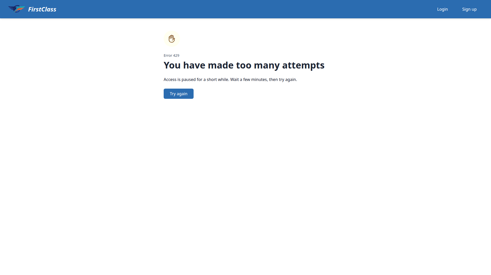
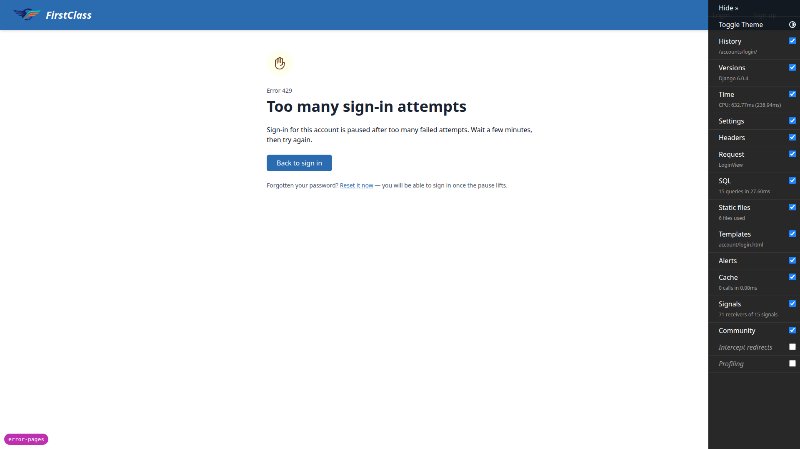
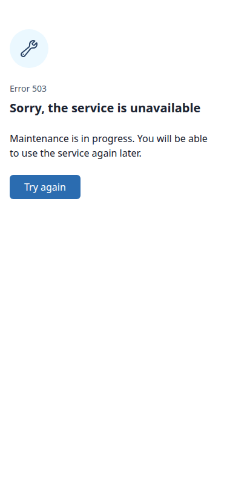
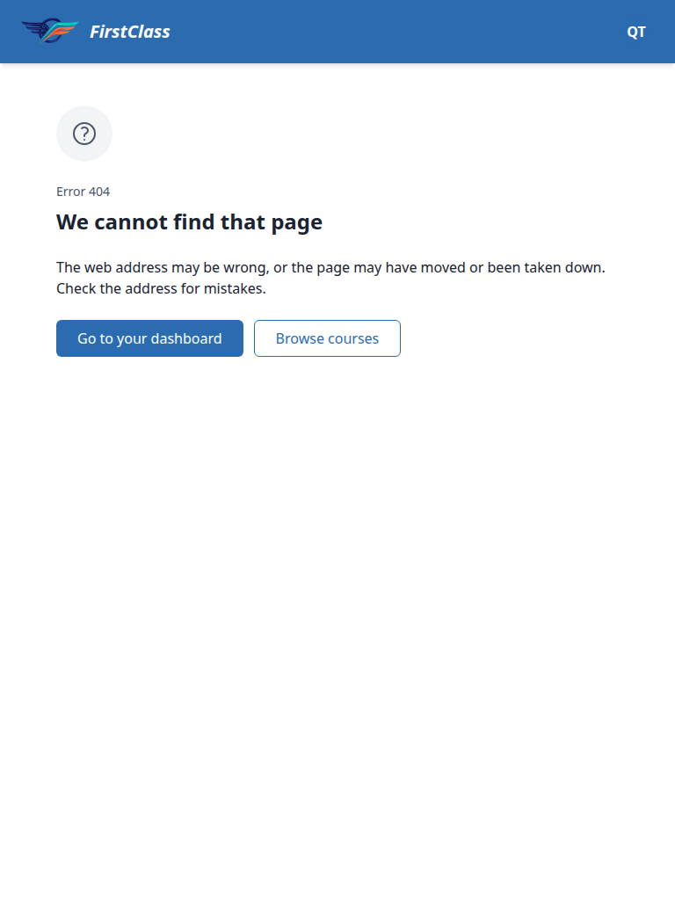
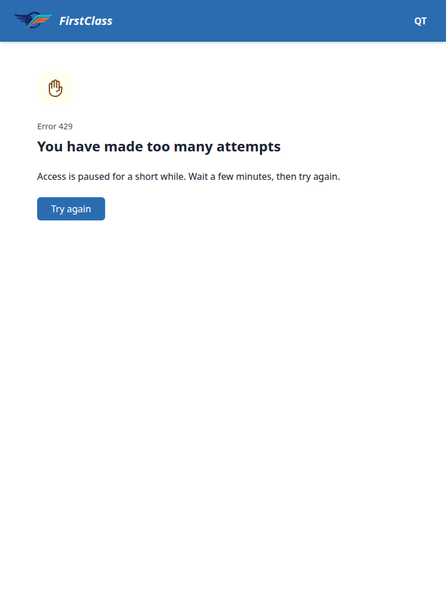
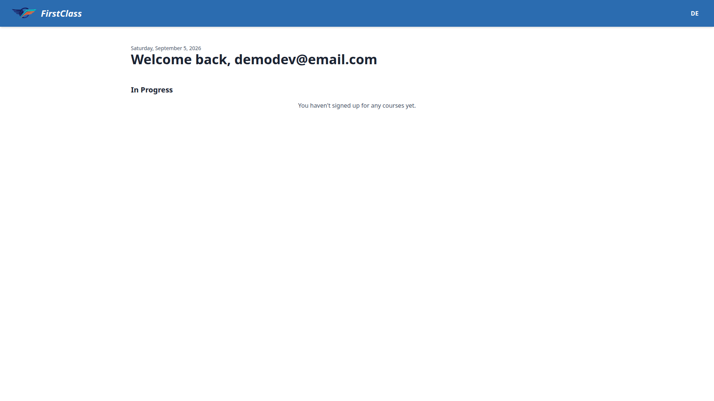
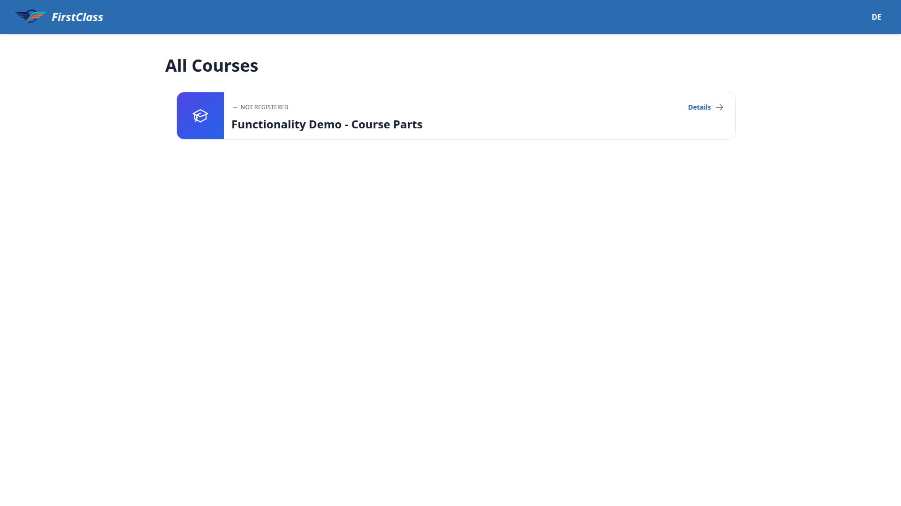
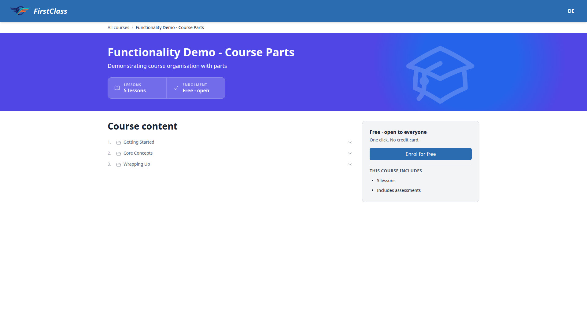
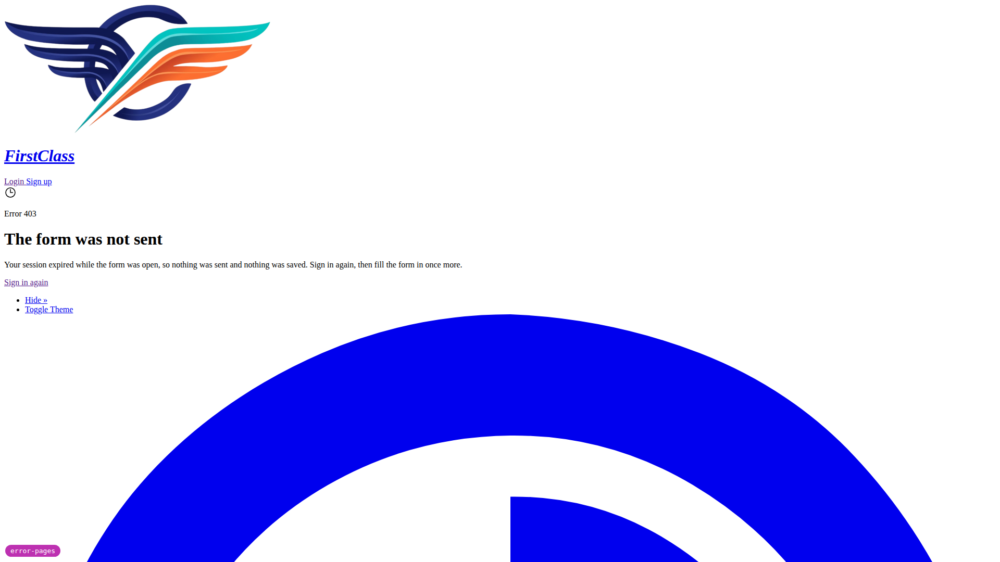

# Frontend QA report: error pages

## Methodology

This run used Playwright MCP driving a real browser against the running FLS dev stack.
Screenshots were collected into `screenshots/` beside this report; every image referenced
below was verified to exist in that directory before writing this report.

The plan requires two servers on the same port, because six of the eight error pages never
render under `DEBUG=True` — Django serves its own yellow traceback / technical debug pages
for `handler404`/`handler403`/`handler400`/`handler500` instead of the project's branded
templates. Only `403_csrf.html` and `429.html` render under `DEBUG=True`.

- **Server A** was the ordinary dev server (`DEBUG=True`). It was used only for §1, the
  axes lockout page (`accounts/lockout.html` is reached through an ordinary
  `render(..., status=429)`, not through an error handler, so it works either way), and for
  the `#debug-branch-badge` check, which only appears when `DEBUG=True`.
- **Server B** then replaced Server A on the same port with `DEBUG=False`, via the
  throwaway `config/settings_qa_check.py` and `config/urls_qa_check.py` scaffolding
  described in the plan's §0.4. This restored `ACCOUNT_RATE_LIMITS` (zeroed under
  `settings_dev`), re-enabled the WhiteNoise finders so static files kept serving without a
  `STATIC_ROOT` build, and added `/qa-error/{400,403,500,503}/` routes for pages Django
  never exposes through a real FLS URL.

The session cookie and database were unchanged across the Server A → Server B swap, so the
sign-in made on Server A survived into Server B without re-authenticating.

The dev database was unseeded at the start of the run (only the `example.com` Site existed,
which 500'd the dashboard with `Site.DoesNotExist` for `FORCE_SITE_NAME='DemoDev'`). This was
fixed by running `uv run python manage.py create_demo_data --yes`. A demo course was also
loaded with `content_save` so the course-player test (§6.3) could run. Both are routine QA
data setup, not findings.

## Diff scoping

Class **FULL**, triggered by the changed template/test/support files:

- `freedom_ls/accounts/templates/accounts/lockout.html`
- `freedom_ls/accounts/tests/test_lockout_page.py`
- `freedom_ls/base/templates/400.html`, `403.html`, `403_csrf.html`, `404.html`, `429.html`, `500.html`, `503.html`
- `freedom_ls/base/templates/cotton/error-page.html`
- `freedom_ls/base/tests/error_pages_urls.py`
- `freedom_ls/base/tests/test_error_page_component.py`
- `freedom_ls/base/tests/test_error_pages.py`
- `freedom_ls/icons/mappings.py`
- `freedom_ls/icons/semantic_names.py`

Nothing was skipped. Desktop, mobile (375x812) and tablet (768x1024) passes all ran in full.

## Smoke gate

**Passed.** Pages checked: `http://127.0.0.1:8237/` and
`http://127.0.0.1:8237/accounts/password/change/`.

## Coverage

### §1 — Lockout page, Server A

| Test | Viewport | Status | Summary |
| --- | --- | --- | --- |
| 1.1 | desktop | pass | Fifth wrong-password submission for `qa-lockout@example.com` returns HTTP 429 with the restyled lockout page (header, "Error 429" label, heading, body, "Back to sign in", "Reset it now"). No countdown/cooldown/attempts-remaining figure; mark is `aria-hidden`. |
| 1.2 | desktop | pass | "Back to sign in" and "Reset it now" both load working forms; neither is a dead end. |
| 1.3 | desktop | pass | Re-submitting the locked address still 429s; `demodev@email.com` with the correct password signs in normally — lockout is keyed on the credential pair, not the IP. |
| 1.4 | desktop | pass | `axes_reset` cleared the lockout; signed back in as `demodev@email.com`. |

### §2 — Server swap / branch badge

| Test | Viewport | Status | Summary |
| --- | --- | --- | --- |
| 2 | desktop | pass | Server B (`DEBUG=False`, `config.settings_qa_check`) serves a fully styled, signed-in dashboard on the same port; stylesheet loads via WhiteNoise finders; session survived the swap; branch badge gone as expected per plan §0.1. |

### §3 — The four Django-served pages

| Test | Viewport | Status | Summary |
| --- | --- | --- | --- |
| 3.1 | desktop | pass | 404 signed in: correct chrome, copy, actions; requested path not present in HTML; `noindex`. |
| 3.2 | desktop | pass | 404 signed out: same panel, signed-out header; both buttons work. |
| 3.3 | desktop | pass | 404's two buttons both go somewhere real. |
| 3.4 | desktop | pass | 403: warning mark, correct copy, no specific admin/course/resource named. |
| 3.4-mobile | mobile | pass | 403 at 375x812: heading wraps, buttons stack, no overflow. |
| 3.5 | desktop | pass | Critical branch: "Sign in as a different account" while signed in shows sign-out confirmation, then the login form — does not bounce back to dashboard. |
| 3.6 | desktop | pass | Same action while signed out lands directly on the login form. |
| 3.7 | desktop | pass | 400 from raised `BadRequest`: correct copy, single action, no retry affordance. |
| 3.8 | desktop | pass | 400 from real `DisallowedHost`: same branded page through real middleware. Deviation from plan's prediction — see General notes. |
| 3.9 | desktop | pass | CSRF 403: correct copy and action; Django's stock CSRF fallback strings absent; site header/stylesheet present. |
| 3.10 | desktop | pass | 500: standalone treatment (no header/logo/user menu), correct copy, no reference code/support link/traceback. |
| 3.10-tablet | tablet | pass | 500 at 768x1024: no header, panel 672px wide, no overflow, actions side by side. |
| 3.11 | desktop | pass | "Try again" reloads the same failing URL and 500s again — no silent 200. |
| 3.12 | desktop | pass | 500's "Go to your dashboard" loads the real dashboard, still signed in. |
| 3.13 | desktop | pass | 503: same standalone treatment, correct copy, single action, nothing implies the service is up. |
| 3.13-mobile | mobile | pass | 503 at 375x812: heading fits one line, single action, no overflow. |
| 3.1-tablet | tablet | pass | 404 at 768x1024: desktop header, panel in max-w-2xl column, actions side by side. |

### §4.1 — The seven hard-429 scopes

| Test | Viewport | Status | Summary |
| --- | --- | --- | --- |
| 4.1-row1-change_password | desktop | pass | Third submission 429s inside the signed-in shell (user menu present); branded page, not allauth's fallback. |
| 4.1-row2-manage_email | desktop | pass | Third "Add email" submission 429s inside the signed-in shell; same branded page. |
| 4.1-row3-reauthenticate | desktop | pass | Third wrong-password submission 429s inside the signed-in shell; same branded page. |
| 4.1-row4-reset_password_from_key | desktop | pass | Reset link collected from Mailpit; third mismatched-password submission 429s in the signed-out shell. |
| 4.1-row5-reset_password | desktop | pass | Second submission 429s (row 4's setup request had already consumed one of the allowance); signed-out shell. |
| 4.1-row6-signup | desktop | pass | Sixth submission 429s, signed-out shell. Signup-form checkbox gotcha noted — see General notes. |
| 4.1-row7-login | desktop | pass | Fourth submission 429s, signed-out shell; not allauth's stylesheet-less fallback. |
| 4.1-tablet | tablet | pass | 429 from account settings re-verified at 768x1024, desktop header/user-menu avatar, no overflow. Scope had reset since the desktop pass (one-minute window) and needed re-tripping — see General notes. |

### §4.2 — The six that do not render this page

| Test | Viewport | Status | Summary |
| --- | --- | --- | --- |
| 4.2-3-login_failed | desktop | pass | Not a 429: ordinary login form re-renders at 200 with the inline "not correct" message. Verified structurally that this scope cannot render the error page in this configuration — see General notes. |
| 4.2-9-confirm_email | desktop | pass | Silent by design: repeat resend inside the window changes nothing on screen. |
| 4.2-10-request_login_code | desktop | skip | Not reachable — `LOGIN_BY_CODE_ENABLED` is off. Recorded per the plan; no browser check required. |
| 4.2-11-verify_phone | desktop | skip | Not reachable — no phone field in signup or login. |
| 4.2-12-change_phone | desktop | skip | Not reachable — same reason as verify_phone. |
| 4.2-13-axes_lockout | desktop | pass | Covered in §1 on Server A (tests 1.1–1.4); not re-run here, per the plan. |

### §4.3 — What must never appear on any 429

| Test | Viewport | Status | Summary |
| --- | --- | --- | --- |
| 4.3 | desktop | pass | Checked every 429 reached (all seven hard-429 scopes plus the axes lockout page). No countdown, ticking timer, "unlocks in N minutes", limit figure, attempts-remaining count, or automatic retry on any of them. Only action is a manual "Try again" (or "Back to sign in" on the lockout page). |

### §5 — Accessibility and resilience

| Test | Viewport | Status | Summary |
| --- | --- | --- | --- |
| 5.1 | desktop | pass | All eight page titles collected and distinct. |
| 5.2 | desktop | pass | Standalone 500/503 each have exactly one `<h1>`; shell pages have two (site-title + error heading), which is the expected FLS header pattern. |
| 5.3 | desktop | pass | Status mark is wrapped `aria-hidden="true"` and absent from the accessibility snapshot on all pages checked (404, 403, 500, 503, 429); severity is readable from the label and heading alone. |
| 5.4 | desktop | pass | Status label and heading text alone distinguish 404 from 500 with no reliance on colour. |
| 5.5 | desktop | **fail** | Bug **B1** — see Per-bug sections below. |
| 5.6 | desktop | pass | `meta name=robots content=noindex` confirmed present on 404, 403, 400, 403_csrf, 429, 500 and 503. |
| 5.7 | mobile | pass | 404 at 375x812: no horizontal overflow, heading wraps, actions stack, touch targets 40–42px. |
| 5.7-500 | mobile | pass | Standalone 500 at 375x812: no overflow, heading wraps, actions stack, panel starts at the top with no header, as designed. |

### §6 — Side-effects on things that already worked

| Test | Viewport | Status | Summary |
| --- | --- | --- | --- |
| 6.1 | desktop | pass | Dashboard, course catalogue, course detail and `/accounts/password/change/` all render unchanged; account pages around the changed `lockout.html` layout still look right. |
| 6.2 | desktop | pass | Lockout page and 429 page match — same mark, label treatment, heading scale, button styling, differing only in words. (Lockout screenshot shows the debug-toolbar panel because it was taken on Server A under `DEBUG=True` — expected, not a finding.) |
| 6.3 | desktop | pass | Both address-bar navigation and a boosted `htmx.ajax` request to a bad course-item index land on the real 404 with the site header, no stale `#interface-main`. |
| 6.4 | desktop | pass | Known gap confirmed as the idea document names it, not as a regression: an htmx 404 outside `#interface-main` changes nothing on screen. |
| 6.5 | desktop | pass | Saving a profile change still raises the usual green "Profile saved" toast; toast system untouched. |

## Evidence

Every screenshot taken during the run, grouped by what it shows. All twenty-one live in
`screenshots/` beside this report.

### The eight pages, desktop (1920x1080)

404 — neutral-grey mark, two actions, and no trace of the requested path:

403 — warning-tinted mark, copy naming "an administrator" generically:

400 from a real `DisallowedHost`, produced by the actual middleware rather than a test view.
Note it rendered styled, contrary to the plan's prediction — see General notes:

403 CSRF — none of Django's stock "CSRF verification failed" / "Request aborted" wording:

500 — the standalone treatment: no header, no logo, no user menu, still styled:

503 — same standalone treatment, info-tinted mark, single action:

429 reached from account settings, rendering inside the signed-in shell:

429 from the `login` scope, signed-out shell:

### §6.2 — the lockout page and the 429 page side by side

The two faces of the same status code. Same mark, same label treatment, same heading scale,
same button styling; only the words differ. The lockout shot carries the django-debug-toolbar
panel because it was taken on Server A under `DEBUG=True`:

### Mobile (375x812)

404, 500, 403 and 503 — no horizontal overflow, headings wrap rather than clip, paired
actions stack:

### Tablet (768x1024)

404 and 500 take the desktop header and sit in their `max-w-2xl` column; the 429 keeps the
signed-in shell:

### §2 and §6 — the server swap and the untouched surfaces

Server B serving a styled, signed-in dashboard after the swap; the course catalogue and
course detail unchanged; the toast system still raising the usual green success toast:

## Per-bug sections

### B1 — Status mark's svg has no intrinsic size, so it fills the viewport when the stylesheet is missing

**Manifestations:**

- 5.5 (desktop)

**Screenshot:**

**Expected:** With the stylesheet gone, the error page still reads top to bottom and its
actions are reachable without scrolling past a decorative element — the deliberate check in
plan §5.5, and the real-world case plan §3.8 raises.

**Actual:** The mark's inline `svg` carries only `viewBox="0 0 24 24"` and the Tailwind class
`size-8`. With no CSS the class does nothing, and the `svg` has no `width`/`height`
attributes to fall back on, so it scales to fill its container: measured 1904x1904px on a
1920x1080 viewport. On the 500 page the "Error 500" label, heading, body and both actions
land at y=1971–2098; on the 404 the error heading lands at y=2324. Source order is correct
and nothing is `display:none` or `visibility:hidden`, so this does **not** breach the letter
of §5.5's "nothing may be hidden" wording — but it defeats the intent of that check, because
the visitor sees only a full-viewport black triangle and must scroll roughly two screens to
reach any text or action. It affects all eight pages via the shared `c-error-page`/`c-icon`
mark, and the root cause — `c-icon` emitting no intrinsic dimensions — is app-wide, not
confined to the error pages.

## Bug status

| Bug | Status |
| --- | --- |
| B1 | **RESOLVED** — icons now carry their own `width`/`height`, so the status mark stays 24x24 with no stylesheet |

B1 was triaged to the **red lane** during the run because the fix scope was a product decision:
the root cause sat in `freedom_ls/icons`, not in the error pages, so any fix reached beyond the
feature under test.

That decision was taken after the run: fix it app-wide. `build_svg()` in
`freedom_ls/icons/backend.py` now emits `width`/`height` alongside the `viewBox`, taken from the
icon set's own dimensions rather than a fixed guess, so a non-24 downstream set keeps its aspect
ratio. `freedom_ls/base/templates/cotton/error-page.html` is untouched.

The narrower alternative — constraining the mark inside `c-error-page` alone — was rejected: it
would have left every other icon in the app with the same fragility.

Re-verified in the browser on the CSRF 403 page at 1920x1080 with every stylesheet and `<style>`
removed. The mark measures 24x24 (32x32 with the stylesheet, so the `size-8` class still wins);
"Error 403" sits at y=402, the heading at y=441 and "Sign in again" at y=534, all above the fold.
The oversized svgs still on that screenshot belong to django-debug-toolbar, which does not go
through `c-icon` and does not ship outside `DEBUG=True`:

Covered by three regression tests: `test_svg_has_intrinsic_width_and_height` and
`test_intrinsic_size_tracks_the_icon_sets_own_dimensions` in
`freedom_ls/icons/tests/test_renderer.py`, and `test_status_mark_svg_has_intrinsic_size` in
`freedom_ls/base/tests/test_error_page_component.py`.

## General notes

- **§3.8 deviation.** The plan predicted the `DisallowedHost` 400 would render unstyled.
  Instead it rendered fully styled: WhiteNoise serves `/static/` ahead of the
  `ALLOWED_HOSTS` check, so the stylesheet request is never rejected. This is not a defect —
  it means §3.8 did not double as the "reads with no stylesheet" check after all, and §5.5
  carried that check alone (and is where B1 was found).
- **Handler wiring.** `config/urls.py` defines no `handler400`/`handler403`/`handler404`/
  `handler500` and no `handler429`. The error pages are reached purely by Django's
  template-name convention (`400.html`, `403.html`, `403_csrf.html`, `404.html`, `500.html`)
  and by allauth's default `handler429`, which renders `429.html`. The QA scaffolding's
  `ROOT_URLCONF` swap (`config.urls_qa_check`) therefore masked nothing — the wiring is
  identical under `config.urls` and `config.urls_qa_check`.
- **Signup gotcha for future runs.** FLS's signup form has required `accept_terms`/
  `accept_privacy` checkboxes. A submission that leaves them unticked is blocked by
  client-side validation and never reaches the server, so it does not consume the rate
  limit. Both must be ticked for each attempt to count.
- **`login_failed` could not be driven to its inline-limit message in this configuration.**
  `AXES_FAILURE_LIMIT=5` locks the credential pair before allauth's `5/5m/key` scope needs a
  6th failure, and the `login` scope's `3/m/ip` cap makes the `10/m/ip` route unreachable
  first. It was therefore verified structurally instead: allauth's
  `DefaultAccountAdapter.pre_authenticate` raises `self.validation_error("too_many_login_attempts")`
  — a form validation error rendered inline at 200 — and never calls `respond_429`, so this
  scope cannot render the error page in this configuration.
- **Rate-limit window resets between passes.** The allauth rate-limit window is one minute,
  so the `change_password` scope tripped on the desktop pass had reset by the tablet pass
  (test `4.1-tablet`) and needed re-tripping with three fresh submissions before the tablet
  screenshot could be taken.

---
status: ok
reason: 1 bug — 1 fixed, 0 unresolved; report rendered, 22 screenshots verified
