# Frontend QA report: error pages

This run exercised the eight branded error surfaces introduced on the `error-pages` branch: the
django-axes lockout page, the four Django-served error pages (404, 403, 400, 403 CSRF), the two
standalone pages (500, 503), and every allauth rate-limit scope that can reach the 429 template. It
also checked accessibility, no-stylesheet resilience, regressions on unrelated pages, and responsive
behaviour at mobile and tablet widths. All 54 test records in this run passed. No bugs were found.

## Methodology

This run used two servers, both on port 8988. Server A was the ordinary dev server
(`uv run python manage.py runserver`), used for the django-axes lockout page and the branch-badge
check, both of which require `DEBUG=True` behaviour or are unaffected by the `DEBUG` flag. Server B
was the same port restarted under `config.settings_qa_check`, with `DEBUG=False`, used for the six
pages Django will not render while `DEBUG=True` (404, 403, 403 CSRF, 400, 500, 503, and the 429
template reached through allauth's rate limits).

Two throwaway scaffolding files, `config/settings_qa_check.py` and `config/urls_qa_check.py`, were
created for this run to provide `DEBUG=False` settings with restored allauth rate limits and to expose
otherwise-unreachable routes for a deliberate 403, 400, 500 and 503. Both files were deleted after the
run and neither was committed.

Screenshots were collected into `spec_dd/2. in progress/error-pages/screenshots/`. Every image
referenced in this report exists beside it. No PNG exceeded the compression threshold, so no
compression was needed.

## Diff scoping

This run classified as **FULL**. The changed files that triggered a full run were:

- `freedom_ls/accounts/templates/accounts/lockout.html`
- `freedom_ls/base/templates/400.html`
- `freedom_ls/base/templates/403.html`
- `freedom_ls/base/templates/403_csrf.html`
- `freedom_ls/base/templates/404.html`
- `freedom_ls/base/templates/429.html`
- `freedom_ls/base/templates/500.html`
- `freedom_ls/base/templates/503.html`
- `freedom_ls/base/templates/cotton/error-page.html`
- `freedom_ls/icons/backend.py`
- `freedom_ls/icons/mappings.py`
- `freedom_ls/icons/semantic_names.py`
- tests and spec docs

Nothing was skipped as a result of this classification: desktop, mobile and tablet passes all ran in
full.

## Smoke gate

The smoke gate passed. Two pages were loaded to confirm the environment was serving the branch before
the full test plan began: `http://127.0.0.1:8988/` and
`http://127.0.0.1:8988/accounts/password/change/`. No failure was recorded.

## Results

### §1 The lockout page

**1.1 — pass.** Fifth wrong-password submission for qa-lockout@example.com returns HTTP 429 with the
restyled lockout page: site header, circular warning-tinted hand mark, 'Error 429' label, heading 'Too
many sign-in attempts', body copy, 'Back to sign in' primary button and a 'Reset it now'
password-reset link. No countdown, no 'try again in N minutes', no attempts-remaining figure.

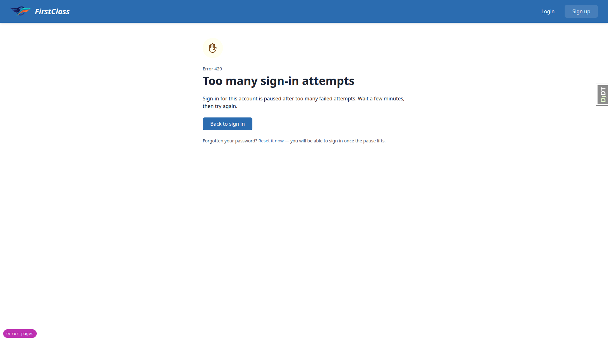

**1.2 — pass.** 'Back to sign in' loads the login form; the 'Reset it now' href
`/accounts/password/reset/` loads the password-reset form.

**1.3 — pass.** Re-submitting qa-lockout@example.com still returns 429 with the lockout heading.
demodev@email.com with the correct password signs in normally from the same browser, so the axes
lockout is keyed on the username/IP pair, not the address alone.

**1.4 — pass.** axes_reset removed 1 attempt; signed back in as demodev@email.com.

### §2 Server swap

**2 — pass.** Server B (DEBUG=False, config.settings_qa_check) serves the signed-in dashboard fully
styled: `/static/vendor/tailwind.output.css` loads and the header renders its brand blue. Session
survived the server swap. The debug branch badge is absent, as §0.1 predicts.

### §3 The four Django-served pages

**3.1 — pass.** HTTP 404 with the site header and user menu, a neutral-grey circular question mark,
'Error 404', heading 'We cannot find that page', body copy and both buttons ('Go to your dashboard' ->
/, 'Browse courses' -> /courses/). The requested path 'does-not-exist-abc123' appears nowhere in the
rendered HTML. meta robots=noindex present.

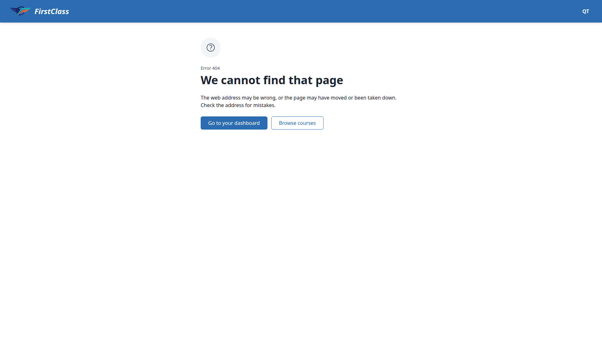

**3.2 — pass.** Same 404 panel signed out; the header swaps the user menu for the Login / Sign up
prompt. Both buttons still render and both still resolve (dashboard and course catalogue are public).

**3.3 — pass.** 'Go to your dashboard' loads the dashboard; 'Browse courses' loads the course
catalogue.

**3.4 — pass.** HTTP 403 with a warning-tinted padlock mark, 'Error 403', heading 'You do not have
access to this page', body copy naming 'an administrator' generically. No specific administrator,
course or refused resource is named. Primary 'Browse courses', secondary 'Sign in as a different
account'.

**3.5 — pass.** Signed in, 'Sign in as a different account' points at
`/accounts/logout/?next=/accounts/login/`. Clicking it gives the sign-out confirmation page, and
confirming lands on the login form. It does not bounce back to the dashboard.

**3.6 — pass.** Signed out, the same button lands directly on the login form with no sign-out step.

**3.7 — pass.** Raised BadRequest returns HTTP 400: 'Error 400', heading 'We could not handle that
request', body copy, a single 'Go to your dashboard' button. No retry affordance. meta robots=noindex
present.

**3.8 — pass.** `http://localhost:8988/` raises a real DisallowedHost and renders the same branded 400
page at status 400 through the real middleware. Deviation from the plan's prediction: the page renders
fully styled rather than unstyled, because WhiteNoise serves `/static/` before Django's host
validation runs. Not a defect - the page is better than predicted. §5.5 still covers the deliberate
no-stylesheet read.

**3.9 — pass.** Clearing the csrftoken cookie and submitting the login form returns HTTP 403 with
'Error 403', heading 'The form was not sent', copy explaining the session expired and that nothing was
sent or saved, and a 'Sign in again' button. Django's fallback strings 'CSRF verification failed',
'Request aborted', 'Help' and 'More information is available with DEBUG=True' are all absent; the page
carries the site header and the theme stylesheet.

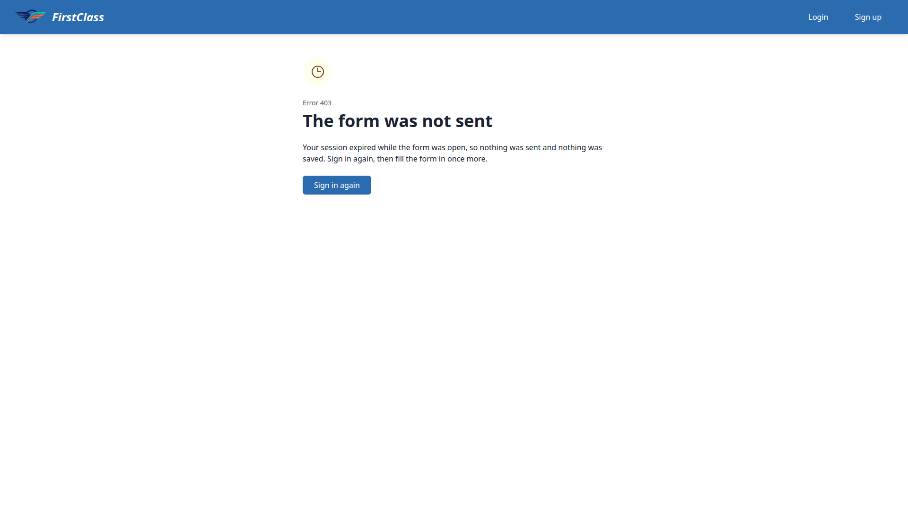

**3.10 — pass.** HTTP 500 renders standalone: no site header, no logo, no user menu, zero ``
elements, exactly one `<h1>`. Error-tinted circular warning mark, 'Error 500', heading 'Sorry, there
is a problem with this page', two paragraphs (the second warning work may not have been saved), 'Try
again' primary and 'Go to your dashboard' secondary. Styled. No reference code, no 'the team has been
paged', no support or status link, no progress claim.

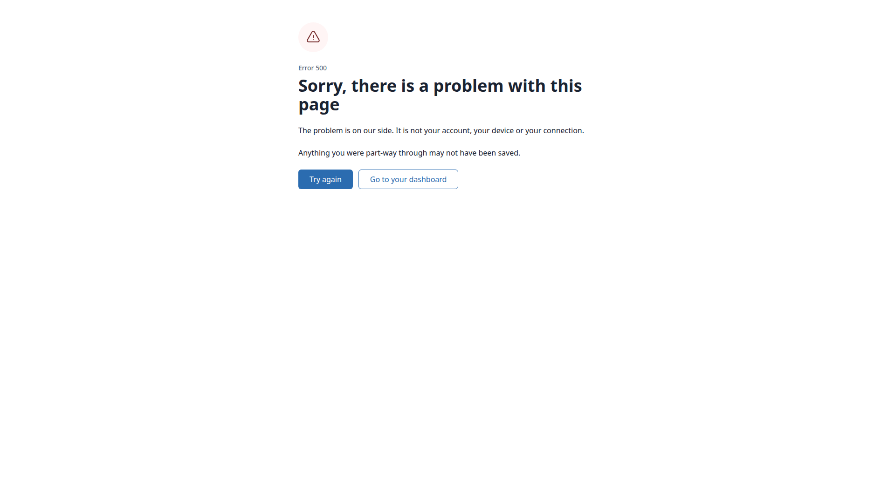

**3.11 — pass.** 'Try again' is `<a href="">`, which re-requests the current URL. The second response
is also HTTP 500, not a silent 200.

**3.12 — pass.** 'Go to your dashboard' from the 500 loads the real dashboard, still signed in, with
the header back.

**3.13 — pass.** HTTP 503 gets the same standalone treatment as the 500: no header, no navigation.
Info-tinted blue circular spanner mark, 'Error 503', heading 'Sorry, the service is unavailable', one
line of body copy, a single 'Try again' action. No user menu, no dashboard link, no maintenance
window, no 'back in N minutes', no status-page link.

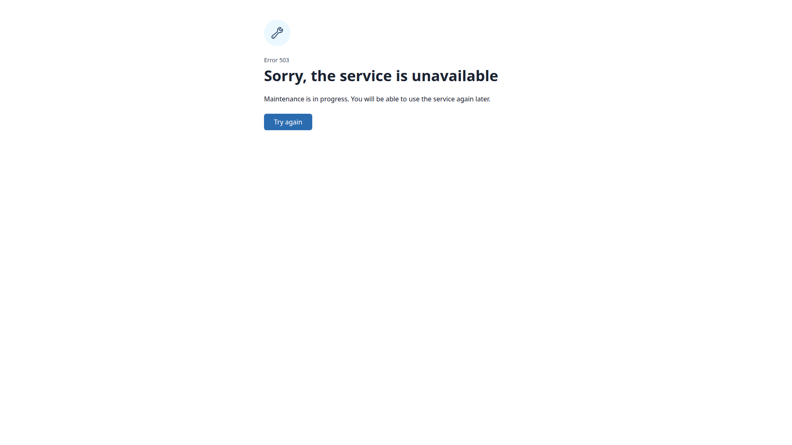

### §4 Every rate limit

#### §4.1 The seven hard-429 scopes

**4.1-6-change_password — pass.** Scope 6 change_password. Third submission of
`/accounts/password/change/` returns HTTP 429 with the branded page: warning-tinted hand mark, 'Error
429', heading 'You have made too many attempts', body copy and a single 'Try again' action. Rendered
inside the signed-in shell - the header shows the QT user menu, not the sign-in prompt. Not allauth's
bare '429 Too Many Requests' fallback.

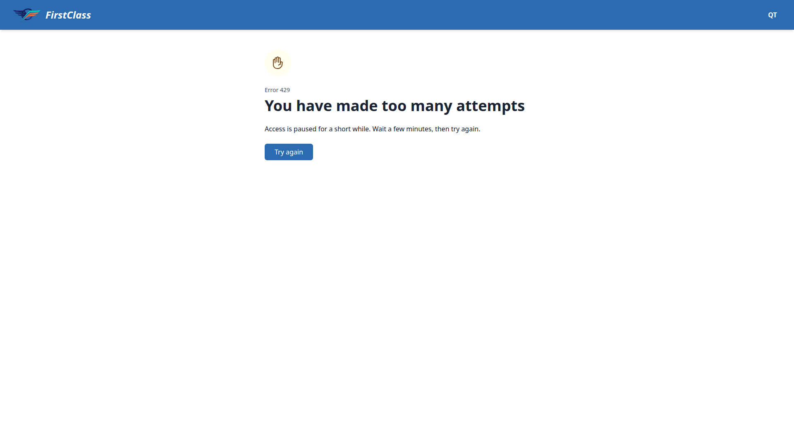

**4.1-7-manage_email — pass.** Scope 7 manage_email. Third 'Add email' submission on
`/accounts/email/` returns HTTP 429 carrying the branded heading and the site header, inside the
signed-in shell. Bare allauth fallback absent.

**4.1-8-reauthenticate — pass.** Scope 8 reauthenticate. Third wrong-password submission of
`/accounts/reauthenticate/` returns HTTP 429 with the branded page inside the signed-in shell (header
reads 'FirstClass / QT').

**4.1-5-reset_password_from_key — pass.** Scope 5 reset_password_from_key. Reset link collected from
Mailpit and opened; three mismatched set-password submissions - the third returns HTTP 429 with the
branded page in the signed-out shell (header shows Login / Sign up). meta robots=noindex present.

**4.1-4-reset_password — pass.** Scope 4 reset_password. Third submission of
`/accounts/password/reset/` returns HTTP 429 with the branded page.

**4.1-1-signup — pass.** Scope 1 signup. Sixth submission of `/accounts/signup/` returns HTTP 429
carrying the branded heading 'You have made too many attempts'. Verified by POST because the signup
form's required fields and type=email input make a sixth browser-native submit impossible to force;
the response body was checked directly.

**4.1-2-login — pass.** Scope 2 login. Fourth submission of `/accounts/login/` inside a minute returns
HTTP 429 with the branded page in the signed-out shell.

#### §4.2 The six that do not render this page

**4.2-3-login_failed — pass.** Scope 3 login_failed behaves as specified and is NOT wired to the error
page. Six failed logins against one email inside five minutes (three, then axes_reset to keep
django-axes out of the way, then three more after a 65s wait so the login scope did not trip first):
the sixth re-renders the ordinary login page at status 200 with the inline message 'Too many failed
login attempts. Try again later.' Neither the 429 page nor a 429 status.

**4.2-10-request_login_code — pass.** Scope 10 request_login_code is unreachable: allauth
app_settings reports LOGIN_BY_CODE_ENABLED = False under the QA settings. Recorded as not reachable;
no browser check, per the plan.

**4.2-11-verify_phone — pass.** Scope 11 verify_phone is unreachable: SIGNUP_FIELDS is
email/password1/password2/first_name/last_name and the rendered signup and login forms carry no phone
field. Recorded as not reachable.

**4.2-12-change_phone — pass.** Scope 12 change_phone is unreachable for the same reason - no phone
field anywhere in the account surfaces.

**4.2-13-axes — pass.** Scope 13 django-axes lockout is covered by §1 on Server A and was not re-run
here.

**4.2-9-confirm_email — pass.** Scope 9 confirm_email is silent by design. Two 'Re-send Verification'
submissions for the same unverified address inside three minutes both returned status 200 with no
error page and no failure toast, and Mailpit received only ONE confirmation email for the pair - the
second resend was swallowed silently. (A third POST returned the branded 429, but that is the
manage_email scope tripping at 2/m/user, not confirm_email.)

#### §4.3 What must never appear on any 429

**4.3 — pass.** Across every 429 reached, the rendered text is exactly 'Error 429 / <heading> / Access
is paused for a short while. Wait a few minutes, then try again. / Try again'. Regex sweep for a
numeric duration, 'unlocks in', 'attempts remaining' and 'N requests per' found nothing, and there is
no meta http-equiv=refresh, so no automatic retry.

### §5 Accessibility and resilience

**5.1 — pass.** All eight tab titles collected and all eight are distinct: 404 'We cannot find that
page'; 403 'You do not have access to this page'; 403_csrf 'The form was not sent'; 400 'We could not
handle that request'; 429 'You have made too many attempts'; 500 'Sorry, there is a problem with this
page'; 503 'Sorry, the service is unavailable'; lockout 'Too many sign-in attempts'.

**5.2 — pass.** Shell pages carry two `<h1>` - the site-title 'FirstClass' in the header, which every
FLS page has, plus the error heading. The standalone 500 and 503 each have exactly one `<h1>`, the
error heading.

**5.3 — pass.** The circular status mark does not appear in the accessibility snapshot of the 404, the
500 or the 429 at all - no image node, no label. On the 404 the only img in the tree is the site logo
in the banner. Severity is readable from the 'Error NNN' paragraph and the heading alone.

**5.4 — pass.** Side by side, the 500 and the 404 are told apart by text alone: 'Error 500 / Sorry,
there is a problem with this page' against 'Error 404 / We cannot find that page'. Colour only
reinforces what the words already say. The 500 also drops the site header entirely, a second
non-colour signal.

**5.5 — pass.** With every stylesheet and style element removed, the 500 still reads top to bottom in
source order: mark, 'Error 500', heading, both paragraphs, then 'Try again' and 'Go to your dashboard'.
Every element measures visible (non-zero box, display not none, visibility visible, opacity 1) and
both links stay clickable. Nothing is hidden. The icon also keeps a sane intrinsic size with no CSS.

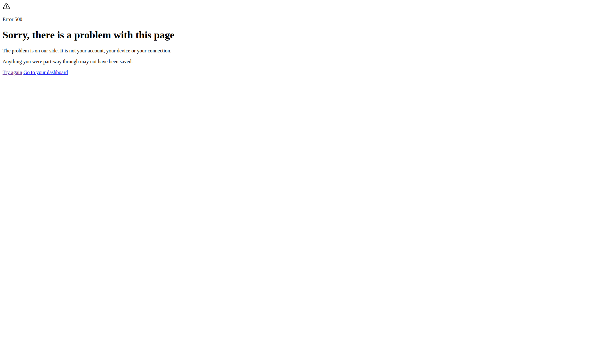

**5.6 — pass.** meta name=robots content=noindex confirmed in the rendered DOM of the 404, 403,
403_csrf, 400, 429, 500 and 503, and confirmed present in all eight templates including
accounts/lockout.html.

### §6 Side-effects on things that already worked

**6.1 — pass.** Dashboard, course catalogue, course detail and `/accounts/password/change/` all render
as before - header, layout and spacing unshifted. The change-password page is byte-for-byte the same
rendering on Server A (before the DEBUG flip) and Server B, so nothing about the account pages around
accounts/lockout.html moved.

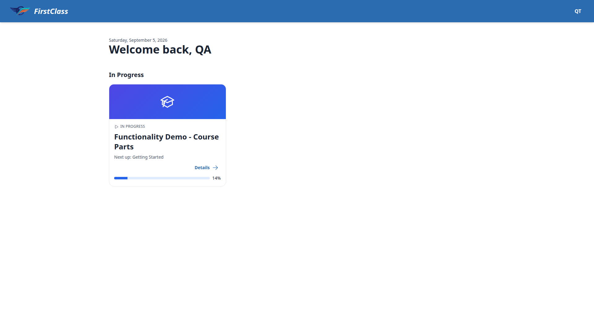

**6.2 — pass.** The §1 axes lockout page and the §4.1 change_password 429 are indistinguishable apart
from their words: identical pale-warning circular hand mark at the same position and size, identical
small-caps 'Error 429' label, identical heading scale and weight, identical primary button styling.
Two faces of the same status code.

**6.3 — pass.** Tested both ways. Typing a bad course-item index in the address bar under the same
course gives a full-page 404 with the site header. More importantly, a boosted click from inside the
running player (#interface-main present, hx-boost=true, htmx-processed link to
`/courses/functionality-demo-course-parts/9999/`) also produces a full-page reload onto the real 404:
header back, #interface-main gone, no silently stale player.

**6.4 — pass.** Known gap observed, not a regression. An htmx GET that 404s with a target outside
#interface-main leaves the target content untouched ('ORIGINAL' before and after), the URL unchanged,
and no toast. The visitor sees no error page at all. This is the gap the idea document names.

**6.5 — pass.** Saving a profile change raises the ordinary success toast unchanged: #toast-container
bottom-right on desktop, the polite live region carrying 'Profile saved', and the toast itself styled
bg-surface with a border-l-4 border-success accent. The assertive region stays empty. Toast markup and
classes are untouched by this diff.

### Responsive passes (mobile and tablet)

#### Mobile

**5.7-404 — pass.** 404 at 375x812: document scrollWidth equals the 375px viewport, so no horizontal
overflow. The heading wraps rather than clipping (scrollWidth equals clientWidth). The two actions
stack vertically - 'Go to your dashboard' at y=376 and 'Browse courses' at y=428 - rather than crushing
side by side. Touch targets measure 40 and 42px high.

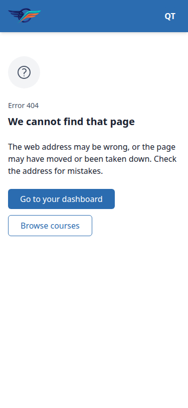

**5.7-500 — pass.** 500 at 375x812: no header, as designed. No horizontal overflow, the heading wraps
over two lines, and 'Try again' (y=388) and 'Go to your dashboard' (y=440) stack. Touch targets 40 and
42px high.

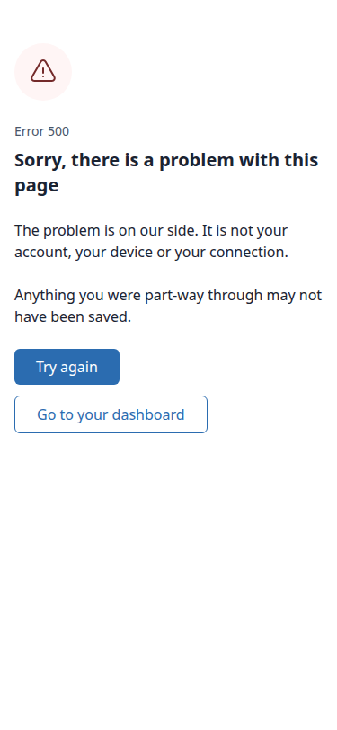

**8-nav — pass.** Header navigation on a shell error page works at mobile width: the user-menu button
opens the Alpine dropdown (Profile, Educator Interface, Admin Panel, Sign Out) and the panel stays
inside the 375px viewport rather than spilling off-screen.

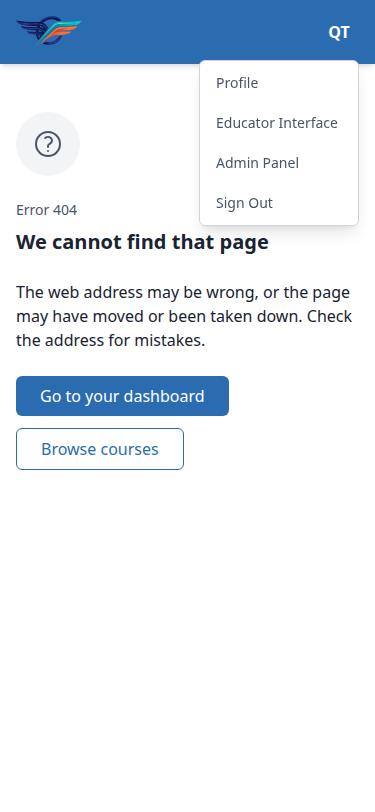

**8-403 — pass.** 403 at mobile: panel fits, heading wraps over two lines, both actions stack. Header
shows the user menu.

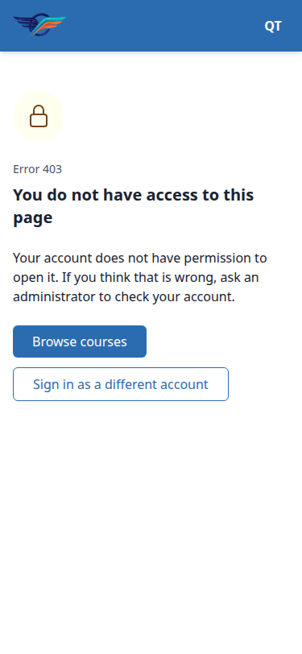

**8-503 — pass.** 503 at mobile: no horizontal overflow, heading not clipped, still no header - the
standalone treatment survives the narrow viewport.

**8-429 — pass.** 429 from change_password at mobile renders inside the signed-in shell with the user
menu in the header, the mark, the wrapped heading and the single 'Try again' action. No overflow.

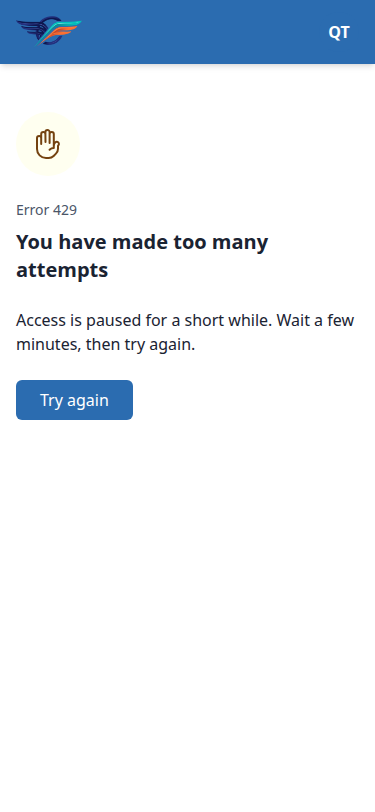

**8-lockout — pass.** The axes lockout page at mobile (reached by spacing five failed sign-ins so the
allauth login scope did not trip first): header with the signed-out prompt, mark, 'Error 429', wrapped
heading, 'Back to sign in' button and the reset-link sentence wrapping cleanly. No overflow.

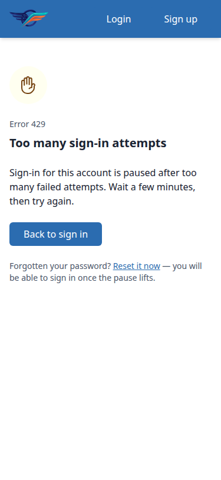

#### Tablet

**9-404 — pass.** 404 at 768x1024 gets the desktop header, not a mobile drawer: the brand wordmark
shows and the nav renders 'Login' and 'Sign up' as full links with no hamburger. The panel sits at a
comfortable measure, the heading fits on one line and the two actions sit side by side.

**9-500 — pass.** 500 at tablet keeps the standalone treatment - no header, no navigation - with both
actions side by side and the heading on one line. Nothing crowds the panel.

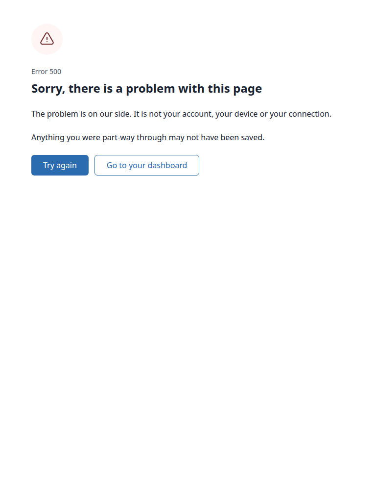

**9-403 — pass.** 403 at tablet: no horizontal overflow, heading not clipped, desktop nav ('Login |
Sign up', no hamburger), and the two actions sit side by side at x=64 and x=242, both 42px high.

**9-503 — pass.** 503 at tablet: no overflow, heading not clipped, still no header.

## Bug status

No bugs were found in this run. There is nothing to track.

## General notes

### Plan deviation, §3.8

The plan predicted the DisallowedHost 400 would render unstyled because the stylesheet request would
be rejected on the same grounds. It renders fully styled instead: WhiteNoise intercepts `/static/`
before Django validates the Host header, so the theme loads even on a rejected host. The page is
better than predicted, not worse, and §5.5 still exercised the deliberate no-stylesheet read.

### Plan deviation, §4.2 row 3

The throwaway QA settings lower the allauth login scope to 3/m/ip, which makes login_failed
unreachable by simply repeating a form submission - the login scope trips at the fourth attempt and
django-axes locks out at the fifth. The scope was still exercised honestly, by spacing three failed
sign-ins per minute across two minutes and running axes_reset in between so neither of the other two
mechanisms fired first.

### Plan deviation, §4.1 row 6

The sixth signup submission could not be forced through the browser's own form: the signup form's
required fields and its type=email input make the browser refuse to submit invalid data. The scope was
verified by POSTing directly and reading the response body, which carried the branded 'You have made
too many attempts' heading at status 429.

### Server B restart

Server B was restarted once, after the whole §4.1 table was finished, exactly as §4.1 permits. This
cleared the allauth counters so §4.2 row 9, §5 and §6 could run against a signed-in session.

### Tangential - allauth account templates

The allauth account pages (`/accounts/password/change/`, `/accounts/profile/`, `/accounts/email/`)
render full-bleed with no container, no max-width and no vertical rhythm - the heading sits flush
against the viewport edge. This is pre-existing and unchanged: the rendering is identical on Server A
before the DEBUG flip and on Server B after it, and these templates are not in the diff. Noted only
because §6.1 asks whether the pages around accounts/lockout.html still look right. They do - they look
exactly as unpolished as they did before.

### Tangential - CSP report-only violations

Every page logs report-only Content-Security-Policy violations for htmx, two Alpine plugins and
chart.js loaded from cdn.jsdelivr.net against a script-src of 'self' 'unsafe-inline'. Pre-existing,
unrelated to this diff, and report-only so nothing is blocked. Recorded as an observation only.

### Touch targets

At 375px the error-panel actions measure 40-42px high. That is under the 44px commonly recommended for
touch, but it is the shared .btn sizing used across FLS rather than anything this feature introduced,
so it is not a finding against these pages.

### Not tested

Scopes 10 (request_login_code), 11 (verify_phone) and 12 (change_phone) were recorded as unreachable
rather than driven in the browser, as the plan directs: LOGIN_BY_CODE_ENABLED is False and no phone
field exists in SIGNUP_FIELDS or in the rendered signup and login forms.

### Dev-data residue cleared

Two unverified addresses (qa-add-1@example.com, qa-add-2@example.com) left on the demodev account by
an earlier QA run were found during §4 and removed as part of this run's cleanup, along with the axes
rows this run created. No human action is needed.

---
status: ok
reason: report rendered, 0 bugs, 28 screenshots collected
