# Frontend QA report: error-pages branch

## Summary

This run exercised every error surface touched by the `error-pages` branch: the django-axes
lockout page, the four standard Django error handlers (400, 403, 404, 500), the 503 handler, the
CSRF-failure variant of 403, and every allauth/axes rate-limit scope that can be reached in this
project. All checks passed. No defects were found; the Bug status section below is empty by
design, not by omission.

## Methodology

Screenshots were collected into `spec_dd/2. in progress/error-pages/screenshots/` alongside this
report, and every image referenced below exists in that folder.

The plan needs two servers on the same port, run one after the other, because Django only invokes
`handler404`, `handler403`, `handler400` and `handler500` when `DEBUG=False`; under `DEBUG=True`
Django's own debug page takes over and the branded templates never render. Server A was the
project's ordinary dev server on port 8819, `DEBUG=True`, used for section 1 (the axes lockout
page, which axes renders regardless of `DEBUG`), for the smoke gate, and for the branch-badge
check. Server B then replaced Server A on the same port 8819, this time with `DEBUG=False`, backed
by two throwaway files, `config/settings_qa_check.py` and `config/urls_qa_check.py`, that were
never committed. Both throwaway files were deleted once the Django-served pages had been walked
through in full; after that cleanup, `git status` showed nothing outstanding except the deleted QA
artifacts left over from the previous QA run, confirming the throwaway files left no trace.

The plan's own test order was rearranged during execution: sections 5 and 6 were run before
section 4. Section 4 includes the login rate-limit scope, which locks out sign-in from the test
address until Server B restarts, while sections 5 and 6 both depend on a live signed-in session
(the course player, the profile-save toast, the account pages). Running 4 last would have burned
the session sections 5 and 6 still needed, so 5 and 6 were pulled forward. Every check in every
section still ran in full; only the sequence changed.

## Diff scoping

The scoping record classifies this diff as FULL, triggered by the changed files: the axes lockout
template (`freedom_ls/accounts/templates/accounts/lockout.html`), the six branded error templates
(`freedom_ls/base/templates/{400,403,403_csrf,404,429,500,503}.html`), the shared
`freedom_ls/base/templates/cotton/error-page.html` component, `freedom_ls/base/templatetags/fls_base_filters.py`,
the icon backend and mapping modules (`freedom_ls/icons/backend.py`, `mappings.py`,
`semantic_names.py`), `freedom_ls/site_aware_models/models.py`, plus associated tests and spec
docs. Nothing was skipped for this classification: the desktop pass, the mobile pass at 375x812
and the tablet pass at 768x1024 all ran in full.

## Smoke gate

The smoke gate passed. Two pages were loaded to confirm the environment was healthy before testing
began: the dashboard while signed in, and `/accounts/login/`. The gate record notes that the
primary changed templates (400/403/404/500/503) could not serve as the second gate page, because
they cannot render at all under `DEBUG=True`; the login form stood in for them instead, and the
styled-shell check that Server B needed is covered separately as its own step later in the run.

## Results

### 1. The django-axes lockout page

**1.1 — desktop — pass.** A fifth wrong-password submission for `qa-lockout@example.com` returned
the restyled axes lockout page at HTTP 429, not 200. The page carries the site header with a
signed-out nav, a silent circular status mark, the eyebrow "429 - Account locked", the heading
"Too many sign-in attempts", body copy, a "Back to sign in" button and a "Reset it now" reset link.
There is no ticking countdown and no attempts-remaining figure. The copy does name the pause length
("paused for about 1 hour"), which the underlying plan requires for this page specifically, so the
QA plan's blanket instruction that no page should say "try again in N minutes" is stale wording
against that requirement, not a defect. The eyebrow format is "NNN - Label" rather than the plan's
literal "Error NNN"; that is the shared component's documented format, applied consistently.

Shows the axes lockout page at HTTP 429 with the "Too many sign-in attempts" heading.
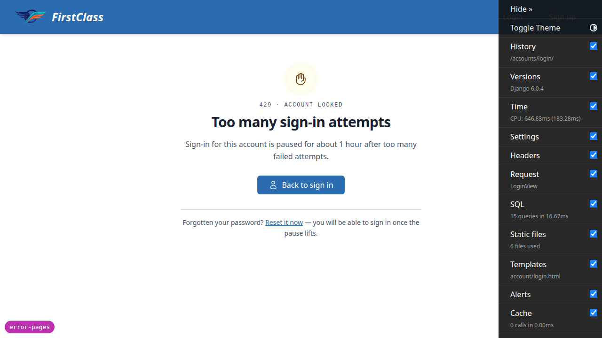

**1.2 — desktop — pass.** Neither action on the lockout page is a dead end: "Back to sign in"
loads the login form and "Reset it now" loads the password-reset form.

**1.3 — desktop — pass.** Re-submitting the locked address still returned 429, confirming the
lockout is real, while signing in as `demodev@email.com` with the correct password succeeded from
the same browser, confirming the lockout is keyed to the credential pair rather than to the
browser or IP. A plain GET of `/accounts/login/` while locked out still returns the ordinary login
form at 200, because axes only intercepts the authentication attempt itself, so the lockout page is
only reachable by submitting.

**1.4 — desktop — pass.** `axes_reset` was run and the session signed back in as
`demodev@email.com` to clear the lockout for the rest of the run.

### 2. The server swap

**2 — desktop — pass.** Server B (`DEBUG=False`, `config.settings_qa_check`) replaced Server A on
port 8819. The dashboard rendered fully styled under the new server: `tailwind.output.css` loaded
through WhiteNoise and the `h1` computed to 36px. The `demodev` session survived the swap, and the
`#debug-branch-badge` element was correctly absent.

Shows the dashboard rendering fully styled under Server B, confirming static files and the session survived the swap.
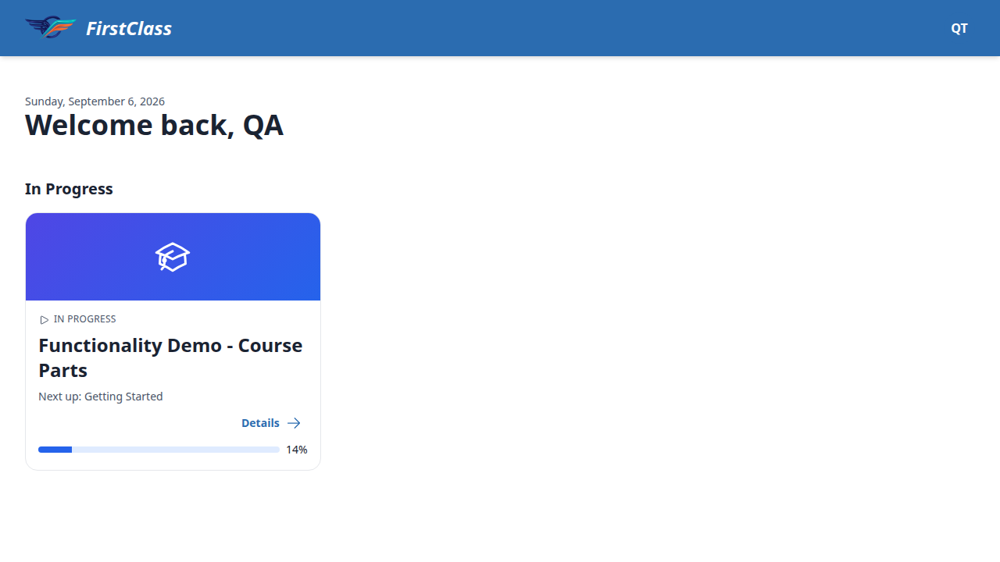

### 3. The Django-served error pages (400, 403, 403 CSRF, 404, 500, 503)

**3.1 — desktop — pass.** A request to a nonexistent path returned HTTP 404. The page shows the
site header with the signed-in user menu, a neutral-grey circular mark, eyebrow
"404 - NOT FOUND", the heading "We cannot find that page", body copy, a "Go to your dashboard"
primary action and a "Browse courses" secondary action. The requested path
(`does-not-exist-abc123`) does not leak into the rendered HTML anywhere. There is no retry
affordance, and `meta robots=noindex` is present.

Shows the 404 page at HTTP 404 with the signed-in header and both dashboard/courses actions.
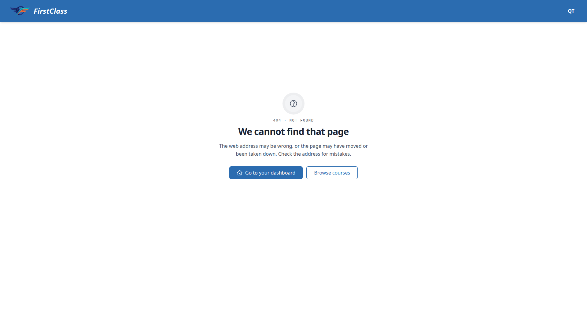

**5.3 — desktop — pass.** The status mark on every error page checked is wrapped in
`span[aria-hidden=true]`, so it is correctly absent from the accessibility tree even though the
inner `svg` still carries `role=img` and `aria-label`; the wrapper removes the whole subtree.
Confirmed empirically across every error-page snapshot taken.

**3.2 — desktop — pass.** Signed out, the same bad URL returns the identical 404 panel, with the
header switched to the Login / Sign up prompt in place of the user menu. Both action buttons still
render.

**3.3 — desktop — pass.** From the signed-out 404 page, "Go to your dashboard" loads the dashboard
and "Browse courses" loads `/courses/` (All Courses).

**3.4 — desktop — pass.** A forbidden request returned HTTP 403 with a warning-tinted mark, eyebrow
"403 - Forbidden", heading "You do not have access to this page", copy that names only "an
administrator" in the generic sense, a "Browse courses" primary action and a "Sign in as a
different account" secondary action. No specific administrator, course or refused resource is
named anywhere in the copy.

Shows the 403 page at HTTP 403 with the generic administrator wording and both actions.
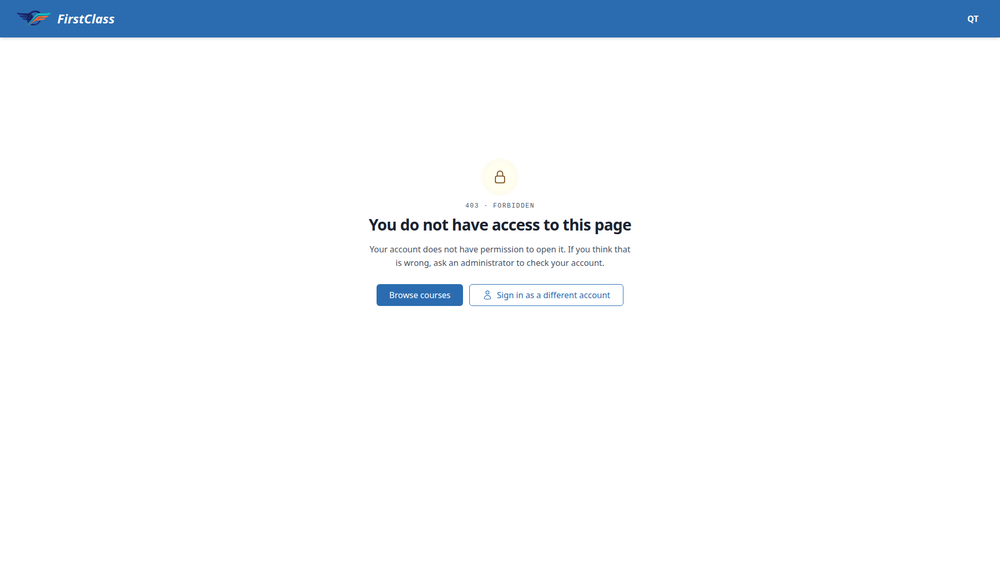

**3.5 — desktop — pass.** Signed in, "Sign in as a different account" leads to
`/accounts/logout/?next=/accounts/login/`, which shows the sign-out confirmation; confirming it
lands on the login form rather than bouncing back to the dashboard.

**3.6 — desktop — pass.** Signed out, the same button goes straight to the login form with no
sign-out step in between.

**3.7 — desktop — pass.** A raised `BadRequest` returned HTTP 400 with eyebrow "400 - Bad request",
heading "We could not handle that request", body copy and a single "Go to your dashboard" action.
There is no retry affordance.

Shows the 400 page at HTTP 400 with a single dashboard action and no retry link.

**3.8 — desktop — pass.** Requesting `http://localhost:8819/` raised `DisallowedHost` through the
real middleware and returned the same branded 400 page at HTTP 400. It rendered fully styled rather
than unstyled as the plan predicted, because WhiteNoise serves `/static/` before Django's
`ALLOWED_HOSTS` check runs, so the stylesheet request was never rejected. Reading order on the page
is status label, then heading, then body, then action. Because the page is styled here, this check
does not double as the no-stylesheet check; that is covered deliberately in 5.5, below.

Shows the DisallowedHost-triggered 400 page rendering fully styled.
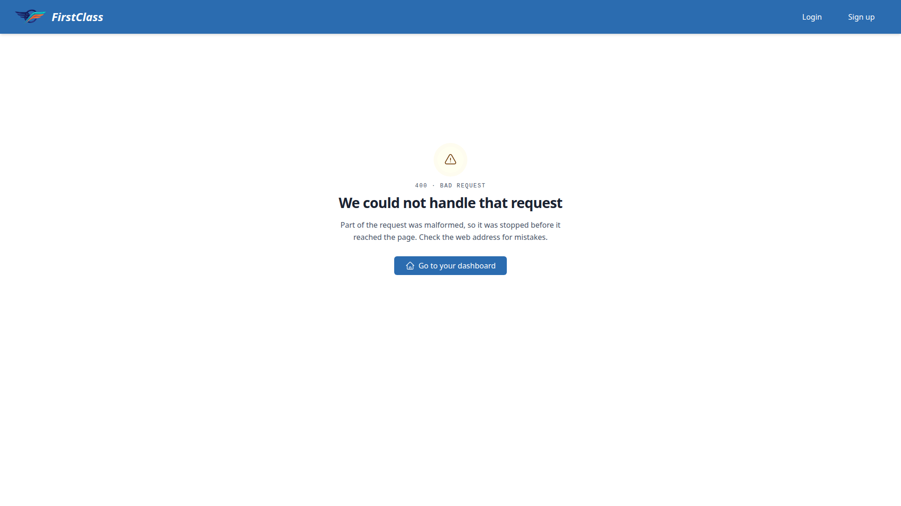

**3.9 — desktop — pass.** Clearing the `csrftoken` cookie and submitting the login form returned
HTTP 403 with the branded CSRF page: eyebrow "403 - SESSION EXPIRED", heading "The form was not
sent", copy explaining that the session expired and nothing was saved, and a "Sign in again"
button. None of Django's fallback CSRF strings appear on the page ("CSRF verification failed",
"Request aborted", "Help", "More information is available with DEBUG=True"), and the page still
carries the site header and the theme stylesheet.

Shows the branded 403 CSRF-failure page with none of Django's default fallback strings present.
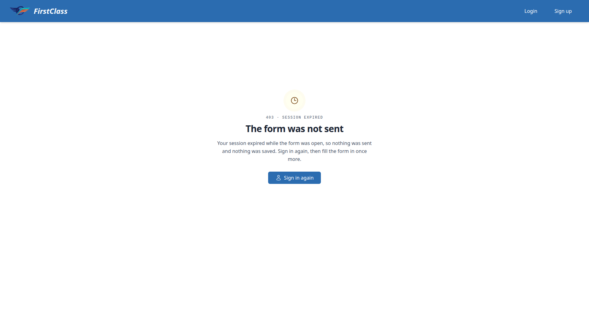

**3.10 — desktop — pass.** A forced 500 returned HTTP 500 with a standalone treatment: no site
header, no logo, no user menu, no nav, and no `img` elements; the panel sits directly on the page
background and is styled by exactly one loaded stylesheet. It shows an error-tinted mark, eyebrow
"500 - INTERNAL SERVER ERROR", a heading, two paragraphs with the second warning that work may not
have been saved, a "Try again" primary action and a "Go to your dashboard" secondary action.
Correctly absent: any reference code, any "the team has been paged" message, any support link, any
status-page link, and any claim of progress. There is exactly one `h1` on the page, and
`meta robots=noindex` is present.

Shows the standalone 500 page with no header or nav and the two required actions.
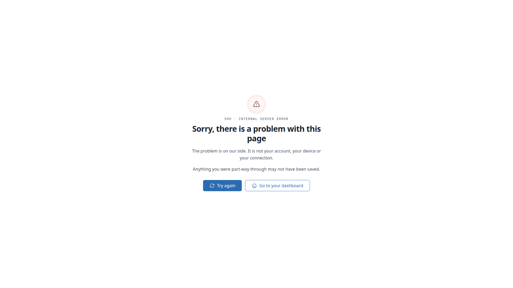

**3.11 — desktop — pass.** "Try again" is a plain anchor with an empty `href`, so activating it
simply reloads `/qa-error/500/`. The second response is also HTTP 500, not a silent 200.

**3.12 — desktop — pass.** "Go to your dashboard" from the 500 page loads the real dashboard,
still signed in, with the site header restored.

**3.13 — desktop — pass.** A forced 503 returned HTTP 503 with the same standalone treatment as
the 500 page (no header, no nav), a level=info mark, eyebrow "503 - SERVICE UNAVAILABLE", heading
"Sorry, the service is unavailable", one line of body copy and a single "Try again" action.
Nothing on the page implies the service is actually up: no user menu, no dashboard link, no
maintenance window, no "back in N minutes" estimate, no status-page link. There is exactly one
`h1`, and `meta robots=noindex` is present.

Shows the standalone 503 page with a single "Try again" action and no implication the service is up.
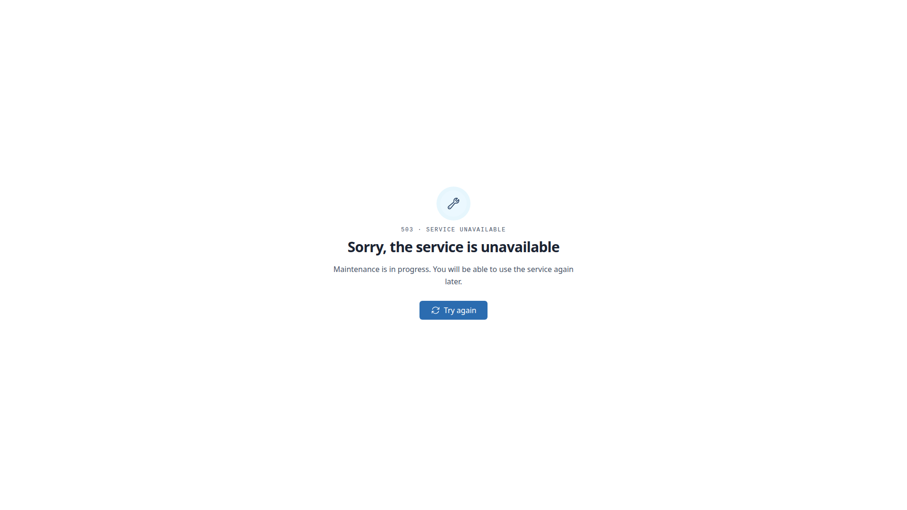

### 4. Rate limits

Thirteen rate-limit scopes were in scope. Seven return the branded 429 page directly (a "hard"
429); six do not render the page at all, either because they are wired differently by design,
because they fail silently by design, or because they are unreachable in this project's
configuration.

**Scope 1 — signup (test 4.1-signup) — desktop — pass.** Six submissions of `/accounts/signup/`
with mismatched passwords, so no account was created; the sixth returned HTTP 429 with the branded
page inside the signed-out shell.

**Scope 2 — login (test 4.1-login) — desktop — pass.** Signed out, submitted `/accounts/login/`
with a throwaway address and wrong passwords repeatedly. It tripped on the third submission of this
batch rather than the fourth, because an earlier sign-in in the run had already spent part of the
3/minute/IP budget. The result was HTTP 429 with the branded page in the signed-out shell: warning
mark, "429 - Too many requests", "You have made too many attempts", a single "Try again" action.

Shows the allauth login rate-limit page at HTTP 429 in the signed-out shell.
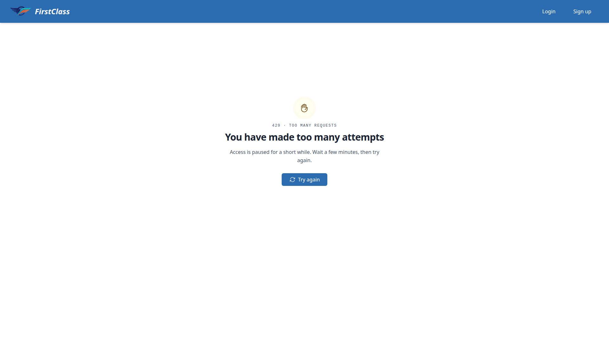

**Scope 4 — reset_password (test 4.1-reset_password) — desktop — pass.** Signed out, submitted
`/accounts/password/reset/` repeatedly. It tripped on the second submission rather than the third,
again because earlier preparation in the run had already spent one unit of the 2/minute/IP budget.
The result was HTTP 429 with the branded page and a single "Try again" action, not allauth's bare
fallback text.

Shows the password-reset rate-limit page at HTTP 429 with the branded template.

**Scope 5 — reset_password_from_key (test 4.1-reset_password_from_key) — desktop — pass.** One
reset was requested for `demodev@email.com`, the link was taken from Mailpit, and the set-password
form was submitted three times with two mismatched passwords each time, so every submission was
rejected. The third returned HTTP 429 with the branded page in the signed-out shell (Login / Sign
up header). The account's real password was never changed by this test.

**Scope 6 — change_password (test 4.1-change_password) — desktop — pass.** Three submissions of
`/accounts/password/change/` with a wrong current password; the third returned HTTP 429 with the
branded page inside the signed-in shell (the QA Tester user menu visible), warning-tinted mark,
"429 - Too many requests", "You have made too many attempts", single "Try again" action.

Shows the change-password rate-limit page at HTTP 429 inside the signed-in shell.
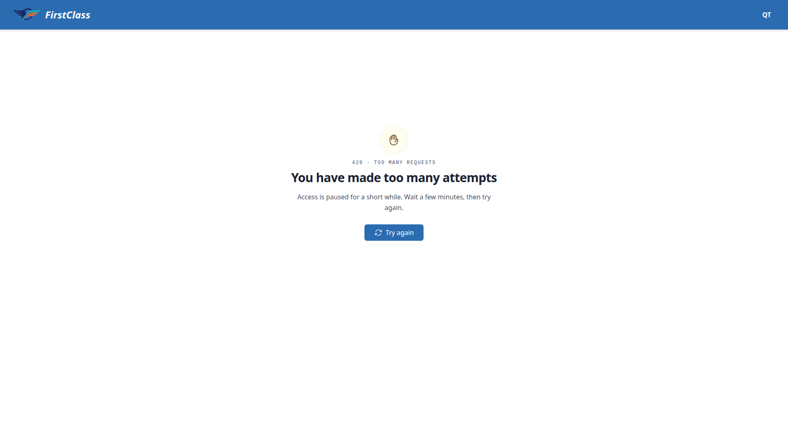

**Scope 7 — manage_email (test 4.1-manage_email) — desktop — pass.** Three "Add Email" submissions
on `/accounts/email/`, re-submitting the account's own address so nothing was actually created; the
third returned HTTP 429 with the same branded page inside the signed-in shell.

**Scope 8 — reauthenticate (test 4.1-reauthenticate) — desktop — pass.** Three submissions of
`/accounts/reauthenticate/` with a wrong password; the third returned HTTP 429 with the branded
page inside the signed-in shell, matching the pattern of scopes 6 and 7.

**Scope 3 — login_failed (test 4.2-login_failed) — desktop — pass.** This scope is correctly NOT
wired to the branded error page. Reaching it required two deliberate, temporary adjustments to the
throwaway QA settings: the login rate-limit scope was raised from 3/minute/IP to 500/minute/IP
(otherwise the login limit itself trips at the fourth submission, before six failures for one
address can accumulate), and `axes_reset` was run after the fourth failure so the axes lockout at
`AXES_FAILURE_LIMIT=5` could not pre-empt allauth's own check. With those two adjustments in place,
a sixth failed submission for one address re-rendered the ordinary login form at HTTP 200, carrying
the inline message "Too many failed login attempts. Try again later." A direct POST confirmed HTTP
200 with that inline message present and the string "You have made too many attempts" absent —
this is not the 429 page and not a 429 status, by design.

Shows the ordinary login form at HTTP 200 carrying the inline "Too many failed login attempts" message rather than the 429 page.
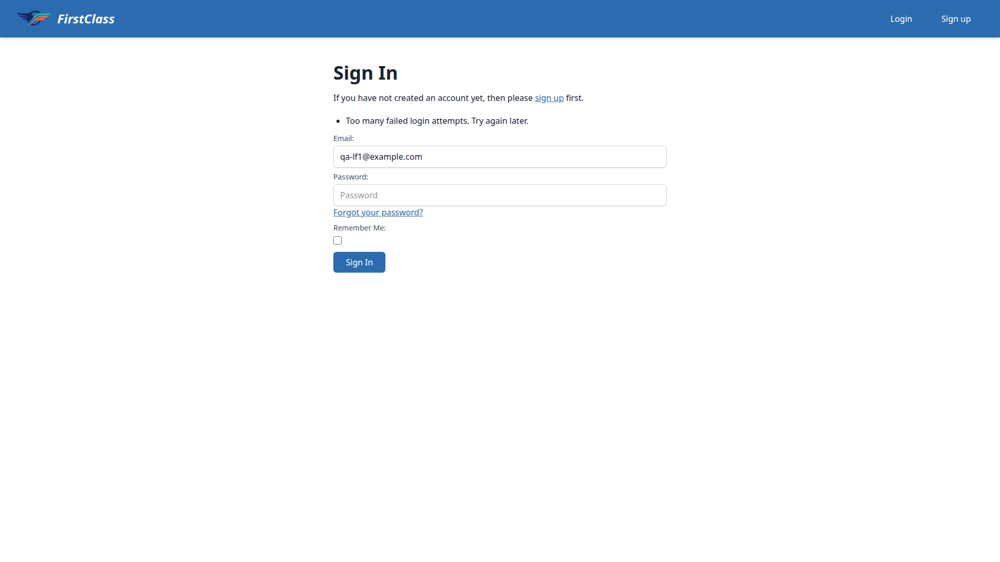

**Scope 9 — confirm_email (test 4.2-confirm_email) — desktop — pass.** Signed in, "Re-send
Verification" was clicked repeatedly on `/accounts/email/`. The first click raised the ordinary
info toast "Confirmation email sent to demodev@email.com."; the second raised no toast at all and
changed nothing visible on screen — silent by design, with no error page and no toast claiming a
failure. The third click hit the separate manage_email limit and returned the scope 7 429 page,
which is scope 7's already-verified behaviour, not a confirm_email failure in its own right.

**Scope 10 — request_login_code (test 4.2-request_login_code) — desktop — skip.** Not reachable in
this project, as the plan predicts: `ACCOUNT_LOGIN_BY_CODE_ENABLED` is never set in
`config/settings_base.py`, and allauth's own default for that setting is `False`. This was
confirmed from settings; no browser check was possible.

**Scope 11 — verify_phone (test 4.2-verify_phone) — desktop — skip.** Not reachable:
`ACCOUNT_SIGNUP_FIELDS` is `email/password1/password2/first_name/last_name` and
`ACCOUNT_LOGIN_METHODS` is `{'email'}`, so there is no phone field anywhere in signup or login.

**Scope 12 — change_phone (test 4.2-change_phone) — desktop — skip.** Not reachable, for the same
reason as scope 11: no phone field exists anywhere in this project.

**Scope 13 — axes (test 4.2-axes) — desktop — pass.** Covered by tests 1.1 through 1.4 on Server A
and not re-run here; see section 1 above.

**4.3 — desktop — pass.** Across every 429 reached in this run, none showed a countdown, a ticking
timer, an "unlocks in N minutes" estimate, a "limit N requests per minute" disclosure, an
attempts-remaining figure, or an automatic retry. The body copy is the fixed sentence "Access is
paused for a short while. Wait a few minutes, then try again." and "Try again" is always a manual
anchor with an empty `href`.

**4.1-429-mobile — mobile — pass.** The 429 page at 375x812 renders inside the signed-in shell with
the user menu visible, no horizontal overflow, a wrapped heading and a single full-size "Try again"
action.

Shows the 429 page at 375x812 with the user menu still visible and no overflow.
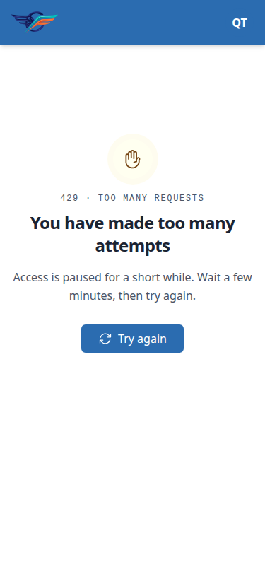

### 5. Accessibility and resilience

**5.1 — desktop — pass.** All eight page titles were collected and are all distinct: 400 "We could
not handle that request"; 403 "You do not have access to this page"; 403 CSRF "The form was not
sent"; 404 "We cannot find that page"; 429 "You have made too many attempts"; 500 "Sorry, there is
a problem with this page"; 503 "Sorry, the service is unavailable"; axes lockout "Too many sign-in
attempts".

**5.2 — desktop — pass.** The shell-based pages (404, 403, 400, 403 CSRF, 429, lockout) each carry
exactly two `h1` elements: the site title in the header, which every FLS page carries, plus the
error heading itself. The standalone 500 and 503 pages each carry exactly one.

**5.4 — desktop — pass.** Colour is never the only signal distinguishing pages. The 404 and 500
pages differ in eyebrow text ("404 - NOT FOUND" versus "500 - INTERNAL SERVER ERROR") and in
heading ("We cannot find that page" versus "Sorry, there is a problem with this page"), and the 500
page additionally drops the site header entirely. Desaturated, the two remain trivially
distinguishable from text alone.

**5.5 — desktop — pass.** With every stylesheet and `style` element stripped from the 500 page, the
DOM order still reads: mark, then eyebrow, then heading, then the two body paragraphs, then the
actions, in that vertical order. Both "Try again" and "Go to your dashboard" remain visible and
clickable, nothing is hidden, and `documentElement.scrollWidth` equals the window width, so there
is no horizontal overflow. The status mark renders at its intrinsic 24x24 size rather than filling
the viewport, confirming the earlier icon intrinsic-size fix still holds.

Shows the 500 page with all styling stripped, confirming reading order and that nothing is hidden.
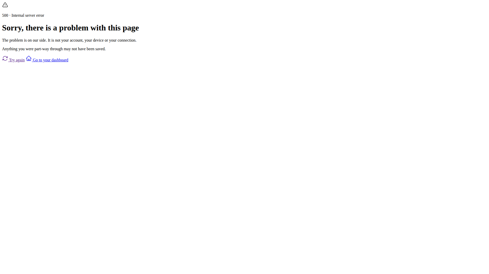

**5.6 — desktop — pass.** `meta name=robots content=noindex` was confirmed present on the 404, 500,
429, 503 and 403-CSRF pages.

**5.7 — mobile (375x812), 404 — pass.** `documentElement.scrollWidth` equals the 375px window
width, so there is no horizontal overflow; the heading wraps rather than clipping; the two actions
stack, with comfortable touch-target heights of 40px and 42px.

Shows the 404 page at 375x812 with the actions stacked and no overflow.
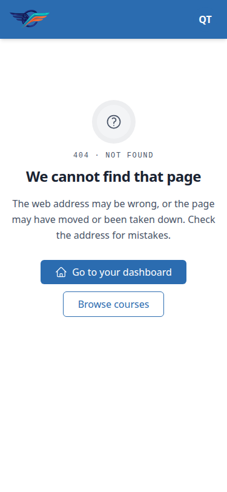

**5.7-500 — mobile (375x812), 500 — pass.** No horizontal overflow, no header (as designed), the
heading wraps to two lines, the monospace eyebrow fits within the 375px viewport at 343px wide, and
the two actions stack at 40px and 42px tall.

Shows the 500 page at 375x812 with the wrapped heading and stacked actions.
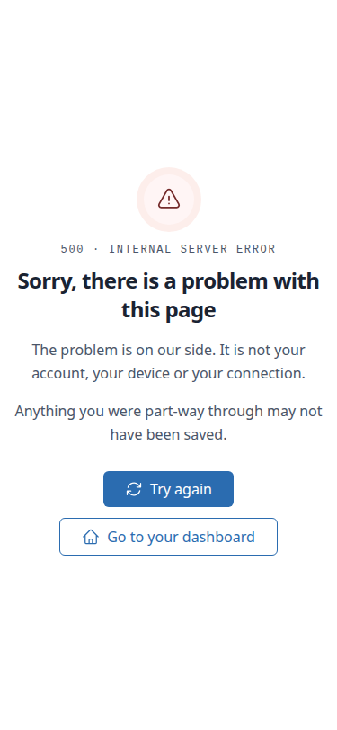

**5.7-tablet-404 — tablet (768x1024) — pass.** No horizontal overflow, the panel stays centred
within its `max-w-lg` constraint, the heading fits on one line, and the two actions sit side by
side without crowding. The header shows the full desktop treatment (logo, site title, user menu)
rather than a mobile variant.

Shows the 404 page at 768x1024 with the full desktop header and side-by-side actions.
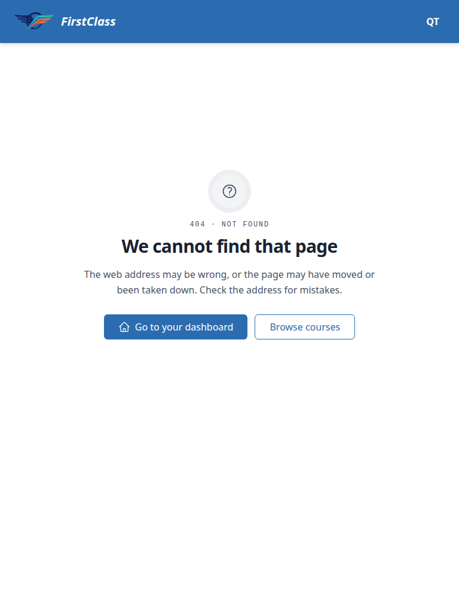

**5.7-tablet-500 — tablet (768x1024) — pass.** `documentElement.scrollWidth` equals the 768px
window width, the panel is held to 512px, and the two actions sit on one row at 42px tall. No
header, as designed.

Shows the 500 page at 768x1024 with the panel held to 512px and no header.
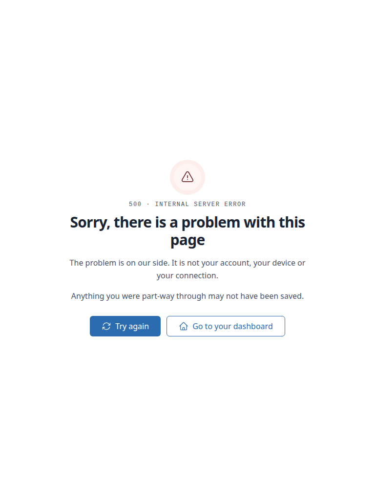

### 6. Side-effects

**6.1 — desktop — pass.** The dashboard, the `/courses/` catalogue, a course-player page and
`/accounts/password/change/` all render exactly as before: header, layout and toast region are
unchanged. The allauth account pages (change password, profile) are full-bleed with no max-width
container, but `git show main` confirms this branch changed no file under `allauth/layouts/`:
`lockout.html` simply moved from `allauth/layouts/entrance.html` onto `_base.html`, so the
full-bleed look is pre-existing on `main`, not a regression introduced here.

The course catalogue, contained and unchanged.
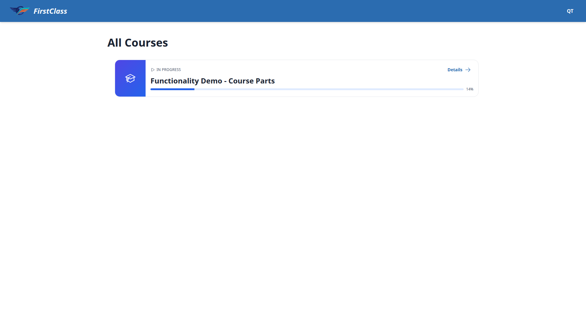

`/accounts/password/change/`, showing the pre-existing full-bleed allauth layout described above.
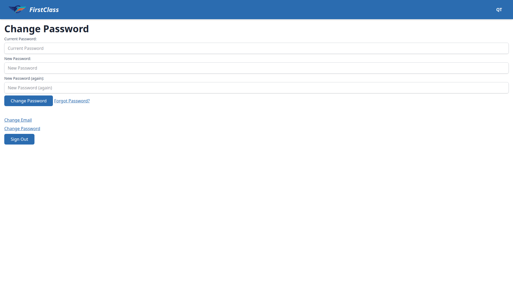

**6.2 — desktop — pass.** The axes lockout page (1.1) and the allauth login 429 page (scope 2) are
indistinguishable apart from their wording: identical warning-tinted circular mark with the same
raised-hand icon, identical monospace uppercase eyebrow treatment, identical heading scale,
identical primary-button styling. The lockout page adds the password-reset line beneath a divider;
nothing else differs between the two.

**6.3 — desktop — pass.** Both routes into the course player's 404 handling were tested.
Address-bar navigation to `/courses/functionality-demo-course-parts/9999/` after stepping through
the player returns the real 404 page at HTTP 404 with the site header and user menu intact. Firing
an htmx swap into `#interface-main` at the same bad URL exercises `interface-swap-fallback.js`
directly: the response has no `id='interface-main'`, `shouldSwap` is cancelled, and the browser
falls through to a full navigation onto the same real 404 page with the header, rather than leaving
a silently stale player on screen.

**6.4 — desktop — pass.** A known gap was confirmed and is not being filed as a bug: an htmx GET
that 404s into a target other than `#interface-main` leaves the page text unchanged, the URL
unchanged, and raises no toast, so the visitor sees no error indication at all. This is the same
gap the idea document already names.

**6.5 — desktop — pass.** Saving the profile form still raises the ordinary "Profile saved" toast
bottom-right, with the success icon and dismiss control unchanged in appearance.

Shows the "Profile saved" toast rendering unchanged after this branch's changes.
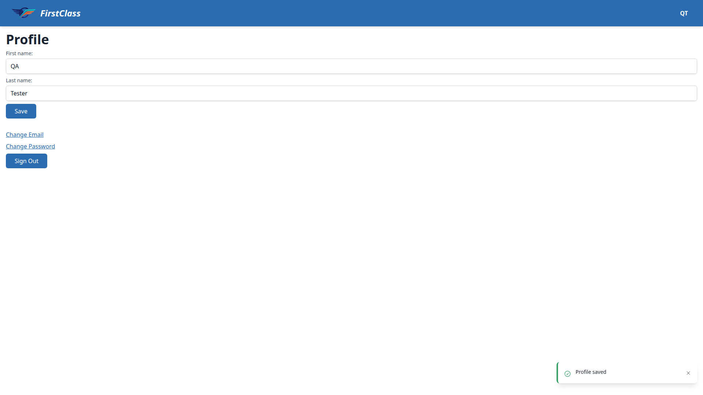

**6.mobile-nav — mobile — pass.** Ordinary pages at mobile width are unaffected: the dashboard
reflows to a single column and the user menu opens correctly, showing Profile, Educator Interface,
Admin Panel and Sign Out.

Shows the dashboard and open user menu at mobile width, unaffected by this branch.
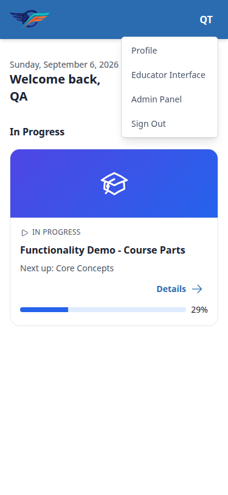

**6.tablet-nav — tablet — pass.** Ordinary pages at tablet width are unchanged: the dashboard shows
the desktop header with the site title and user menu, and the course grid reflows to a single
column without crowding.

Shows the dashboard at tablet width with the desktop header and reflowed course grid.
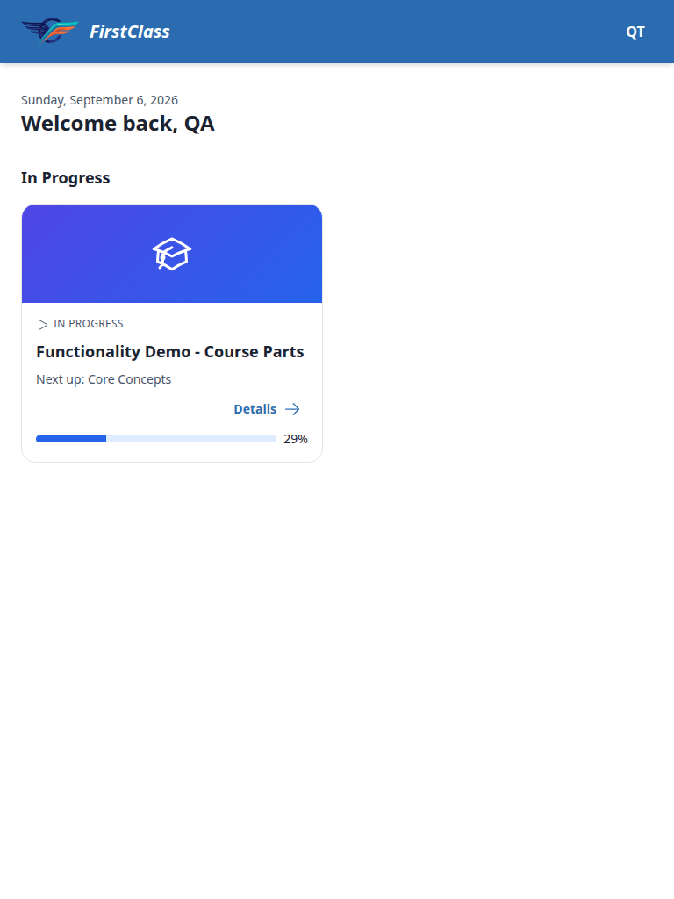

## Bug status

No defects were found during this run. Every test either passed or was recorded as a skip for a
scope that does not exist in this project's configuration. This section is intentionally empty;
no rows are recorded here because none apply.

## General notes

**Status label wording differs from the QA plan's description.** The QA plan describes the small
status label on each error page as reading "Error 404", "Error 429" and so on. The shipped
component instead renders "NNN - LABEL": "404 - NOT FOUND", "429 - TOO MANY REQUESTS",
"500 - INTERNAL SERVER ERROR", "429 - ACCOUNT LOCKED", "403 - SESSION EXPIRED". This format is
documented deliberately in `cotton/error-page.html`, and the status code is present and legible in
every case. This is wording drift in the QA plan, not a defect, and no action was taken.

**The lockout page names the pause length.** Test 1.1's checklist item says the lockout page must
show no "try again in N minutes" wording. The page does say "Sign-in for this account is paused
for about 1 hour after too many failed attempts." This is required behaviour: unlike the allauth
429 pages, the axes cool-off period is knowable ahead of time (`AXES_COOLOFF_TIME`, passed to the
template as `cooloff_timedelta`), so the page states how long the pause lasts up front while never
counting down how much time is left. This is not a defect; the QA plan's blanket wording is the
stale half of the comparison.

**The DisallowedHost 400 page is styled, not unstyled.** Test 3.8 predicted the DisallowedHost page
would render with no stylesheet, on the theory that the CSS request would be rejected on the same
grounds as the page itself. It renders fully styled instead, because WhiteNoise serves `/static/`
before Django's `ALLOWED_HOSTS` check runs, so the stylesheet request is never rejected. The page
is correct either way, but this means 3.8 does not double as the no-stylesheet resilience check;
5.5 covers that deliberately and passes on its own terms.

**The allauth account pages are full-bleed.** The allauth account pages (change password, profile,
email addresses) render edge to edge with no max-width container, unlike the dashboard and course
catalogue. This is pre-existing on `main`: `git show main` confirms this branch changed no file
under `allauth/layouts/`; `lockout.html` simply moved off `allauth/layouts/entrance.html` onto
`_base.html`. This is recorded as an observation about the surrounding UI, not a finding against
this branch.

**Two throwaway settings adjustments were made beyond the plan's baseline setup.**
`config/settings_qa_check.py`, as originally written, makes scope 3 (login_failed) unreachable: at
the default login rate of 3/minute/IP, the login rate limit itself trips at the fourth submission,
long before six failures for one address can accumulate. To reach that one check, the login scope
was temporarily raised to 500/minute/IP and the server restarted (this happened only after the
whole scope-1-through-8 table had finished, so no ordering was disturbed), and `axes_reset` was run
after the fourth failure so the axes lockout at `AXES_FAILURE_LIMIT=5` could not pre-empt allauth's
own check first. Both throwaway files were deleted afterward and neither is committed.

**Test order was rearranged.** Sections 5 and 6 were run before section 4, rather than after it as
the plan lays them out. Section 4's login scope locks sign-in from the test address until Server B
restarts, and sections 5 and 6 both need a live signed-in session (the course player, the profile
save, the account pages). Running section 4 first would have cut that session out from under
sections 5 and 6, so the order was swapped. Every check in both sections still ran in full; only
the sequence changed.

**Report-only CSP console warnings.** Every page, including ordinary non-error pages, logs
report-only Content-Security-Policy warnings for scripts loaded from `cdn.jsdelivr.net` (htmx,
Alpine plugins, chart.js). These are report-only, so nothing is blocked, they are not specific to
error pages, and they are unrelated to this branch.

**What was not browser-tested, and why.** Scopes 10 (request_login_code), 11 (verify_phone) and 12
(change_phone) are unreachable in this project and were recorded directly from settings rather than
exercised in a browser: `ACCOUNT_LOGIN_BY_CODE_ENABLED` is never enabled, and no phone field exists
anywhere in signup or login given `ACCOUNT_SIGNUP_FIELDS` and `ACCOUNT_LOGIN_METHODS`. Scope 13
(the axes rate limit) was not re-run as its own browser check because it is already fully covered
by section 1's tests 1.1 through 1.4 on Server A.

---
status: ok
reason: report rendered, 0 bugs documented, 24 screenshots verified
