# Frontend QA report: extract form functionality into its own app

Branch: `extract_forms_into_seperate_app`. Date: 2026-08-24. Base URL: `http://127.0.0.1:8830/`.

Accounts used: `demodev@email.com` (admin/educator — Django admin, educator interface, the
all-question-types quiz, the course sweep); `demodev_quizqa@email.com` (the progression-block course,
the free-text survey, and the exit/resume adversarial paths); `demodev_s1@email.com` (a cohort learner,
used ad hoc for the learner-side deadline display check).

## Verdict

**Pass.** All four of the refactor's own risk areas — the signal substitution, `ContentType` resolution
for `Form`, the template-render-time `get_content_by_path` import, and the Django admin move — hold up
under direct testing, including the adversarial branches. Two bugs were found and are documented below
in full, but **both are pre-existing on `main`**: each bug record carries `pre_existing: true`, and in
both cases the code paths responsible are byte-identical to `main` (confirmed by `git diff main...HEAD`
against the specific files involved). Neither is a regression introduced by moving form functionality
into `form_engine`.

## Methodology

Testing was done by browsing the running application with the Playwright MCP tools, acting as a human
tester rather than scripting assertions. Screenshots were collected into
`spec_dd/2. in progress/extract_forms_into_seperate_app/screenshots/` and every image referenced in this
report sits beside it in that folder. Transient `.yml`/`.log` tooling artifacts produced by the capture
process were removed afterwards, leaving the 25 real screenshots that this report references.

## Diff scoping

Scoping class: **FULL**. The changed-file set includes non-`.py` paths (migrations, `CLAUDE.md`,
`docs/app_structure.md`, `.secrets.baseline`, a plugin resource manifest, and the `spec_dd/` planning
documents themselves alongside the eleven Python app/module trees), so the safe-default rule fired and
the run was scoped to the full plan. **Nothing was skipped** — the desktop, mobile and tablet matrices
all ran in full.

## Smoke gate

**Passed.** The dashboard (`http://127.0.0.1:8830/`, logged in as `demodev@email.com`) and the form
start page for `qa-question-types-course` item 1 — the primary changed surface — both loaded cleanly,
so the run proceeded to the full test matrix.

## The four silent-failure candidates

This is the section that matters most: it is what tells the reader the refactor itself is sound,
independent of the two pre-existing bugs found along the way.

### 1. The signal substitution

**Pass.** This was the one genuine behaviour change under test — course progress recalculation moved
from a `post_save` hook to an explicit `form_attempt_completed` send inside `FormProgress.complete()`
— and it holds in every direction tested:

- **B1**: the dashboard and course-home percentage for `qa-progression-block-course` moved from a
  33% baseline to 67% immediately on passing the quiz. The receiver is connected and firing.
- **B2**: repeated re-reads of the dashboard and course home held steady at exactly 67% with no
  drift or overshoot, and re-entering the completed item offered no retake — `complete()`'s
  early-return-once-`completed_time`-is-set guard is intact, so a second call is a no-op.
- **B3**: failing the quiz (75%, below the 80% pass mark) correctly left the percentage at 33% and
  locked item 3, including against a direct-URL adversarial check (the view itself redirects, not
  just the table of contents); re-sitting and passing then unlocked item 3 and raised the percentage
  to 67%.
- **B4.1**: pre-completing six `FormProgress` rows out-of-band via `qa_complete_form` (which uses
  `get_or_create`, not `save()`) triggered no recalculation for any of the nine affected learners —
  the change gained no new recalculation path and lost no live one.
- **A3**: the signal also fires correctly for a non-quiz (`CATEGORY_VALUE_SUM`, no-verdict) form —
  course progress reached 100% even though there is no pass/fail banner to render.
- **F5.1 / F5.2**: both exit-affordance branches correctly trigger or withhold the signal as
  appropriate — `submit_on_exit=True` finalises and scores the attempt (signal fires), while the
  save-on-exit form leaves the percentage untouched. (F5.1 does have a separate, pre-existing bug in
  answer capture — see Bugs found — but the signal-firing behaviour itself is correct in both cases.)

### 2. `ContentType.get_for_model(Form)`

**Pass.** `ContentType.objects.get_for_model(Form)` resolves to exactly one row
(`freedom_ls_form_engine | form`), with the old `freedom_ls_content_engine | form` row gone via the
delete migration, so there is no stale content type to silently resolve against.

- **C1**: all 7 seeded `LearnerDeadline` rows render with their content item resolved in the admin,
  including the form item alongside topic items; setting a new deadline on a form item persisted and
  reappeared on that same item.
- **C-cohort-grid**: the educator cohort reporting grid renders both form columns with populated
  per-learner cells, not blank ones.
- **C2**: the learner-side course-outline correctly displays the form-item deadline set in C1,
  distinct from the whole-course and topic-level deadlines.
- **C3**: cohort report generation (nine moved symbols across `reports/gather.py` and
  `reports/indexes.py`) completed successfully once unrelated malformed seed data was removed, and the
  resulting PDF contains correct quiz names, per-learner scores and a question-by-question breakdown.

### 3. `content_tags.get_content_by_path` at render time

**Pass.** This import runs on every request that renders a `<c-content-link>`, not just at
process-start import time.

- **E1**: opening the topic containing a `<c-content-link>` to a non-existent path produced no 500,
  no `TemplateSyntaxError` and no `ImportError`. Reaching the tag's "Content not found" fallback
  proves `get_content_by_path` ran its full body — Topic lookup miss, then
  `Form.objects.get(...)` against the new `freedom_ls.form_engine.models.Form`, then
  `DoesNotExist` — so the moved render-time import is exercised and healthy on every request.
- **E3**: the widest markdown/cotton pipeline exercise, all 5 items of the content-widgets course,
  returned 200 with zero tracebacks, `ImportError`s or stray "Content not found" markers.

### 4. The Django admin

**Pass.** Twelve admin classes moved app.

- **D2-D4**: the new "Freedom_Ls_Form_Engine" section lists exactly the 7 expected models; the
  "Freedom_Ls_Content_Engine" and "Freedom_Ls_Learner_Progress" sections no longer list the moved
  models but retain their others.
- **D5**: cross-app inlines all render — `FormPageInline`, `FormContentInline`, `FormQuestionInline`,
  `QuestionOptionInline` — and parent FK dropdowns populate correctly across the app boundary.
- **D6**: `QuestionAnswerInline` renders a learner's answers on a Form progress record with no error.
- **D7**: site scoping survives the move — DemoDev admin changelists show only DemoDev's rows, and a
  Bloom-site form seeded specifically to test this never appears in them.

## Results by section

### Setup

| Test | Viewport | Status | Notes |
|---|---|---|---|
| Setup.2 | n/a | PASS | All 5 QA seeding commands ran with no ImportError/ModuleNotFoundError. Two needed a `SITE_NAME` argument and one needed `qa_create_cohort_progress` run first — documented command signatures, not defects. |
| capture-check | desktop | PASS | Per-run screenshot capture check confirmed screenshots land correctly with no missing image bytes. |

### Section A — the form player golden path

| Test | Viewport | Status | Notes |
|---|---|---|---|
| A1 | desktop | PASS | Scored quiz golden path: question count correct (4), all four question types rendered, completion page showed 50% / 2 of 4 correct / "Quiz passed!", course progress moved 0% → 100%. |
| A1-start-page | desktop | PASS | Form start page showed the title, "4 Questions", "1 Page" and a Start Form button. |
| A1-multipage | desktop | PASS | Two-page scored quiz: all 6 answered correctly across both pages, scored 100% (6/6), course progress moved 25% → 50% and item 3 unlocked. |
| A2 | desktop | PASS | Resuming an incomplete attempt: the start page correctly switched to "Continue Form", resumed at page 2, and page 1's saved answers were still selected. |
| A2-partial | desktop | PASS | Multi-page resume mechanics were also exercised via the survey — page-1 answers and the answered-counter survived a Previous navigation. |
| A3 | desktop | PASS | Free-text survey (no verdict): completion page showed no score ring, banner or review; Previous re-rendered the saved free-text answers; course progress still reached 100%. |

*A1-start-page / capture-check — form start page.*

*A1 — completion page after the scored quiz.*

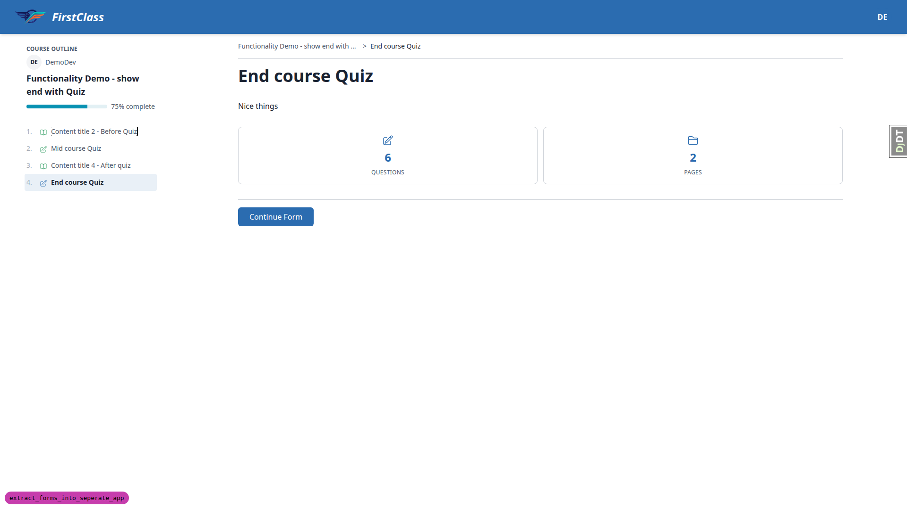
*A2 — resumed attempt with page 1's answers preserved.*

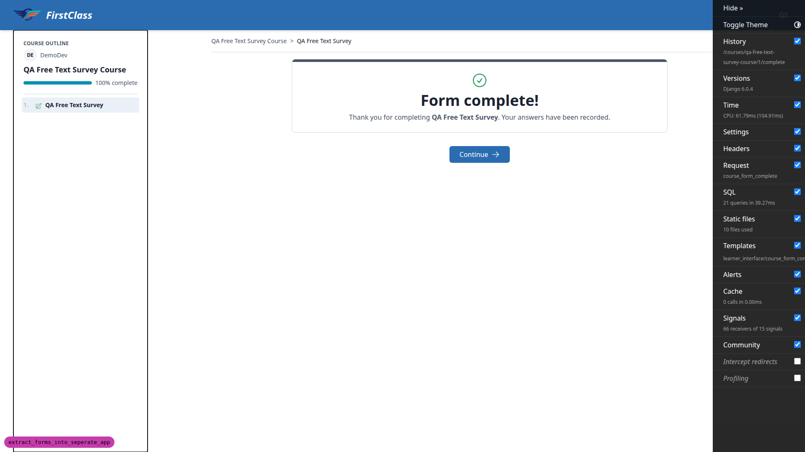
*A3 — free-text survey completion page (no verdict).*

### Section B — the signal substitution

| Test | Viewport | Status | Notes |
|---|---|---|---|
| B1 | desktop | PASS | Baseline dashboard read 33%; after passing the quiz, the course outline and dashboard both recalculated to 67% — the `form_attempt_completed` receiver is connected and firing. |
| B2 | desktop | PASS | Percentage held at exactly 67% across repeated reads; re-entering the completed quiz offered no retake — `complete()`'s early-return is holding. |
| B3 | desktop | PASS | Failing the quiz (75%) blocked item 3, including against a direct-URL adversarial check; the percentage held at 33%; re-sitting and passing unlocked item 3 and raised the percentage to 67%. |
| B4.1 | desktop | PASS | Pre-completing 6 `FormProgress` rows via `qa_complete_form` left all 9 learners' percentages unchanged before and after — no stray recalculation path gained or lost. |
| B4.2 | desktop | FAIL | `recalculate_progress_percentages` crashed with `KeyError: 'score'` on a QUIZ-strategy form holding a wrong-shape scores dict. The moved import itself resolved fine. **Pre-existing — see Bugs found (B1).** |

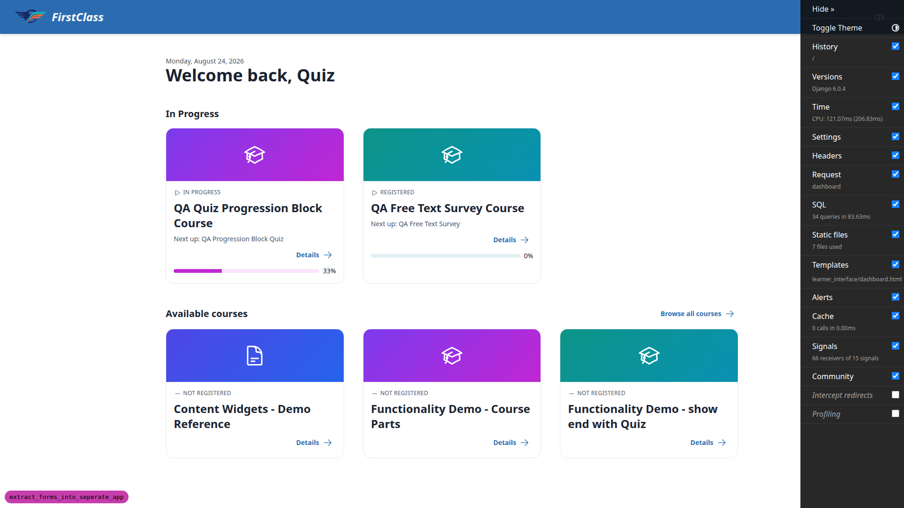
*B1 — dashboard baseline (33%) before completing the quiz.*

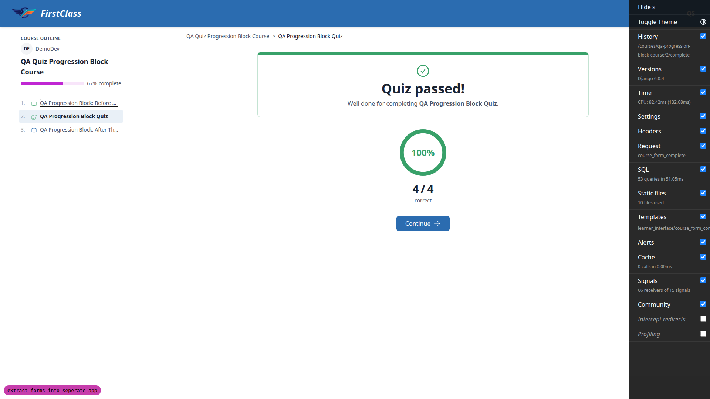
*B1 — dashboard/course home after completion (67%).*

*B2 — stable percentage on repeated re-reads, no retake offered.*

*B3 — failed-quiz completion page with incorrect-answer review.*

### Section C — content types: deadlines and reporting

| Test | Viewport | Status | Notes |
|---|---|---|---|
| C1 | desktop | PASS | `ContentType.get_for_model(Form)` resolves to a single row; all 7 seeded deadlines render including the form item; a new deadline persisted correctly. Tested in the Django admin rather than the educator interface — see General notes. |
| C-cohort-grid | desktop | PASS | Educator cohort reporting grid renders both form columns with populated per-learner cells alongside the topic columns. |
| C2 | desktop | PASS | Learner-side course outline correctly displays the form-item deadline set in C1, distinct from the whole-course and topic deadlines. |
| C3 | desktop | PASS | Cohort report generation: first run failed from the pre-existing B4.2 bug; after removing the malformed seeded rows, the same report regenerated to Ready with correct quiz scores and answers in the PDF. |

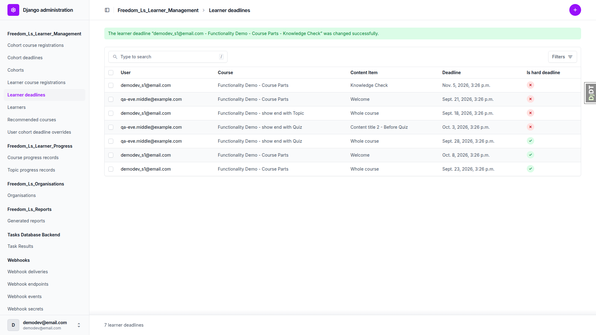
*C1 — deadlines admin changelist, form item resolved correctly.*

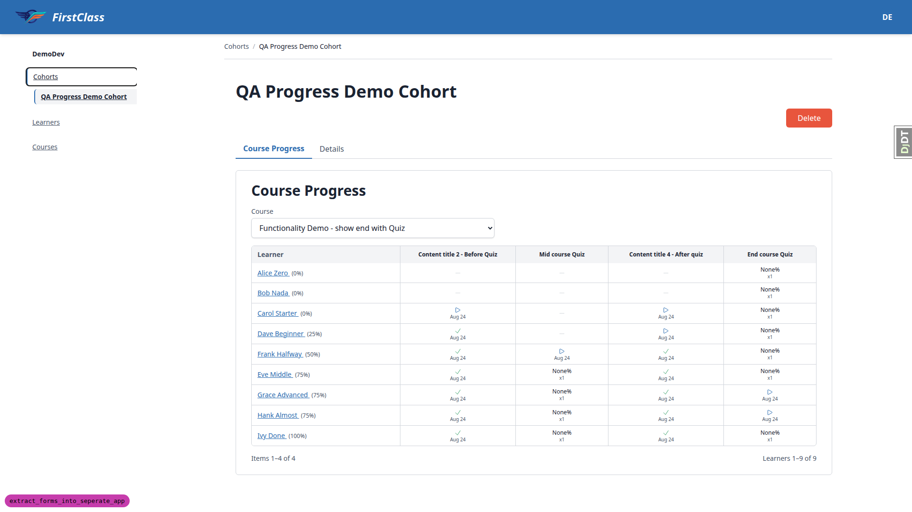
*C-cohort-grid — cohort progress grid with both form columns populated.*

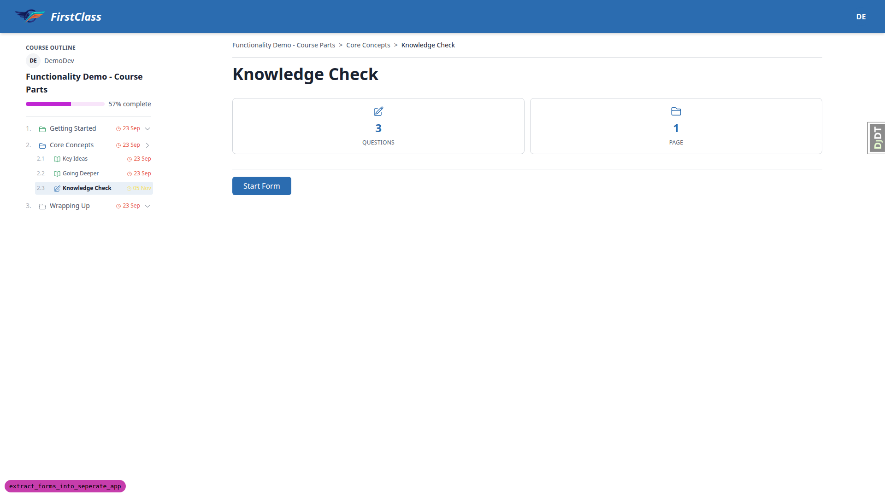
*C2 — learner course outline showing the form-item deadline.*

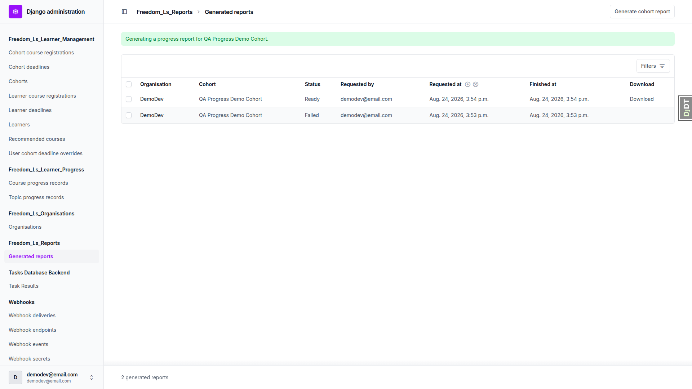
*C3 — cohort report reached "Ready" after removing malformed data.*

### Section D — the Django admin

| Test | Viewport | Status | Notes |
|---|---|---|---|
| D2-D4 | desktop | PASS | The new "Freedom_Ls_Form_Engine" section lists exactly the 7 moved models; the Content engine and Learner progress sections no longer list them but retain their others. |
| D5 | desktop | PASS | Cross-app inlines all render — FormPageInline, FormContentInline, FormQuestionInline, QuestionOptionInline — with parent FK dropdowns populating correctly. |
| D6 | desktop | PASS | QuestionAnswerInline renders a learner's answers on a Form progress record with no error. |
| D7 | desktop | PASS | Site scoping still holds: DemoDev admin changelists show only DemoDev's rows; a Bloom-site form seeded for this check never appears. |

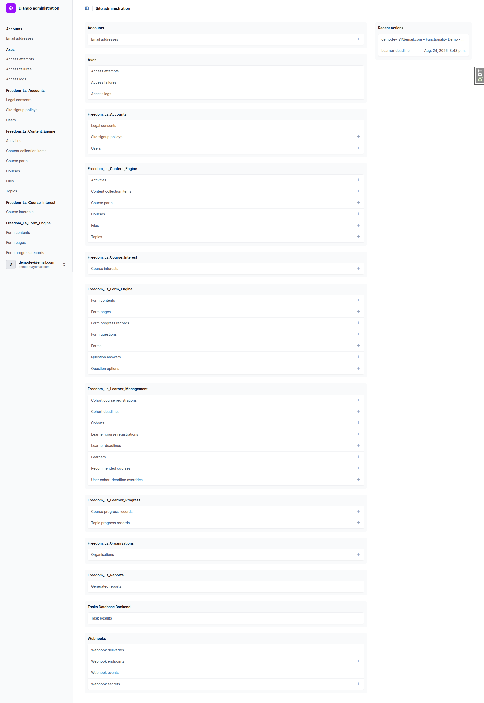
*D2-D4 — new Form engine admin section.*

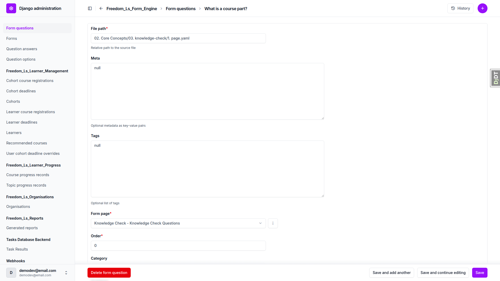
*D5 — cross-app inlines rendering on a Form question.*

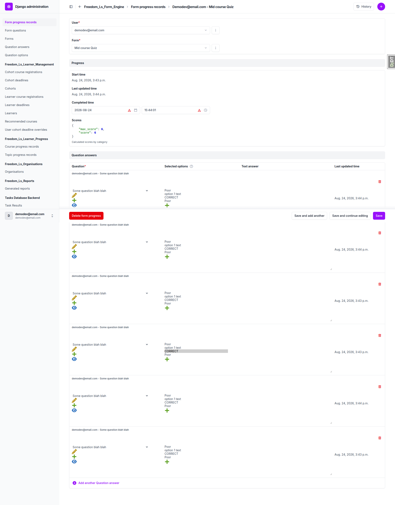
*D6 — QuestionAnswerInline on a Form progress record.*

### Section E — the template-render-time edge

| Test | Viewport | Status | Notes |
|---|---|---|---|
| E1 | desktop | PASS | `get_content_by_path`'s render-time `Form` import runs to completion on every request; a dangling demo-content link correctly falls back to "Content not found" rather than erroring. |
| E3 | desktop | PASS | All 5 content-widgets items rendered 200 with no traceback, `ImportError` or stray "Content not found" markers. |

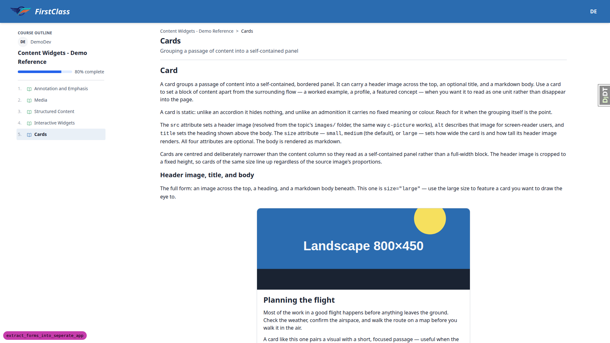
*E3 — content-widgets course rendering intact after the split.*

### Section F — failure and adversarial branches

| Test | Viewport | Status | Notes |
|---|---|---|---|
| F1 | desktop | PASS | Required-question validation: client-side checks block the submit dialog, and a direct empty POST returns HTTP 422 with a required-answers-error alert — no 500 at either layer. |
| F2 | desktop | PASS | Resubmitting the same page via Back updates the existing `QuestionAnswer` row in place rather than duplicating it — no `IntegrityError`. |
| F3 | desktop | PASS | Six hostile item-index URLs (out-of-range, zero, negative, non-numeric, wrong item type) all returned 404, never a 500. |
| F4 | desktop | PASS | Logged-out access redirects to login; access as a learner not registered for the course redirects to the enrolment page with no question text leaked. |
| F5.1 | desktop | FAIL | The exit affordance correctly finalises and scores a `submit_on_exit` attempt (signal fires), but the current page's answers are silently discarded, scoring 0/6 despite 3 correct answers entered. **Pre-existing — see Bugs found (B2).** |
| F5.2 | desktop | PASS | The save-on-exit form correctly took the other branch: "Leave and save", attempt not scored, percentage unchanged — the intended contrast with F5.1. |

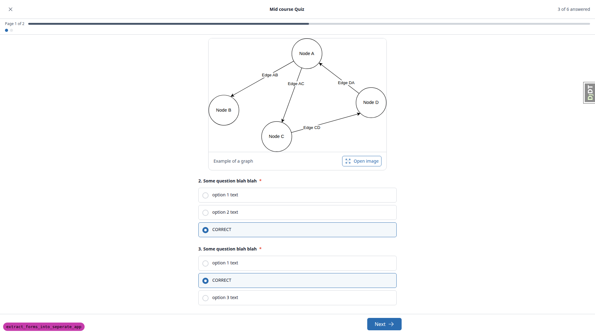
*F5.1 — scored 0/6 after the current page's answers were discarded on exit.*

### Section G — sweep

| Test | Viewport | Status | Notes |
|---|---|---|---|
| G1 | desktop | PASS | All 8 courses swept, 24 URLs checked; only one legitimate 404; no traceback, 500, `ImportError` or `ContentType` error anywhere. |
| G2 | desktop | PASS | Full server-log scan (1629 lines) found zero forbidden error classes and zero HTTP 500s; the only exceptions logged were the documented pre-existing `KeyError` and expected `get_or_create` internal lookup misses. |
| G3 | desktop | PASS | Browser console on the form runner and a completion page showed 0 errors and 0 warnings. |

### Responsive — mobile and tablet

| Test | Viewport | Status | Notes |
|---|---|---|---|
| M1-runner | mobile | PASS | Form runner at 375x812: zero horizontal overflow, touch targets ≥44px, all inputs stack in a single readable column. |
| M2-completion-and-nav | mobile | PASS | Completion page renders legibly at 375px; the course-outline sidebar correctly collapses to a working drawer. |
| M3-admin-table | mobile | PASS | The moved form_engine admin changelist wraps its table in its own scroll container rather than overflowing the page. |
| T1-runner | tablet | PASS | Form runner at 768x1024: zero overflow, comfortably margined question column, 48px touch targets. |
| T2-nav-mode | tablet | PASS | At 768px the layout correctly uses the mobile drawer (the sidebar breakpoint is lg/1024px+), not the desktop sidebar — a deliberate and sensible breakpoint choice. |
| T3-grids-and-forms | tablet | PASS | The widest table (the 5-column cohort progress grid) and the admin Form-page change form with its inlines both stay within their own scroll containers with zero page overflow. |

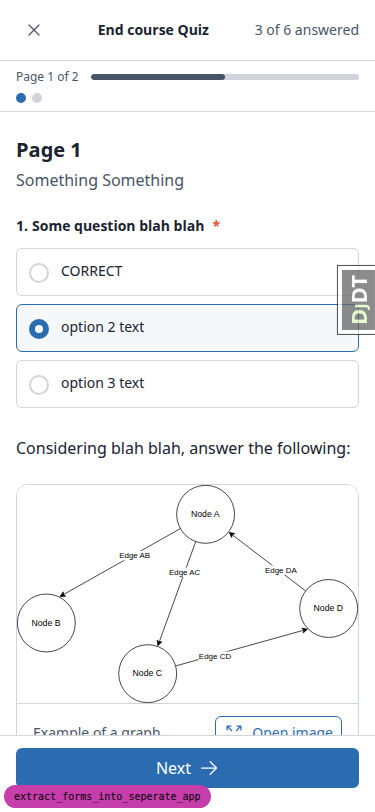
*M1-runner — form runner at 375x812.*

*M2-completion-and-nav — completion page and outline drawer at 375x812.*

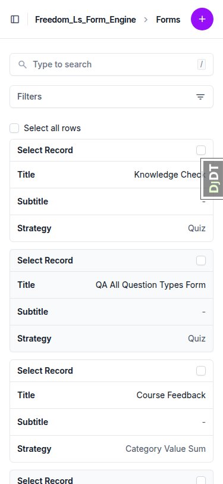
*M3-admin-table — form_engine admin changelist at 375x812.*

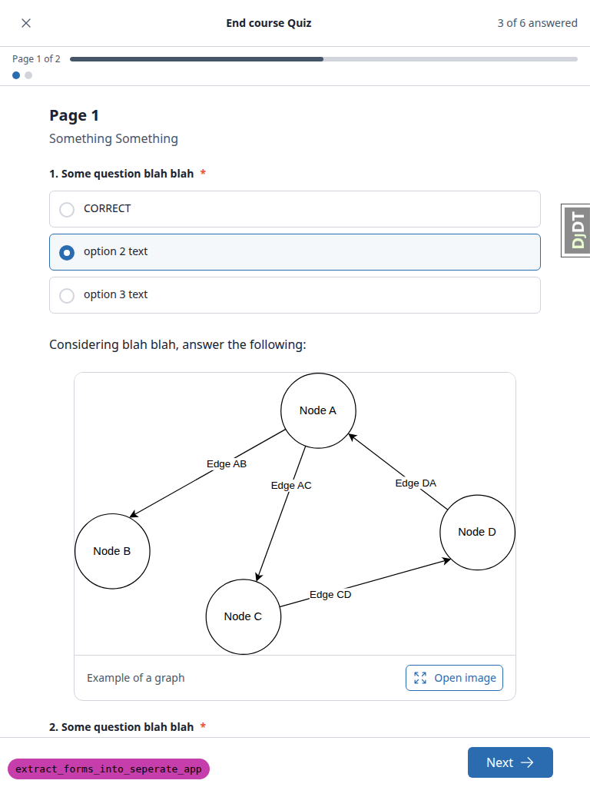
*T1-runner — form runner at 768x1024.*

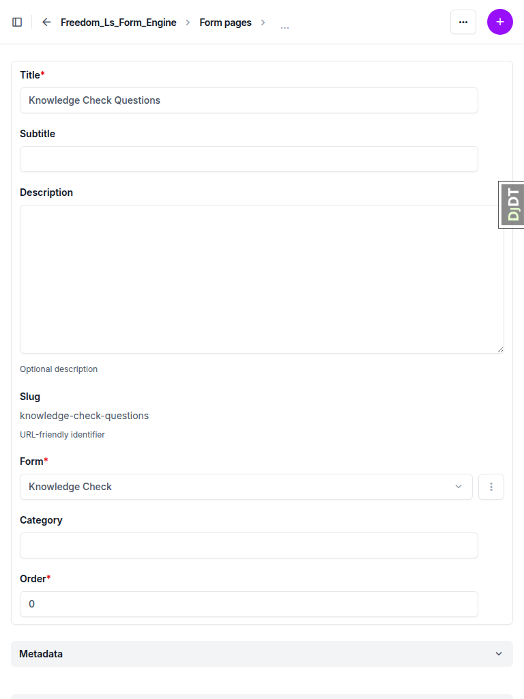
*T3-grids-and-forms — admin Form-page change form at 768x1024.*

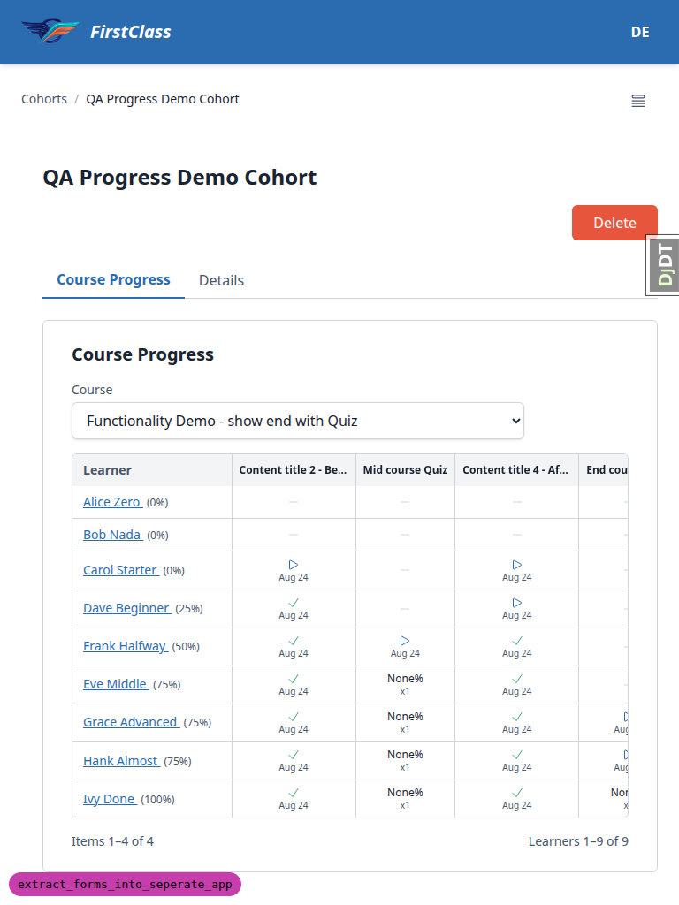
*T3-grids-and-forms — educator cohort progress grid at 768x1024.*

## Bugs found

### Bug B1: `quiz_percentage()` KeyErrors on a completed QUIZ attempt whose scores dict has no `'score'` key

**Manifestations:** B4.2 (desktop), C3 (desktop)

**Expected:** A completed `FormProgress` on a QUIZ-strategy form whose scores dict is not in quiz shape
should be treated as an unscored attempt and skipped, exactly as `attempt_completes_form` already does
for a falsy scores dict via its `except ValueError` guard. `recalculate_progress_percentages` should
complete, and the cohort report should reach "Ready".

**Actual:** `FormProgress.quiz_percentage()` (`freedom_ls/form_engine/models.py:229`) guards only with
`if not self.scores`, so a populated-but-wrong-shape dict such as
`{'Satisfaction': 5, 'Recommendation': 3}` passes the guard and then raises `KeyError: 'score'` on
`self.scores['score']`. `attempt_completes_form` (`freedom_ls/form_engine/queries.py:20`) catches only
`ValueError`, so the `KeyError` escapes. This crashed `manage.py recalculate_progress_percentages`
outright, and made the admin's "Generate cohort report" action fail with status "failed" (traceback via
`reports/indexes.py:329` in `fold_form_progress_rows`). It is triggered by `qa_complete_form`, which
writes a `CATEGORY_VALUE_SUM`-shaped scores dict onto the QUIZ-strategy `end-course-quiz`.

**Pre-existing — not a regression:** `git diff main...HEAD` shows `recalculate_progress_percentages.py`
and `qa_complete_form.py` changed by import lines only, and `quiz_percentage` / `passed` /
`attempt_completes_form` / `completed_form_ids_by_user` are byte-identical to `main` (the diff shows only
trailing blank lines). After deleting the malformed rows, the report regenerated to "Ready", confirming
the refactored reporting path itself is sound.

*No screenshot recorded for this bug.*

### Bug B2: "Leave and submit" on a `submit_on_exit` form discards the current page's answers, locking in a 0% failed attempt

**Manifestations:** F5.1 (desktop)

**Expected:** The exit dialog states "Leaving now will submit your answers and score your attempt."
The answers the learner has entered on the current page should therefore be saved and included in the
score. Answering all 3 questions on page 1 correctly and leaving should score 3/6, not 0/6.

**Actual:** The attempt is finalised and scored, but the current page's answers are never persisted, so
it scores 0% / "0 / 6 correct" with every question reading "You did not answer this question." Root
cause: `freedom_ls/learner_interface/templates/learner_interface/course_form_page.html` renders the
"Leave and submit" control inside its own `<form method=post action={{ submit_and_exit_url }}>`
containing only ``, so `#runner-page-form`'s fields are never posted;
`form_submit_and_exit` then calls `complete()` on whatever was already saved. Because the form is
`submit_on_exit`, the attempt cannot be resumed, so the learner's work is lost and a failing grade is
locked in.

**Pre-existing — not a regression:** this branch changed no `.html`/`.css`/`.js`/templates/static files
at all, and `form_submit_and_exit` in `learner_interface/views.py` is byte-identical to `main`.
Reproduced twice, the second time with real browser clicks to rule out a scripted-click artifact.

*B2 — 0% / "0 / 6 correct" after leaving a submit_on_exit form with 3 correct page-1 answers.*

## Bug status

Neither bug entered the auto-fix (green) lane during the QA run itself: both are pre-existing
defects on `main` rather than regressions in the feature under test, so no fixer was spawned
and no commit was made or reverted during that run. Both were fixed afterwards, TDD, in
commits `7a78c4f6` and `b53e06f4`.

- **RESOLVED** — `quiz_percentage()` KeyErrors on a completed QUIZ attempt whose scores dict
  has no `'score'` key. `quiz_percentage()` now raises `ValueError` for a dict it cannot read
  a quiz score out of, so every caller's existing guard catches it —
  `recalculate_progress_percentages` and cohort report generation both survive a malformed
  row. `quiz_verdict()` gained the same guard, closing the second path (the course outline and
  sequential unlock), and `qa_complete_form` — the command that produced the bad rows — now
  scores through `complete()` instead of hand-writing a scores dict. Regression tests:
  `form_engine/tests/test_queries.py`,
  `form_engine/tests/test_form_progress_score_quiz.py`,
  `learner_progress/tests/test_recalculate_progress_percentages.py`.
- **RESOLVED** — "Leave and submit" on a `submit_on_exit` form discards the current page's
  answers. "Leave and submit" is now a submit button associated to `#runner-page-form` and
  retargeted at the exit endpoint via `formaction`, with `formnovalidate` so a blank required
  question cannot trap the learner in the dialog. The runner page form names its page in a
  hidden field so the exit endpoint saves that page's answers — and only that page's — before
  scoring. Regression tests: six view tests in
  `learner_interface/tests/test_form_runner_views.py` plus the browser-level
  `learner_interface/tests/playwright/test_form_exit_submits_page_answers.py`, which
  reproduces the reported 0-of-2 score without the fix.

## General notes

- **Plan drift on C1:** the plan directs C1 at a per-item deadline column in the educator interface,
  but that interface has no deadline UI at all — checked the cohort detail page, its Details tab, and
  the course-registration page. Deadlines are administered in the Django admin, which is also where
  `qa_create_learner_deadlines` itself points, so the content-type check for C1 was carried out there
  instead.
- **Seeding command signatures:** two seeding commands (`qa_create_learner_deadlines`,
  `qa_create_cohort_progress`) needed a `SITE_NAME` argument, and `qa_create_learner_deadlines` also
  needed `qa_create_cohort_progress` run first to seed the learner `qa-eve.middle`. These are
  documented command signatures, not defects.
- **Cross-site proof for D7:** the `fls-dev:qa-data-helper` agent was used to seed a Form, FormPage,
  FormQuestion and two QuestionOptions on the Bloom site so that admin site-scoping could actually be
  observed — without a second site's rows there is nothing to filter out. This environment sets
  `FORCE_SITE_NAME=DemoDev`, so every request in this run resolves to DemoDev regardless; the proof
  is therefore the negative direction — the Bloom rows exist in the database but never surface in any
  DemoDev admin changelist.
- **B4.1 cleanup:** the 6 malformed `FormProgress` rows seeded during B4.1 (whose own assertion had
  already passed) were deleted afterwards so that C3 could be tested against clean data, rather than
  immediately re-triggering the B1 bug on the first report run.
- **Demo-content gap, not a code bug:** the `<c-content-link>` exercised in E1 points at
  `01-what-is-git-for.md`, which does not exist anywhere under `demo_content/` (verified by `find`).
  Its "Content not found" fallback rendering is therefore correct behaviour — a data gap in the demo
  content, not a defect in `get_content_by_path`.

status: ok · reason: 2 bugs — both pre-existing on main and both red-lane during the run (no auto-fix attempted), both fixed afterwards under TDD in commits 7a78c4f6 and b53e06f4; report rendered, 23 screenshots verified, 38 test records across desktop/mobile/tablet
