# Frontend QA Report — `extract_forms_into_seperate_app`

**Branch:** `extract_forms_into_seperate_app`
**Date:** 2026-08-24
**Base URL:** `http://127.0.0.1:8916/`
**Site:** DemoDev
**Accounts used:** `demodev@email.com` (admin/educator), `demodev_quizqa@email.com` (quiz/progression-block/free-text learner), `qa-carol.starter@example.com` (cohort learner, deadline verification)

**Headline result: 35 tests executed across desktop, mobile and tablet. All 35 passed. Zero bugs found.**

---

## Methodology

This run was driven manually through the Playwright MCP tools as a human tester would — clicking,
reading, and reacting to what rendered — not scripted end-to-end. Screenshots were collected into
`screenshots/` beside this report; every image referenced below exists in that folder. Playwright's
own accessibility-snapshot `.yml` files and console `.log` side-files, produced incidentally during
capture, were discarded during collection, leaving only the 44 report images (some tests share a
screenshot, others reference more than one).

All test data — course content, forms, cohorts, learner accounts and progress state — was created
and reset by the `fls-dev:qa-data-helper` agent running the seeding commands in the test plan, not
assembled by hand. Where those commands' actual argument signatures diverged from what the plan
describes, that is called out under General notes below rather than treated as a product defect.

---

## Diff scoping

**Class: FULL.** Nothing was skipped — the desktop, mobile and tablet passes all ran in full.

Changed files that drove this classification:

- `learner_interface/templates/learner_interface/course_form_page.html`
- `learner_interface/static/learner_interface/js/alpine-components.js`
- `form_engine/*` — new app: models, admin, queries, scoring, signals, submissions, schema, migrations
- `content_engine/*` — admin, models, schema, `templatetags/content_tags.py`, migrations 0015/0016
- `learner_progress/*` — models, admin, queries, signals, migrations 0002/0003
- `learner_interface/views.py`, `learner_interface/utils.py`
- `educator_interface/views.py`
- `learner_management/deadline_utils.py`
- `reports/gather.py`, `reports/indexes.py`
- `role_based_permissions/registry.py`
- `qa_helpers/management/commands/*` — 18 commands repointed
- `config/settings_base.py`, `docs/app_structure.md`
- ~50 test files

Because this is a full extract-and-repoint refactor touching every form-rendering surface, the
diff-scoping gate required the complete plan to run at every viewport rather than a reduced subset.

---

## Smoke gate

**Status: PASS.** Pages loaded before the full run began:

- `http://127.0.0.1:8916/` (dashboard, logged in as `demodev@email.com`)
- `http://127.0.0.1:8916/courses/qa-question-types-course/1/` (form start page — the primary changed surface)

---

## Results by plan section

### Setup

**Setup — desktop — PASS**
All seeding commands ran without `ImportError`, `ModuleNotFoundError`, an `app_label` `RuntimeError`
or a `ContentType` error: `create_demo_data`, four `content_save` invocations, `qa_create_form_question_types`,
`qa_create_quiz_progression_block`, `qa_create_free_text_survey`, `qa_create_learner_deadlines`,
`qa_create_cohort_progress`, `qa_reset_learner_progress`, `recalculate_progress_percentages`. Every one
of these imports symbols the refactor repointed. `git status --short demo_content/` printed nothing, so
`content_save` carried every form/page/question/option UUID through the rebuild. One non-defect noted
here: `qa_create_cohort_progress` requires its `SITE_NAME` positional argument, which the plan's command
list omits — a CLI-signature detail, not a regression (see General notes).

---

### Section A — the form player golden path

**A1 — desktop — PASS**
The start page for `qa-question-types-course` item 1 showed the form title, a question count of 4
(`count_form_questions`, a moved symbol) and 1 page. **Start** landed on
`/courses/qa-question-types-course/1/fill_form/1` showing all four question types: radio group,
checkbox group, single-line input, textarea. All four were answered — correct radio option, both
correct checkboxes — and the submit-confirm dialog reported **4 Answered / 4 Total**. The completion
page at `/courses/qa-question-types-course/1/complete` shows a green **"Quiz passed!"** banner with a
score ring reading **50%** and **"2 / 4 correct"** — correct, since the two free-text answers never
score and the form's pass mark is 50%. No 500 in the browser, no traceback in the runserver terminal.
Bonus evidence for the signal substitution: the course outline on the same page jumped to **100%**
complete immediately.

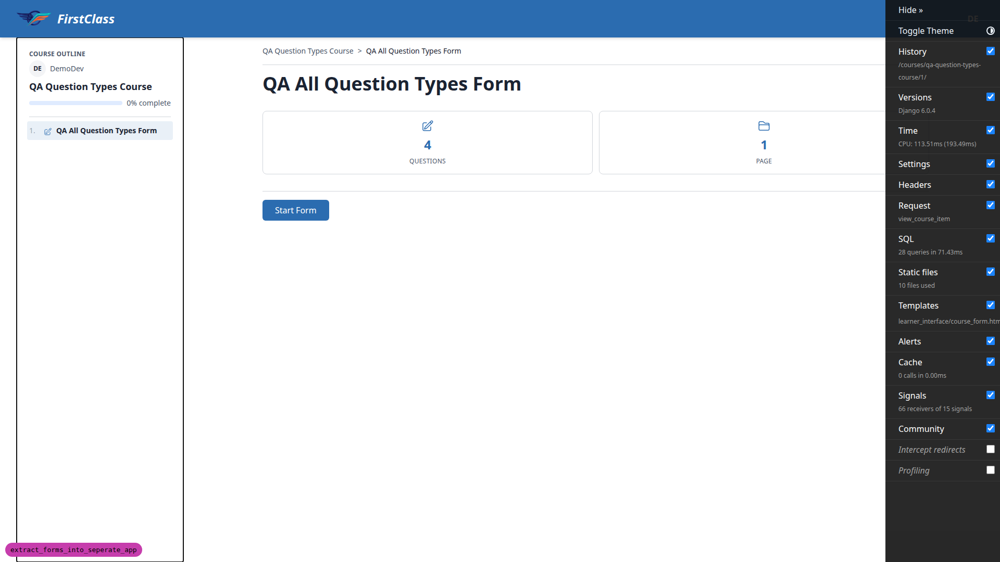
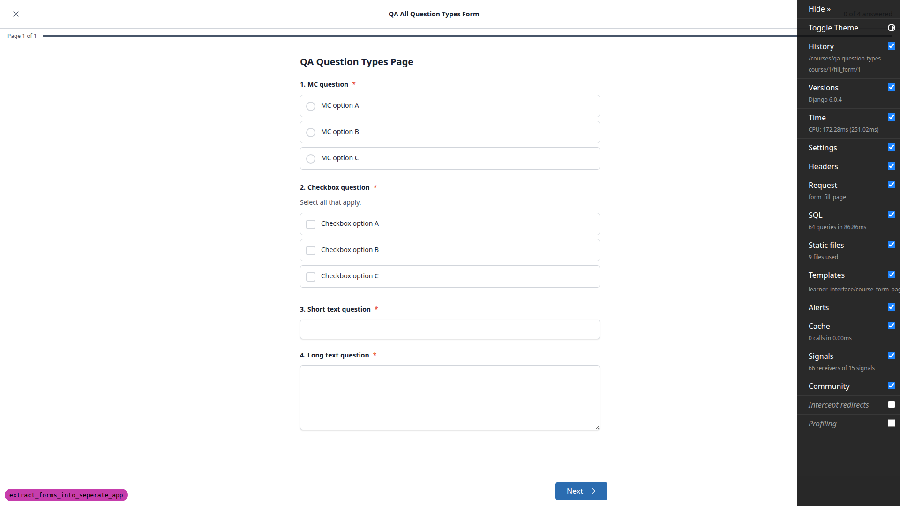
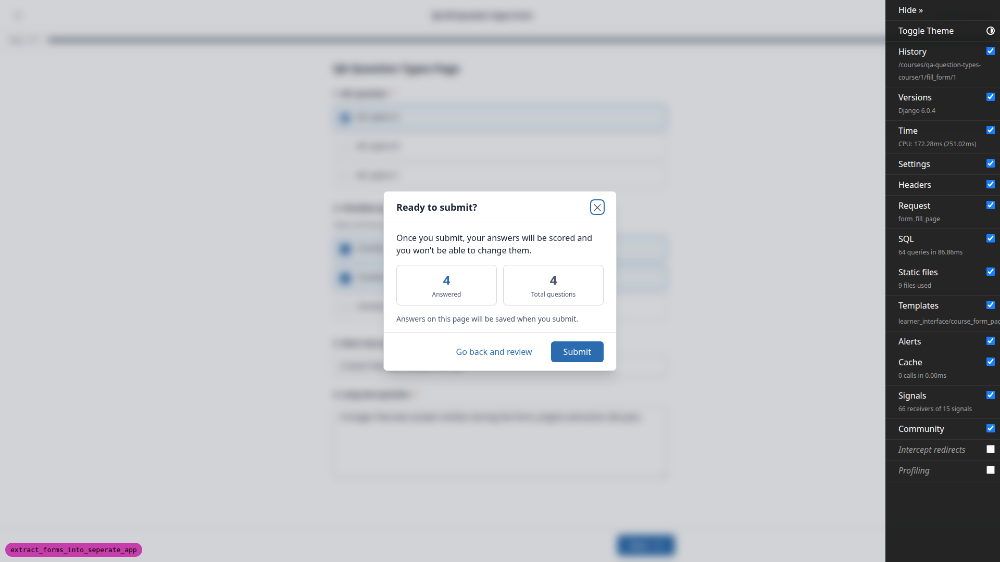
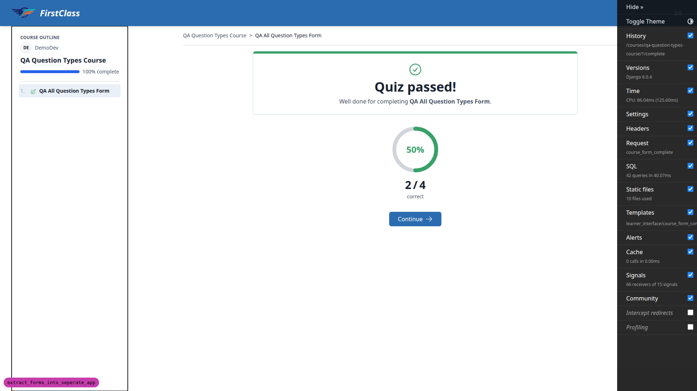

**A2 — desktop — PASS**
Used the End course Quiz — item **4** of `functionality-demo-show-end-with-quiz`
(`submit_on_exit=False`). Note: the plan's item numbering is slightly off; the actual layout is
1 = topic, 2 = Mid course Quiz, 3 = topic, 4 = End course Quiz (the plan's "items 2 and 4" for the
two quizzes is right, but its earlier reference to "item 1" is not). Answered all three page-1
questions correctly, advanced to page 2, then navigated away to the course detail page without
finishing. Returning to the item now renders **"Continue Form"** in place of "Start Form"
(`form_start_page_buttons` reading `quiz_verdict` across the app boundary), and re-entering the runner
at `fill_form/1` shows all three page-1 radios still selected with the counter reading **"3 of 6
answered"** (`existing_answers_dict`).

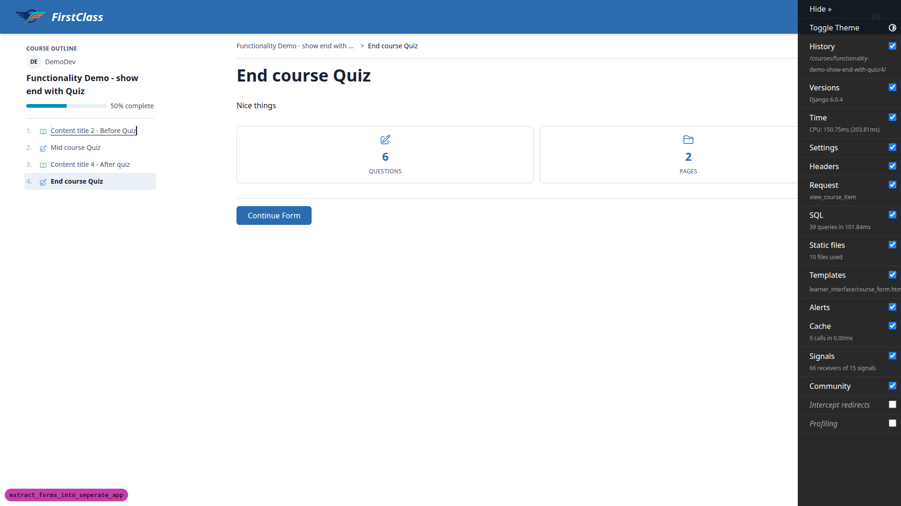
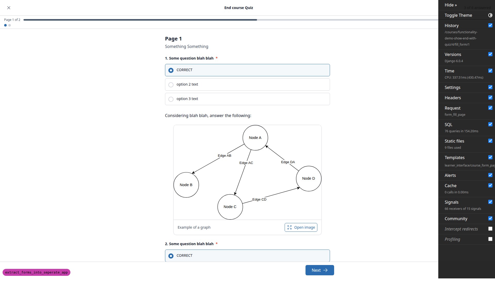

**A3 — desktop — PASS**
Logged in as `demodev_quizqa@email.com`, opened the `qa-free-text-survey-course` item, filled page 1's
required short-text and long-text questions, continued to page 2, left both optional questions blank,
and completed. The completion page reads **"Form complete! Thank you for completing QA Free Text
Survey. Your answers have been recorded."** — no score ring, no pass/fail banner, no incorrect-answer
review anywhere: the `quiz_verdict(...) is None` branch behaving correctly for a `CATEGORY_VALUE_SUM`
form; `FormProgress.passed()`, which raises on a null pass mark, is never reached. Using **Previous**
from page 2 back to page 1 re-rendered both saved free-text answers verbatim into the input and the
textarea. The course moved to **100%** complete, confirming the completion signal fires for unscored
forms too.

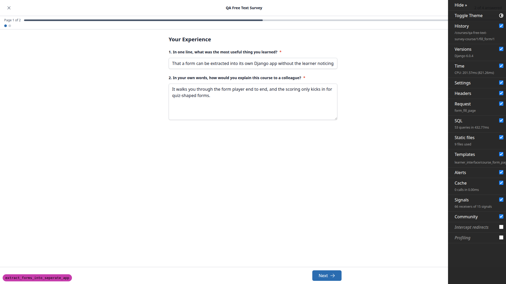
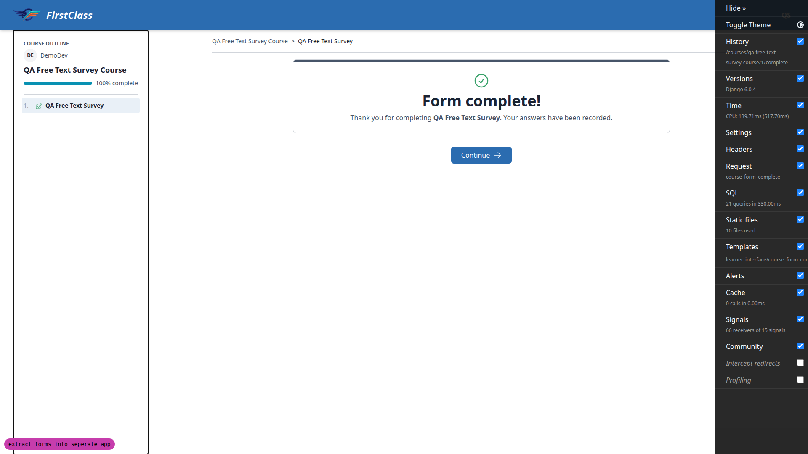

---

### Section B — the signal substitution (the one real behaviour change)

**B1 — desktop — PASS**
Baseline read first: the dashboard card for `qa-progression-block-course` showed **33%** (non-zero,
under 100), item 1 Completed, item 2 the quiz, item 3 Locked and unlinked. Sat the quiz answering all
three multiple-choice questions and both correct checkboxes; the completion page reported
**"Quiz passed!"** at **100%**, **4/4 correct**. The course percentage moved **33% → 67%** on both the
course outline and the dashboard card in the same request, and item 3 flipped from "Locked" to
"Not started". The `form_attempt_completed` receiver is connected and the send inside
`FormProgress.complete()` is firing.

**B2 — desktop — PASS**
Reloaded the course home four times with cache bypassed, and the dashboard once more: **67% every
time**, never above 100. Returning to the completed quiz item shows it as done — a "Previous
attempts" panel reading **"24 Aug 2026 100% (4 / 4)"** and the only forward action being "Next". No
start, retry or resume affordance is offered, so there is no route to a second `complete()` call from
the UI, and the percentage does not move again. The database holds exactly one `FormProgress` row for
this learner and form.

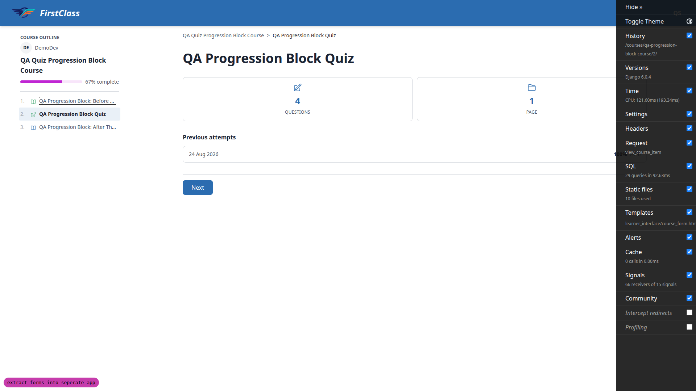

**B3 — desktop — PASS**
Progress was reset first (`qa_reset_learner_progress`, see General notes on its arguments). Re-sat the
quiz answering the three multiple-choice questions correctly and ticking only "Wrong box - leave me
alone" on the multi-select. The completion page shows a red **"Quiz not passed"** banner, **"You need
80% to pass"**, a score ring of **75%** with **"3 / 4 correct"**, and the incorrect-answer review
naming question 4, the learner's answer and both correct options — `quiz_show_incorrect=True` working.
The course percentage **stayed at 33%** and did not rise, confirming `attempt_completes_form` treats a
failed scored quiz as an attempt rather than a finished item. The TOC reads "1. Completed / 2. Needs
retry / 3. Locked" with no `href` on item 3. Adversarial check: a direct GET of
`/courses/qa-progression-block-course/3/` while the quiz is failed redirects to the course detail page
and never serves the topic body, and no `TopicProgress` row is created by the attempt — the gate is
enforced in the view, not only hidden in the TOC. Re-sitting and passing then took the score to
**100% (4/4)**, the course percentage back to **67%**, and item 3 to "Not started" with a working link.

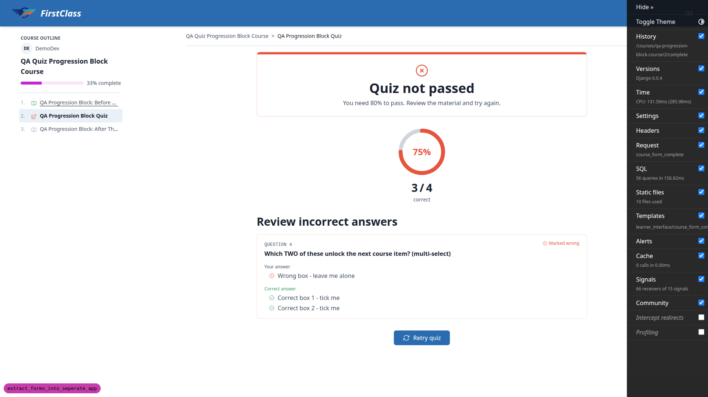
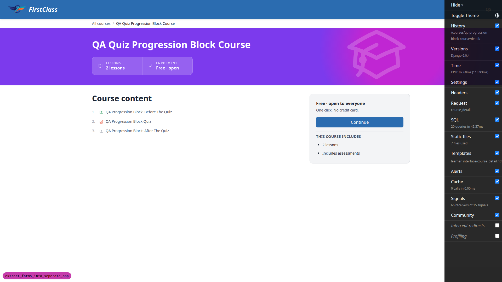

**B4 — desktop — PASS**
Both commands succeeded and the percentages settled correctly, but the test's premise has changed —
see General notes for the full account. `qa_complete_form DemoDev --cohort-name "QA Progress Demo
Cohort" --form-slug end-course-quiz` exited 0, "Created 6 completions," 6 new `FormProgress` rows all
with non-null `completed_time` (3 of 9 cohort members were skipped because the guard is `.exists()`,
not is-completed). No learner's percentage moved: `0/0/0/25/75/50/75/75/100` before and after.
`recalculate_progress_percentages` then ran clean — importing `completed_form_ids_by_user` from
`freedom_ls.form_engine.queries`, a moved symbol — and reported **"Recalculated 24 records, updated
0."** The equal before/after percentages are explained by the failed-quiz rule (the command submits no
answers, so `complete()` scores 0/6 against a 50% pass mark), not by an absent recalculation — verified
independently via `CourseProgress.last_accessed_time` (auto_now), which shows the six touched learners
carrying timestamps inside the command's own run window (17:44:14.47–17:44:15.75) while the three
skipped learners still carry 15:26:23.

---

### Section C — content types: deadlines and reporting

*Covers silent-failure candidate 2: `ContentType.get_for_model(Form)`.*

**C1 — desktop — PASS**
`django_content_type` holds exactly one row for the form model — id 16,
`freedom_ls_form_engine.form` — with no stale `content_engine.form` duplicate, and the admin's
content-type dropdown offers it as **"Freedom_Ls_Form_Engine | form."** In the educator cohort
progress grid (QA Progress Demo Cohort), form items get their own columns exactly like topic items:
"Knowledge Check" and "Course Feedback" on Functionality Demo – Course Parts, "Mid course Quiz" and
"End course Quiz" on Functionality Demo – show end with Quiz, all populated rather than blank. A
pre-seeded `LearnerDeadline` already points at `content_type freedom_ls_form_engine.form` →
"Knowledge Check." For the write path: created a `CohortDeadline` in the admin against content type 16
with the Mid course Quiz UUID and a 1 Dec 2026 deadline; it saved, the admin changelist resolved its
Content Item column to "Mid course Quiz," and reloading the educator grid shows **"Due: Dec 01"**
under the Mid course Quiz column and under no other column.

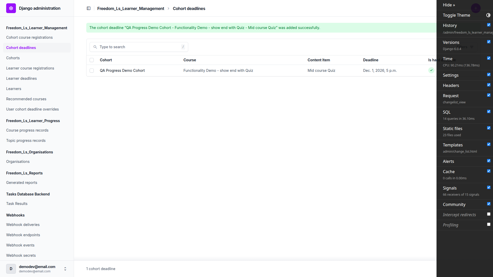
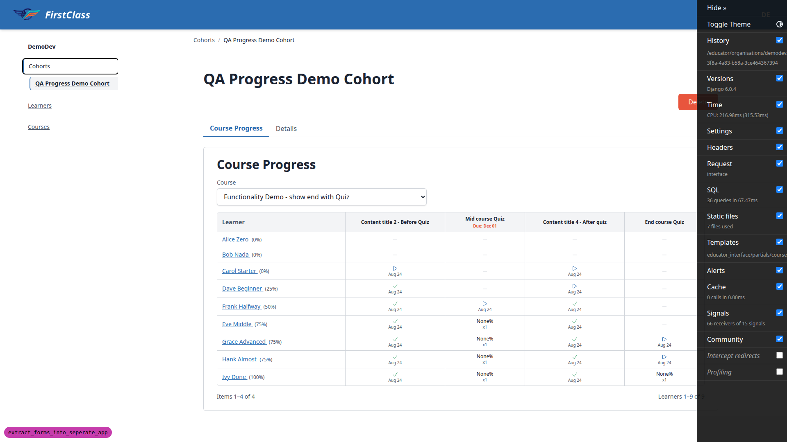

**C2 — desktop — PASS**
Logged in as `qa-carol.starter@example.com`, a member of QA Progress Demo Cohort and registered for
`functionality-demo-show-end-with-quiz`, and opened that course's TOC. The deadline set in C1 shows as
**"01 Dec"** against item 2 (Mid course Quiz) and against no other item — the learner-side render of a
cohort deadline whose content type is `freedom_ls_form_engine.form` resolves to exactly the right
form. Her TOC otherwise reads "1. In progress / 2. Locked / 3. In progress / 4. Needs retry,"
consistent with sequential-unlock rules and with the End course Quiz row the B4 command created for
her. Setup note: this account needed both a known password and a verified, primary allauth
`EmailAddress` row before it could log in (see General notes).

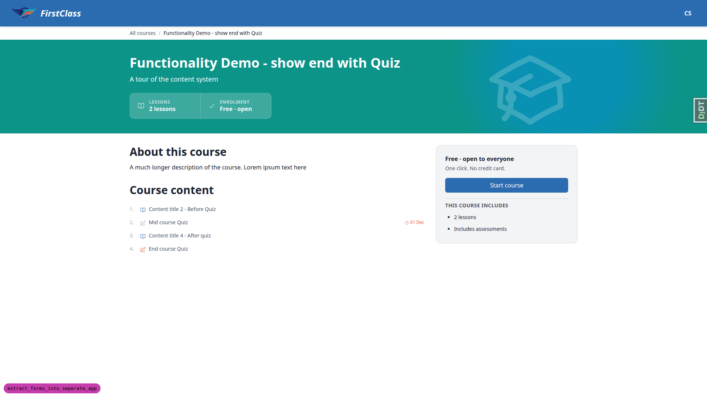

**C3 — desktop — PASS**
Ran the admin's "Generate cohort report" action against QA Progress Demo Cohort, whose courses contain
three scored quizzes. The row reached status **Ready** about a minute later and downloads over the
admin download URL as a **606 KB `application/pdf`** (magic bytes `%PDF`), 16 pages. Extracted text
confirms every moved symbol resolved: the report names all three quizzes (Knowledge Check, Mid course
Quiz, End course Quiz), carries per-learner completion and quiz scores (e.g. "71% 5 of 7," "100% 7 of
7," "75% 3 of 4"), a per-question breakdown quoting question text with per-option correctness glyphs,
and a cohort-wide "Quiz confusions" section. This exercises `reports/gather.py` and `reports/indexes.py`
together, which between them import nine symbols this refactor moved. No `error_message` on the row,
no traceback in the runserver log.

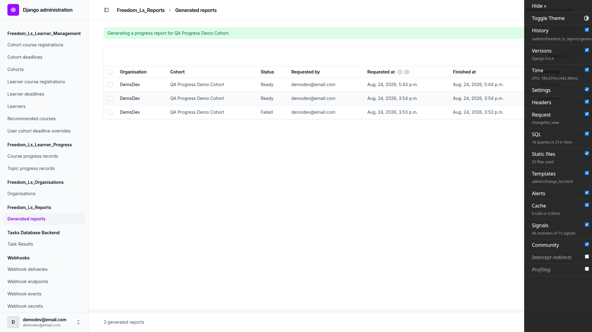

---

### Section D — the Django admin

*Covers silent-failure candidate 4: twelve admin classes moved app.*

**D2 — desktop — PASS**
New admin section present with all 7 expected models: Forms, Form pages, Form contents, Form
questions, Question options, Form progress records, Question answers. Heading renders as
**"Freedom_Ls_Form_Engine"** rather than "Form engine," matching the existing convention for every
other FLS section (`Freedom_Ls_Content_Engine`, `Freedom_Ls_Learner_Progress`) — consistent, not a
defect.

**D3 — desktop — PASS**
`Freedom_Ls_Content_Engine` now lists only Activities, Content collection items, Course parts,
Courses, Files, Topics. Forms, Form contents and Question options are gone from it, as intended.

**D4 — desktop — PASS**
`Freedom_Ls_Learner_Progress` now lists only Course progress records and Topic progress records. Form
progress and Question answers no longer appear there.

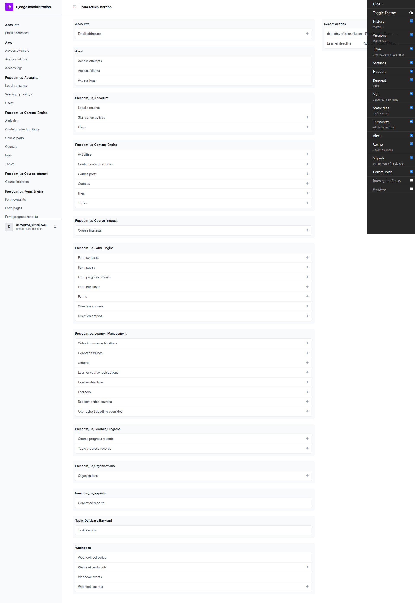

**D5 — desktop — PASS**
Form change page (Knowledge Check) renders `FormPageInline` with the existing page and an "Add another
Form page" control. Drilling into a Form page (QA Progression Block Quiz Page) renders both
`FormContentInline` ("Form contents") and `FormQuestionInline` ("Form questions," 4 questions).
Opening a Form question renders `QuestionOptionInline` ("Question options"). No cross-app inline
errors.

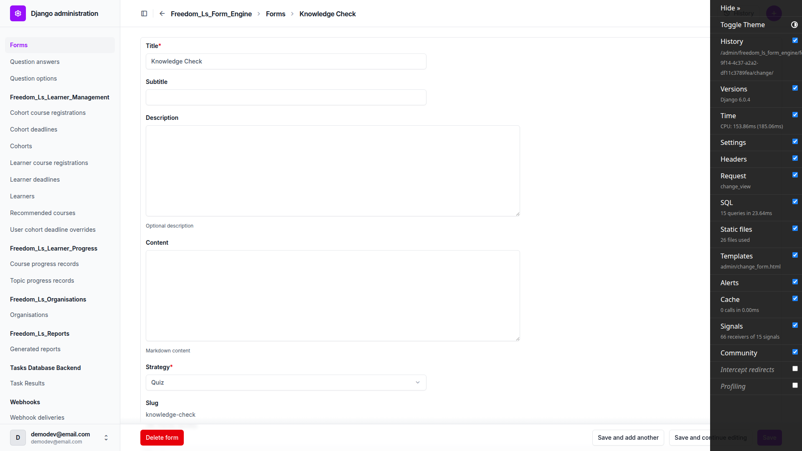
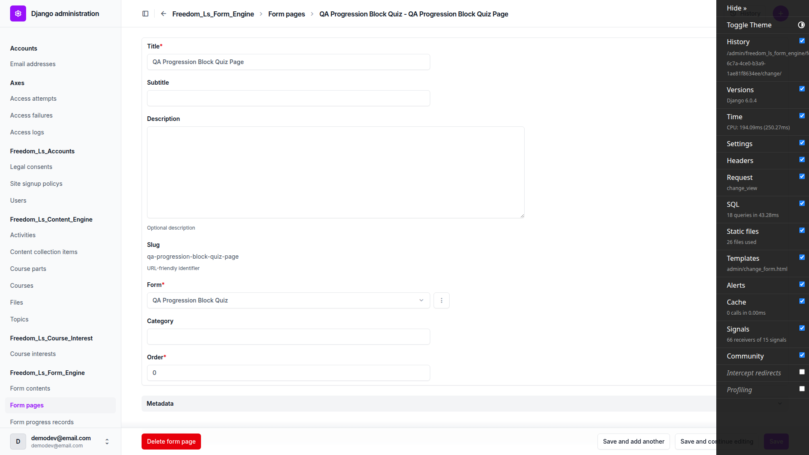
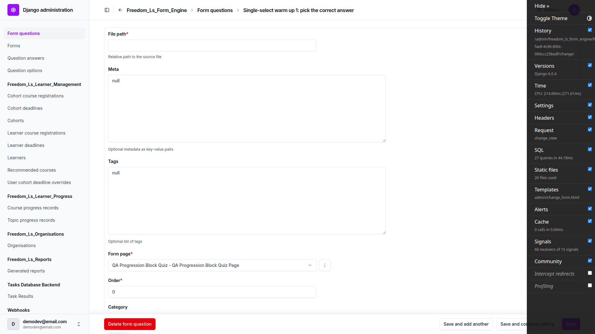

**D6 — desktop — PASS**
Form progress record change page (`qa-ivy.done@example.com` – Course Feedback) renders the Progress
fieldset and the `QuestionAnswerInline` ("Question answers").

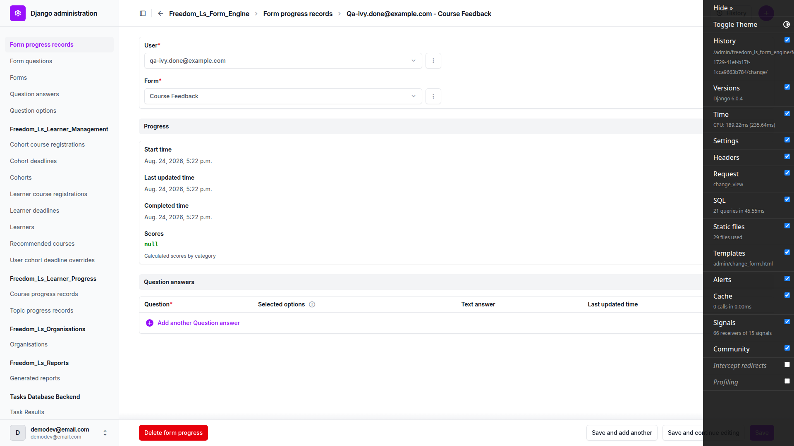

**D7 — desktop — PASS**
Site scoping holds. `Form._base_manager` shows 9 forms (8 DemoDev + 1 Bloom, "QA Bloom Site Scoping
Form"), but the admin Forms changelist under the DemoDev-resolved request lists exactly the 8 DemoDev
forms, not the Bloom one. Proven in the **negative direction only**: `FORCE_SITE_NAME=DemoDev` is set
in this dev environment, so every browser request resolves to DemoDev regardless of port; seeing the
Bloom changelist would require the server restarted with `FORCE_SITE_NAME=Bloom`, which was
deliberately not done (see General notes — "not tested").

---

### Section E — the template-render-time edge

*Covers silent-failure candidate 3: `content_tags.get_content_by_path`.*

**E1-E2 — desktop — PASS**
The topic carrying `<c-content-link>` renders with no 500 and no `ImportError` in the runserver log,
confirming `content_tags`' render-time `Form` import is correctly repointed to
`freedom_ls.form_engine.models`. Item numbering note: the topic holding the link is item **1** of
`functionality-demo-show-end-with-quiz` (items are 1 = topic, 2 = Mid course Quiz, 3 = topic, 4 = End
course Quiz). The "last chapter" link renders as the component's not-found ``
fallback rather than an `<a>`, because no Topic anywhere in the database has `file_path`
`01-what-is-git-for.md` — a **pre-existing demo-content authoring gap, not a regression**:
`cotton/content-link.html` is byte-identical to `main`, and the only change to `content_tags.py` is the
one import line. No demo content links to a Form, so `get_content_by_path`'s Form branch has no
content fixture exercising it directly; the Form import itself is module-level and demonstrably loads
(see "Not tested" in General notes).

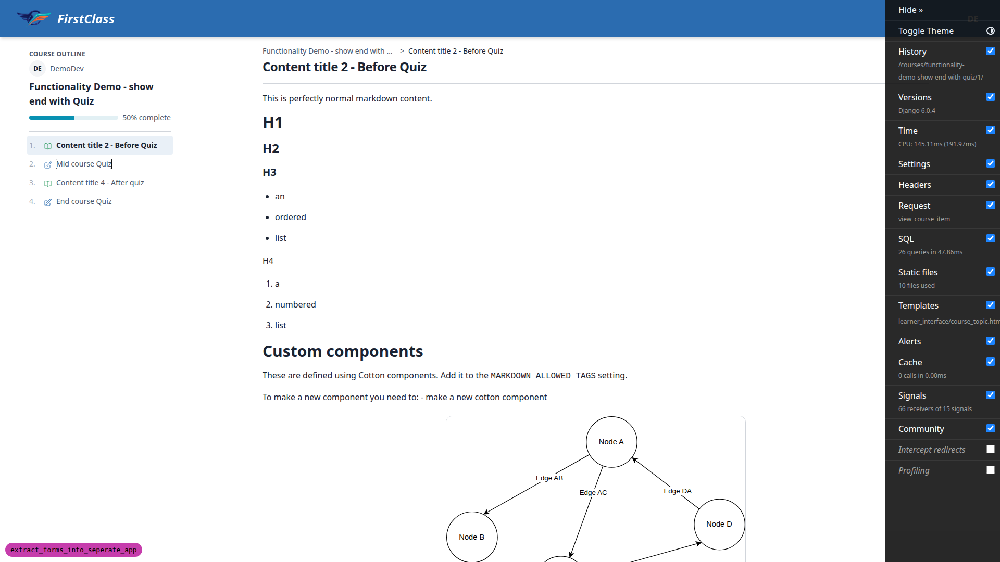

**E3 — desktop — PASS**
All 5 items of `content-widgets-demo-reference` (Annotation and Emphasis, Media, Structured Content,
Interactive Widgets, Cards) plus the course detail page render 200 with every widget intact. Console
shows only pre-existing report-only CSP INFO lines for CDN scripts and a "web-share" feature warning.

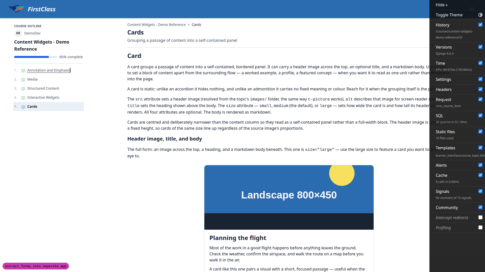

---

### Section F — failure and adversarial branches

**F1 — desktop — PASS**
Submitting the page with nothing answered is refused: the radio, short-text and long-text inputs carry
the HTML5 `required` attribute, so the browser blocks the submit and no request leaves the page.
Answering only the radio (plus the two text questions) and submitting again is still refused — the
Alpine runner's checkbox-group gate renders the inline message **"Select at least one option"**
against the unanswered checkbox question, the answered counter stays at 3 of 4, and again no POST is
issued. The page is never accepted and there is no 500. Notable finding: the plan's expected HTTP 422
is real (`learner_interface/views.py:1132` returns `status=422` when `required_answers_error` is set)
but **unreachable through the UI**, because the client-side gate fires first — a 422 would only appear
for a crafted POST. Individual checkboxes deliberately carry `data-required` rather than `required`,
since HTML `required` on a checkbox would demand every box be ticked.

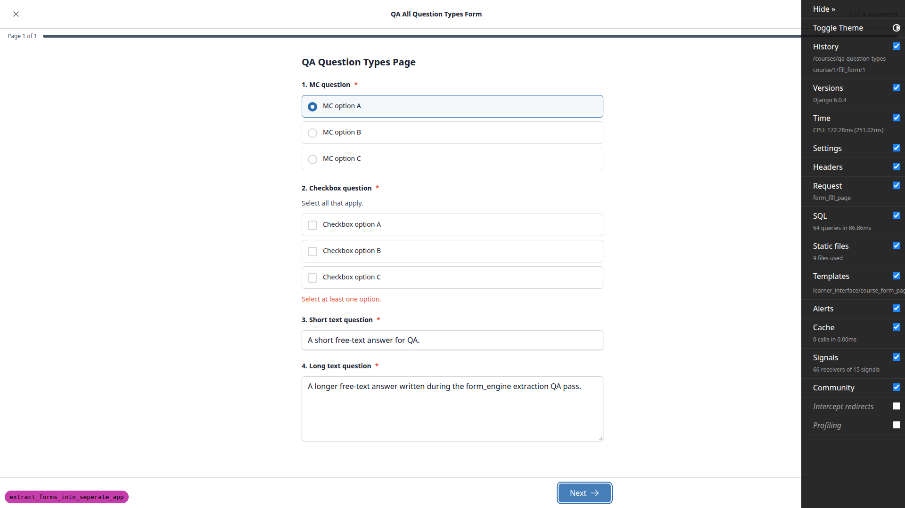

**F2 — desktop — PASS**
Re-entered page 1 of an attempt that already had answers saved, changed question `1274eec8` from its
correct option to "option 2 text," and submitted the same page again. The answer was updated in place:
the attempt still holds exactly 3 `QuestionAnswer` rows with no duplicate `question_id`, the changed
row now points at the new option, and the runserver log records zero `IntegrityError` and zero
tracebacks. The `unique_together` on `(form_progress, question)` is being honoured through an update
path, not a second insert.

**F3 — desktop — PASS**
All five hostile URLs answered 404 as the logged-in registered learner, with no 500 and no question
text anywhere in the responses:

| URL | Result |
|---|---|
| `/courses/qa-question-types-course/99/` | 404 |
| `/courses/qa-question-types-course/0/` | 404 |
| `/courses/qa-question-types-course/1/fill_form/99` | 404 |
| `start_form` on Topic item 1 of `functionality-demo-show-end-with-quiz` | 404 |
| `start_form` on Topic item 3 of `functionality-demo-show-end-with-quiz` | 404 |

`get_form_for_index` correctly refuses a non-Form item; the runserver log records no traceback for any
of them.

**F4 — desktop — PASS**
Logged out entirely and requested `/courses/qa-progression-block-course/2/start_form`: redirected to
`/accounts/login/?next=...` — no form, no 500. Then logged in as `demodev_quizqa@email.com`, who is
registered for `qa-free-text-survey-course` and `qa-progression-block-course` only, and requested
`/courses/qa-question-types-course/1/start_form`: redirected to that course's detail/enrolment page
with the item shown as **"Locked."** None of the form's question text ("MC question," "Checkbox
question," "Short text question") appears anywhere in the response. Course authorisation is still the
gate, as intended.

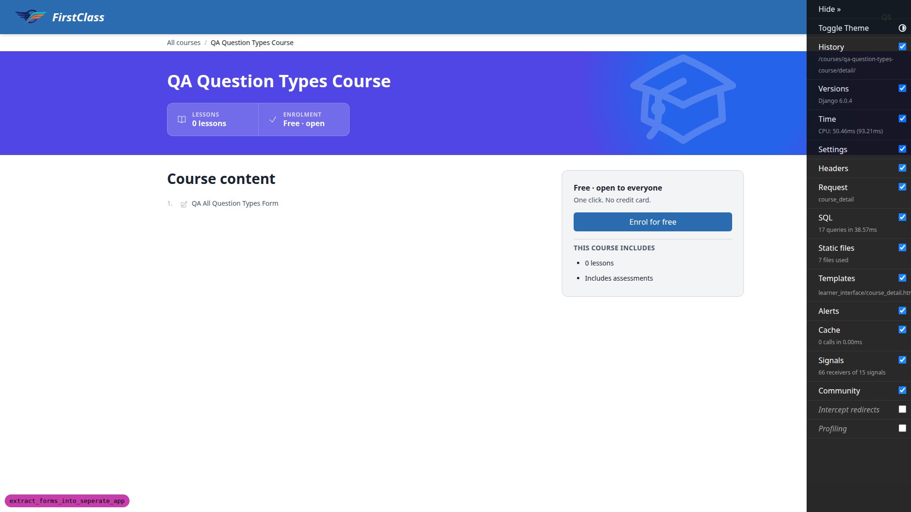

**F5 — desktop — PASS**
Both halves behave as specified. `submit_on_exit=True` (Mid course Quiz, item 2): answered all three
page-1 questions correctly and hit Exit **without** pressing Next; the dialog reads "Leaving now will
submit your answers and score your attempt," and its "Leave and submit" control is a submit button
bound to `runner-page-form`, so the current page's answers travel with it. Landed on `/2/complete`
scored **3/6 = 50%** with the three unanswered page-2 questions marked wrong — proof the page-1
answers were carried, not dropped. Re-entering the item offers "Try Again" (a fresh attempt), never a
resume, and the TOC reads "Needs retry." The course stayed at 50%, which is correct rather than a
missed recalculation: `attempt_completes_form` treats a failed scored quiz as an attempt, not a
finished item, so `complete()` ran but the item did not become complete. `submit_on_exit=False` (End
course Quiz, item 4): the same exit affordance instead offers "Leave and save," a plain link with no
submit; afterwards the item offers "Continue Form" and the course percentage is unchanged at 50%. The
incorrect-answer review rendered on the completion page (`quiz_show_incorrect=True`).

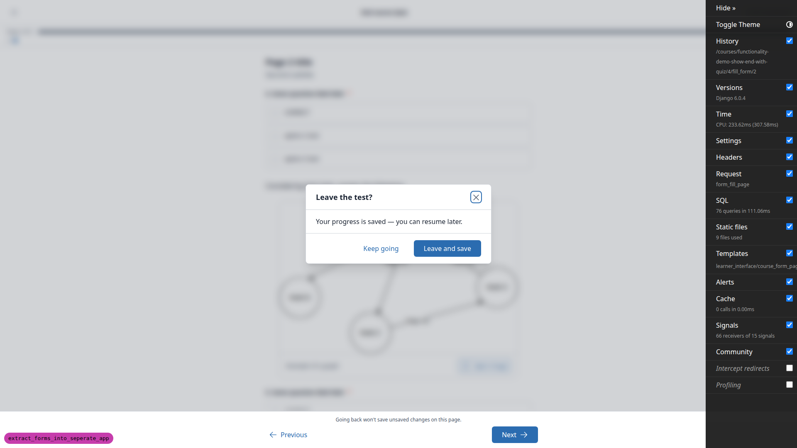
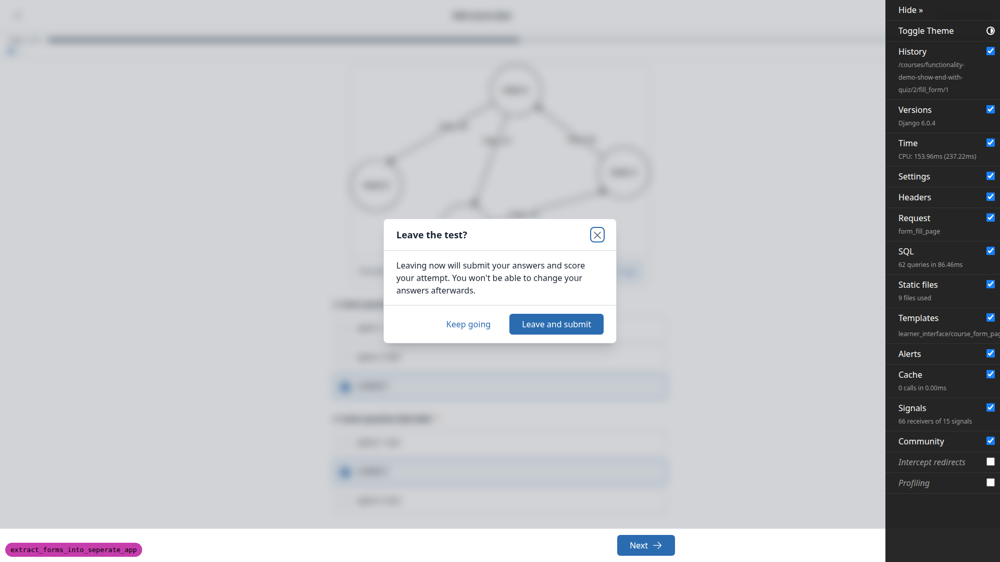
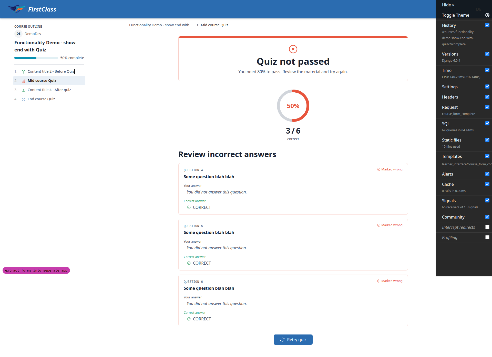

---

### Section G — sweep

**G — desktop — PASS**
`/courses/` lists all 8 DemoDev courses with no empty list. Walked every course: the 3 courses
`demodev` is registered for serve their items directly (content-widgets-demo-reference items 1–5,
functionality-demo-show-end-with-quiz items 1–4, qa-question-types-course item 1) with a 404
immediately past the last item; the 5 unregistered courses redirect their item URLs to the enrolment
detail page — the course-access gate behaving correctly, not a missing page. Course-outline progress
bars render with live values throughout (33%, 50%, 67%, 100% all observed). A log scan over the whole
session — **1631 requests** — finds zero occurrences of `ImportError`, `ModuleNotFoundError`,
`RuntimeError`, "doesn't declare an explicit app_label," "ContentType matching query does not exist,"
`RelatedObjectDoesNotExist`, `IntegrityError`, `Traceback` or `Internal Server Error`. Every non-2xx/3xx
response is one of the tester's own deliberate out-of-range probes plus a favicon 404. Browser console
on the form runner and completion page reports **0 errors, 0 warnings**; the only console output
anywhere is pre-existing report-only CSP INFO lines for CDN-loaded htmx/Alpine/chart.js, a "web-share"
unrecognized-feature warning, and a YouTube embed adapter warning — none of them new.

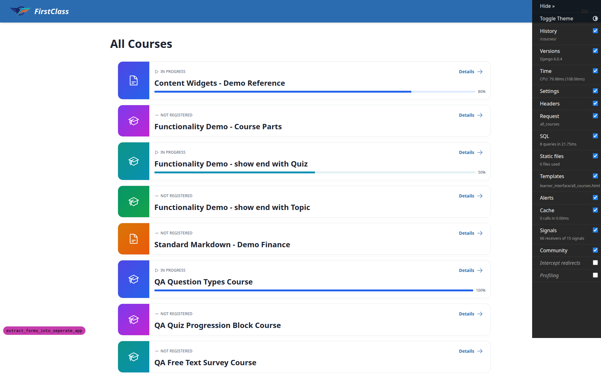

---

### Responsive passes (mobile and tablet)

**A1-mobile — mobile (375×812) — PASS**
Form start page: zero horizontal overflow on the document, nothing extends past the right edge, the
breadcrumb truncates with an ellipsis instead of pushing the layout, and the Questions/Page stat cards
sit side by side. The "Previous attempts" panel and the Finish Course button both render at a sensible
width.

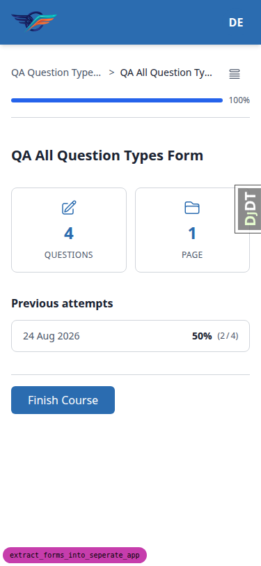

**A1-runner-mobile — mobile (375×812) — PASS**
The form runner is the key mobile surface and it holds up. Sticky header carries the exit control, the
form title and the "3 of 6 answered" counter; below it the page indicator, progress bar and page dots.
Answer options are full-width **343×48 px** touch targets — comfortably above the 44 px guidance — and
the sticky Next button is 343 px wide. Document horizontal overflow is **0 px** and no element in
`main` or the form crosses the right edge, including the embedded SVG diagram in the question body.

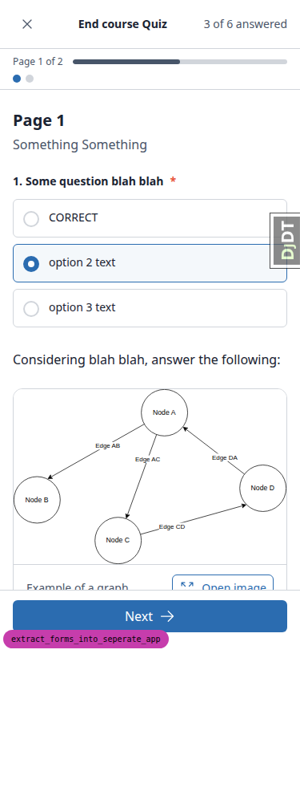

**A1-complete-mobile — mobile (375×812) — PASS**
Completion page stacks cleanly: failed banner, score ring at 50% with "3 / 6 correct" beneath it, then
one review card per incorrect question each showing the question, the learner's answer and the correct
answer, and a full-width "Retry quiz" button. Nothing overlaps except the fixed dev branch badge, which
is dev-only chrome and not product UI.

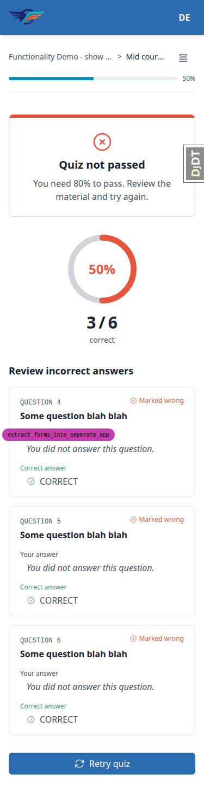

**C1-mobile — mobile (375×812) — PASS**
The educator cohort progress grid is the widest layout in scope. At 375 px the 928 px table is
contained by a wrapper with `overflow-x: auto` (`clientWidth` 299, `scrollWidth` 928), so it scrolls
inside its own container and the document itself has 0 px of horizontal overflow. The learner name
column stays pinned. Form columns behave the same as topic columns at this width.

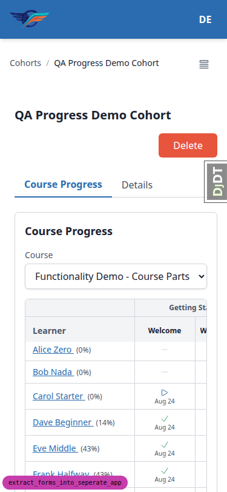

**Nav-mobile — mobile (375×812) — PASS**
The desktop course-outline sidebar collapses behind an "Open course outline" button that is hidden at
`lg` and up. Tapping it opens a bottom-sheet drawer over a dimmed backdrop showing the site badge,
course title, a 50%-complete progress bar and the numbered item list, with distinct icons separating
topic items from form items. The header user menu toggles independently.

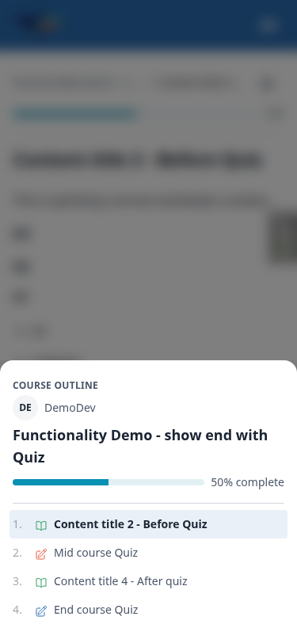

**Nav-tablet — tablet (768×1024) — PASS**
The course player takes the mobile navigation rather than the desktop one, which is the right call: the
persistent outline sidebar is `display:none` and the "Open course outline" drawer button is visible,
because the sidebar's breakpoint is `lg` (1024px) and a 768px tablet sits below it. `main` fills the
768px width, document horizontal overflow is 0 px, and no element in `main` crosses the right edge
including the embedded SVG diagrams.

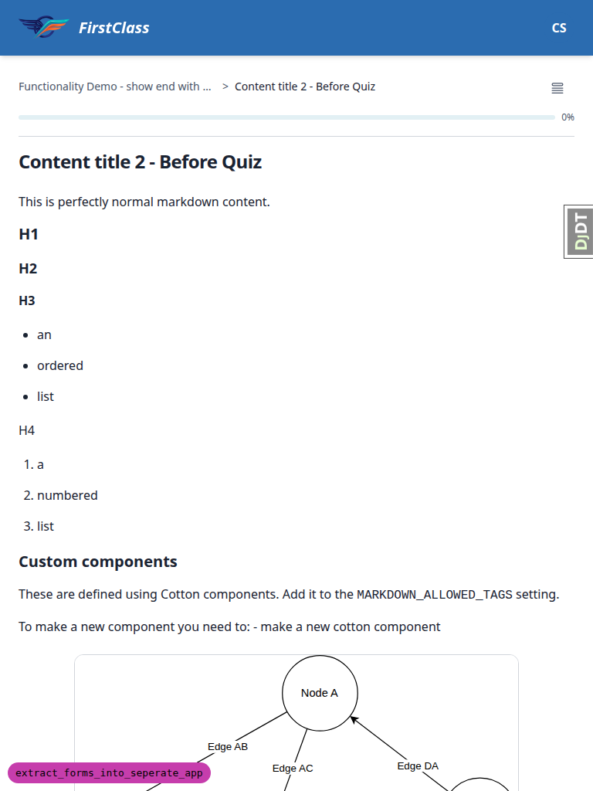

**A1-runner-tablet — tablet (768×1024) — PASS**
The form runner adapts sensibly rather than just stretching. The question column is held to a readable
measure instead of spanning the full width, answer options stay full-width tap targets within that
column, the diagram widget sits inside a bordered figure with its caption and "Open image" control on
one line, and the footer Next button switches from mobile's full-width to an auto-width right-aligned
button. Header still carries exit, title and the answered counter.

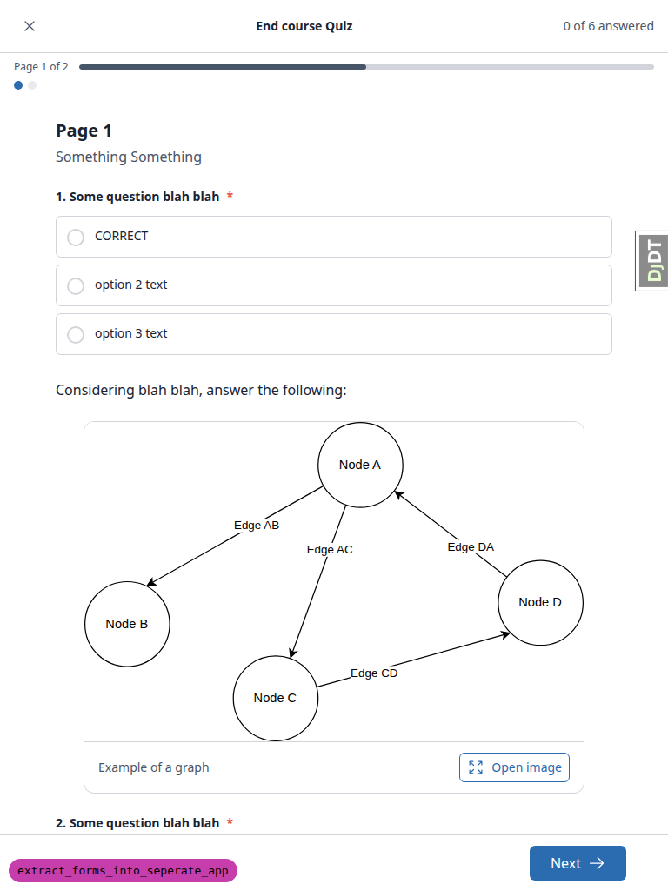

**C2-tablet — tablet (768×1024) — PASS**
Learner course detail: single-column layout, no horizontal overflow, and the form deadline renders as
a clock-icon "01 Dec" chip aligned right on the Mid course Quiz row and on no other row. Per-item
status labels (In progress / Locked) are present in the markup at this width too.

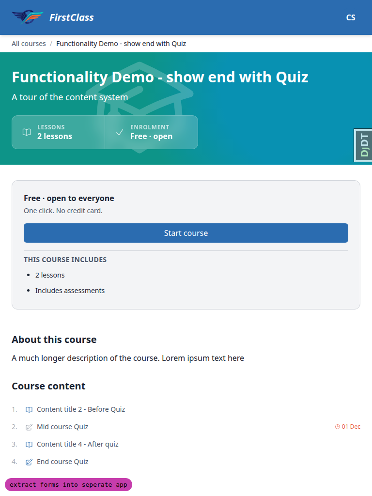

**C1-tablet — tablet (768×1024) — PASS**
Educator cohort progress grid: the 928px table is still contained by its `overflow-x: auto` wrapper
(`clientWidth` 628, `scrollWidth` 928), so it scrolls inside the panel and the document has 0 px of
horizontal overflow. All 7 item columns including both form columns keep their headers; the tablet gets
more of the table visible than mobile without the panel crowding the page.

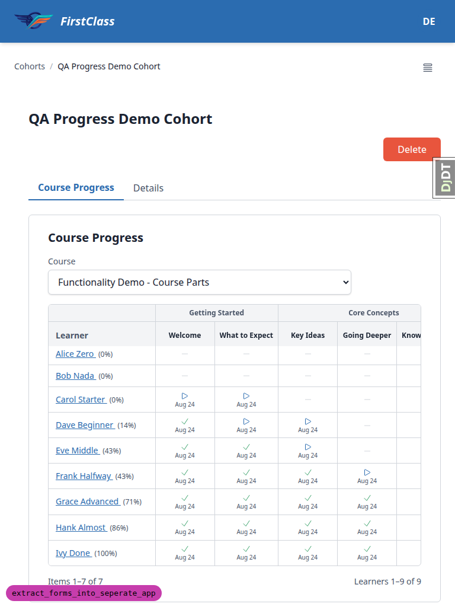

**D5-tablet — tablet (768×1024) — PASS**
The moved admin at 768px: the Form page change view renders its Metadata fieldset plus both the Form
contents and Form questions inlines with 0 px of document overflow and nothing past the right edge.
The unfold admin collapses its sidebar into a toggle at this width and the inline stacks read fine.

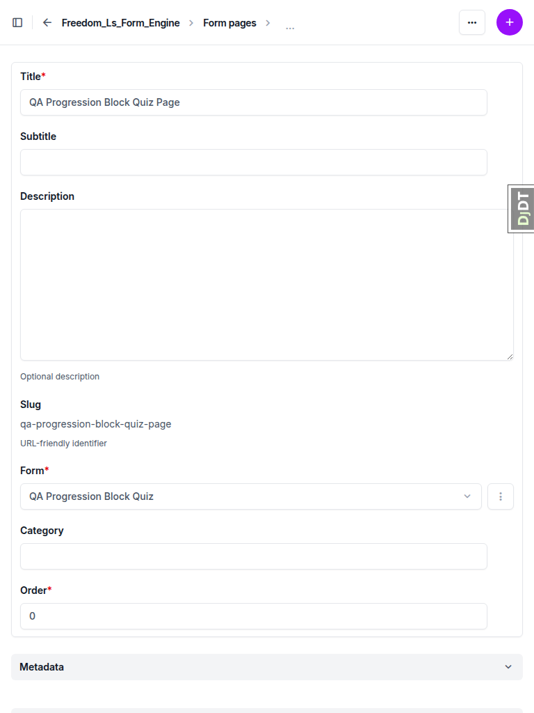

---

## Bug status

No bugs were found. There are no `bug` records for this run and no `test` record has status `fail`.

---

## General notes

**Pre-existing `None%` rendering in the educator progress grid, out of scope for this branch.** In the
educator cohort progress grid, a completed quiz cell whose `FormProgress` has `scores=None` renders
the literal text **"None%."** Seen against Knowledge Check, Mid course Quiz and End course Quiz for the
`qa_create_cohort_progress` personas. Cause: `_build_cell` seeds a `'quiz_percentage': None` default,
the `fp.scores` guard skips the block that would replace it, and the template prints
`{{ cell.quiz_percentage }}%`. Checked against `main` with `git show`: the `None` default, the guard
and the template line are byte-identical there, so `main` renders "None%" for the same data. This
branch's only change in that method is `except (KeyError, ValueError)` narrowing to
`except ValueError`, which is safe because `quiz_percentage()` now converts the missing-key case into
`ValueError` itself. Worth a separate cosmetic ticket against `main`, not against this refactor.

**B4's premise has changed.** The plan's B4 step expects `qa_complete_form` to create a pre-completed
`FormProgress` "which fired no recalculation before this change and must fire none after it." That is
no longer what the command does. On `main` it called `FormProgressFactory(..., completed_time=...)`, a
plain create that sent no signal. On this branch (as of commit `7a78c4f6`, the previous QA run's bug 1
fix) it calls `FormProgress.objects.create(...)` then `progress.complete()`, and `complete()` ends in
`form_attempt_completed.send(...)`. This is a **deliberate QA-helper rewrite, not a product
regression**: `qa_complete_form` lives in the QA-only `qa_helpers` app, the rewrite was intentional and
commented, and a grep confirms no production code anywhere hand-sets `completed_time` — the unscored
pre-completed row shape exists only in `qa_helpers`, tests and factories. Recommendation: rewrite the
B4 step to assert on `CourseProgress.last_accessed_time` rather than on a percentage, since a
percentage comparison cannot distinguish "no recalculation happened" from "a recalculation happened but
produced the same number" (which is what actually occurred here — see the B4 result above).

**Three plan/command argument mismatches, none of them defects:**

| Command | Plan says | Actual signature |
|---|---|---|
| `qa_reset_learner_progress` | run bare | requires `--learner` (exits 2, "Missing option '--learner'" otherwise) |
| `qa_create_cohort_progress` | run bare | requires a `SITE_NAME` positional argument |
| `qa_complete_form` | "against a form the learner has not sat" | is cohort-scoped (`SITE_NAME` + `--cohort-name` + `--form-slug`), with no `--learner` flag — the plan's step has to be read as targeting a cohort, not an individual learner |

**Plan item-numbering slip (sections A2 and E).** The plan refers to items of
`functionality-demo-show-end-with-quiz` inconsistently. The actual layout is: **1** = topic, **2** =
Mid course Quiz, **3** = topic, **4** = End course Quiz.

**`FORCE_SITE_NAME=DemoDev` and its consequence for D7.** Site resolution in this dev environment is
forced to DemoDev via `FORCE_SITE_NAME`, so the random QA port (8916) still serves DemoDev content
regardless of what the URL's host/port would otherwise imply. This means D7 (admin site scoping) could
only be proven in the **negative direction** — the DemoDev-scoped changelist correctly excludes the one
Bloom-site form. Proving the positive direction (that a Bloom-scoped request sees only Bloom's form)
would require restarting the server with `FORCE_SITE_NAME=Bloom`, which was not done this run.

**`qa_create_cohort_progress`'s misleading password line, and the login precondition it omits.** The
command prints "All learner passwords: testpass123," but it does not reset the password of a persona
that survived an earlier run. Separately, a cohort learner also needs a verified, primary allauth
`EmailAddress` row before they can log in, because `ACCOUNT_EMAIL_VERIFICATION` is mandatory — this had
to be set up by hand for `qa-carol.starter@example.com` before C2 could run.

**F1's HTTP 422 is real but unreachable through the UI.** `learner_interface/views.py:1132` genuinely
returns `status=422` when `required_answers_error` is set, but the client-side required/data-required
gates fire first, so a browser network-tab check will never show a 422 in normal use — only a crafted
POST bypassing the client-side validation would reach that branch.

**What was not tested, and why:**

- No test could exercise `get_content_by_path`'s **Form** branch, because no demo content links to a
  Form via `<c-content-link>`. The Form import in `content_tags.py` is confirmed to load correctly at
  module level (E1-E2), but the branch that resolves a path to a Form object specifically has no
  content fixture that reaches it.
- D7's positive direction (proving a `FORCE_SITE_NAME=Bloom` request sees only Bloom's form in the
  admin) would require restarting the server with that environment variable set, which was
  deliberately not done this run.

---

status: ok
reason: report rendered, 35 tests, 0 bugs documented
