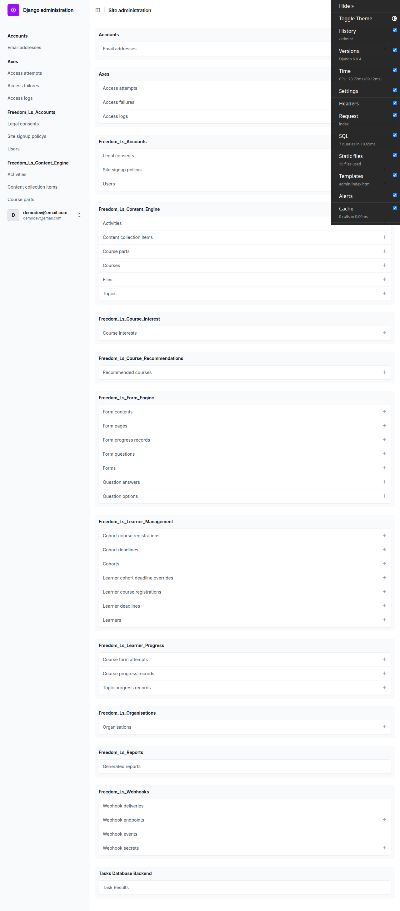

# Frontend QA report — final_pre_deploy_db_structure_cleanup

## 1. Methodology

The test plan executed was `spec_dd/2. in progress/final_pre_deploy_db_structure_cleanup/3. frontend_qa.md`, sections Test 1 through Test 8, plus the plan's dedicated mobile pass (M1-M6, 375x812) and tablet pass (T1-T5, 768x1024).

Before the run, the database was rebuilt from scratch: dropped, recreated, migrated against the branch's reset-to-`0001_initial` migration set, then seeded with `create_demo_data`, `content_save`, the plan's `qa_create_*` seed commands, and additional fixtures created ad hoc for individual tests (see General notes).

The smoke gate passed, so the full matrix ran — no test in the plan was skipped for that reason.

Screenshots were collected into `screenshots/`, immediately beside this report. Sixteen PNGs were captured; every filename referenced below (``) exists in that directory — none are invented and none are missing. Compression was run against `spec_dd/`; it reported no PNG files over 1024KB, so no image needed compressing.

## 2. Diff scoping

Scoping class: **FULL**.

It fired because the changed set is not confined to a narrow, single-surface diff: it includes cross-cutting template changes (`base/templates/cotton/data-table.html`, `educator_interface/templates/.../cohort_courses.html`, `.../learner_courses.html`, `.../course_progress_panel.html`, `learner_interface/templates/.../course_list.html`) alongside roughly 200 Python files spanning admin, models, migrations, forms, and views across most apps in the project — app-label changes, the `collection` -> `course` rename, `on_delete` rule changes, constraint respellings, a migration-history reset, a new `course_recommendations` app, and the deletion of `app_authentication`. A change of this shape touches the whole admin surface, the learner interface, the educator interface, and content/form handling simultaneously, so nothing could be safely scoped out.

Skipped: nothing. The full Test 1-8 matrix, plus the mobile and tablet passes, all ran.

## 3. Smoke gate

Outcome: **pass**.

Pages checked:
- `http://127.0.0.1:8491/` — learner dashboard: renders course cards, debug branch badge reads `final_pre_deploy_db_structure_cleanup`.
- `http://127.0.0.1:8491/admin/` — admin index: all app sections render, no 500/404/traceback.

No failure URL or reason was recorded; the run proceeded to the full matrix.

## 4. Results by test-plan section

### Test 1 — Admin app/section structure

- **1.1** (desktop) — PARTIAL PASS, one defect (see Bug B1 below). PASS elements: a Webhooks section holds all four webhook changelists (deliveries/endpoints/events/secrets); a Course recommendations section holds Recommended courses; there is no API Clients / app-authentication section anywhere; Learner management no longer lists Recommended courses. FAIL element: the section headings themselves render as `Freedom_Ls_Webhooks` and `Freedom_Ls_Course_Recommendations` rather than `Webhooks` and `Course recommendations`.
- **1.2-sidebar** (desktop) — pass. Learner management lists "Learner cohort deadline overrides" (renamed from "User cohort deadline overrides"); changelist URL `/admin/freedom_ls_learner_management/learnercohortdeadlineoverride/` present.
- **1.2** (desktop) — pass. The `learnercohortdeadlineoverride` changelist populates User (`qa-eve.middle@example.com`), Cohort (`QA Progress Demo Cohort`), Course (`Functionality Demo - Course Parts`), Content Item (`Whole course`) — confirming the `cohort_course_registration__course` rename resolved correctly.

### Test 2 — Admin delete lockdown

- **2.1** (desktop) — pass. Topic detail page: zero `/delete/` links; `_save`/`_continue`/`_addanother` buttons all present. Edited subtitle to "QA edited subtitle 8491", saved-and-continued, value persisted, no errors.
- **2.2** (desktop) — pass. Topic changelist has no `select[name=action]` element at all (its only action, `delete_selected`, was removed so the whole dropdown disappears). Contrast baseline: FormProgress changelist still has the action select with `delete_selected :: Delete selected Form progress records`.
- **2.3** (desktop) — pass. `GET /admin/freedom_ls_content_engine/topic/<id>/delete/` returns HTTP 403 Forbidden — not a confirmation page, not a 500.
- **2.4** across all locked-down content models — pass for every model: Activity (changelist only, no action select; zero Activity rows exist so the detail page could not be checked), Course (5 rows), CoursePart (3 rows), ContentCollectionItem (29 rows), File (7 rows), Form (5 rows, tag filter sidebar also renders), FormPage (7 rows), FormContent (4 rows), FormQuestion (22 rows), QuestionOption (64 rows). Every changelist has no action select and every checkable detail page has no `/delete/` links with save buttons intact — "eleven for eleven" locked down consistently.
- **2.5** across inlines — pass for Course, CoursePart, Form, FormPage (both its Form contents and Form questions inlines), and FormQuestion's Question options inline: zero `-DELETE` checkboxes and zero delete-column headers in each. **2.5-inline-add** confirms add still works with delete removed: added a Question option (text "QA added option", value "qa-added-option", order 99) to form question "What is a course part?", it persisted as `options-3` with no error.
- **2.6 / 2.6-bulk** (desktop) — pass. FormProgress and QuestionAnswer were correctly excluded from lockdown: FormProgress changelist keeps `delete_selected` (16 row checkboxes) and QuestionAnswer keeps both `delete_selected` and its detail `/delete/` link.

### Test 3 — Constraint respellings validate via `clean()`

- **3-cohort / 3.1** (desktop) — pass. Duplicate `(Site, Organisation, Name)` cohort submission re-renders the add form with "Please correct the errors below." and "Cohort with this Site, Organisation and Name already exists." — no IntegrityError, no traceback. A second cohort named "QA Duplicate Check" under a *different* organisation (Northside) saved successfully, confirming the constraint is scoped per organisation, not per site.
- **3-learnercourseregistration** — pass. Duplicate submission returns "Learner course registration with this Site, Learner and Course already exists." No 500.
- **3-cohortcourseregistration** — pass. Duplicate returns "Cohort course registration with this Site, Course and Cohort already exists." No 500.
- **3-learner** — pass. Duplicate returns "Learner with this Site, User and Organisation already exists." No 500.
- **3-courseinterest** — pass. Duplicate returns "Course interest with this Site, User and Course already exists." No 500.
- **3-file** — pass. Duplicate `file_path` on the same site returns "File with this Site and File path already exists." No IntegrityError.
- **3-webhooksecret** — pass, and the key case in this section: `clean_name` was deleted on this branch, so the Meta constraint is now the *only* place the rule lives. Submitting name `qa_existing_secret` (already present) with a fresh value returns "Webhook secret with this Site and Name already exists." No 500 — `ConstraintValidationFormMixin` picks the constraint up correctly.
- **3.2** (desktop) — pass. Created secret `qa_fresh_secret` carrying a throwaway QA string ending `2345`; the changelist shows the masked rendering `........2345`, so the last four characters line up. Reopening shows an `input type=password` with placeholder "Enter new value to change"; clearing and re-saving leaves the stored value unchanged (blank means keep, not wipe). See the render_value observation in General notes. <!-- pragma: allowlist secret -->

- **3.3** (desktop, educator UI) — pass. Creating cohort "QA Report Cohort" (already existing) via the "Create Cohort" modal re-renders in place with the inline field error "Cohort with this Site, Organisation and Name already exists." and preserves the typed value; a fresh name saves and redirects to the new cohort's detail page.

### Test 4 — `collection` -> `course` rename surfaces

- **4.1-learnercourseregistration** — pass. Columns User/Course/Is active/Registered at; Course populated on all 4 rows, no blanks. `?q=Course+Parts` narrows to the 2 matching rows (search_fields `course__title` resolves). Autocomplete endpoint directly hit: `field_name=course term=Course` returns `{'id': '531adc02...', 'text': 'Functionality Demo - Course Parts'}`.
- **4.1-cohortcourseregistration** — pass. Course populated on both rows; `?q=Course+Parts` returns 2, `?q=Finance` returns 0.
- **4.2** — pass. `recommendedcourse` changelist columns User/Course/Created at; row shows `demodev_s1@email.com | Content Widgets - Demo Reference`; `?q=Widgets` matches it.
- **4.3** — pass. `cohortdeadline` (4 rows) and `learnerdeadline` (7 rows) both have Course populated on every row with correct filter sidebars (`By cohort`/`By course`, `By course`/`By is hard deadline`). `learnercohortdeadlineoverride` filter links correctly use `cohort_course_registration__cohort__id__exact` and `cohort_course_registration__course__id__exact`.
- **4.4** — pass. Educator course detail for "Functionality Demo - Course Parts": "Cohort Registrations" panel lists QA Progress Demo Cohort and QA Report Cohort with dates; "Direct Registrations" panel lists demodev_s1 and Eve Middle with dates. Neither panel is empty.
- **4.5** — pass. `cohort_courses.html` renders "Functionality Demo - Course Parts (2026-08-29)"; `learner_courses.html` renders "Functionality Demo - show end with Topic , Functionality Demo - Course Parts" for demodev_s1 and `-` for learners with no direct registration; `course_progress_panel.html` renders "Course: Functionality Demo - Course Parts" with item-column headers and per-learner rows on the Cohort detail page. (Test-plan wording inaccuracy noted here — see General notes.) The diff was confirmed to move `CohortCourseRegistrationDataTable` from `select_related('collection')`/`order_by('collection__title')` to `select_related('course')`/`order_by('course__title')`.
- **4.6** — pass. As demodev_s1, the "Recommended Courses" section renders "Content Widgets - Demo Reference" with a working link — `recommendation.collection` was correctly renamed to `recommendation.course` in `learner_interface/partials/course_list.html`.
- **4.7** — pass. Clicking "Enrol for free" on the recommended course lands directly in the player at `/courses/content-widgets-demo-reference/1/`. Back on the dashboard, the course now shows under "In Progress" as REGISTERED 0%, and the "Recommended Courses" section disappears entirely (registering deleted the only RecommendedCourse row).
- **4.8** — pass. (Test-plan wording inaccuracy noted here — see General notes.) Generated a report for "QA Report Cohort" from `/admin/freedom_ls_reports/generatedreport/generate/`; the changelist row shows status Ready with a working Download link. The 12-page PDF contains "Functionality Demo - Course Parts" 3 times (including "COURSES COVERED ... Functionality Demo - Course Parts - 7 items, 1 quiz") and "QA Report Cohort" 13 times, with zero occurrences of "collection"/"Collection" anywhere.

### Test 5 — `on_delete` rule changes

- **5.1** — pass. Shell delete of a FormQuestion with answers raises `ProtectedError: "Cannot delete some instances of model 'FormQuestion' because they are referenced through protected foreign keys: 'QuestionAnswer.question'."`. Row still present; changelist still shows 22 rows.
- **5.2** — pass. Shell delete of a Course with a LearnerCourseRegistration (inside a rollback guard) raises `ProtectedError: "Cannot delete some instances of model 'Course' because they are referenced through protected foreign keys: 'LearnerCourseRegistration.course', 'CourseProgress.course'."`. Course still present; admin changelist still lists all 5 courses. Reverse accessor is the `related_name` `course.learner_registrations`, not the default.
- **5.3** — pass. See General notes for the fixture-setup detail. Results: the half-nulled `cohortdeadline` row `fb45d8f5` remains present with Content Item = "Whole course"; saving it unchanged succeeds with zero errors; creating a second whole-course deadline on the same cohort course registration is correctly rejected ("A course-level deadline already exists for this cohort registration."), proving the half-nulled row is still found by the duplicate check; the equivalent unchanged-save also succeeds cleanly for `LearnerDeadline 956f8439` and `LearnerCohortDeadlineOverride 5f0534ed`.
- **5.4** — pass. Deleting a webhook endpoint that has deliveries does not cascade: the delete confirmation lists only "Webhook endpoints: 1"; afterward the `webhookdelivery` changelist still shows all 3 rows and the two orphans still display `https://example.invalid/hooks/one` in the Endpoint column (verified in the DB: `endpoint_id` is now `None` on both, `endpoint_url` preserved). An orphan's detail page renders "Endpoint url https://example.invalid/hooks/one" / "Endpoint -" with no 500. Running "Retry failed/stuck/dead-lettered deliveries" on an orphan completes with no exception and leaves it untouched (the action filters `endpoint__isnull=False` by design); running it on a delivery with a live endpoint genuinely re-attempts (`next_retry_at` pushed forward, status returns to failed after the fresh attempt).

### Test 6 — Operational surfaces

- **6.1** — pass. `webhookendpoint` changelist loads (2 rows); the "Send Test" object-tool link resolves with no `NoReverseMatch`; the send-test form offers `user.registered`/`course.completed`/`course.registered`; submitting `course.completed` renders a result page with Event, Sent Request (masked `X-Api-Key ........6789`), and Response (Status failed, Latency 17 ms, Error "Transport error: [Errno -2] Name or service not known" — expected, since `example.invalid` is RFC 2606 reserved and never resolves). Every `admin:freedom_ls_webhooks_*` route resolved.
- **6.2** — pass. The plan's literal `/health/` URL 404s, but that is a test-plan inaccuracy, not a defect (see General notes). `/health/liveness/` returns `{"status": "alive"}`; `/health/readiness/` renders the django-health-check status page with `Database(alias='default') OK`.
- **6.3** — pass. `uv run python manage.py check` reports "System check identified no issues (0 silenced)." No `freedom_ls.*`-prefixed check IDs fired, so the check-ID prefix behaviour could not be directly observed, but there were no errors to observe it against.

### Test 7 — `tags` as ArrayField

- **7.1-content_engine** — pass. Topic, Activity, Course, CoursePart changelists all render a "By tags" filter sidebar with no 500.
- **7.1-form_engine** — pass. Form changelist renders the "By tags" filter sidebar with no 500.
- **7.2** — pass. Topic detail Metadata fieldset renders the tags widget as a `textarea` named `tags`; saving (with a subtitle edit) round-trips with no error.
- **7.3** — pass. Re-running `content_save ./demo_content DemoDev` completes with exit 0 and no error output. Afterward `/courses/` still lists all 5 courses with correct badges and preserved progress (Course Parts 57%, show-end-with-Topic 29%), and a topic page still renders its full markdown body.

### Test 8 — End-to-end journeys

- **8.1** — pass. Full learner journey as demodev_s1 through dashboard, course list (correct badges/percentages), TOC (sequential-unlock Locked states, LearnerDeadline dates per part/item), and the player, progressing 0% to 57% through 4 topics. The Knowledge Check quiz renders all 3 questions including the "QA added option" from test 2.5, confirming that save reached the live form. Answering 2/3 correctly, the result page renders "Quiz not passed / You need 80% to pass", "67%", "2 / 3 correct", and a "Review incorrect answers" block naming Question 3 with given answer "course.md" vs correct "part.yaml" — no traceback, no AttributeError, no reference to `last_updated_time`. TOC updates to "Needs retry".
- **8.2** — pass. Educator journey as demodev@email.com through cohorts list (5 cohorts), cohort detail, learner progress matrix (9 rows), a learner detail page (Details + Cohorts panels), course progress (per-item completion dates, part grouping), and deadlines surfaced inside the Course Progress panel ("Course deadline: Oct 13, 2026 04:03 Soft", per-item header "Welcome Due: Sep 12") — there is no separate standalone deadlines panel. No 500s anywhere in the journey. (See the `None%` observation in General notes, surfaced during this same matrix.)
- **8.3** — pass. `questionanswer` changelist columns end in "Updated at", populated ("Aug. 29, 2026, 3:58 a.m." on all 27 rows, identical because all were seeded in one run); sorting by `?o=4` loads all 27 rows with no error; detail page Metadata fieldset shows "Updated at" read-only. The separate FormProgress "Last updated time" column is unaffected — correctly not renamed.
- **8.4** — pass. Logging out fully and back in as demodev_s1 through the allauth form succeeds with per-user dashboard state; `accounts.User` gaining timestamp columns did not break authentication. The superuser also logged in cleanly through the admin login form earlier in the run.

### Mobile pass (375x812)

- **M1-dashboard** — pass. `documentElement.scrollWidth == 375` (no horizontal overflow); course cards stack to a single column.
- **M2-educator-progress-matrix** — pass. The 928px-wide Course Progress matrix scrolls inside its own container (parent `clientWidth 299`, `overflow-x: auto`, `scrollWidth > clientWidth`) while the body does not scroll (`documentElement.scrollWidth` stays 375).
- **M3-educator-nav** — pass. A 44x48px "Open navigation panel" button toggles `aria-expanded` false->true and reveals Cohorts/Learners/Courses plus sub-lists; no horizontal overflow while open; a separate 40x40 "Open user menu" button is present.
- **M4-admin-changelist** — pass. `learnercohortdeadlineoverride` changelist reflows to 343px inside a 351px container, no body overflow; Course column still reads "Functionality Demo - Course Parts".
- **M5-admin-form-error** — pass. The WebhookSecret duplicate-name error renders readably at 375px with no overflow.
- **M6-learner-course-pages** — pass. `/courses/` and a course detail page: no horizontal overflow, zero interactive targets under 32px tall in `main`, TOC stacks and remains readable.

### Tablet pass (768x1024)

- **T1-educator-nav** — pass. The tablet gets the mobile navigation treatment (not desktop): the "Open navigation panel" button is present and functional at 768px, exposing 10 educator nav links; no horizontal body overflow.
- **T2-progress-matrix** — pass. Same contained-scroll treatment as mobile (`parent clientWidth 628`, `overflow-x: auto`; body does not scroll).
- **T3-admin-changelist-and-filters** — pass. `learnerdeadline` changelist fits at 736px with all 7 rows' Course column populated; the right-hand filter sidebar collapses to zero width but is not lost — a "Filters" toggle opens it as a full-width drawer showing "By course" with all five values.
- **T4-admin-form** — pass. `cohortdeadline` change form fields render at 672px with no overflow. (`cohort_course_registration` measures 1px because it is a select2-hidden original select — expected.)
- **T5-learner-dashboard** — pass. Course cards reflow to a 2-up grid at 344px each, no horizontal overflow.

## 5. Bugs

### B1 — Admin app section headings read "Freedom_Ls_Webhooks" and "Freedom_Ls_Course_Recommendations" instead of human-readable names

**Manifestations:** 1.1 (desktop)

**Expected:** The admin index shows a "Webhooks" section (holding Webhook endpoints, events, deliveries, secrets) and a "Course recommendations" section (holding Recommended courses), as the test plan specifies.

**Actual:** The section headings render as "Freedom_Ls_Webhooks" and "Freedom_Ls_Course_Recommendations". Django derives `AppConfig.verbose_name` from the app label when `verbose_name` is not set. Confirmed regression for webhooks: on `main`, `freedom_ls/webhooks/apps.py` declared no `label`, so the label defaulted to `webhooks` and the heading read "Webhooks"; this branch added `label = 'freedom_ls_webhooks'` with no accompanying `verbose_name`. `course_recommendations` is a new app on this branch and has read "Freedom_Ls_Course_Recommendations" from birth (not a regression against `main`, since the app did not exist there, but still user-visible and inconsistent with every other section's naming). The same cosmetic shape already exists on `main` for apps that already carried a `freedom_ls_*` label (content_engine, learner_management, form_engine, accounts, organisations, reports, learner_progress) — those are pre-existing and out of scope for this change; only `webhooks` regressed and only `course_recommendations` is new. The fix is a one-line `verbose_name` on each `AppConfig`. Everything else in test 1.1 passed — see section 4 above.

## Bug status

- **UNRESOLVED** — Admin app section headings read "Freedom_Ls_Webhooks" and "Freedom_Ls_Course_Recommendations" instead of human-readable names (reason: not auto-fixed — the root cause spans two apps, `webhooks/apps.py` and `course_recommendations/apps.py`, and the correct scope is a naming decision: restore only the `webhooks` regression, or give every `freedom_ls_*` app a `verbose_name`, which would also change the pre-existing headings listed above that are outside this change)

## 6. General notes

**Pre-existing, non-regression observations:**

- The `None%` quiz cell: in the cohort Course Progress matrix, the "Knowledge Check" quiz column renders literally "None% x1" for 4 learners (Eve Middle, Grace Advanced, Hank Almost, Ivy Done). Cause: `educator_interface/views.py` catches `ValueError` from `FormProgress.quiz_percentage()` and sets `cell['quiz_percentage'] = None`, and `course_progress_panel.html` renders `{{ cell.quiz_percentage }}%` with no default guard. This was verified against `main`: the only change to `course_progress_panel.html` in this diff is the single line `reg.collection.title` -> `reg.course.title`; the diff does not touch `_build_cell` or `quiz_percentage` at all. Pre-existing, not a regression from this branch.
- The WebhookSecret `render_value=True` plaintext pre-fill: the value field's `PasswordInput` is constructed with `render_value=True`, so the decrypted plaintext is pre-filled into the input's `value` attribute and present in the page HTML — which also means the "Enter new value to change" placeholder never actually displays. That line is identical on `main`; this branch only removed `clean_name` and swapped the base class. Pre-existing, out of scope for this change.

**Test-plan inaccuracies found (code is correct; the plan's wording is not):**

- **6.2** — the plan's literal `/health/` root URL has never existed. `freedom_ls/health/urls.py` declares only `liveness/` and `readiness/` and is byte-identical on `main`.
- **4.5** — the plan places the course progress panel on the learner detail page, but `LearnerInstanceView.panels` is `{details, cohorts}` and is byte-identical on `main`; the panel is, and always was, a Cohort panel.
- **4.8** — the plan says to render a report "from the educator interface", but reports are wired only through the admin (`GeneratedReportAdmin.get_urls()` -> `admin:freedom_ls_reports_generatedreport_generate` / `_download`); there is no educator-interface report route.

Recommend the test plan be corrected on these three points.

**Coverage limitation:**

- **2.4-activity** could only be checked at the changelist level — demo content contains zero `Activity` rows, so its detail page was not reachable. The changelist correctly has no action select.

**Fixtures / tooling added during the run:**

- Two new, untracked helper management commands were created to build fixtures: `freedom_ls/qa_helpers/management/commands/qa_create_admin_constraint_fixtures.py` and `freedom_ls/qa_helpers/management/commands/qa_create_half_nulled_deadlines.py`. Both are reusable and idempotent. Someone should decide whether to commit them.

**Unrelated file change noticed during the run:**

- `todo.md` picked up an unrelated tick on the "(user) Open a pull request" line under section 14 during this run. No pull request was opened by this QA run. It was left untouched rather than reverted, in case it was a deliberate manual edit — worth a glance.

**Test 5.3 fixture setup, in detail:**

- Deleting the `Topic` ContentType directly was rejected as too destructive: `ContentCollectionItem` has two CASCADE foreign keys to ContentType (`child_type`, `collection_type`), so deleting it would have cascade-deleted 21 `ContentCollectionItem` rows and destroyed every course TOC. An isolated `Activity` (zero existing rows, so its ContentType had zero CASCADE dependants) was created outside any course instead, one deadline on each of the three models (CohortDeadline, LearnerDeadline, LearnerCohortDeadlineOverride) was scoped to it, and that ContentType was deleted; collateral was exactly 4 unheld `auth.Permission` rows. All three deadline FKs went to NULL via SET_NULL with `object_id` intact.
- A second setup step was necessary: each half-nulled row initially shared its registration with a genuine both-NULL course-level row, which masked the behaviour under test because all three deadline `clean()` methods filter on `content_type__isnull=True` alone and never constrain `object_id`. Those three blocking rows had to be deleted before the half-nulled fixtures were actually testable.
- Structural point for anyone re-running these seed commands: since none of the three `clean()` methods constrain `object_id`, any genuine course-level deadline row present on the same registration will re-mask a half-nulled fixture. Re-check for that condition before re-running test 5.3.

---

status: ok · reason: 1 bug — 0 fixed, 1 unresolved (routed to a human todo: root cause spans two apps and the fix scope is a naming decision); report rendered, screenshots verified
