# QA Report: first_class theme — Tier 1 + Tier 2

**Result: PASS** — all eight tests in the QA plan complete with no
unexpected differences. No `.btn-outline` reaches the rendered DOM
under either theme. No console warnings about missing CSS variables
or unknown Tailwind utilities under either theme.

## Test results summary

| # | Test | Result |
|---|---|---|
| 1 | Tier-1 token bundle live (devtools) | PASS |
| 2 | `.btn` family in first_class | PASS |
| 3 | Chip family in first_class | PASS |
| 4 | `.surface` and card radii | PASS |
| 5 | Mono font | PASS |
| 6 | Heading weights / tracking | PASS |
| 7 | Default-theme regression sweep | PASS |
| 8 | Audit grep | PASS |

## Test 1 — Tier-1 tokens

All declared tokens resolve to the spec values:

- `--fls-font-mono` → `"IBM Plex Mono", ui-monospace, Menlo, Consolas, monospace`
- `--color-success-light` / `--color-warning-light` / `--color-error-light` /
  `--color-info-light` → `#F0FFF4` / `#FFFFF0` / `#FFF5F5` / `#EBF8FF`
- `--color-on-success-light` / `--color-on-warning-light` /
  `--color-on-error-light` / `--color-on-info-light` →
  `#22543D` / `#744210` / `#742A2A` / `#2A4365`
- `--fls-radius-sm` / `--fls-radius-md` / `--fls-radius-lg` →
  `0.375rem` / `0.5rem` / `0.75rem` (corrected spec §1.4 ramp)
- `.btn-primary` background resolves to `rgb(40, 53, 147)` — Deep Indigo,
  cascade order is correct.

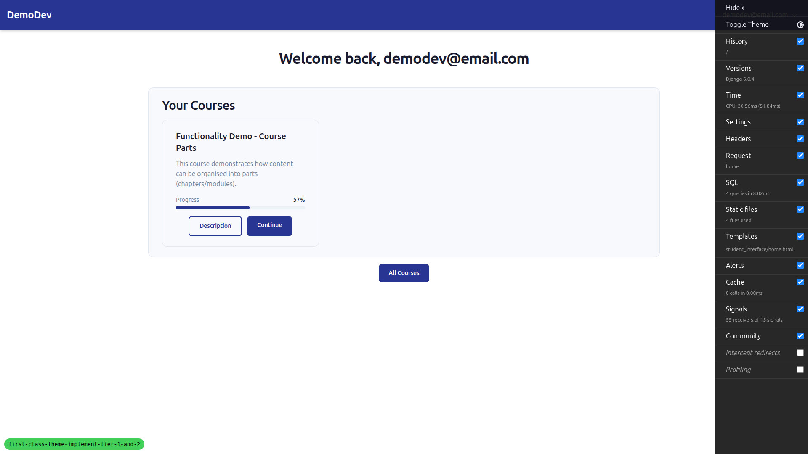

## Test 2 — `.btn` family

All call sites now render with the new variant tokens:

- Delete-confirm modal: Cancel = `.btn-secondary` (transparent bg, indigo
  text/border, 2px border-width per spec §3.2). Delete = `.btn-error`.
- Course list: secondary CTAs = `.btn-secondary`. Primary CTAs =
  `.btn-primary`.
- Pagination: prev/next/page-number buttons = `.btn-secondary`,
  current page = `.btn-primary`.
- No `btn-outline` token survives anywhere in rendered HTML (page-level
  `document.body.innerHTML` regex check).

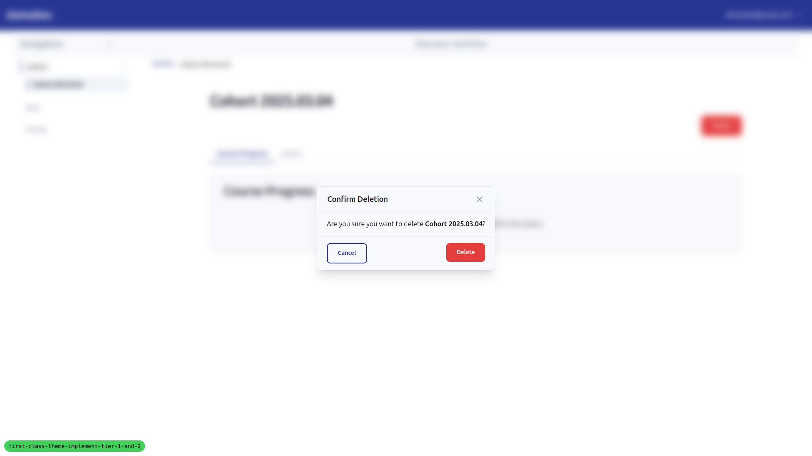
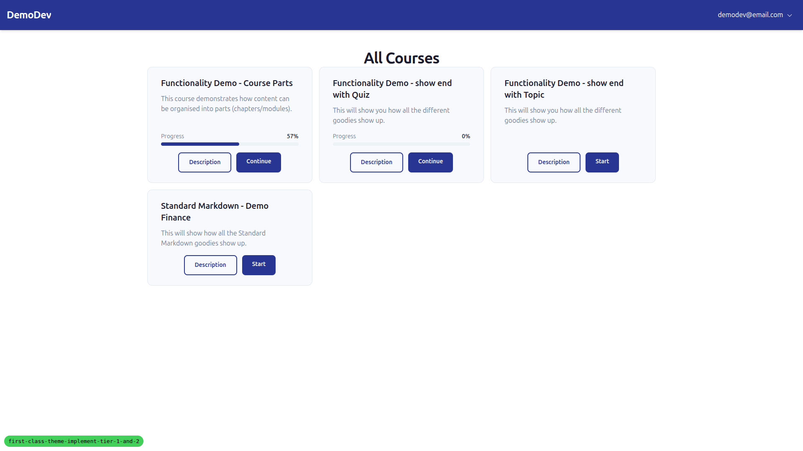
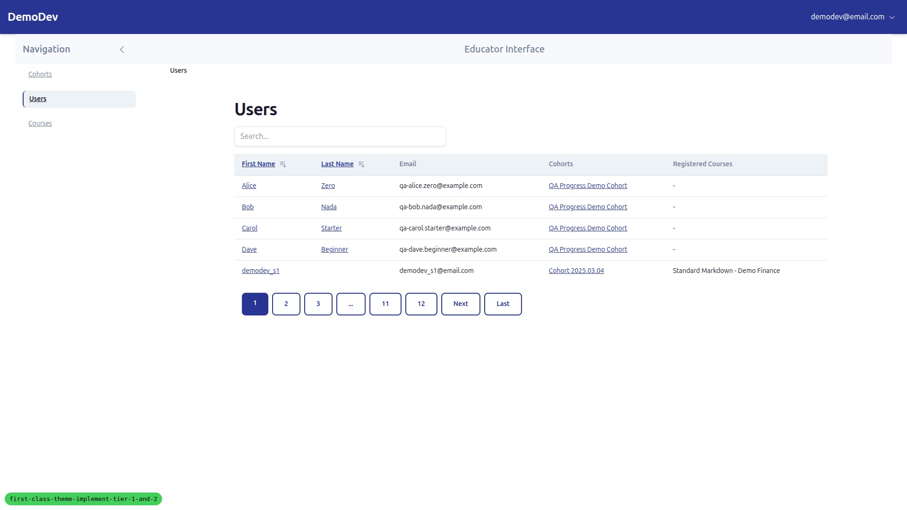

## Test 3 — Chip family

Real-data chips (course progress panel) render with first_class pastel
tints:

- `chip-warning` Soft → bg `rgb(255, 255, 240)`, text `rgb(116, 66, 16)`
- `chip-error` Fail/Hard → bg `rgb(255, 245, 245)`, text `rgb(116, 42, 42)`
- (`chip-success` Pass token verified via injection — bg `rgb(240, 255, 244)`,
  text `rgb(34, 84, 61)`)

All seven chip variants exist in the rebuilt `tailwind.output.css`
(`chip-primary`, `chip-warning`, `chip-success`, `chip-error`, `chip-info`,
`chip-secondary`, `chip-muted` — confirmed via injected element + computed
style). All chips full-pill (`border-radius: 9999px`), `font-size: 12px`,
`font-weight: 600`.

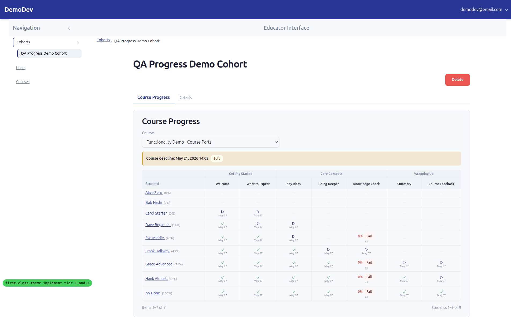

## Test 4 — `.surface` and card radii

Course cards on `/courses/`:

- `bg-surface` → `rgb(248, 249, 252)` (#F8F9FC) — visibly distinct from
  the page background.
- `border-radius: 12px` — matches `--fls-radius-lg` (`0.75rem`), the
  corrected spec value (not the old 16px or default-theme 8px).

## Test 5 — Mono font

Inline `<code>` element on a course topic page resolves to
`font-family: "IBM Plex Mono", ui-monospace, Menlo, Consolas, monospace`.
IBM Plex Mono is not loaded as a webfont, so the fallback stack takes
over visually — explicitly accepted by the test plan as "webfont loading
is a separate concern".

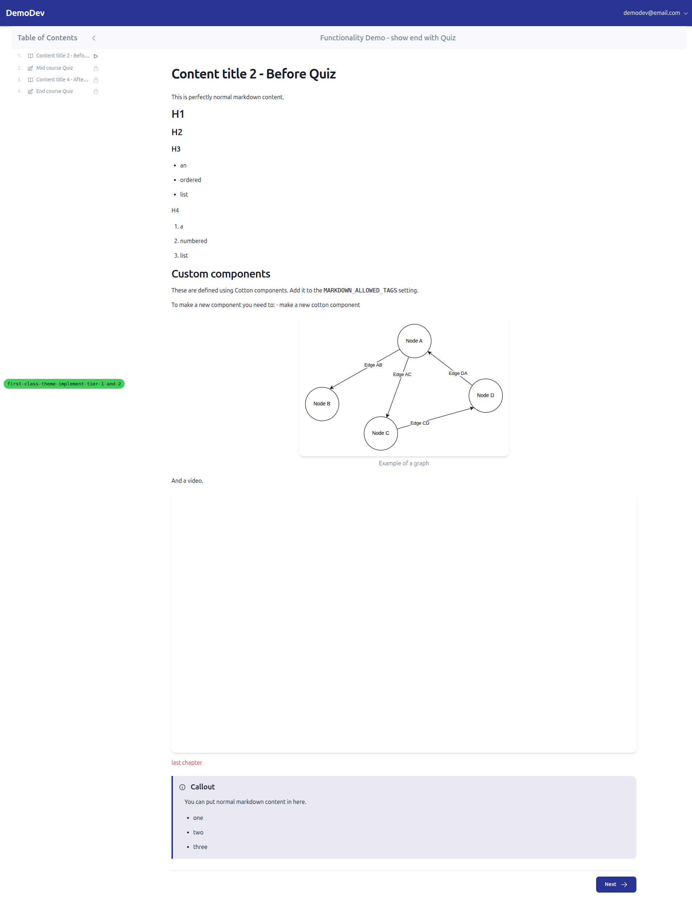

## Test 6 — Heading weights / tracking

At `lg:` breakpoint (1920px viewport), content headings on a topic page:

- H1 (`Content title 2 - Before Quiz`) → 36px, `font-weight: 700`,
  `letter-spacing: -0.9px` (tracking-tight).
- H2 → 30px, `font-weight: 600` (semibold), `letter-spacing: -0.75px`.
- H3 → 24px, `font-weight: 600`.
- H4 → 20px, `font-weight: 600`.

The `@layer base` override is winning the cascade against the default
theme's base layer.

## Test 7 — Default-theme regression sweep

Rebuilt CSS with `FLS_THEME=default`, restarted server, re-walked tests
2 and 3:

- Cancel button on delete-confirm modal renders as `.btn-secondary` with
  Ocean blue (`#2B6CB0`, `rgb(43, 108, 176)`) outline and 1px border —
  the spec's intentional semantic shift from the old neutral-grey cancel.
- Course-progress chips render with the default theme's `/15` opacity
  treatment (`oklab(... / 0.15)` for `chip-error`, `oklab(... / 0.3)`
  for `chip-warning`) — flatter than first_class but coherent with the
  existing `.chip-primary` style.
- Pagination renders with the same `.btn-secondary` migration.
- No console warnings about missing CSS variables or unknown Tailwind
  utilities (only unrelated CSP info messages about CDN script loads).

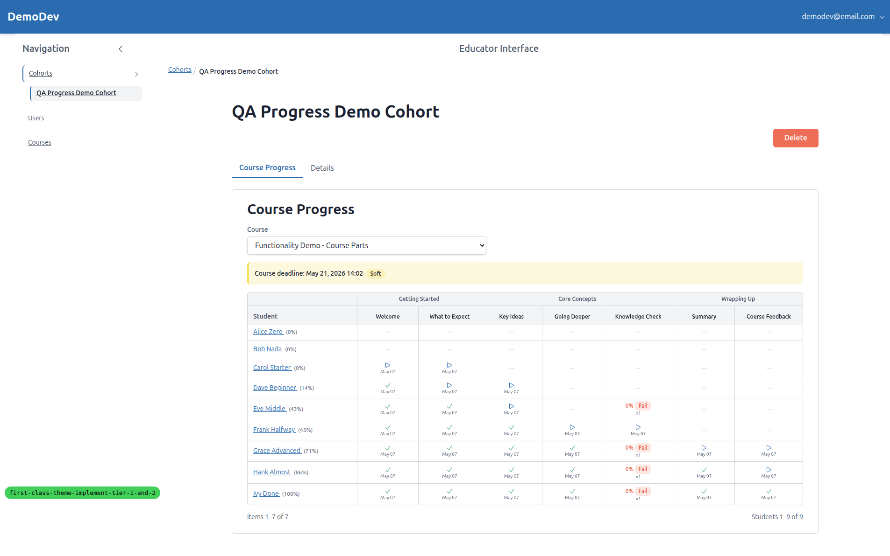
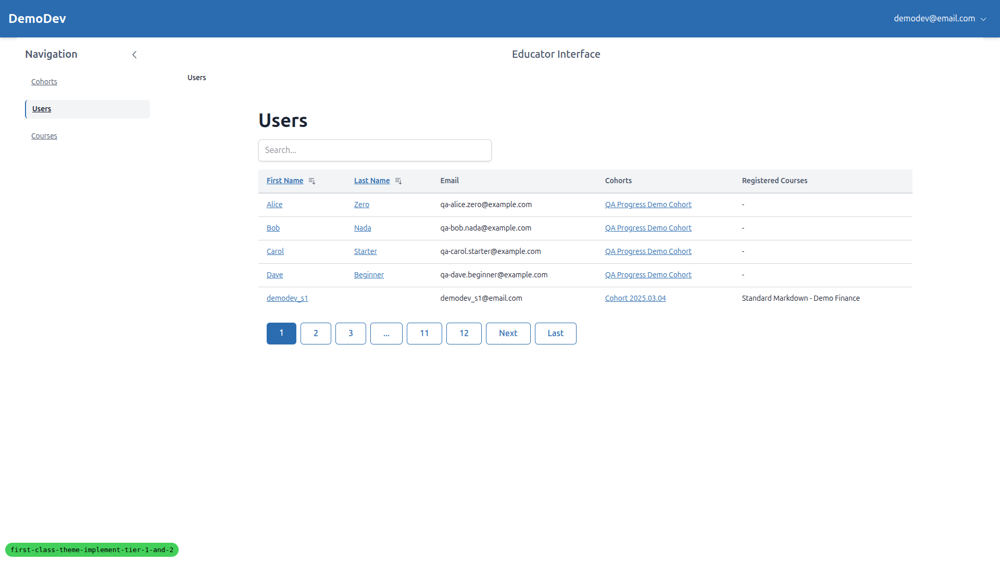

## Test 8 — Audit grep

`grep -rn '\bbtn-outline\b\|variant="outline"' freedom_ls/` matches only
inside `freedom_ls/icons/` (icon-style variant, intentionally untouched)
and `freedom_ls/base/tests/test_theme_tokens.py` (the test that asserts
the migration is complete). Expected.

## Mobile and tablet sweeps

Re-walked the navigation, layout, modal and pagination scenarios at
375x812 (mobile) and 768x1024 (tablet). No layout overflow, no
unreadable elements, modal centred, pagination buttons remain
touch-target-sized.

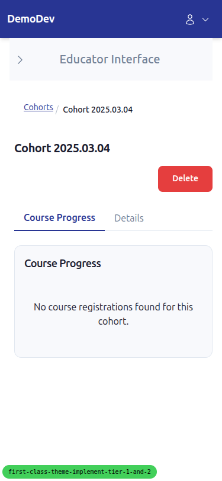
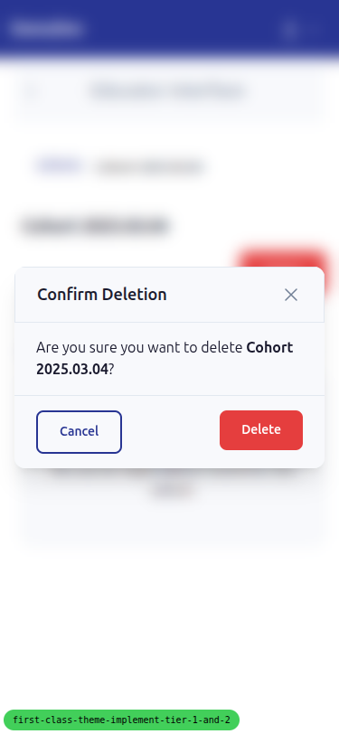
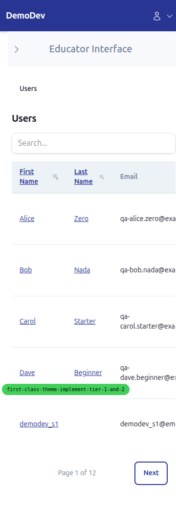
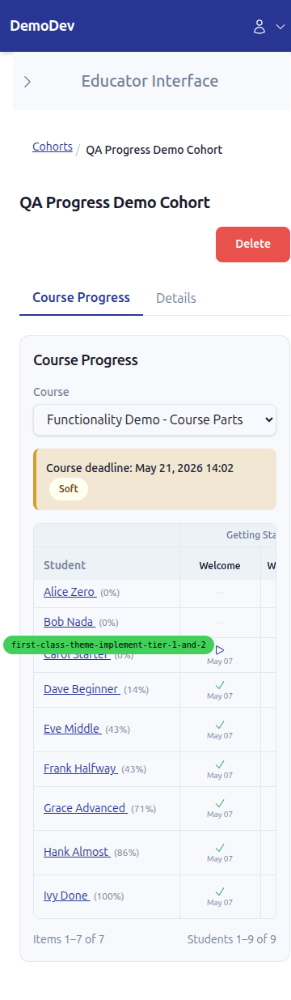
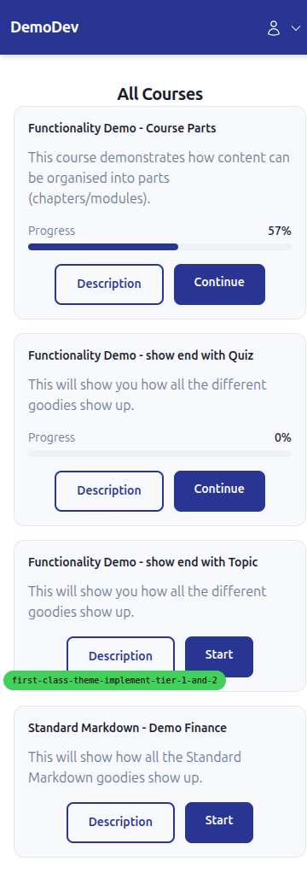
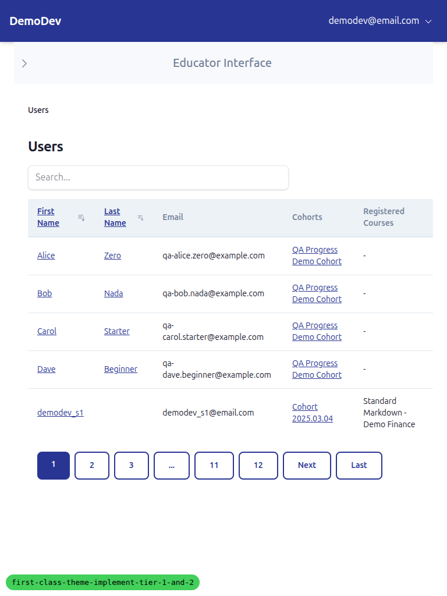
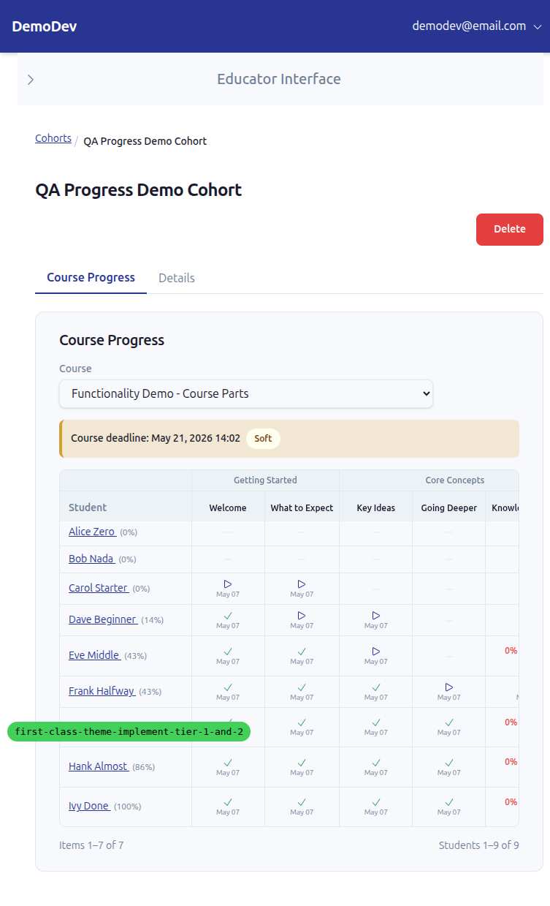
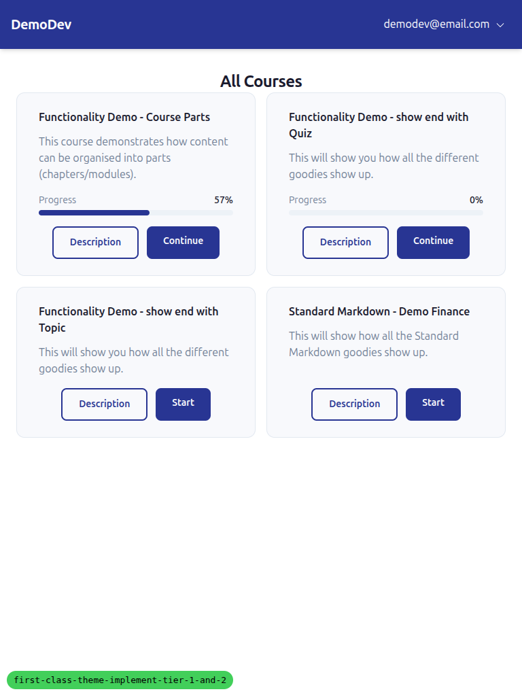

## Notes / unrelated observations

- The Django debug toolbar (`#djDebug`) overlays the bottom-right of the
  viewport and intercepts pointer events on small targets near the edge.
  This is expected dev-only behaviour, but I had to hide it via JS to
  click the cohort delete button. Not a regression.
- Demo content has only one inline `<code>` element on the chosen topic
  — broader webfont coverage was out of scope.
