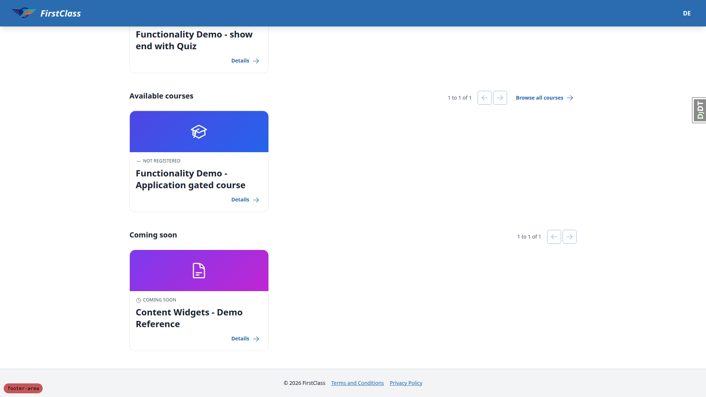
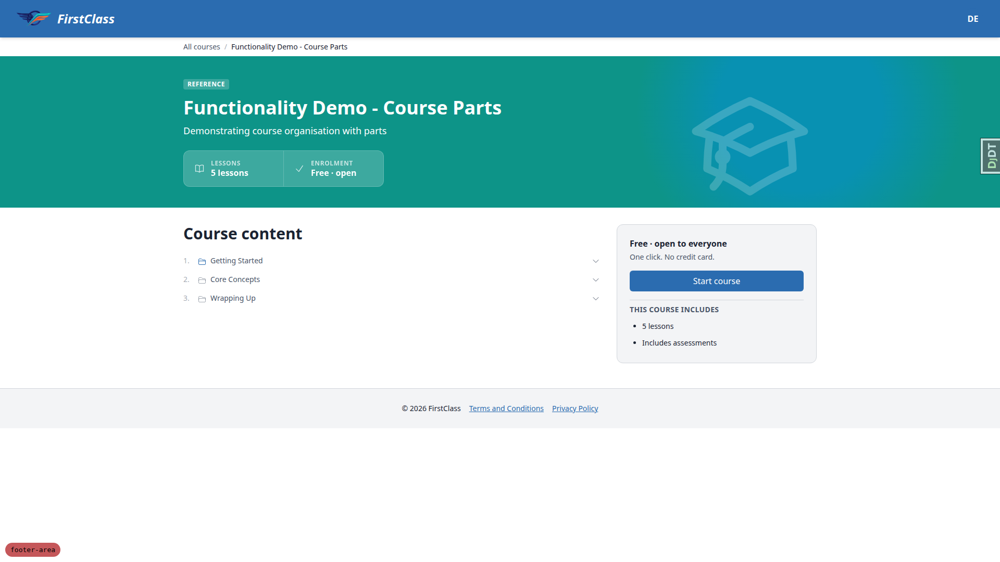
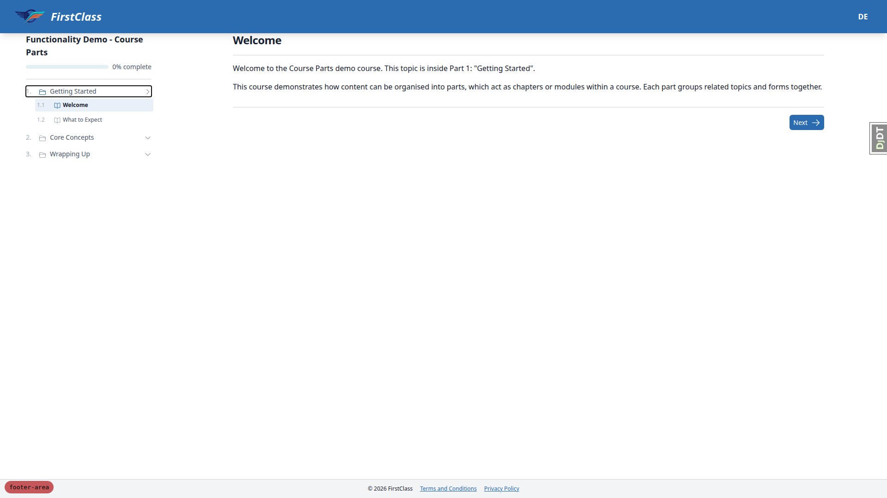
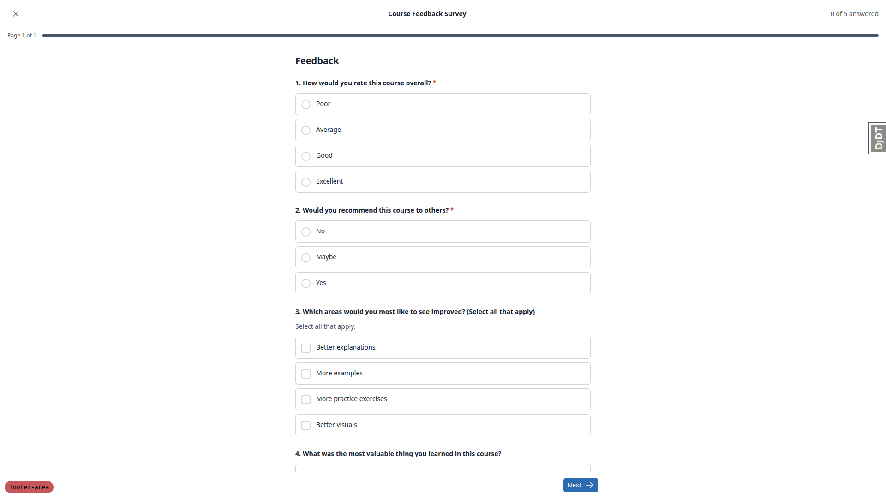
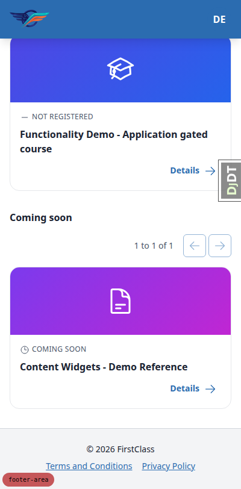
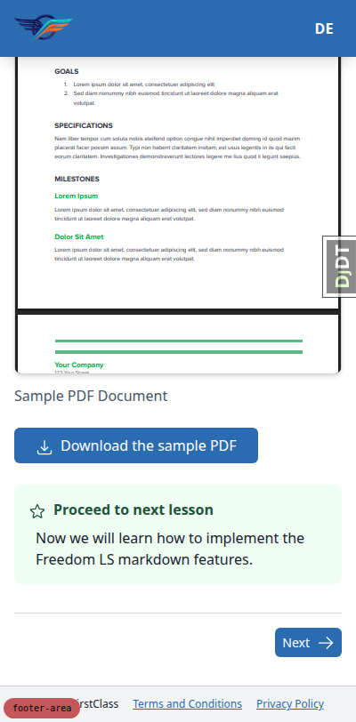
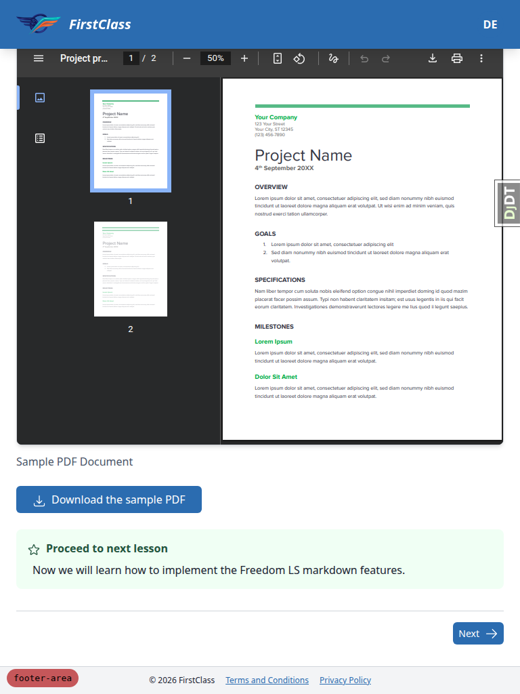
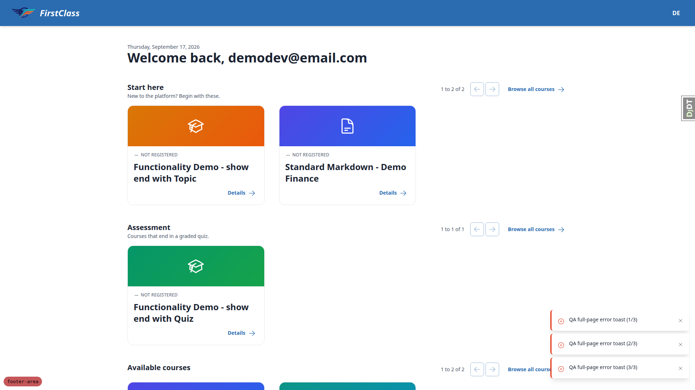
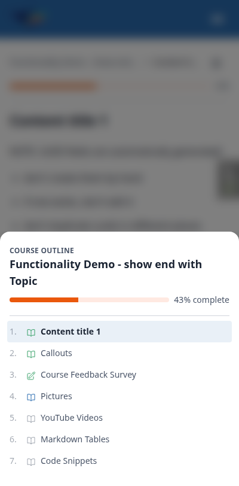
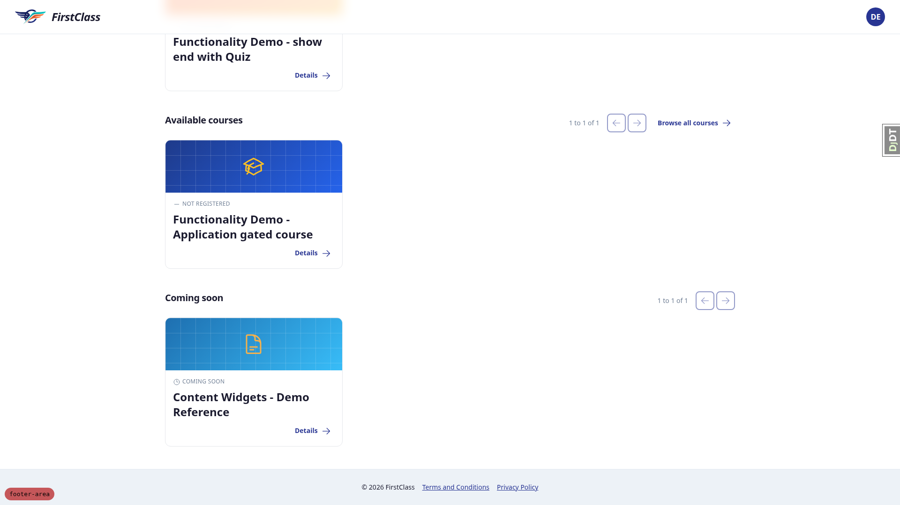

# Frontend QA report: footer area

Manual browser verification of the site footer feature (`_base.html`, `_base_interface.html`,
`partials/footer_bar.html`, the error-page templates, the exam runner shell, the panel-framework
test interface, and the default theme's footer tokens). The footer bar renders correctly as a
`contentinfo` landmark outside `<main>` on every full and compact shell, is absent from the exam/form
runner and every error page, survives Boosted navigation, both shipped themes, and a downstream
template override without touching `_base.html`. Two defects were found: a page shorter than the
viewport strands the footer above a band of bare background (§1), and the development-only branch
badge overlaps the compact footer's copyright line at 400px width (§9.2). Everything else in the test
plan passed.

## Methodology

Screenshots were collected into `spec_dd/2. in progress/footer-area/screenshots/`; every image
referenced below exists beside this report. The run drove a real browser via Playwright MCP at four
viewports: 1920x1080 (desktop), 768x1024 (tablet), and 400x812 and 375x812 (mobile). Two auxiliary
servers were used alongside the primary dev server: one on a throwaway `DEBUG=False` settings module,
needed because Django's technical 404 hides the project's own styled error pages while `DEBUG=True`;
and one run with `FLS_THEME=first_class` for §10. The run did not abort at the smoke gate, so every
step in the test plan ran.

## Diff scoping

Scoping class: **FULL**. The changed files driving that classification: `freedom_ls/base/templates/_base.html`,
`freedom_ls/base/templates/_base_interface.html`, `freedom_ls/base/templates/partials/footer_bar.html`,
the four styled error templates (`400.html`, `403.html`, `403_csrf.html`, `404.html`) plus `429.html`,
`freedom_ls/learner_interface/templates/learner_interface/_exam_runner_base.html`,
`freedom_ls/panel_framework/tests/templates/panel_framework/test_interface.html`,
`freedom_ls/themes/default/static/themes/default/theme.css`, the two new test modules
(`test_footer_bar.py`, `test_theme_tokens.py`), and the two doc/skill files under `claude_plugins/fls-dev/`.
Nothing was skipped: the scoping record's `skipped` field is `"nothing"`, so the full matrix below ran.

## Smoke gate

Passed. Pages loaded before the matrix began: `http://127.0.0.1:8915/` (dashboard) and
`http://127.0.0.1:8915/courses/functionality-demo-course-parts/1/` (course topic page). No failure
url or reason was recorded.

## Results by test-plan section

### §1 The full footer on a plain page

- **1.1 (desktop, pass).** Dashboard full footer: one full-width bar below the content, background
  `rgb(243,244,246)` against the white page, 1px `rgb(209,213,219)` top border, 24px/32px padding.
  Copyright reads "(c) 2026 FirstClass", matching the header site name. Links read "Terms and
  Conditions" then "Privacy Policy", underlined, `rgb(43,108,176)`. Contrast against the footer
  background: copy 14.34:1, links 4.92:1 — both pass WCAG AA.

  

- **1.3 (desktop, pass).** Clicked Terms from the dashboard footer, landed on
  `/accounts/legal/terms/`. Clicked Privacy from that page's own footer, landed on
  `/accounts/legal/privacy/`. Both legal documents carry the footer themselves.

- **1.4a (desktop, pass).** `/courses/`: 1 footer, not inside `main`, 0 `role=contentinfo` attrs,
  `data-compact=false`, both links present in order, no horizontal overflow.

- **1.4b (desktop, pass).** Course detail page: 1 footer, not inside `main`, `data-compact=false`,
  both links in order, footer spans the full 1920px width.

- **1.5 (desktop, fail).** Short-page check. On the course detail page at 1920x1080 the document is
  exactly viewport height but the footer ends at y=823, leaving 257px of bare page background below
  it. `body` is `display:block` with `min-height:0` — there is no sticky-footer layout, so any page
  shorter than the viewport strands the bar. Because the footer carries its own contrasting
  background and a hairline top border, the band beneath reads as a misplaced divider rather than the
  end of the page. See bug **B1** below.

  

### §2 Anonymous visitors

- **2.1 (desktop, pass).** Signed-out visitor: footer present on `/`, `/courses/` and
  `/accounts/login/`, in each case 1 footer, not inside `main`, both legal hrefs present.
  `/accounts/legal/privacy/` and `/accounts/legal/terms/` both render while signed out, so an
  anonymous visitor can reach the policies.

### §3 The compact footer on the sidebar shell

- **3.1 (desktop, pass).** Compact footer on the sidebar shell (course topic page):
  `data-compact=true`, padding 8px/32px versus the full footer's 24px/32px, 12px type versus 14px —
  noticeably tighter and smaller as specified. Same copyright line and same two links in the same
  order. Spans the full 1920px starting at x=0, i.e. under the sidebar column as intended. Document
  height is 1121px against a 1080px viewport, so reaching the footer takes 41px of scrolling.

  

- **3.3 (desktop, pass).** Both links clicked from the compact footer reach the same two legal
  documents as §1.

- **3.4 (desktop, pass).** Educator interface as admin
  (`/educator/organisations/demodev/cohorts`). Same compact bar: 1 footer, direct child of `body`,
  `data-compact=true`, 8px/32px padding, 12px type, same copyright and same two links, full 1920px
  width from x=0.

### §4 The exam and form runner has no footer

- **4.1 (desktop, pass).** Form runner (Course Feedback Survey, `fill_form`): 0 footers, 0
  `role=contentinfo`, 0 legal links, no copyright glyph anywhere in the body. The sticky action bar
  sits flush with `bottom=1080`, exactly equal to the viewport height — not pushed up, not clipped,
  nothing below it. Scrolling the inner `.overflow-y-auto` question pane to its end still yields 0
  footers.

  

- **4.3 (desktop, pass).** Submitted the form and landed on the completion page, which is not the
  runner. The compact footer is back: 1 footer, `data-compact=true`, outside `main`, both links
  present.

### §5 Error pages have no footer

- **5.1 (desktop, pass).** 404. `DEBUG=True` hides the styled template, so a second runserver was
  started on a throwaway `DEBUG=False` settings module in the scratchpad. The real "We cannot find
  that page" 404 renders with 0 footers, 0 legal links, no copyright glyph; the page ends with its
  own "Go to your dashboard" / "Browse courses" buttons.

- **5.2 (desktop, pass).** 403 and 403_csrf. "You do not have access to this page" reached through a
  scratch urlconf route raising `PermissionDenied`, and "The form was not sent" reached by posting
  the login form without a CSRF token. Both render 0 footers, 0 legal links, no copyright glyph,
  ending in their own buttons.

- **5.2b (desktop, partial).** The live 429 page could not be reached: `config/settings_dev.py` sets
  `ACCOUNT_RATE_LIMITS = False`, and force-enabling the base limits (10/m/ip, 5/5m/key) in the
  throwaway settings module still returned 200 for twelve consecutive failed logins against one
  throwaway address. Verified at template level instead: `429.html` extends `_base.html` and
  overrides `` with an empty block, exactly as 403/403_csrf/404/400 do, so it
  cannot render a footer. No account was locked out — only an `@example.invalid` address was used.

- **5.3 (desktop, pass).** `500.html` and `503.html` do not extend `_base.html` and are absent from
  the branch diff — untouched, as required.

### §6 The landmark check

- **6.1 (desktop, pass).** The highest-value check in the plan. Dashboard console lines return
  exactly the specified values: `querySelectorAll('footer').length` = 1,
  `main.contains(footer)` = false, `querySelectorAll('[role=contentinfo]').length` = 0. The footer is
  a direct child of `BODY`. Playwright's accessibility snapshot — the same tree a screen reader
  consumes — reports the element as `contentinfo`, not `generic`. Same three results on a course
  topic page, and 0 footers on the runner page.

### §7 Keyboard and focus

- **7.1 (desktop, pass).** Both footer links are the last two of 19 focusables on the dashboard, in
  reading order, with no tabindex overrides. The focus ring is the site-wide default
  (`outline:auto`, `rgb(16,16,16)`, 1px offset), giving 17.29:1 against the footer background —
  clearly visible, not washed out. The header's links use the identical ring, so the footer is
  consistent with the rest of the site. Pressing Enter on the focused Terms link navigated to
  `/accounts/legal/terms/`.

- **7.2 (desktop, pass).** Landmark naming. No screen reader was available in this environment, so
  this was verified against the accessibility tree instead. On a course detail page the landmarks are
  banner, main (containing navigation "Breadcrumb" and navigation "Course outline") and contentinfo
  containing navigation "Legal" — the Legal nav is distinctly named and distinct from both the header
  navigation and the breadcrumb.

### §8 Responsive

- **8.1 (mobile, pass).** Full footer at 400px and 375px (dashboard, all courses, legal document).
  The copyright line and the two links wrap onto separate lines rather than being cut off or
  squashed. No horizontal scrollbar anywhere — document `scrollWidth` equals the viewport width
  exactly on every page checked. Footer spans the full viewport width.

  

- **8.2 (mobile, pass).** Course topic page at 400px. The sidebar is a modal sheet rather than a
  column, and the compact footer sits directly under the content, full 400px width, no horizontal
  scroll. At this width the compact footer keeps the copyright and both links on one line, but it
  fits without overflow or clipping.

  

- **8.3 (mobile, pass).** Touch target measurements are reported in General notes below (touch
  targets are an observation, not a pass/fail criterion here).

**Additional tablet checks (768x1024), beyond the plan's explicit 400px call-out:**

- **T.1 (tablet, pass).** Full footer at 768x1024 (dashboard). One footer, full 768px width, no
  horizontal scroll. At this width the copyright and both links sit comfortably on one line rather
  than wrapping — there is room for it. The debug badge is clear of both the copyright line and both
  links at this width.

- **T.2 (tablet, pass).** Course topic page at 768x1024. The tablet gets the mobile-style sheet
  navigation rather than the desktop sticky column (the "Open course outline" trigger is present),
  which is the shell's existing breakpoint behaviour and unchanged by this work. The compact footer
  therefore sits directly under the content, full 768px width from x=0, no horizontal scroll, both
  links present.

  

### §9 Side effects to look for

- **9.1 (desktop, pass).** Boosted navigation. Swapped between three items in the course player
  sidebar (Callouts -> Pictures -> Callouts -> Course Feedback Survey); `#interface-main` is swapped
  rather than the page reloading. After each swap exactly 1 footer, still a direct child of `BODY`,
  still `data-compact=true`, copyright intact. Never two stacked, never zero.

- **9.2 (mobile, fail).** Debug badge vs footer at 400px. On the course topic page's compact footer
  the badge (x 4-90, y 785-808) overlaps the copyright line (x 36-133, y 784-800) by 54x15 px — most
  of "(c) 2026 F" is hidden behind it, and `elementFromPoint` at the copyright's start returns the
  badge's span. On the dashboard's full footer the badge also clips a 14x3 px sliver of the Terms and
  Conditions link's bottom-left corner and captures clicks there, though the link's text and centre
  stay clickable. At 1920x1080 the badge sits clear of the centred footer content. The badge renders
  only under ``, so this is development-only and never ships, but it is the
  specific collision §9.2 asks about and the answer is that it does cover the copyright line. See bug
  **B2** below.

  

- **9.3 (desktop, pass).** Sticky header. At scrollY 0, 600, 1191 and back to 0 the header stays
  `position:sticky` pinned at `top=0`. The scrolled shadow still toggles: `data-scrolled` is absent at
  the top and `"true"` once scrolled, and the computed box-shadow deepens from `0 4px 6px -1px` to
  `0 10px 15px -3px`. The footer changed nothing about it.

- **9.4 (desktop, pass).** Toasts. `/qa/toasts/playground/` and the full-page toast routes both work
  as admin. The toast region is `position:fixed` anchored bottom-right of the viewport, so it is
  independent of the footer's document position; three stacked error toasts render where they always
  did, with no overlap (region bottom 1064 vs footer top 1876).

  

- **9.5 (mobile, pass).** Mobile sidebar sheet at 400px. The sheet slides up over a dimmed backdrop;
  the footer sits at document y=3029 against an 812px viewport, so it is nowhere near the backdrop
  and cannot show through. Closing the sheet with Escape leaves exactly one footer, still compact,
  copyright and both links intact, no horizontal scroll.

  

- **9.6 (desktop, pass).** Component footer slots. `cotton/modal.html` and `cotton/media-card.html`
  both use "footer" as a cotton slot variable, not a `<footer>` element, and neither file is in the
  branch diff — a different namespace from `_base.html`'s ``, so no collision is
  possible. Confirmed live on the Pictures topic page: exactly one `<footer>` element on the page,
  while the media-card caption bars are transparent-background figcaptions with their own 1px top
  border, sharing none of the page footer's grey surface.

- **9.7 (desktop, pass).** Long legal document. On the terms page the footer top (1003) exactly
  meets `main`'s bottom (1003) with no overlap of the last paragraph, and the footer follows the
  document content normally.

### §10 The other theme

- **10.1 (desktop, pass).** The `first_class` theme. Rebuilt with `FLS_THEME=first_class` and
  restarted. The footer picks up the theme's own surface: background `rgb(237,242,247)` against the
  default theme's `rgb(243,244,246)`, border `rgb(226,232,240)`, links in the theme's indigo
  `rgb(40,53,147)`. The contrast concern the plan raised does not materialise: the copyright renders
  in `rgb(26,26,46)`, byte-for-byte the same colour as the page's body text, not a muted grey —
  15.14:1 against the footer background. Links 9.23:1. Nothing washed out.

  

- **10.2 (desktop, pass).** Compact footer on a course topic page under `first_class`:
  `data-compact=true`, 8px/32px padding, 12px type, theme background `rgb(237,242,247)`, copyright
  15.14:1 and links 9.23:1, one footer, outside `main`. The default-theme bundle was rebuilt
  afterwards so the working tree's compiled CSS was not left on the wrong theme.

### §11 A downstream override

- **11.1 (desktop, pass).** Downstream override — the point of the feature. Created
  `freedom_ls/themes/default/templates/partials/footer_bar.html` containing
  `<footer>
OVERRIDE WORKS
</footer>` and restarted (the directory is new, so only a restart
  puts it on `TEMPLATES["DIRS"]` via `configure_theme`). Both shells then render the override instead
  of FLS's footer: the plain dashboard and the sidebar course-topic page each show exactly one footer
  reading OVERRIDE WORKS, still outside `main`. `_base.html` and `_base_interface.html` are untouched
  in git — one partial replaced, the page shell not forked. The scratch `templates/` tree was deleted
  and the server restarted afterwards; `git status` confirmed nothing left behind.

## Bug: On a page shorter than the viewport the footer is stranded above a band of bare background

**Manifestations:** 1.5 (desktop)

**Expected:** Test plan §1 states the footer is deliberately in normal document flow and not pinned,
and asks whether that reads as deliberate or broken on a short page.

**Actual:** On the course detail page at 1920x1080 the footer ends at y=823 with 257px of bare page
background below it. `body` is `display:block` with `min-height:0`, so there is no sticky-footer
layout to push it down. Because the footer carries its own contrasting grey surface and a hairline
top border, the empty band beneath reads as a misplaced divider mid-screen rather than the end of the
page. Not a functional failure, but the plan explicitly asks for it to be reported if it reads as
broken — it does.

## Bug: The development branch badge sits on top of the footer and covers the copyright line at narrow widths

**Manifestations:** 9.2 (mobile)

**Expected:** Test plan §9.2: the badge must not cover the copyright line or either link, and must
not steal a click meant for a link.

**Actual:** At 400px on a course topic page the badge (x 4-90, y 785-808) overlaps the compact
footer's copyright line (x 36-133, y 784-800) by 54x15 px, hiding most of "(c) 2026 F";
`elementFromPoint` at the copyright's start returns the badge. On the dashboard's full footer the
badge also clips a 14x3 px sliver of the Terms and Conditions link's bottom-left corner and captures
clicks there, though the link's text and centre remain clickable. Clear at 768px and 1920px. The
badge renders only under ``, so this is development-only and never reaches
production.

## Bug status

Both bugs were triaged to the red lane: each turns on a product or UX decision, so neither was
auto-fixed and no commit was made or reverted for them.

- **UNRESOLVED** — On a page shorter than the viewport the footer is stranded above a band of bare background (reason: the fix is a layout decision — pin the footer with a sticky-footer shell, or accept the gap as designed)
- **UNRESOLVED** — The development branch badge sits on top of the footer and covers the copyright line at narrow widths (reason: development-only collision; the fix is a decision about where the badge should sit now the footer occupies that corner)

## General notes

- Touch targets: footer links are 143x28 / 88x28 CSS px (full) and 123x24 / 76x24 (compact). These
  clear WCAG 2.2 SC 2.5.8 Target Size (Minimum, 24x24) but not SC 2.5.5 (AAA, 44x44). Observation
  only.
- The live 429 page could not be reached because `config/settings_dev.py` sets
  `ACCOUNT_RATE_LIMITS = False`, and force-enabling the base limits still did not trip it; 429.html
  was verified at template level instead (it overrides `` with an empty block,
  exactly as 403/403_csrf/404/400 do). No account was locked out — only an `@example.invalid` address
  was used.
- The test plan's own closing note about Tailwind `@source` globs: a downstream template tree outside
  `freedom_ls/` is not covered by the globs, so Tailwind classes in a downstream override compile to
  nothing until that project adds a glob. The §11 override used no Tailwind classes, so the run did
  not hit this, but it stands as a real pitfall for downstream projects.
- No screen reader was available in the environment, so §7.2's landmark announcement was verified
  against the accessibility tree (which is the same data a screen reader consumes) rather than by
  listening to one.

status: ok
reason: 2 bugs — 0 fixed, 2 unresolved (both red-lane, each turning on a UX decision); report rendered, screenshots verified
