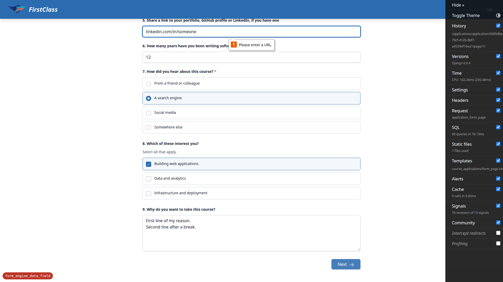

# Frontend QA report: typed question types for `form_engine`

This run manually exercised the six new question types (`date`, `time`, `email`, `url`, `phone`,
`dropdown`), the `min`/`max` bounds on `date`, `time` and `number`, the new server-side
"does this answer even parse" check, the per-question error slot, and the formatted read-back of
dates and times, across both form runners (the application shell and the course player's own
runner) and the admin. Of 62 executed test-plan checks, 61 passed and 1 failed. The one failure is
a genuine defect (documented below as bug B1): a schemeless URL, which the test plan states must be
accepted, is blocked by the browser's native `input[type=url]` validation before the form's own
(correct) server-side handling ever runs.

## Methodology

Testing was driven manually through the Playwright MCP tool against a dev server on port 8997, on
branch `form_engine_data_field`. Screenshots were collected into `screenshots/` beside this report;
every image referenced below exists in that directory. Demo content was reloaded via
`content_save demo_content DemoDev` at the start of the run, and again at the end, to restore two
questions whose `type` and one whose `required` flag were deliberately changed through the admin
during the run in order to reach otherwise-unreachable test-plan cases.

## Diff scoping

The scoping gate fired class **FULL**. It fired on this class because the changed-file set spans
templates, static JS and Python across the full request/response path, not a narrow slice of it:
`freedom_ls/form_engine/templates/form_engine/question.html`,
`freedom_ls/form_engine/templates/form_engine/inputs/dropdown.html`,
`freedom_ls/form_engine/templates/form_engine/inputs/number.html`,
`freedom_ls/form_engine/templates/form_engine/inputs/short_text.html`,
`freedom_ls/form_engine/templates/form_engine/inputs/text_input.html`,
`freedom_ls/course_applications/templates/course_applications/form_page.html`,
`freedom_ls/course_applications/templates/course_applications/check_your_answers.html`,
`freedom_ls/learner_interface/templates/learner_interface/course_form_page.html`, and
`freedom_ls/learner_interface/static/learner_interface/js/alpine-components.js`, alongside model,
schema, view, admin and enum changes (`freedom_ls/form_engine/models.py`, `schema.py`, `enums.py`,
`admin.py`, `typed_answers.py`, `paging.py`, `templatetags/form_engine_tags.py`,
`freedom_ls/course_applications/views.py`, and two new migrations). Because both shared templates
(`question.html`, the input partials) and the JS driving the runner's client-side furniture changed,
nothing was skipped: the full test plan (§1–§10) ran, and desktop, mobile and tablet passes all ran.

## Smoke gate

The smoke gate **passed**. Pages loaded to confirm the environment was live and serving the branch
under test: the dashboard (logged in) and the application form page 1
(`/applications/application/<uuid>/page/1/`), the primary changed page.

## Coverage summary

| Section | Name | Pass | Fail |
|---|---|---|---|
| §1 | The new types render | 7 | 0 |
| §2 | The happy path stores and advances | 3 | 1 |
| §3 | A rejected answer: the core behaviour | 8 | 0 |
| §4 | The rejected value is not stored | 3 | 0 |
| §5 | The other types' failure branches | 9 | 0 |
| §6 | A required question with a rejected answer must not let the form through | 3 | 0 |
| §7 | Stored answers read properly on the way out | 5 | 0 |
| §8 | The admin side | 7 | 0 |
| §9 | The course player's own runner | 8 | 0 |
| §10 | Adversarial and edge cases | 8 | 0 |

**Total: 62 test records, 1 failure.**

## Bug B1: Schemeless URL answer is blocked client-side, so the server's documented acceptance is unreachable

**Manifestations:** `2.2` (desktop)

**Screenshots:**

**Expected:** Per test plan §2.2, typing `linkedin.com/in/someone` with no scheme into the URL
question and clicking Next must be **accepted**: the server prepends `https://` via
`_with_scheme()` before validating, the way Django's own `URLField` does. The plan states a
rejection here is a bug, not a stricter rule.

**Actual:** The submission never reaches the server. The application form page carries no
`novalidate`, so the browser's native `input[type=url]` constraint fires first:
`form.checkValidity()` returns `false` and the url field reports `validationMessage`
`"Please enter a URL."`. Clicking Next produces zero requests to `/applications/` — confirmed via
the network log — the page just sits there with a browser validation bubble. The server-side logic
itself is correct and was proven so: after changing the input's `type` attribute to `text`, the
identical value POSTs, is accepted, and advances to page 2. So `_with_scheme()` works, but no
ordinary user can reach it — anyone entering a URL the way people actually write them is stopped by
a generic browser message that names no question and offers no guidance.

## Bug status

- **FIXED** — Schemeless URL answer is blocked client-side, so the server's documented acceptance is unreachable

B1 was triaged to the red lane during the run because the choice between fixes was a product call,
not a mechanical one. That decision was since taken: `url` questions render through
`text_input.html` as `type="text"` with `inputmode="url"`, the second of the three options weighed
below. The keyboard hint stays, the native check is traded for the server's — which already accepted
schemeless input and gives a message naming the question — and the stored value is unaffected.

The options weighed, for the record:

1. Add `novalidate` to the page form — rejected. It disables **all** client-side validation for every
   question type on the page (required, email, number bounds), trading a real UX regression for this
   one case, and touches both runners plus `form_engine`.
2. **Chosen.** Render `url` questions as `type="text"` with `inputmode="url"` — one line in
   `question.html`'s dispatch ladder.
3. Prepend `https://` client-side on blur — rejected. It keeps `type="url"` but rewrites what the
   person typed, so the stored value would gain a scheme and contradict §7.3, which asserts the URL
   reads back exactly as entered.

Re-verified in the browser after the fix: the application form's URL input is `type="text"` with
`inputmode="url"` and the page carries zero native url inputs; `linkedin.com/in/someone` now
produces a real `POST → 302` where the bug produced **zero requests**; the stored value reads back
as `linkedin.com/in/someone` with no scheme added; and `not a url` still earns a 422 with
`You entered "not a url". Enter a valid web address.` and the text handed back. The same markup was
confirmed in the course player's runner, which shares `question.html`.

## What the run proves

- A rejected answer is never stored, and never wipes a previously stored good answer. §4.2 showed a
  fresh rejection leaves no `value` attribute at all (`hasAttribute('value') === false`); §4.3 showed
  that resubmitting `banana` over an already-stored `1987-03-14` leaves that stored date untouched,
  with no `aria-invalid` and no error slot on return; §5.storage confirmed that after nine separate
  crafted rejections across every new type, only the original good values remained on reload.
- The required-question check catches a required question whose only answer was rejected, so the
  application cannot be submitted. §6.4 — "the core safety net" — showed that with the required date
  of birth holding only a rejected value, clicking "Submit application" returned 422 and the callout
  read `"Questions 2 and 10 need answers before you can continue."`, because no row was ever stored
  for the rejected answer.
- The `2025-02-30` / `25:00` `parse_date`/`parse_time` `ValueError` trap — the plan's single most
  likely bug — is handled and returns 422, not 500. §5.4 confirmed `2025-02-30` returns 422 with
  `"You entered \"2025-02-30\". Enter a date in the format YYYY-MM-DD."`, and the same trap is clear
  for time via `parse_time`; §5.6 confirmed `25:00` returns 422 with
  `"You entered \"25:00\". Enter a time in the format HH:MM."`.
- `aria-invalid` / `aria-describedby` ids resolve correctly. §3.6 resolved the date input's
  `aria-describedby` value via `getElementById` and confirmed it is exactly the error paragraph's id,
  with no typo; §5.8 confirmed each input in a multi-error submission carries its own error text and
  its own matching `aria-describedby`.
- The admin changelist did not regress on query count. §8.performance measured the real admin
  changelist through the Django test client with `CaptureQueriesContext`: 12 answer rows render in
  43 total queries with only 2 SELECTs against `form_engine_formquestion`, not one per row — the
  added `list_select_related = ('form_progress', 'question')` covers the new `answer_preview` read
  as intended.

## General notes

- The Django Debug Toolbar overlays and intercepts clicks on primary buttons at mobile width in this
  dev environment. This is a dev-only artifact of `DEBUG=True`, not a product defect, but it made
  several interactions need the toolbar hidden first.
- §10.3 (submit-and-exit carrying a rejected value) could not be reached with the demo content as
  authored, because the demo survey is save-on-exit and the `Form` admin does not expose
  `submit_on_exit`. The flag was flipped in the dev database for the run.
  `demo_content/functionality_demo_end_with_topic/4. survey/form.md` does not declare
  `submit_on_exit`, so re-running `content_save` reverts it — which the run did.
- The demo survey ships no *required* checkbox group, so §9.4's client-side "Select at least one
  option." message needed one made required through the admin to be exercised at all.
- The `fls-dev:qa-data-helper` agent writes reference notes into
  `.claude/agent-memory/fls-dev-qa-data-helper/` in the repo; two new files and a modified
  `MEMORY.md` are currently untracked/modified there. Flagging only because the project `CLAUDE.md`
  says "Do not use memory" — these were not created or removed by the QA run itself, and the
  directory long predates it.

status: ok · reason: 1 bug — 1 fixed, 0 unresolved (B1 fixed test-first after the product decision was taken, then re-verified in both runners); 62 checks run across desktop, mobile and tablet; report rendered, screenshots verified present
