# Frontend QA report: typed question types for `form_engine`

## Methodology

Feature under test: six new typed question types for `form_engine` (`date`, `time`, `email`, `url`,
`phone`, `dropdown`), `min`/`max` bounds on `date`, `time` and `number`, the first server-side check
on what an answer *contains* (as opposed to whether one exists at all), a per-question error slot, and
formatted dates and times on the read surfaces (check-your-answers, the admin answer preview, the
runner's own re-render).

Testing was done by hand through the Playwright MCP against a dev server running on port 8890, with
the branch badge (`#debug-branch-badge`) confirming the `form_engine_data_field` branch before any
test began. Demo content was reloaded with `content_save demo_content DemoDev` to guarantee the new
questions and their `min`/`max` bounds were present rather than stale. Screenshots were collected into
`screenshots/` beside this report; every image this report links to is present in that directory. The
run also produced Playwright accessibility-snapshot `.yml` files and console `.log` files alongside
the PNGs in the shared Playwright output directory, but only the 20 PNGs were collected into
`screenshots/`, since this report references no other file type.

The run did **not** abort at the smoke gate, so every one of the 45 planned test steps ran to
completion.

## Diff scoping

Class: **FULL**, triggered by changed templates and static assets:
`freedom_ls/form_engine/templates/form_engine/question.html`,
`freedom_ls/form_engine/templates/form_engine/inputs/text_input.html`,
`freedom_ls/form_engine/templates/form_engine/inputs/dropdown.html`,
`freedom_ls/form_engine/templates/form_engine/inputs/number.html`,
`freedom_ls/form_engine/templates/form_engine/inputs/short_text.html`,
`freedom_ls/form_engine/templates/form_engine/partials/answer_errors.html`,
`freedom_ls/form_engine/templates/form_engine/partials/page_children.html`,
`freedom_ls/course_applications/templates/course_applications/check_your_answers.html`,
`freedom_ls/course_applications/templates/course_applications/form_page.html`,
`freedom_ls/learner_interface/templates/learner_interface/course_form_page.html`,
`freedom_ls/learner_interface/static/learner_interface/js/alpine-components.js`, plus the supporting
Python (`typed_answers.py`, `models.py`, `schema.py`, `admin.py`,
`course_applications/views.py`, `learner_interface/views.py`).

The scoping record's `skipped` field reads **"nothing"**. Nothing was skipped: the desktop pass, the
mobile pass (375x812) and the tablet pass (768x1024) all ran, across both form runners (the
application shell and the course player's own runner) that share `question.html`.

## Smoke gate

Status: **pass**. Pages loaded, both as the logged-in applicant:

- `http://127.0.0.1:8890/` — site home page
- `http://127.0.0.1:8890/applications/application/<uuid>/page/1/` — application form page 1

No failure URL or failure reason was recorded. Because the gate passed, the run proceeded through all
ten test-plan sections rather than stopping short.

## Results by test-plan section

### §1 The new types render

**1.2–1.6 (desktop, pass).** Application page 1 renders 9 questions. The new inputs carry the exact
DOM shapes the plan specifies: `email` is `input[type=email]`; `url` is `input[type=text]` with
`inputmode=url` (deliberately **not** `type=url`); `phone` is `input[type=tel]` with `inputmode=tel`;
`date` is `input[type=date]` with `min=1900-01-01 max=2010-01-01`. The number question carries
`type=number inputmode=numeric min=0 max=70 step=1`. Pre-existing types are unchanged: `short_text`
still renders `text`, multiple choice still renders radio-styled options, the checkbox group and the
textarea are untouched. Question numbers 1–9 are all present, with the required asterisk and
sr-only "(required)" text on exactly the 5 required questions. No `ERROR! UNHANDLED FORM TYPE`
callout appeared.

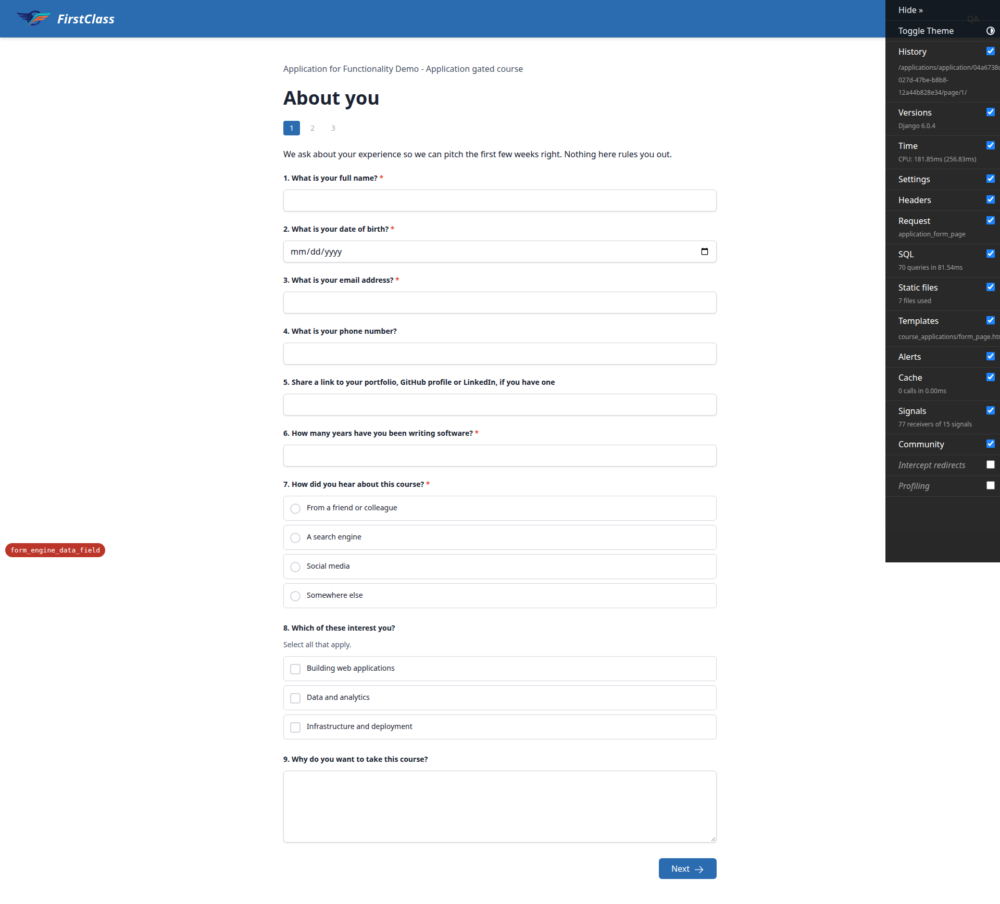

**1.4 (desktop, pass).** The date question is confirmed to be the native control, not a text box in
disguise: `element.type === 'date'` and `showPicker()` is available, so Chromium renders its native
calendar grid.

**1.7 (desktop, pass).** The availability page (page 3) renders `input[type=time]` with
`min=09:00 max=17:00`, and a `<select>` listing the 14 authored time zones with a blank entry first
(15 options total). No `UNHANDLED FORM TYPE` callout.

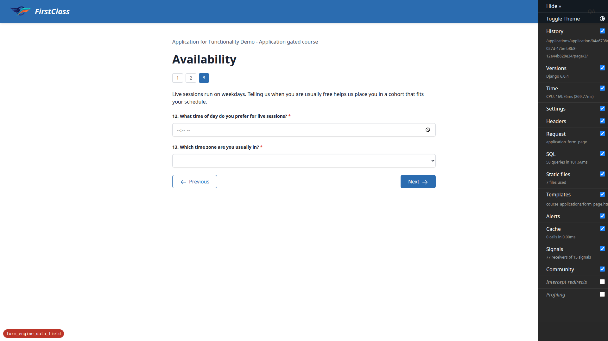

### §2 The happy path stores and advances

**2.1–2.3 (desktop, pass).** Page 1 was filled validly, including a schemeless URL —
`linkedin.com/in/someone`. No validation bubble appeared, and the server log showed
`POST /applications/.../page/1/ -> 302` followed by `GET page/2/ 200`. The schemeless address was
accepted and the page advanced with no error callout — the server prepended the scheme before
validating rather than the native `url` input rejecting it client-side.

**2.4 (desktop, pass).** Returning to page 1 repopulates every answer. The date input's `value`
attribute holds the raw ISO string `1987-03-14`, not a formatted date, so the browser parses it
correctly and the field is not blank.

### §3 A rejected answer: the core behaviour

**3.1–3.8 (desktop, pass).** The date input was retyped to `type=text` and set to `banana`, then
submitted. The response was **HTTP 422** and the page re-rendered rather than advancing. The top
callout read `Invalid answers / Question 2 needs a valid answer.` The per-question error under the
date input read `You entered "banana". Enter a date in the format YYYY-MM-DD.` The input carried
`aria-invalid=true` and `aria-describedby=question_<uuid>_error`, and that id resolved to the error
paragraph (`getElementById` found it — the two ids actually match). The date input itself rendered
empty on screen because the browser discards the unparseable value, exactly as the plan documents.
Every other answer on the page (name, email, phone, url, number, radio, checkbox, textarea) came back
populated.

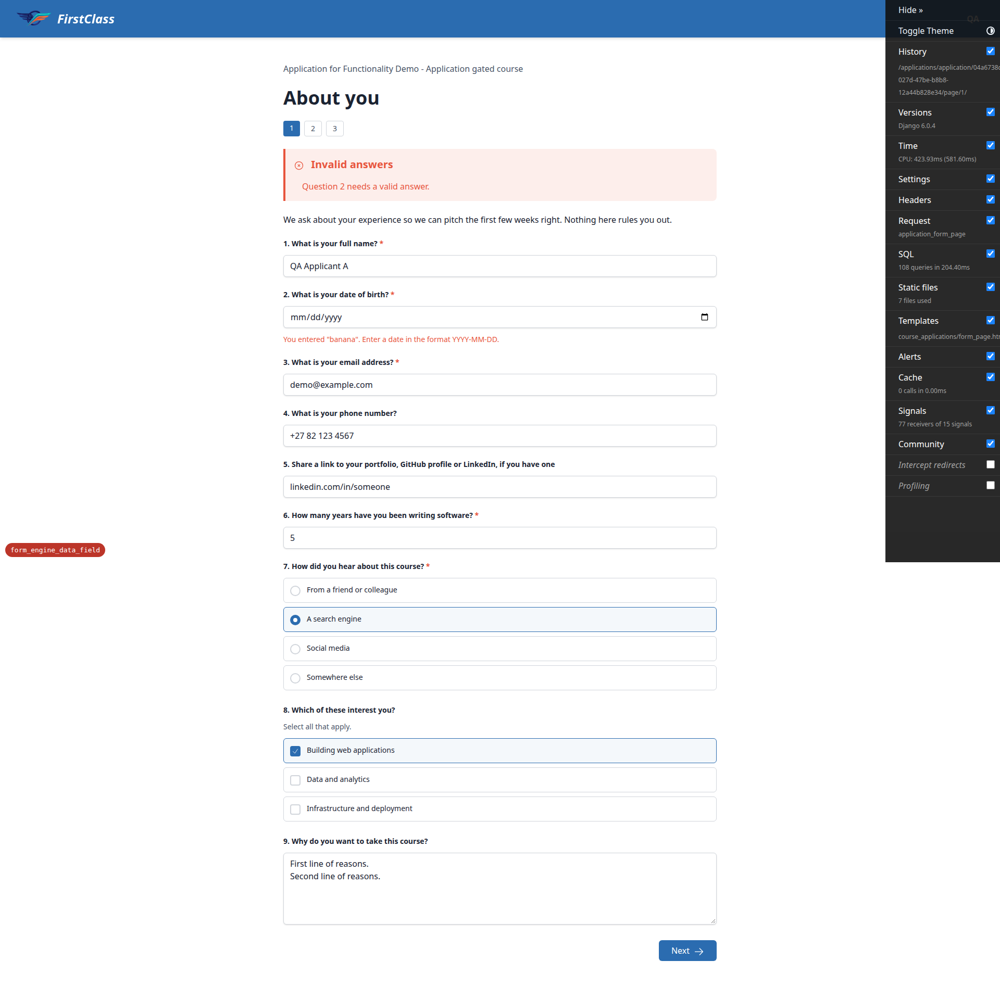

**3.9 (desktop, pass).** Submitting `notanemail` in the email question returned 422 with
`Question 3 needs a valid answer.` and the per-question error
`You entered "notanemail". Enter a valid email address.` The email input handed back the literal text
`notanemail` in its `value` attribute, so it can be corrected in place. The valid date on the same
submission came back populated and was not flagged.

**3.10 (desktop, pass).** With the date and email corrected, "Next" advanced to page 2 with no error.

### §4 The rejected value is not stored

**4.1–4.2 (desktop, pass).** With no stored date row, submitting `banana` returned 422; navigating to
page 2 and back left the date input with no `value` attribute at all, and `banana` was nowhere in the
page. No answer row was created.

**4.3 (desktop, pass).** With `1987-03-14` already stored, submitting `banana` returned 422;
navigating away and back showed the date input still carrying `value=1987-03-14`. The rejected value
neither overwrote nor deleted the good row.

**4.4-applicantB (tablet, pass).** Applicant B's check-your-answers page was checked at 768px to
confirm none of the values rejected during the run were stored: no `banana`, no 65-character unbroken
string, no `not a url at all with spaces`. Date of birth and phone both read "Not answered". No
horizontal overflow at 768px.

### §5 The other types' failure branches

**5.1 — email (desktop, pass).** `notanemail` was rejected with `Enter a valid email address.`; then
`someone@localhost` was **accepted and stored** (Django allows `localhost` specifically); then
`someone@internal` was rejected with the same message, with `someone@internal` handed back in the
input.

**5.2 — url (desktop, pass).** Typing `not a url` (with the space) straight into the box (`type=text`,
nothing intercepts client-side) returned 422 with the exact error
`You entered "not a url". Enter a valid web address.` and the input handed back `not a url` verbatim
with `aria-invalid=true`.

**5.3 — date out of bounds (desktop, pass).** `2190-01-01` (past the question's max of `2010-01-01`)
was rejected server-side with 422 and the bound-naming error
`You entered "2190-01-01". Enter a date on or before 2010-01-01.` The server re-enforces the bound
even though `min`/`max` in the markup can be edited away.

**5.4 — impossible but well-formed date (desktop, pass).** The specific `parse_date` trap:
`2025-02-30` is well-formed but impossible. The response was 422 with
`You entered "2025-02-30". Enter a date in the format YYYY-MM-DD.` No 500 and no traceback — the
`ValueError` branch is handled.

**5.5 — number out of bounds (desktop, pass).** `400` against `max=70` returned 422 with
`You entered "400". Enter a number on or before 70.`, and the value was handed back.

**5.6 — time (desktop, pass).** `25:00` on page 3 returned 422 with
`You entered "25:00". Enter a time in the format HH:MM.` No 500 — the `parse_time` `ValueError`
branch is handled, the same as the date trap. The time input renders blank because the browser
discards the value, and the `value` attribute carries the rejected text for the error message to
recite.

**5.7 — phone (desktop, pass).** `not a number at all` was accepted and the page advanced, as
intended — `type=tel` is a keyboard hint only, and real phone validation is out of scope.

**5.8 — several at once (desktop, pass).** Rejecting the date and the email in one submission
produced a single callout sentence: `Questions 2 and 3 need valid answers.` Both inputs carried
`aria-invalid=true` and distinct `aria-describedby` ids, each resolving to its own error paragraph.

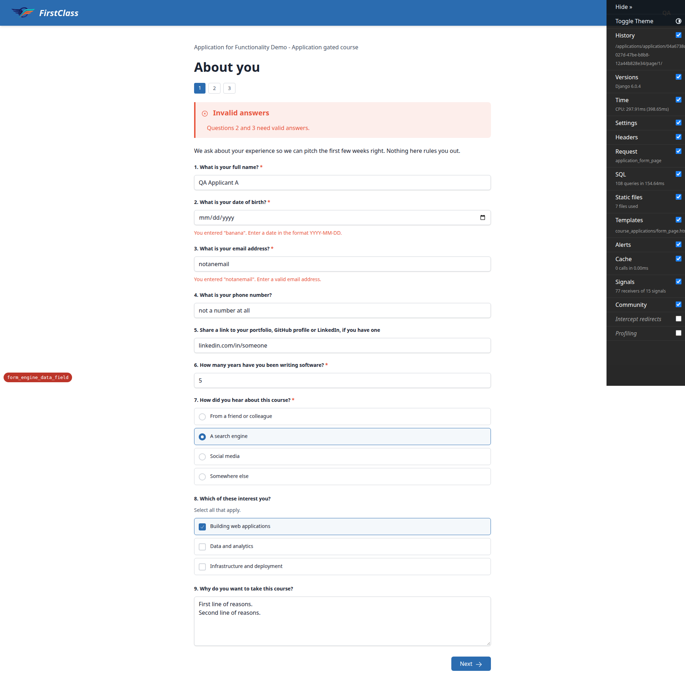

### §6 A required question with a rejected answer must not let the form through

**6.1–6.5 (desktop, pass).** The central safety property holds. With the required date question
holding only a rejected value (`banana`, never stored), the check-your-answers page showed
"Not answered" for date of birth, and `banana` appeared nowhere. Clicking "Submit application"
returned **HTTP 422** with `Question 2 needs an answer before you can continue.` — the whole-form
required check catches it because no row was stored. After answering the date validly, "Submit
application" succeeded: redirect to the dashboard with the message
"Your application ... has been submitted and is pending review."

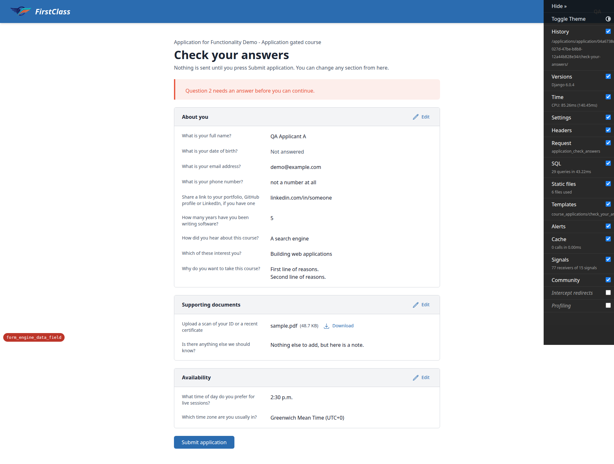

### §7 Stored answers read properly on the way out

**7.1–7.5 (desktop, pass).** Check-your-answers renders every type correctly. Date reads
`March 14, 1987` (formatted, not ISO). Time reads `2:30 p.m.` (formatted, not `14:30`). Email reads
`demo@example.com`; URL reads `linkedin.com/in/someone` (shown as entered, not rewritten with a
scheme); the phone reads exactly as typed. The dropdown shows the option text
`Greenwich Mean Time (UTC+0)`, not its uuid. Pre-existing displays are unchanged: short text, long
text with both line breaks preserved, number `5`, multiple-choice option text `A search engine`,
checkbox option text `Building web applications`, and the file row `sample.pdf (48.7 KB)` with its
Download button.

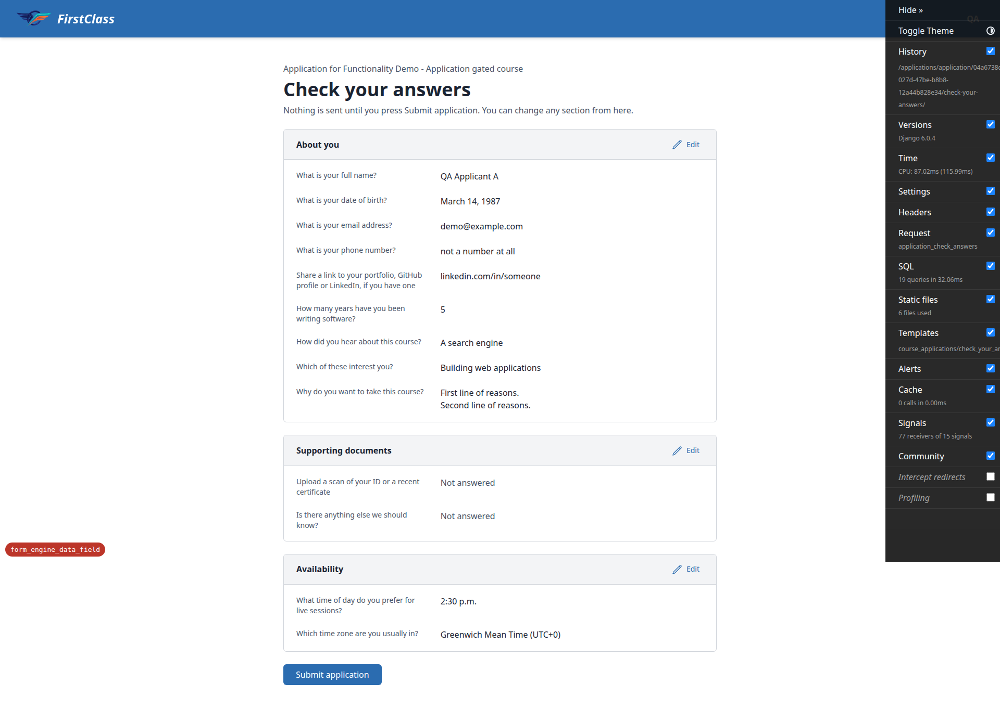

### §8 The admin side

**8.1 (desktop, pass).** The Question answers changelist shows the date-of-birth answer as
`March 14, 1987` and the time answer as `2:30 p.m.` in the Answer column — formatted, not raw ISO.

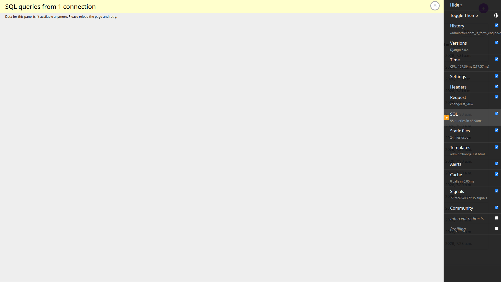

**8.2 (desktop, pass).** The time answer's change form holds the raw `14:30` in the `text_answer`
widget, so an untouched save writes back the same stored value.

**8.3 (desktop, pass).** Searching the changelist for the raw ISO string `1987-03-14` returns the
date-of-birth row; searching `14:30` returns the time row. Search runs against what is stored, not
what is displayed.

**8.4 (desktop, pass).** Form progress change form inline answers all hold raw strings in their edit
widgets: `14:30`, `1987-03-14`, `demo@example.com`, `linkedin.com/in/someone`.

**8.5 (desktop, pass).** Form question admin's type dropdown lists all twelve types
(`multiple_choice`, `checkboxes`, `short_text`, `long_text`, `number`, `file_upload`, `date`, `time`,
`email`, `url`, `phone`, `dropdown`). `min` and `max` are present, editable and populated
(`1900-01-01` / `2010-01-01`), alongside `decimal_places`, under an "Answer format" fieldset.

**8-performance (desktop, pass).** Measured server-side with `CaptureQueriesContext` over the real
changelist request: 55 queries for 17 rows, of which **zero** hit
`freedom_ls_form_engine_formquestion`. `list_select_related` fully covers the new
`obj.question.type` read in `answer_preview`, so the answer preview costs no extra queries. See
General notes for the full breakdown of the remaining pre-existing per-row queries.

### §9 The course player's own runner

**9.1–9.2 (desktop, pass).** The Survey start screen reads "Start Form" (8 questions, 1 page). The
five original questions render as before: two multiple choice, the required checkbox group, short
text and long text. The three new optional typed questions follow: date with `min=2020-01-01` and
`max=2030-12-31`, email, and a URL rendered as `input[type=text]` with `inputmode=url` — the shared
`question.html` holds here too. The runner form carries no `novalidate`. No `UNHANDLED FORM TYPE`.

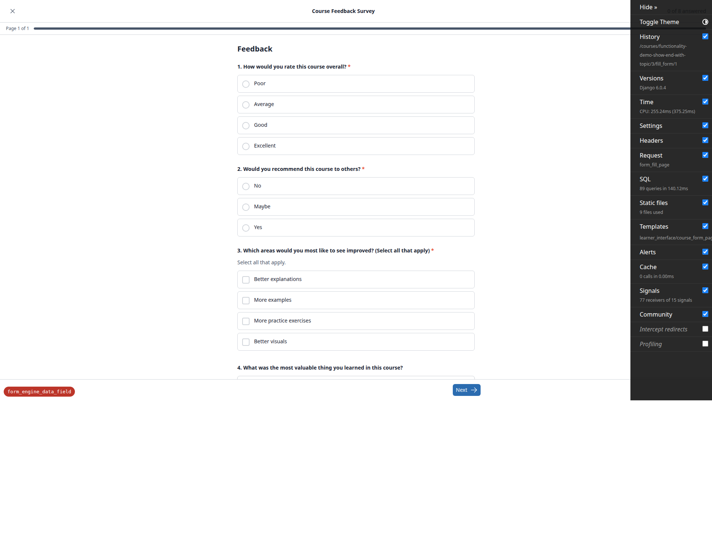

**9.3 (desktop, pass).** Submitting with a required multiple-choice question blank returned
**HTTP 422** with the existing callout `Missing answers / Question 1 needs an answer before you can
continue.` — unchanged. No rejected-answers callout and no per-question errors on the optional typed
questions.

**9.4 (desktop, pass).** Submitting with the required checkbox group empty revealed the runner's own
client-side message `Select at least one option.` under that group (the Alpine component un-hides it)
and blocked the submission — no request left the browser. The new per-question error slot has not
displaced it. The three optional typed questions below neither blocked the submission nor rendered
errors of their own.

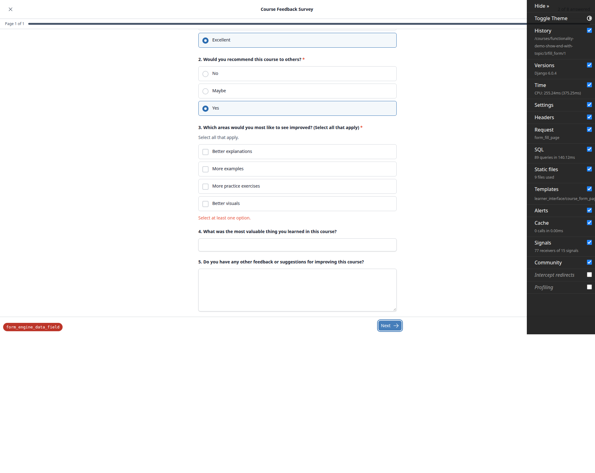

**9-tally (desktop, pass).** The runner's live answered-count tally behaves as before and counts the
new questions in its denominator: "0 of 8 answered" on load, "2 of 8" after the two radios, "3 of 8"
after the checkbox group. Page dots, the submit-confirmation dialog, and the save-and-exit /
"Leave and submit" buttons all render and work; "Leave and submit" carries `formnovalidate`.

**9.5-attempt1 (desktop, pass).** First sitting completed with Satisfaction="Excellent",
Recommendation="Yes", checkbox="More examples", and all three new typed questions left blank. Results
page reads Satisfaction 7 / 7 and Recommendation 5 / 5.

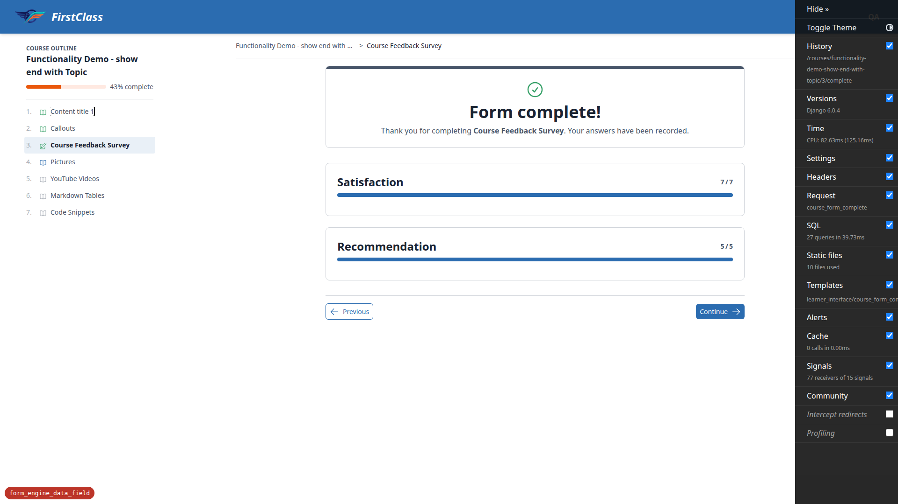

**9.5 (desktop, pass).** Scoring is unchanged by the new question types, proved rather than eyeballed.
Attempt 1 (typed questions blank) → Satisfaction 7/7, Recommendation 5/5. Sitting cleared. Attempt 2:
the same three multiple-choice answers, plus `date=2026-01-15`, `email=feedback@example.com`,
`url=github.com/someone/project` → identical totals, Satisfaction 7/7, Recommendation 5/5.
`CATEGORY_VALUE_SUM` reads option values from `multiple_choice` and `dropdown` only, so the three new
questions do not move a total. The live tally confirmed the typed answers registered ("3 of 8" → "6 of
8" before submitting).

**mobile-runner (mobile 375x812, pass).** Zero horizontal overflow. The new date and email inputs and
the short text render full-width 343px at 42px tall; the textarea 343x138. Radio and checkbox inputs
are visually hidden but their clickable labels are 48px tall, a comfortable touch target. The exit
dialog opens and its buttons are reachable at this width. The results page also renders with no
overflow at 375px.

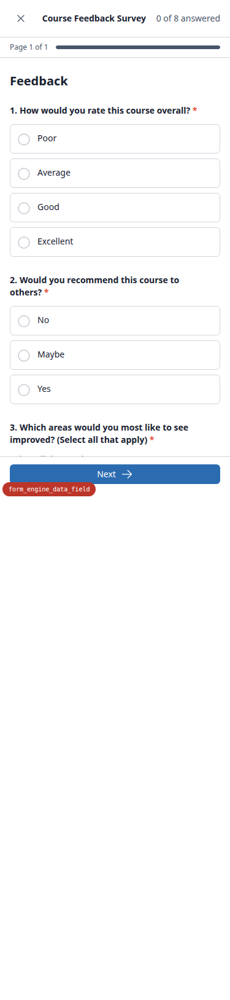

**tablet-runner (tablet 768x1024, pass).** Zero horizontal overflow. The new date and email inputs
render full-width 640px at 42px tall alongside the existing short text and textarea, in a single
readable column. The course-outline panel collapses rather than crowding the form, and the live
answered-count tally renders correctly.

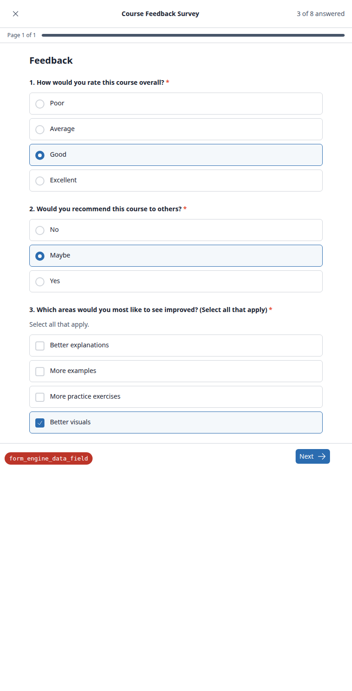

### §10 Adversarial and edge cases

**10.1 (desktop, pass).** The optional phone question submitted blank produced no error, no
`aria-invalid` and no stored row — a blank answer is not an invalid one.

**10.2 (desktop, pass).** Submitting three spaces for the required email question yielded the
required-answers callout `Question 3 needs an answer before you can continue.` — **not** an
invalid-email rejection. No rejected-answers callout and no `aria-invalid`, so the answer was trimmed
to blank before the type check ran.

**10.3 (mobile 375x812, pass).** Submit-and-exit carrying a rejected value, on the Course Feedback
Survey (the only demo form shipping `submit_on_exit: true`). Answered both required multiple-choice
questions and the required checkbox group, typed `notanemail` into the optional email question,
opened the exit dialog and used "Leave and submit" (which carries `formnovalidate`, so the browser
does not intercept). Result: **HTTP 422**, no 500 and no traceback. The reworked
`form_submit_and_exit` put the learner back on the page they were standing on with the callout
`Invalid answers / Question 7 needs a valid answer.`, the per-question error
`You entered "notanemail". Enter a valid email address.`, and the text handed back in the input.
Verified in the database: zero `QuestionAnswer` rows contain `notanemail` anywhere in the table, the
other three answers (both multiple choice and the checkbox group) **are** saved, and the attempt was
correctly left incomplete (`completed_time=None`, `scores=None`) rather than frozen without the
answer.

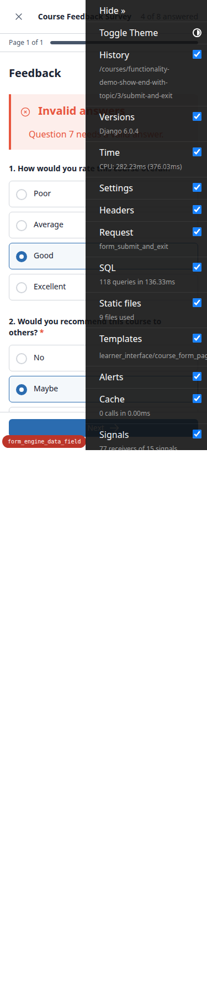

**10.4 (desktop, pass).** Applicant B started their own application and submitted `banana` for the
same date question (422). Applicant A's submitted application is unaffected: date of birth still
reads `March 14, 1987`, email still `demo@example.com`, and neither `banana` nor B's name appears.
Sittings are isolated. (See also 4.4-applicantB above for the tablet-viewport confirmation of the
same isolation property.)

**10.5 (desktop, pass).** Reopening the submitted application's form pages: all 14 controls on page 1
and both controls on page 3 (the new time input and the dropdown) are disabled. No error slots and no
`aria-invalid` attributes render on a read-only form.

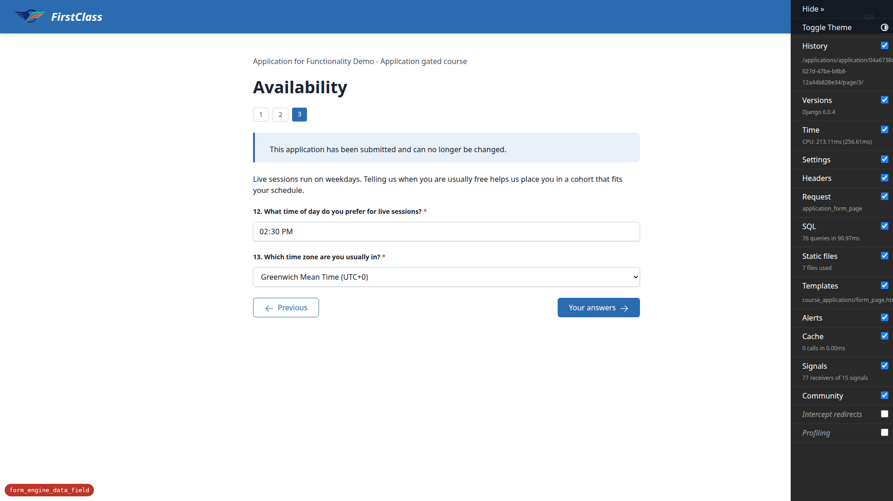

**10.6 (mobile 375x812, pass).** Zero horizontal overflow (`documentElement.scrollWidth` equals
`clientWidth`). Two per-question errors were forced at once, including a 65-character unbroken
rejected value: both error paragraphs wrap (3 lines and 2 lines) and stay inside the 343px content
column, right edge 359px, rather than pushing the page sideways. Every typed input renders full-width
343px at 42px tall, a comfortable touch target.

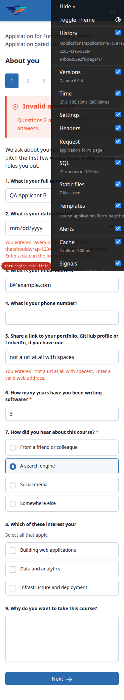

**10.6-page3 (mobile 375x812, pass).** Availability page at 375px: no overflow. The time input and
the 15-option dropdown both render full-width 343px at 42px tall, and the dropdown opens and selects
an option (`India (UTC+5:30)`) successfully at this width.

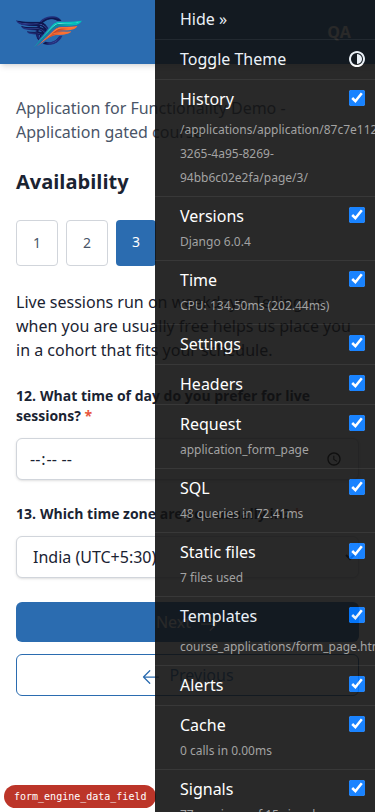

**tablet-application (tablet 768x1024, pass).** At 768x1024 the application form page 1 has zero
horizontal overflow. The per-question error for a rejected `2025-02-30` sits inside the 720px content
column (right edge 744). All typed inputs render full-width 720px at 42px tall. Page-dot navigation
links render and the single-column question layout adapts sensibly — no crowding, no stranded
sidebar.

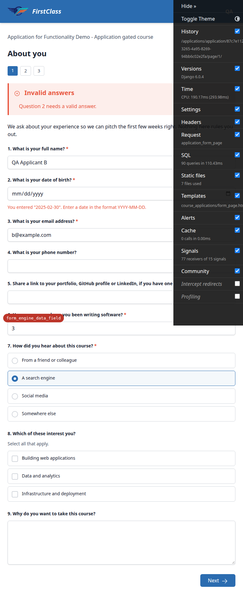

**tablet-page3 (tablet 768x1024, pass).** Availability page at 768px: no overflow; the time input and
the dropdown both render full-width 720px at 42px tall.

**10.7 (desktop, pass).** Changed the `short_text` question "What is your full name?" (holding
"QA Applicant A") to type `date` through the admin. The check-your-answers page rendered
"QA Applicant A" unchanged — the unparseable stored value falls back to the raw string, with no crash
and no blank. The admin changelist's Answer column showed the same fallback. Question type restored
to `short_text` afterwards.

## Bug status

No bugs were found. All 45 test records in this run are `pass`; there are zero failure records, so
nothing here is UNRESOLVED and nothing needs fixing.

## General notes

These are observations, not bugs, and have no action attached:

1. The `QuestionAnswer` admin changelist issues per-row queries, but they are all **pre-existing on
   main** and untouched by this branch: 18 `freedom_ls_accounts_user` and
   18 `freedom_ls_form_engine_form` queries come from `FormProgress.__str__`, and 9 `questionoption`
   queries from `selected_options.exists()/.all()` in `answer_preview`. Measured server-side with
   `CaptureQueriesContext`: 55 queries for 17 rows, of which **zero** hit
   `freedom_ls_form_engine_formquestion`. The `list_select_related = ("form_progress", "question")`
   this branch added fully covers the new `obj.question.type` read, so the branch makes the page
   **cheaper** than main, not dearer. The test plan's performance fail-condition does not trigger.
2. Console shows Content-Security-Policy report-only violations for four jsdelivr CDN scripts (htmx,
   `@alpinejs/collapse`, `@alpinejs/csp`, chart.js). Report-only, pre-existing, unrelated to this
   change. Recorded only so a later reader does not mistake them for new.
3. The only console "error" seen on a rejected submission is the browser logging the 422 response
   status itself, plus a browser warning that the rejected value "does not conform to the required
   format, yyyy-MM-dd" — which is exactly the browser explaining why it blanks the date input, the
   behaviour the test plan documents and the per-question error message exists to compensate for.
4. QA-tooling friction, not a product issue: the Django debug toolbar overlays the bottom-right
   controls and intercepts clicks at narrow viewports, so its `djdt=hide` cookie had to be set during
   the run. It also had to be re-set after each re-login.
5. The run left ordinary disposable dev-data residue (a submitted application for applicant A, an
   in-progress one for applicant B, an incomplete third survey sitting). This is normal and needs no
   action; the next run's §0 seed rebuilds it.

---

status: ok
reason: report rendered, 45 tests documented, 0 bugs found
