# Frontend QA report: google-analytics-setup

## 1. Methodology

The plan (`3. frontend_qa.md`) was driven manually through Playwright MCP against a dev server on
port 8803, started with `GOOGLE_ANALYTICS_MEASUREMENT_ID=G-QATEST0000 POSTHOG_API_KEY=phc_qatest`.
For §1.1 the server was restarted on the same port with the GA variable removed
(`POSTHOG_API_KEY=phc_qatest` only), per the plan's step, then restarted again with both variables
for the rest of the run. Every check read `window.dataLayer`, the rendered page source, and network
requests (for the `gtag/js` loader and PostHog's `config.js`).

The dev database was unseeded at the start of the run: the first page load returned a 500,
`FORCE_SITE_NAME='DemoDev' does not match any Site`. The database was seeded through the
`fls-dev:qa-data-helper` agent (demo content, superuser, Learner A, Learner B, and the two
application-gated courses) before any test steps ran.

Screenshots referenced below live in `screenshots/` beside this report; every image named in the
Results table exists there. That folder also holds Playwright `.yml` accessibility snapshots and
`console-*.log` browser console captures taken alongside each screenshot — those are not embedded
here but back the notes in this report and in §7.4 particularly.

## 2. Diff scoping

Scoping class: **FULL**. The changed files include templates
(`freedom_ls/base/templates/_base.html`, `freedom_ls/base/templates/_base_interface.html`,
`freedom_ls/base/templates/partials/google_analytics_events.html`), so the full plan ran at all
three viewports — desktop, mobile (375x812) and tablet (768x1024) — and nothing was skipped.

Other changed files driving this scope: `freedom_ls/base/google_analytics.py`,
`freedom_ls/deployment/context_processors.py`, `freedom_ls/deployment/config.py`,
`freedom_ls/accounts/allauth_account_adapter.py`, `freedom_ls/course_applications/views.py`,
`freedom_ls/learner_interface/views.py`, `config/settings_base.py`, `legal_docs/_default/privacy.md`.

## 3. Smoke gate

**Status: pass.**

Pages checked:
- `http://127.0.0.1:8803/` (as Learner A)
- `http://127.0.0.1:8803/courses/standard-markdown-demo-finance/detail/` (as Learner A)

No failure was hit, so the full plan proceeded.

## 4. Results

| Test ID | Viewport | Status | Notes |
|---|---|---|---|
| 1 | desktop | pass | Signed out `/`: `gtag/js?id=G-QATEST0000` requested (200), dataLayer has `js` + `config G-QATEST0000` with no `user_id`, `posthog.init('phc_qatest'` present, no FLS events. Only console errors are PostHog 404s for the fake key's `config.js` (expected). |
| 1.1 | desktop | pass | No GA env var: signed out and as Learner A on the dashboard, no `googletagmanager` in source/network, `window.gtag` undefined, `window.dataLayer` undefined, PostHog still initialised. Only console errors are the fake-key PostHog 404s. |
| 2.1-2.2 | desktop | pass | Learner A (pk 69) dashboard: config entry carries `{user_id: '69'}` (string). GA4 script block text contains no email. |
| 2.3 | desktop | pass | After logout, landing page config entry is `['config','G-QATEST0000']` with no `user_id`. |
| 3.5 | desktop | pass | Mismatched passwords: form re-renders with "You must type the same password each time." and no FLS event in dataLayer. |
| 3.1-3.2 | desktop | pass | Signed up qa-signup-1@email.com; verify-your-email page has exactly one `['event','sign_up']`. |
| 3.3 | desktop | pass | Reload of verify-your-email page: no `sign_up` event (flag one-shot). |
| 3.4 | desktop | pass | Re-submitting sign-up with the same email lands on the same verify-your-email page (allauth enumeration prevention); no `sign_up` event. |
| 4.1-4.2 | desktop | pass | Confirmation link taken from local Mailpit (dev `EMAIL_BACKEND` is `QueuedEmailBackend` -> SMTP localhost:1025, not the runserver console as the plan says). On `/accounts/confirm-email/<key>/`: no `googletagmanager` request or source, `window.gtag`/`window.posthog`/`window.dataLayer` undefined, no `posthog.init(` in source. |
| 4.3 | desktop | pass | After confirming, redirected to `/accounts/login/`; `gtag` function and `posthog` object present again. |
| 4.4 | desktop | pass | Password reset for Learner B: key URL redirects to `/accounts/password/reset/key/1y-set-password/`; no analytics requests, `gtag`/`posthog` undefined, no snippet in source. |
| 4.5 | desktop | pass | Password set back to the email; landed on dashboard logged in as Learner B (config `user_id '70'`), both snippets back. |
| 4.6 | desktop | pass | Ran in the strict form: signed up qa-signup-2@email.com via a POST that did not follow the redirect, so the verify page never rendered and the flag stayed pending. Token page: no analytics at all and no event script. Then `/` emitted exactly one `['event','sign_up']`. The flag survived the token page. |
| 5.1.1-5.1.2 | desktop | pass | Learner B clicked "Apply now" on `functionality-demo-application-gated-course`; first form page (draft) has no `generate_lead`. |
| 5.1.3 | desktop | pass (n/a) | Check-your-answers could not be reached with a required answer blank: the browser blocks it (`required` attr), and with `novalidate` the server returns 422 "Missing answers - Question 1 needs an answer before you can continue" on the page itself. No `generate_lead` on any error page or on check-your-answers. Plan allows this ("if the form lets you reach that page"). |
| 5.1.4 | desktop | pass | Submit application -> dashboard with "Your application ... has been submitted and is pending review." and exactly one `['event','generate_lead']`. Event script removed itself from the DOM (0 remaining). |
| 5.1.5-5.1.6 | desktop | pass | Reload: no `generate_lead`. Apply URL again redirects to `/applications/status/<pk>/` with no `generate_lead`. |
| 5.2 | desktop | pass | No-form gated course: "Apply to ...?" confirmation page has no event; after "Submit application" the status page has exactly one `generate_lead`; revisiting the apply URL redirects to status with no second event. |
| 6.1 | desktop | pass | Learner A opened course item 1 of `standard-markdown-demo-finance` from the dashboard: exactly one `['event','tutorial_begin']`; event script removed itself. |
| 6.2 | desktop | pass | Reload of item 1: no `tutorial_begin`. |
| 6.3 | desktop | pass | Next (boosted form button) to items 2 and 3: URL changed, same document (window marker survived), no new `tutorial_begin`. Django debug toolbar panel intercepted clicks until hidden (dev-only, not a bug). |
| 6.4-6.5 | desktop | pass | Finish Course (boosted) -> `/finish/` in the same document: exactly one `['event','tutorial_complete']` added; no `#interface-main` script containing `tutorial_complete` remains. |
| 6.6 | desktop | pass | Back then Forward (htmx history restore, same document): `tutorial_complete` count stays 1. |
| 6.7 | desktop | pass | Reload of completion page: no `tutorial_complete`. |
| 7.2 | desktop | pass | Unknown URL returns 404. `DEBUG` is on, so Django's technical 404 page renders, same as on main. Only console error is the 404 document itself. |
| 7.5 | desktop | pass | Footer Privacy link -> `/accounts/legal/privacy/`: "Version 1.1 · Effective 2026-09-18", "Usage analytics" section naming Google Analytics 4 and PostHog (pages viewed, device/browser, cookie pseudonymous ID, numeric account ID; no email/name/phone), opt-out link to `https://tools.google.com/dlpage/gaoptout`. |
| 6.8 | desktop | pass | `completed_time` reset via data helper, finish URL loaded in address bar (full page): exactly one `tutorial_complete`. Raw response HTML captured: exactly one ``, located inside `#interface-main`; the `</body>` include rendered nothing. |
| 6.9 | desktop | pass | Learner A registered for `content-widgets-demo-reference` with unread topics; direct finish URL shows "Course not complete" / "Not finished yet" with Still-to-do list, and no `tutorial_complete`. |
| 7.1 | desktop | pass | Superuser (pk 6; config `user_id '6'` on dashboard). `/admin/` 200 "Site administration", no `googletagmanager`, no `posthog.init`, `window.gtag` undefined, no console errors/warnings. |
| 7.3 | desktop | pass | Educator interface: sidebar Learners then Courses swapped via htmx in the same document with correct headings; no FLS event in dataLayer; no console errors/warnings. |
| 7.4 | desktop | pass | Scanned every console log of the run: zero CSP report-only violations naming `googletagmanager.com`, `google-analytics.com`, `analytics.google.com` or `posthog.com`; no JS errors from the GA4/PostHog blocks. Report-only violations that predate this branch do appear for `cdn.jsdelivr.net` scripts (htmx, alpine, chart.js), which are not in `script-src` on main or here, and for a `sanparks.org` image in demo content. The only recurring errors are PostHog 404s for the fake key's `config.js`. |
| 3.1-3.2 | mobile | pass | 375px: sign-up form and verify page have no horizontal overflow; exactly one `sign_up` on the verify page. |
| 7.5 | mobile | pass | 375px privacy page: no horizontal overflow; "Usage analytics" section readable; opt-out link 248x22. |
| 6.1-6.3 | mobile | pass | 375px, Learner A on `content-widgets-demo-reference` item 1: exactly one `tutorial_begin`, no overflow; boosted Next to item 2 in the same document adds no second `tutorial_begin`. Warnings come only from the YouTube embed and htmx "web-share" feature notice (unrelated). |
| 6.3-6.5 | tablet | pass | 768px, Learner A on `content-widgets-demo-reference`: boosted Next x3 then Finish Course, all in the same document with no overflow. Final dataLayer events: exactly one `tutorial_begin` (from item 1 at mobile width, same document) and exactly one `tutorial_complete` on "Course complete". |
| 7.3 | tablet | pass | 768px educator interface: sidebar collapses behind an "Open navigation panel" button; opened it and navigated to Learners then Courses; pages render with correct headings, no overflow, no FLS events. Drawer navigation did a full page load rather than an in-document swap (window marker lost), unlike the desktop sidebar. This branch does not touch that navigation, so it is a general note only. |

### Screenshots

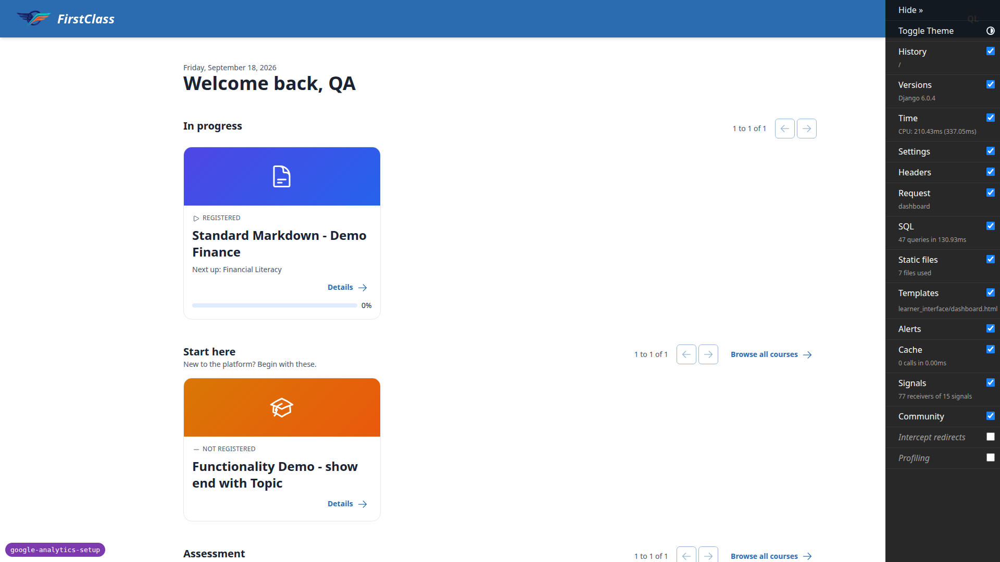

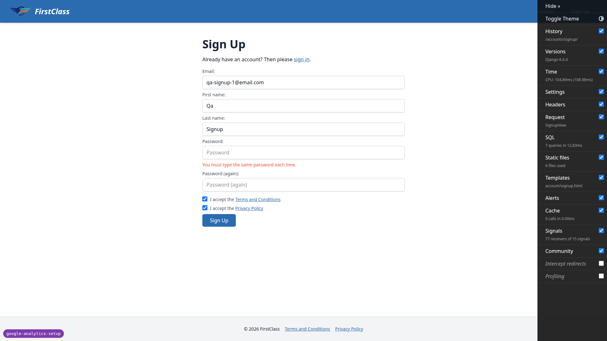

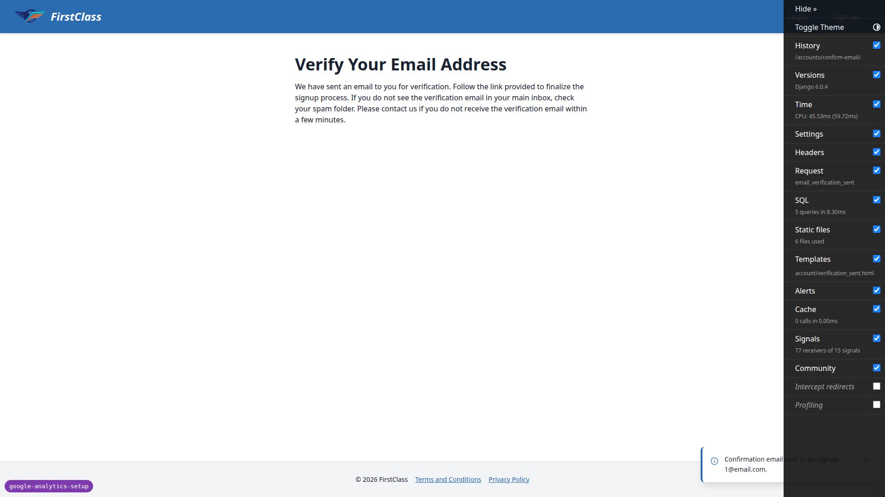

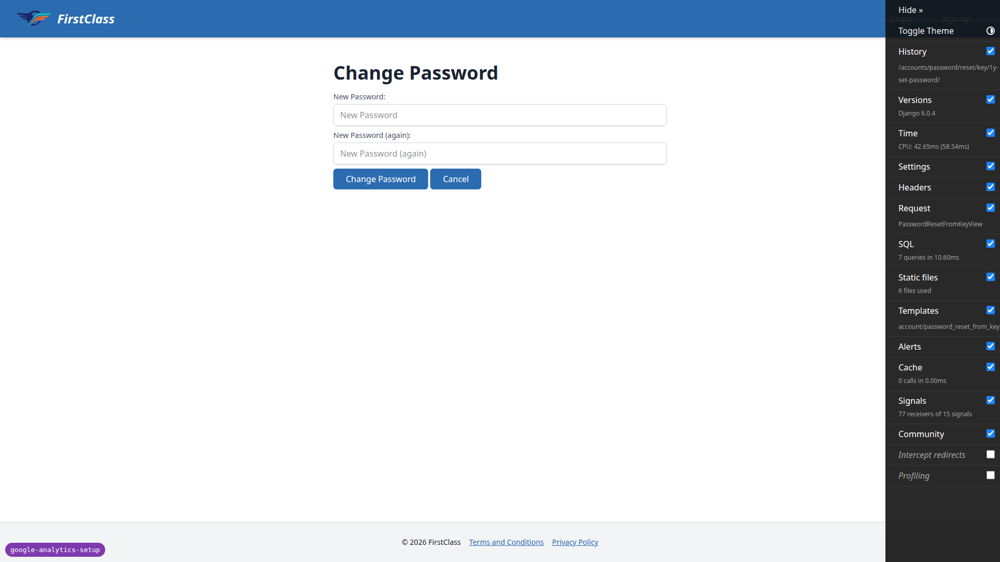

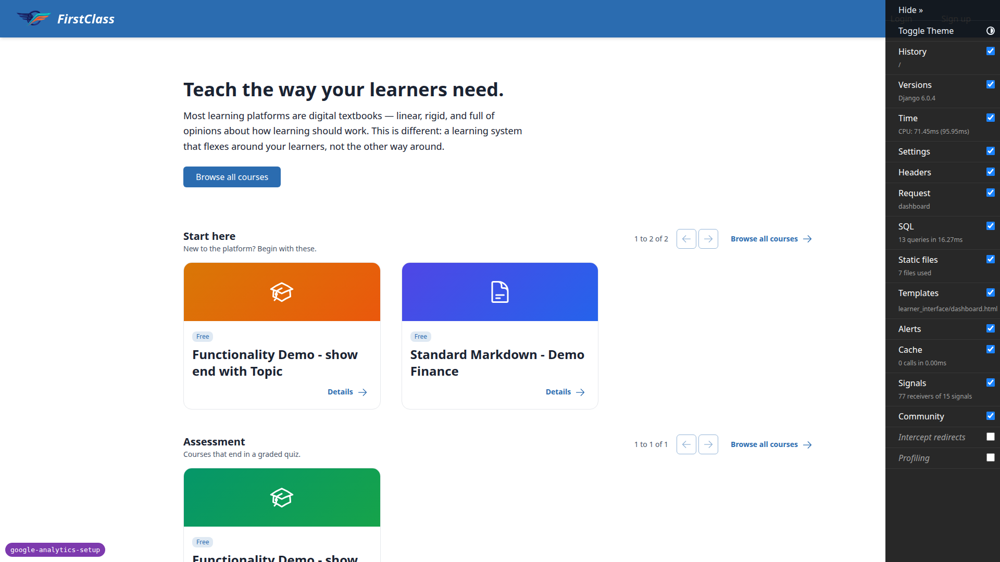

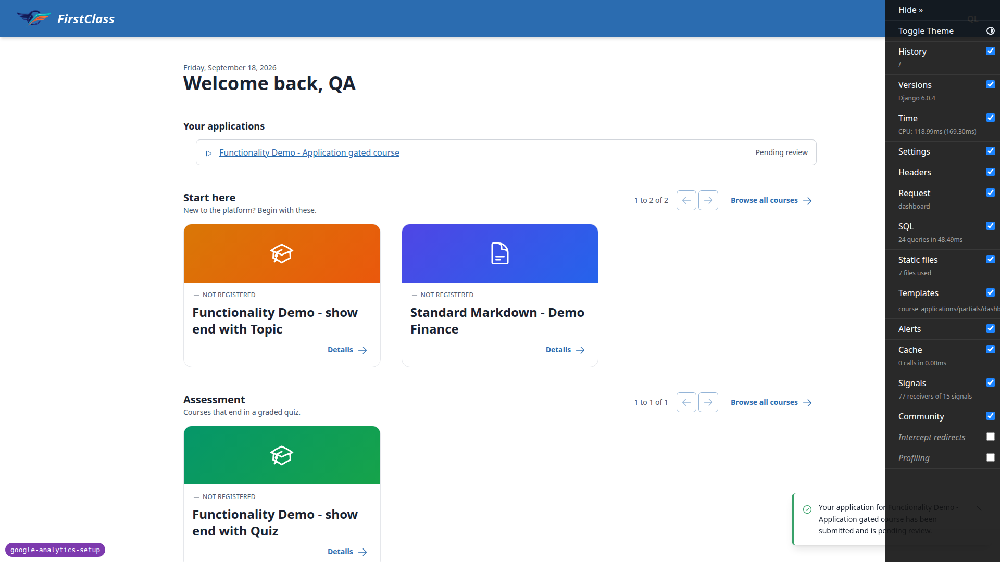

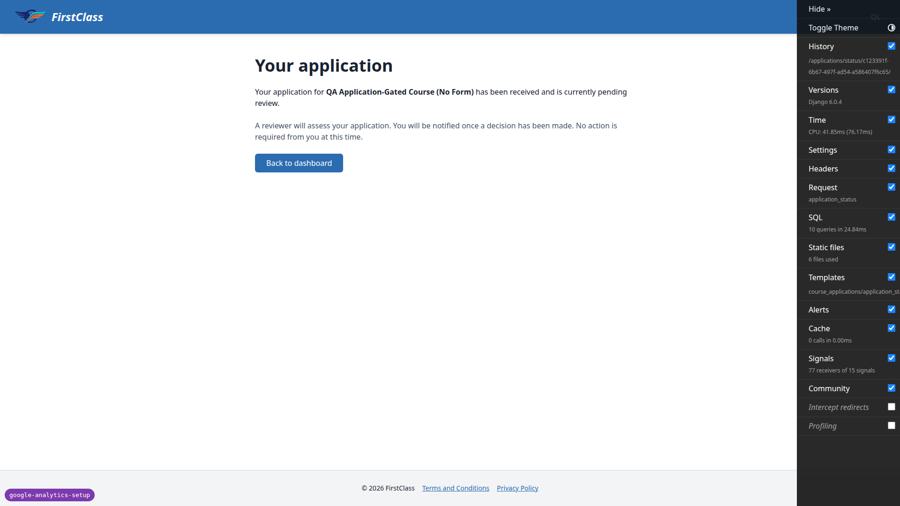

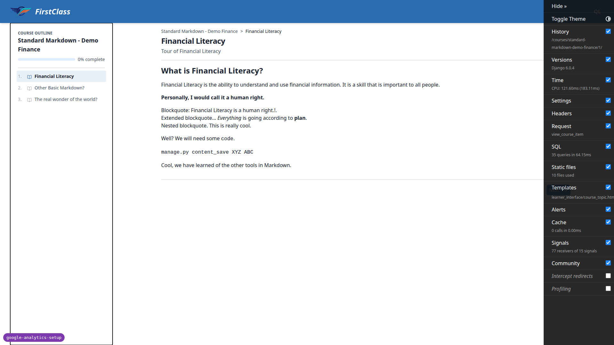

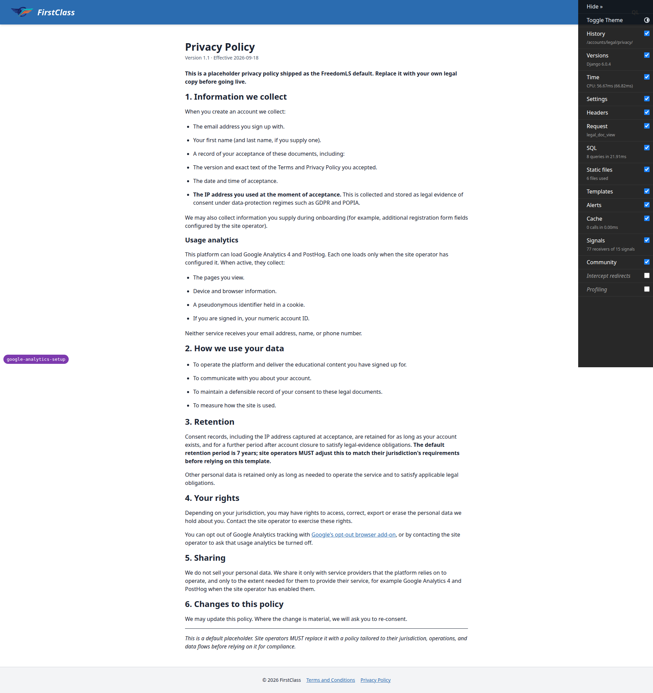

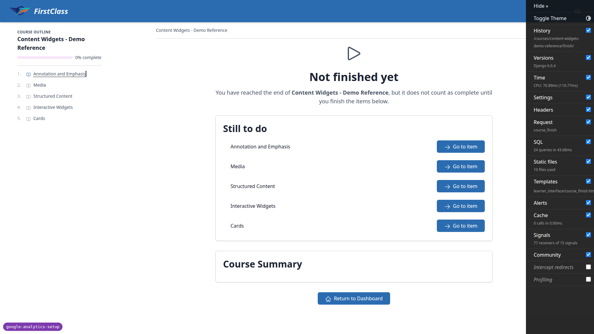

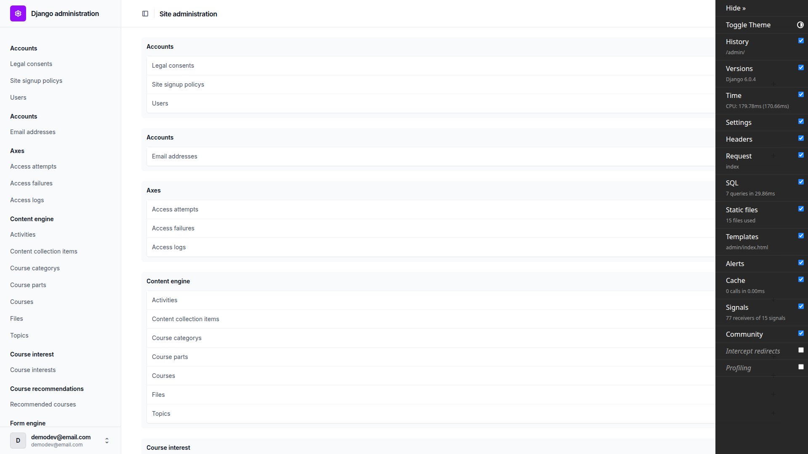

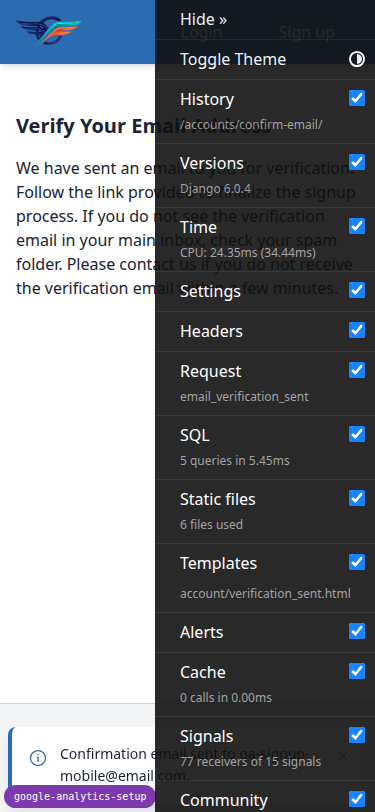

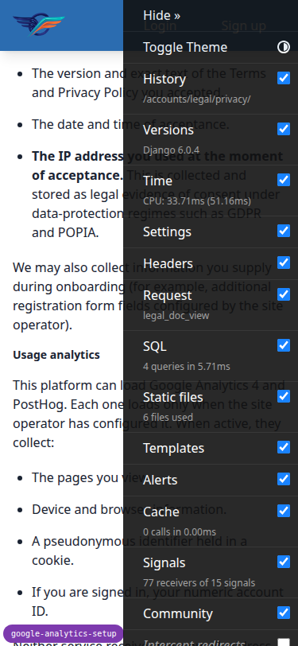

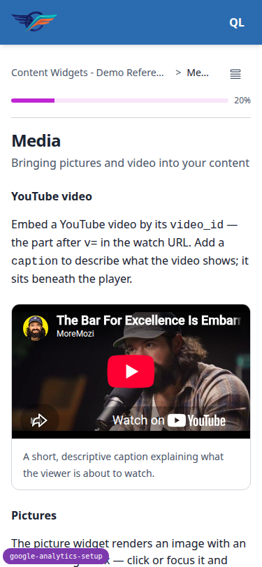

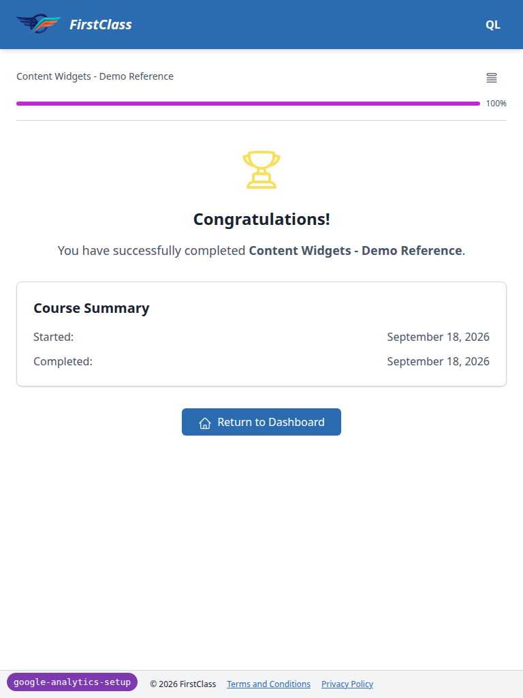

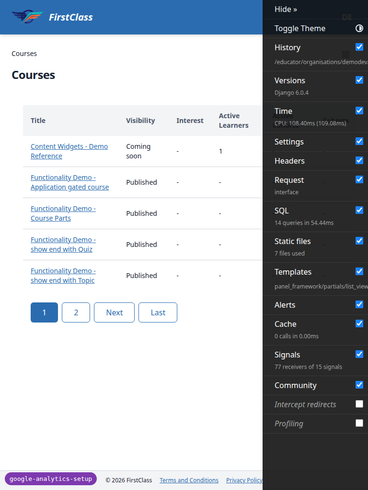

## 5. Bugs

No `bug` records were produced this run. No failures were found across any test step, at any
viewport.

## Bug status

No bugs recorded this run.

## 6. General notes

Observations made during the run that carry no required action:

- The plan's §3/§4 wording says to take confirmation and reset links from the runserver console.
  Dev mail actually goes through `QueuedEmailBackend` to SMTP `localhost:1025` (Mailpit), so the
  links were taken from the Mailpit API instead. The plan's wording should say Mailpit.
- §4.6 was run in its strict form: the sign-up POST did not follow the redirect, so the verify page
  never popped the flag, and the flag survived the token page and fired on `/`.
- §5.1.3: check-your-answers can't be reached with a required answer blank. The per-page server
  validation returns 422 "Missing answers", so that sub-step is not applicable.
- These CSP report-only violations predate this branch and are unrelated to it: `cdn.jsdelivr.net`
  scripts (htmx, alpine csp/collapse, chart.js) are not in `script-src` on main either. A
  demo-content image from `sanparks.org` is blocked by the remote CORP header
  (`ERR_BLOCKED_BY_RESPONSE.NotSameOrigin`).
- PostHog's `config.js` returns 404 for the fake key `phc_qatest`. This is expected.
- The Django debug toolbar's open panel intercepted clicks on the course player's Next button and
  the tablet nav toggle. This is dev-only.
- At tablet width, the educator drawer navigation did a full page load, not the desktop sidebar's
  in-document htmx swap. It still worked, and this branch doesn't touch it.
- The data helper added an uncommitted seed command,
  `freedom_ls/qa_helpers/management/commands/qa_create_ga_setup_seed.py`, which also ran
  `create_demo_data`, creating all demo sites.
- Transactional email subjects carry a "[FirstClass]" prefix on the DemoDev site. This was observed
  only; it's out of scope.

---

status: ok · reason: report rendered, 0 bugs documented
