# Frontend QA Report: Google Analytics 4

## 1. Methodology

Manual walk of `3. frontend_qa.md` with Playwright MCP, at desktop (1920x1080), mobile (375x812)
and tablet (768x1024). The dev server for this run was started on port 8774 with
`GOOGLE_ANALYTICS_MEASUREMENT_ID=G-QATEST0000` and `POSTHOG_API_KEY=phc_qatest`, and restarted once
without the GA variable (`POSTHOG_API_KEY=phc_qatest` only) to run test 1.1, then restarted again
with both variables for the rest of the plan.

Every check read one or more of: `window.dataLayer` (via
`JSON.stringify(Array.from(window.dataLayer || []).map(entry => Array.from(entry)))`), the resource
timing / network entries for `gtag/js` and PostHog requests, or the raw page source. Screenshots
were collected into `screenshots/` beside this report; every image referenced below was confirmed
to exist there before being embedded.

## 2. Diff scoping

Scoping class: **FULL**.

Changed files that triggered a full run:
- `freedom_ls/base/templates/_base.html`
- `freedom_ls/base/templates/_base_interface.html`
- `freedom_ls/base/templates/partials/google_analytics_events.html`
- `freedom_ls/base/google_analytics.py`
- `freedom_ls/learner_interface/views.py`
- `freedom_ls/course_applications/views.py`
- `freedom_ls/deployment/context_processors.py`
- `config/settings_base.py`
- `legal_docs/_default/privacy.md`

Skipped: nothing. The entire test plan ran.

## 3. Smoke gate

Outcome: **pass**.

Pages checked:
- `http://127.0.0.1:8774/`
- `http://127.0.0.1:8774/courses/qa-coming-soon-course/detail/`

## 4. Results

### Desktop (1920x1080)

| Test ID | Status | Note |
| --- | --- | --- |
| 1 | pass | Anonymous `/`: gtag/js requested, empty config, no FLS event; only console errors are expected PostHog 404s for the fake key. |
| 2.1-2.2 | pass | Learner A dashboard: config carries `user_id` `'69'`; GA4 script block does not contain the learner's email. |
| 7.1 | pass | First item of `standard-markdown-demo-finance`: one `course_started`, correct params, no `course_registered`. |
| 7.2 | pass | Reload of the same item: no `course_started`. |
| 7.3 | pass | "Next" is boosted (same document); no new `course_started`. |
| 7.4-7.5 | pass | "Finish Course" (boosted): one `course_completed`; no leftover script in `#interface-main` or elsewhere. |
| 7.6-7.7 | pass | Back/Forward: still one `course_completed`. Reload of completion page: none. |
| 7.1-two-courses | pass | Same session, `qa-second-course` first item: one `course_started` with the correct slug/UUID; first course's event did not suppress it. |
| 2.3 | pass | After logout, landing page config has no `user_id`. |
| 3.1-3.2 | pass | Fresh sign-up lands on verify page with exactly one `sign_up {method: email}`. |
| 3.3 | pass | Reload of verify page: no `sign_up`. |
| 3.4 | pass | Re-submitting the same email: enumeration-safe response, no `sign_up`. |
| 3.5 | pass | Mismatched passwords: form re-renders with error, no `sign_up`. |
| 4.1-4.3 | pass | `confirm-email/<key>/` loads neither snippet; both back after confirming. Plan correction: dev mail goes to Mailpit, not the console. |
| 4.4-4.5 | pass | Password-reset set-password page loads neither snippet; both back, and `user_id` `'70'`, after resetting. |
| 5.1 | pass | Application-gated course with form: no event on draft page or on the 422 (missing answers); one `course_access_requested` on success; none on reload, status page, or re-visiting apply URL. |
| 5.1.3-error | pass | Missing-answers 422 on the supporting documents page (screenshot only). |
| 5.2 | pass | No-form application course: no event on confirmation page; one `course_access_requested` on the status page after submit; none on re-visiting apply URL. |
| 5.3 | pass | "I'm interested" swaps in place with one `course_access_requested`; no leftover script; "Remove interest" adds no event; interested again adds one more; reload and `/courses/` add none. |
| 6.1-6.2 | pass | "Enrol for free" lands on item 1 with exactly two events in order: `course_registered` then `course_started`. |
| 6.3-6.4 | pass | Reload, and re-entering via the detail page CTA: neither event. |
| 6.6 | pass | Direct registration URL for the application-gated course redirects to the application status page; no `course_registered`. |
| 8.5 | pass | Footer Privacy link: version 1.1, "Usage analytics" section naming GA4 and PostHog, opt-out link present. |
| 8.5-courses-line | skip | See General notes — line is an uncommitted edit, not served from git HEAD. |
| 8.2 | skip | See General notes — DEBUG=True serves Django's technical 404, not the styled page. |
| 4.6 | pass | Pending sign-up survives the token page: no analytics on the token page; `sign_up` fires once on the next ordinary page (`/`); reload of `/`: none. |
| 5.4 | pass | Anonymous "I'm interested" redirects to sign-in (no event); after signing in as Learner C, one `course_access_requested` on the course page; reload and direct deferred-URL visit: none. |
| 6.5 | pass | With the registration deactivated, "Enrol for free" re-enters the course with no `course_registered`. |
| 7.8 | pass | Full-page route to the finish URL: exactly one `course_completed`; only one event script in the page source. |
| 7.9 | pass | Course with an unread topic: finish URL shows "Not finished yet"; no `course_completed`. |
| 7.2 | pass | Learner C, `qa-cohort-course`: one `course_started` with `registration_source: cohort`, no `course_registered`; "Finish Course" adds one `course_completed` with `registration_source: cohort`. |
| 8.1 | pass | Django admin loads with no console errors and no GA4/PostHog markup. |
| 8.3 | pass | Educator interface sidebar panel swaps work without reload; no FLS event in the data layer. |
| 8.4 | pass | Console errors across the run are only the expected PostHog 404s and one blocked demo-content image; no JS errors from the GA4/PostHog blocks; no CSP messages naming the analytics hosts. |
| 1.1 | pass | Server restarted without the GA variable: no GA4 request/globals on `/` or Learner A's dashboard; PostHog still initialised; expressing interest with GA off still swaps cleanly with no JS error. |
| 8.6 | pass | Every data layer read in the run contained only the five FLS events; no `tutorial_begin`, `tutorial_complete` or `generate_lead`. |

### Mobile (375x812)

| Test ID | Status | Note |
| --- | --- | --- |
| 5.3 | pass | Coming-soon course detail: no horizontal overflow; interest toggle swaps in place with the correct event; "Remove interest" button is 32px tall (see General notes). |
| 7-player-nav | pass | Course player: no overflow; outline opens as a bottom drawer, closes with Escape; no `course_started` on re-entry to an already-started course. |
| 7.4-7.5 | pass | "Finish Course" on `qa-second-course` (boosted): one `course_completed`; no leftover script; completion page lays out cleanly. |
| 3.1-3.2 | pass | Sign-out works; sign-up form fits 375px; submitting lands on verify page with one `sign_up`. |

### Tablet (768x1024)

| Test ID | Status | Note |
| --- | --- | --- |
| 7.1-7.5 | pass | Compact header with outline toggle, no fixed sidebar, no overflow; one `course_started` on the first item; boosted Next/Next/Finish Course adds one `course_completed`; no leftover script. |
| 5.3 | pass | Coming-soon detail: "I'm interested" swaps in place with the correct event; no leftover script; no overflow. |

### Screenshots

Desktop:
-  Test 1 — anonymous `/`, GA4 config with no `user_id`.
- 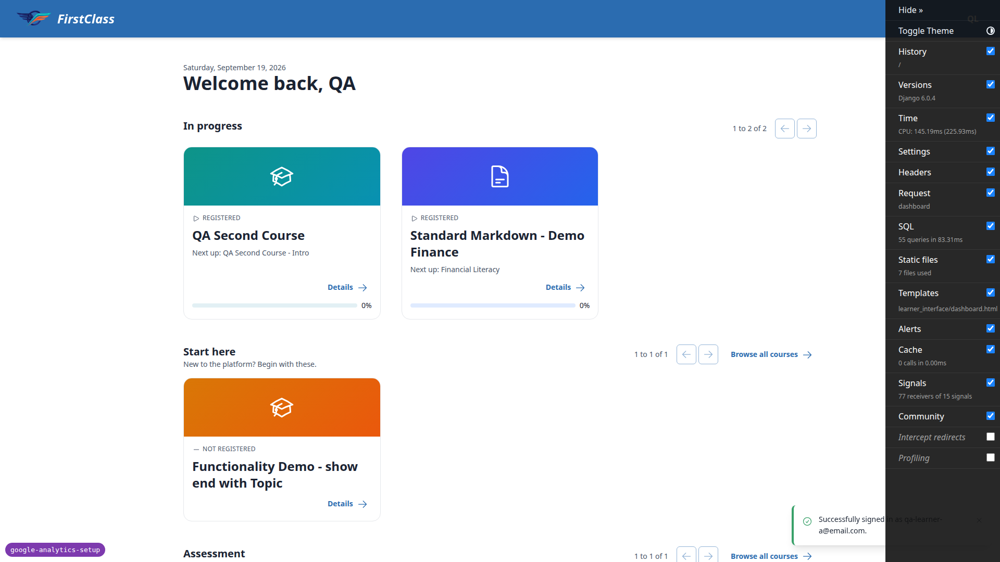 Test 2.1-2.2 — Learner A dashboard, `user_id` present.
-  Test 7.1 — first course item, `course_started` fired.
- 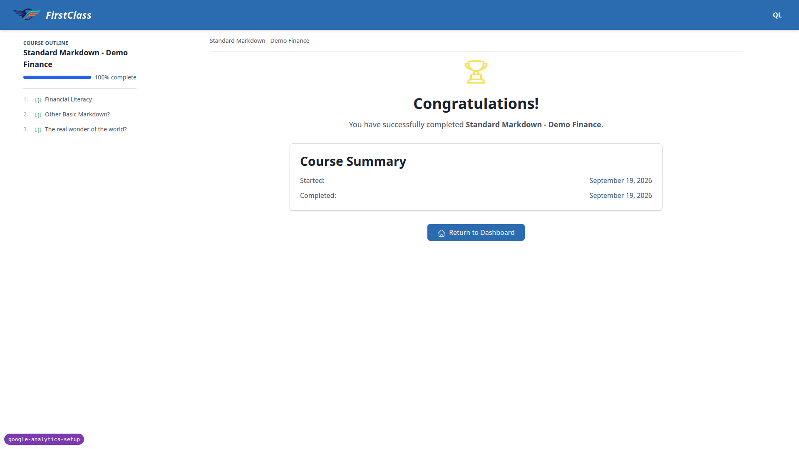 Test 7.4-7.5 — completion page, `course_completed` fired.
- 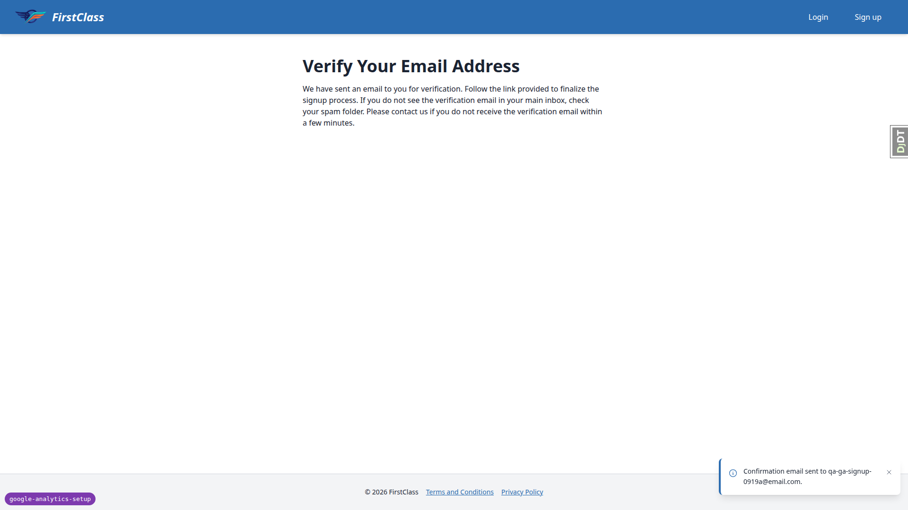 Test 3.1-3.2 — verify-your-email page after sign-up.
- 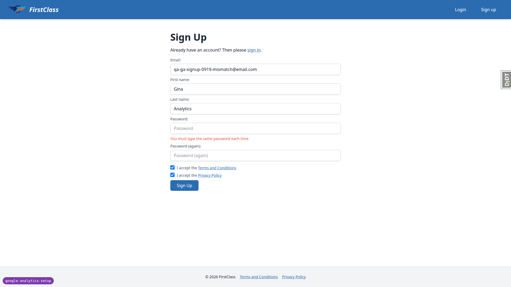 Test 3.5 — mismatched-password error re-render.
- 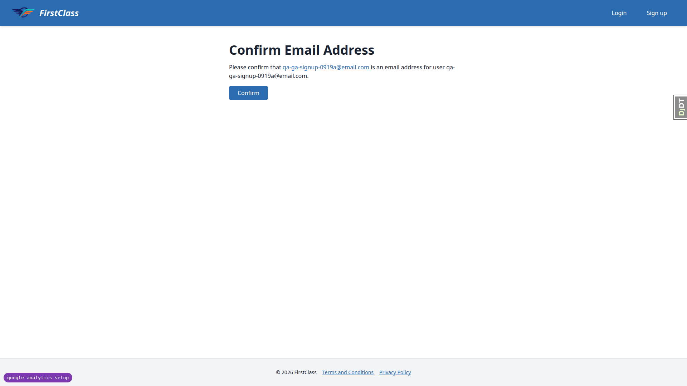 Test 4.1-4.3 — confirm-email token page, no analytics.
- 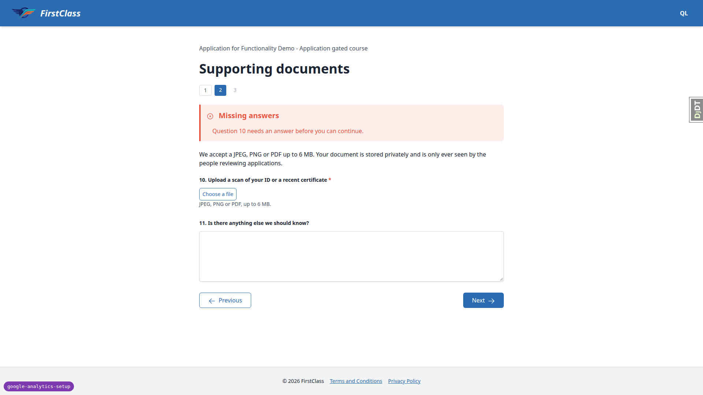 Test 5.1.3-error — missing-answers 422 on supporting documents page.
- 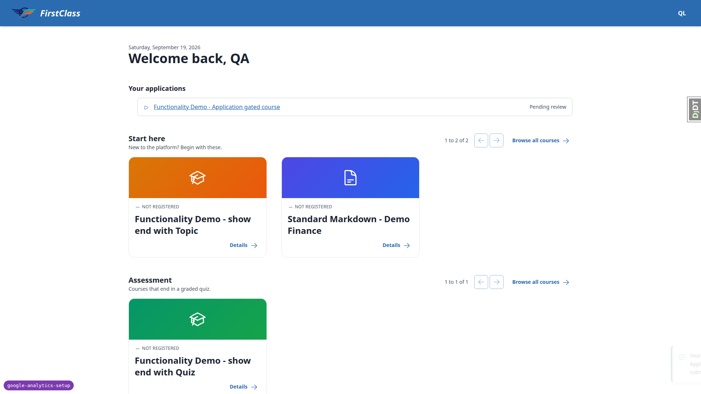 Test 5.1 — application success, `course_access_requested` fired.
- 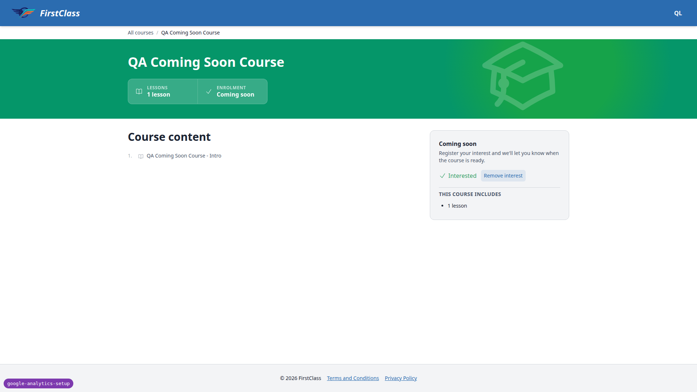 Test 5.3 — coming-soon course, interest toggled in place.
- 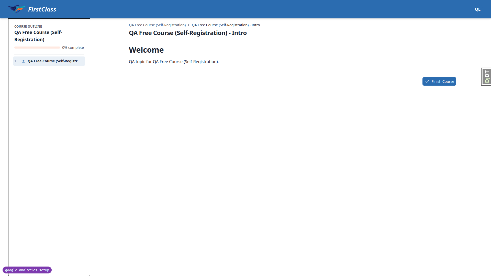 Test 6.1-6.2 — self-registration, two events in order.
- 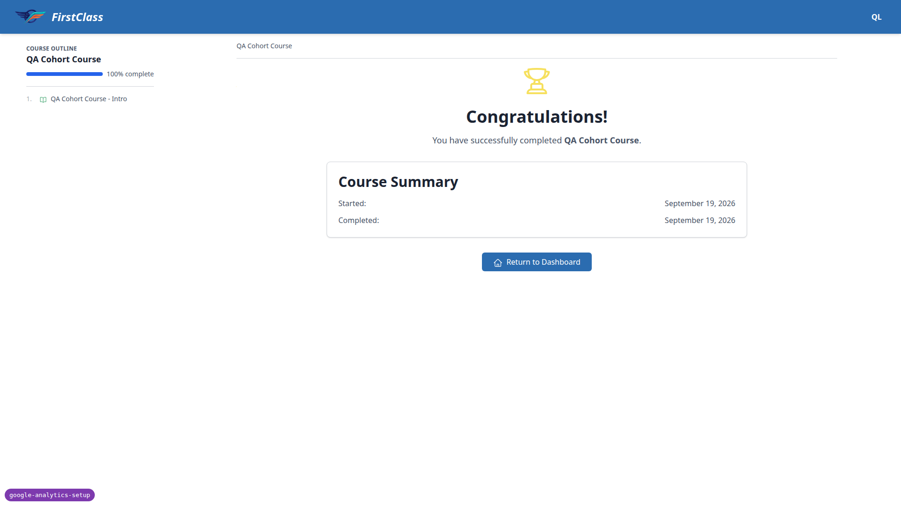 Test 7.2 (cohort learner) — `course_started`/`course_completed` with `registration_source: cohort`.
- 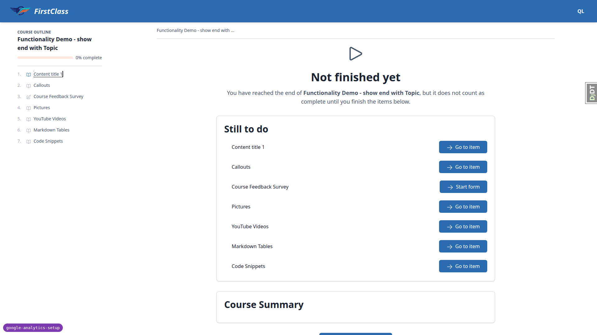 Test 7.9 — withheld completion, "Not finished yet".
- 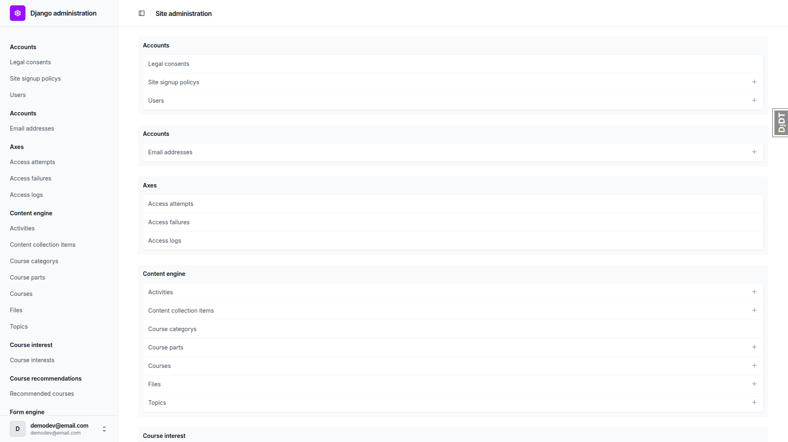 Test 8.1 — Django admin, no GA4/PostHog markup.

Mobile:
- 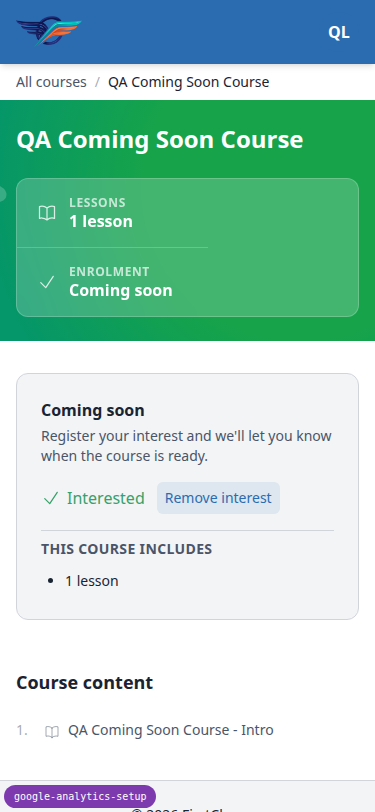 Test 5.3 (mobile) — coming-soon detail at 375px, interest toggle.
- 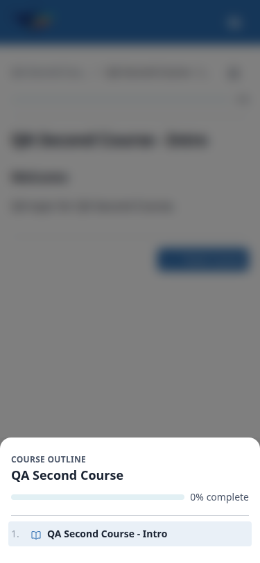 Test 7-player-nav (mobile) — course player outline drawer.
- 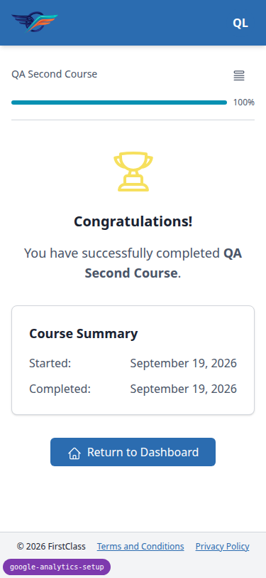 Test 7.4-7.5 (mobile) — completion on `qa-second-course`.
- 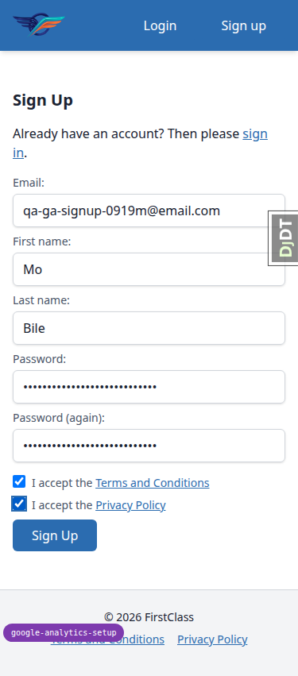 Test 3.1-3.2 (mobile) — sign-up form at 375px.

Tablet:
- 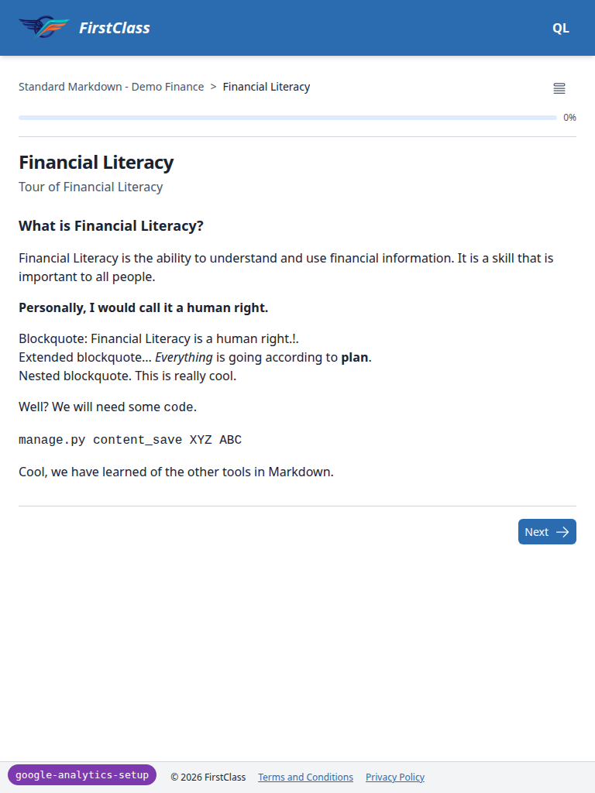 Test 7.1-7.5 (tablet) — compact header, course player at 768px.
- 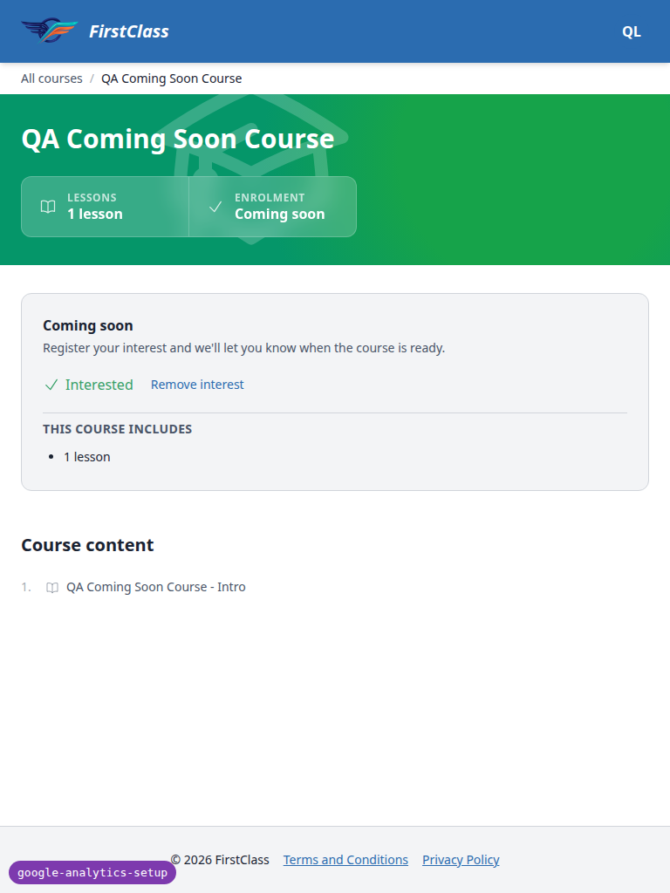 Test 5.3 (tablet) — coming-soon detail at 768px.

## 5. Per-bug sections

There are no `bug` records from this run — no bugs were found.

## Bug status

No bugs found.

## 6. General notes

### Skipped checks

- **8.5-courses-line** (desktop): the privacy-policy line "Which courses you request, register for,
  start and complete." is not on the served page. It exists only as an uncommitted edit to
  `legal_docs/_default/privacy.md`, and the page is served from git HEAD, exactly as the plan warns.
  Not a code defect; it will show once the edit is committed.
- **8.2** (desktop): the dev server runs with `DEBUG=True`, so a missing URL renders Django's
  technical "Page not found" page rather than the styled 404 template. The styled page could not be
  exercised in this setup. The only console entry was the 404 response itself.

### Plan corrections found during the run

1. Section 4 says to take confirmation and reset links from the `runserver` console, but dev mail
   goes to Mailpit at `localhost:8025`.
2. Sections 0.2.4/5.1 refer to a "By application" course, which does not exist by that title — the
   course is "Functionality Demo - Application gated course", slug
   `functionality-demo-application-gated-course`.
3. Section 5.1.3 cannot reach check-your-answers with a required answer missing, because the form
   blocks at the page with a 422.
4. The debug toolbar covers the course player's "Next" button as well as "Remove interest".

### Tangential observations

- The course detail CTA reads "Start course" for a learner who has already opened the first item
  (progress 0%).
- The "Remove interest" button is 32px tall on mobile.
- The `fls-dev:qa-data-helper` agent appended to its tracked note at
  `.claude/agent-memory/fls-dev-qa-data-helper/reference_application_forms_qa_baseline.md` on its
  first spawn. That edit is left uncommitted for review.

---
status: ok
reason: 0 bugs — nothing to fix; report rendered, screenshots verified
