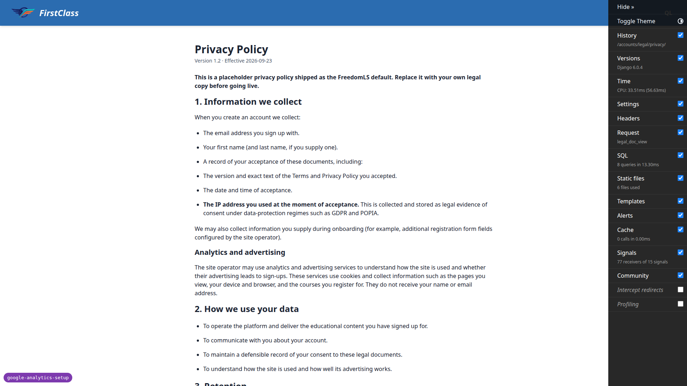

# QA Report: Google Analytics 4 and Google Ads Conversion Tracking

## Methodology

This run drove the real site in a browser via Playwright against a dev server on port 8984,
configured per the test plan's §0.1 with `GOOGLE_ANALYTICS_MEASUREMENT_ID=G-QATEST0000`,
`GOOGLE_ADS_CONVERSION_ID=AW-QATEST000`, `GOOGLE_ADS_CONVERSION_LABELS=sign_up=QAsignup,course_registered=QAregistered`
and `POSTHOG_API_KEY=phc_qatest`. Every assertion read `window.dataLayer` directly, or the page
source, or the network request list. Screenshots were collected into `screenshots/` beside this
report; every image referenced below exists there. The run also restarted the server six times to
exercise §1.1's unconfigured-deployment matrix, and once more with a `DEBUG=False` override to
check the styled 404 page.

## Diff scoping

Class: **FULL**. Files that triggered it:

- `freedom_ls/base/templates/_base.html`
- `freedom_ls/base/templates/_base_interface.html`
- `freedom_ls/base/templates/partials/google_analytics_events.html`
- `freedom_ls/course_interest/templates/course_interest/partials/express_interest_cta.html`
- `freedom_ls/base/google_analytics.py`
- `freedom_ls/deployment/context_processors.py`
- `freedom_ls/deployment/google_ads.py`
- `freedom_ls/deployment/checks.py`
- `freedom_ls/deployment/config.py`
- `freedom_ls/course_access/google_analytics.py`
- `freedom_ls/course_applications/views.py`
- `freedom_ls/course_interest/views.py`
- `freedom_ls/learner_interface/views.py`
- `config/settings_base.py`
- `legal_docs/_default/privacy.md`

The four `.html` template files in that list are what forced the FULL class. Nothing was skipped:
desktop, mobile and tablet passes all ran.

## Smoke gate

**Pass.** Pages loaded: `/` (dashboard, logged in as Learner A) and
`/courses/standard-markdown-demo-finance/detail/`.

## Results by section

### §1 The snippet loads, and only when configured (1.1–1.5)

All pass, signed out, on `/`:

- Network request to `https://www.googletagmanager.com/gtag/js?id=G-QATEST0000` observed.
- Data layer: `[js], [config, G-QATEST0000, {}], [config, AW-QATEST000]` — GA4 config object empty
  (no `user_id`, no `content_group`); the AW config sits directly after with no third element.
- `posthog.init('phc_qatest'` present in page source, unchanged.
- No FLS event and no `conversion` entry anywhere; no `tutorial_begin`/`tutorial_complete`/`generate_lead`.

Note: the IDs render JS-escaped in page source as `G-QATEST0000` / `AW-QATEST000`, so a
plain-text search for `AW-` misses them — later checks explicitly searched both spellings.

### §1.1 Unconfigured deployment stays silent (six restarts)

| Configuration | Result |
| --- | --- |
| PostHog key only | No googletagmanager request, `window.gtag` undefined, data layer empty, `posthog.init('phc_qatest'` still present |
| Logged in, no Google vars | Still no GA4, empty data layer; only console errors are the expected PostHog 404s from the fake key |
| GA4 without Ads | `[config, G-QATEST0000, {user_id: 69}]`, no `AW-` entry and no `AW-` in source (both spellings checked) |
| Ads without GA4 | `freedom_ls_deployment.W002` printed on startup; no googletagmanager request, `gtag` undefined, no `AW-` in source |
| Labels without Ads | `freedom_ls_deployment.W003` printed; signup as `qa-ga-nolabel@email.com` gave `[event, sign_up, {method: email}]` on the verify page with no conversion |
| `GOOGLE_ADS_CONVERSION_LABELS=sign_up` (malformed) | Startup refused: `ImproperlyConfigured "GOOGLE_ADS_CONVERSION_LABELS entry 'sign_up' is not of the form event_name=label."` |

### §2 user_id (2.1–2.3)

- Logged in as Learner A: `[config, G-QATEST0000, {user_id: '69'}]` — pk 69 rendered as a string.
- The GA4 script block renders only `gtag('config', 'G-QATEST0000', {user_id: '69',})` and the
  AW config; no email address anywhere in the block.
- After logout: GA4 config object is `{}` again — no `user_id`.

### §3 sign_up (3.1–3.5)

- Signup as `qa-ga-signup1@email.com` (screenshot `page-2026-09-23T06-24-42-190Z.png`): verify page
  data layer holds exactly `[config, G-QATEST0000, {}], [config, AW-QATEST000], [event, sign_up, {method: email}], [event, conversion, {send_to: AW-QATEST000/QAsignup}]` — one of each, conversion
  directly after `sign_up`.
- Reload of the verify page: config entries only, both events one-shot.
- Re-submitting the same email lands on the verify page (enumeration prevention) with no `sign_up`,
  no conversion.
- Mismatched passwords re-render the form with a validation message and no `sign_up`, no conversion.

### §4 Token-bearing pages (4.1–4.6)

- Confirm-email token page (screenshot `page-2026-09-23T06-25-39-092Z.png`): no
  googletagmanager/posthog network requests, `gtag`/`posthog` undefined, data layer empty, no `AW-`
  and no `posthog.init(` in source.
- After confirming, the sign-in page carries both snippets again, including `[config, AW-QATEST000]`.
- Password-reset set-password page for Learner B: neither snippet loads.
- After completing the reset, both snippets are back and `[config, G-QATEST0000, {user_id: '70'}]`
  — Learner B, auto-signed-in.
- Second signup (`qa-ga-signup2@email.com`) spent its `sign_up` + conversion pair on the verify page
  as expected; its confirm-email token page then carried no analytics at all, and `/` afterward
  showed no repeat of either event — matches the plan's documented allowed branch.

### §5 course_access_requested (5.1–5.4)

**5.1 Application-gated course with a form** (`functionality-demo-application-gated-course`):
draft pages carry no event; submitting page 1 with Q1 blank returns HTTP 422 with a validation
message and no event; completing all 3 pages and submitting produces exactly one
`[event, course_access_requested, {course_slug: functionality-demo-application-gated-course,
course_id: 271eeb30-94db-4261-b409-19888b0ead7d, access_type: application_gated, request_kind:
application}]` on the dashboard (screenshot `page-2026-09-23T06-30-18-506Z.png`), no conversion, no
`generate_lead`; reload does not repeat it; re-opening the apply URL redirects to the status page
with no event. Page 2's file upload correctly rejects a `.txt` with a "JPEG, PNG or PDF up to 6 MB"
message.

**5.2 No-form gated course** (`qa-application-gated-course-no-form`): confirmation page carries no
event; confirming produces exactly one `course_access_requested` with `access_type:
application_gated, request_kind: application` on the status page; re-visiting shows the status page
with no second event; no conversion anywhere.

**5.3 Coming-soon course, express interest via HTMX swap** (`qa-coming-soon-course`, screenshot
`page-2026-09-23T06-31-22-325Z.png`): data layer length 5 before the click; clicking "I'm
interested" swaps in place (navigation count stays 1) and adds exactly one
`course_access_requested {access_type: free, request_kind: interest}`; leftover script count in
`[id^=express-interest-cta-]` is 0. Removing interest adds nothing (length stays 6).
Re-expressing interest adds one more identical event (length 7), which the plan says is correct.
Reload adds no event; `/courses/` afterward carries no `course_access_requested` — already spent.

**5.4 Anonymous / deferred interest** (Learner C, `qa-coming-soon-course`): anonymous click
redirects to `/accounts/login/?next=...` with no event on the sign-in page; signing in as Learner C
lands back on the course page with exactly one `course_access_requested {access_type: free,
request_kind: interest}` and `user_id '74'`; reload adds no event; typing the deferred URL directly
redirects to the course page with no event.

### §6 course_registered (6.1–6.6, plus 6.5)

- Learner B enrols free on `qa-free-course-self-registration` (screenshot
  `page-2026-09-23T06-33-18-976Z.png`): exactly three FLS entries in order —
  `course_registered {registration_method: self_registration}`,
  `conversion {send_to: AW-QATEST000/QAregistered}`,
  `course_started {registration_source: individual}` — all with matching `course_slug`/`course_id`,
  nothing after.
- Reload of the course item, and returning via "Start course": none of the three entries repeat.
- Reactivation is not a registration: with `is_active=False` set on Learner B's registration
  (pk `0d04c36a-bb98-4252-b615-5ef0c533347d`), re-clicking "Enrol for free" puts her back in the
  course with no `course_registered`, no conversion, no `course_started`.
- Opening a gated course's `/access/` URL directly redirects to the application status page with no
  `course_registered` and no conversion.

### §7 course_started / course_completed (7.1–7.9, 7.1.1, 7.2.1–7.2.2)

- Learner A opens `standard-markdown-demo-finance` item 1: exactly one
  `course_started {registration_source: individual}`; no `course_registered`, no conversion.
- Reload, and clicking "Next" (HTMX boost, navigation count stays 1) into item 2: no repeat.
- "Finish Course" (boosted, screenshot `page-2026-09-23T06-36-21-209Z.png`) adds exactly one
  `course_completed`; no script under `#interface-main` contains it afterward.
- Browser back/forward keeps the `course_completed` count at 1; a full reload of the completion page
  adds none.
- Second course in the same session (`qa-second-course`): a fresh `course_started` fires with its
  own `course_slug`/`course_id` — the earlier course's event did not suppress it.
- Learner C, cohort course (`qa-cohort-course`): `course_started {registration_source: cohort}`, no
  `course_registered`; "Finish Course" gives exactly one `course_completed {registration_source:
  cohort}` — no conversion anywhere in §7 (neither event is mapped to a label).
- After the data helper reset Learner A's `CourseProgress.completed_time` to null, typing the finish
  URL directly still produced exactly one `course_completed` — proving a single include point.
- Learner A's `functionality-demo-show-end-with-topic` (0 of 7 topics complete): direct finish URL
  renders "Course not complete" with no `course_completed`.

### §8 Nothing else broke (8.1–8.7)

- Django admin (screenshot `page-2026-09-23T06-38-41-012Z.png`): data layer empty, `gtag` undefined,
  no `G-`/`AW-` id and no `posthog.init(` in source — the admin does not extend `_base.html`.
- Styled 404 page, checked via a `DEBUG=False` restart on the same port: correct title/body content,
  data layer holds only the two config entries, no FLS event, no JS errors. (Extra static-file 404s
  in that run came from uncollected static files in the temporary rig, not the product.)
- Educator interface HTMX navigation (Learners → Courses panels, navigation count stays 1): data
  layer keeps only the two config entries, no FLS event.
- **FAIL — 8.4**, CSP report-only violation on the Google Ads script host. Documented as **Bug B1** below.
- **FAIL — 8.5**, privacy policy names no analytics service and has no opt-out link. Documented as **Bug B2** below.
- No `tutorial_begin`, `tutorial_complete` or `generate_lead` appeared anywhere in the run,
  including the two application flows in §5.
- Every `conversion` entry seen this run sat directly after a mapped event with the right
  `send_to`: `sign_up → AW-QATEST000/QAsignup` (§3, §4.6), `course_registered →
  AW-QATEST000/QAregistered` (§6). No conversion appeared after `course_access_requested`,
  `course_started` or `course_completed`, and none appeared alone.

### Mobile pass (375×812)

- Coming-soon course interest swap (screenshot `page-2026-09-23T06-41-43-269Z.png`): identical
  correct behaviour to desktop — one `course_access_requested`, leftover script count 0, no
  horizontal overflow (`scrollWidth` 375 = `innerWidth`), CTA button 293×40.
- Course player (screenshot `page-2026-09-23T06-41-58-610Z.png`): `functionality-demo-show-end-with-topic`
  item 1 fires exactly one `course_started {access_type: free, registration_source: individual}`, no
  overflow.
- Dashboard (screenshot `page-2026-09-23T06-42-13-327Z.png`): no overflow, header collapses to a
  40×40 avatar menu (Profile / Sign Out), opening it pushes nothing to the data layer.

### Tablet pass (768×1024)

- Course player (screenshot `page-2026-09-23T06-42-36-539Z.png`): no overflow; re-opening the same
  item already-started on mobile adds no second `course_started` — correct one-shot behaviour across
  viewports.
- "Next" boost: no new FLS event, no overflow.
- `/courses/` grid (screenshot `page-2026-09-23T06-42-49-895Z.png`): cards reflow with no overflow;
  data layer holds only the two config entries.

## Bug B1: CSP script-src omits googleads.g.doubleclick.net, so the Google Ads conversion script violates the policy

**Manifestations:** 8.4, desktop.

**Expected:** Per test plan 8.4, no CSP report-only warning should name googletagmanager.com,
google-analytics.com, googleadservices.com, doubleclick.net, googlesyndication.com, google.com or
google.co.za.

**Actual:** Every page carrying the Google Ads tag logs a CSP report-only violation: loading the
script `https://googleads.g.doubleclick.net/pagead/viewthroughconversion/QATEST000/...` violates
`script-src self unsafe-inline https://www.googletagmanager.com https://www.googleadservices.com
https://www.google.com https://*.i.posthog.com`. `SECURE_CSP_REPORT_ONLY` lists
`googleads.g.doubleclick.net` under `img-src` and `connect-src` but not under `script-src`, yet the
Ads loader injects a script element from that host. `pagead2.googlesyndication.com` has the same
asymmetry and would violate identically if the tag reached it. Reproduced on `/` and `/courses/`.
The policy is report-only today, so nothing is blocked, but if it were ever enforced the Ads
conversion script would be.

## Bug B2: Privacy policy names no analytics service and offers no opt-out link

**Manifestations:** 8.5, desktop.

**Screenshot:** 

**Expected:** Per test plan 8.5: version 1.2, a usage-analytics section naming Google Analytics 4
and PostHog, a line saying analytics records which courses a learner requests, registers for,
starts and completes, an advertising-measurement section naming Google Ads, plus a GA opt-out link
and a Google Ads settings link.

**Actual:** Version 1.2 and the effective date are correct, and there is an "Analytics and
advertising" subsection, but it names no service — "Google Analytics 4", "PostHog" and "Google Ads"
appear nowhere on the page, there is no course-lifecycle line, and section 4 "Your rights" carries
no opt-out link — no `google.com` link anywhere on the page. The rendered page matches
`legal_docs/_default/privacy.md` at git HEAD exactly, so this is the shipped text, not a rendering
fault.

## Bug status

- **UNRESOLVED** — CSP script-src omits googleads.g.doubleclick.net (reason: security-adjacent, needs human review)
- **UNRESOLVED** — Privacy policy names no analytics service and offers no opt-out link (reason: needs a product/legal decision)

## General notes

- Both failures were triaged to the red lane deliberately: B1 touches a Content-Security-Policy
  header, which is security-adjacent, and B2 turns on a product/legal decision about whether the
  default privacy policy should name vendors. Neither was auto-fixed.
- B1's omission is already present in the implementation plan's own Task 8 CSP list, so the code
  faithfully implements the plan and the plan is what is short an entry.
- B2 stems from branch tip commit `ea9297d6`, which deliberately genericised the privacy wording
  after the previous QA pass. The genericising may well be intended for a distributable product;
  what is harder to defend is that the opt-out links went with it, and that the test plan was never
  updated to match.
- The IDs render JS-escaped in the page source as `G-QATEST0000` and `AW-QATEST000`, so a naive
  search for `AW-` in the HTML misses them. Worth knowing for anyone re-running this plan.
- Pre-existing and unrelated to this diff: the CSP report-only header also does not cover
  `cdn.jsdelivr.net`, so htmx, two Alpine plugins and chart.js each log a report-only violation on
  every page. These name no analytics host, so they are outside §8.4's scope, but they are noise in
  the console.
- Setting application-form field values by script assignment did not register with the form; real
  typing worked first time. That is a tooling note about how the form is driven, not a product
  defect.
- The screenshot collection step moved 227 files into `screenshots/`: 14 PNGs plus 136 Playwright
  `.yml` accessibility snapshots and 77 `.log` console captures. Only the PNGs are referenced by
  this report. The `.log` files are new relative to the previously committed run and are worth
  pruning if that volume is not wanted in the repo.
- Not covered in the browser, by the plan's own design: `generate_lead`, `content_group`, and
  conversion-label escaping — all three are covered by unit tests instead.

---
status: ok
reason: 2 bugs — 0 fixed, 2 unresolved (both triaged to the red lane: B1 security-adjacent, B2 needs a product decision); report rendered, screenshots verified
