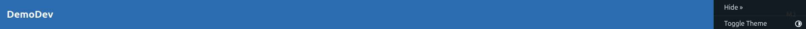
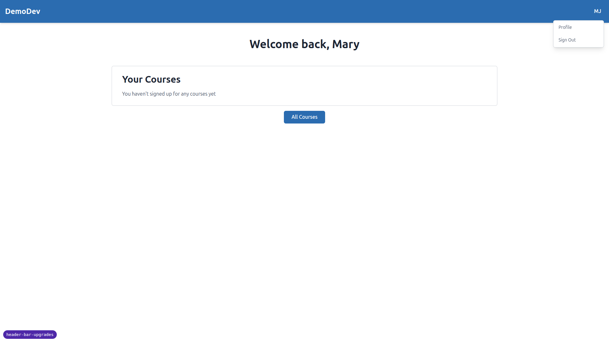
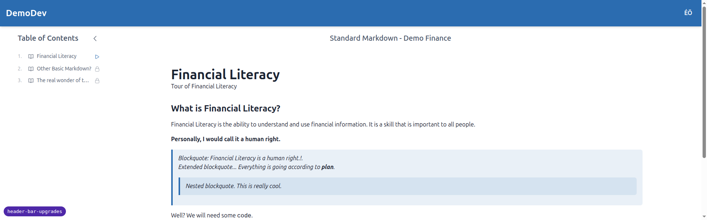
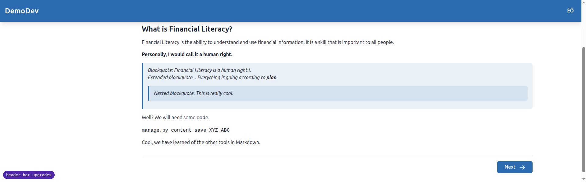
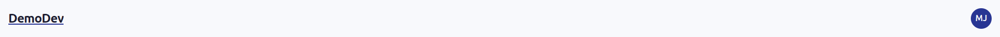
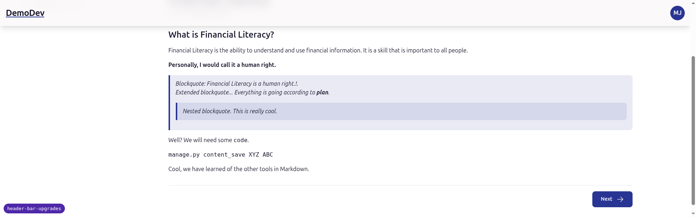
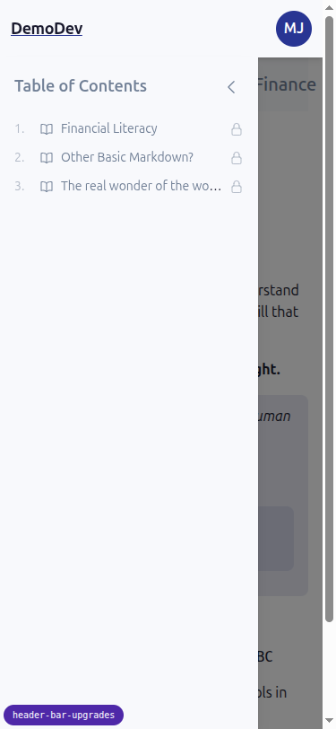
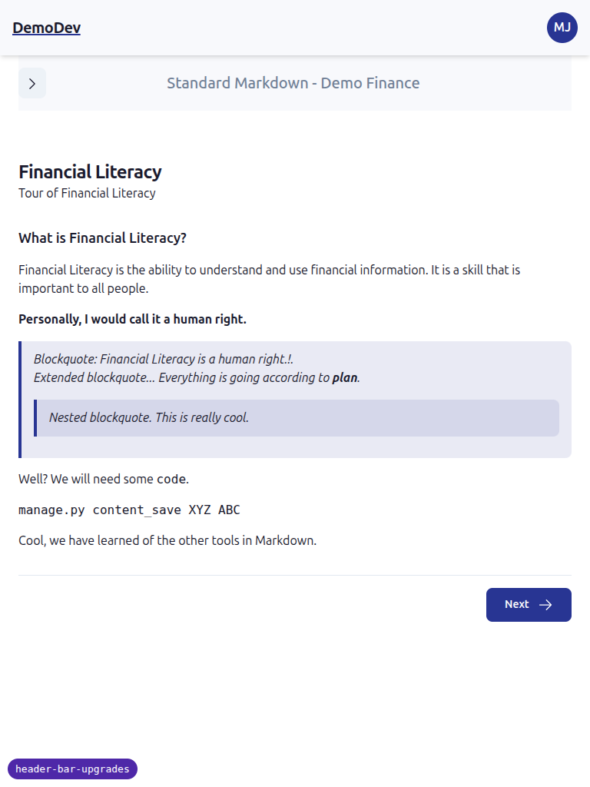

# Header bar upgrades — QA report

## Environment

- Default theme tested at `http://127.0.0.1:8619` (FLS_THEME=default)
- first_class theme tested at `http://127.0.0.1:8605` (FLS_THEME=first_class)
- Site: DemoDev (forced via `FORCE_SITE_NAME` in dev settings)
- Test users created on DemoDev via the qa-data-helper agent (all six listed in the spec).

## Summary

- 14 of 15 tests pass.
- 1 minor bug found: avatar trigger `aria-label` does not include the user's last name.
- 1 small caveat: prefers-reduced-motion was verified by code inspection only — Playwright MCP does not expose `emulateMedia`, so functional emulation could not be performed in-browser.
- No regressions to existing buttons / chips / focus rings / alerts.

---

## Bugs

### Bug 1 — Avatar `aria-label` missing last name

**Test:** Test 3 (default theme dropdown opens, accessibility) — also confirmed in Test 7 (first_class).

**Expected:** `aria-label="Open user menu for Mary Jane"` (per spec section "Test 3").

**Actual:** `aria-label="Open user menu for Mary"` for `mary.jane@demodev.example.com` (first_name="Mary", last_name="Jane").

`freedom_ls/base/templates/partials/header_bar_user_menu.html:3` interpolates `{{ user.display_name }}` into the aria-label, and `User.display_name` (`freedom_ls/accounts/models.py:118`) returns `self.first_name or self.email`. So whenever both first and last name are set, only the first name reaches the aria-label.

Side effect: for users with no first_name (`noname@`, `123@`), the email is used instead, e.g. `aria-label="Open user menu for noname@demodev.example.com"`. Reading the entire email aloud in a screen reader is awkward but the spec only specifies the multi-name case.

**Suggested fix:** either change the aria-label to use `user.get_full_name()` (with a sensible fallback when both names are blank), or add a dedicated `User.full_display_name` property that returns `"first last"` when both are present. Then update the test in `freedom_ls/accounts/tests/test_models.py` accordingly.

---

## Test results

| # | Test | Result | Notes |
| --- | --- | --- | --- |
| 1 | Default: avatar appearance (Mary Jane) | ✅ | 40px brand-coloured circle, semibold "MJ", no caret, no name text. |
| 2 | Default: avatar variants matrix | ✅ | All six users render the expected initials / fallback icon (table below). |
| 3 | Default: dropdown a11y | ⚠️ | Dropdown opens; `aria-haspopup="menu"`, `aria-expanded` toggles correctly; Escape closes the menu. **`aria-label` is wrong** — see Bug 1. |
| 4 | Default: sticky + scrolled shadow | ✅ | `position: sticky`, `data-scrolled` flips on scroll, box-shadow upgrades from `shadow-md` to `shadow-lg` and reverts at top. |
| 5 | Default: scroll-padding for anchors / focus | ✅ | `html { scroll-padding-top: 80px }` (5rem) — header is 72px tall. |
| 6 | Default: reduced motion | ⚠️ (code only) | `motion-reduce:transition-none` class is on the header. Playwright MCP cannot toggle `prefers-reduced-motion` on the page so I verified by inspecting the markup; functional emulation needs DevTools (or `Page.emulateMedia`, not exposed by the MCP). |
| 7 | first_class: avatar appearance | ✅ | White-ish header (`#F8F9FC`), dark site title, deep indigo avatar pill (`#283593`) with white "MJ". |
| 8 | first_class: contrast | ✅ | White-on-indigo ≈ 10:1; dark-on-white-ish ≈ 16:1 (well above WCAG AA 4.5:1). |
| 9 | first_class: scrolled translucent + blur | ✅ | At `scrollY=200`, `background-color` resolves to `oklch(... / 0.85)` and `backdrop-filter: blur(12px) saturate(1.5)`. Returns to opaque + no backdrop at top. |
| 10 | first_class: contrast under translucency | ✅ (estimated) | The translucent state still composites onto a light surface. Avatar is fully opaque indigo regardless, so its 10:1 contrast holds. Site title sits on a header at 0.85 alpha over body content; visually readable in the screenshot. |
| 11 | first_class: reduced motion | ⚠️ (code only) | Same caveat as Test 6 — `motion-reduce:transition-none` is in the markup but not functionally emulated. |
| 12 | first_class: scroll-padding | ✅ | Same `scroll-padding-top: 80px`. |
| 13 | Both themes: dropdown close-on-scroll | ✅ | Confirmed. Dropdown closes on any scroll event. The behaviour feels acceptable on the now-sticky header — not jarring in casual use. |
| 14 | Both themes: regression on existing surfaces | ✅ | Brand-coloured "Start" buttons on the courses list still resolve to `--color-primary` (`rgb(40, 53, 147)` in first_class). No leakage from the new `--color-header*` tokens. |
| 15 | Both themes: sidebar / mobile sidebar still works | ✅ | At 375×812: hamburger opens sidebar; backdrop covers content area below the header (header rect 0..64, backdrop rect 64..812 — backdrop does **not** overlap the header); tapping backdrop closes the sidebar. Header avatar stays visible and clickable while sidebar is open. |

### Avatar variants matrix (Test 2)

| User email | Expected | Actual | Result |
| --- | --- | --- | --- |
| `mary.jane@demodev.example.com` | `MJ` | `MJ` | ✅ |
| `single.first@demodev.example.com` | `MA` | `MA` | ✅ |
| `multi.token@demodev.example.com` | `MJ` | `MJ` | ✅ |
| `noname@demodev.example.com` | `NO` | `NO` | ✅ |
| `123@demodev.example.com` | fallback icon | fallback icon (40px circle, indigo bg in first_class / brand bg in default) | ✅ |
| `elise@demodev.example.com` | `ÉÖ` | `ÉÖ` (U+00C9, U+00D6) | ✅ |

---

## Notes / things not directly under test

- The Django Debug Toolbar overlays in the bottom-left can intercept pointer events in tests; in the dev environment it cosmetically covers a corner of the viewport but does not affect production.
- Test data (the six avatar QA users) was created via the qa-data-helper agent on the DemoDev site. A reusable management command was not added — the script lives at `/tmp/create_avatar_qa_users.py`. Promote it to `qa_helpers` if these users are wanted long-term.
- `prefers-reduced-motion` could not be toggled via the Playwright MCP (no `emulateMedia` support); coverage for Tests 6 and 11 is therefore limited to confirming the right Tailwind class is on the header. If you want runtime confirmation, run a Playwright test with `page.emulateMedia({ reducedMotion: 'reduce' })`.
