# QA Report — Header bar upgrades

Branch: `header-bar-upgrades` (verified via `debug-branch-badge` on both servers).
Tester: Playwright MCP, on the DemoDev site, at desktop 1920×1080, mobile 375×812, tablet 768×1024.
Themes covered: `default` (port 8212), `first_class` (port 8339).
Test data: created via the `qa-data-helper` agent (`qa_create_header_bar_users` management command).

## Summary

**14 of 15 tests pass; Test 7 has a visual regression** (site title is underlined). One additional observation worth noting (not a regression — see "Observations" below): the focus ring colour in the default theme is the same as the header background, so the ring's *outer* halo is invisible against the header — only the white ring-offset stays visible. This is by design (`--color-focus-ring` resolves to `--color-primary`) and pre-dates this change, but it's perceptually subtle on the now-sticky header.

## Bugs found

### Bug 1 — Site title rendered with underline

**Failed test:** Test 7 (also visible at Test 1 in default but much subtler).

**Expected:** the site title text (`{{ site_title }}`, e.g. "DemoDev") is plain bold text — no underline — in both themes.

**Actual:** the `<a href="/">` wrapper around the `<h1>` site title has a computed `text-decoration: underline`, so the title renders underlined. In the default theme the underline is currentColor (white) on blue and is muted but present; in first_class it's dark on light and is clearly visible.

Computed style on the wrapper link:
- `text-decoration-line: underline`
- Inner `<h1>` overrides to `text-decoration-line: none`, but the parent `<a>`'s decoration still propagates onto the rendered glyphs.

The wrapper `<a>` exists on `main` too, so the underlined-title issue pre-existed; the first_class theme rewrites in this branch make it newly-prominent. Recommend fixing on this branch (it's directly within scope of the header rework, and Test 7 is failing visually).

Suggested fix: add `no-underline` (or equivalent) to the `<a href="/">` in `freedom_ls/base/templates/partials/header_bar.html:7`, then assert in a template/regression test that the rendered link has no `text-decoration: underline`.

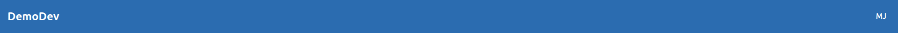

## Test results

| # | Test | Theme | Result |
|---|---|---|---|
| 1 | Default avatar appearance (Mary Jane) | default | PASS |
| 2 | Avatar variants (6 users) | default | PASS |
| 3 | Dropdown opens, accessibility (aria-label, haspopup, expanded, Escape) | default | PASS |
| 4 | Sticky header + scrolled shadow step | default | PASS |
| 5 | Anchor / focus scroll-padding (`scroll-padding-top: 80px`) | default | PASS |
| 6 | Reduced motion → instant shadow change | default | PASS |
| 7 | first_class avatar appearance (indigo on white) | first_class | **FAIL** (site title underline) |
| 8 | first_class contrast (avatar / title) | first_class | PASS |
| 9 | first_class translucent + blur on scroll | first_class | PASS |
| 10 | first_class contrast under translucency | first_class | PASS |
| 11 | first_class reduced motion | first_class | PASS |
| 12 | first_class anchor / focus padding | first_class | PASS |
| 13 | Dropdown close-on-scroll | both | PASS |
| 14 | Regression — primary buttons unchanged | both | PASS |
| 15 | Mobile sidebar still works under sticky header | default | PASS |

## Test 1 — Default avatar appearance (Mary Jane)

PASS. Mary Jane shows a 40×40 circular avatar with `MJ` (semibold, white) on the brand-blue header background `rgb(43, 108, 176)` (`#2B6CB0`). Avatar bg matches header bg → visually merged. No caret, no name/email text. Identical at 375 px width.

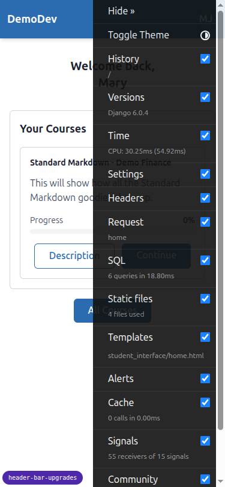

## Test 2 — Avatar variants

All six users render the expected initials or fallback icon:

| User | Expected | Observed | Screenshot |
|---|---|---|---|
| `mary.jane@…` | MJ | MJ | `desktop_1_default-mary.png` |
| `single.first@…` | MA | MA | `desktop_2_avatar_single_first.png` |
| `multi.token@…` | MJ | MJ | `desktop_2_avatar_multi_token.png` |
| `noname@…` | NO | NO | `desktop_2_avatar_noname.png` |
| `123@…` | user-icon SVG | SVG (`role="img" aria-label="user"`) | `desktop_2_avatar_123_fallback.png` |
| `elise@…` | ÉÖ | ÉÖ (diacritics preserved) | `desktop_2_avatar_elise_diacritics.png` |

The fallback (`123@…`) renders the user-icon SVG in the same 40×40 circle (`bg-header-action`), confirming a uniform avatar shape regardless of code-path.

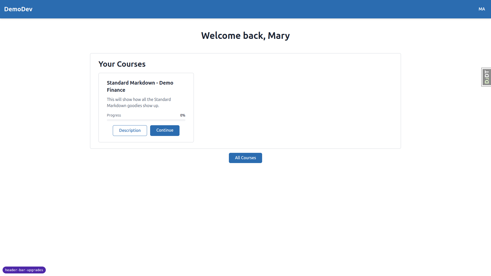
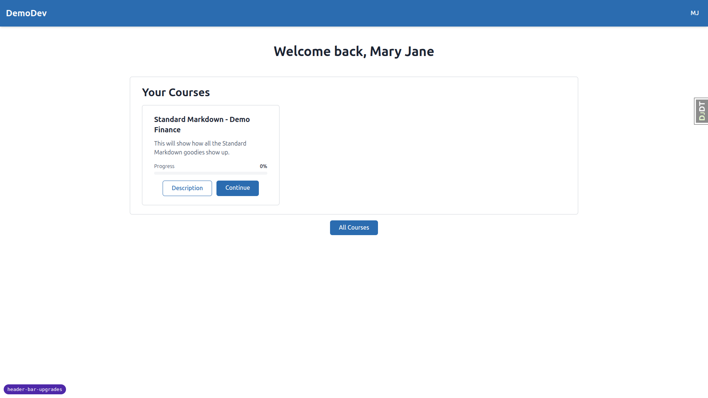
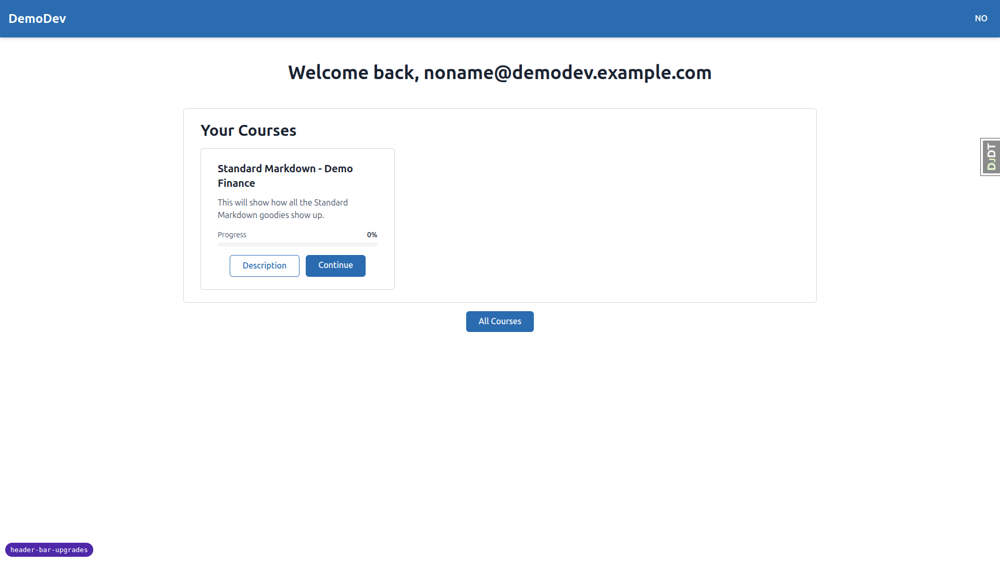
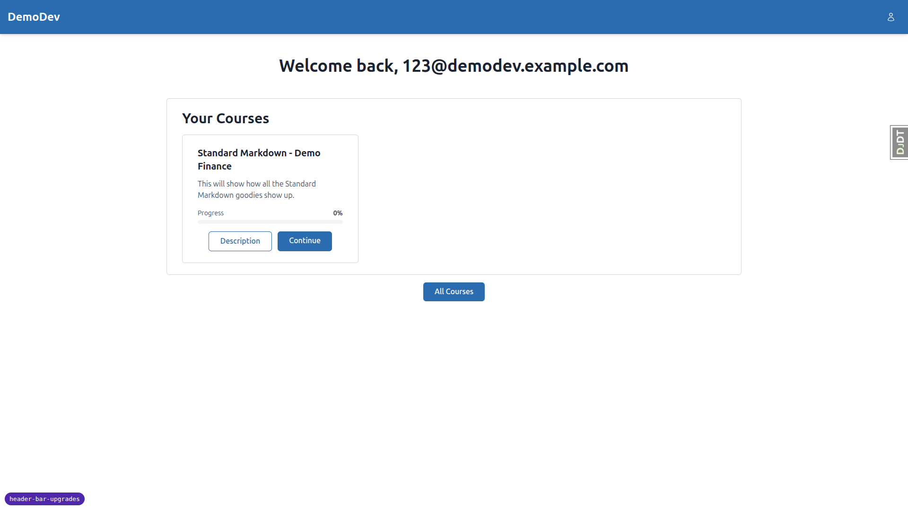
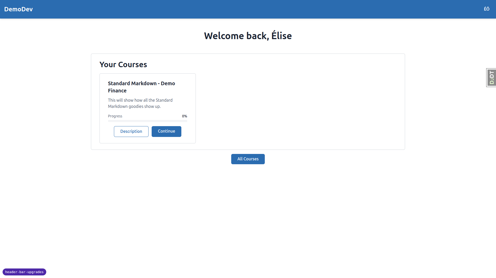

## Test 3 — Dropdown / accessibility

PASS. Inspecting the avatar trigger:

- `aria-label="Open user menu for Mary Jane"` ✓
- `aria-haspopup="menu"` ✓
- `aria-expanded` flips `false` → `true` on click and back to `false` on Escape ✓
- Dropdown contains Profile + Sign Out (no Educator/Admin links because Mary Jane is a student) ✓

Focus ring: when the avatar is focused, the computed `box-shadow` shows the expected 2 px white ring-offset + 4 px `var(--color-focus-ring)` ring. See observation under "Observations" — in default the ring colour equals the header background.

## Test 4 — Default theme: sticky + scrolled shadow

PASS.

- At `scrollY === 0`: header at `top:0`, `position:sticky`, `z-index:30`, `box-shadow` = `shadow-md` (`0 4px 6px -1px rgba(0,0,0,0.1), 0 2px 4px -2px ...`).
- At `scrollY > 0` (tested at 400 px): `data-scrolled="true"`, `box-shadow` becomes `shadow-lg` (`0 10px 15px -3px ..., 0 4px 6px -4px ...`). Header remains fully opaque (`rgb(43,108,176)`), `backdrop-filter: none`. Header height ≈ 72 px.
- Returning to top resets `data-scrolled` to null and box-shadow to baseline.

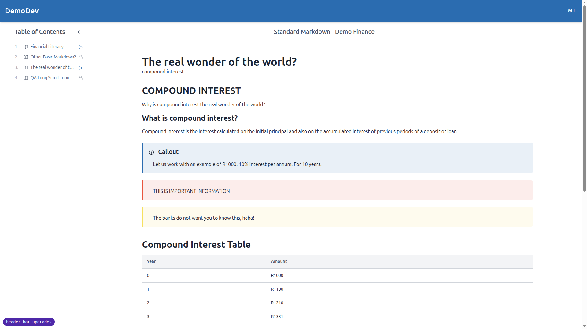

## Test 5 — Anchor / focus scroll-padding

PASS. `getComputedStyle(html).scrollPaddingTop === "80px"` (≈ header height 72 px + breathing room). Anchor jumps and Tab-focus to off-screen elements will land below the sticky header.

## Test 6 — Reduced motion (default)

PASS. With `prefers-reduced-motion: reduce` emulated:

- `getComputedStyle(header).transitionProperty === "none"` (the `motion-reduce:transition-none` utility kicks in)
- The shadow-step on scroll is therefore instant.

## Test 7 — first_class avatar appearance

**FAIL** — see "Bug 1 — Site title rendered with underline" above. Avatar itself is correct; the failure is on the site title rendering.

Avatar checks (all pass):

- `--color-header` = `#F8F9FC`, header bg = `rgb(248,249,252)` ✓
- `--color-header-action` = `#283593` (deep indigo), avatar bg matches ✓
- Avatar text white, semibold, "MJ" ✓
- Site title color `rgb(26,26,46)` (dark) on the white header — reads cleanly ✓
- No caret, no name text, identical 40×40 footprint as default theme.

## Test 8 — first_class contrast

PASS (computed via `getComputedStyle()` and the WCAG 2.x relative-luminance formula):

- Avatar text (white) on `--color-header-action` (indigo) → **10.39:1** (≥ 4.5:1) ✓
- Site title (`text-on-header` `#1A1A2E`) on `--color-header` (`#F8F9FC`) → **16.20:1** (≥ 4.5:1) ✓

## Test 9 — first_class scrolled state (translucent + blur)

PASS.

- At `scrollY === 0`: `bg = rgb(248,249,252)` (fully opaque), `backdrop-filter: none`, header sits flush against the page surface (which is also `--color-surface` → no visible seam).
- At `scrollY > 0`: `bg = oklch(0.982… / 0.85)` (translucent at 0.85 alpha), `backdrop-filter: blur(12px) saturate(1.5)` ✓. Box-shadow steps to `shadow-lg`.
- Scrolling back to top returns to fully opaque + `backdrop-filter: none` + baseline shadow.

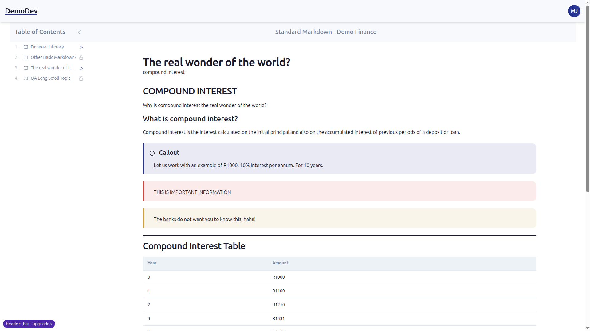

## Test 10 — first_class contrast under translucency

PASS. Worst-case analysis: composite `bg-header/85` (`#F8F9FC` at 0.85 alpha) over the darkest body element it could overlap (page text `#1A1A2E`):

- Effective header bg ≈ `rgb(215, 216, 221)` (still light grey)
- Site title contrast on this worst-case bg = **11.99:1** (≥ 4.5:1) ✓
- Avatar text contrast unchanged (`bg-header-action` is fully opaque, no alpha) → **10.39:1** ✓

No tuning of the alpha is required.

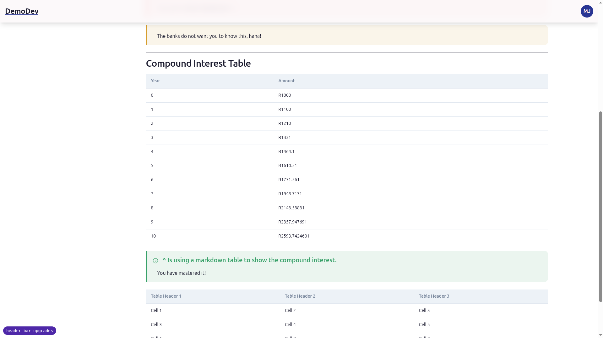

## Test 11 — first_class reduced motion

PASS. Same as Test 6 — `transition-property` resolves to `"none"` under `prefers-reduced-motion: reduce`. The colour-and-blur transition is therefore instant.

## Test 12 — first_class anchor / focus padding

PASS. `scroll-padding-top: 80px` is the same global value, applied via the root selector — works in both themes.

## Test 13 — Dropdown close-on-scroll (both themes)

PASS in both themes. After clicking the avatar (`aria-expanded` → `"true"`), scrolling 100 px instantly closes the dropdown (`aria-expanded` → `"false"`).

The spec explicitly defers any change to this behaviour. Observation: on the now-sticky header it does feel slightly abrupt — opening the menu and then nudging the wheel even slightly snaps it shut. This is consistent with the spec's note that any UX change here is out of scope; flagged here so the deferred follow-up has data.

## Test 14 — Regression on existing surfaces

PASS.

- Default theme `/courses/`: primary buttons (`btn-primary`) computed bg = `rgb(43, 108, 176)` (= `--color-primary`). Unchanged.
- first_class `/courses/`: primary buttons computed bg = `rgb(40, 53, 147)` (= `--color-primary` = `#283593`). Unchanged.

The new `--color-header*` tokens did not leak into surface/primary utilities.

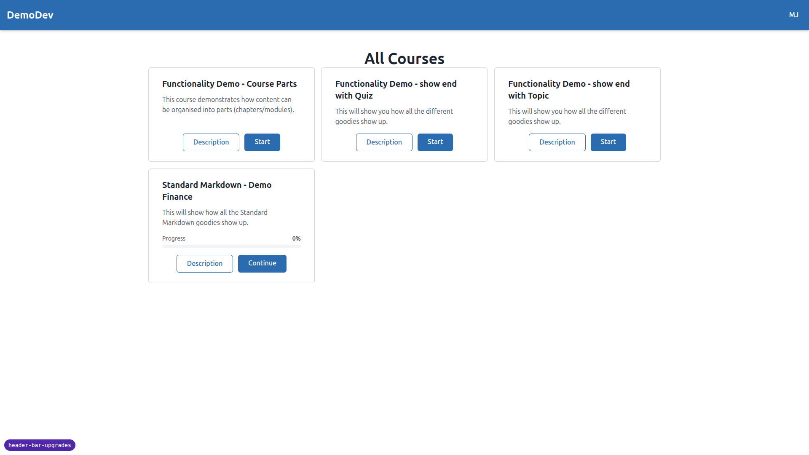
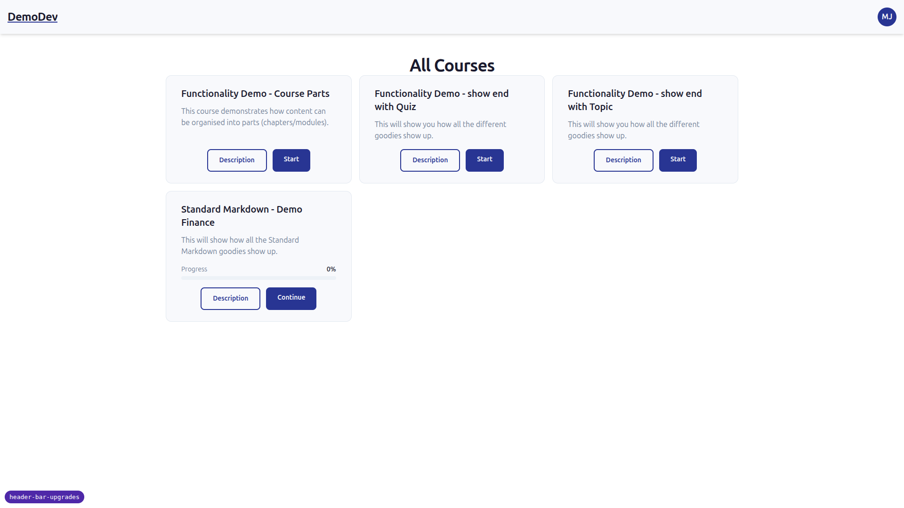

## Test 15 — Mobile sidebar still works under sticky header

PASS (default theme; behaviour is the same in first_class).

- Header rect: y=0, height=64 px, z-index=30.
- Sidebar backdrop rect: **y=64, height=748** — backdrop intentionally starts *below* the header, leaving the avatar accessible while the drawer is open.
- Drawer itself is z-40 (above both), as expected.

The avatar element-from-point at the visual centre still resolves to the avatar ``, confirming the header is not occluded.

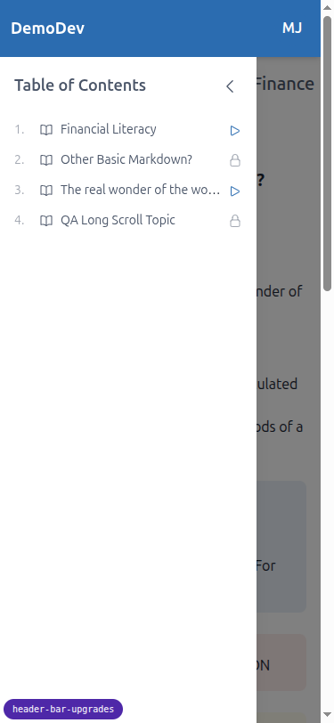

## Mobile + tablet checks (first_class)

Spot-checked the sticky header on long topic pages:

- Mobile (375×812): top-of-page renders as expected (white-ish header, indigo avatar, no caret). On scroll, translucent + blur kicks in. Header height stays at 64 px on mobile per the responsive padding.
- Tablet (768×1024): identical behaviour to desktop. Title is readable, avatar is touch-target sized, no overflow or layout breakage.

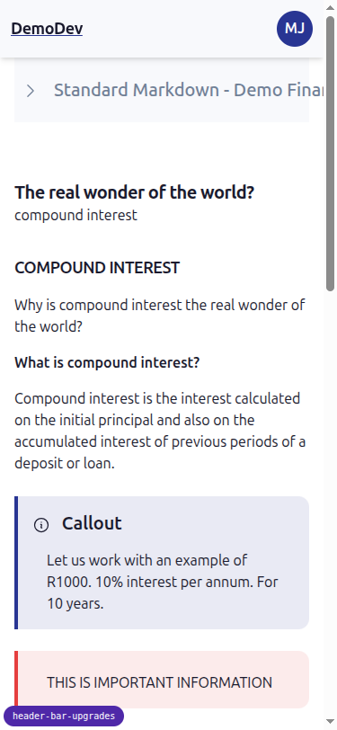
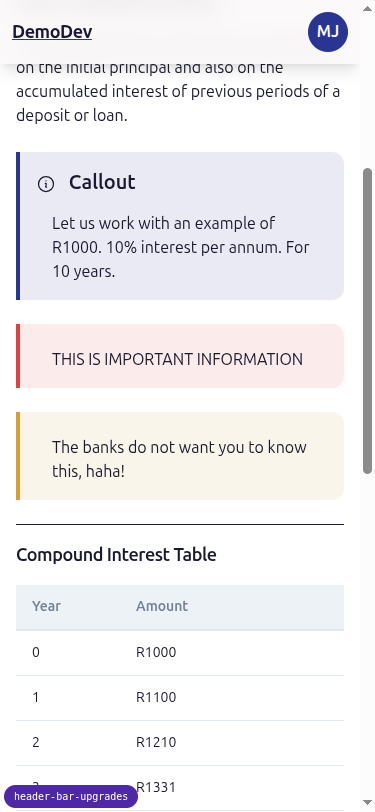
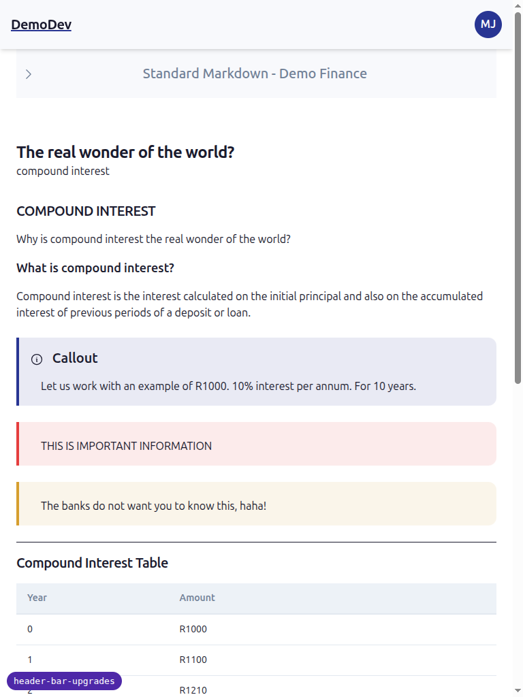
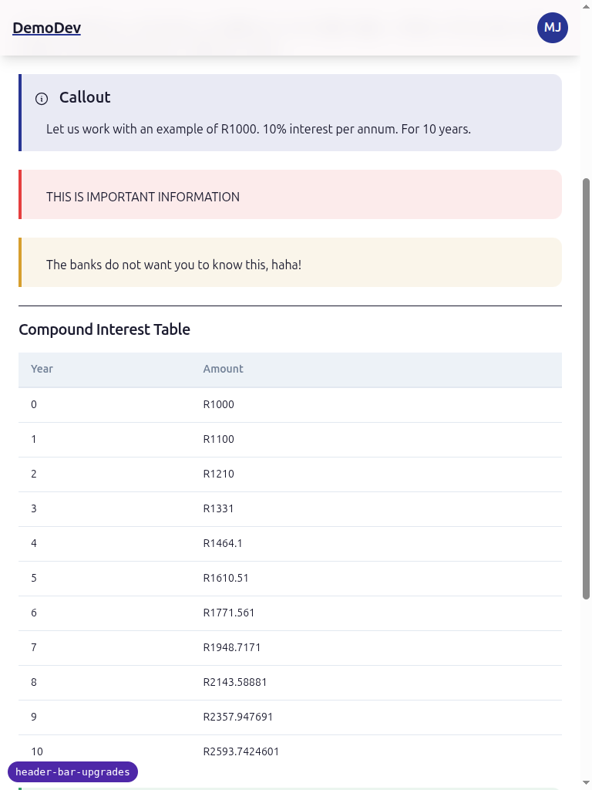

## Observations (not blockers)

1. **Default focus ring colour ≈ header bg.** `--color-focus-ring` resolves to `--color-primary` (`#2B6CB0`), which is *also* the header background in the default theme. The 2 px white ring-offset is what's actually visible against the header — the outer 4 px ring blends in. Functionally a focus indicator is present; visually it's subtle. Pre-existing token wiring; not introduced by this change. Worth a follow-up to either give the focus ring its own dedicated token, or to use a contrasting colour when the focus ring is over `--color-header`.

2. **Dropdown close-on-scroll feels abrupt on sticky header.** Spec already calls this out as deferred; confirming here that the UX impression matches the spec's prediction.

3. **`elise@…` aria-label uses the full localized name** (`Open user menu for Élise Önen`) — diacritics carry through to assistive tech correctly.

## Difficulties / not tested

- **Anchor jump live test.** The default DemoDev topic page does not auto-generate `id` attributes on headings, so I could not click an in-page anchor link. I verified `scroll-padding-top: 80px` via computed style — the browser uses this for both anchor jumps and sequential focus, so the behaviour is guaranteed by CSS. If you want a live demo of an anchor click, the spec's test plan would need either ToC links or auto-id'd headings, which is unrelated to this feature.

- **Test 13 "feels acceptable" subjective rating.** Recorded under Observations; not a pass/fail item per the spec.
